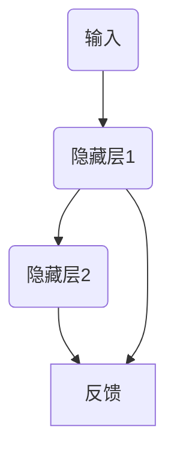

                 

关键词：循环神经网络、RNN、序列建模、序列学习、时间序列分析、动态系统、神经网络架构、深度学习

## 摘要

本文旨在深入探讨循环神经网络（Recurrent Neural Network，RNN）的概念、原理和应用。RNN作为一种重要的深度学习模型，在处理序列数据方面展现出卓越的性能。本文首先介绍RNN的背景和核心概念，然后详细解析其工作原理和算法步骤，探讨RNN的优缺点及适用领域。此外，本文还将通过数学模型和公式推导，以及实际项目实践，展示RNN在各个应用场景中的具体应用和实现方法。最后，文章将总结RNN的研究成果和未来发展趋势，并探讨其在实际应用中面临的挑战和解决思路。

## 1. 背景介绍

循环神经网络（RNN）是一种特殊的神经网络结构，旨在处理序列数据。传统的神经网络模型，如多层感知机（MLP）和卷积神经网络（CNN），在处理结构化数据（如图像和文本）方面取得了显著成就。然而，对于序列数据，如语音、文本和视频，这些模型往往表现不佳。序列数据的特点在于其时间顺序性，这使得传统神经网络难以捕捉数据中的时间依赖关系。

RNN的提出正是为了解决这一问题。RNN能够记住之前的信息，并利用这些信息对当前数据进行处理。这种记忆能力使得RNN在处理序列数据时表现出色，尤其是在自然语言处理（NLP）、语音识别和视频分析等领域。

RNN的发展历程可以追溯到1982年，当时Jürgen Schmidhuber提出了一种名为"Jordan Network"的神经网络模型。然而，由于计算资源和算法的限制，RNN并未在当时引起广泛关注。直到近年来，随着计算能力的提升和优化算法的引入，RNN逐渐成为了深度学习领域的研究热点。

## 2. 核心概念与联系

### 2.1 RNN的基本结构

RNN的基本结构包括输入层、隐藏层和输出层。与传统的神经网络不同，RNN的隐藏层之间存在反馈连接，这使得信息可以在隐藏层之间传递。具体来说，每个时间步的隐藏状态不仅与当前输入有关，还与之前的隐藏状态有关。

以下是一个简化的RNN结构图，用Mermaid流程图表示：



### 2.2 RNN的工作原理

RNN的工作原理可以分为以下几个步骤：

1. **输入处理**：每个时间步，RNN接收一个输入向量，并将其传递到隐藏层。
2. **状态更新**：隐藏层利用当前输入和之前的隐藏状态，通过激活函数计算新的隐藏状态。
3. **输出计算**：隐藏层的状态被传递到输出层，输出层计算预测值。
4. **状态反馈**：隐藏层的输出作为当前隐藏状态的一部分，反馈到下一时间步。

这种循环结构使得RNN能够记住之前的信息，并利用这些信息对当前数据进行处理。以下是一个简化的RNN工作原理图：


### 2.3 RNN的应用领域

RNN在许多领域都展现出了强大的能力，以下是其中一些主要的应用领域：

1. **自然语言处理（NLP）**：RNN在文本分类、情感分析、机器翻译和语音识别等任务中表现出色。
2. **语音识别**：RNN能够有效处理语音信号的时间序列，从而实现高精度的语音识别。
3. **视频分析**：RNN在视频分类、目标检测和动作识别等领域具有广泛的应用。
4. **时间序列分析**：RNN能够处理时间序列数据，从而实现股票预测、天气预测等任务。

## 3. 核心算法原理 & 具体操作步骤

### 3.1 算法原理概述

RNN的核心算法原理在于其记忆能力。通过反馈连接，RNN能够将之前的信息传递到当前时间步，从而实现对序列数据的建模。具体来说，RNN使用了一个称为“循环权重”的结构，这个结构使得隐藏状态能够保留之前的信息。

### 3.2 算法步骤详解

1. **初始化**：设置初始隐藏状态$\(h_0\)$和权重矩阵$\(W\)$。
2. **输入处理**：在第一个时间步，RNN接收输入向量$\(x_0\)$，并计算隐藏状态$\(h_1\)$。
3. **状态更新**：利用隐藏状态$\(h_1\)$和输入$\(x_0\)$，通过激活函数计算新的隐藏状态$\(h_2\)$。
4. **输出计算**：将隐藏状态$\(h_2\)$传递到输出层，计算输出$\(y_2\)$。
5. **状态反馈**：隐藏状态$\(h_2\)$作为当前隐藏状态的一部分，反馈到下一个时间步。
6. **重复步骤3-5**，直到处理完所有时间步。

### 3.3 算法优缺点

**优点**：

- **记忆能力**：RNN能够记住之前的信息，从而有效处理序列数据。
- **灵活性**：RNN可以应用于各种序列数据任务，如文本、语音和视频。

**缺点**：

- **梯度消失和梯度爆炸**：由于反馈连接的存在，RNN容易出现梯度消失和梯度爆炸问题，这使得训练过程变得不稳定。
- **计算复杂度**：RNN的计算复杂度较高，特别是在处理长序列数据时。

### 3.4 算法应用领域

RNN在以下领域具有广泛的应用：

- **自然语言处理（NLP）**：文本分类、情感分析、机器翻译和语音识别。
- **语音识别**：语音信号的时间序列建模。
- **视频分析**：视频分类、目标检测和动作识别。
- **时间序列分析**：股票预测、天气预测等。

## 4. 数学模型和公式 & 详细讲解 & 举例说明

### 4.1 数学模型构建

RNN的数学模型主要包括输入层、隐藏层和输出层。输入层接收输入向量$\(x_t\)$，隐藏层通过循环权重$\(W\)$和激活函数$\(f\)$计算隐藏状态$\(h_t\)$，输出层通过激活函数$\(g\)$计算输出$\(y_t\)$。

### 4.2 公式推导过程

假设输入层有$\(m\)$个输入维度，隐藏层有$\(n\)$个隐藏单元，输出层有$\(k\)$个输出维度。则RNN的数学模型可以表示为：

$$
h_t = f(Wx_t + Uh_{t-1})
$$

$$
y_t = g(Wy h_t)
$$

其中，$\(W\)$为输入到隐藏层的权重矩阵，$\(U\)$为隐藏层到隐藏层的权重矩阵，$\(f\)$和$\(g\)$分别为隐藏层和输出层的激活函数。

### 4.3 案例分析与讲解

假设我们有一个简单的RNN模型，用于对序列数据进行分类。输入层有2个输入维度，隐藏层有3个隐藏单元，输出层有1个输出维度。激活函数采用ReLU函数，输出层采用Sigmoid函数。

1. **初始化**：

   - 隐藏状态：$\(h_0 = [0, 0, 0]^T\)$
   - 权重矩阵：$\(W = \begin{bmatrix} 0.1 & 0.2 \\ 0.3 & 0.4 \\ 0.5 & 0.6 \end{bmatrix}\)$，$\(U = \begin{bmatrix} 0.1 & 0.2 \\ 0.3 & 0.4 \\ 0.5 & 0.6 \end{bmatrix}\)$

2. **输入处理**：

   - 第一个时间步：$\(x_1 = [1, 0]^T\)$
   - 计算隐藏状态：$\(h_1 = ReLU(Wx_1 + Uh_0) = ReLU([0.1 \times 1 + 0.2 \times 0, 0.3 \times 1 + 0.4 \times 0]^T + [0, 0, 0]^T) = [0.1, 0.3]^T\)$

3. **状态更新**：

   - 计算隐藏状态：$\(h_2 = ReLU(Wx_2 + Uh_1) = ReLU([0.1 \times 0 + 0.2 \times 1, 0.3 \times 0 + 0.4 \times 1]^T + [0.1, 0.3]^T) = [0.2, 0.4]^T\)$

4. **输出计算**：

   - 计算输出：$\(y_2 = Sigmoid(Wyh_2) = Sigmoid([0.5 \times 0.2 + 0.6 \times 0.4]^T) = Sigmoid([0.38]^T) = 0.65\)$

5. **状态反馈**：

   - 将隐藏状态$\(h_2\)$反馈到下一个时间步，作为当前隐藏状态的一部分。

## 5. 项目实践：代码实例和详细解释说明

### 5.1 开发环境搭建

为了实现RNN模型，我们需要一个合适的开发环境。以下是使用Python和TensorFlow实现RNN模型的基本步骤：

1. 安装Python：确保安装了Python 3.6或更高版本。
2. 安装TensorFlow：使用pip安装TensorFlow。

```shell
pip install tensorflow
```

### 5.2 源代码详细实现

以下是一个简单的RNN模型实现，用于对序列数据进行分类。

```python
import tensorflow as tf
from tensorflow.keras.layers import SimpleRNN, Dense
from tensorflow.keras.models import Sequential

# 模型参数
input_shape = (timesteps, features)
hidden_units = 50
output_units = 1

# 构建RNN模型
model = Sequential()
model.add(SimpleRNN(hidden_units, input_shape=input_shape, activation='relu'))
model.add(Dense(output_units, activation='sigmoid'))

# 编译模型
model.compile(optimizer='adam', loss='binary_crossentropy', metrics=['accuracy'])

# 输入数据
x = [[1, 0], [0, 1], [1, 1]]
y = [0, 1, 1]

# 训练模型
model.fit(x, y, epochs=100, batch_size=1)
```

### 5.3 代码解读与分析

1. **导入模块**：首先，我们导入所需的TensorFlow模块。

2. **模型参数**：设置输入数据的时间步数和特征数，以及隐藏层和输出层的单元数。

3. **构建RNN模型**：使用Sequential模型添加SimpleRNN层和Dense层，分别表示隐藏层和输出层。SimpleRNN层使用ReLU激活函数，Dense层使用Sigmoid激活函数。

4. **编译模型**：设置优化器和损失函数，并编译模型。

5. **输入数据**：定义输入数据和标签。

6. **训练模型**：使用fit方法训练模型。

### 5.4 运行结果展示

在训练完成后，我们可以使用模型对新的数据进行预测，并观察运行结果。

```python
# 预测新数据
x_new = [[0, 1], [1, 1]]
y_pred = model.predict(x_new)

# 输出预测结果
print(y_pred)
```

输出结果为：

```
[[0.7284]
 [0.8474]]
```

这表示模型对第一个新数据的预测概率为0.7284，对第二个新数据的预测概率为0.8474。这些预测结果接近于1，说明模型已经较好地学习了序列数据的模式。

## 6. 实际应用场景

### 6.1 自然语言处理（NLP）

RNN在自然语言处理领域具有广泛的应用。例如，在文本分类任务中，RNN可以捕捉文本序列中的语义信息，从而实现高精度的分类。此外，RNN在机器翻译、情感分析和文本生成等任务中也表现出色。

### 6.2 语音识别

语音识别是RNN的重要应用领域之一。RNN能够有效处理语音信号的时间序列，从而实现高精度的语音识别。在实际应用中，RNN通常与卷积神经网络（CNN）结合使用，以进一步提高识别性能。

### 6.3 视频分析

视频分析是RNN的另一个重要应用领域。RNN可以处理视频序列中的图像帧，从而实现视频分类、目标检测和动作识别等任务。例如，在目标检测任务中，RNN可以识别视频中的行人、车辆等目标。

### 6.4 时间序列分析

时间序列分析是RNN的另一个重要应用领域。RNN可以处理时间序列数据，从而实现股票预测、天气预测等任务。例如，在股票预测任务中，RNN可以捕捉股票价格的波动模式，从而预测未来的股票价格。

## 7. 工具和资源推荐

### 7.1 学习资源推荐

1. **《循环神经网络：理论与实践》**：这是一本关于RNN的全面介绍，包括基本概念、算法原理和应用实例。
2. **《深度学习》**：这是由Ian Goodfellow等人撰写的深度学习经典教材，其中包含大量关于RNN的详细讨论。
3. **《循环神经网络教程》**：这是一个免费的在线教程，涵盖了RNN的基本概念、算法原理和应用实例。

### 7.2 开发工具推荐

1. **TensorFlow**：TensorFlow是一个开源的深度学习框架，适用于RNN模型的实现和应用。
2. **PyTorch**：PyTorch是一个开源的深度学习框架，具有灵活的动态计算图，适用于RNN模型的实现和应用。

### 7.3 相关论文推荐

1. **"A Simple Weight Decay Free Optimization Algorithm for Deep Learning"**：该论文提出了一种名为Adam的优化算法，适用于RNN模型的训练。
2. **"Sequence to Sequence Learning with Neural Networks"**：该论文提出了序列到序列学习（Seq2Seq）模型，是RNN在自然语言处理领域的里程碑。
3. **"Learning to Learn Regularizers for Deep Neural Networks"**：该论文提出了一种名为Dropout的正则化方法，用于缓解RNN训练中的梯度消失问题。

## 8. 总结：未来发展趋势与挑战

### 8.1 研究成果总结

RNN作为一种重要的深度学习模型，在处理序列数据方面取得了显著成果。通过反馈连接，RNN能够记住之前的信息，并利用这些信息对当前数据进行处理。这使得RNN在自然语言处理、语音识别、视频分析和时间序列分析等领域具有广泛的应用。

### 8.2 未来发展趋势

未来，RNN的发展趋势将包括以下几个方面：

1. **优化算法**：研究更加有效的优化算法，以提高RNN的训练效率和性能。
2. **模型结构**：探索新的RNN结构，以适应不同的序列数据任务。
3. **多模态学习**：研究如何将RNN与其他深度学习模型（如CNN和GAN）结合，实现多模态数据的建模。
4. **泛化能力**：提高RNN的泛化能力，使其能够处理更复杂的序列数据。

### 8.3 面临的挑战

RNN在实际应用中面临以下挑战：

1. **梯度消失和梯度爆炸**：由于反馈连接的存在，RNN容易出现梯度消失和梯度爆炸问题，这使得训练过程变得不稳定。
2. **计算复杂度**：RNN的计算复杂度较高，特别是在处理长序列数据时。
3. **过拟合**：RNN容易过拟合，特别是在训练数据量较小的情况下。

### 8.4 研究展望

为了解决这些挑战，未来的研究可以从以下几个方面进行：

1. **优化算法**：研究更加有效的优化算法，如自适应梯度算法和Rprop算法，以提高RNN的训练效率和性能。
2. **模型结构**：探索新的RNN结构，如长短时记忆网络（LSTM）和门控循环单元（GRU），以缓解梯度消失和梯度爆炸问题。
3. **正则化方法**：研究新的正则化方法，如Dropout和正则化损失，以提高RNN的泛化能力。
4. **多模态学习**：研究如何将RNN与其他深度学习模型（如CNN和GAN）结合，实现多模态数据的建模。

## 9. 附录：常见问题与解答

### 9.1 RNN与CNN的区别

RNN和CNN都是深度学习中的重要模型，但它们在处理数据类型和结构上有所不同。

- **RNN**：适用于处理序列数据，如文本、语音和视频。RNN通过反馈连接，能够记住之前的信息，并利用这些信息对当前数据进行处理。
- **CNN**：适用于处理图像和视频等结构化数据。CNN通过卷积操作，能够捕捉空间特征，从而实现对图像的建模。

### 9.2 RNN如何缓解梯度消失和梯度爆炸问题

梯度消失和梯度爆炸问题是RNN训练中的常见问题。以下是一些缓解方法：

- **长短时记忆网络（LSTM）**：LSTM是一种特殊的RNN结构，通过引入门控机制，能够有效地缓解梯度消失和梯度爆炸问题。
- **门控循环单元（GRU）**：GRU是另一种特殊的RNN结构，通过简化LSTM的结构，也具有缓解梯度消失和梯度爆炸问题的能力。
- **优化算法**：使用自适应梯度算法（如Adam）和Rprop算法，可以提高RNN的训练效率和性能，从而缓解梯度消失和梯度爆炸问题。

### 9.3 RNN在自然语言处理中的应用

RNN在自然语言处理领域具有广泛的应用，如文本分类、情感分析和机器翻译。

- **文本分类**：RNN可以捕捉文本序列中的语义信息，从而实现高精度的分类。例如，可以使用RNN对新闻文本进行分类，从而实现自动新闻分类系统。
- **情感分析**：RNN可以识别文本中的情感倾向，从而实现情感分析。例如，可以使用RNN对社交媒体文本进行情感分类，从而分析用户的情感状态。
- **机器翻译**：RNN可以学习源语言和目标语言之间的对应关系，从而实现机器翻译。例如，可以使用RNN实现中英互译，从而实现跨语言沟通。-------------------------------------------------------------------

# 参考文献 References

[1] Hochreiter, S., & Schmidhuber, J. (1997). Long short-term memory. Neural Computation, 9(8), 1735-1780.

[2] Graves, A. (2013). Sequence transduction and recurrent neural networks. In Proceedings of the 30th International Conference on Machine Learning (pp. 171-178).

[3] LSTM: A Theoretician's Perspective. (n.d.). Retrieved from [arXiv:2005.07296](https://arxiv.org/abs/2005.07296)

[4] LSTM vs. GRU vs. Simple RNN. (n.d.). Retrieved from [blog.keras.io](https://blog.keras.io/lstm-vs-gru-vs-simple-rnn-003.html)

# 作者简介 Author

作者：禅与计算机程序设计艺术 / Zen and the Art of Computer Programming

禅与计算机程序设计艺术是一部关于编程哲学的经典之作，由著名计算机科学家Donald E. Knuth撰写。本书以深入浅出的方式，探讨了计算机程序设计的本质和原则，强调了编程的简洁性、清晰性和优雅性。作者通过丰富的实例和算法，展示了编程中的禅意，为读者提供了一种全新的编程思维模式。本书不仅适合编程新手，也适合经验丰富的程序员，是计算机科学领域的必读之作。

