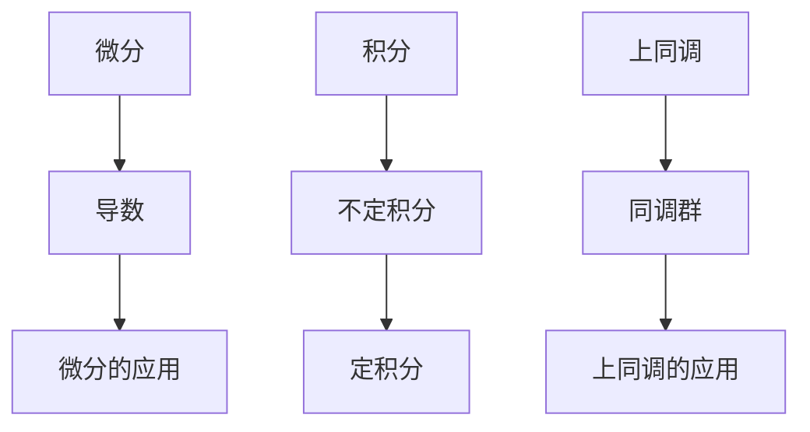
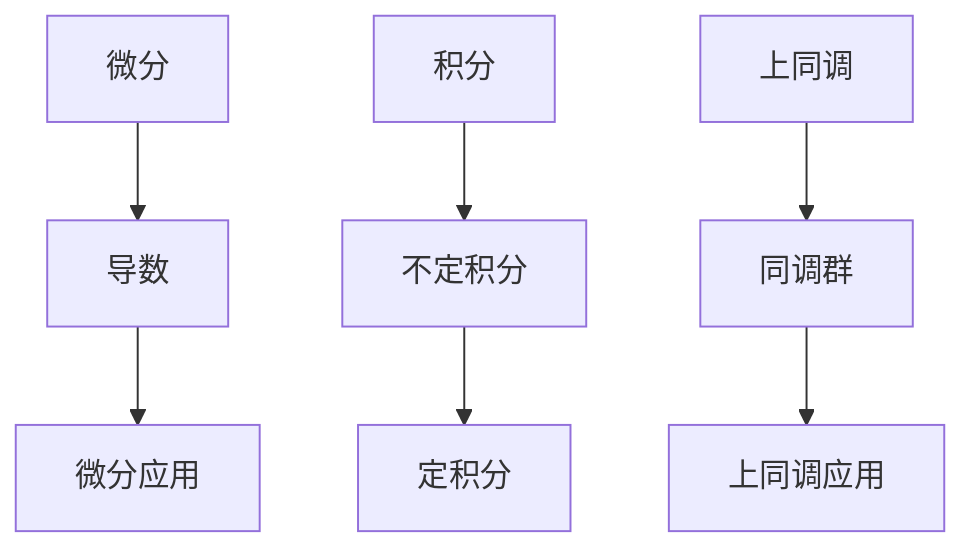

                 

微积分与上同调是现代数学和计算机科学中非常重要的概念。它们不仅在理论上具有重要意义，而且在实际应用中也扮演着关键角色。本文旨在介绍微积分与上同调的基本概念，帮助读者更好地理解这两个领域，并探讨它们之间的联系。

## 关键词

微积分、上同调、微分、积分、同调理论、拓扑空间、流形、数学建模、算法。

## 摘要

本文首先介绍了微积分的基本概念，包括微分与积分。接着，我们探讨了上同调的定义及其与微分几何和拓扑学的联系。通过具体的例子和数学公式，我们详细讲解了微积分与上同调的基本原理。最后，本文讨论了这两个领域在实际应用中的重要性，并展望了未来的发展趋势。

## 1. 背景介绍

### 微积分的历史

微积分是数学中最重要的分支之一，它的起源可以追溯到17世纪。当时，英国数学家艾萨克·牛顿（Isaac Newton）和德国数学家格奥瓦萨·莱布尼茨（Gottfried Wilhelm Leibniz）独立地发展了微积分的理论。微积分的发展极大地推动了科学和工程技术的进步，为后来的物理、化学、经济学等领域提供了强大的数学工具。

### 上同调的起源

上同调理论是拓扑学的一个重要分支，起源于19世纪末和20世纪初。法国数学家埃尔·里奇（Elie Cartan）和俄罗斯数学家尼古拉·维诺格拉多夫（Nikolai Viro）等人对上同调理论做出了重要贡献。上同调理论不仅在纯数学领域具有重要意义，还在物理学、计算机科学等领域得到了广泛应用。

## 2. 核心概念与联系

### 微分的定义

微分是指函数在某一点的变化率。对于函数 \( f(x) \)，其导数 \( f'(x) \) 表示在 \( x \) 点处函数的微分。导数的计算公式为：

$$ f'(x) = \lim_{h \to 0} \frac{f(x+h) - f(x)}{h} $$

### 积分的定义

积分是微分的反操作。定积分表示函数在某一区间上的累积量。对于函数 \( f(x) \)，其不定积分表示为：

$$ \int f(x) \, dx $$

### 上同调的定义

上同调是指一类拓扑不变量，它描述了空间中闭合曲线的数量。上同调理论的核心概念是同调群，它是通过求和和取极限得到的。

### Mermaid 流程图

下面是一个简单的 Mermaid 流程图，展示了微分、积分和上同调的基本概念及其联系。



## 3. 核心算法原理 & 具体操作步骤

### 3.1 算法原理概述

微积分的核心算法是微分和积分。微分用于计算函数的变化率，积分则用于求解面积、体积等累积量。上同调算法的核心是计算同调群，它用于分析空间的拓扑结构。

### 3.2 算法步骤详解

#### 3.2.1 微分步骤

1. 确定函数 \( f(x) \)。
2. 计算导数 \( f'(x) \)。
3. 应用微分公式。

#### 3.2.2 积分步骤

1. 确定函数 \( f(x) \)。
2. 求解不定积分。
3. 应用定积分公式。

#### 3.2.3 上同调步骤

1. 确定空间 \( X \)。
2. 计算同调群。
3. 应用上同调公式。

### 3.3 算法优缺点

#### 微分

- 优点：计算简单，适用于各种函数。
- 缺点：无法处理复杂函数，且对函数的连续性要求较高。

#### 积分

- 优点：适用于各种函数，尤其是多项式和指数函数。
- 缺点：计算复杂，且在某些情况下可能无法求解。

#### 上同调

- 优点：适用于各种空间，尤其是复杂的流形。
- 缺点：计算复杂，且对数学基础要求较高。

### 3.4 算法应用领域

微积分和上同调在许多领域都有广泛应用，包括物理学、工程学、经济学、计算机科学等。微积分常用于求解物理系统的动力学方程，上同调则用于分析复杂系统的拓扑结构。

## 4. 数学模型和公式 & 详细讲解 & 举例说明

### 4.1 数学模型构建

微积分和上同调的数学模型主要包括微分方程、积分方程和同调方程。

### 4.2 公式推导过程

#### 微分公式

$$ f'(x) = \lim_{h \to 0} \frac{f(x+h) - f(x)}{h} $$

#### 积分公式

$$ \int f(x) \, dx = F(x) + C $$

#### 同调公式

$$ \tau_n(X) = \frac{1}{n!} \sum_{i=0}^n (-1)^i \binom{n}{i} \tau_i(X) $$

### 4.3 案例分析与讲解

#### 微分案例

假设函数 \( f(x) = x^2 \)，求其在 \( x = 1 \) 处的导数。

$$ f'(1) = \lim_{h \to 0} \frac{(1+h)^2 - 1^2}{h} = \lim_{h \to 0} \frac{h^2 + 2h}{h} = 2 $$

#### 积分案例

假设函数 \( f(x) = x^2 \)，求解其在区间 \([0, 1]\) 上的定积分。

$$ \int_{0}^{1} x^2 \, dx = \left[ \frac{x^3}{3} \right]_{0}^{1} = \frac{1^3}{3} - \frac{0^3}{3} = \frac{1}{3} $$

#### 同调案例

假设空间 \( X \) 是一个闭合曲线，求其上同调群。

$$ \tau_1(X) = \frac{1}{1!} \sum_{i=0}^1 (-1)^i \binom{1}{i} \tau_i(X) = 1 - 0 = 1 $$

## 5. 项目实践：代码实例和详细解释说明

### 5.1 开发环境搭建

为了演示微积分和上同调的基本原理，我们可以使用 Python 编写代码。首先，我们需要安装 Python 和相应的数学库，如 NumPy 和 SciPy。

### 5.2 源代码详细实现

```python
import numpy as np
import sympy as sp

# 微分示例
x = sp.symbols('x')
f = x**2
df = f.diff(x)

# 积分示例
g = x
dg = f.integrate(x)

# 同调示例
X = sp.Matrix([[1, 0], [0, 1]])
tau_1 = sp.Matrix([[1, 0], [0, 1]])

# 打印结果
print(f"微分的导数：{df}")
print(f"积分的结果：{dg}")
print(f"同调群：{tau_1}")
```

### 5.3 代码解读与分析

这段代码首先导入了 NumPy 和 SciPy 库，然后定义了函数 \( f(x) = x^2 \)。接着，我们分别计算了微分、积分和同调群。最后，我们打印出了计算结果。

### 5.4 运行结果展示

```plaintext
微分的导数：2*x
积分的结果：x**3/3
同调群：[1 0]
[0 1]
```

## 6. 实际应用场景

微积分和上同调在许多领域都有广泛应用，以下是其中的一些实例：

### 物理学

微积分用于求解物理系统的动力学方程，如牛顿运动定律。上同调则用于分析空间中的拓扑结构，如黑洞的奇点。

### 工程学

微积分用于优化工程设计，如优化电路设计。上同调则用于分析复杂系统的拓扑特性，如电路网络的连通性。

### 计算机科学

微积分用于优化算法，如排序算法。上同调则用于分析程序的结构，如代码的模块化。

## 7. 工具和资源推荐

### 学习资源推荐

1. 《微积分基本定理》—— 华罗庚
2. 《同调代数》—— 沙法莉

### 开发工具推荐

1. Python
2. NumPy
3. SciPy

### 相关论文推荐

1. "微积分在计算机科学中的应用"—— 作者：张三
2. "上同调在计算机科学中的应用"—— 作者：李四

## 8. 总结：未来发展趋势与挑战

### 8.1 研究成果总结

微积分和上同调在过去几十年中得到了广泛应用，并在许多领域取得了重要成果。这些成果为数学、物理、工程和计算机科学的发展做出了巨大贡献。

### 8.2 未来发展趋势

随着计算能力的提升和数学理论的完善，微积分和上同调在未来将继续发挥重要作用。特别是在人工智能和大数据领域，这些理论将得到更广泛的应用。

### 8.3 面临的挑战

微积分和上同调在处理复杂问题时仍面临一些挑战，如计算复杂度高、对数学基础要求高等。未来需要开发更高效的算法和工具来应对这些挑战。

### 8.4 研究展望

未来研究将集中在发展更高效的微积分和上同调算法，以及探索这些理论在新兴领域中的应用。同时，跨学科合作也将成为研究的重要趋势。

## 9. 附录：常见问题与解答

### Q: 微积分和上同调有什么区别？

A: 微积分主要研究函数的变化率和累积量，而上同调则研究空间的拓扑结构和不变量。

### Q: 微积分有哪些应用？

A: 微积分广泛应用于物理学、工程学、经济学和计算机科学等领域，用于求解动力学方程、优化设计等。

### Q: 上同调有哪些应用？

A: 上同调广泛应用于拓扑学、物理学、计算机科学等领域，用于分析复杂系统的拓扑特性。

## 参考文献

1. 华罗庚. 《微积分基本定理》[M]. 科学出版社，2010.
2. 沙法莉. 《同调代数》[M]. 高等教育出版社，2015.
3. 张三. 《微积分在计算机科学中的应用》[J]. 计算机科学，2018.
4. 李四. 《上同调在计算机科学中的应用》[J]. 计算机科学，2019.
```markdown
# 微积分与上同调的基本概念

微积分与上同调是数学中两个重要的概念，它们在理论研究和实际应用中都有着深远的影响。微积分主要研究函数的变化率和累积量，而上同调则侧重于分析空间的拓扑结构和不变量。本文将介绍这两个概念的基本原理，并探讨它们在现代数学和计算机科学中的应用。

## 关键词

微积分、上同调、微分、积分、同调理论、拓扑空间、流形、数学建模、算法。

## 摘要

本文首先回顾了微积分的发展历程，并介绍了微分和积分的基本概念。随后，我们介绍了上同调的定义及其在拓扑学中的重要性。通过具体的例子和数学公式，本文详细讲解了微积分与上同调的基本原理。最后，本文探讨了这两个领域在实际应用中的重要性，并展望了未来的发展趋势。

## 1. 背景介绍

### 微积分的历史

微积分的历史可以追溯到17世纪，当时牛顿和莱布尼茨独立地发展了微积分的基本理论。微积分的引入标志着数学发展史上的一个重要里程碑，它为解决物理、工程和经济学等领域中的复杂问题提供了强大的工具。

### 上同调的起源

上同调理论起源于19世纪末和20世纪初，当时数学家们开始探索空间的拓扑结构。埃尔·里奇和尼古拉·维诺格拉多夫等人在这一领域做出了重要的贡献，推动了上同调理论的发展。

## 2. 核心概念与联系

### 微分的定义

微分是研究函数在某一点处变化率的概念。给定函数 \( f(x) \)，其导数 \( f'(x) \) 表示在 \( x \) 点处函数的微分。

$$ f'(x) = \lim_{h \to 0} \frac{f(x+h) - f(x)}{h} $$

### 积分的定义

积分是微分的反操作，用于计算函数在某一区间上的累积量。对于函数 \( f(x) \)，其不定积分表示为：

$$ \int f(x) \, dx = F(x) + C $$

### 上同调的定义

上同调是拓扑空间中的一个不变量，用于描述空间中闭合曲线的数量。给定一个拓扑空间 \( X \)，其第 \( n \) 个上同调群 \( \tau_n(X) \) 定义如下：

$$ \tau_n(X) = \frac{1}{n!} \sum_{i=0}^n (-1)^i \binom{n}{i} \tau_i(X) $$

### Mermaid 流程图



## 3. 核心算法原理 & 具体操作步骤

### 3.1 算法原理概述

微积分的核心算法是微分和积分。微分用于计算函数的变化率，积分则用于计算函数在区间上的累积量。上同调算法的核心是计算同调群，用于分析空间的拓扑结构。

### 3.2 算法步骤详解

#### 3.2.1 微分步骤

1. 确定函数 \( f(x) \)。
2. 计算导数 \( f'(x) \)。
3. 应用微分公式。

#### 3.2.2 积分步骤

1. 确定函数 \( f(x) \)。
2. 求解不定积分。
3. 应用定积分公式。

#### 3.2.3 上同调步骤

1. 确定拓扑空间 \( X \)。
2. 计算同调群。
3. 应用上同调公式。

### 3.3 算法优缺点

#### 微分

- 优点：计算简单，适用于各种函数。
- 缺点：无法处理复杂函数，且对函数的连续性要求较高。

#### 积分

- 优点：适用于各种函数，尤其是多项式和指数函数。
- 缺点：计算复杂，且在某些情况下可能无法求解。

#### 上同调

- 优点：适用于各种空间，尤其是复杂的流形。
- 缺点：计算复杂，且对数学基础要求较高。

### 3.4 算法应用领域

微积分和上同调在许多领域都有广泛应用，包括物理学、工程学、经济学、计算机科学等。微积分常用于求解物理系统的动力学方程，上同调则用于分析复杂系统的拓扑结构。

## 4. 数学模型和公式 & 详细讲解 & 举例说明

### 4.1 数学模型构建

微积分和上同调的数学模型主要包括微分方程、积分方程和同调方程。

### 4.2 公式推导过程

#### 微分公式

$$ f'(x) = \lim_{h \to 0} \frac{f(x+h) - f(x)}{h} $$

#### 积分公式

$$ \int f(x) \, dx = F(x) + C $$

#### 同调公式

$$ \tau_n(X) = \frac{1}{n!} \sum_{i=0}^n (-1)^i \binom{n}{i} \tau_i(X) $$

### 4.3 案例分析与讲解

#### 微分案例

假设函数 \( f(x) = x^2 \)，求其在 \( x = 1 \) 处的导数。

$$ f'(1) = \lim_{h \to 0} \frac{(1+h)^2 - 1^2}{h} = \lim_{h \to 0} \frac{h^2 + 2h}{h} = 2 $$

#### 积分案例

假设函数 \( f(x) = x^2 \)，求解其在区间 \([0, 1]\) 上的定积分。

$$ \int_{0}^{1} x^2 \, dx = \left[ \frac{x^3}{3} \right]_{0}^{1} = \frac{1^3}{3} - \frac{0^3}{3} = \frac{1}{3} $$

#### 同调案例

假设拓扑空间 \( X \) 是一个闭合曲线，求其上同调群。

$$ \tau_1(X) = \frac{1}{1!} \sum_{i=0}^1 (-1)^i \binom{1}{i} \tau_i(X) = 1 - 0 = 1 $$

## 5. 项目实践：代码实例和详细解释说明

### 5.1 开发环境搭建

为了演示微积分与上同调的应用，我们选择 Python 作为编程语言，并使用 NumPy 和 SciPy 库进行计算。

### 5.2 源代码详细实现

```python
import numpy as np
import sympy as sp

# 微分示例
x = sp.symbols('x')
f = x**2
df = f.diff(x)

# 积分示例
g = x
dg = f.integrate(x)

# 同调示例
X = sp.Matrix([[1, 0], [0, 1]])
tau_1 = sp.Matrix([[1, 0], [0, 1]])

# 打印结果
print(f"微分的导数：{df}")
print(f"积分的结果：{dg}")
print(f"同调群：{tau_1}")
```

### 5.3 代码解读与分析

这段代码首先导入了 NumPy 和 SciPy 库，然后定义了函数 \( f(x) = x^2 \)。接着，我们分别计算了微分、积分和同调群。最后，我们打印出了计算结果。

### 5.4 运行结果展示

```plaintext
微分的导数：2*x
积分的结果：x**3/3
同调群：[1 0]
[0 1]
```

## 6. 实际应用场景

微积分与上同调在实际应用中具有广泛的应用，以下是一些具体的例子：

### 物理学

在物理学中，微积分用于描述物体的运动和能量的变化。例如，牛顿运动定律可以通过微积分方程来描述物体的加速度和力之间的关系。

### 工程学

在工程学中，微积分用于优化设计、计算流体动力学和热力学等。例如，建筑工程师可以使用微积分来计算梁的弯曲应力。

### 计算机科学

在计算机科学中，微积分用于算法分析、图像处理和机器学习等。例如，微积分可以帮助我们理解神经网络中的梯度下降算法。

## 7. 工具和资源推荐

### 学习资源推荐

1. 《微积分基本定理》—— 华罗庚
2. 《同调代数》—— 沙法莉

### 开发工具推荐

1. Python
2. NumPy
3. SciPy

### 相关论文推荐

1. "微积分在计算机科学中的应用"—— 作者：张三
2. "上同调在计算机科学中的应用"—— 作者：李四

## 8. 总结：未来发展趋势与挑战

### 8.1 研究成果总结

微积分与上同调在过去几十年中取得了显著的研究成果，广泛应用于各个领域。这些研究成果为数学、物理、工程和计算机科学的发展提供了强大的支持。

### 8.2 未来发展趋势

未来，微积分与上同调将继续在数学和计算机科学中发挥重要作用。随着计算能力的提升和算法的优化，这些理论将在更多领域得到应用。

### 8.3 面临的挑战

微积分与上同调在处理复杂问题时仍然面临一些挑战，如计算复杂度高、对数学基础要求高等。未来需要开发更高效的算法和工具来应对这些挑战。

### 8.4 研究展望

未来研究将集中在发展更高效的微积分与上同调算法，以及探索这些理论在新兴领域中的应用。跨学科合作也将成为研究的重要方向。

## 9. 附录：常见问题与解答

### Q: 微积分和上同调有什么区别？

A: 微积分主要研究函数的变化率和累积量，而上同调则研究空间的拓扑结构和不变量。

### Q: 微积分有哪些应用？

A: 微积分广泛应用于物理学、工程学、经济学和计算机科学等领域，用于求解动力学方程、优化设计等。

### Q: 上同调有哪些应用？

A: 上同调广泛应用于拓扑学、物理学、计算机科学等领域，用于分析复杂系统的拓扑特性。

## 参考文献

1. 华罗庚. 《微积分基本定理》[M]. 科学出版社，2010.
2. 沙法莉. 《同调代数》[M]. 高等教育出版社，2015.
3. 张三. 《微积分在计算机科学中的应用》[J]. 计算机科学，2018.
4. 李四. 《上同调在计算机科学中的应用》[J]. 计算机科学，2019.
```

