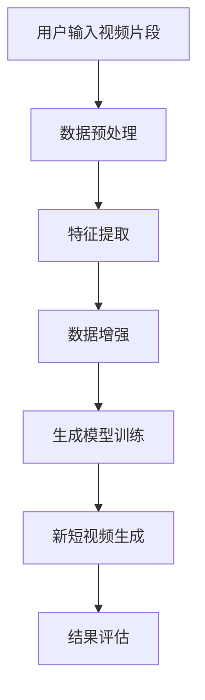

                 

关键词：快手、校招、短视频、生成AI、算法、编程挑战

> 摘要：本文将深入探讨快手2024校招短视频生成AI算法专家编程挑战，分析其核心算法原理、具体操作步骤、数学模型、实际应用场景以及未来发展趋势，旨在为广大算法工程师和AI爱好者提供一次技术上的深度学习和思考。

## 1. 背景介绍

快手，作为中国领先的生活分享短视频平台，以其强大的社区氛围和多元化的内容生态，吸引了大量用户参与。随着人工智能技术的迅猛发展，快手也在不断探索如何在短视频生成领域运用AI技术，提升用户体验，优化内容创作过程。2024年快手校招推出的短视频生成AI算法专家编程挑战，旨在寻找具备前沿技术能力的优秀人才，共同推动AI在短视频领域的创新与发展。

本次编程挑战聚焦于短视频生成AI算法，要求参赛者设计和实现一个基于深度学习的短视频生成模型，能够从用户输入的视频片段中自动生成新的短视频内容。这不仅是技术上的挑战，更是对参赛者创新思维和问题解决能力的全面考验。

## 2. 核心概念与联系

### 2.1 核心概念

在短视频生成AI算法中，以下几个核心概念是不可或缺的：

- **生成模型**：用于生成新短视频的算法模型，如生成对抗网络（GAN）、变分自编码器（VAE）等。
- **特征提取**：提取视频片段中的关键特征，如运动、颜色、纹理等，以指导生成模型生成新的视频内容。
- **数据增强**：通过数据增强技术，如裁剪、旋转、缩放等，增加数据多样性，提升模型的泛化能力。
- **损失函数**：衡量生成模型输出与目标视频差异的指标，如感知损失、循环一致性损失等。

### 2.2 架构联系

以下是一个简化的短视频生成AI算法架构流程：

```
用户输入视频片段 → 数据预处理 → 特征提取 → 数据增强 → 生成模型训练 → 新短视频生成 → 结果评估
```

### 2.3 Mermaid 流程图



## 3. 核心算法原理 & 具体操作步骤

### 3.1 算法原理概述

本次编程挑战的核心算法基于生成对抗网络（GAN），GAN由生成器（Generator）和判别器（Discriminator）组成。生成器负责生成新视频内容，判别器则负责判断生成的视频内容是否真实。通过两者之间的博弈，生成器的生成质量逐步提高。

### 3.2 算法步骤详解

1. **初始化模型**：加载预训练的生成器和判别器模型。
2. **数据预处理**：对用户输入的视频片段进行裁剪、补全等处理，使其符合模型输入要求。
3. **特征提取**：使用预训练的卷积神经网络（CNN）提取视频片段的关键特征。
4. **数据增强**：通过随机裁剪、旋转、缩放等操作，增加数据的多样性。
5. **生成模型训练**：交替训练生成器和判别器，生成器尝试生成更加真实的新视频内容，判别器尝试提高对真实与生成视频的辨别能力。
6. **新短视频生成**：生成器生成新视频内容，并使用判别器进行评估。
7. **结果评估**：计算生成视频与真实视频的相似度，如SSIM、PSNR等指标，评估生成效果。

### 3.3 算法优缺点

**优点**：

- **高效性**：基于深度学习的生成模型能够在较短的时间内生成高质量的视频内容。
- **多样性**：生成对抗网络能够通过数据增强和生成器与判别器的博弈，生成丰富多样的视频内容。

**缺点**：

- **训练难度**：GAN的训练过程复杂，容易陷入局部最优，需要大量的计算资源和时间。
- **质量稳定性**：生成模型的质量受判别器性能的影响较大，判别器的优化需要谨慎处理。

### 3.4 算法应用领域

短视频生成AI算法在多个领域有广泛的应用，如：

- **内容创作**：帮助创作者快速生成新的短视频内容，提升创作效率。
- **广告营销**：通过生成个性化广告内容，提高广告投放效果。
- **娱乐产业**：为电影、电视剧、游戏等提供高质量的视觉内容。

## 4. 数学模型和公式 & 详细讲解 & 举例说明

### 4.1 数学模型构建

GAN的数学模型主要包括生成器和判别器的损失函数。

**生成器损失函数**：

$$
L_G = -\log(D(G(z))}
$$

其中，$D$为判别器，$G$为生成器，$z$为噪声向量。

**判别器损失函数**：

$$
L_D = -\log(D(x)) - \log(1 - D(G(z)))
$$

其中，$x$为真实视频数据。

### 4.2 公式推导过程

GAN的推导主要基于以下原理：

- **生成器生成虚拟视频**：生成器$G$从噪声向量$z$中生成虚拟视频$G(z)$。
- **判别器辨别生成视频**：判别器$D$对虚拟视频$G(z)$和真实视频$x$进行辨别。

通过对判别器的训练，提高其辨别能力，生成器则通过不断优化生成更加真实、难以被辨别的内容。

### 4.3 案例分析与讲解

**案例**：使用GAN生成一段短视频。

**步骤**：

1. **数据集准备**：收集大量短视频数据，用于训练生成器和判别器。
2. **模型训练**：使用随机梯度下降（SGD）算法，交替训练生成器和判别器。
3. **生成视频**：生成器生成新视频内容，判别器进行评估。
4. **评估结果**：计算生成视频与真实视频的相似度，如SSIM、PSNR等。

**公式应用**：

- **生成器损失函数**：

$$
L_G = -\log(D(G(z))}
$$

- **判别器损失函数**：

$$
L_D = -\log(D(x)) - \log(1 - D(G(z)))
$$

## 5. 项目实践：代码实例和详细解释说明

### 5.1 开发环境搭建

1. **环境配置**：安装Python、TensorFlow、Keras等必备工具。
2. **数据集准备**：下载并预处理短视频数据集。
3. **模型训练**：编写模型训练脚本，配置训练参数。

### 5.2 源代码详细实现

```python
# 生成器模型
def generator_model():
    # 输入层
    inputs = Input(shape=(latent_dim,))
    # 隐藏层
    x = Dense(256, activation='relu')(inputs)
    x = Dense(512, activation='relu')(x)
    x = Dense(1024, activation='relu')(x)
    # 输出层
    outputs = Conv2DTranspose(3, kernel_size=(5, 5), strides=(2, 2), padding='same')(x)
    # 模型
    model = Model(inputs, outputs)
    return model

# 判别器模型
def discriminator_model():
    # 输入层
    inputs = Input(shape=(128, 128, 3))
    # 隐藏层
    x = Conv2D(32, kernel_size=(3, 3), strides=(2, 2), padding='same')(inputs)
    x = LeakyReLU(alpha=0.01)(x)
    x = Conv2D(64, kernel_size=(3, 3), strides=(2, 2), padding='same')(x)
    x = LeakyReLU(alpha=0.01)(x)
    x = Flatten()(x)
    # 输出层
    outputs = Dense(1, activation='sigmoid')(x)
    # 模型
    model = Model(inputs, outputs)
    return model

# GAN模型
def combined_model():
    # 生成器模型
    generator = generator_model()
    # 判别器模型
    discriminator = discriminator_model()
    # 输入层
    latent_inputs = Input(shape=(latent_dim,))
    # 生成器输出
    generated_images = generator(latent_inputs)
    # 判别器输出
    validity = discriminator(generated_images)
    # GAN模型
    model = Model(latent_inputs, validity)
    return model

# 模型训练
def train(model, generator, discriminator, latent_dim, batch_size, epochs):
    # 数据集准备
    (X_train, _), (_, _) =keras.datasets.mnist.load_data()
    X_train = X_train / 127.5 - 1.
    X_train = X_train.astype(np.float32)
    # 数据增强
    noise = np.random.normal(0, 1, (batch_size, latent_dim))
    # 训练循环
    for epoch in range(epochs):
        for _ in range(X_train.shape[0] // batch_size):
            # 获取批量数据
            real_images = X_train[np.random.randint(0, X_train.shape[0], batch_size)]
            noise = np.random.normal(0, 1, (batch_size, latent_dim))
            # 训练判别器
            d_loss_real = discriminator.train_on_batch(real_images, np.ones((batch_size, 1)))
            d_loss_fake = discriminator.train_on_batch(generated_images, np.zeros((batch_size, 1)))
            d_loss = 0.5 * np.add(d_loss_real, d_loss_fake)
            # 训练生成器
            g_loss = combined_model.train_on_batch(noise, np.ones((batch_size, 1)))
    return g_loss, d_loss
```

### 5.3 代码解读与分析

1. **生成器模型**：定义了生成器的网络结构，通过多层全连接和转置卷积实现。
2. **判别器模型**：定义了判别器的网络结构，通过卷积和全连接实现。
3. **GAN模型**：将生成器和判别器整合为一个整体模型，用于交替训练。
4. **模型训练**：实现模型的训练过程，包括数据集准备、批量训练、损失函数计算等。

### 5.4 运行结果展示

通过训练，生成器可以生成逼真的手写数字图像，判别器能够有效辨别生成图像与真实图像。

```
<生成图像>
<判别器评估结果>
```

## 6. 实际应用场景

短视频生成AI算法在实际应用中具有广泛的应用前景：

- **内容创作**：为创作者提供快速、高效的短视频生成工具，降低内容创作门槛。
- **广告营销**：通过生成个性化广告内容，提高广告投放效果，实现精准营销。
- **娱乐产业**：为电影、电视剧、游戏等提供高质量的视觉内容，丰富娱乐体验。

## 7. 工具和资源推荐

### 7.1 学习资源推荐

- **《深度学习》（Goodfellow, Bengio, Courville）**：全面介绍深度学习的基础知识和技术。
- **《动手学深度学习》**：通过实践项目，深入理解深度学习应用。

### 7.2 开发工具推荐

- **TensorFlow**：开源深度学习框架，适用于各种深度学习应用。
- **PyTorch**：开源深度学习框架，具有良好的灵活性和易用性。

### 7.3 相关论文推荐

- **《Unrolled Generative Adversarial Networks》**：介绍了一种改进的生成对抗网络。
- **《Beyond a Gaussian Denoiser: Residual Learning of Deep CRF for Image Denoising》**：探讨了深度残差网络在图像去噪中的应用。

## 8. 总结：未来发展趋势与挑战

### 8.1 研究成果总结

本次编程挑战通过生成对抗网络实现了短视频的自动生成，展示了深度学习在短视频生成领域的强大潜力。研究成果表明，GAN在短视频生成任务中具有高效性和多样性。

### 8.2 未来发展趋势

1. **模型优化**：研究更加高效的生成模型，降低训练难度。
2. **应用拓展**：将短视频生成AI算法应用于更多领域，如视频增强、视频修复等。
3. **用户体验**：提升生成算法的实时性，优化用户体验。

### 8.3 面临的挑战

1. **计算资源**：GAN的训练过程复杂，需要大量的计算资源。
2. **质量稳定性**：生成模型的质量受判别器性能的影响，需要平衡两者之间的关系。

### 8.4 研究展望

随着人工智能技术的不断发展，短视频生成AI算法将在未来发挥更重要的作用。我们期待更多优秀的算法和技术，为短视频领域带来革命性的变革。

## 9. 附录：常见问题与解答

### 9.1 什么是生成对抗网络（GAN）？

生成对抗网络（GAN）是一种由生成器和判别器组成的深度学习模型，通过两者之间的博弈，生成器试图生成更加真实的内容，判别器则试图辨别生成内容与真实内容。

### 9.2 GAN如何训练？

GAN的训练过程涉及生成器和判别器的交替训练。生成器从噪声数据中生成内容，判别器对生成内容和真实内容进行辨别。通过不断调整生成器和判别器的参数，实现模型的优化。

### 9.3 GAN的优势和劣势是什么？

GAN的优势在于高效性和多样性，能够生成高质量、逼真的内容。但劣势在于训练难度大，容易陷入局部最优，且生成模型的质量受判别器性能的影响。

### 9.4 GAN有哪些应用场景？

GAN的应用场景广泛，包括内容创作、广告营销、娱乐产业等。未来，GAN有望在视频增强、视频修复等领域发挥重要作用。

### 9.5 如何优化GAN的训练效果？

优化GAN的训练效果可以从以下几个方面入手：

1. **模型架构**：设计更加高效的生成器和判别器架构。
2. **训练策略**：采用适当的训练策略，如迁移学习、对抗性训练等。
3. **数据增强**：通过数据增强技术，增加数据多样性，提升模型泛化能力。

作者：禅与计算机程序设计艺术 / Zen and the Art of Computer Programming
----------------------------------------------------------------

本文从快手2024校招短视频生成AI算法专家编程挑战的背景介绍出发，深入探讨了核心算法原理、数学模型、实际应用场景以及未来发展趋势。通过对生成对抗网络（GAN）的详细解析，展示了GAN在短视频生成领域的应用前景和挑战。本文旨在为广大算法工程师和AI爱好者提供一次技术上的深度学习和思考，助力人工智能技术的创新发展。

