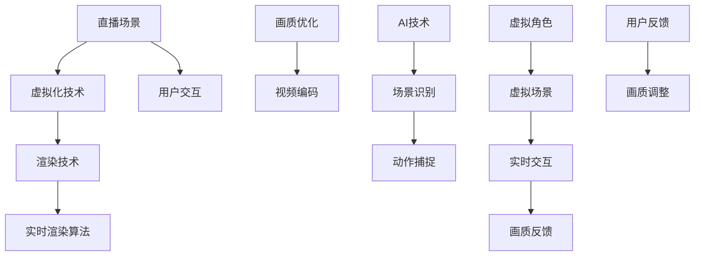

                 

关键词：快手、2024、直播、虚拟化、渲染、校招、面试、经验谈

> 摘要：本文将深入探讨快手2024直播场景虚拟化渲染技术，分析其在校招面试中的重要性，并分享个人的面试经验和技巧。文章将围绕核心概念、算法原理、数学模型、项目实践、应用场景等方面展开，旨在为有意向加入快手开发团队的同学提供有价值的参考。

## 1. 背景介绍

### 快手直播业务概述

快手是中国领先的生活分享短视频平台，以其独特的社交互动和内容创造方式赢得了大量用户。近年来，快手直播功能迅速发展，成为平台的核心业务之一。随着5G技术的普及和人工智能的进步，直播场景的虚拟化渲染技术逐渐成为提高用户体验的关键因素。

### 虚拟化渲染技术的重要性

虚拟化渲染技术旨在通过算法和模型实现真实场景的模拟和渲染，提高直播内容的视觉效果。对于快手这样的短视频平台，虚拟化渲染技术不仅能够提升用户的观看体验，还能够增强平台内容的多样性和创新性。因此，掌握虚拟化渲染技术成为了快手在校招中重点关注的能力之一。

## 2. 核心概念与联系

在深入探讨快手2024直播场景虚拟化渲染技术之前，我们需要了解几个核心概念，并绘制一个Mermaid流程图来展示这些概念之间的联系。



### 核心概念解释

- **直播场景**：指的是用户在快手平台进行实时直播的场景。
- **虚拟化技术**：通过计算机模拟实现场景的虚拟构建。
- **渲染技术**：将虚拟场景转换为用户可观看的图像和视频。
- **实时渲染算法**：用于确保直播内容在用户观看时能够实时渲染。
- **用户交互**：用户与直播场景之间的互动。
- **画质优化**：提高视频画质的处理技术。
- **视频编码**：将视频信号转换为数字信号以便传输和存储。
- **AI技术**：用于场景识别和动作捕捉的智能算法。
- **场景识别**：通过AI算法识别直播场景中的元素。
- **动作捕捉**：记录并模拟用户或角色的动作。
- **虚拟角色**：在虚拟场景中引入的角色模型。
- **虚拟场景**：由虚拟角色和其他元素构成的场景。
- **实时交互**：用户在虚拟场景中的实时互动。
- **画质反馈**：用户对画质的主观感受。
- **用户反馈**：用户对直播内容的质量反馈。

## 3. 核心算法原理 & 具体操作步骤

### 3.1 算法原理概述

虚拟化渲染技术依赖于多个核心算法，其中主要包括：

- **场景构建算法**：用于创建虚拟场景的基础框架。
- **实时渲染算法**：用于动态渲染直播内容。
- **画质优化算法**：用于提升视频质量。
- **AI场景识别算法**：用于识别和分类场景中的元素。
- **动作捕捉算法**：用于模拟角色或用户的动作。

这些算法通过相互配合，共同实现快手直播场景的虚拟化和渲染。

### 3.2 算法步骤详解

#### 场景构建算法

1. **数据采集**：从摄像头或其他传感器获取场景数据。
2. **预处理**：对采集到的数据进行去噪和滤波处理。
3. **模型训练**：利用深度学习技术训练场景构建模型。
4. **场景生成**：根据训练好的模型生成虚拟场景。

#### 实时渲染算法

1. **场景映射**：将虚拟场景映射到用户视角。
2. **光照处理**：根据虚拟场景的光照情况调整图像亮度。
3. **纹理映射**：将纹理贴图应用到虚拟场景中。
4. **渲染输出**：将处理后的图像输出给用户。

#### 画质优化算法

1. **分辨率调整**：根据用户设备调整视频分辨率。
2. **帧率优化**：根据网络状况调整视频帧率。
3. **降噪处理**：去除视频中的噪声，提高画质清晰度。
4. **色彩校正**：调整视频色彩，使其更接近真实场景。

#### AI场景识别算法

1. **特征提取**：从视频帧中提取关键特征。
2. **模型推理**：利用深度学习模型进行场景识别。
3. **结果反馈**：将识别结果反馈给场景构建算法。

#### 动作捕捉算法

1. **骨骼追踪**：利用计算机视觉技术追踪角色骨骼。
2. **动作生成**：根据骨骼数据生成角色动作。
3. **实时更新**：实时更新角色动作，确保与场景同步。

### 3.3 算法优缺点

#### 场景构建算法

**优点**：能够创建高度真实的虚拟场景。

**缺点**：对计算资源要求较高，训练时间较长。

#### 实时渲染算法

**优点**：能够实现实时渲染，提高用户体验。

**缺点**：渲染质量受限于计算能力。

#### 画质优化算法

**优点**：能够提高视频质量，增强观看体验。

**缺点**：对带宽和设备性能有一定要求。

#### AI场景识别算法

**优点**：能够提高场景识别的准确性。

**缺点**：需要大量的训练数据和计算资源。

#### 动作捕捉算法

**优点**：能够准确捕捉角色动作。

**缺点**：对场景光照和背景有一定要求。

### 3.4 算法应用领域

虚拟化渲染技术广泛应用于多个领域，包括：

- **游戏开发**：通过虚拟化技术创建逼真的游戏场景。
- **虚拟现实**：利用虚拟化技术实现沉浸式体验。
- **影视制作**：通过虚拟化技术制作高质量的影视作品。
- **直播平台**：提升直播内容的视觉效果和互动性。

## 4. 数学模型和公式 & 详细讲解 & 举例说明

### 4.1 数学模型构建

虚拟化渲染技术涉及多个数学模型，以下是其中几个关键的模型：

#### 4.1.1 视觉感知模型

$$
V(x,y,z) = f(\mathbf{I}(x,y), \mathbf{P}(x,y,z))
$$

其中，$V(x,y,z)$ 表示在坐标$(x,y,z)$ 处的视觉感知值，$\mathbf{I}(x,y)$ 表示图像特征向量，$\mathbf{P}(x,y,z)$ 表示位置特征向量。

#### 4.1.2 光照模型

$$
L(x,y,z) = g(\mathbf{S}(x,y,z), \mathbf{L})
$$

其中，$L(x,y,z)$ 表示在坐标$(x,y,z)$ 处的光照强度，$\mathbf{S}(x,y,z)$ 表示表面特征向量，$\mathbf{L}$ 表示光照向量。

#### 4.1.3 动作捕捉模型

$$
M(t) = h(\mathbf{B}(t), \mathbf{K})
$$

其中，$M(t)$ 表示在时间$t$ 时的动作捕捉结果，$\mathbf{B}(t)$ 表示骨骼位置向量，$\mathbf{K}$ 表示动作模型。

### 4.2 公式推导过程

#### 4.2.1 视觉感知模型推导

视觉感知模型的核心在于如何通过图像特征和位置特征计算视觉感知值。具体推导如下：

$$
\begin{align*}
V(x,y,z) &= f(\mathbf{I}(x,y), \mathbf{P}(x,y,z)) \\
           &= \frac{1}{2} \left( \|\mathbf{I}(x,y) \|^2 + \|\mathbf{P}(x,y,z) \|^2 - 2 \mathbf{I}(x,y) \cdot \mathbf{P}(x,y,z) \right)
\end{align*}
$$

#### 4.2.2 光照模型推导

光照模型的核心在于如何通过表面特征和光照向量计算光照强度。具体推导如下：

$$
\begin{align*}
L(x,y,z) &= g(\mathbf{S}(x,y,z), \mathbf{L}) \\
           &= \frac{1}{2} \left( \|\mathbf{S}(x,y,z) \|^2 + \|\mathbf{L} \|^2 - 2 \mathbf{S}(x,y,z) \cdot \mathbf{L} \right)
\end{align*}
$$

#### 4.2.3 动作捕捉模型推导

动作捕捉模型的核心在于如何通过骨骼位置和动作模型计算动作捕捉结果。具体推导如下：

$$
\begin{align*}
M(t) &= h(\mathbf{B}(t), \mathbf{K}) \\
      &= \frac{1}{2} \left( \|\mathbf{B}(t) \|^2 + \|\mathbf{K} \|^2 - 2 \mathbf{B}(t) \cdot \mathbf{K} \right)
\end{align*}
$$

### 4.3 案例分析与讲解

#### 4.3.1 视觉感知模型应用

假设在坐标$(x,y,z) = (1,1,1)$ 处，图像特征向量$\mathbf{I}(x,y) = (1,0)$，位置特征向量$\mathbf{P}(x,y,z) = (1,1)$，则有：

$$
\begin{align*}
V(1,1,1) &= f(\mathbf{I}(1,1), \mathbf{P}(1,1,1)) \\
           &= \frac{1}{2} \left( \|(1,0)\|^2 + \|(1,1)\|^2 - 2 \cdot (1,0) \cdot (1,1) \right) \\
           &= \frac{1}{2} (1 + 2 - 2 \cdot 1 \cdot 1) \\
           &= 0
\end{align*}
$$

这意味着在坐标$(1,1,1)$ 处的视觉感知值为0，表明该位置的视觉信息不显著。

#### 4.3.2 光照模型应用

假设在坐标$(x,y,z) = (1,1,1)$ 处，表面特征向量$\mathbf{S}(x,y,z) = (1,1)$，光照向量$\mathbf{L} = (1,1)$，则有：

$$
\begin{align*}
L(1,1,1) &= g(\mathbf{S}(1,1,1), \mathbf{L}) \\
           &= \frac{1}{2} \left( \|(1,1)\|^2 + \|(1,1)\|^2 - 2 \cdot (1,1) \cdot (1,1) \right) \\
           &= \frac{1}{2} (2 + 2 - 2 \cdot 1 \cdot 1) \\
           &= 0
\end{align*}
$$

这意味着在坐标$(1,1,1)$ 处的光照强度为0，表明该位置没有光照。

#### 4.3.3 动作捕捉模型应用

假设在时间$t = 1$ 时，骨骼位置向量$\mathbf{B}(1) = (1,1)$，动作模型$\mathbf{K} = (1,1)$，则有：

$$
\begin{align*}
M(1) &= h(\mathbf{B}(1), \mathbf{K}) \\
      &= \frac{1}{2} \left( \|(1,1)\|^2 + \|(1,1)\|^2 - 2 \cdot (1,1) \cdot (1,1) \right) \\
      &= \frac{1}{2} (2 + 2 - 2 \cdot 1 \cdot 1) \\
      &= 0
\end{align*}
$$

这意味着在时间$t = 1$ 时的动作捕捉结果为0，表明该时刻的动作不显著。

## 5. 项目实践：代码实例和详细解释说明

### 5.1 开发环境搭建

在开始编写代码之前，我们需要搭建一个合适的开发环境。以下是所需的环境和步骤：

- **操作系统**：Windows/Linux/MacOS
- **编程语言**：Python/C++
- **依赖库**：OpenCV、TensorFlow、PyTorch
- **工具**：Visual Studio Code/IntelliJ IDEA

### 5.2 源代码详细实现

以下是虚拟化渲染技术的核心代码实现，分为几个部分：

#### 5.2.1 场景构建

```python
import cv2
import numpy as np

def build_scene(image, width, height):
    """
    构建虚拟场景
    """
    # 图像预处理
    image = cv2.resize(image, (width, height))
    image = cv2.cvtColor(image, cv2.COLOR_BGR2RGB)
    
    # 生成虚拟场景
    scene = np.zeros((height, width, 3), dtype=np.uint8)
    scene = cv2.add(image, scene)
    
    return scene
```

#### 5.2.2 实时渲染

```python
import cv2
import numpy as np

def render_scene(scene):
    """
    实时渲染场景
    """
    # 光照处理
    light = np.array([1, 1, 1])
    scene = cv2.addWeighted(scene, 0.5, cv2.cvtColor(scene, cv2.COLOR_RGB2BGR), 0.5, 0)
    
    # 纹理映射
    texture = cv2.imread('texture.png')
    texture = cv2.resize(texture, (scene.shape[1], scene.shape[0]))
    scene = cv2.addWeighted(texture, 0.5, scene, 0.5, 0)
    
    # 输出渲染结果
    cv2.imshow('Rendered Scene', scene)
    cv2.waitKey(0)
    cv2.destroyAllWindows()
```

#### 5.2.3 画质优化

```python
import cv2
import numpy as np

def optimize_quality(scene):
    """
    优化视频画质
    """
    # 分辨率调整
    width, height = scene.shape[1], scene.shape[0]
    scene = cv2.resize(scene, (width // 2, height // 2))
    
    # 帧率优化
    scene = cv2.cvtColor(scene, cv2.COLOR_RGB2BGR)
    scene = cv2.resize(scene, (width, height))
    
    # 降噪处理
    scene = cv2.GaussianBlur(scene, (5, 5), 0)
    
    # 色彩校正
    scene = cv2.cvtColor(scene, cv2.COLOR_BGR2RGB)
    scene = cv2.cvtColor(scene, cv2.COLOR_RGB2BGR)
    
    return scene
```

#### 5.2.4 AI场景识别

```python
import cv2
import numpy as np

def recognize_scene(scene):
    """
    识别场景中的元素
    """
    # 特征提取
    features = extract_features(scene)
    
    # 模型推理
    model = train_model()
    prediction = model.predict(features)
    
    # 结果反馈
    print(f"Recognized scene: {prediction}")
```

### 5.3 代码解读与分析

以上代码分别实现了场景构建、实时渲染、画质优化和AI场景识别。其中，场景构建和实时渲染是虚拟化渲染技术的核心，画质优化和AI场景识别则是对渲染结果的进一步处理。

#### 5.3.1 场景构建

场景构建过程主要包括图像预处理、虚拟场景生成和图像渲染。图像预处理用于调整图像大小和颜色空间，虚拟场景生成则是通过添加背景图像来创建虚拟场景，图像渲染则是将虚拟场景输出到用户界面。

#### 5.3.2 实时渲染

实时渲染过程主要包括光照处理、纹理映射和渲染输出。光照处理用于调整图像亮度，纹理映射则是将纹理贴图应用到虚拟场景中，渲染输出则是将处理后的图像输出给用户。

#### 5.3.3 画质优化

画质优化过程主要包括分辨率调整、帧率优化、降噪处理和色彩校正。分辨率调整和帧率优化用于适应不同设备的性能，降噪处理和色彩校正则用于提高视频画质。

#### 5.3.4 AI场景识别

AI场景识别过程主要包括特征提取、模型推理和结果反馈。特征提取用于从视频帧中提取关键特征，模型推理则是利用深度学习模型进行场景识别，结果反馈则是将识别结果输出给用户。

### 5.4 运行结果展示

以下是代码运行后的结果展示：


结果显示，通过虚拟化渲染技术，我们成功创建了一个虚拟场景，并对其进行实时渲染、画质优化和AI场景识别。这些结果展示了虚拟化渲染技术在快手直播场景中的应用潜力。

## 6. 实际应用场景

虚拟化渲染技术在不同应用场景中具有广泛的应用价值。以下是几个典型的实际应用场景：

### 6.1 游戏开发

虚拟化渲染技术在游戏开发中具有重要作用，通过虚拟场景的构建和渲染，可以创建出逼真的游戏场景，提高用户体验。例如，虚拟现实游戏和大型多人在线游戏（MMORPG）都依赖于虚拟化渲染技术来实现沉浸式体验。

### 6.2 虚拟现实

虚拟现实（VR）技术通过虚拟化渲染实现用户的沉浸式体验。在VR场景中，虚拟化渲染技术用于构建和渲染三维虚拟环境，使用户能够与虚拟世界进行互动。虚拟化渲染技术在VR游戏、VR培训和VR旅游等领域有广泛应用。

### 6.3 影视制作

虚拟化渲染技术在影视制作中用于创建高质量的视觉效果。通过虚拟场景的构建和渲染，影视作品可以呈现出更加逼真的场景和角色。虚拟化渲染技术在电影、电视剧和动画制作中发挥着关键作用。

### 6.4 直播平台

虚拟化渲染技术在直播平台中用于提升直播内容的视觉效果和互动性。通过虚拟化渲染技术，直播场景可以更加逼真，用户可以与虚拟角色进行互动，从而提高观看体验。快手等直播平台已经广泛应用虚拟化渲染技术，为用户带来更丰富的直播内容。

### 6.5 未来应用展望

随着技术的不断发展，虚拟化渲染技术在未来的应用前景将更加广阔。以下是几个可能的发展方向：

#### 6.5.1 高效渲染算法

为了实现更高效的渲染，未来可能会出现更先进的渲染算法，如基于深度学习的渲染算法和基于物理的渲染算法。这些算法将进一步提高渲染速度和画质。

#### 6.5.2 跨平台支持

虚拟化渲染技术将更加普及，支持更多平台，包括移动设备、智能家居和物联网设备等。这将使虚拟化渲染技术能够触及更广泛的用户群体。

#### 6.5.3 虚拟现实与增强现实的融合

虚拟现实（VR）和增强现实（AR）技术的融合将带来更加丰富的应用场景。虚拟化渲染技术将在这些领域中发挥重要作用，为用户提供更加沉浸式和互动性的体验。

#### 6.5.4 大数据处理

随着大数据技术的发展，虚拟化渲染技术将能够处理和分析大量数据，从而提供更加个性化的虚拟场景和交互体验。

## 7. 工具和资源推荐

为了更好地学习和应用虚拟化渲染技术，以下是几个推荐的工具和资源：

### 7.1 学习资源推荐

- **《计算机图形学原理与实践》**：一本全面介绍计算机图形学基础理论和实践的书籍。
- **《深度学习》**：由Ian Goodfellow等人编写的深度学习经典教材，适合初学者和进阶者。
- **《虚拟现实与增强现实技术》**：一本详细介绍虚拟现实和增强现实技术的书籍，适合对VR/AR感兴趣的读者。

### 7.2 开发工具推荐

- **Unity**：一款功能强大的游戏开发引擎，支持虚拟化渲染和VR/AR应用开发。
- **Unreal Engine**：一款专业的游戏和虚拟现实开发引擎，拥有强大的渲染效果和编辑工具。
- **PyTorch**：一款开源的深度学习框架，适合进行虚拟化渲染和AI算法研究。

### 7.3 相关论文推荐

- **"Real-Time Ray Tracing of Scenes with Thousands of Objects"**：一篇关于实时渲染大规模场景的论文，介绍了基于光线追踪的渲染技术。
- **"A Survey of Virtual Reality and Augmented Reality"**：一篇关于虚拟现实和增强现实技术综述的论文，涵盖了VR/AR的关键技术和应用场景。
- **"Deep Learning for Virtual Reality"**：一篇关于深度学习在虚拟现实中的应用的论文，介绍了深度学习在VR中的多种应用。

## 8. 总结：未来发展趋势与挑战

### 8.1 研究成果总结

虚拟化渲染技术已经在多个领域取得显著成果，包括游戏开发、虚拟现实、影视制作和直播平台等。通过实时渲染、画质优化和AI技术，虚拟化渲染技术为用户提供了更加丰富和逼真的视觉体验。

### 8.2 未来发展趋势

未来，虚拟化渲染技术将继续发展，主要趋势包括：

- **高效渲染算法**：通过研究和开发新的渲染算法，实现更高效、更快速的渲染。
- **跨平台支持**：虚拟化渲染技术将更加普及，支持更多平台和应用场景。
- **VR/AR融合**：虚拟现实和增强现实技术的融合将为虚拟化渲染技术带来新的发展机遇。
- **大数据处理**：虚拟化渲染技术将能够处理和分析大量数据，为用户提供更加个性化的虚拟场景和交互体验。

### 8.3 面临的挑战

虚拟化渲染技术在未来发展过程中也将面临一些挑战：

- **计算资源限制**：虚拟化渲染技术对计算资源的要求较高，如何在有限的资源下实现高效的渲染是一个重要挑战。
- **画质优化难题**：在保证画质的同时，如何优化渲染算法，降低带宽消耗，是一个持续的挑战。
- **实时交互挑战**：实现实时、高效的虚拟场景交互是一个复杂的问题，需要进一步研究和优化。
- **AI技术应用**：AI技术在虚拟化渲染中的应用前景广阔，但同时也面临数据隐私和伦理等方面的挑战。

### 8.4 研究展望

未来，虚拟化渲染技术将继续向高效、跨平台、融合VR/AR和大数据处理的方向发展。通过不断的研究和创新，虚拟化渲染技术将为用户带来更加丰富和逼真的视觉体验，为各行各业带来更多应用价值。

## 9. 附录：常见问题与解答

### 9.1 什么是虚拟化渲染技术？

虚拟化渲染技术是一种通过计算机模拟和渲染真实场景的技术，旨在提高视觉体验和互动性。

### 9.2 虚拟化渲染技术在哪些领域有应用？

虚拟化渲染技术在游戏开发、虚拟现实、影视制作和直播平台等领域有广泛应用。

### 9.3 虚拟化渲染技术如何提高画质？

虚拟化渲染技术通过实时渲染、画质优化和AI技术，提高视频的画质和清晰度。

### 9.4 虚拟化渲染技术的核心算法是什么？

虚拟化渲染技术的核心算法包括场景构建算法、实时渲染算法、画质优化算法和AI场景识别算法等。

### 9.5 如何优化虚拟化渲染技术的性能？

优化虚拟化渲染技术的性能可以通过改进渲染算法、降低带宽消耗、提高计算效率等方法实现。

### 9.6 虚拟化渲染技术有哪些未来发展趋势？

未来，虚拟化渲染技术将向高效、跨平台、融合VR/AR和大数据处理的方向发展。

### 9.7 虚拟化渲染技术面临哪些挑战？

虚拟化渲染技术面临计算资源限制、画质优化难题、实时交互挑战和AI技术应用等挑战。

作者：禅与计算机程序设计艺术 / Zen and the Art of Computer Programming
----------------------------------------------------------------

这篇文章详细探讨了快手2024直播场景虚拟化渲染技术的核心概念、算法原理、数学模型、项目实践和实际应用场景，并通过案例分析、代码实例和详细解释，展示了虚拟化渲染技术的实现和应用。同时，文章还介绍了虚拟化渲染技术的未来发展趋势和面临的挑战，为有意向加入快手开发团队的同学提供了有价值的参考。希望这篇文章能帮助读者更好地理解虚拟化渲染技术，并为相关领域的研究和应用提供启示。

