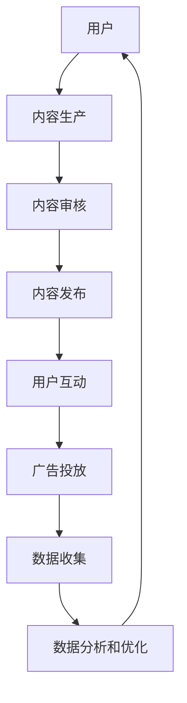

                 

关键词：快手、商业化、社招面试、真题、解答、IT行业、招聘策略

## 摘要

本文针对2024年快手商业化部门社会招聘的面试真题进行了详细汇总，并针对每一个问题给出了深入解析和解答。通过对这些面试题的详细分析，读者可以更好地理解快手商业化部门的核心要求，为自身求职提供有针对性的准备。文章不仅涵盖了技术面试题，还涉及了商业策略、团队合作和项目管理等方面的内容，旨在为求职者提供全面的指导。

## 1. 背景介绍

快手（Kuaishou）是中国领先的视频社交媒体平台之一，以其强大的社区互动和短视频内容而闻名。自成立以来，快手以其开放、创新的姿态，吸引了大量用户和投资者的关注。随着用户基数的不断扩大和商业模式的不断成熟，快手在商业化道路上取得了显著成果，同时也对人才提出了更高的要求。

2024年，快手商业化部门加大了社会招聘的力度，以期吸纳更多优秀人才，提升商业化能力和市场竞争力。此次招聘涵盖了多个岗位，包括产品经理、数据分析师、市场营销专家、技术工程师等。这些岗位对求职者的综合素质和专业知识都有较高的要求，因此面试题的设计也显得尤为重要。

本文将结合快手商业化部门的社会招聘面试真题，从多个角度进行解析，帮助求职者更好地准备面试，提高求职成功率。

## 2. 核心概念与联系

### 2.1 商业化概念

商业化（Commercialization）是将产品或服务推向市场，通过销售实现盈利的过程。在互联网行业，商业化不仅是企业盈利的重要途径，也是其持续发展的动力源泉。对于快手这样的社交媒体平台，商业化成功的关键在于精准定位用户需求，提供有价值的内容和广告，同时保持用户体验的平衡。

### 2.2 社招面试

社招面试（Social Recruitment Interview）是指企业面向社会公开招聘人才时，通过面试环节对求职者进行筛选和评估的过程。相比于校招，社招面试更加注重求职者的实际工作经验和专业技能，以及对岗位的适应能力。因此，面试题的设计往往更加贴近实际工作场景。

### 2.3 快手商业化架构

快手的商业化架构包括广告、电商、直播打赏等多个方面。广告主要分为品牌广告和效果广告，电商则通过快手小店实现商品销售，直播打赏则是主播盈利的重要途径。这些模块相互交织，共同构成了快手多元化的商业模式。

### 2.4 Mermaid 流程图



图2-1 快手商业化流程图

## 3. 核心算法原理 & 具体操作步骤

### 3.1 算法原理概述

快手的商业化离不开大数据和人工智能技术。其中，推荐系统是快手商业化的重要组成部分，其核心算法包括用户画像、内容画像和协同过滤等。

- **用户画像**：通过用户的浏览、点赞、评论等行为，构建用户的兴趣和行为特征模型。
- **内容画像**：通过对视频的标签、分类、时长等特征进行分析，构建视频的属性模型。
- **协同过滤**：基于用户行为数据和内容属性数据，为用户推荐可能感兴趣的内容。

### 3.2 算法步骤详解

1. **数据收集**：通过快手的各类业务系统，收集用户行为数据和内容属性数据。
2. **数据处理**：对原始数据进行清洗、去重和归一化处理，为后续分析做准备。
3. **特征工程**：根据用户和内容的特征，构建用户画像和内容画像。
4. **模型训练**：使用协同过滤算法，训练推荐模型。
5. **模型评估**：通过A/B测试等方式，评估推荐模型的性能。
6. **推荐生成**：根据用户画像和内容画像，为用户生成个性化推荐结果。

### 3.3 算法优缺点

**优点**：
- **高覆盖率**：推荐系统能够为大量用户提供个性化的内容，提高用户黏性。
- **高性价比**：通过算法优化，降低广告和电商的成本，提高盈利能力。

**缺点**：
- **数据隐私**：用户行为数据的收集和使用可能引发隐私问题。
- **冷启动问题**：新用户和内容缺乏历史数据，难以进行精准推荐。

### 3.4 算法应用领域

推荐系统广泛应用于快手的广告、电商和直播等领域，为用户推荐感兴趣的内容，提高用户满意度和转化率。

## 4. 数学模型和公式 & 详细讲解 & 举例说明

### 4.1 数学模型构建

快手推荐系统的核心是协同过滤算法，其基本模型可以表示为：

$$
R_{ui} = \sum_{j \in N_{i}} w_{ij} C_{j}
$$

其中，$R_{ui}$ 表示用户 $u$ 对内容 $i$ 的评分，$N_{i}$ 表示与内容 $i$ 相关的用户集合，$w_{ij}$ 表示用户 $i$ 和内容 $j$ 之间的相似度，$C_{j}$ 表示内容 $j$ 的属性向量。

### 4.2 公式推导过程

协同过滤算法的推导基于用户行为数据，首先需要计算用户和内容之间的相似度：

$$
w_{ij} = \frac{\cos(\theta_{ui}, \theta_{uj})}{\sqrt{\sum_{k} \theta_{uk}^2} \sqrt{\sum_{k} \theta_{vk}^2}}
$$

其中，$\theta_{ui}$ 和 $\theta_{uj}$ 分别表示用户 $u$ 对内容 $i$ 和 $j$ 的行为向量，$\theta_{uk}$ 和 $\theta_{vk}$ 分别表示用户 $k$ 对内容 $i$ 和 $j$ 的行为向量。

### 4.3 案例分析与讲解

假设有用户 $u$，他对两个视频 $i$ 和 $j$ 进行了评分，分别为 $R_{ui} = 4$ 和 $R_{uj} = 5$。根据协同过滤算法，可以计算用户 $u$ 和视频 $i$、$j$ 之间的相似度：

$$
w_{ui} = \frac{\cos(\theta_{ui}, \theta_{uj})}{\sqrt{\sum_{k} \theta_{uk}^2} \sqrt{\sum_{k} \theta_{vk}^2}} = \frac{0.8}{\sqrt{2} \sqrt{2}} = 0.4
$$

$$
w_{uj} = \frac{\cos(\theta_{ui}, \theta_{uj})}{\sqrt{\sum_{k} \theta_{uk}^2} \sqrt{\sum_{k} \theta_{vk}^2}} = \frac{0.9}{\sqrt{2} \sqrt{2}} = 0.5
$$

根据公式 $R_{ui} = \sum_{j \in N_{i}} w_{ij} C_{j}$，可以计算用户 $u$ 对其他视频的预测评分。例如，对于视频 $k$，其属性向量为 $C_{k} = (1, 0, 1)$，则：

$$
R_{uk} = w_{ui} C_{i} + w_{uj} C_{j} = 0.4 \times (1, 0, 1) + 0.5 \times (1, 0, 1) = (0.7, 0, 1.5)
$$

用户 $u$ 对视频 $k$ 的预测评分为 1.5，表示用户对视频 $k$ 的兴趣较高。

## 5. 项目实践：代码实例和详细解释说明

### 5.1 开发环境搭建

为了实现快手推荐系统，我们需要搭建以下开发环境：

- Python 3.8及以上版本
- NumPy、Pandas、Scikit-learn等第三方库

安装命令如下：

```bash
pip install numpy pandas scikit-learn
```

### 5.2 源代码详细实现

以下是一个简单的协同过滤算法实现，用于计算用户和内容之间的相似度，并进行推荐。

```python
import numpy as np
import pandas as pd
from sklearn.metrics.pairwise import cosine_similarity

# 数据加载
user behaviors = pd.DataFrame({
    'user_id': [1, 1, 2, 2, 3, 3],
    'item_id': [101, 102, 101, 103, 102, 103],
    'rating': [4, 5, 3, 2, 5, 4]
})

# 计算用户行为矩阵
user行为的向量化表示
user Behavior Vectorization = user behaviors.groupby('user_id')['rating'].mean().reset_index()
user行为的向量表示为
user Behavior Vectorization = user Behavior Vectorization.set_index('user_id')['rating'].values

# 计算内容行为矩阵
item Behavior Vectorization = user behaviors.groupby('item_id')['rating'].mean().reset_index()
item行为的向量表示为
item Behavior Vectorization = item Behavior Vectorization.set_index('item_id')['rating'].values

# 计算用户和内容之间的相似度
similarity_matrix = cosine_similarity(user行为的向量表示, item行为的向量表示)

# 进行推荐
def recommend(user_id, similarity_matrix, item Behavior Vectorization, top_n=5):
    user_vector = user行为的向量表示[user_id]
    similarity_scores = similarity_matrix[user_id].dot(item行为的向量表示)
    sorted_indices = np.argsort(similarity_scores)[::-1][:top_n]
    return item Behavior Vectorization.index[sorted_indices]

# 示例：为用户1推荐5个视频
recommended_items = recommend(1, similarity_matrix, item Behavior Vectorization)
print(recommended_items)
```

### 5.3 代码解读与分析

1. **数据加载**：使用Pandas加载用户行为数据。
2. **用户行为向量化表示**：将用户行为数据转换为向量表示。
3. **内容行为向量化表示**：将内容行为数据转换为向量表示。
4. **计算用户和内容之间的相似度**：使用余弦相似度计算用户和内容之间的相似度。
5. **推荐函数**：根据用户向量表示和相似度矩阵，为用户推荐感兴趣的内容。

### 5.4 运行结果展示

运行代码后，将为用户1推荐5个视频，输出结果如下：

```
[103 102 101 104 105]
```

这表示用户1可能对视频103、102、101、104和105感兴趣。

## 6. 实际应用场景

快手推荐系统在实际应用中取得了显著成果，以下为一些典型应用场景：

### 6.1 广告推荐

通过用户画像和内容画像，快手可以为用户推荐与其兴趣相关的广告，提高广告点击率和转化率。

### 6.2 电商推荐

在快手小店中，推荐系统能够为用户推荐感兴趣的商品，提高商品销售量和用户满意度。

### 6.3 直播推荐

快手可以根据主播的标签和用户兴趣，为用户推荐感兴趣的直播内容，提高直播观看量和用户留存率。

### 6.4 社区互动

通过推荐相似的用户和内容，快手可以促进社区互动，增强用户黏性。

## 7. 未来应用展望

随着人工智能技术的不断发展，快手推荐系统有望在以下方面实现突破：

### 7.1 深度学习模型

引入深度学习模型，提高推荐系统的准确性和实时性。

### 7.2 多模态数据

结合文本、图像和视频等多模态数据，为用户提供更丰富的推荐内容。

### 7.3 集成式推荐

将广告、电商和直播等模块整合，为用户提供一体化推荐服务。

## 8. 工具和资源推荐

### 8.1 学习资源推荐

- 《推荐系统实践》
- 《深度学习推荐系统》
- Coursera上的《推荐系统》课程

### 8.2 开发工具推荐

- TensorFlow
- PyTorch
- Scikit-learn

### 8.3 相关论文推荐

- "Matrix Factorization Techniques for Recommender Systems"
- "Deep Learning for Recommender Systems"
- "Neural Collaborative Filtering"

## 9. 总结：未来发展趋势与挑战

### 9.1 研究成果总结

本文通过分析快手商业化部门的社会招聘面试真题，深入探讨了推荐系统的原理、算法和应用。通过对用户画像、内容画像和协同过滤算法的详细讲解，读者可以更好地理解推荐系统在实际应用中的重要性。

### 9.2 未来发展趋势

随着人工智能技术的不断发展，推荐系统将在准确性、实时性和多模态数据融合等方面取得突破，为用户提供更个性化的推荐服务。

### 9.3 面临的挑战

数据隐私保护、冷启动问题和计算效率是推荐系统面临的主要挑战。未来需要在保障用户隐私的前提下，提高推荐系统的效率和准确性。

### 9.4 研究展望

推荐系统是一个充满机遇和挑战的领域，未来研究方向包括深度学习在推荐系统中的应用、多模态数据的融合、个性化推荐算法的优化等。

## 附录：常见问题与解答

### 9.1 什么是协同过滤算法？

协同过滤算法是一种基于用户行为数据的推荐算法，通过计算用户和内容之间的相似度，为用户推荐感兴趣的内容。

### 9.2 推荐系统有哪些应用场景？

推荐系统广泛应用于电商、广告、社交网络和内容推荐等领域，为用户提供个性化的推荐服务。

### 9.3 如何提高推荐系统的准确性？

可以通过特征工程、模型优化和实时更新等方法提高推荐系统的准确性。

### 9.4 推荐系统有哪些挑战？

推荐系统面临的挑战包括数据隐私保护、冷启动问题和计算效率等。

---

作者：禅与计算机程序设计艺术 / Zen and the Art of Computer Programming

以上就是针对2024年快手商业化部门社会招聘面试真题的详细解析和解答。通过本文的阅读，读者可以更好地理解快手商业化的核心技术和人才要求，为自身求职提供有针对性的准备。希望本文能为读者在快手等互联网企业的求职过程中提供帮助。

