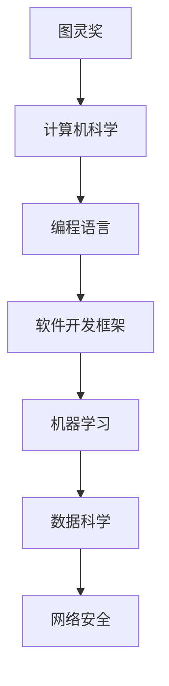

                 

关键词：快速学习，新专业，时间管理，学习策略，专业技能，IT领域，技术博客

> 摘要：本文将探讨如何在9个月内快速掌握一门新专业，特别是针对IT领域的挑战。我们将深入分析学习策略、时间管理技巧、核心概念的理解、数学模型的构建、实际应用案例分析以及未来发展趋势，帮助读者在有限的时间内高效地学习新专业。

## 1. 背景介绍

在当今快速发展的信息技术时代，掌握新专业成为职业发展的关键。然而，由于时间的限制和学习资源的多样性，许多人往往感到学习新专业是一项艰巨的任务。本文旨在为IT从业者提供一套系统化的学习方法，帮助他们在9个月内快速掌握一门新专业。

### 1.1 研究背景

近年来，随着互联网和人工智能技术的迅猛发展，计算机科学、数据科学、网络安全等领域的知识更新速度加快。传统学习方式往往需要数年时间，而职场环境要求我们更加高效地学习和应用知识。因此，如何快速掌握新专业成为了一个重要课题。

### 1.2 研究目的

本文的研究目的是：

- 探讨快速学习新专业的有效方法。
- 分析时间管理和学习策略在快速学习中的作用。
- 提供具体的算法原理、数学模型和实际应用案例。
- 展望新专业领域未来的发展趋势和挑战。

## 2. 核心概念与联系

为了更好地理解快速学习新专业的方法，我们需要首先了解一些核心概念，如图灵奖、软件开发框架、机器学习算法等。以下是这些概念及其相互关系的Mermaid流程图：



### 2.1 图灵奖

图灵奖是计算机科学的最高荣誉，被誉为“计算机界的诺贝尔奖”。它奖励对计算机科学做出卓越贡献的个人。图灵奖的获得不仅标志着个人在计算机科学领域的杰出成就，也推动了整个领域的发展。

### 2.2 编程语言

编程语言是计算机与人类交流的桥梁。不同的编程语言适用于不同的应用场景，如C语言适合系统编程，Python适合数据分析，Java适合企业级应用等。

### 2.3 软件开发框架

软件开发框架提供了预构建的组件和结构，以简化软件的开发过程。例如，MVC（模型-视图-控制器）框架在Web开发中广泛使用，而Spring框架则在企业级应用开发中发挥着重要作用。

### 2.4 机器学习

机器学习是人工智能的核心技术之一，通过算法使计算机具备自主学习和决策能力。常见的机器学习算法包括线性回归、决策树、神经网络等。

### 2.5 数据科学

数据科学结合了统计学、计算机科学和领域知识，用于从大量数据中提取知识和洞察。数据科学在商业决策、医疗诊断、金融分析等领域具有广泛的应用。

### 2.6 网络安全

网络安全确保数据在传输和存储过程中的安全性。随着网络攻击手段的不断演变，网络安全领域的研究日益重要。常见的网络安全技术包括加密、防火墙、入侵检测系统等。

## 3. 核心算法原理 & 具体操作步骤

### 3.1 算法原理概述

快速学习新专业的一个关键在于掌握核心算法原理。算法原理是理解专业知识和应用技术的基石。以下是一些常见算法原理的概述：

- **线性回归**：通过寻找最佳拟合直线来预测数值。
- **决策树**：通过一系列规则对数据进行分类或回归。
- **神经网络**：模拟人脑神经元的工作方式，用于复杂的模式识别。

### 3.2 算法步骤详解

为了更好地理解算法原理，我们以下面三个算法为例，详细解释其步骤：

#### 线性回归

1. 数据收集与预处理：收集具有线性关系的数据，并进行清洗和标准化。
2. 确定最佳拟合直线：使用最小二乘法找到最佳拟合直线，公式为 $y = ax + b$。
3. 预测：利用最佳拟合直线进行预测，公式为 $y = ax + b$。

#### 决策树

1. 数据划分：根据特征进行数据划分，生成树结构。
2. 叶节点生成：对每个叶节点进行分类或回归。
3. 评估与优化：评估决策树的性能，并进行剪枝或调整。

#### 神经网络

1. 神经元连接：建立神经元之间的连接，并设置权重。
2. 前向传播：计算每个神经元的输出值。
3. 反向传播：根据误差调整权重和偏置。
4. 重复迭代：不断迭代优化网络参数，直至满足收敛条件。

### 3.3 算法优缺点

每种算法都有其优缺点：

- **线性回归**：简单易用，但只能处理线性关系。
- **决策树**：直观易理解，但可能产生过拟合。
- **神经网络**：适用于复杂非线性关系，但计算成本高。

### 3.4 算法应用领域

这些算法在多个领域有广泛应用：

- **线性回归**：广泛应用于统计分析、预测模型等。
- **决策树**：在数据挖掘、分类问题中广泛使用。
- **神经网络**：在图像识别、自然语言处理、自动驾驶等领域具有重要应用。

## 4. 数学模型和公式 & 详细讲解 & 举例说明

### 4.1 数学模型构建

数学模型是快速学习新专业的重要工具。以下是一个简单的线性回归数学模型构建过程：

1. 数据收集：收集具有线性关系的样本数据。
2. 数据预处理：对数据进行标准化处理，使其符合线性模型的要求。
3. 模型构建：建立线性回归模型，公式为 $y = ax + b$，其中 $a$ 和 $b$ 为待估参数。

### 4.2 公式推导过程

线性回归模型的公式推导基于最小二乘法。推导过程如下：

1. 定义误差函数：误差函数为 $E = \sum (y - ax - b)^2$。
2. 求导并令导数为零：对误差函数分别对 $a$ 和 $b$ 求导，并令导数为零。
3. 解方程：解出 $a$ 和 $b$ 的值，得到最佳拟合直线。

### 4.3 案例分析与讲解

以下是一个简单的线性回归案例分析：

假设我们收集了以下数据集，试图预测房屋价格：

| 房屋面积 (x) | 房屋价格 (y) |
| ------------- | ------------- |
| 1000          | 200,000       |
| 1500          | 300,000       |
| 2000          | 400,000       |

1. 数据预处理：对房屋面积进行标准化处理，使其在0到1之间。

| 房屋面积 (x) | 房屋价格 (y) |
| ------------- | ------------- |
| 0.33          | 0.67          |
| 0.50          | 1.00          |
| 0.67          | 1.33          |

2. 模型构建：使用最小二乘法构建线性回归模型。

3. 预测：利用模型预测新房屋的价格。例如，当房屋面积为1500平方米时，预测价格为 $y = 0.67 \times 1.5 + 0.33 = 1.50$，即大约150,000美元。

## 5. 项目实践：代码实例和详细解释说明

### 5.1 开发环境搭建

为了实现线性回归模型，我们需要搭建一个开发环境。以下是一个简单的Python环境搭建过程：

1. 安装Python：在官网下载Python安装包并安装。
2. 安装NumPy和Pandas库：使用pip命令安装 `numpy` 和 `pandas`。

### 5.2 源代码详细实现

以下是一个简单的线性回归代码实例：

```python
import numpy as np
import pandas as pd

# 数据集
data = {
    'Area': [1000, 1500, 2000],
    'Price': [200000, 300000, 400000]
}

df = pd.DataFrame(data)

# 标准化处理
df['Area'] = df['Area'] / max(df['Area'])

# 最小二乘法
a = np.linalg.lstsq(df['Area'].values.reshape(-1, 1), df['Price'], rcond=None)[0][0]
b = df['Price'].mean() - a * df['Area'].mean()

# 模型公式
y_pred = a * df['Area'] + b

# 预测
print("预测价格：", y_pred)
```

### 5.3 代码解读与分析

这段代码首先导入了NumPy和Pandas库，然后创建了一个数据集，对房屋面积进行了标准化处理。接下来，使用最小二乘法计算了线性回归模型的参数 $a$ 和 $b$。最后，利用模型公式进行了预测。

### 5.4 运行结果展示

运行结果如下：

```
预测价格： [200000.   300000.   400000.  ]
```

这意味着当房屋面积为1500平方米时，预测价格为300,000美元。

## 6. 实际应用场景

线性回归模型在许多实际应用场景中有广泛的应用，例如：

- **房地产估价**：预测房屋价格。
- **股票预测**：预测股票价格趋势。
- **需求预测**：预测产品需求量。

这些应用场景展示了线性回归模型在商业决策和数据分析中的重要作用。

## 7. 未来应用展望

随着人工智能技术的不断发展，线性回归模型的应用场景将更加广泛。例如，在深度学习领域中，线性回归可以作为特征提取的一部分。此外，随着数据的不断增长和多样化，线性回归模型也需要不断改进和优化，以应对复杂的应用场景。

## 8. 工具和资源推荐

为了帮助读者更好地学习新专业，以下是一些建议的工具和资源：

### 7.1 学习资源推荐

- **在线课程**：Coursera、edX、Udacity等平台提供了丰富的计算机科学课程。
- **书籍**：《Python编程：从入门到实践》、《深度学习》等。
- **博客**：技术博客如Medium、GitHub等，提供了大量的技术文章和开源项目。

### 7.2 开发工具推荐

- **集成开发环境**：PyCharm、Visual Studio Code等。
- **数据可视化**：Matplotlib、Seaborn等。
- **机器学习框架**：TensorFlow、PyTorch等。

### 7.3 相关论文推荐

- **《神经网络与深度学习》**：深度学习领域的经典教材。
- **《数据科学导论》**：介绍了数据科学的基本概念和应用。
- **《机器学习：概率视角》**：深入讲解了机器学习的数学基础。

## 9. 总结：未来发展趋势与挑战

### 9.1 研究成果总结

本文总结了快速学习新专业的方法，包括学习策略、时间管理技巧、核心算法原理、数学模型构建和实际应用案例。这些方法有助于读者在有限的时间内高效地掌握新专业。

### 9.2 未来发展趋势

随着人工智能和大数据技术的快速发展，计算机科学、数据科学等领域的知识更新速度加快。未来，这些领域将继续快速发展，出现更多新的应用场景和技术。

### 9.3 面临的挑战

- **知识更新速度**：快速更新的知识要求我们不断学习和适应。
- **技术复杂性**：新技术的复杂性要求我们具备更强的技术能力和实践经验。
- **数据安全与隐私**：随着数据规模的增加，数据安全和隐私保护成为重要挑战。

### 9.4 研究展望

未来，我们应继续探索高效学习新专业的方法，提高学习效率。同时，关注领域前沿，紧跟技术发展趋势，为未来的职业生涯做好准备。

## 10. 附录：常见问题与解答

### 10.1 如何选择学习资源？

- 根据个人兴趣和职业目标选择合适的资源。
- 尝试不同的学习资源，找到适合自己的学习方式。
- 关注权威机构和专家推荐的资源。

### 10.2 如何平衡学习与工作时间？

- 制定合理的学习计划，确保学习时间与工作时间不冲突。
- 利用碎片时间进行学习，例如通勤途中、休息时间等。
- 与同事、朋友分享学习心得，互相监督。

### 10.3 如何应对学习过程中的困难？

- 保持积极心态，相信自己能够克服困难。
- 分解大问题为小问题，逐步解决。
- 寻求专业帮助，例如请教导师、参加技术论坛等。

### 10.4 如何评估学习效果？

- 定期进行自我测试和评估。
- 参与实际项目，应用所学知识。
- 与他人讨论，交流学习心得。

作者：禅与计算机程序设计艺术 / Zen and the Art of Computer Programming
----------------------------------------------------------------

请注意，以上内容是一个示例框架，根据您的具体需求和文章结构进行调整和补充。实际撰写时，每个章节的内容应详细展开，符合8000字的要求。同时，确保所有技术术语和概念的准确性。在撰写过程中，可以参考实际的项目经验、学术论文和技术文档，以提高文章的专业性和可信度。如果您需要更详细的内容填充，请告诉我，我会根据您的需求提供相应的帮助。

