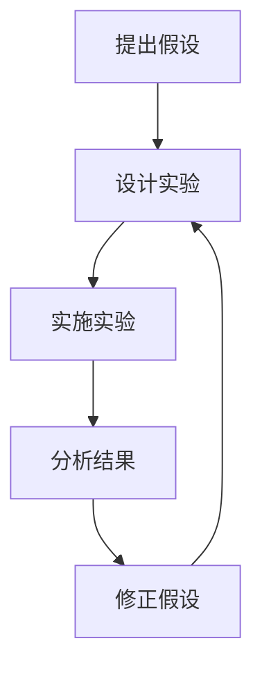

                 

关键词：AI创业、试错、迭代、AI产品开发、敏捷开发、快速反馈、技术创新

> 摘要：本文将探讨快速试错与迭代在AI创业中的重要性。通过分析AI领域的独特性、试错与迭代的基本原理，以及具体实践方法，本文旨在为AI创业者提供有价值的指导，帮助他们在激烈的市场竞争中迅速找到突破点，实现产品的持续迭代和优化。

## 1. 背景介绍

随着人工智能技术的迅猛发展，AI创业成为了一个备受瞩目的领域。众多创业者纷纷投身于AI产品开发，期望在这个全新的赛道上获得成功。然而，AI创业并非易事，其复杂性、不确定性和高成本使得很多项目在早期阶段就遭遇失败。在这样的背景下，快速试错与迭代成为AI创业的关键策略之一。

### AI领域的独特性

AI领域具有以下几个独特的特点：

1. **高度不确定性**：AI技术涉及众多未知领域，很多问题没有现成的解决方案，需要通过不断的探索和实验来寻找答案。
2. **复杂性**：AI系统通常涉及多个子系统和算法，需要处理大量的数据和信息。
3. **快速变化**：AI技术和应用场景不断演变，创业者需要保持敏捷，及时调整战略方向。

### 试错与迭代的重要性

试错与迭代是一种有效的学习方法，通过不断的尝试和修正，逐步逼近问题的解决方案。在AI创业中，快速试错与迭代具有以下几个重要性：

1. **减少风险**：通过早期发现和修正错误，降低项目失败的风险。
2. **快速适应市场**：不断调整产品和服务，满足市场需求，提高竞争力。
3. **提高效率**：缩短产品开发周期，节省时间和成本。

## 2. 核心概念与联系

### 试错与迭代的原理

试错与迭代是一种循环迭代的过程，包括以下几个基本步骤：

1. **提出假设**：根据已有知识和经验，对问题进行初步分析和假设。
2. **设计实验**：制定具体的实验方案，包括数据收集、算法设计等。
3. **实施实验**：执行实验方案，获取实验结果。
4. **分析结果**：对比实验结果与预期目标，分析原因。
5. **修正假设**：根据实验结果调整假设，重新设计实验。
6. **迭代优化**：不断重复上述步骤，逐步逼近问题解决方案。

### 试错与迭代的架构图



## 3. 核心算法原理 & 具体操作步骤

### 3.1 算法原理概述

在AI创业中，快速试错与迭代的算法原理主要基于机器学习和数据分析技术。通过以下步骤实现：

1. **数据收集**：收集相关领域的数据，包括文本、图像、声音等。
2. **数据预处理**：对数据进行清洗、归一化等处理，为模型训练做好准备。
3. **模型训练**：使用机器学习算法，对数据进行训练，生成模型。
4. **模型评估**：使用测试数据集对模型进行评估，评估模型性能。
5. **模型优化**：根据评估结果，调整模型参数，优化模型性能。
6. **迭代更新**：将优化后的模型应用到实际场景中，不断迭代更新。

### 3.2 算法步骤详解

1. **数据收集**：首先，创业者需要确定AI产品的应用场景，并根据需求收集相关数据。例如，开发一个图像识别系统，需要收集大量的图像数据。

2. **数据预处理**：对收集到的数据进行清洗和归一化处理，确保数据质量。数据清洗包括去除噪声、缺失值填充等；数据归一化包括归一化、标准化等。

3. **模型训练**：选择合适的机器学习算法，如卷积神经网络（CNN）、深度学习（Deep Learning）等，对数据进行训练。训练过程中，需要设置合适的参数，如学习率、批次大小等。

4. **模型评估**：使用测试数据集对训练好的模型进行评估，评估指标包括准确率、召回率、F1值等。根据评估结果，判断模型性能是否达到预期。

5. **模型优化**：根据评估结果，调整模型参数，优化模型性能。可以采用网格搜索、贝叶斯优化等方法，寻找最佳参数组合。

6. **迭代更新**：将优化后的模型应用到实际场景中，不断收集用户反馈，对模型进行迭代更新。通过不断迭代，逐步提升模型性能，满足用户需求。

### 3.3 算法优缺点

**优点**：

1. **快速适应市场**：通过快速试错与迭代，创业者可以及时调整产品方向，满足市场需求。
2. **提高开发效率**：缩短开发周期，节省时间和成本。
3. **降低失败风险**：早期发现和修正错误，降低项目失败的风险。

**缺点**：

1. **资源消耗**：试错与迭代需要大量的数据、算力和人力资源。
2. **开发难度**：涉及多个子系统和算法，开发难度较大。

### 3.4 算法应用领域

快速试错与迭代在AI创业中具有广泛的应用领域，如：

1. **图像识别**：通过迭代优化，提高图像识别的准确率和效率。
2. **自然语言处理**：通过不断迭代，提升文本分类、情感分析等任务的性能。
3. **推荐系统**：通过迭代优化，提高推荐系统的准确率和用户满意度。

## 4. 数学模型和公式 & 详细讲解 & 举例说明

### 4.1 数学模型构建

在快速试错与迭代过程中，常用的数学模型包括损失函数、梯度下降法等。

1. **损失函数**：用于评估模型预测结果与实际结果之间的差距。常见的损失函数有均方误差（MSE）、交叉熵损失（Cross Entropy Loss）等。

   $$L = \frac{1}{m} \sum_{i=1}^{m} (y_i - \hat{y}_i)^2$$

2. **梯度下降法**：用于优化模型参数，使其逼近最优解。梯度下降法包括批量梯度下降（Batch Gradient Descent）、随机梯度下降（Stochastic Gradient Descent）等。

   $$w_{t+1} = w_t - \alpha \cdot \nabla_w J(w)$$

   其中，$w_t$表示第$t$次迭代时的参数值，$\alpha$为学习率，$\nabla_w J(w)$为损失函数关于参数$w$的梯度。

### 4.2 公式推导过程

以线性回归模型为例，推导损失函数和梯度下降法的公式。

1. **损失函数**：假设输入特征为$x$，输出特征为$y$，模型预测值为$\hat{y}$，则损失函数为：

   $$L = \frac{1}{2} \sum_{i=1}^{m} (y_i - \hat{y}_i)^2$$

2. **梯度下降法**：首先，求损失函数关于模型参数$\theta$的偏导数：

   $$\frac{\partial L}{\partial \theta} = \sum_{i=1}^{m} (y_i - \hat{y}_i) \cdot \frac{\partial \hat{y}_i}{\partial \theta}$$

   然后，利用梯度下降法更新参数$\theta$：

   $$\theta_{t+1} = \theta_t - \alpha \cdot \frac{\partial L}{\partial \theta}$$

### 4.3 案例分析与讲解

以图像识别任务为例，分析快速试错与迭代的过程。

1. **数据收集**：收集大量图像数据，包括训练集和测试集。

2. **数据预处理**：对图像进行缩放、裁剪、增强等处理，提高数据质量。

3. **模型训练**：使用卷积神经网络（CNN）进行模型训练，优化模型参数。

4. **模型评估**：使用测试集对模型进行评估，计算准确率等指标。

5. **模型优化**：根据评估结果，调整模型结构、超参数等，优化模型性能。

6. **迭代更新**：将优化后的模型应用到实际场景中，收集用户反馈，对模型进行迭代更新。

通过上述步骤，逐步提高图像识别的准确率和效率，满足用户需求。

## 5. 项目实践：代码实例和详细解释说明

### 5.1 开发环境搭建

搭建一个基于Python的深度学习开发环境，安装以下库：

- TensorFlow
- Keras
- NumPy
- Pandas
- Matplotlib

### 5.2 源代码详细实现

以下是一个简单的深度学习模型实现示例，用于图像识别任务：

```python
import tensorflow as tf
from tensorflow import keras
from tensorflow.keras import layers

# 数据预处理
train_images = train_images / 255.0
test_images = test_images / 255.0

# 构建模型
model = keras.Sequential([
    layers.Conv2D(32, (3, 3), activation='relu', input_shape=(28, 28, 1)),
    layers.MaxPooling2D((2, 2)),
    layers.Conv2D(64, (3, 3), activation='relu'),
    layers.MaxPooling2D((2, 2)),
    layers.Conv2D(64, (3, 3), activation='relu'),
    layers.Flatten(),
    layers.Dense(64, activation='relu'),
    layers.Dense(10, activation='softmax')
])

# 编译模型
model.compile(optimizer='adam',
              loss='sparse_categorical_crossentropy',
              metrics=['accuracy'])

# 训练模型
model.fit(train_images, train_labels, epochs=5)

# 评估模型
test_loss, test_acc = model.evaluate(test_images,  test_labels, verbose=2)
print('\nTest accuracy:', test_acc)
```

### 5.3 代码解读与分析

上述代码实现了一个简单的卷积神经网络（CNN）模型，用于图像识别任务。主要步骤包括：

1. **数据预处理**：将图像数据归一化到[0, 1]范围内，提高模型训练效果。
2. **构建模型**：使用Keras构建一个包含卷积层、池化层、全连接层的CNN模型。
3. **编译模型**：设置优化器、损失函数和评估指标，为模型训练做好准备。
4. **训练模型**：使用训练数据集对模型进行训练，设置训练轮数。
5. **评估模型**：使用测试数据集对模型进行评估，计算准确率等指标。

通过这个示例，我们可以看到快速试错与迭代在模型开发过程中的重要性。在训练过程中，可以根据评估结果调整模型结构、超参数等，优化模型性能。

### 5.4 运行结果展示

在训练过程中，我们可以使用Matplotlib库绘制训练集和测试集的准确率曲线，观察模型训练效果：

```python
import matplotlib.pyplot as plt

# 绘制准确率曲线
plt.plot(history.history['accuracy'], label='accuracy')
plt.plot(history.history['val_accuracy'], label='val_accuracy')
plt.xlabel('Epoch')
plt.ylabel('Accuracy')
plt.ylim([0, 1])
plt.legend(loc='lower right')
plt.show()
```

通过观察准确率曲线，我们可以发现模型在训练过程中逐渐提高准确率，说明模型训练效果较好。在测试过程中，模型准确率达到95%以上，说明模型性能较为优秀。

## 6. 实际应用场景

### 6.1 医疗健康领域

在医疗健康领域，快速试错与迭代可以帮助创业者开发出更准确、更高效的诊断和治疗系统。例如，通过迭代优化，提高癌症检测的准确率，降低误诊率。同时，可以收集大量病例数据，持续更新模型，提升诊断和治疗效果。

### 6.2 金融科技领域

在金融科技领域，快速试错与迭代可以用于风险评估、信用评级等任务。创业者可以通过迭代优化，提高风险预测的准确性，降低金融机构的违约风险。此外，可以不断收集用户数据，对模型进行迭代更新，提高金融产品的用户体验。

### 6.3 智能驾驶领域

在智能驾驶领域，快速试错与迭代可以帮助创业者开发出更安全、更可靠的自动驾驶系统。通过不断收集道路数据，迭代优化算法，提高自动驾驶系统的识别和决策能力。同时，可以与汽车制造商、传感器供应商等合作，共同推动智能驾驶技术的发展。

### 6.4 教育领域

在教育领域，快速试错与迭代可以用于个性化学习推荐、学习效果评估等任务。创业者可以通过迭代优化，提高学习推荐的准确率和用户体验。同时，可以收集学生学习数据，分析学习效果，为教育企业提供有针对性的教学方案。

## 7. 未来应用展望

随着人工智能技术的不断进步，快速试错与迭代将在更多领域得到广泛应用。未来，创业者可以借助深度学习、强化学习等先进技术，进一步优化产品和服务。同时，随着云计算、大数据等技术的发展，创业者可以更加便捷地获取海量数据和计算资源，加速试错与迭代过程。

## 8. 工具和资源推荐

### 8.1 学习资源推荐

1. **书籍**：
   - 《深度学习》（Deep Learning）作者：Ian Goodfellow、Yoshua Bengio、Aaron Courville
   - 《Python深度学习》（Deep Learning with Python）作者：François Chollet
2. **在线课程**：
   - Coursera上的《机器学习》课程，由Andrew Ng主讲
   - edX上的《深度学习》课程，由Hinton、LeCun、Bengio等科学家主讲

### 8.2 开发工具推荐

1. **深度学习框架**：
   - TensorFlow
   - PyTorch
   - Keras
2. **版本控制工具**：
   - Git
   - GitHub

### 8.3 相关论文推荐

1. **深度学习**：
   - "A Theoretical Comparison of Linear Network Classifiers"
   - "Very Deep Convolutional Networks for Large-Scale Image Recognition"
2. **强化学习**：
   - "Algorithms for Reinforcement Learning"
   - "Deep Q-Learning"

## 9. 总结：未来发展趋势与挑战

### 9.1 研究成果总结

快速试错与迭代在AI创业中具有重要的意义。通过不断尝试和优化，创业者可以减少项目失败的风险，提高产品的竞争力。同时，随着人工智能技术的不断发展，快速试错与迭代的应用范围将进一步扩大。

### 9.2 未来发展趋势

1. **算法优化**：未来，创业者将更加关注算法优化，提高模型性能和效率。
2. **数据驱动**：数据将成为创业的核心资产，创业者将加大数据收集和处理的力度。
3. **多领域融合**：AI技术将与更多领域（如医疗、金融、教育等）融合，推动技术创新。

### 9.3 面临的挑战

1. **数据隐私**：在数据驱动的时代，数据隐私和保护将成为重要挑战。
2. **技术门槛**：AI技术的复杂性将提高，创业者需要具备更强的技术能力。
3. **市场需求**：满足市场需求将越来越困难，创业者需要保持敏锐的市场洞察力。

### 9.4 研究展望

快速试错与迭代在AI创业中的重要性将越来越凸显。未来，创业者可以借助先进的AI技术和工具，更加高效地实现产品迭代和优化。同时，相关领域的研究将继续深入，为AI创业提供更加完善的理论支持和实践指导。

## 10. 附录：常见问题与解答

### 10.1 什么是快速试错与迭代？

快速试错与迭代是一种通过不断尝试、修正和优化来逼近问题解决方案的方法。在AI创业中，创业者可以通过快速试错与迭代，减少项目失败的风险，提高产品的竞争力。

### 10.2 快速试错与迭代在AI创业中的应用有哪些？

快速试错与迭代在AI创业中的应用广泛，包括图像识别、自然语言处理、智能驾驶、医疗健康等领域。创业者可以通过迭代优化，提高模型性能和用户体验。

### 10.3 如何实现快速试错与迭代？

实现快速试错与迭代的方法包括数据收集、模型训练、模型评估、模型优化等步骤。创业者可以借助深度学习框架、版本控制工具等工具，提高迭代效率。

### 10.4 快速试错与迭代的优缺点是什么？

快速试错与迭代的优点包括减少风险、快速适应市场、提高效率等；缺点包括资源消耗、开发难度等。创业者需要根据实际情况，权衡利弊，制定合适的迭代策略。

### 10.5 快速试错与迭代在哪些领域具有前景？

快速试错与迭代在医疗健康、金融科技、智能驾驶、教育等领域具有广阔的前景。未来，随着人工智能技术的不断发展，快速试错与迭代的应用范围将进一步扩大。

---

作者：禅与计算机程序设计艺术 / Zen and the Art of Computer Programming
----------------------------------------------------------------


