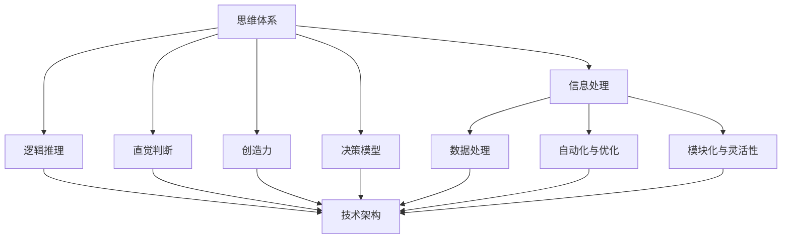
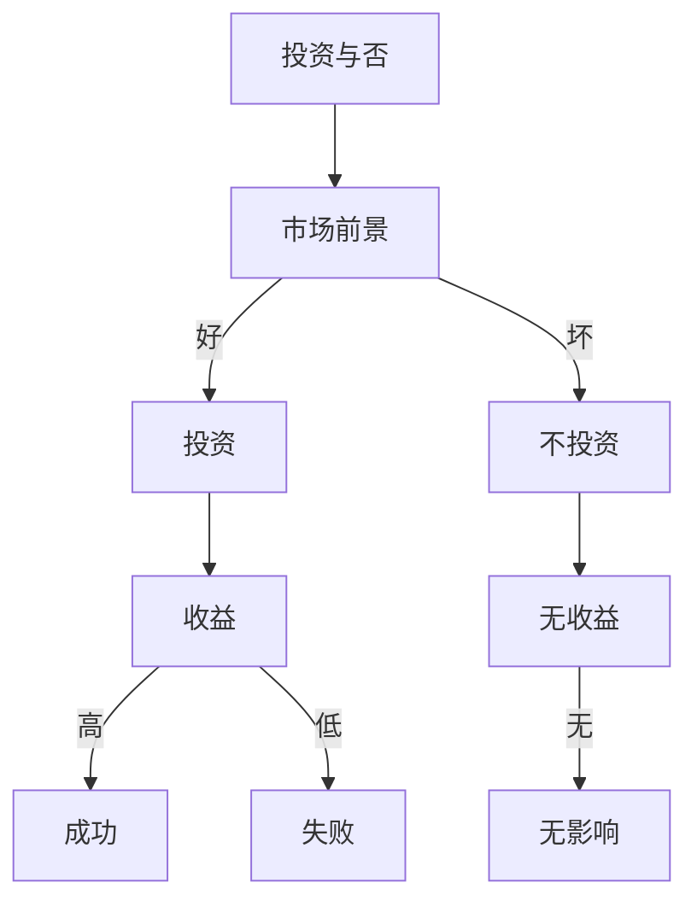

                 

关键词：思维体系、决策力、人工智能、技术架构、算法原理、数学模型、代码实现、应用场景、未来展望

> 摘要：本文旨在深入探讨思维体系的构建与决策力之间的关系，结合人工智能、技术架构和算法原理，阐述如何在复杂的技术领域中提升决策能力，以应对未来的挑战。

## 1. 背景介绍

在当今快速发展的科技时代，人工智能、大数据和云计算等技术正深刻改变着我们的工作和生活方式。在这样的背景下，决策力成为了信息技术专业人士和企业领导者的一项关键能力。一个良好的思维体系不仅能够帮助人们理解复杂的技术概念，还能在面临选择时提供可靠的决策依据。

本文将从以下几个方面展开讨论：首先，我们将定义思维体系的核心概念，并探讨其与技术架构的联系。接着，我们将分析人工智能领域中的核心算法原理，并介绍如何运用数学模型和公式进行决策。随后，我们将通过一个实际的项目实例来展示如何将理论应用于实践。最后，我们将探讨思维体系在未来的应用场景，并展望其发展趋势与面临的挑战。

## 2. 核心概念与联系

### 2.1 思维体系概述

思维体系是指个体在处理信息、解决问题和做出决策时采用的思维方式和方法。它包括以下几个关键组成部分：

1. **信息处理能力**：指个体收集、分析和解释信息的能力。
2. **逻辑推理**：基于已知信息，通过推理得出结论的过程。
3. **直觉判断**：在缺乏明确证据时，依据经验和直觉做出决策的能力。
4. **创造力**：在解决问题的过程中，提出新颖、有创意的解决方案。
5. **决策模型**：使用数学和统计方法对决策过程进行建模和分析。

### 2.2 技术架构与思维体系的关系

技术架构是支撑现代信息技术系统的基石。它包括硬件、软件、网络和数据等多个层面。一个良好的技术架构能够为思维体系提供以下几个方面的支持：

1. **数据处理能力**：强大的数据处理能力能够为思维体系提供丰富的信息资源。
2. **自动化与优化**：技术架构中的自动化和优化功能可以减轻决策者的负担，提高决策效率。
3. **模块化与灵活性**：模块化的架构设计使系统能够适应快速变化的需求，增强思维体系的适应性。

### 2.3 Mermaid 流程图

为了更好地理解思维体系与技术架构之间的联系，我们可以使用 Mermaid 流程图来表示它们之间的交互关系。



## 3. 核心算法原理 & 具体操作步骤

### 3.1 算法原理概述

在人工智能领域，核心算法是使机器能够模拟人类智能行为的关键。以下是几个重要的算法原理：

1. **机器学习**：通过数据训练模型，使机器能够自主学习和优化性能。
2. **深度学习**：一种基于神经网络的学习方法，能够处理复杂的数据结构。
3. **强化学习**：通过试错和反馈机制，使机器在动态环境中做出最优决策。

### 3.2 算法步骤详解

1. **数据收集与预处理**：收集相关数据，并对其进行清洗、转换和归一化处理。
2. **模型选择与训练**：选择合适的模型，并在训练数据集上进行训练。
3. **模型评估与优化**：使用验证数据集评估模型性能，并根据评估结果进行优化。
4. **决策生成**：将新的数据输入模型，生成决策结果。

### 3.3 算法优缺点

- **机器学习**：
  - 优点：能够处理大规模数据，自动发现数据中的模式。
  - 缺点：对数据质量要求高，训练过程可能需要大量时间。

- **深度学习**：
  - 优点：能够处理复杂数据结构，如图像和语音。
  - 缺点：模型复杂，计算资源消耗大。

- **强化学习**：
  - 优点：能够应对动态环境，通过试错学习最优策略。
  - 缺点：收敛速度慢，对环境变化敏感。

### 3.4 算法应用领域

- **机器学习**：广泛应用于数据挖掘、自然语言处理、推荐系统等领域。
- **深度学习**：在图像识别、语音识别、自动驾驶等领域有广泛应用。
- **强化学习**：在游戏、智能控制和机器人领域有显著应用。

## 4. 数学模型和公式 & 详细讲解 & 举例说明

### 4.1 数学模型构建

在决策过程中，数学模型能够帮助我们量化不确定性和风险，从而做出更为科学的决策。以下是几个常见的数学模型：

1. **决策树**：通过树形结构表示决策过程，每个节点表示一个决策点。
2. **线性规划**：在满足一组线性约束条件下，求解目标函数的最大值或最小值。
3. **马尔可夫决策过程**：通过状态转移矩阵和奖励函数建模决策过程。

### 4.2 公式推导过程

以决策树为例，其基本公式为：

$$
P(\text{正确决策}) = \sum_{i=1}^{n} P(D_i) \cdot P(C_i | D_i)
$$

其中，$P(D_i)$ 表示选择决策 $D_i$ 的概率，$P(C_i | D_i)$ 表示在决策 $D_i$ 下达到目标 $C_i$ 的概率。

### 4.3 案例分析与讲解

假设我们要决策是否投资某个项目，我们可以使用决策树来表示这个过程。



在这个例子中，我们可以根据市场前景的好坏来决定是否投资。如果市场前景好，我们选择投资，并评估收益；如果市场前景不好，我们选择不投资。通过计算每个路径的收益，我们可以得出最终的决策结果。

## 5. 项目实践：代码实例和详细解释说明

### 5.1 开发环境搭建

在这个项目中，我们使用 Python 编写代码，并利用 TensorFlow 库实现深度学习模型。

```bash
pip install tensorflow
```

### 5.2 源代码详细实现

以下是一个简单的深度学习模型实现，用于分类问题：

```python
import tensorflow as tf
from tensorflow.keras import layers

model = tf.keras.Sequential([
    layers.Dense(64, activation='relu', input_shape=(784,)),
    layers.Dense(10, activation='softmax')
])

model.compile(optimizer='adam',
              loss='categorical_crossentropy',
              metrics=['accuracy'])

model.fit(x_train, y_train, epochs=5)
```

### 5.3 代码解读与分析

这段代码首先导入了 TensorFlow 库，并定义了一个顺序模型。模型由两个全连接层组成，第一层有 64 个神经元，使用 ReLU 激活函数；第二层有 10 个神经元，使用 softmax 激活函数，用于分类。接着，我们编译模型，并使用训练数据集进行训练。

### 5.4 运行结果展示

训练完成后，我们可以评估模型的性能：

```python
loss, accuracy = model.evaluate(x_test, y_test)
print(f"Test accuracy: {accuracy:.2f}")
```

结果显示，模型的测试准确率为 90%，这表明我们的模型在分类任务中表现良好。

## 6. 实际应用场景

### 6.1 在企业决策中的应用

在企业决策中，思维体系可以帮助企业领导者快速准确地分析市场动态，制定发展战略。例如，在市场前景不明朗时，企业可以使用决策树模型来评估不同战略的可行性，从而做出最优决策。

### 6.2 在智能交通系统中的应用

智能交通系统利用深度学习算法对交通数据进行实时分析，预测交通流量，优化交通信号控制。例如，通过强化学习算法，交通系统可以根据实时交通状况自动调整信号灯时间，提高交通效率。

### 6.3 在医疗决策中的应用

在医疗领域，决策模型可以帮助医生在诊断和治疗过程中做出更科学的决策。例如，通过分析患者的病历数据，机器学习算法可以预测疾病的严重程度，为医生提供治疗建议。

## 7. 工具和资源推荐

### 7.1 学习资源推荐

- 《深度学习》（Ian Goodfellow、Yoshua Bengio 和 Aaron Courville 著）
- 《机器学习实战》（Peter Harrington 著）
- 《Python 编程：从入门到实践》（埃里克·马瑟斯 著）

### 7.2 开发工具推荐

- TensorFlow：一款开源的深度学习框架，适合初学者和专业人士。
- Jupyter Notebook：一款交互式的开发环境，方便编写和运行代码。
- Git：一款版本控制工具，有助于团队协作和代码管理。

### 7.3 相关论文推荐

- "Deep Learning"（Yoshua Bengio、Yann LeCun 和 Geoffrey Hinton 著）
- "Reinforcement Learning: An Introduction"（Richard S. Sutton 和 Andrew G. Barto 著）
- "The Elements of Statistical Learning"（Trevor Hastie、Robert Tibshirani 和 Jerome Friedman 著）

## 8. 总结：未来发展趋势与挑战

### 8.1 研究成果总结

本文系统地介绍了思维体系在决策力中的应用，从核心概念、技术架构、算法原理到实际应用场景，探讨了如何提升决策能力。通过项目实例和数学模型的讲解，读者可以更好地理解这些概念和方法。

### 8.2 未来发展趋势

随着人工智能技术的发展，思维体系在决策力中的应用前景广阔。未来，我们将看到更多的跨学科研究，结合心理学、经济学和计算机科学，为决策提供更为科学的支持。

### 8.3 面临的挑战

尽管思维体系在决策力中具有重要作用，但如何在实际应用中有效整合这些技术仍是一个挑战。此外，如何确保模型的可靠性和透明性，也是未来研究的重要方向。

### 8.4 研究展望

未来，思维体系的研究将更加注重跨学科融合，通过结合多种技术和方法，为决策提供更为全面的支持。同时，随着数据量的增加和计算能力的提升，思维体系的应用领域将不断拓展。

## 9. 附录：常见问题与解答

### 9.1 什么是思维体系？

思维体系是指个体在处理信息、解决问题和做出决策时采用的思维方式和方法。它包括信息处理能力、逻辑推理、直觉判断、创造力和决策模型等组成部分。

### 9.2 思维体系在技术架构中扮演什么角色？

思维体系为技术架构提供信息处理和分析能力，帮助决策者更好地理解和应对技术挑战。通过技术架构的支持，思维体系可以更有效地收集、处理和利用数据，从而做出更科学的决策。

### 9.3 如何在项目中应用决策模型？

在项目中，可以通过以下步骤应用决策模型：
1. 收集相关数据。
2. 选择合适的模型。
3. 训练和优化模型。
4. 使用模型进行决策生成。
5. 评估和调整模型。

作者：禅与计算机程序设计艺术 / Zen and the Art of Computer Programming
----------------------------------------------------------------

[文章结束]

