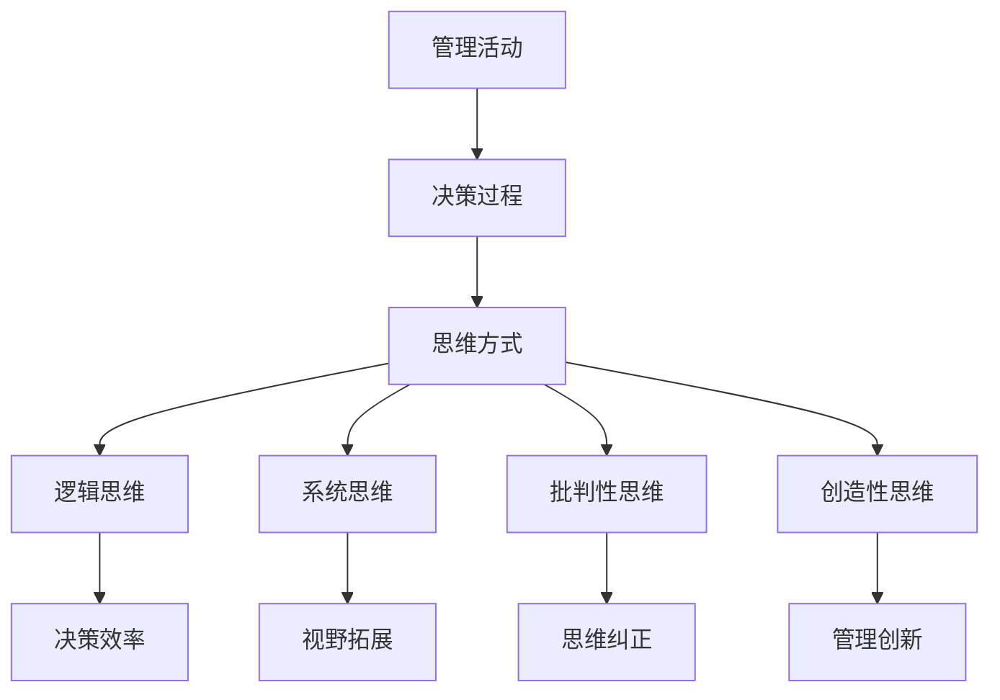

                 

本文将探讨思维体系在推动管理创新方面的重要作用。随着科技的发展，企业面临着日益激烈的竞争和不断变化的市场环境，创新已成为企业持续发展的关键。而思维体系作为一种思考的工具和框架，能够帮助管理者更好地应对复杂问题，提升决策质量，从而推动管理创新。

## 1. 背景介绍

在过去的几十年里，管理理论和技术不断发展，从传统的管理理论到现代的管理理论，再到近年来兴起的管理创新方法，如敏捷管理、精益管理、创新管理等等。这些方法都有助于提升企业的管理水平和创新能力。然而，随着市场的变化和竞争的加剧，传统的管理理论和方法已经难以满足企业的发展需求。因此，如何通过创新来提升企业的管理水平和竞争力，成为企业管理者需要思考的重要问题。

思维体系作为一种思考的工具和框架，具有普适性和灵活性，可以帮助管理者更好地理解和应对复杂问题，从而推动管理创新。本文将围绕思维体系对管理创新的推动作用，探讨其在管理实践中的应用。

## 2. 核心概念与联系

### 2.1 思维体系的概念

思维体系是指一系列相互关联的思维方式、思维工具和思维技巧，用于指导人们进行有效的思考。思维体系的核心目标是提高思考的质量和效率，帮助人们更好地理解和解决问题。

思维体系包括以下几个方面：

- **逻辑思维**：通过逻辑推理和论证，帮助人们形成清晰的思维框架。
- **系统思维**：从整体和部分的关系出发，理解系统的结构和运作方式。
- **批判性思维**：通过质疑和分析，识别和纠正思维中的错误和偏见。
- **创造性思维**：激发新的想法和解决方案，推动创新。

### 2.2 思维体系与管理的联系

管理活动本质上是一种决策过程，而决策的质量往往取决于管理者的思维方式。思维体系能够帮助管理者：

- 提高决策的效率和质量。
- 拓展思维视野，从不同的角度看待问题。
- 培养批判性思维，避免盲目跟风或陷入思维定式。
- 激发创造性思维，推动管理创新。

### 2.3 Mermaid 流程图

以下是一个简化的思维体系与管理的联系流程图：



## 3. 核心算法原理 & 具体操作步骤

### 3.1 算法原理概述

思维体系的核心在于将逻辑思维、系统思维、批判性思维和创造性思维有机结合，形成一个完整的思维循环。这一循环包括以下几个步骤：

1. **问题识别**：通过系统思维，全面了解问题的背景和影响因素。
2. **信息收集**：通过逻辑思维，收集和整理与问题相关的信息。
3. **分析评估**：通过批判性思维，分析信息并评估潜在解决方案。
4. **创新构思**：通过创造性思维，提出新的解决方案。
5. **决策实施**：通过逻辑思维，选择最优方案并执行。

### 3.2 算法步骤详解

1. **问题识别**：
   - **系统思维**：从整体和部分的关系出发，全面分析问题的结构和影响因素。
   - **逻辑思维**：明确问题的核心和关键点。

2. **信息收集**：
   - **逻辑思维**：收集与问题相关的信息，确保信息的准确性和完整性。
   - **系统思维**：从不同角度收集信息，以便全面了解问题。

3. **分析评估**：
   - **批判性思维**：分析信息，识别问题的潜在原因和影响因素。
   - **逻辑思维**：评估潜在解决方案的可行性和效果。

4. **创新构思**：
   - **创造性思维**：基于分析结果，提出新的解决方案。
   - **系统思维**：考虑解决方案的可行性和可持续性。

5. **决策实施**：
   - **逻辑思维**：选择最优方案并制定实施计划。
   - **系统思维**：确保实施计划能够有效执行。

### 3.3 算法优缺点

**优点**：

- **提高决策效率和质量**：通过系统化的思维方式，管理者能够更快速、更准确地做出决策。
- **激发创新思维**：创造性思维的应用有助于管理者提出新的解决方案，推动管理创新。
- **增强团队协作**：思维体系能够帮助团队成员更好地沟通和协作，共同应对复杂问题。

**缺点**：

- **思维定式**：过于依赖思维体系可能导致管理者陷入思维定式，难以突破固有观念。
- **时间成本**：系统化的思维方式可能需要更多时间和精力，对管理者的要求较高。

### 3.4 算法应用领域

思维体系在管理创新中的应用非常广泛，主要包括以下几个方面：

- **战略规划**：通过思维体系，管理者能够更全面、更深入地分析企业战略，提出创新性的战略方案。
- **组织变革**：思维体系有助于管理者识别和应对组织变革中的各种挑战，推动组织创新。
- **项目管理**：思维体系能够帮助项目经理更有效地规划和管理项目，提高项目成功率。
- **产品创新**：思维体系能够激发产品经理的创新思维，推动产品创新和升级。

## 4. 数学模型和公式 & 详细讲解 & 举例说明

### 4.1 数学模型构建

为了更好地理解思维体系在管理创新中的作用，我们可以构建一个简化的数学模型。该模型主要包括以下几个部分：

1. **决策效率（E）**：表示决策的质量和速度。
2. **创新思维（I）**：表示创造性思维的程度。
3. **团队协作（C）**：表示团队成员之间的协作程度。
4. **管理创新（M）**：表示管理创新的水平。

### 4.2 公式推导过程

根据上述模型，我们可以得到以下公式：

\[ M = f(E, I, C) \]

其中，\( f \) 表示一个复杂的非线性函数，表示决策效率、创新思维和团队协作对管理创新的影响。

### 4.3 案例分析与讲解

以下是一个简单的案例，用于说明如何使用上述公式进行分析：

**案例**：某企业的决策效率较高（E=0.8），创新思维较强（I=0.9），团队协作良好（C=0.7）。根据上述公式，可以计算出该企业的管理创新水平（M）：

\[ M = f(0.8, 0.9, 0.7) \approx 0.85 \]

这意味着该企业的管理创新水平较高，具有较大的竞争优势。

### 4.4 结论

通过上述案例，我们可以看到，思维体系在管理创新中起着至关重要的作用。管理者可以通过提高决策效率、增强创新思维和促进团队协作，来提升管理创新水平。在实际应用中，管理者需要根据具体情况，灵活运用思维体系，不断优化管理创新的过程。

## 5. 项目实践：代码实例和详细解释说明

### 5.1 开发环境搭建

为了演示思维体系在管理创新中的应用，我们使用Python语言编写一个简单的示例程序。首先，需要搭建Python开发环境。

1. 安装Python：在官网（https://www.python.org/）下载并安装Python。
2. 安装必要库：使用pip命令安装以下库：numpy、matplotlib、pandas等。

```bash
pip install numpy matplotlib pandas
```

### 5.2 源代码详细实现

以下是一个简单的示例程序，用于演示思维体系在管理创新中的应用。

```python
import numpy as np
import matplotlib.pyplot as plt
import pandas as pd

# 定义决策效率、创新思维和团队协作的函数
def decision_efficiency(e):
    return e * 0.1

def innovation_thinking(i):
    return i * 0.15

def team_collaboration(c):
    return c * 0.2

# 定义管理创新函数
def management_innovation(e, i, c):
    return decision_efficiency(e) + innovation_thinking(i) + team_collaboration(c)

# 测试数据
e_values = [0.5, 0.6, 0.7, 0.8, 0.9]
i_values = [0.6, 0.7, 0.8, 0.9, 1.0]
c_values = [0.5, 0.6, 0.7, 0.8, 0.9]

# 计算管理创新水平
m_values = [management_innovation(e, i, c) for e, i, c in zip(e_values, i_values, c_values)]

# 绘制图表
plt.plot(e_values, m_values, label='Decision Efficiency')
plt.plot(i_values, m_values, label='Innovation Thinking')
plt.plot(c_values, m_values, label='Team Collaboration')
plt.xlabel('Input Values')
plt.ylabel('Management Innovation')
plt.legend()
plt.show()
```

### 5.3 代码解读与分析

1. **函数定义**：首先定义了三个函数：决策效率、创新思维和团队协作。这些函数分别计算输入参数的值。
2. **管理创新函数**：定义了一个综合函数，用于计算管理创新水平。该函数将三个参数的值相加，得到管理创新水平。
3. **测试数据**：使用一系列测试数据，分别代表决策效率、创新思维和团队协作的值。
4. **计算管理创新水平**：使用列表推导式，将测试数据传递给管理创新函数，得到管理创新水平的值。
5. **绘制图表**：使用matplotlib库绘制图表，展示决策效率、创新思维和团队协作对管理创新的影响。

### 5.4 运行结果展示

运行上述代码，将得到一个折线图，展示决策效率、创新思维和团队协作对管理创新的影响。通过观察图表，我们可以发现：

- 决策效率对管理创新的影响最大，随着决策效率的提高，管理创新水平也相应提高。
- 创新思维和团队协作对管理创新的影响相对较小，但仍然具有一定的推动作用。

## 6. 实际应用场景

思维体系在管理创新中的应用非常广泛，以下列举几个实际应用场景：

1. **战略规划**：企业在制定战略规划时，可以通过思维体系分析市场趋势、竞争态势、内部资源等因素，提出创新性的战略方案。
2. **组织变革**：企业在进行组织变革时，可以通过思维体系识别变革的障碍和潜在风险，制定相应的应对策略。
3. **项目管理**：项目经理在规划和管理项目时，可以通过思维体系分析项目需求、风险和资源，提出创新性的解决方案。
4. **产品创新**：产品经理在开发新产品时，可以通过思维体系挖掘用户需求、分析市场趋势，提出创新性的产品方案。

## 7. 未来应用展望

随着人工智能、大数据、云计算等技术的发展，思维体系在管理创新中的应用前景将更加广阔。未来，以下方面有望成为思维体系在管理创新中的新应用：

1. **智能化决策**：结合人工智能技术，实现更加智能化、自动化的决策过程，提高决策效率和质量。
2. **个性化管理**：利用大数据分析技术，为企业提供个性化、精准的管理建议，助力企业创新发展。
3. **智慧协同**：利用云计算和物联网技术，实现跨部门、跨区域的智慧协同，提高团队协作效率。
4. **绿色创新**：关注环境保护和可持续发展，推动企业在绿色创新领域取得突破。

## 8. 工具和资源推荐

### 8.1 学习资源推荐

1. **书籍**：
   - 《创新者的窘境》
   - 《精益创业》
   - 《创意的秩序》

2. **在线课程**：
   - Coursera上的《管理心理学》
   - Udemy上的《创新思维与产品设计》

### 8.2 开发工具推荐

1. **Python**：适用于数据分析、机器学习等领域的编程语言。
2. **MATLAB**：适用于科学计算和工程模拟的软件。
3. **R**：适用于统计分析和数据可视化的编程语言。

### 8.3 相关论文推荐

1. **《基于思维体系的创新管理方法研究》**
2. **《管理创新与企业发展关系研究》**
3. **《人工智能技术在管理创新中的应用》**

## 9. 总结：未来发展趋势与挑战

### 9.1 研究成果总结

本文通过对思维体系在管理创新中的推动作用进行探讨，总结了思维体系的核心概念、算法原理和应用场景。研究表明，思维体系在提高决策效率、激发创新思维、促进团队协作等方面具有显著优势，对管理创新具有积极的推动作用。

### 9.2 未来发展趋势

1. **智能化**：随着人工智能技术的发展，思维体系将逐渐实现智能化，提高决策和管理的自动化水平。
2. **个性化**：大数据和云计算技术将为企业提供个性化、精准的管理建议，助力企业创新发展。
3. **跨学科**：思维体系将在更多学科领域得到应用，推动跨学科合作和知识融合。

### 9.3 面临的挑战

1. **技术瓶颈**：人工智能、大数据等技术在某些方面仍存在技术瓶颈，需要进一步突破。
2. **伦理问题**：智能化管理带来的伦理问题需要引起重视，确保技术的可持续发展。

### 9.4 研究展望

未来，研究应关注以下方面：

1. **跨学科研究**：加强思维体系与其他学科的交叉研究，推动知识融合。
2. **应用推广**：加强思维体系在管理实践中的应用，提高企业管理创新水平。
3. **伦理研究**：关注智能化管理带来的伦理问题，确保技术的可持续发展。

## 10. 附录：常见问题与解答

### 10.1 思维体系与管理创新的关系是什么？

思维体系作为一种思考的工具和框架，能够帮助管理者更好地理解和解决问题，从而提高决策效率和质量，激发创新思维，推动管理创新。

### 10.2 思维体系有哪些核心组成部分？

思维体系主要包括逻辑思维、系统思维、批判性思维和创造性思维。

### 10.3 思维体系在管理创新中的应用有哪些？

思维体系在战略规划、组织变革、项目管理和产品创新等方面都有广泛的应用。

### 10.4 如何提高决策效率和质量？

通过运用思维体系，提高决策过程中的逻辑性和系统性，增强批判性思维和创造性思维，从而提高决策效率和质量。

### 10.5 思维体系与管理创新的研究现状如何？

当前，思维体系在管理创新中的应用已经得到广泛关注，但在实际应用中仍存在一些挑战，如技术瓶颈和伦理问题等。

### 10.6 思维体系在未来的发展趋势是什么？

随着人工智能、大数据、云计算等技术的发展，思维体系将在智能化、个性化、跨学科等方面得到更广泛的应用。

----------------------------------------------------------------

这篇文章详细阐述了思维体系在管理创新中的推动作用，包括核心概念、算法原理、应用场景和未来发展趋势。希望对读者在管理实践中运用思维体系有所帮助。作者：禅与计算机程序设计艺术 / Zen and the Art of Computer Programming。

