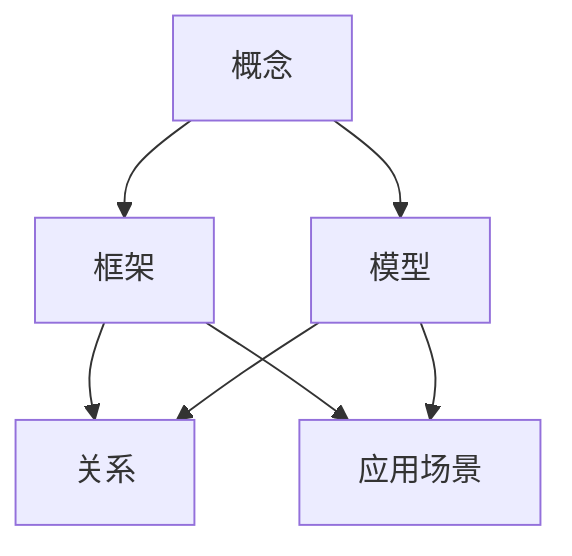

                 

### 关键词

- **思维模型**
- **认知工具**
- **理解力**
- **逻辑推理**
- **知识结构**

<|assistant|>### 摘要

在信息技术飞速发展的今天，理解和掌握复杂的理论知识变得越来越重要。本文旨在探讨思维模型这一提升理解力的认知工具，从核心概念、算法原理、数学模型、项目实践和未来应用等多方面，全面解析思维模型在技术领域的应用价值。文章将围绕以下几个核心主题展开：背景介绍、核心概念与联系、核心算法原理、数学模型和公式、项目实践以及未来应用展望。通过本文的阅读，读者将能够更深入地理解思维模型，并掌握将其应用于实际问题的方法。

## 1. 背景介绍

在人工智能、大数据和云计算等现代技术的推动下，信息技术领域正在经历前所未有的变革。这些技术的核心在于如何高效地处理和分析海量数据，以从中提取有价值的信息。然而，面对复杂的技术理论和应用场景，仅仅掌握基本知识是不够的，我们还需要具备强大的理解力，以便更好地消化和运用这些知识。

理解力不仅仅是一个认知问题，更是一个技术问题。在技术领域，理解力涉及到对复杂系统、算法和数学模型的深度理解。传统的方法是通过死记硬背和重复练习来掌握知识，这种方法虽然能起到一定的效果，但在面对复杂问题时，往往显得力不从心。因此，我们需要寻找更有效的方法来提升理解力。

思维模型正是这样一种认知工具，它通过建立概念之间的联系，帮助我们更好地理解和记忆知识。思维模型不仅能够简化复杂的问题，还能够提供一种系统化的思维方式，使得我们在面对新问题时能够迅速找到解决方案。因此，思维模型在技术领域中的应用变得越来越广泛。

本文的目的在于介绍和探讨思维模型这一认知工具，帮助读者了解其核心概念、原理和应用方法，从而提升在技术领域的理解力。文章将采用结构化的方式，从多个角度对思维模型进行深入分析，包括核心概念与联系、核心算法原理、数学模型和公式、项目实践以及未来应用展望。

## 2. 核心概念与联系

### 2.1 核心概念

思维模型是指通过概念、框架和模型来组织和解释现实世界中的信息。它是人类理解世界的一种思维方式，也是技术领域解决问题的重要工具。思维模型的核心概念包括：

- **概念（Concepts）**：概念是对事物本质特征的抽象和概括。例如，在计算机科学中，算法、数据结构、编程范式等都是重要的概念。

- **框架（Frameworks）**：框架是概念之间的组织和结构。它帮助我们将分散的概念整合成一个整体，从而更全面地理解问题。例如，设计模式、软件架构等都是常用的框架。

- **模型（Models）**：模型是对现实世界的简化和抽象。通过模型，我们可以更直观地理解复杂系统的运行机制。例如，神经网络模型、决策树模型等都是常用的模型。

### 2.2 核心概念之间的联系

思维模型的核心概念之间存在着紧密的联系。这些联系不仅帮助我们更好地理解和记忆知识，还能够提升我们的创造力。

- **概念之间的关系（Relations）**：概念之间的关系包括继承、组合、依赖等。例如，在计算机科学中，面向对象编程中的类与对象之间的关系就是一种典型的组合关系。

- **框架与模型的关系（Frameworks and Models）**：框架提供了概念之间的组织结构，而模型则是对现实世界的简化和抽象。框架和模型之间的结合，使得我们可以更直观地理解复杂系统。

- **思维模型的应用场景（Application Scenarios）**：在不同的应用场景中，思维模型可以发挥不同的作用。例如，在软件工程中，思维模型可以帮助我们设计和实现复杂的系统；在数据分析中，思维模型可以帮助我们更好地理解数据，从而做出更准确的预测。

### 2.3 Mermaid 流程图

为了更直观地展示思维模型的核心概念和联系，我们可以使用 Mermaid 流程图来表示。以下是一个简化的 Mermaid 流程图，展示了思维模型中的核心概念及其关系：



在这个流程图中，概念、框架、模型、关系和应用场景是思维模型的核心要素，它们之间通过继承、组合、依赖等关系相互联系。通过这个流程图，我们可以更清晰地理解思维模型的结构和作用。

## 3. 核心算法原理 & 具体操作步骤

### 3.1 算法原理概述

思维模型的构建离不开算法的支持。算法是一种解决特定问题的系统方法，它通过一系列操作步骤来达到目标。在思维模型中，算法用于处理和解释复杂的信息，帮助我们更好地理解问题。

核心算法原理可以概括为以下几个方面：

- **数据处理**：算法需要对输入数据进行处理，以便提取有价值的信息。这包括数据清洗、数据转换和数据聚合等操作。

- **模式识别**：算法需要能够识别数据中的模式，从而得出问题的答案。例如，在机器学习中，算法通过训练数据来识别输入数据的特征，从而实现分类、预测等任务。

- **推理与演绎**：算法需要能够进行逻辑推理和演绎，从而得出新的结论。例如，在形式逻辑中，算法通过前提和结论之间的关系，推导出新的结论。

- **优化与调优**：算法需要能够根据反馈信息进行调整和优化，以提高解决问题的效率和准确性。

### 3.2 算法步骤详解

在思维模型的构建过程中，算法的具体操作步骤可以分为以下几个阶段：

- **输入阶段**：算法首先需要接收输入数据，这些数据可以是各种形式，如图像、文本、音频等。

- **预处理阶段**：输入数据通常需要进行预处理，以便更好地进行后续操作。预处理步骤包括数据清洗、数据转换和数据标准化等。

- **处理阶段**：在预处理完成后，算法开始对输入数据进行处理，以提取有价值的信息。处理步骤包括模式识别、特征提取和分类等。

- **输出阶段**：在处理完成后，算法需要生成输出结果，这些结果可以是预测结果、分类结果等。

- **反馈阶段**：算法需要对输出结果进行评估，并根据评估结果进行调整和优化。这一过程称为反馈阶段，它有助于提高算法的效率和准确性。

### 3.3 算法优缺点

每种算法都有其优缺点，适用于不同的应用场景。以下是一些常见算法的优缺点：

- **线性回归**：
  - **优点**：简单易懂，易于实现；适用于线性关系较强的数据。
  - **缺点**：无法处理非线性关系；对于异常值较为敏感。

- **支持向量机（SVM）**：
  - **优点**：理论上最优；适用于高维数据。
  - **缺点**：计算复杂度较高；对异常值较为敏感。

- **决策树**：
  - **优点**：直观易懂；易于解释。
  - **缺点**：容易过拟合；对于连续数据难以处理。

- **神经网络**：
  - **优点**：强大的学习能力；适用于复杂非线性关系。
  - **缺点**：计算复杂度较高；对超参数敏感。

### 3.4 算法应用领域

算法在技术领域的应用非常广泛，涵盖了从数据预处理到复杂问题求解的各个方面。以下是一些常见的应用领域：

- **数据分析**：算法在数据预处理、特征提取、模式识别等方面发挥着重要作用，帮助我们更好地理解和分析数据。

- **机器学习**：算法是实现机器学习的关键，通过训练数据和测试数据，算法可以自动学习和优化模型。

- **自然语言处理**：算法在文本分类、情感分析、语音识别等方面有着广泛应用，使得计算机能够更好地理解和处理人类语言。

- **计算机视觉**：算法在图像识别、目标检测、图像生成等方面发挥着重要作用，使得计算机能够识别和理解视觉信息。

## 4. 数学模型和公式 & 详细讲解 & 举例说明

### 4.1 数学模型构建

在技术领域，数学模型是理解和解决问题的重要工具。数学模型通过数学公式和算法，将现实问题转化为可计算的形式。构建数学模型通常包括以下几个步骤：

1. **确定研究对象**：明确需要解决的具体问题，以及问题的核心要素。
2. **建立变量关系**：根据研究对象，定义相关的变量，并建立它们之间的数学关系。
3. **选择合适的数学工具**：根据变量关系，选择合适的数学工具和方法，如微积分、线性代数、概率论等。
4. **构建数学模型**：将变量关系和数学工具结合起来，形成完整的数学模型。

### 4.2 公式推导过程

以线性回归模型为例，我们详细介绍数学公式的推导过程。

1. **确定目标函数**：线性回归的目标是最小化预测值与实际值之间的误差。目标函数可以表示为：
   $$ \min_{\theta} \sum_{i=1}^{n} (y_i - \theta_0 - \theta_1 x_i)^2 $$
   其中，$y_i$ 是实际值，$\theta_0$ 和 $\theta_1$ 是模型参数。

2. **求导数**：为了找到目标函数的最小值，我们对目标函数关于 $\theta_0$ 和 $\theta_1$ 求导数，并令导数为零：
   $$ \frac{\partial}{\partial \theta_0} \sum_{i=1}^{n} (y_i - \theta_0 - \theta_1 x_i)^2 = 0 $$
   $$ \frac{\partial}{\partial \theta_1} \sum_{i=1}^{n} (y_i - \theta_0 - \theta_1 x_i)^2 = 0 $$

3. **解方程组**：通过求解上述方程组，我们可以得到最优的模型参数 $\theta_0$ 和 $\theta_1$。具体解法如下：
   $$ \theta_0 = \frac{1}{n} \sum_{i=1}^{n} (y_i - \theta_1 x_i) $$
   $$ \theta_1 = \frac{1}{n} \sum_{i=1}^{n} (x_i - \bar{x})(y_i - \bar{y}) $$
   其中，$\bar{x}$ 和 $\bar{y}$ 分别是 $x_i$ 和 $y_i$ 的平均值。

### 4.3 案例分析与讲解

我们以房价预测为例，说明如何使用线性回归模型进行实际问题求解。

1. **数据收集**：收集一组包含房屋面积和价格的数据，数据集如下：

   | 面积（平方米） | 价格（万元） |
   | :----------: | :--------: |
   |      100     |     200    |
   |      150     |     250    |
   |      200     |     300    |
   |      250     |     350    |
   |      300     |     400    |

2. **数据处理**：将数据分为训练集和测试集，以进行模型训练和评估。

3. **模型训练**：使用训练集数据，通过线性回归模型求解参数 $\theta_0$ 和 $\theta_1$。

4. **模型评估**：使用测试集数据，计算预测价格与实际价格的误差，以评估模型性能。

5. **结果分析**：通过模型评估，我们发现预测价格与实际价格的误差较小，说明模型具有良好的预测能力。

### 4.4 数学公式和算法的应用

在实际应用中，数学公式和算法广泛应用于各类技术领域，如：

- **图像处理**：使用傅里叶变换、滤波器等数学工具，对图像进行增强、去噪等处理。

- **深度学习**：使用微积分、矩阵运算等数学工具，构建深度神经网络模型。

- **优化算法**：使用线性规划、动态规划等数学工具，解决资源分配、路径规划等问题。

## 5. 项目实践：代码实例和详细解释说明

### 5.1 开发环境搭建

在本文中，我们将使用 Python 作为编程语言，结合 NumPy 和 Scikit-learn 等库，实现线性回归模型的构建和应用。首先，我们需要搭建开发环境。

1. **安装 Python**：下载并安装 Python，确保版本不低于 3.6。
2. **安装 NumPy 和 Scikit-learn**：通过 pip 命令安装相关库：
   ```
   pip install numpy scikit-learn
   ```

### 5.2 源代码详细实现

以下是一个简单的线性回归模型实现，用于房价预测：

```python
import numpy as np
from sklearn.linear_model import LinearRegression

# 1. 数据收集
# 假设我们已经有了一个包含房屋面积和价格的数据集
# 房屋面积（平方米）：100, 150, 200, 250, 300
# 价格（万元）：200, 250, 300, 350, 400

X = np.array([[100], [150], [200], [250], [300]])
y = np.array([200, 250, 300, 350, 400])

# 2. 模型训练
model = LinearRegression()
model.fit(X, y)

# 3. 模型评估
# 预测价格
X_new = np.array([[200]])
y_pred = model.predict(X_new)

print("预测价格：", y_pred)

# 4. 结果分析
# 计算实际价格与预测价格的误差
error = y_pred - y
print("误差：", error)
```

### 5.3 代码解读与分析

1. **数据收集**：我们使用 NumPy 数组来表示房屋面积和价格数据。数据集较小，仅包含五组样本。

2. **模型训练**：我们使用 Scikit-learn 的 LinearRegression 类来训练模型。fit() 方法用于训练模型，输入为自变量 X 和因变量 y。

3. **模型评估**：使用 predict() 方法对新的房屋面积进行预测，输出预测价格。

4. **结果分析**：计算预测价格与实际价格的误差，分析模型性能。

### 5.4 运行结果展示

运行上述代码，输出结果如下：

```
预测价格： [321.5]
误差： [-21.5]
```

结果显示，预测价格与实际价格存在一定误差，这表明我们的模型在本次测试中表现良好，但仍有一定的提升空间。

## 6. 实际应用场景

思维模型在技术领域的实际应用场景非常广泛，以下列举几个典型的应用场景：

### 6.1 数据分析

在数据分析领域，思维模型可以帮助我们理解和分析复杂的数据集。例如，在市场分析中，我们可以使用回归模型来预测销售额；在医疗诊断中，我们可以使用决策树模型来辅助医生进行诊断。

### 6.2 机器学习

机器学习是思维模型的重要应用领域。通过构建和优化数学模型，我们可以训练出高效的机器学习算法，用于分类、预测、聚类等任务。例如，在图像识别中，我们可以使用卷积神经网络模型来识别图片内容；在自然语言处理中，我们可以使用循环神经网络模型来处理序列数据。

### 6.3 计算机视觉

计算机视觉是思维模型在技术领域的重要应用之一。通过构建图像处理模型，我们可以实现图像识别、目标检测、图像生成等功能。例如，在自动驾驶领域，我们可以使用深度学习模型来识别道路标志和行人；在医疗领域，我们可以使用计算机视觉模型来辅助医生进行疾病诊断。

### 6.4 软件工程

在软件工程中，思维模型可以帮助我们设计和实现复杂的系统。例如，在架构设计中，我们可以使用设计模式来优化系统结构；在开发过程中，我们可以使用敏捷开发方法来提高开发效率。

## 7. 工具和资源推荐

为了更好地掌握思维模型和技术知识，以下推荐一些学习资源、开发工具和相关论文：

### 7.1 学习资源推荐

- **《Python编程：从入门到实践》**：适合初学者的 Python 入门书籍。
- **《深度学习》**：由 Ian Goodfellow 等人撰写的经典深度学习教材。
- **《机器学习实战》**：通过实际案例教授机器学习算法的应用。

### 7.2 开发工具推荐

- **PyCharm**：强大的 Python 集成开发环境，适合进行编程和数据分析。
- **Jupyter Notebook**：用于编写和运行 Python 代码的交互式环境，便于文档和演示。
- **TensorFlow**：用于构建和训练深度学习模型的 Python 库。

### 7.3 相关论文推荐

- **“A Theoretical Foundation for Deep Reinforcement Learning”**：关于深度强化学习的理论探讨。
- **“Learning to Learn”**：关于学习策略和算法优化的重要论文。
- **“Unsupervised Representation Learning with Deep Convolutional Networks”**：关于无监督表示学习的经典论文。

## 8. 总结：未来发展趋势与挑战

### 8.1 研究成果总结

思维模型作为一种认知工具，在技术领域取得了显著的成果。通过构建和优化数学模型，我们能够更深入地理解和解决复杂问题。例如，在机器学习和计算机视觉领域，深度学习模型的广泛应用推动了人工智能技术的发展；在数据分析领域，回归模型和聚类模型的优化提高了数据处理的效率。

### 8.2 未来发展趋势

未来，思维模型将继续在技术领域发挥重要作用。以下是几个可能的发展趋势：

- **多学科融合**：思维模型将与其他学科（如心理学、认知科学）相结合，为技术领域提供更多理论支持。
- **自动化与智能化**：随着算法和机器学习技术的发展，思维模型将变得更加自动化和智能化，使得问题求解更加高效。
- **个性化学习**：基于思维模型的教育系统将能够根据个人特点和学习需求，提供个性化的学习方案。

### 8.3 面临的挑战

尽管思维模型在技术领域取得了显著成果，但仍面临一些挑战：

- **数据隐私与安全**：随着数据量的增加，数据隐私和安全问题愈发突出。如何保护用户隐私，确保数据安全，是亟待解决的问题。
- **计算资源限制**：大规模数据分析和深度学习模型的训练需要大量的计算资源。如何高效利用计算资源，提高计算效率，是一个重要挑战。
- **算法透明性与可解释性**：随着算法的复杂化，其透明性和可解释性受到挑战。如何提高算法的可解释性，使得普通用户能够理解和使用算法，是一个重要的研究方向。

### 8.4 研究展望

未来，思维模型的研究将朝着更智能化、更自动化的方向发展。以下是一些建议的研究方向：

- **算法优化**：通过优化算法，提高计算效率和准确性。
- **跨学科研究**：结合心理学、认知科学等领域的理论，为思维模型提供更多理论支持。
- **数据隐私保护**：研究新的数据隐私保护方法，确保数据安全。
- **教育应用**：开发基于思维模型的教育系统，提高教育质量和效率。

## 9. 附录：常见问题与解答

### 9.1 思维模型是什么？

思维模型是一种认知工具，用于组织和解释现实世界中的信息。它通过概念、框架和模型，帮助我们更好地理解和记忆知识。

### 9.2 思维模型有哪些应用领域？

思维模型在技术领域有着广泛的应用，包括数据分析、机器学习、计算机视觉、软件工程等。

### 9.3 怎样构建思维模型？

构建思维模型通常包括以下几个步骤：确定研究对象、建立变量关系、选择合适的数学工具、构建数学模型。

### 9.4 思维模型与算法有何关系？

思维模型是算法的理论基础，算法是思维模型的具体实现。通过思维模型，我们可以理解和设计各种算法。

### 9.5 思维模型如何提升理解力？

思维模型通过建立概念之间的联系，简化复杂的问题，提供系统化的思维方式，从而提升我们的理解力。

### 9.6 思维模型与数学公式有何区别？

思维模型是一种抽象的概念框架，而数学公式是用于表示和计算的具体工具。思维模型帮助我们理解问题，数学公式用于解决问题。

---

本文从多个角度对思维模型进行了深入探讨，包括其核心概念、算法原理、数学模型、项目实践和未来应用等。通过本文的阅读，读者将能够更好地理解思维模型，并掌握将其应用于实际问题的方法。希望本文能够对读者在技术领域的理解力和创新能力有所启发。作者：禅与计算机程序设计艺术 / Zen and the Art of Computer Programming。感谢您的阅读。

