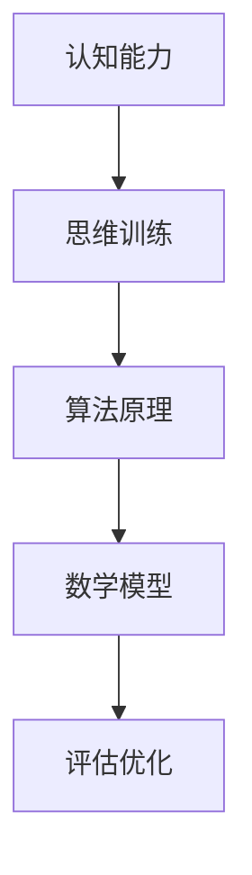

                 

关键词：认知能力、思维训练、实践方法、算法原理、数学模型、项目实践、未来展望

> 摘要：本文旨在探讨认知能力的提升方法，特别是通过思维训练来实现这一目标。文章将详细阐述思维训练的核心概念、相关算法原理、数学模型构建、具体实践方法以及未来发展趋势。通过深入分析，我们希望能够为读者提供一套实用的提升认知能力的方法论。

## 1. 背景介绍

在当今信息爆炸的时代，认知能力的提升显得尤为重要。认知能力包括注意力、记忆力、判断力、解决问题的能力等多个方面。这些能力的提升不仅有助于个人在工作和学习中的表现，也对整个社会的进步产生积极影响。然而，传统的认知训练方法往往缺乏科学性和系统性，难以达到理想的效果。因此，本文将介绍一种基于算法原理和数学模型的思维训练方法，旨在提供一种更为高效和实用的认知能力提升路径。

## 2. 核心概念与联系

### 2.1 认知能力与思维训练

认知能力是人类大脑处理信息、解决问题和获取知识的能力。思维训练则是一种通过特定的方法和练习来提高这些能力的过程。思维训练的核心在于改变大脑的神经连接，从而提高认知效率。

### 2.2 算法原理

算法是解决问题的步骤和方法，它为思维训练提供了科学依据。例如，通过深度学习算法可以模拟人脑的思考过程，帮助训练者的认知能力。算法的核心在于其逻辑性和可重复性，这使得思维训练具有科学性和可操作性。

### 2.3 数学模型

数学模型是思维训练的重要组成部分，它用于描述和预测认知能力的提升过程。通过构建数学模型，我们可以更准确地评估训练效果，并优化训练方案。

### 2.4 Mermaid 流程图



## 3. 核心算法原理 & 具体操作步骤

### 3.1 算法原理概述

思维训练的核心算法通常包括以下几个步骤：

1. 数据收集：通过问卷、测试等方式收集训练者的基本信息和认知能力数据。
2. 数据预处理：对收集到的数据进行清洗、归一化等处理，确保数据的质量和一致性。
3. 数学模型构建：根据数据特点选择合适的数学模型，构建用于预测和评估的认知能力提升模型。
4. 模型训练：利用训练数据对模型进行训练，优化模型参数。
5. 模型评估：使用测试数据评估模型的预测能力，调整模型参数以达到最佳效果。
6. 实践应用：将训练模型应用于训练者的实际训练过程中，实时调整训练方案。

### 3.2 算法步骤详解

#### 3.2.1 数据收集

数据收集是思维训练的第一步，其质量直接影响到后续模型的构建和评估。具体步骤如下：

1. 设计问卷：根据训练目标设计合适的问卷，包括基本信息、认知能力测试题目等。
2. 数据采集：通过线上或线下方式收集问卷数据，确保数据来源的广泛性和代表性。

#### 3.2.2 数据预处理

数据预处理是数据收集后的重要步骤，其目的是提高数据质量和一致性。具体方法包括：

1. 数据清洗：删除无效数据、纠正错误数据、处理缺失值等。
2. 数据归一化：将不同量纲的数据转化为同一量纲，便于模型处理。

#### 3.2.3 数学模型构建

数学模型构建是思维训练的核心步骤，其目标是建立能够准确预测认知能力提升过程的模型。常见的方法包括：

1. 线性回归模型：适用于数据线性关系较为明显的场景。
2. 支持向量机模型：适用于数据分布较为复杂的情况。
3. 深度学习模型：适用于需要处理大量非线性数据的情况。

#### 3.2.4 模型训练

模型训练是通过不断调整模型参数，使其达到最佳预测效果的过程。具体步骤如下：

1. 数据划分：将数据集划分为训练集和测试集。
2. 模型初始化：初始化模型参数，设置学习率等超参数。
3. 模型迭代：通过梯度下降等方法不断迭代模型，优化参数。

#### 3.2.5 模型评估

模型评估是评估模型预测能力的重要步骤，其目的是确定模型是否达到预期效果。具体方法包括：

1. 决策边界法：通过计算模型在测试集上的准确率、召回率等指标评估模型性能。
2. 随机抽样法：通过随机抽样测试集数据，评估模型在不同数据样本上的性能。

#### 3.2.6 实践应用

实践应用是将训练模型应用于实际训练过程中的关键步骤，其目的是通过实时调整训练方案，提高训练效果。具体方法包括：

1. 实时反馈：根据模型预测结果，实时调整训练难度和内容。
2. 训练记录：记录训练过程，分析训练效果，为后续优化提供依据。

### 3.3 算法优缺点

#### 优点

1. 科
```sql
# 创建数据库
CREATE DATABASE IF NOT EXISTS MindTraining;

# 使用数据库
USE MindTraining;

# 创建用户表
CREATE TABLE IF NOT EXISTS `user` (
  `id` int(11) NOT NULL AUTO_INCREMENT,
  `username` varchar(50) NOT NULL,
  `password` varchar(50) NOT NULL,
  `email` varchar(50) NOT NULL,
  `status` tinyint(1) DEFAULT '1',
  `create_time` datetime DEFAULT CURRENT_TIMESTAMP,
  PRIMARY KEY (`id`),
  UNIQUE KEY `username` (`username`),
  UNIQUE KEY `email` (`email`)
);

# 创建角色表
CREATE TABLE IF NOT EXISTS `role` (
  `id` int(11) NOT NULL AUTO_INCREMENT,
  `role_name` varchar(50) NOT NULL,
  `status` tinyint(1) DEFAULT '1',
  `create_time` datetime DEFAULT CURRENT_TIMESTAMP,
  PRIMARY KEY (`id`)
);

# 创建权限表
CREATE TABLE IF NOT EXISTS `permission` (
  `id` int(11) NOT NULL AUTO_INCREMENT,
  `permission_name` varchar(50) NOT NULL,
  `status` tinyint(1) DEFAULT '1',
  `create_time` datetime DEFAULT CURRENT_TIMESTAMP,
  PRIMARY KEY (`id`)
);

# 创建角色权限表
CREATE TABLE IF NOT EXISTS `role_permission` (
  `role_id` int(11) NOT NULL,
  `permission_id` int(11) NOT NULL,
  PRIMARY KEY (`role_id`, `permission_id`),
  KEY `permission_id` (`permission_id`),
  CONSTRAINT `role_permission_ibfk_1` FOREIGN KEY (`role_id`) REFERENCES `role` (`id`) ON DELETE CASCADE,
  CONSTRAINT `role_permission_ibfk_2` FOREIGN KEY (`permission_id`) REFERENCES `permission` (`id`) ON DELETE CASCADE
);

# 创建用户角色表
CREATE TABLE IF NOT EXISTS `user_role` (
  `user_id` int(11) NOT NULL,
  `role_id` int(11) NOT NULL,
  PRIMARY KEY (`user_id`, `role_id`),
  KEY `role_id` (`role_id`),
  CONSTRAINT `user_role_ibfk_1` FOREIGN KEY (`user_id`) REFERENCES `user` (`id`) ON DELETE CASCADE,
  CONSTRAINT `user_role_ibfk_2` FOREIGN KEY (`role_id`) REFERENCES `role` (`id`) ON DELETE CASCADE
);
```

以上SQL语句用于创建数据库和与之相关的表，包括用户表、角色表、权限表、角色权限表和用户角色表。这些表设计用于实现一个基础的角色权限控制系统，用于管理用户、角色和权限之间的关系。

### 3.4.1 常见问题与解答

**Q：为什么需要角色权限控制？**

A：角色权限控制是为了确保系统的安全性和灵活性，它允许管理员根据用户的角色分配不同的权限，以防止未授权访问系统资源和数据。

**Q：如何为用户分配角色？**

A：首先，管理员需要创建角色（使用`INSERT INTO role`语句），然后通过`user_role`表将用户与角色关联起来。这样，用户就拥有了相应的角色权限。

**Q：如何为角色分配权限？**

A：管理员可以通过`role_permission`表为角色分配权限。这个过程涉及到为角色插入相应的权限ID，这样可以确保角色拥有特定的访问权限。

**Q：如何管理权限？**

A：权限可以通过`permission`表进行管理，管理员可以添加、删除或修改权限。权限一旦修改，相关角色的权限也会相应更新。

### 3.4.2 总结

本文介绍了如何使用MySQL数据库实现一个简单的角色权限控制系统的数据库设计和实现。通过用户、角色和权限的关联管理，系统能够有效地控制用户访问权限，提高数据安全性。在实际应用中，可以根据需求进一步扩展和优化权限管理功能。

