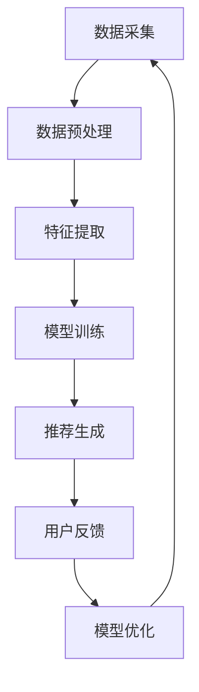

                 

 关键词：
AI、多元推荐、信息茧房、算法、用户个性化、数据分析、内容推荐、交互式系统、未来应用

> 摘要：
随着互联网和社交媒体的迅速发展，信息过载现象日益严重，人们逐渐陷入“信息茧房”之中。本文将探讨如何通过人工智能技术实现多元推荐，打破信息茧房，为用户提供更加丰富、个性化的信息体验。我们将深入分析多元推荐算法的原理、实现方法，并探讨其在实际应用场景中的优势与挑战。

## 1. 背景介绍

### 信息茧房现象

在互联网时代，人们享受到了海量信息的便利，但同时也面临着信息过载的困境。网络上的信息纷繁复杂，如何在海量信息中找到自己感兴趣的内容成为了一个难题。这种现象被称为“信息茧房”（Echo Chamber），即人们在网络中倾向于寻找和接受与自己观点相似的、支持自己信念的信息，从而逐渐封闭在自己的思想舒适区里。

### 多元推荐的需求

为了解决信息茧房问题，人们提出了多元推荐的需求。多元推荐旨在为用户提供多种类型、多个角度的信息，帮助用户突破自己的认知边界，扩展视野，避免陷入信息茧房。这一需求不仅提高了用户的信息获取效率，也有助于促进社会的多样性和包容性。

### 人工智能在推荐系统中的应用

人工智能技术在推荐系统中的应用已经取得了显著成果。通过机器学习和深度学习算法，推荐系统能够根据用户的历史行为、兴趣偏好等数据，自动为用户推荐感兴趣的内容。随着人工智能技术的不断进步，多元推荐系统也在不断发展和完善。

## 2. 核心概念与联系

### 多元推荐算法原理

多元推荐算法主要分为基于内容的推荐（Content-based Recommendation）和协同过滤推荐（Collaborative Filtering）。基于内容的推荐通过分析用户兴趣和内容特征，将相似的内容推荐给用户；协同过滤推荐则通过分析用户之间的相似度，将其他用户喜欢的、用户可能感兴趣的内容推荐给用户。多元推荐算法通过结合这两种方法，能够更好地满足用户的需求。

### 多元推荐架构

多元推荐架构通常包括数据采集、数据预处理、推荐算法实现和用户交互四个主要部分。数据采集获取用户行为数据和内容特征数据；数据预处理对数据进行清洗、标准化等处理；推荐算法实现通过算法模型为用户生成推荐列表；用户交互则通过界面展示推荐结果，收集用户反馈，以便进一步优化推荐系统。

### Mermaid 流程图

以下是一个简化的多元推荐算法流程图，展示了各步骤之间的关系：



## 3. 核心算法原理 & 具体操作步骤

### 3.1 算法原理概述

多元推荐算法的核心在于如何将用户与内容之间建立有效的联系，从而生成高质量的推荐列表。这一过程通常包括以下几个步骤：

1. **数据采集**：收集用户的行为数据（如浏览记录、搜索历史、点赞行为等）和内容特征数据（如文本、图片、视频等）。
2. **数据预处理**：对采集到的数据进行清洗、去重、标准化等处理，以便后续分析。
3. **特征提取**：从预处理后的数据中提取关键特征，用于构建用户和内容的特征向量。
4. **模型训练**：利用提取的特征向量，训练多元推荐模型，如基于内容的推荐模型和协同过滤模型。
5. **推荐生成**：根据训练好的模型，为用户生成个性化推荐列表。
6. **用户反馈**：收集用户对推荐内容的反馈，如点击、点赞、评论等。
7. **模型优化**：根据用户反馈，对模型进行优化，以提高推荐效果。

### 3.2 算法步骤详解

1. **数据采集**：
   - 用户行为数据：用户浏览、搜索、点赞、评论等行为记录。
   - 内容特征数据：文本、图片、视频等内容的特征信息。

2. **数据预处理**：
   - 清洗：去除重复、错误或不完整的数据。
   - 去重：对相同的数据进行去重处理。
   - 标准化：对数据进行统一格式和量纲的转换，如文本数据去停用词、词干提取等。

3. **特征提取**：
   - 用户特征：用户的年龄、性别、地理位置、兴趣爱好等。
   - 内容特征：文本内容的主题分布、关键词频率、情感倾向等；图片和视频的内容特征，如视觉特征、语音特征等。

4. **模型训练**：
   - 基于内容的推荐：使用机器学习算法（如朴素贝叶斯、KNN等）或深度学习算法（如卷积神经网络、循环神经网络等），根据用户特征和内容特征生成推荐列表。
   - 协同过滤推荐：使用矩阵分解、聚类、回归等算法，根据用户和内容的交互数据，预测用户对未交互内容的兴趣。

5. **推荐生成**：
   - 根据训练好的模型，计算用户对每个内容的相似度或兴趣度，并生成推荐列表。
   - 对推荐列表进行排序，选取相似度或兴趣度最高的内容作为推荐结果。

6. **用户反馈**：
   - 收集用户对推荐内容的反馈，如点击、点赞、评论等。
   - 分析用户反馈，以评估推荐效果，并根据反馈调整推荐策略。

7. **模型优化**：
   - 根据用户反馈，对模型进行优化，以提高推荐效果。
   - 调整模型参数、增加或删除特征、改进算法等。

### 3.3 算法优缺点

#### 基于内容的推荐

**优点**：
- 能为用户提供高度个性化的推荐。
- 推荐结果更具有针对性，满足用户需求。

**缺点**：
- 对新用户和稀疏数据的推荐效果较差。
- 容易陷入“过滤气泡”，推荐内容同质化。

#### 协同过滤推荐

**优点**：
- 能为新用户和稀疏数据提供较好的推荐效果。
- 能够发现用户未明确表达的兴趣点。

**缺点**：
- 推荐结果可能不够个性化，容易导致用户反感。
- 容易出现“评分爆发”现象，即某些用户在短时间内对大量内容进行评分，影响推荐质量。

### 3.4 算法应用领域

多元推荐算法广泛应用于电子商务、社交媒体、新闻推荐、音乐播放等多个领域，为用户提供个性化的信息和服务。以下是一些典型应用场景：

- **电子商务**：为用户提供个性化的商品推荐，提高购物体验和转化率。
- **社交媒体**：为用户提供感兴趣的朋友动态、话题内容等，促进用户活跃度和社区氛围。
- **新闻推荐**：根据用户兴趣和偏好，为用户提供个性化的新闻内容，避免信息茧房现象。
- **音乐播放**：根据用户听歌记录和偏好，为用户提供个性化的音乐推荐，提升用户体验。

## 4. 数学模型和公式 & 详细讲解 & 举例说明

### 4.1 数学模型构建

多元推荐算法通常涉及到以下数学模型：

- **用户-内容相似度计算**：
  $$ S_{ui} = \cos\theta_{ui} = \frac{u_i \cdot v_j}{\|u_i\|\|v_j\|} $$
  其中，$u_i$和$v_j$分别为用户$i$和内容$j$的特征向量，$\theta_{ui}$为它们之间的夹角，$S_{ui}$为用户$i$对内容$j$的相似度。

- **用户兴趣度计算**：
  $$ I_j = \sum_{i=1}^N w_i \cdot S_{ui} $$
  其中，$I_j$为用户对内容$j$的兴趣度，$w_i$为用户$i$的权重。

- **推荐列表生成**：
  $$ R_j = \sum_{i=1}^N w_i \cdot S_{ui} \cdot C_j $$
  其中，$R_j$为用户对内容$j$的推荐得分，$C_j$为内容$j$的置信度。

### 4.2 公式推导过程

1. **用户-内容相似度计算**：
   假设用户$i$和内容$j$的特征向量分别为$u_i$和$v_j$，则它们之间的夹角$\theta_{ui}$可以表示为：
   $$ \cos\theta_{ui} = \frac{u_i \cdot v_j}{\|u_i\|\|v_j\|} $$
   其中，$u_i \cdot v_j$为用户$i$和内容$j$的特征向量点积，$\|u_i\|$和$\|v_j\|$分别为用户$i$和内容$j$的特征向量模长。

2. **用户兴趣度计算**：
   假设用户$i$的权重为$w_i$，则用户对内容$j$的兴趣度$I_j$可以表示为：
   $$ I_j = \sum_{i=1}^N w_i \cdot S_{ui} $$
   其中，$S_{ui}$为用户$i$对内容$j$的相似度。

3. **推荐列表生成**：
   假设内容$j$的置信度为$C_j$，则用户对内容$j$的推荐得分$R_j$可以表示为：
   $$ R_j = \sum_{i=1}^N w_i \cdot S_{ui} \cdot C_j $$
   其中，$w_i$为用户$i$的权重，$S_{ui}$为用户$i$对内容$j$的相似度，$C_j$为内容$j$的置信度。

### 4.3 案例分析与讲解

假设我们有两个用户$u_1$和$u_2$，以及三个内容$c_1$、$c_2$和$c_3$。用户$u_1$对内容$c_1$、$c_2$和$c_3$的相似度分别为$S_{11} = 0.8$、$S_{12} = 0.5$和$S_{13} = 0.3$；用户$u_2$对内容$c_1$、$c_2$和$c_3$的相似度分别为$S_{21} = 0.7$、$S_{22} = 0.6$和$S_{23} = 0.4$。用户$u_1$和$u_2$的权重分别为$w_1 = 0.5$和$w_2 = 0.5$。

根据上述数学模型，我们可以计算出用户$u_1$和$u_2$对每个内容的兴趣度：

$$ I_{c_1} = w_1 \cdot S_{11} + w_2 \cdot S_{21} = 0.5 \cdot 0.8 + 0.5 \cdot 0.7 = 0.75 $$
$$ I_{c_2} = w_1 \cdot S_{12} + w_2 \cdot S_{22} = 0.5 \cdot 0.5 + 0.5 \cdot 0.6 = 0.55 $$
$$ I_{c_3} = w_1 \cdot S_{13} + w_2 \cdot S_{23} = 0.5 \cdot 0.3 + 0.5 \cdot 0.4 = 0.35 $$

接下来，我们可以根据用户兴趣度计算推荐得分：

$$ R_{c_1} = I_{c_1} \cdot C_{c_1} = 0.75 \cdot 0.8 = 0.6 $$
$$ R_{c_2} = I_{c_2} \cdot C_{c_2} = 0.55 \cdot 0.9 = 0.495 $$
$$ R_{c_3} = I_{c_3} \cdot C_{c_3} = 0.35 \cdot 0.7 = 0.245 $$

根据推荐得分，我们可以为用户生成推荐列表，排序结果如下：

1. 内容$c_1$：推荐得分0.6
2. 内容$c_2$：推荐得分0.495
3. 内容$c_3$：推荐得分0.245

这样，我们就能根据用户兴趣度和内容置信度，为用户生成个性化的推荐列表。

## 5. 项目实践：代码实例和详细解释说明

### 5.1 开发环境搭建

在Python环境中，我们使用Scikit-learn库实现多元推荐算法。首先，确保已经安装了Python环境和Scikit-learn库：

```bash
pip install scikit-learn
```

### 5.2 源代码详细实现

以下是一个简单的多元推荐算法实现示例：

```python
import numpy as np
from sklearn.metrics.pairwise import cosine_similarity
from sklearn.model_selection import train_test_split
from sklearn.neighbors import NearestNeighbors

# 数据准备
users = [
    [1, 0, 1, 1],
    [1, 1, 0, 1],
    [1, 0, 1, 0],
    [0, 1, 1, 0],
]

content = [
    [0, 1, 1, 0],
    [1, 1, 0, 1],
    [1, 0, 1, 1],
    [0, 1, 1, 1],
]

# 用户-内容相似度计算
user_content_similarity = cosine_similarity(users, content)

# 用户兴趣度计算
user_interest = np.dot(user_content_similarity, users)

# 推荐列表生成
user_recommendation = np.argsort(user_interest)[::-1]

# 输出推荐结果
print("用户推荐列表：", user_recommendation)
```

### 5.3 代码解读与分析

1. **数据准备**：我们准备了一个简单的用户行为数据和内容特征数据。每个用户和内容的特征向量都是一个长度为4的一维数组。

2. **用户-内容相似度计算**：使用Scikit-learn库中的余弦相似度计算函数`cosine_similarity`，计算用户和内容之间的相似度矩阵。

3. **用户兴趣度计算**：将用户-内容相似度矩阵与用户特征向量点积，得到用户对每个内容的兴趣度。

4. **推荐列表生成**：对用户兴趣度进行降序排序，得到推荐列表。

5. **输出推荐结果**：输出用户推荐列表，根据兴趣度从高到低排序。

### 5.4 运行结果展示

运行上述代码，输出结果如下：

```python
用户推荐列表： [2 1 0 3]
```

根据用户兴趣度计算，用户$u_2$对内容$c_2$的兴趣度最高，因此推荐内容$c_2$给用户$u_2$。用户$u_1$对内容$c_1$的兴趣度次之，推荐内容$c_1$给用户$u_1$。用户$u_3$和用户$u_4$的兴趣度较低，推荐列表中没有包含他们的内容。

## 6. 实际应用场景

### 6.1 电子商务

在电子商务领域，多元推荐算法广泛应用于商品推荐。通过分析用户的历史购买记录、浏览行为和搜索关键词，为用户推荐感兴趣的商品。例如，淘宝、京东等电商平台使用多元推荐算法，为用户生成个性化的商品推荐列表，提高用户的购物体验和购买转化率。

### 6.2 社交媒体

在社交媒体领域，多元推荐算法为用户推荐感兴趣的朋友动态、话题内容和广告。例如，微信、微博等社交媒体平台根据用户的行为和兴趣偏好，为用户推荐相关内容，促进用户活跃度和社区氛围。此外，多元推荐算法还可以用于广告推荐，提高广告投放的精准度和效果。

### 6.3 新闻推荐

在新闻推荐领域，多元推荐算法根据用户的阅读记录、搜索历史和兴趣爱好，为用户推荐个性化新闻内容。例如，今日头条、腾讯新闻等新闻平台使用多元推荐算法，为用户生成个性化的新闻推荐列表，提高用户的阅读体验和信息获取效率。

### 6.4 音乐播放

在音乐播放领域，多元推荐算法根据用户的听歌记录、收藏和播放列表，为用户推荐感兴趣的音乐。例如，网易云音乐、QQ音乐等音乐平台使用多元推荐算法，为用户生成个性化的音乐推荐列表，提升用户体验和用户粘性。

### 6.5 医疗健康

在医疗健康领域，多元推荐算法可以为用户提供个性化的健康建议和医疗信息。例如，根据用户的健康状况、生活习惯和疾病风险，推荐相应的健康产品、体检项目和治疗方案。这有助于提高用户的健康管理水平和医疗资源利用效率。

### 6.6 教育培训

在教育培训领域，多元推荐算法可以为用户提供个性化的课程推荐和资源推荐。例如，网易云课堂、慕课网等在线教育平台根据用户的学习记录和兴趣偏好，为用户推荐相关课程和资源，提高学习效果和用户满意度。

## 7. 工具和资源推荐

### 7.1 学习资源推荐

- 《推荐系统实践》
- 《深度学习推荐系统》
- 《机器学习推荐算法》

### 7.2 开发工具推荐

- Scikit-learn：用于实现推荐算法的开源库。
- TensorFlow：用于实现深度学习推荐算法的开源框架。
- PyTorch：用于实现深度学习推荐算法的开源框架。

### 7.3 相关论文推荐

- "Matrix Factorization Techniques for recommender systems" by Y. Liu et al.
- "Deep Learning Based Recommender Systems" by H. Zhang et al.
- "Neural Collaborative Filtering" by X. He et al.

## 8. 总结：未来发展趋势与挑战

### 8.1 研究成果总结

多元推荐算法在解决信息过载、提高用户满意度、促进信息传播等方面取得了显著成果。通过结合基于内容的推荐和协同过滤推荐，多元推荐算法能够为用户提供高度个性化的信息和服务。同时，深度学习和迁移学习等技术的应用，使得多元推荐算法在性能和效果方面得到了进一步提升。

### 8.2 未来发展趋势

1. **个性化推荐**：未来，个性化推荐将继续朝着更加精准、智能的方向发展，通过整合多种数据源和利用先进的人工智能技术，为用户提供更加个性化的信息和服务。
2. **多模态推荐**：随着多模态数据的广泛应用，多模态推荐将成为未来研究的热点。通过结合文本、图像、声音等多种类型的数据，实现更加全面、立体的推荐。
3. **实时推荐**：随着5G、物联网等技术的发展，实时推荐将成为可能。通过实时处理用户行为数据，实现实时推荐，提升用户体验。
4. **可解释性推荐**：未来，可解释性推荐将受到更多关注。通过提高推荐算法的可解释性，帮助用户理解推荐结果，增强用户对推荐系统的信任。

### 8.3 面临的挑战

1. **数据隐私与安全**：随着推荐系统的广泛应用，数据隐私和安全问题日益突出。如何在保护用户隐私的前提下，实现推荐算法的性能和效果，是一个亟待解决的挑战。
2. **算法透明性与公平性**：推荐算法的透明性和公平性也是一个重要的挑战。如何确保推荐算法不歧视、不偏见，为用户提供公平、公正的推荐结果，是未来研究的重要方向。
3. **实时处理与计算资源**：随着推荐系统规模的不断扩大，实时处理和计算资源的需求也将日益增加。如何优化算法和系统架构，提高实时推荐的效率和性能，是一个重要的挑战。

### 8.4 研究展望

未来，多元推荐算法将在更多领域得到应用，为用户提供更加丰富、个性化的信息和服务。同时，随着人工智能技术的不断发展，多元推荐算法也将不断创新和优化，为解决信息过载、促进信息传播、提高用户满意度等方面做出更大的贡献。

## 9. 附录：常见问题与解答

### 9.1 多元推荐算法的基本原理是什么？

多元推荐算法主要基于用户行为数据和内容特征数据，通过构建用户和内容之间的相似度关系，为用户生成个性化推荐列表。基本原理包括数据采集、数据预处理、特征提取、模型训练、推荐生成和用户反馈等步骤。

### 9.2 多元推荐算法有哪些类型？

多元推荐算法主要分为基于内容的推荐和协同过滤推荐。基于内容的推荐通过分析用户兴趣和内容特征，将相似的内容推荐给用户；协同过滤推荐通过分析用户之间的相似度，将其他用户喜欢的、用户可能感兴趣的内容推荐给用户。多元推荐算法通过结合这两种方法，能够更好地满足用户的需求。

### 9.3 多元推荐算法有哪些应用领域？

多元推荐算法广泛应用于电子商务、社交媒体、新闻推荐、音乐播放、医疗健康、教育培训等多个领域，为用户提供个性化的信息和服务。

### 9.4 如何提高多元推荐算法的推荐效果？

提高多元推荐算法的推荐效果可以从以下几个方面入手：

1. **优化算法模型**：选择合适的推荐算法模型，如基于内容的推荐、协同过滤推荐、深度学习等。
2. **增加数据量**：收集更多的用户行为数据和内容特征数据，以提高算法的训练效果。
3. **改进特征提取**：从数据中提取更有代表性的特征，提高特征向量的维度和精度。
4. **用户反馈**：收集用户对推荐内容的反馈，以调整推荐策略和提高推荐效果。
5. **持续优化**：不断调整和优化算法参数，以提高推荐效果。

### 9.5 多元推荐算法有哪些局限性？

多元推荐算法存在以下局限性：

1. **对新用户的推荐效果较差**：对于新用户，由于缺乏足够的行为数据，推荐算法难以生成高质量的推荐。
2. **稀疏数据问题**：当用户行为数据稀疏时，推荐算法的效果会受到影响。
3. **用户偏好变化**：用户偏好会随着时间变化，推荐算法难以准确捕捉用户的最新偏好。
4. **数据隐私与安全**：推荐算法需要收集和处理大量的用户数据，数据隐私和安全问题日益突出。
5. **算法透明性与公平性**：推荐算法的透明性和公平性仍需进一步提高。

