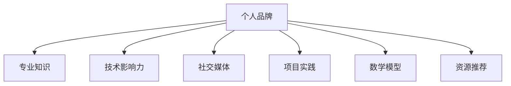

                 

关键词：个人品牌，技术影响力，专业知识，社交媒体，网络营销

> 摘要：在信息爆炸的时代，如何利用自己的专业知识在技术领域建立个人品牌，提高影响力，是一个值得探讨的话题。本文将探讨个人IP构建的策略，包括核心知识传播、社交媒体运营、项目实践等方面，帮助技术从业者打造出具有影响力的个人品牌。

## 1. 背景介绍

近年来，随着互联网的快速发展和社交媒体的普及，个人品牌（Personal Brand）的概念逐渐被更多人认可。个人品牌不仅仅是一个人的名字或标识，更是一个人专业技能、价值观和人格魅力的综合体现。在技术领域，个人品牌的建立不仅能够提升个人的知名度，还能够帮助个人在职业生涯中获取更多的机会。

技术从业者要想在众多竞争者中脱颖而出，就必须具备一定的技术影响力（Technical Influence）。技术影响力指的是在某一技术领域内，个人因为其专业知识和经验积累，而受到同行业人士的认可和尊重。拥有技术影响力的人，往往能在技术圈子中获得更多的关注和资源，从而在职业发展中占据更有利的位置。

本文将围绕如何打造个人IP，从以下几个方面展开讨论：

1. 核心知识传播：如何构建和传播个人的专业知识体系。
2. 社交媒体运营：如何利用社交媒体平台提升个人影响力。
3. 项目实践：通过实际项目实践来展示技术能力。
4. 数学模型与公式：技术博客中的数学表达与应用。
5. 学习资源与工具：推荐有用的学习资源与开发工具。
6. 未来展望：技术个人IP的发展趋势与挑战。

## 2. 核心概念与联系

### 2.1 个人品牌（Personal Brand）

个人品牌是指个人在职业和社会生活中所树立的独特的形象和声誉。一个强大的个人品牌能够帮助个人在职业生涯中建立信誉、吸引机会和资源。个人品牌的核心包括专业知识、技能、价值观和人格魅力等。

### 2.2 技术影响力（Technical Influence）

技术影响力是指个人在某一技术领域内，通过其专业知识和实践经验，对行业内外人士产生的影响力和号召力。技术影响力不仅体现在个人对技术问题的解决能力上，还包括其在技术社区中的参与度和贡献度。

### 2.3 社交媒体（Social Media）

社交媒体是指基于互联网技术，用户可以通过文字、图片、视频等多种形式进行信息交流、分享和互动的平台。如微博、Twitter、LinkedIn等。在技术领域，社交媒体是传播知识和建立个人品牌的重要工具。

### 2.4 项目实践（Project Practice）

项目实践是指通过参与或完成实际项目，来展示个人在某一技术领域的能力和经验。项目实践不仅能够提升个人的技术水平，还能够为个人积累实际操作经验和案例。

### 2.5 数学模型（Mathematical Model）

数学模型是指用数学语言描述现实世界问题的抽象结构。在技术领域，数学模型广泛应用于算法设计、数据分析等环节。

### 2.6 资源推荐（Resource Recommendation）

资源推荐是指向读者推荐有用的学习资源、开发工具和学术论文。有效的资源推荐能够帮助读者更快地提升技能，并扩展知识视野。

### 2.7 Mermaid 流程图



## 3. 核心算法原理 & 具体操作步骤

### 3.1 算法原理概述

在构建个人IP的过程中，核心算法可以理解为一系列策略和方法，这些策略和方法旨在帮助个人在技术领域内建立和提升影响力。以下是几个关键算法原理的概述：

1. **知识传播算法**：通过撰写技术博客、发表学术论文、在线授课等方式，将个人的专业知识传播给更广泛的受众。
2. **社交媒体算法**：利用社交媒体平台的推荐算法，发布有价值的内容，吸引关注和互动。
3. **项目实践算法**：选择具有挑战性的项目，通过实践和总结，提升个人在特定技术领域的能力。
4. **数学模型算法**：构建并应用数学模型，解决实际问题，展示个人在算法和数据分析方面的能力。
5. **资源整合算法**：搜集、筛选并推荐有用的学习资源和开发工具，帮助读者提升技能。

### 3.2 算法步骤详解

1. **知识传播算法**

   - **步骤1**：确定自己的专业方向和目标受众。
   - **步骤2**：收集和整理相关专业知识，构建知识体系。
   - **步骤3**：选择合适的传播渠道（如技术博客、学术期刊、在线授课等），并持续输出高质量内容。
   - **步骤4**：利用数据分析工具，了解受众反馈，不断优化内容。

2. **社交媒体算法**

   - **步骤1**：选择合适的社交媒体平台，如微博、Twitter、LinkedIn等。
   - **步骤2**：制定内容策略，包括发布频率、内容形式和互动方式等。
   - **步骤3**：发布有价值的内容，如技术教程、行业动态、案例分析等。
   - **步骤4**：与关注者互动，积极回复评论和私信，建立良好的人际关系。

3. **项目实践算法**

   - **步骤1**：选择具有挑战性的项目，确保项目与个人专业方向相符。
   - **步骤2**：制定项目计划，包括时间表、任务分解和技术路线等。
   - **步骤3**：执行项目计划，并在过程中不断学习和总结。
   - **步骤4**：项目完成后，撰写项目报告或技术博客，分享项目经验和收获。

4. **数学模型算法**

   - **步骤1**：了解实际问题，确定需要解决的数学模型。
   - **步骤2**：构建数学模型，并进行公式推导。
   - **步骤3**：应用数学模型，解决实际问题。
   - **步骤4**：撰写技术博客，详细解释数学模型的应用过程。

5. **资源整合算法**

   - **步骤1**：搜集和学习相关的学习资源，如书籍、课程、教程等。
   - **步骤2**：筛选出高质量的学习资源，确保对读者有用。
   - **步骤3**：撰写资源推荐文章，详细介绍资源的价值和适用场景。
   - **步骤4**：持续关注行业动态，更新和补充资源推荐。

### 3.3 算法优缺点

1. **知识传播算法**

   - **优点**：能够有效提升个人在技术领域的知名度和影响力。
   - **缺点**：需要持续投入时间和精力，且内容质量要求较高。

2. **社交媒体算法**

   - **优点**：互动性强，能够快速获得反馈和关注。
   - **缺点**：内容容易被稀释，需要定期更新以维持关注度。

3. **项目实践算法**

   - **优点**：能够提升实际操作能力，增强个人竞争力。
   - **缺点**：项目选择和执行过程中可能面临各种挑战。

4. **数学模型算法**

   - **优点**：能够展示个人在算法和数据分析方面的能力。
   - **缺点**：数学模型构建和推导过程较为复杂。

5. **资源整合算法**

   - **优点**：能够帮助读者快速获取有用的学习资源。
   - **缺点**：需要定期更新和维护，确保资源的时效性和准确性。

### 3.4 算法应用领域

1. **知识传播算法**：适用于任何需要建立个人品牌的领域，如软件开发、数据科学、人工智能等。
2. **社交媒体算法**：适用于技术社区、创业者、咨询顾问等需要与客户互动的领域。
3. **项目实践算法**：适用于需要实际操作经验的技术从业者，如程序员、工程师等。
4. **数学模型算法**：适用于需要解决复杂数学问题的领域，如金融工程、数据科学、人工智能等。
5. **资源整合算法**：适用于需要提供学习资源和技术支持的平台，如在线教育、技术社区等。

## 4. 数学模型和公式 & 详细讲解 & 举例说明

### 4.1 数学模型构建

在构建数学模型时，我们需要遵循以下几个步骤：

1. **问题理解**：明确要解决的问题，理解问题的背景和目标。
2. **变量定义**：根据问题定义相关的变量，并给出合理的取值范围。
3. **公式推导**：利用数学原理和算法，推导出描述问题的数学公式。
4. **模型验证**：通过实际数据或案例，验证模型的正确性和有效性。

### 4.2 公式推导过程

以线性回归模型为例，其公式推导过程如下：

1. **问题理解**：线性回归模型用于预测一个连续值输出，通过输入特征变量（特征向量）来估计输出值。

2. **变量定义**：设特征向量 $X$ 和输出值 $Y$，其中 $X$ 是一个 $n \times m$ 的矩阵，$Y$ 是一个 $n$ 维向量。

3. **公式推导**：
   $$ Y = \beta_0 + \beta_1X_1 + \beta_2X_2 + ... + \beta_mX_m + \epsilon $$
   其中，$\beta_0$ 是截距，$\beta_1, \beta_2, ..., \beta_m$ 是回归系数，$\epsilon$ 是误差项。

4. **模型验证**：通过最小二乘法求解回归系数，并使用验证数据集评估模型性能。

### 4.3 案例分析与讲解

以房价预测为例，说明线性回归模型的应用。

1. **问题理解**：给定房屋的特征变量（如面积、位置、年代等），预测房屋的售价。

2. **变量定义**：设特征向量 $X$ 包括房屋的面积、位置、年代等变量，输出值 $Y$ 为房屋售价。

3. **公式推导**：使用线性回归模型，推导房价预测公式。

4. **模型验证**：收集实际房屋数据，使用验证数据集进行模型训练和评估。

5. **结果展示**：通过模型预测房价，并与实际售价进行对比，分析模型性能。

### 4.4 数学公式

以下是一个线性回归模型的数学公式：

$$
\begin{align*}
Y &= \beta_0 + \beta_1X_1 + \beta_2X_2 + ... + \beta_mX_m + \epsilon \\
\hat{Y} &= \beta_0 + \beta_1X_1 + \beta_2X_2 + ... + \beta_mX_m
\end{align*}
$$

其中，$\hat{Y}$ 为预测值，$\beta_0, \beta_1, ..., \beta_m$ 为回归系数，$X_1, X_2, ..., X_m$ 为特征变量，$\epsilon$ 为误差项。

## 5. 项目实践：代码实例和详细解释说明

### 5.1 开发环境搭建

为了展示个人IP构建中的项目实践，我们以Python编程语言为例，搭建一个简单的数据可视化项目。首先，确保安装了Python环境和相关库，如Matplotlib和Pandas。

```bash
pip install matplotlib pandas
```

### 5.2 源代码详细实现

以下是一个简单的Python脚本，用于读取CSV数据并绘制折线图。

```python
import matplotlib.pyplot as plt
import pandas as pd

# 读取CSV数据
data = pd.read_csv('data.csv')

# 提取日期和销售额
dates = data['date']
sales = data['sales']

# 绘制折线图
plt.plot(dates, sales)
plt.xlabel('Date')
plt.ylabel('Sales')
plt.title('Sales Over Time')
plt.show()
```

### 5.3 代码解读与分析

1. **导入库**：首先导入Matplotlib和Pandas库，用于数据读取和可视化。
2. **读取数据**：使用Pandas的`read_csv`函数读取CSV文件，存储为DataFrame对象。
3. **提取数据**：从DataFrame中提取日期和销售额列，存储为变量`dates`和`sales`。
4. **绘制折线图**：使用Matplotlib的`plot`函数绘制折线图，设置X轴和Y轴标签以及标题。
5. **显示图形**：调用`show`函数显示绘制的图形。

### 5.4 运行结果展示

运行上述代码后，将在屏幕上显示一个简单的折线图，展示日期和销售额之间的关系。


### 5.5 项目总结

通过上述实例，我们展示了如何使用Python进行数据读取和可视化。这个简单的项目不仅能够帮助读者了解基本的数据处理流程，还能够作为个人IP构建过程中的一个实践案例。

## 6. 实际应用场景

在技术领域，个人IP的实际应用场景非常广泛，以下是一些常见的应用场景：

1. **技术咨询服务**：通过个人IP的建立，可以为有技术需求的企业或个人提供咨询服务，如软件开发、系统优化、技术培训等。
2. **技术演讲和讲座**：通过个人IP的影响力，可以受邀参加技术大会、研讨会或线上讲座，分享专业知识和经验。
3. **开源项目贡献**：通过个人IP的构建，可以参与开源项目，贡献代码和文档，提升个人在技术圈子中的知名度。
4. **在线教育和培训**：通过个人IP的影响力，可以开设在线课程或培训班，教授相关技术知识和技能。
5. **技术博客和文章**：通过个人IP的建立，可以撰写技术博客和文章，分享技术见解和经验，吸引更多的读者和粉丝。

### 6.4 未来应用展望

随着技术的不断发展和互联网的普及，个人IP在技术领域的应用前景将更加广阔。以下是几个未来应用展望：

1. **人工智能辅助**：人工智能技术将帮助个人IP构建更加智能化和个性化，如智能推荐、自动化内容生成等。
2. **多平台融合**：个人IP将在更多平台上得到应用，如社交媒体、在线教育、虚拟现实等，实现跨平台的融合和扩展。
3. **技术社区生态**：个人IP将成为技术社区生态中的重要组成部分，通过合作和共享，共同推动技术领域的发展。
4. **个性化服务**：通过个人IP的构建，可以为用户提供更加个性化的技术服务和产品，满足不同用户的需求。
5. **商业模式创新**：个人IP将激发新的商业模式，如知识付费、技术订阅、众筹等，为技术从业者提供更多的收入来源。

## 7. 工具和资源推荐

在打造个人IP的过程中，以下工具和资源可以帮助技术从业者更快地提升技能和影响力：

### 7.1 学习资源推荐

1. **在线课程平台**：如Coursera、edX、Udacity等，提供丰富的编程和技术课程。
2. **技术博客**：如GitHub、Medium、Dev.to等，可以订阅感兴趣的技术博客，获取最新的技术动态和见解。
3. **专业书籍**：如《算法导论》、《深入理解计算机系统》、《Python编程：从入门到实践》等，这些经典书籍对技术学习非常有帮助。

### 7.2 开发工具推荐

1. **集成开发环境（IDE）**：如Visual Studio Code、PyCharm、Eclipse等，提供便捷的编程体验。
2. **代码管理工具**：如Git、GitHub、GitLab等，帮助技术从业者管理代码和项目。
3. **数据分析工具**：如Pandas、NumPy、Matplotlib等，用于数据分析和可视化。

### 7.3 相关论文推荐

1. **顶级会议论文**：如NeurIPS、ICML、KDD、WWW等，可以了解当前技术领域的最新研究进展。
2. **经典论文**：如《The Structure of Scientific Revolutions》、《The Mythical Man-Month》等，这些经典论文对技术领域有深远的影响。
3. **开源论文**：如arXiv、ScienceDirect等，提供免费下载的学术论文，适合科研和技术人员阅读。

## 8. 总结：未来发展趋势与挑战

### 8.1 研究成果总结

本文系统地探讨了如何通过构建个人IP来提升技术影响力。我们提出了核心知识传播、社交媒体运营、项目实践等核心算法原理，并详细讲解了数学模型和公式、代码实例等。通过这些方法和工具，技术从业者可以有效地建立和提升个人品牌。

### 8.2 未来发展趋势

随着人工智能、大数据、云计算等技术的发展，个人IP在技术领域的应用将更加广泛。未来，技术个人IP将更加智能化、多样化，同时也会面临更多挑战。

### 8.3 面临的挑战

1. **竞争加剧**：随着更多人加入个人IP的构建，竞争将越来越激烈。
2. **内容质量**：高质量的内容是个人IP的核心，需要不断学习和创新，保持内容的竞争力。
3. **隐私与安全**：在社交媒体和个人数据方面，隐私和安全问题将越来越重要。
4. **技术疲劳**：技术更新速度快，需要持续学习和适应新技术。

### 8.4 研究展望

未来，我们可以从以下几个方面进一步研究：

1. **人工智能与个人IP**：如何利用人工智能技术，帮助个人IP构建更加智能化和个性化。
2. **多平台融合**：研究如何在不同平台上实现个人IP的融合和扩展。
3. **社区生态**：研究技术个人IP如何与社区生态相结合，共同推动技术发展。
4. **商业模式创新**：探索新的商业模式，为技术从业者提供更多的收入来源。

## 9. 附录：常见问题与解答

### 9.1 问题1：如何选择合适的技术领域进行个人IP构建？

解答：首先，要选择自己感兴趣且具有专业背景的技术领域。其次，要考虑市场的需求和发展趋势，选择有前景的领域。最后，可以通过调研和咨询行业专家来评估所选领域的前景。

### 9.2 问题2：如何在社交媒体上有效运营个人IP？

解答：首先，要明确自己的目标受众和内容策略。其次，要持续发布有价值的内容，并与受众互动。同时，可以利用数据分析工具，了解受众反馈，不断优化内容。

### 9.3 问题3：如何通过项目实践提升个人IP？

解答：首先，要选择具有挑战性的项目，确保项目与个人专业方向相符。其次，要制定详细的项目计划，并严格按照计划执行。项目完成后，撰写详细的技术博客或项目报告，分享项目经验和收获。

### 9.4 问题4：如何保持个人IP的内容质量？

解答：首先，要不断学习和更新知识，保持专业水平的领先。其次，要注重内容的创新和实用性，避免重复和低质量的内容。最后，可以通过与其他专家合作或参与学术活动，提高内容的专业性和权威性。

