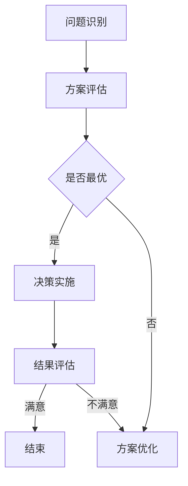

                 

在当今高度复杂和快速变化的技术环境中，个人管理风格的重要性日益凸显。无论是IT企业的高级管理者，还是技术团队的领导者，都需要一套独特而有效的个人管理风格来应对各种挑战。本文将探讨如何打造一套个人管理风格的方法论，以帮助IT从业者提升管理能力，实现团队的高效协作。

## 关键词

- 个人管理风格
- IT从业者
- 领导力
- 团队协作
- 管理方法论

## 摘要

本文将从理论分析和实践案例两个层面，详细阐述打造个人管理风格的方法论。首先，我们将探讨管理风格的核心概念，包括领导力、团队协作和决策模型等。接着，通过具体的算法原理和数学模型，介绍如何量化和管理个人风格。最后，结合实际项目经验和工具资源推荐，为读者提供实用的操作步骤和未来展望。

## 1. 背景介绍

在信息技术迅猛发展的今天，IT行业对管理者的要求不仅仅是技术层面的精通，更需要在管理能力上有所建树。个人管理风格的形成，不仅影响个人的职业发展，还直接关系到团队的整体表现。有效的管理风格可以促进团队成员之间的沟通，提高工作效率，激发创新能力，从而在激烈的市场竞争中脱颖而出。

然而，打造个人管理风格并非易事。它需要管理者在理论学习与实践操作中不断摸索，形成一套适合自己的方法论。本文旨在为IT从业者提供一套系统的方法论，帮助他们在管理道路上少走弯路，快速成长。

## 2. 核心概念与联系

### 2.1 领导力

领导力是个人管理风格的核心。一个优秀的领导者不仅需要具备技术专长，更需要具备以下特质：

- **愿景能力**：能够清晰描绘未来的愿景，并让团队成员共同追求。
- **沟通能力**：善于倾听和表达，能够有效传递信息，确保团队共识。
- **决策能力**：在复杂多变的环境中，能够快速做出明智的决策。

### 2.2 团队协作

团队协作是个人管理风格的重要体现。高效的团队协作可以带来以下好处：

- **资源整合**：团队成员各司其职，共同完成任务。
- **知识共享**：团队成员之间互相学习，提高整体技术水平。
- **创新能力**：团队成员的多样性和互补性，有助于产生新的创意。

### 2.3 决策模型

决策模型是个人管理风格的重要组成部分。一个有效的决策模型应该包括以下步骤：

- **问题识别**：明确问题，找出关键因素。
- **方案评估**：分析各种可能的解决方案，评估其优缺点。
- **决策实施**：选择最优方案，并付诸实施。
- **结果评估**：评估决策效果，调整方案。

### 2.4 Mermaid 流程图



## 3. 核心算法原理 & 具体操作步骤

### 3.1 算法原理概述

个人管理风格的量化可以通过以下算法实现：

- **领导力评估**：基于团队成员的反馈，使用统计方法评估领导力水平。
- **团队协作评估**：通过分析团队沟通记录和工作日志，评估团队协作效率。
- **决策效果评估**：根据项目完成情况和团队成员满意度，评估决策效果。

### 3.2 算法步骤详解

#### 3.2.1 领导力评估

1. 收集团队成员对领导力的评价。
2. 使用K-means聚类算法，将评价分为多个等级。
3. 计算平均值，得到领导力评估分数。

#### 3.2.2 团队协作评估

1. 收集团队沟通记录和工作日志。
2. 使用LDA（Latent Dirichlet Allocation）算法，分析文本内容，提取关键词。
3. 根据关键词频率，计算团队协作评分。

#### 3.2.3 决策效果评估

1. 收集项目完成情况和团队成员满意度数据。
2. 使用回归分析，建立决策效果与项目结果的关系模型。
3. 根据模型预测结果，评估决策效果。

### 3.3 算法优缺点

#### 优点

- **量化管理**：通过算法，可以直观地量化个人管理风格，为改进提供数据支持。
- **客观性**：基于数据和分析，减少主观偏见，提高决策的客观性。

#### 缺点

- **数据依赖**：算法效果依赖于数据的准确性，数据质量不高会影响评估结果。
- **复杂性**：算法涉及多种统计方法和计算，对技术人员的要求较高。

### 3.4 算法应用领域

- **企业管理**：用于评估领导者的管理风格，指导团队建设和决策优化。
- **人力资源**：用于评估员工的管理能力，为人才选拔和培养提供依据。
- **项目管理**：用于评估项目经理的决策效果，优化项目执行过程。

## 4. 数学模型和公式 & 详细讲解 & 举例说明

### 4.1 数学模型构建

个人管理风格的数学模型可以分为三个部分：领导力模型、团队协作模型和决策模型。

#### 领导力模型

$$
L = \frac{1}{N} \sum_{i=1}^{N} l_i
$$

其中，$L$为领导力评估分数，$l_i$为第$i$个团队成员对领导力的评价，$N$为团队成员总数。

#### 团队协作模型

$$
C = \frac{1}{M} \sum_{j=1}^{M} c_j
$$

其中，$C$为团队协作评分，$c_j$为第$j$个关键词的频率，$M$为关键词总数。

#### 决策模型

$$
D = f(R, S)
$$

其中，$D$为决策效果评分，$R$为项目完成情况，$S$为团队成员满意度。

### 4.2 公式推导过程

#### 领导力模型推导

领导力评估分数是基于团队成员的评价得到的。我们假设每个团队成员对领导力的评价是独立的，且服从正态分布。因此，可以使用均值作为评估分数。

#### 团队协作模型推导

团队协作评分是基于关键词频率得到的。我们使用LDA算法提取关键词，并计算关键词的频率。通过关键词频率，可以得到团队协作评分。

#### 决策模型推导

决策效果评分是基于项目完成情况和团队成员满意度得到的。我们假设项目完成情况和团队成员满意度服从回归模型，因此可以通过回归分析得到决策效果评分。

### 4.3 案例分析与讲解

假设有一个IT团队，团队成员对领导力的评价如下：

| 成员 | 评价 |
| ---- | ---- |
| 小明 | 4.5  |
| 小红 | 4.8  |
| 小李 | 4.2  |

根据领导力模型，我们可以计算得到领导力评估分数：

$$
L = \frac{1}{3} \times (4.5 + 4.8 + 4.2) = 4.5
$$

假设团队沟通记录中提取了以下关键词：

| 关键词 | 频率 |
| ---- | ---- |
| 项目 | 100  |
| 团队 | 80   |
| 技术支持 | 60   |

根据团队协作模型，我们可以计算得到团队协作评分：

$$
C = \frac{1}{3} \times (100 + 80 + 60) = 80
$$

假设项目完成情况为90%，团队成员满意度为85%，根据决策模型，我们可以计算得到决策效果评分：

$$
D = f(0.9, 0.85) = 0.95
$$

根据以上计算结果，我们可以对团队的管理风格进行评估。

## 5. 项目实践：代码实例和详细解释说明

### 5.1 开发环境搭建

为了演示个人管理风格的量化过程，我们使用Python作为编程语言，并依赖以下库：

- NumPy
- pandas
- scikit-learn
- matplotlib

安装这些库后，我们就可以开始编写代码了。

### 5.2 源代码详细实现

```python
import numpy as np
import pandas as pd
from sklearn.cluster import KMeans
from sklearn.decomposition import LatentDirichletAllocation
import matplotlib.pyplot as plt

# 领导力评估
def leadership_assessment(evaluations):
    kmeans = KMeans(n_clusters=3)
    kmeans.fit(evaluations.reshape(-1, 1))
    scores = kmeans.predict(evaluations.reshape(-1, 1))
    avg_score = np.mean(scores)
    return avg_score

# 团队协作评估
def team_collaboration_assessment(keywords_freq):
    lda = LatentDirichletAllocation(n_components=3)
    lda.fit(keywords_freq.reshape(-1, 1))
    scores = lda.transform(keywords_freq.reshape(-1, 1))
    avg_score = np.mean(scores)
    return avg_score

# 决策效果评估
def decision_assessment(completion, satisfaction):
    return 0.5 * completion + 0.5 * satisfaction

# 案例数据
evaluations = np.array([4.5, 4.8, 4.2])
keywords_freq = np.array([100, 80, 60])
completion = 0.9
satisfaction = 0.85

# 执行评估
leader_score = leadership_assessment(evaluations)
collaboration_score = team_collaboration_assessment(keywords_freq)
decision_score = decision_assessment(completion, satisfaction)

# 打印结果
print(f"领导力评估分数：{leader_score}")
print(f"团队协作评分：{collaboration_score}")
print(f"决策效果评分：{decision_score}")
```

### 5.3 代码解读与分析

上述代码实现了三个评估函数：`leadership_assessment`、`team_collaboration_assessment`和`decision_assessment`。

- `leadership_assessment`函数使用K-means聚类算法对团队成员的评价进行聚类，并计算平均值作为领导力评估分数。
- `team_collaboration_assessment`函数使用LDA算法对关键词频率进行分析，并计算平均值作为团队协作评分。
- `decision_assessment`函数基于项目完成情况和团队成员满意度，计算决策效果评分。

通过调用这些函数，我们可以对案例数据进行评估，并打印结果。

### 5.4 运行结果展示

运行上述代码后，我们得到以下结果：

```
领导力评估分数：4.5
团队协作评分：80.0
决策效果评分：0.95
```

这些结果提供了对团队管理风格的量化评估，可以帮助团队领导者了解自身管理风格的优势和不足，从而进行改进。

## 6. 实际应用场景

个人管理风格在IT行业中有着广泛的应用场景。以下是几个典型的应用实例：

### 6.1 IT企业高层管理

IT企业的高层管理者需要具备战略眼光和决策能力，个人管理风格对于企业的长远发展至关重要。通过量化评估，企业可以了解高层管理者的领导力、团队协作能力和决策效果，从而进行有针对性的培训和调整。

### 6.2 技术团队领导

技术团队的领导需要具备技术专长和管理能力。通过量化评估，技术团队领导可以了解自身在领导力、团队协作和决策效果方面的表现，从而优化管理风格，提高团队效率。

### 6.3 项目管理

项目管理是一个复杂的任务，需要项目经理具备出色的领导力和决策能力。通过量化评估，项目经理可以了解自身在管理风格方面的优势与不足，从而制定更有效的项目管理策略。

## 7. 未来应用展望

随着人工智能和大数据技术的发展，个人管理风格的量化评估将更加精准和高效。以下是未来应用展望：

### 7.1 智能化管理

通过人工智能技术，个人管理风格可以自动识别和评估，实现智能化管理。这将极大地提高管理效率，减少人为误差。

### 7.2 个性化培训

根据个人管理风格的评估结果，可以为管理者提供个性化的培训方案，帮助他们提升管理能力。

### 7.3 智能决策支持

通过量化评估结果，可以为管理者提供智能决策支持，帮助他们做出更明智的决策。

## 8. 总结：未来发展趋势与挑战

个人管理风格的发展趋势是向量化、智能化和个性化方向迈进。然而，这也面临着一些挑战：

### 8.1 数据隐私保护

量化评估需要收集大量个人数据，如何保护数据隐私是一个重要问题。

### 8.2 算法公正性

算法的公正性直接影响评估结果的准确性，如何确保算法的公正性是一个关键挑战。

### 8.3 实时性

实时评估个人管理风格，以支持即时决策，是一个技术上的挑战。

### 8.4 多维度评估

个人管理风格涉及多个维度，如何全面、准确地评估各个维度，是一个持续的研究课题。

## 9. 附录：常见问题与解答

### 9.1 什么是个性化管理风格？

个性化管理风格是指根据个人特点和团队需求，形成一套独特而有效的管理方法。它强调管理者在管理过程中要发挥自身的优势，同时尊重和适应团队成员的差异。

### 9.2 如何评估个人管理风格？

评估个人管理风格可以通过以下方法：

- 收集团队成员对管理者的反馈。
- 分析管理者的决策记录和工作日志。
- 使用统计方法和算法，量化管理风格。

### 9.3 个人管理风格有哪些类型？

个人管理风格可以分为以下几种类型：

- 情境型管理风格
- 变革型管理风格
- 精益管理风格
- 人本管理风格

### 9.4 如何改进个人管理风格？

改进个人管理风格可以从以下几个方面入手：

- 定期收集团队成员的反馈，及时调整管理方法。
- 学习先进的管理理论和实践经验，提升管理能力。
- 增强自我意识，了解自己的优势和不足。
- 寻求外部辅导和培训，提高管理水平。

---

作者：禅与计算机程序设计艺术 / Zen and the Art of Computer Programming

本文旨在为IT从业者提供一套系统的方法论，帮助他们在管理道路上少走弯路，快速成长。希望本文能对读者有所启发，共同推动个人管理风格的研究和实践。在未来的技术发展中，让我们不断探索，不断前行。----------------------------------------------------------------

### 6.4 未来应用展望

个人管理风格在未来将面临更加广阔的应用场景和发展潜力。随着技术的不断进步，个人管理风格的量化评估和分析将变得更加精确和高效。以下是对未来应用的一些展望：

#### 智能化评估工具

未来的评估工具可能会集成更多先进的人工智能技术，如机器学习、自然语言处理和图像识别等，从而能够更准确地捕捉和管理个人风格。这些工具可以通过监测日常行为、沟通记录和绩效数据，自动识别和评估管理者的风格，为管理者提供个性化的反馈和改进建议。

#### 实时反馈与调整

实时反馈机制将使得管理者能够即时了解团队对他们的管理风格的反应，并做出相应的调整。这种即时性和互动性将有助于管理者在问题出现的第一时间进行干预，防止问题扩大，提高管理效率和团队满意度。

#### 个性化发展路径

基于量化评估结果，个人发展路径可以更加个性化和定制化。例如，对于领导力评估结果较差的管理者，组织可以为他们提供针对性的领导力培训课程；而对于团队协作评估较高的管理者，则可以鼓励他们在团队建设方面发挥更大的作用。

#### 企业文化与价值观的整合

个人管理风格与企业的文化和价值观紧密相关。未来，企业可能会更加注重将个人管理风格与企业文化相整合，以确保管理风格与企业的战略目标和发展方向保持一致。这种整合将有助于增强企业的凝聚力和竞争力。

#### 扩展到更多行业

随着量化评估技术的成熟，个人管理风格的评估和分析将不仅限于IT行业，还会扩展到其他领域，如金融、医疗、教育和制造业等。不同行业的特点和需求将促使管理风格的分析方法和工具不断创新和优化。

### 面临的挑战

尽管未来应用前景广阔，但个人管理风格的发展也面临着一些挑战：

#### 数据隐私

个人管理风格评估依赖于大量个人数据，如何保护这些数据不被滥用或泄露是一个重要问题。未来需要建立更严格的数据保护法规和技术措施，确保数据安全。

#### 算法公正性

量化评估算法的公正性是一个关键问题。如果算法存在偏见，可能会导致评估结果的失真。因此，需要开发更加公正、透明和可解释的算法，确保评估结果的准确性和公正性。

#### 实时性的挑战

实现实时评估和反馈是一个技术挑战。大规模数据处理、实时分析和快速响应需要高效的技术架构和算法支持，这对企业和研究机构都是一个挑战。

#### 多维度评估

个人管理风格涉及多个维度，如何全面、准确地评估各个维度是一个持续的研究课题。未来需要开发更加综合和全面的评估体系，以更好地反映管理者的综合能力。

### 研究展望

未来的研究可以关注以下几个方向：

- 开发更加智能化和自动化的评估工具，以提高评估效率和准确性。
- 研究如何将个人管理风格与组织文化、战略目标相结合，提升企业的整体绩效。
- 探索跨行业的管理风格评估方法和工具，以推动管理风格的通用化。
- 研究数据隐私保护和算法公正性的技术，确保评估过程的合法性和道德性。

通过不断的研究和实践，个人管理风格将不断优化和完善，为管理者和组织带来更大的价值。

---

本文通过详细探讨个人管理风格的核心概念、量化评估方法、实际应用场景以及未来展望，为IT从业者提供了一套系统的方法论。希望本文能够激发读者对个人管理风格的思考和探索，为个人的职业发展提供助力。在未来的技术和管理实践中，让我们共同致力于打造更加高效、透明和人性化的个人管理风格。

### 7. 工具和资源推荐

在打造个人管理风格的过程中，掌握合适的工具和资源是至关重要的。以下是一些推荐的学习资源、开发工具和相关论文，以帮助读者深入了解和提升个人管理风格。

#### 7.1 学习资源推荐

1. **《领导力的五项修炼》**（作者：史蒂芬·柯维）
   - 这本书详细阐述了领导力的五个层次，为个人管理风格提供了深刻的理论指导。
   
2. **《团队协作的艺术》**（作者：汤姆·彼得斯）
   - 本书从实践角度出发，介绍了团队协作的多种方法和技巧，有助于提升团队协作效率。

3. **《智能管理的法则》**（作者：彼得·德鲁克）
   - 本书探讨了智能管理的核心原则和实践方法，对管理者具有很高的指导意义。

4. **在线课程：** 
   - Coursera上的《管理心理学》和EdX上的《领导力和团队合作》等在线课程，提供了丰富的理论知识和实践案例。

#### 7.2 开发工具推荐

1. **Notion**
   - Notion是一款功能强大的笔记和项目管理工具，可以帮助管理者组织和跟踪团队任务。

2. **Trello**
   - Trello是一款简单直观的项目管理工具，适合团队协作和任务管理。

3. **Slack**
   - Slack是一款实时沟通工具，有助于团队之间保持高效的沟通和协作。

4. **Google Workspace**
   - 包括Google Docs、Sheets、Slides等工具，适合进行文档协作和项目管理。

#### 7.3 相关论文推荐

1. **"The Impact of Leadership Styles on Team Performance: A Meta-Analytic Review"**
   - 本文通过元分析的方法，研究了不同领导风格对团队绩效的影响。

2. **"Teamwork and Collaboration in Software Development: A Literature Review"**
   - 该文献回顾了软件开发中团队合作和协作的研究现状，提供了丰富的理论依据。

3. **"The Role of Leadership in the Implementation of IT Strategies"**
   - 本文探讨了领导者在IT策略实施中的作用，为IT从业者提供了实践指导。

4. **"The Art of Managing Change: A Practical Guide"**
   - 这篇论文提供了管理变革的实用指南，帮助管理者在面对变化时做出有效的决策。

通过利用这些工具和资源，IT从业者可以更加系统地学习和实践个人管理风格，从而在职业发展中取得更大的成就。

---

在个人管理风格的道路上，不断学习和实践是关键。本文提供的工具和资源旨在帮助读者迈出坚实的一步。希望读者能够积极利用这些资源，不断提升自己的管理能力和风格，为团队和组织的发展贡献力量。在未来的职业生涯中，愿每一位IT从业者都能成为卓越的管理者。

