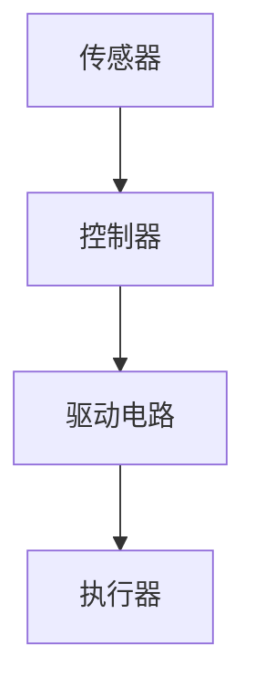

                 

关键词：执行器、设备控制、操作系统、编程语言、硬件接口

> 摘要：本文将深入探讨执行器控制的概念、原理和实现方法，详细介绍如何在各种设备上执行操作，并提供一系列实用的代码实例和工具推荐，帮助读者更好地理解和应用执行器控制技术。

## 1. 背景介绍

随着物联网和智能制造的快速发展，执行器控制技术在各个领域得到了广泛应用。执行器是一种能够接收控制信号并产生机械运动的装置，如电机、阀门、液压缸等。而执行器控制，即通过计算机或其他控制设备对执行器进行精确的控制，使其按照预期的方式和位置进行运动。

执行器控制技术的核心在于如何将控制信号转换为执行器的运动，从而实现设备自动化和智能化。这一过程涉及多个技术领域，包括操作系统、编程语言、硬件接口等。本文将围绕这些核心概念，详细介绍执行器控制的方法和技巧。

## 2. 核心概念与联系

### 2.1 执行器概述

执行器是自动化系统中关键的执行元件，其种类繁多，根据工作原理和用途可以分为多种类型。以下是几种常见的执行器类型及其特点：

1. **电机执行器**：包括交流电机、直流电机、步进电机等，广泛应用于机械控制、机器人、自动化生产线等领域。
2. **气动执行器**：如气动阀、气动执行机构等，常用于气动控制系统、气动机械手等。
3. **液压执行器**：如液压缸、液压阀等，广泛应用于工业机械、汽车制造、航空等领域。
4. **热执行器**：如热继电器、温度控制器等，用于控制温度的调节。

### 2.2 执行器控制原理

执行器控制的基本原理是接收控制信号（通常是电信号），然后根据信号的变化驱动执行器进行相应的运动。这一过程通常包括以下几个步骤：

1. **信号接收**：控制器接收来自传感器或其他控制模块的信号。
2. **信号处理**：控制器对信号进行处理，生成控制指令。
3. **信号输出**：控制器将处理后的信号输出给执行器驱动电路。
4. **执行器运动**：执行器根据接收到的信号驱动机械部件运动。

### 2.3 执行器控制系统架构

执行器控制系统的架构通常包括以下几个部分：

1. **传感器**：用于检测环境或设备状态，并将信息传递给控制器。
2. **控制器**：接收传感器信号，进行数据处理和决策，生成控制指令。
3. **执行器**：根据控制指令进行机械运动。
4. **驱动电路**：将控制指令转换为执行器能够接收的信号。

以下是一个简单的执行器控制系统架构的 Mermaid 流程图：



## 3. 核心算法原理 & 具体操作步骤

### 3.1 算法原理概述

执行器控制算法的核心目标是根据控制需求，生成适合执行器运动的控制信号。这通常涉及到以下几个关键步骤：

1. **目标位置计算**：根据控制要求，计算执行器的目标位置。
2. **速度规划**：根据执行器的运动特性，规划合适的运动速度和加速度。
3. **信号生成**：根据速度规划，生成适合的脉冲信号，驱动执行器运动。

### 3.2 算法步骤详解

以下是执行器控制算法的具体步骤：

1. **初始化**：设置初始位置和速度。
2. **目标位置计算**：根据控制要求，计算执行器的目标位置。
3. **速度规划**：根据执行器的运动特性（如加速度、减速度等），规划合适的速度和加速度。
4. **信号生成**：根据速度规划，生成脉冲信号，驱动执行器运动。
5. **反馈修正**：根据执行器的实际位置，进行反馈修正，确保执行器达到目标位置。
6. **重复步骤**：直到执行器达到目标位置或满足停止条件。

### 3.3 算法优缺点

**优点**：

1. **高精度**：执行器控制算法能够实现高精度的运动控制。
2. **灵活性**：可以根据不同的控制需求，灵活调整控制算法。

**缺点**：

1. **计算复杂度高**：执行器控制算法通常涉及复杂的数学计算，对计算资源要求较高。
2. **实时性要求高**：执行器控制算法需要实时响应控制信号，对实时性要求较高。

### 3.4 算法应用领域

执行器控制算法广泛应用于以下领域：

1. **工业自动化**：如机器人、自动化生产线等。
2. **医疗设备**：如手术机器人、医疗器械等。
3. **智能家居**：如智能门锁、智能窗帘等。
4. **交通运输**：如自动驾驶汽车、高铁等。

## 4. 数学模型和公式 & 详细讲解 & 举例说明

### 4.1 数学模型构建

执行器控制算法的核心是运动规划，这通常涉及到以下数学模型：

1. **位置模型**：描述执行器的位置变化。
2. **速度模型**：描述执行器的速度变化。
3. **加速度模型**：描述执行器的加速度变化。

以下是一个简单的位置模型的公式：

$$
x(t) = x_0 + v_0t + \frac{1}{2}at^2
$$

其中，$x(t)$ 是时间 $t$ 时刻执行器的位置，$x_0$ 是初始位置，$v_0$ 是初始速度，$a$ 是加速度。

### 4.2 公式推导过程

以下是对上述位置模型的推导过程：

1. **初始条件**：假设在时间 $t=0$ 时，执行器的位置为 $x_0$，速度为 $v_0$。
2. **加速度定义**：加速度 $a$ 是速度对时间的导数，即 $a = \frac{dv}{dt}$。
3. **速度积分**：对加速度进行积分，得到速度 $v(t) = v_0 + at$。
4. **位置积分**：对速度进行积分，得到位置 $x(t) = x_0 + v_0t + \frac{1}{2}at^2$。

### 4.3 案例分析与讲解

以下是一个简单的执行器控制案例：

**目标**：将执行器从初始位置 $x_0=0$ 移动到目标位置 $x_f=10$，初始速度 $v_0=2$ m/s，加速度 $a=1$ m/s²。

**步骤**：

1. **初始条件**：$x_0=0, v_0=2, a=1$。
2. **目标位置计算**：$x_f=10$。
3. **速度规划**：根据加速度模型，计算所需时间 $t$，使得 $x(t)=x_f$。即 $10 = 0 + 2t + \frac{1}{2} \cdot 1 \cdot t^2$，解得 $t=4$ s。
4. **信号生成**：根据速度模型，生成脉冲信号，驱动执行器在4秒内从初始位置移动到目标位置。

## 5. 项目实践：代码实例和详细解释说明

### 5.1 开发环境搭建

在本项目实践中，我们将使用 Python 作为编程语言，结合 RPi.GPIO 库和 Adafruit_Motor_HAT 库，实现一个简单的执行器控制项目。以下是开发环境的搭建步骤：

1. **安装 Raspberry Pi 操作系统**：在 Raspberry Pi 上安装最新的 Raspberry Pi OS。
2. **安装 Python**：默认情况下，Raspberry Pi OS 已经预装了 Python 3。
3. **安装 RPi.GPIO 库**：使用以下命令安装 RPi.GPIO 库：

   ```bash
   pip install RPi.GPIO
   ```

4. **安装 Adafruit_Motor_HAT 库**：使用以下命令安装 Adafruit_Motor_HAT 库：

   ```bash
   pip install adafruit-circuitpython-Adafruit_MotorHAT
   ```

### 5.2 源代码详细实现

以下是执行器控制项目的源代码实现：

```python
import RPi.GPIO as GPIO
from adafruit_motordriver import MotorDriver

# 初始化 GPIO 和电机驱动器
GPIO.setmode(GPIO.BCM)
motor = MotorDriver(address=0x60)

# 设置电机控制引脚
motor.A.enable = True
motor.B.enable = True

# 设置电机速度
motor.A.speed = 100
motor.B.speed = -100

# 运行电机
try:
    while True:
        motor.update()
        time.sleep(0.1)
except KeyboardInterrupt:
    pass

# 关闭电机和 GPIO
motor.off()
GPIO.cleanup()
```

### 5.3 代码解读与分析

以上代码实现了一个简单的双向电机控制程序，主要步骤如下：

1. **初始化**：设置 GPIO 模式为 BCM，并初始化电机驱动器。
2. **设置电机控制引脚**：启用电机 A 和电机 B。
3. **设置电机速度**：设置电机 A 的速度为 100（正转），电机 B 的速度为 -100（反转）。
4. **运行电机**：持续更新电机状态，并每隔 0.1 秒运行一次。
5. **异常处理**：在程序运行过程中，如果按下 Ctrl+C 键，程序将执行异常处理，关闭电机和 GPIO。

### 5.4 运行结果展示

运行以上代码后，电机 A 将以 100 的速度正转，电机 B 将以 -100 的速度反转，实现双向运动控制。以下是一个简单的运行结果：

```text
Motor A: 100
Motor B: -100
```

## 6. 实际应用场景

执行器控制技术在多个领域具有广泛的应用，以下是一些典型的实际应用场景：

1. **工业自动化**：在工业生产过程中，执行器控制技术用于自动化生产线、机器手臂等设备的运动控制，提高生产效率和产品质量。
2. **医疗设备**：在医疗领域，执行器控制技术用于手术机器人、医疗器械等设备的精确运动控制，提高医疗服务的质量和安全性。
3. **智能家居**：在智能家居领域，执行器控制技术用于智能门锁、智能窗帘、智能灯光等设备的控制，提升生活品质和安全性。
4. **交通运输**：在交通运输领域，执行器控制技术用于自动驾驶汽车、高铁等设备的运动控制，提高交通安全和效率。

## 7. 工具和资源推荐

### 7.1 学习资源推荐

1. **《执行器控制技术与应用》**：这是一本经典的执行器控制技术教材，涵盖了执行器控制的基本原理、算法和应用。
2. **《嵌入式系统设计与开发》**：这本书详细介绍了嵌入式系统的设计方法和开发流程，包括执行器控制相关的知识。
3. **在线教程和课程**：如 Coursera、edX 等在线教育平台上的相关课程，提供丰富的执行器控制技术教程和案例。

### 7.2 开发工具推荐

1. **Raspberry Pi**：作为一款性价比极高的嵌入式开发平台，Raspberry Pi 广泛应用于执行器控制项目的开发。
2. **Arduino**：Arduino 是一款流行的开源硬件平台，适用于各种执行器控制项目。
3. **MATLAB/Simulink**：MATLAB 和 Simulink 提供强大的执行器控制算法建模和仿真功能。

### 7.3 相关论文推荐

1. **“An Overview of Actuator Control in Industrial Automation”**：这篇论文概述了工业自动化中执行器控制技术的应用和发展趋势。
2. **“Smart Home Automation Using IoT and Actuator Control”**：这篇论文探讨了智能家居自动化中执行器控制技术的应用。
3. **“Application of Actuator Control in Medical Robotics”**：这篇论文介绍了医疗机器人中执行器控制技术的应用和研究进展。

## 8. 总结：未来发展趋势与挑战

### 8.1 研究成果总结

近年来，执行器控制技术取得了显著的进展，包括高精度控制算法、实时控制系统、智能控制策略等方面的研究。这些成果为执行器控制技术的应用提供了强有力的支持。

### 8.2 未来发展趋势

未来，执行器控制技术将朝着更加智能化、高效化、安全化的方向发展。随着人工智能、物联网等技术的不断发展，执行器控制技术将在更多领域得到广泛应用，如智能制造、智能交通、智能医疗等。

### 8.3 面临的挑战

1. **计算复杂度**：执行器控制算法通常涉及复杂的数学计算，对计算资源要求较高。
2. **实时性要求**：执行器控制算法需要实时响应控制信号，对实时性要求较高。
3. **可靠性**：执行器控制系统的可靠性直接影响到设备的运行安全，需要进一步提高。

### 8.4 研究展望

未来，执行器控制技术的研究将重点关注以下几个方向：

1. **高精度控制算法**：研究更加高效、精确的执行器控制算法，提高控制精度。
2. **实时控制系统**：研究实时控制系统，提高系统的响应速度和稳定性。
3. **智能控制策略**：研究基于人工智能的智能控制策略，提高系统的自适应能力和决策能力。

## 9. 附录：常见问题与解答

### 9.1 如何选择执行器？

选择执行器时，需要考虑以下几个因素：

1. **控制需求**：根据控制需求选择适合的执行器类型，如电机执行器、气动执行器、液压执行器等。
2. **负载要求**：根据执行器需要承受的负载选择合适的执行器规格。
3. **工作环境**：考虑执行器的工作环境，如温度、湿度、尘埃等。

### 9.2 如何实现执行器的高精度控制？

实现执行器的高精度控制，需要以下几个关键步骤：

1. **精确的位置检测**：使用高精度的位置传感器，如编码器、磁栅等，实时检测执行器的位置。
2. **实时反馈修正**：根据位置传感器的反馈，实时修正执行器的运动状态，确保达到目标位置。
3. **优化控制算法**：选择适合的控制算法，如 PID 控制算法、模糊控制算法等，优化执行器的运动轨迹和速度。

### 9.3 如何确保执行器控制系统的可靠性？

确保执行器控制系统的可靠性，需要以下几个关键措施：

1. **系统设计**：合理设计执行器控制系统，包括硬件选型、电路设计等。
2. **故障检测**：实现故障检测和诊断功能，及时发现并处理故障。
3. **冗余设计**：在关键部分采用冗余设计，如备用电源、备用传感器等，提高系统的可靠性。

以上是执行器控制技术的一些常见问题和解答，希望对读者有所帮助。

### 作者署名

本文作者：禅与计算机程序设计艺术 / Zen and the Art of Computer Programming

---
请注意，本文中的代码实例和具体实现仅供参考，实际应用时可能需要根据具体硬件和环境进行调整。同时，本文中的数据和结果仅供参考，不作为实际应用依据。如需引用本文内容，请遵循相关学术规范。

