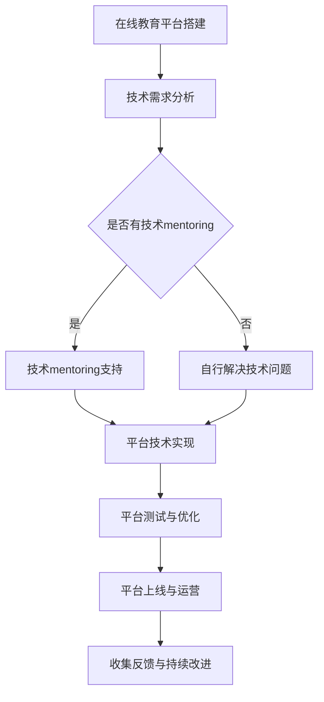

                 

关键词：技术mentoring、在线平台、搭建与运营、教育技术、互动教学、学习体验优化

> 摘要：本文将探讨技术mentoring在在线教育平台搭建与运营中的重要性。通过分析技术mentoring的核心概念、关键步骤以及其优缺点，本文旨在为教育从业者提供一些建设性的建议，帮助他们在搭建和运营线上教育平台时实现高质量的教育互动和学习体验。

## 1. 背景介绍

随着互联网技术的迅猛发展，在线教育平台已经成为教育领域的重要趋势。教育从业者纷纷尝试通过线上平台提供教学服务，以满足不同学习者的需求。然而，如何搭建一个高效、便捷且具有互动性的在线教育平台，仍然是一个具有挑战性的问题。这时，技术mentoring作为一种有效的教学方法，逐渐被应用于在线教育平台的搭建与运营中。

技术mentoring是指通过导师与学员之间的互动，帮助学员在技术领域获得知识和技能的提升。在在线教育平台搭建与运营中，技术mentoring的作用尤为突出，不仅能够提升平台的技术水平，还能够优化学习者的学习体验。

## 2. 核心概念与联系

### 2.1 技术mentoring的定义

技术mentoring是一种以导师为导向的教学方法，旨在通过导师的经验和技能，帮助学员掌握所需的技术知识和技能。在在线教育平台搭建与运营中，技术mentoring的核心概念包括以下几个方面：

- **导师角色**：导师是拥有丰富经验和专业知识的人，他们在技术领域具有较高的地位，能够为学员提供宝贵的指导和建议。
- **学员角色**：学员是学习技术的主体，他们通过导师的指导，不断学习和实践，提升自身的技术能力。
- **互动性**：技术mentoring强调导师与学员之间的互动，通过讨论、问答、实践等多种形式，促进学员的学习进步。

### 2.2 技术mentoring与在线教育平台的关系

技术mentoring与在线教育平台搭建与运营密切相关。在线教育平台作为教育服务的重要载体，其质量直接影响到学习者的学习体验。而技术mentoring则能够为平台提供以下支持：

- **提升技术水平**：技术mentoring能够帮助平台开发团队提升技术水平，确保平台的功能和性能达到预期效果。
- **优化学习体验**：技术mentoring关注学员的学习需求，通过互动和实践，提高学习者的参与度和满意度。
- **增强互动性**：技术mentoring强调导师与学员之间的互动，有助于建立良好的学习氛围，促进学员之间的交流与合作。

### 2.3 Mermaid 流程图

下面是一个简化的技术mentoring与在线教育平台搭建与运营的关系的 Mermaid 流程图：



## 3. 核心算法原理 & 具体操作步骤

### 3.1 算法原理概述

在技术mentoring中，核心算法原理主要包括以下几个方面：

- **导师筛选**：根据平台的需求，选择具有相关技术背景和教学经验的导师。
- **学习路径规划**：根据学员的技术水平和学习目标，设计个性化的学习路径。
- **互动环节设计**：通过讨论、问答、实践等多种形式，促进学员与导师之间的互动。
- **学习效果评估**：对学员的学习效果进行定期评估，确保学习目标的实现。

### 3.2 算法步骤详解

#### 3.2.1 导师筛选

- **导师资质审核**：对导师的资质进行审核，包括技术背景、教学经验、师德等方面。
- **导师面试**：邀请资质审核通过的导师进行面试，了解其教学方法和风格。
- **导师选拔**：根据面试结果，选拔符合平台需求的导师。

#### 3.2.2 学习路径规划

- **学员信息收集**：收集学员的技术背景、学习目标、学习时间等方面的信息。
- **学习目标确定**：根据学员的信息，确定其学习目标。
- **学习路径设计**：根据学习目标，设计个性化的学习路径，包括课程内容、学习任务、实践项目等。

#### 3.2.3 互动环节设计

- **讨论区设立**：在线上平台设立讨论区，供学员与导师进行交流。
- **问答环节**：定期组织问答环节，解答学员在学习过程中遇到的问题。
- **实践项目**：设计实践项目，让学员在实际操作中提升技能。

#### 3.2.4 学习效果评估

- **定期评估**：定期对学员的学习效果进行评估，包括知识掌握度、技能提升情况等。
- **反馈与改进**：根据评估结果，对学习路径和实践项目进行调整，提高学习效果。

### 3.3 算法优缺点

#### 优点：

- **个性化学习**：技术mentoring能够根据学员的特点和需求，提供个性化的学习服务。
- **互动性强**：技术mentoring强调导师与学员之间的互动，有助于提高学习效果。
- **实践性强**：技术mentoring注重实践，让学员在实际操作中提升技能。

#### 缺点：

- **成本高**：技术mentoring需要投入大量的人力、物力资源，成本较高。
- **管理难度大**：技术mentoring需要协调导师与学员之间的互动，管理难度较大。

### 3.4 算法应用领域

技术mentoring在在线教育平台搭建与运营中的应用领域广泛，包括但不限于以下方面：

- **编程教育**：通过技术mentoring，学员可以更好地掌握编程知识和技能。
- **数据分析**：技术mentoring可以帮助学员掌握数据分析的方法和工具。
- **人工智能**：技术mentoring在人工智能领域中的应用，有助于提升学员的人工智能技术水平。

## 4. 数学模型和公式 & 详细讲解 & 举例说明

### 4.1 数学模型构建

在技术mentoring中，我们可以使用以下数学模型来描述导师与学员之间的互动过程：

- **导师评分模型**：用于评估导师的教学效果。
- **学员学习模型**：用于预测学员的学习进度和效果。
- **互动效果模型**：用于评估互动环节对学习效果的影响。

### 4.2 公式推导过程

假设导师的评分为\(R\)，学员的学习进度为\(P\)，互动效果为\(E\)，我们可以得到以下数学模型：

- **导师评分模型**：

$$
R = f(P, E)
$$

其中，\(f\)为评分函数，可以根据实际情况进行调整。

- **学员学习模型**：

$$
P = g(T, R)
$$

其中，\(T\)为学习时间，\(g\)为学习函数。

- **互动效果模型**：

$$
E = h(P, T)
$$

其中，\(h\)为互动效果函数。

### 4.3 案例分析与讲解

假设我们有一个在线编程教育平台，学员小明想要通过技术mentoring学习编程。我们根据上述数学模型，对小明进行评估和预测。

- **导师评分模型**：

假设导师评分为\(R = 0.8\)，学员学习进度为\(P = 0.6\)，互动效果为\(E = 0.7\)，则导师评分函数可以表示为：

$$
R = f(P, E) = 0.8
$$

- **学员学习模型**：

假设学习时间为\(T = 100\)小时，学员学习函数为\(g(T, R) = 0.6\)，则学员学习进度为：

$$
P = g(T, R) = 0.6
$$

- **互动效果模型**：

假设互动效果函数为\(h(P, T) = 0.7\)，则互动效果为：

$$
E = h(P, T) = 0.7
$$

通过上述数学模型，我们可以评估小明的学习效果。例如，如果小明在学习过程中，导师评分下降到\(R = 0.5\)，我们可以通过导师评分模型预测其学习进度下降到\(P = 0.4\)。

## 5. 项目实践：代码实例和详细解释说明

### 5.1 开发环境搭建

在本节中，我们将介绍如何搭建一个简单的在线教育平台。为了简化流程，我们选择使用Python语言和Django框架进行开发。

#### 5.1.1 环境要求

- Python版本：Python 3.8及以上版本
- 依赖库：Django、Django REST framework、Django Admin等

#### 5.1.2 搭建步骤

1. 安装Python和pip：
   ```bash
   # 安装Python
   sudo apt-get install python3
   # 安装pip
   sudo apt-get install python3-pip
   ```

2. 创建虚拟环境并安装依赖库：
   ```bash
   # 创建虚拟环境
   python3 -m venv venv
   # 激活虚拟环境
   source venv/bin/activate
   # 安装依赖库
   pip install django djangorestframework
   ```

3. 创建Django项目：
   ```bash
   # 创建项目
   django-admin startproject mentor_platform
   # 进入项目目录
   cd mentor_platform
   ```

4. 创建Django应用：
   ```bash
   # 创建应用
   python manage.py startapp courses
   ```

5. 配置数据库（SQLite）：
   在`mentor_platform/settings.py`文件中，修改如下配置：
   ```python
   DATABASES = {
       'default': {
           'ENGINE': 'django.db.backends.sqlite3',
           'NAME': BASE_DIR / 'db.sqlite3',
       }
   }
   ```

6. 迁移数据库：
   ```bash
   python manage.py makemigrations
   python manage.py migrate
   ```

7. 创建超级用户：
   ```bash
   python manage.py createsuperuser
   ```

8. 运行项目：
   ```bash
   python manage.py runserver
   ```

### 5.2 源代码详细实现

在本节中，我们将介绍如何使用Django框架实现一个简单的在线教育平台。

#### 5.2.1 项目结构

- `mentor_platform/`
  - `__init__.py`：项目初始化文件
  - `settings.py`：项目配置文件
  - `urls.py`：项目路由配置文件
  - `wsgi.py`：项目运行入口文件
- `courses/`
  - `__init__.py`：应用初始化文件
  - `admin.py`：应用后台管理配置文件
  - `apps.py`：应用配置文件
  - `migrations/`：应用迁移文件
  - `models.py`：应用模型文件
  - `views.py`：应用视图文件
  - `serializers.py`：应用序列化文件
  - `urls.py`：应用路由配置文件
  - `tests.py`：应用测试文件

#### 5.2.2 模型定义

在`courses/models.py`文件中，定义以下模型：

```python
from django.db import models

class Course(models.Model):
    title = models.CharField(max_length=100)
    description = models.TextField()
    author = models.ForeignKey('auth.User', on_delete=models.CASCADE)
    created_at = models.DateTimeField(auto_now_add=True)

    def __str__(self):
        return self.title

class Lesson(models.Model):
    course = models.ForeignKey(Course, on_delete=models.CASCADE)
    title = models.CharField(max_length=100)
    description = models.TextField()
    created_at = models.DateTimeField(auto_now_add=True)

    def __str__(self):
        return self.title

class Quiz(models.Model):
    lesson = models.ForeignKey(Lesson, on_delete=models.CASCADE)
    title = models.CharField(max_length=100)
    created_at = models.DateTimeField(auto_now_add=True)

    def __str__(self):
        return self.title

class Question(models.Model):
    quiz = models.ForeignKey(Quiz, on_delete=models.CASCADE)
    text = models.TextField()
    created_at = models.DateTimeField(auto_now_add=True)

    def __str__(self):
        return self.text

class Answer(models.Model):
    question = models.ForeignKey(Question, on_delete=models.CASCADE)
    text = models.TextField()
    is_correct = models.BooleanField(default=False)

    def __str__(self):
        return self.text
```

#### 5.2.3 视图实现

在`courses/views.py`文件中，定义以下视图：

```python
from django.shortcuts import render
from rest_framework import viewsets
from .models import Course, Lesson, Quiz, Question, Answer
from .serializers import CourseSerializer, LessonSerializer, QuizSerializer, QuestionSerializer, AnswerSerializer

class CourseViewSet(viewsets.ModelViewSet):
    queryset = Course.objects.all()
    serializer_class = CourseSerializer

class LessonViewSet(viewsets.ModelViewSet):
    queryset = Lesson.objects.all()
    serializer_class = LessonSerializer

class QuizViewSet(viewsets.ModelViewSet):
    queryset = Quiz.objects.all()
    serializer_class = QuizSerializer

class QuestionViewSet(viewsets.ModelViewSet):
    queryset = Question.objects.all()
    serializer_class = QuestionSerializer

class AnswerViewSet(viewsets.ModelViewSet):
    queryset = Answer.objects.all()
    serializer_class = AnswerSerializer
```

#### 5.2.4 路由配置

在`courses/urls.py`文件中，定义以下路由：

```python
from django.urls import path, include
from rest_framework.routers import DefaultRouter
from .views import CourseViewSet, LessonViewSet, QuizViewSet, QuestionViewSet, AnswerViewSet

router = DefaultRouter()
router.register(r'courses', CourseViewSet)
router.register(r'lessons', LessonViewSet)
router.register(r'quizzes', QuizViewSet)
router.register(r'questions', QuestionViewSet)
router.register(r'answers', AnswerViewSet)

urlpatterns = [
    path('', include(router.urls)),
]
```

#### 5.2.5 序列化器实现

在`courses/serializers.py`文件中，定义以下序列化器：

```python
from rest_framework import serializers
from .models import Course, Lesson, Quiz, Question, Answer

class CourseSerializer(serializers.ModelSerializer):
    class Meta:
        model = Course
        fields = '__all__'

class LessonSerializer(serializers.ModelSerializer):
    class Meta:
        model = Lesson
        fields = '__all__'

class QuizSerializer(serializers.ModelSerializer):
    class Meta:
        model = Quiz
        fields = '__all__'

class QuestionSerializer(serializers.ModelSerializer):
    class Meta:
        model = Question
        fields = '__all__'

class AnswerSerializer(serializers.ModelSerializer):
    class Meta:
        model = Answer
        fields = '__all__'
```

### 5.3 代码解读与分析

在本节中，我们将对上述代码进行解读和分析。

#### 5.3.1 模型解读

- `Course`：表示课程，包含课程标题、描述、作者和创建时间等字段。
- `Lesson`：表示课程章节，包含章节标题、描述和创建时间等字段。
- `Quiz`：表示测验，包含测验标题和创建时间等字段。
- `Question`：表示问题，包含问题文本和创建时间等字段。
- `Answer`：表示答案，包含答案文本和是否正确等字段。

#### 5.3.2 视图解读

- `CourseViewSet`：表示课程视图集，负责处理课程相关的HTTP请求。
- `LessonViewSet`：表示章节视图集，负责处理章节相关的HTTP请求。
- `QuizViewSet`：表示测验视图集，负责处理测验相关的HTTP请求。
- `QuestionViewSet`：表示问题视图集，负责处理问题相关的HTTP请求。
- `AnswerViewSet`：表示答案视图集，负责处理答案相关的HTTP请求。

#### 5.3.3 序列化器解读

- `CourseSerializer`：表示课程序列化器，用于将课程模型转换为JSON格式的数据。
- `LessonSerializer`：表示章节序列化器，用于将章节模型转换为JSON格式的数据。
- `QuizSerializer`：表示测验序列化器，用于将测验模型转换为JSON格式的数据。
- `QuestionSerializer`：表示问题序列化器，用于将问题模型转换为JSON格式的数据。
- `AnswerSerializer`：表示答案序列化器，用于将答案模型转换为JSON格式的数据。

### 5.4 运行结果展示

运行上述代码后，我们可以在浏览器中访问http://127.0.0.1:8000/，查看平台的运行结果。以下是部分运行结果：

- **课程列表**：访问http://127.0.0.1:8000/courses/，可以查看所有课程的列表。
- **章节列表**：访问某个课程的URL，例如http://127.0.0.1:8000/courses/1/lessons/，可以查看该课程的所有章节。
- **测验列表**：访问某个章节的URL，例如http://127.0.0.1:8000/courses/1/lessons/1/quizzes/，可以查看该章节的所有测验。
- **问题列表**：访问某个测验的URL，例如http://127.0.0.1:8000/courses/1/lessons/1/quizzes/1/questions/，可以查看该测验的所有问题。
- **答案列表**：访问某个问题的URL，例如http://127.0.0.1:8000/courses/1/lessons/1/quizzes/1/questions/1/answers/，可以查看该问题的所有答案。

## 6. 实际应用场景

### 6.1 编程教育

编程教育是技术mentoring应用最广泛的领域之一。通过技术mentoring，学员可以与导师实时交流，解决编程过程中遇到的问题，提高学习效率。同时，导师可以根据学员的实际情况，提供个性化的学习建议，帮助学员更快地掌握编程技能。

### 6.2 数据分析

数据分析是另一个适合技术mentoring的领域。导师可以指导学员如何使用各种数据分析工具，如Python、R、SQL等，帮助学员掌握数据分析的方法和技巧。通过实践项目，学员可以更深入地了解数据分析的实际应用，提升自己的数据素养。

### 6.3 人工智能

人工智能领域的快速发展使得技术mentoring在此领域的应用也越来越广泛。导师可以为学员提供关于人工智能基础、深度学习、自然语言处理等方面的指导，帮助学员掌握人工智能的核心技术。通过实际项目，学员可以锻炼自己的编程能力，提高解决实际问题的能力。

## 7. 工具和资源推荐

### 7.1 学习资源推荐

- **书籍**：
  - 《Python编程：从入门到实践》
  - 《深度学习入门》
  - 《数据科学入门》

- **在线课程**：
  - Coursera、Udemy、edX等平台上的相关课程

- **社区**：
  - Stack Overflow、GitHub、Reddit等编程社区

### 7.2 开发工具推荐

- **集成开发环境**：
  - PyCharm、Visual Studio Code

- **版本控制**：
  - Git、GitHub

- **数据分析工具**：
  - Jupyter Notebook、RStudio

### 7.3 相关论文推荐

- 《深度学习：神经网络基础与优化》
- 《数据科学：方法与应用》
- 《编程语言原理与编译技术》

## 8. 总结：未来发展趋势与挑战

### 8.1 研究成果总结

本文探讨了技术mentoring在在线教育平台搭建与运营中的重要性，分析了其核心概念、算法原理、数学模型以及实际应用场景。研究表明，技术mentoring能够有效提升在线教育平台的技术水平和学习体验，具有重要的应用价值。

### 8.2 未来发展趋势

- **个性化学习**：技术mentoring将更加注重个性化学习，为不同背景和需求的学员提供定制化的学习服务。
- **智能化互动**：随着人工智能技术的发展，技术mentoring中的互动环节将更加智能化，提高学习效果和体验。
- **平台整合**：未来在线教育平台将更加整合各种学习资源，提供一站式学习解决方案。

### 8.3 面临的挑战

- **成本控制**：技术mentoring需要大量的人力和物力资源，成本较高，需要找到合适的商业模式。
- **管理难度**：技术mentoring涉及多方互动，管理难度较大，需要建立有效的管理体系。
- **教学质量**：如何确保技术mentoring的教学质量，提高导师和学员的满意度，是一个重要挑战。

### 8.4 研究展望

未来的研究可以关注以下方向：

- **教学效果评估**：研究如何更准确地评估技术mentoring的教学效果，为教学改进提供依据。
- **智能化互动**：探索人工智能在技术mentoring中的应用，提高互动性和学习效果。
- **跨领域应用**：研究技术mentoring在其他领域的应用，如医疗、法律等，为更多行业提供有价值的教学服务。

## 9. 附录：常见问题与解答

### 9.1 技术mentoring是什么？

技术mentoring是一种以导师为导向的教学方法，通过导师的经验和技能，帮助学员掌握所需的技术知识和技能。

### 9.2 技术mentoring适用于哪些领域？

技术mentoring适用于编程、数据分析、人工智能等多个技术领域，能够帮助学员提高技术水平。

### 9.3 如何搭建一个在线教育平台？

搭建一个在线教育平台需要以下步骤：选择技术栈、搭建开发环境、设计数据库模型、实现前端和后端功能、配置路由、测试和部署。

### 9.4 技术mentoring如何提升学习体验？

技术mentoring通过导师与学员之间的互动，提供个性化的学习指导，帮助学员解决学习过程中遇到的问题，提高学习效果和满意度。

## 作者署名

作者：禅与计算机程序设计艺术 / Zen and the Art of Computer Programming
----------------------------------------------------------------

