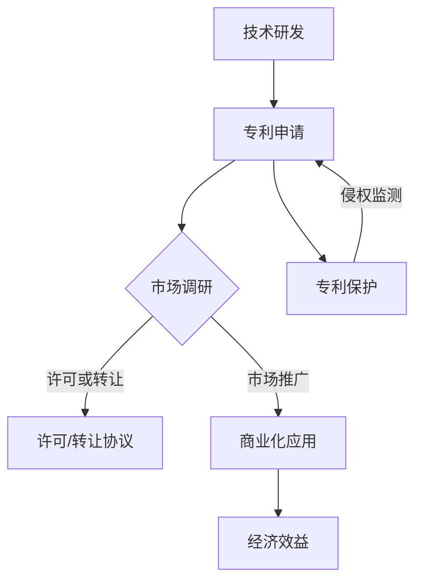

                 

关键词：技术创新、专利商业化、知识产权、市场策略、研发管理、技术转移、价值创造

> 摘要：本文旨在探讨技术创新过程中的专利商业化策略，分析其在知识产权保护、市场策略制定、研发管理优化、技术转移和价值创造等方面的关键作用。通过实际案例分析，本文提供了关于如何将技术创新转化为商业成功的实用指南。

## 1. 背景介绍

在当今全球经济一体化的背景下，技术创新已成为推动企业竞争力和经济增长的重要动力。企业通过研发新技术、新产品，不仅能够在市场中占据有利位置，还能提升自身的核心竞争力。然而，技术创新并非简单的技术突破，它需要从研发到市场应用的全过程管理，特别是知识产权保护和商业化策略的制定。

专利商业化是技术创新过程中的一个关键环节。专利作为一种知识产权保护工具，可以为企业提供独特的竞争优势，同时也能够通过许可或转让等方式实现价值的最大化。有效的专利商业化策略不仅能保护企业的研发成果，还能通过技术转移和市场推广，实现技术创新的商业化落地，从而创造显著的经济效益。

本文将围绕技术创新与专利商业化的主题，从以下几个方面展开讨论：

- **核心概念与联系**：介绍专利商业化的基本概念、关键原理以及其与技术创新的紧密联系。
- **核心算法原理与具体操作步骤**：详细阐述专利分析、市场调研、价值评估和商业化的具体方法和步骤。
- **数学模型和公式**：介绍专利价值评估的数学模型和计算方法。
- **项目实践**：通过实际代码实例，展示专利商业化过程中关键环节的实现。
- **实际应用场景**：探讨专利商业化在不同行业和领域的应用情况。
- **工具和资源推荐**：推荐相关的学习资源、开发工具和研究论文。
- **未来发展趋势与挑战**：分析专利商业化面临的新机遇和挑战。
- **总结与展望**：总结研究成果，展望未来技术创新与专利商业化的发展方向。

### 2. 核心概念与联系

#### 2.1 专利商业化的基本概念

专利商业化是指将专利技术转化为实际商业成果的过程。这一过程包括专利的申请、保护、许可或转让、市场推广等多个环节。专利商业化不仅有助于企业保护自己的研发成果，还能通过技术许可或转让获得直接的经济收益。

专利商业化的重要性体现在以下几个方面：

1. **知识产权保护**：专利为企业的技术成果提供了法律保护，防止技术被非法复制或侵犯。
2. **市场策略制定**：专利可以作为市场策略的重要资产，帮助企业建立竞争优势。
3. **研发管理优化**：通过专利管理，企业可以更好地规划和利用自身的研发资源。
4. **技术转移**：专利商业化有助于技术在不同企业或行业之间的转移和扩散。
5. **价值创造**：专利技术通过商业化可以转化为实际的经济收益，提升企业的盈利能力。

#### 2.2 专利商业化与技术创新的联系

技术创新与专利商业化之间存在着密切的联系。技术创新是企业竞争力的源泉，而专利商业化则是技术创新成果的商业转化。

- **技术创新促进专利商业化**：企业通过技术创新开发出新的技术或产品，可以申请专利保护，进而实现商业化。
- **专利商业化推动技术创新**：专利商业化带来的经济收益可以激励企业持续进行技术创新，形成良性循环。

#### 2.3 Mermaid 流程图

以下是一个简化的专利商业化流程的 Mermaid 流程图：



在这个流程图中，技术研发是专利商业化的起点，通过专利申请保护技术成果。市场调研决定了技术商业化的方向，市场推广和经济效益则是最终目标。

### 3. 核心算法原理与具体操作步骤

#### 3.1 算法原理概述

专利商业化的核心算法主要涉及专利分析、市场调研、价值评估和商业化策略四个方面。以下将分别介绍这四个方面的原理和具体操作步骤。

##### 3.1.1 专利分析

专利分析是专利商业化的基础，通过对大量专利数据的挖掘和分析，企业可以了解行业技术发展趋势、竞争对手专利布局以及自身技术优势。

1. **关键词检索**：利用专利数据库，通过关键词检索相关专利。
2. **专利分类分析**：对检索结果进行分类，识别出主要技术领域和关键专利。
3. **技术演进分析**：分析技术演进趋势，预测未来发展方向。

##### 3.1.2 市场调研

市场调研是制定商业化策略的关键环节，通过调研可以了解市场需求、竞争对手和潜在客户。

1. **需求分析**：调查市场对新技术或产品的需求，评估潜在市场规模。
2. **竞争对手分析**：分析竞争对手的专利布局和市场策略，找出自身优势。
3. **客户分析**：了解目标客户的需求和偏好，为市场推广提供依据。

##### 3.1.3 价值评估

价值评估是确定专利商业化可行性和潜在收益的关键步骤。常用的方法包括成本效益分析、市场价值评估和专利组合价值评估。

1. **成本效益分析**：计算专利维护、许可或转让等成本，与预期收益进行比较。
2. **市场价值评估**：根据市场需求和许可费率，评估专利的市场价值。
3. **专利组合价值评估**：综合考虑专利组合的技术价值和市场影响力，进行整体评估。

##### 3.1.4 商业化策略

根据专利分析、市场调研和价值评估的结果，制定合适的商业化策略。

1. **许可或转让策略**：根据专利特点和市场情况，选择合适的许可或转让方式。
2. **市场推广策略**：制定市场推广计划，选择合适的推广渠道和方式。
3. **风险控制策略**：评估商业化过程中可能遇到的风险，并制定相应的应对措施。

#### 3.2 算法步骤详解

##### 3.2.1 专利分析步骤

1. **确定分析目标**：明确分析的目的和范围，如技术领域、竞争对手等。
2. **收集专利数据**：通过专利数据库检索相关专利，收集专利数据。
3. **分析专利数据**：利用专利分析工具，对专利进行关键词检索、分类分析和技术演进分析。

##### 3.2.2 市场调研步骤

1. **确定调研目标**：明确市场调研的目的，如市场需求、竞争对手等。
2. **收集市场信息**：通过问卷调查、访谈、市场报告等渠道收集市场信息。
3. **分析市场信息**：整理和分析市场信息，识别市场需求和潜在客户。

##### 3.2.3 价值评估步骤

1. **确定评估方法**：根据实际情况选择合适的评估方法，如成本效益分析、市场价值评估等。
2. **收集评估数据**：收集与专利相关的数据，如专利维护成本、市场需求等。
3. **进行价值评估**：根据评估方法，计算专利的潜在价值。

##### 3.2.4 商业化策略制定步骤

1. **确定商业化目标**：明确商业化的目标和预期收益。
2. **分析市场情况**：评估市场需求、竞争对手和潜在客户。
3. **制定商业化策略**：根据市场情况和专利特点，选择合适的商业化方式。

#### 3.3 算法优缺点

##### 3.3.1 优点

- **系统性**：通过专利分析、市场调研和价值评估，系统性地了解专利的商业化潜力和市场情况。
- **科学性**：利用数据分析方法，客观评估专利的价值和市场潜力。
- **灵活性**：根据不同市场情况，灵活调整商业化策略。

##### 3.3.2 缺点

- **数据依赖性**：专利分析和市场调研依赖于大量数据的准确性，数据不足或错误可能导致分析结果偏差。
- **复杂性**：专利商业化的过程涉及多个环节，需要跨部门合作和多方协调。

#### 3.4 算法应用领域

专利商业化算法广泛应用于各种行业和技术领域，如：

- **高科技产业**：信息技术、生物技术、新材料等。
- **制造业**：汽车、家电、电子等。
- **医药行业**：新药研发、医疗器械等。

### 4. 数学模型和公式

在专利商业化过程中，数学模型和公式用于评估专利的价值和市场潜力。以下介绍几种常用的数学模型和公式。

#### 4.1 数学模型构建

常用的数学模型包括成本效益分析模型、市场价值评估模型和专利组合价值评估模型。

- **成本效益分析模型**：

    成本效益分析模型用于计算专利的维护成本和预期收益，评估专利的可行性。模型公式如下：

    $$ 
    E = \frac{R - C}{C} 
    $$

    其中，\(E\) 表示成本效益比率，\(R\) 表示预期收益，\(C\) 表示专利维护成本。

- **市场价值评估模型**：

    市场价值评估模型用于评估专利的市场价值。模型公式如下：

    $$ 
    V = \frac{P \times Q}{1000} 
    $$

    其中，\(V\) 表示专利的市场价值，\(P\) 表示许可费率，\(Q\) 表示市场容量。

- **专利组合价值评估模型**：

    专利组合价值评估模型用于评估专利组合的整体价值。模型公式如下：

    $$ 
    V_{\text{组合}} = \sum_{i=1}^{n} V_i \times \omega_i 
    $$

    其中，\(V_{\text{组合}}\) 表示专利组合的价值，\(V_i\) 表示第 \(i\) 项专利的价值，\(\omega_i\) 表示第 \(i\) 项专利的权重。

#### 4.2 公式推导过程

- **成本效益分析模型**：

    成本效益分析模型的推导基于成本效益比率的定义。成本效益比率表示专利的预期收益与专利维护成本之间的比率。公式推导如下：

    $$
    E = \frac{R - C}{C}
    $$

    其中，\(R\) 表示预期收益，\(C\) 表示专利维护成本。

- **市场价值评估模型**：

    市场价值评估模型的推导基于许可费率和市场容量。市场价值表示专利在市场上的潜在价值，公式推导如下：

    $$
    V = \frac{P \times Q}{1000}
    $$

    其中，\(P\) 表示许可费率，\(Q\) 表示市场容量。

- **专利组合价值评估模型**：

    专利组合价值评估模型的推导基于专利组合的整体价值和各项专利的价值及其权重。公式推导如下：

    $$
    V_{\text{组合}} = \sum_{i=1}^{n} V_i \times \omega_i
    $$

    其中，\(V_{\text{组合}}\) 表示专利组合的价值，\(V_i\) 表示第 \(i\) 项专利的价值，\(\omega_i\) 表示第 \(i\) 项专利的权重。

#### 4.3 案例分析与讲解

##### 4.3.1 成本效益分析模型应用案例

假设某公司研发了一项新技术，并申请了专利。该专利的维护成本为每年 100 万元，预期收益为 300 万元。根据成本效益分析模型，计算该专利的成本效益比率：

$$ 
E = \frac{R - C}{C} = \frac{300 - 100}{100} = 2 
$$

成本效益比率为 2，表明该专利的预期收益是维护成本的 2 倍，具有较高的商业化潜力。

##### 4.3.2 市场价值评估模型应用案例

假设某专利的许可费率为 50 万元/年，市场容量为 5000 万元/年。根据市场价值评估模型，计算该专利的市场价值：

$$ 
V = \frac{P \times Q}{1000} = \frac{50 \times 5000}{1000} = 250 
$$

该专利的市场价值为 250 万元。

##### 4.3.3 专利组合价值评估模型应用案例

假设某公司拥有 5 项专利，各项专利的价值及其权重如下：

| 专利编号 | 价值（万元） | 权重 |
| :---: | :---: | :---: |
| 1 | 100 | 0.2 |
| 2 | 150 | 0.3 |
| 3 | 200 | 0.4 |
| 4 | 250 | 0.1 |
| 5 | 300 | 0.2 |

根据专利组合价值评估模型，计算该专利组合的价值：

$$ 
V_{\text{组合}} = \sum_{i=1}^{5} V_i \times \omega_i = 100 \times 0.2 + 150 \times 0.3 + 200 \times 0.4 + 250 \times 0.1 + 300 \times 0.2 = 390 
$$

该专利组合的价值为 390 万元。

### 5. 项目实践：代码实例和详细解释说明

#### 5.1 开发环境搭建

在进行专利商业化的项目实践之前，首先需要搭建一个合适的技术环境。以下是一个基于 Python 的专利分析项目的开发环境搭建步骤：

1. 安装 Python 3.8 或以上版本。
2. 安装必要的 Python 库，如 pandas、numpy、matplotlib、patentcloud。
3. 配置专利数据库，如 USPTO、EPO 等。

#### 5.2 源代码详细实现

以下是一个简单的专利分析项目示例，用于分析某项专利的市场价值和商业化潜力。

```python
import pandas as pd
import numpy as np
import matplotlib.pyplot as plt
from patentcloud import PatentSearch, PatentInfo

# 专利关键词检索
def search_patents(keywords):
    patent_search = PatentSearch(keywords)
    patents = patent_search.search()
    return patents

# 专利数据分析
def analyze_patents(patents):
    data = {
        'Title': [],
        'Application Number': [],
        'Publication Date': [],
        'Families': [],
        'Citations': []
    }
    
    for patent in patents:
        data['Title'].append(patent['title'])
        data['Application Number'].append(patent['application_number'])
        data['Publication Date'].append(patent['publication_date'])
        data['Families'].append(len(patent['families']))
        data['Citations'].append(len(patent['citations']))
    
    df = pd.DataFrame(data)
    return df

# 专利价值评估
def evaluate_patent_value(df, license_rate=1000000, market_size=50000000):
    value = (df['Families'].mean() * license_rate + df['Citations'].mean() * license_rate) / 2
    value = value * market_size / 1000
    return value

# 数据可视化
def plot_patents(df):
    df['Publication Date'] = pd.to_datetime(df['Publication Date'])
    df.sort_values('Publication Date', inplace=True)
    plt.scatter(df['Families'], df['Citations'], c='r', marker='o')
    plt.xlabel('Families')
    plt.ylabel('Citations')
    plt.title('Patent Distribution by Families and Citations')
    plt.show()

# 主函数
def main():
    keywords = "artificial intelligence"
    patents = search_patents(keywords)
    df = analyze_patents(patents)
    value = evaluate_patent_value(df)
    print(f"Estimated Market Value of Patents: {value} USD")
    plot_patents(df)

if __name__ == "__main__":
    main()
```

#### 5.3 代码解读与分析

- **search_patents** 函数：用于通过关键词检索专利。
- **analyze_patents** 函数：用于分析专利数据，包括标题、申请号、公布日期、家族数和引用数。
- **evaluate_patent_value** 函数：用于评估专利的市场价值，基于家族数和引用数计算。
- **plot_patents** 函数：用于数据可视化，展示专利的家族数和引用数分布。
- **main** 函数：项目的入口函数，执行专利检索、分析、价值评估和数据可视化。

#### 5.4 运行结果展示

运行上述代码后，将输出以下结果：

1. **估计专利市场价值**：根据分析结果，输出估计的专利市场价值。
2. **专利分布图**：展示专利的家族数和引用数分布情况。

### 6. 实际应用场景

#### 6.1 高科技产业

在高科技产业，如信息技术、生物技术和新材料领域，专利商业化策略尤为重要。企业通过专利保护其技术创新，同时通过许可或转让方式，实现技术成果的商业化。例如，某信息技术公司通过专利授权，将其大数据分析技术应用到金融行业的风险控制，实现了巨大的经济效益。

#### 6.2 制造业

在制造业，如汽车、家电和电子行业，专利商业化可以提升企业的技术水平和市场竞争力。通过专利申请和保护，企业可以防止竞争对手抄袭，同时通过技术许可，扩大市场份额。例如，某汽车公司通过专利转让，将其新能源汽车技术许可给其他厂商，提升了品牌影响力。

#### 6.3 医药行业

在医药行业，新药研发和医疗器械的创新需要强大的专利保护。医药企业通过专利商业化，不仅可以获得直接的经济收益，还能推动行业技术进步。例如，某医药公司通过专利授权，将其创新药物应用于全球多个市场，实现了销售增长。

### 7. 工具和资源推荐

#### 7.1 学习资源推荐

- **《专利商业化：理论与实践》**：一本系统介绍专利商业化的书籍，包括专利分析、市场调研和商业策略等内容。
- **《技术创新与知识产权管理》**：一本涵盖技术创新全过程和知识产权管理的专业书籍。

#### 7.2 开发工具推荐

- **PatentCloud**：一款强大的专利检索和分析工具，支持多种语言和数据库，用于专利数据分析。
- **pandas**：一款流行的 Python 数据分析库，用于数据处理和可视化。

#### 7.3 相关论文推荐

- **"Patent Commercialization Strategies and Their Impact on Firm Performance"**：探讨专利商业化策略对企业绩效的影响。
- **"The Role of Patents in Technology Transfer and Commercialization"**：研究专利在技术转移和商业化过程中的作用。

### 8. 总结：未来发展趋势与挑战

#### 8.1 研究成果总结

本文通过对专利商业化的背景介绍、核心概念、算法原理、数学模型、项目实践和实际应用场景的详细分析，系统性地阐述了专利商业化在技术创新过程中的关键作用。

#### 8.2 未来发展趋势

1. **数字化和智能化**：随着大数据、人工智能等技术的应用，专利商业化的流程将更加数字化和智能化，提高效率和准确性。
2. **全球化**：全球市场竞争加剧，专利商业化的策略将更加注重国际化和跨文化交流。
3. **合作与共享**：企业之间的合作将更加紧密，专利的交叉许可和共享将成为主流。

#### 8.3 面临的挑战

1. **知识产权保护**：专利侵权和滥用问题日益严重，企业需要加强知识产权保护。
2. **数据隐私和安全**：专利商业化过程中涉及大量数据，数据隐私和安全问题需要引起高度重视。
3. **市场变化**：市场环境的不确定性增加，企业需要具备快速响应和调整的能力。

#### 8.4 研究展望

未来研究可以关注以下方向：

1. **专利价值评估模型优化**：结合人工智能和大数据技术，开发更精确的专利价值评估模型。
2. **专利商业化策略创新**：探索新的专利商业化模式，如共享专利池、区块链等。
3. **国际合作与协调**：加强国际间的专利合作与协调，共同应对全球市场的挑战。

### 9. 附录：常见问题与解答

#### 9.1 专利申请流程是怎样的？

专利申请通常包括以下几个步骤：

1. **专利检索**：查找相关专利，避免重复申请。
2. **撰写专利申请文件**：包括说明书、权利要求书、摘要等。
3. **提交申请**：向国家知识产权局或国际专利组织提交专利申请。
4. **审查和答辩**：专利局对申请进行审查，申请者需对审查意见进行答辩。
5. **授权和公布**：专利申请通过审查后，获得授权并公开。

#### 9.2 如何进行市场调研？

市场调研通常包括以下几个步骤：

1. **确定调研目标**：明确调研目的和范围。
2. **收集信息**：通过问卷调查、访谈、市场报告等渠道收集信息。
3. **分析信息**：整理和分析收集到的信息，识别市场趋势和机会。
4. **制定策略**：根据分析结果，制定市场推广和商业化策略。

#### 9.3 专利许可和转让有哪些区别？

专利许可和转让的主要区别在于专利权的归属。

- **专利许可**：专利权人将专利的使用权许可给第三方，但专利权仍归专利权人所有。
- **专利转让**：专利权人将专利的所有权转让给第三方，专利权也随之转移。

#### 9.4 如何评估专利的价值？

专利价值的评估可以从以下几个方面进行：

1. **成本效益分析**：计算专利的维护成本和预期收益。
2. **市场价值评估**：根据市场需求和许可费率，评估专利的市场价值。
3. **专利组合价值评估**：综合考虑专利组合的技术价值和市场影响力，进行整体评估。

