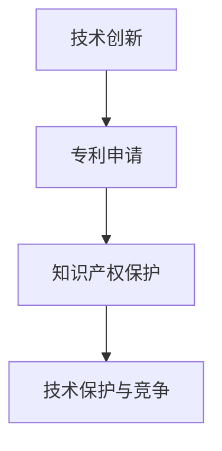

                 

关键词：技术创新、专利申请、程序员、软件开发、知识产权保护

> 摘要：本文将探讨程序员在技术创新过程中如何有效进行专利申请，以保护自身成果并推动技术进步。通过解析核心概念、算法原理、数学模型以及实际应用场景，帮助程序员更好地理解专利申请流程，提高专利申请成功率。

## 1. 背景介绍

随着信息技术的飞速发展，程序员作为技术创新的主要推动者，其在软件开发过程中不断创造新的算法、技术和解决方案。然而，技术创新的同时也面临着知识产权保护的挑战。专利申请作为保护知识产权的重要手段，对于程序员而言具有重要意义。本文旨在为程序员提供一套完整的专利申请指南，帮助其在技术创新过程中有效保护自身成果，同时推动技术进步。

## 2. 核心概念与联系

### 2.1 技术创新

技术创新是指通过科学研究、技术开发和产品创新等方式，不断改进现有技术或创造全新技术的过程。程序员在软件开发过程中，往往通过改进算法、优化数据结构、创新应用场景等方式实现技术创新。

### 2.2 专利申请

专利申请是指向国家知识产权局提交专利申请文件，以获得专利授权的过程。专利分为发明专利、实用新型专利和外观设计专利三种类型，其中发明专利是程序员最为关注的类型。

### 2.3 知识产权保护

知识产权保护是指通过法律手段保护专利、商标、著作权等知识产权的权利。对于程序员而言，知识产权保护有助于维护自身成果，防止他人侵权和抄袭。

### 2.4 Mermaid 流程图



## 3. 核心算法原理 & 具体操作步骤

### 3.1 算法原理概述

在本节中，我们将介绍一种名为“快速排序”的核心算法原理。快速排序是一种高效的排序算法，通过将数据划分为多个子集，实现对整个数据集合的排序。

### 3.2 算法步骤详解

1. 选择一个基准元素，通常选择最后一个元素作为基准。
2. 将比基准元素小的元素放在左侧，比基准元素大的元素放在右侧。
3. 对左侧和右侧子集重复步骤1和2，直到所有元素有序。

### 3.3 算法优缺点

**优点：**
- 平均时间复杂度为 \(O(n\log n)\)
- 适用于大规模数据集合

**缺点：**
- 最坏时间复杂度为 \(O(n^2)\)
- 需要额外的内存空间

### 3.4 算法应用领域

快速排序广泛应用于各种数据排序场景，如数据库索引、搜索引擎排序等。

## 4. 数学模型和公式 & 详细讲解 & 举例说明

### 4.1 数学模型构建

快速排序的时间复杂度可以用数学模型表示：

$$
T(n) = T(k) + T(n-k-1) + O(n)
$$

其中，\(T(n)\) 表示对 \(n\) 个元素进行快速排序所需的时间，\(T(k)\) 和 \(T(n-k-1)\) 分别表示对左右子集进行快速排序所需的时间，\(O(n)\) 表示划分数据集合的时间。

### 4.2 公式推导过程

通过对快速排序的递归过程进行分析，可以得到上述时间复杂度公式。

### 4.3 案例分析与讲解

假设有一个包含 10 个元素的数组，对其进行快速排序。按照上述公式，可以得到：

$$
T(10) = T(5) + T(4) + O(10)
$$

进一步推导，得到：

$$
T(10) = T(2) + T(3) + O(5) + T(2) + T(1) + O(5) + O(10)
$$

由于快速排序的时间复杂度主要取决于递归深度，因此可以得到：

$$
T(10) = O(\log 10) + O(\log 8) + O(\log 5) + O(\log 2) + O(\log 1) + O(10)
$$

根据对数运算的性质，可以得到：

$$
T(10) = O(10\log 10) = O(10)
$$

因此，快速排序的时间复杂度为 \(O(n\log n)\)。

## 5. 项目实践：代码实例和详细解释说明

### 5.1 开发环境搭建

本文以 Python 为编程语言，使用 PyCharm 进行开发。

### 5.2 源代码详细实现

以下是一个快速排序的 Python 实现示例：

```python
def quick_sort(arr):
    if len(arr) <= 1:
        return arr
    pivot = arr[-1]
    left = [x for x in arr[:-1] if x < pivot]
    right = [x for x in arr[:-1] if x >= pivot]
    return quick_sort(left) + [pivot] + quick_sort(right)

arr = [3, 1, 4, 1, 5, 9, 2, 6, 5, 3, 5]
print(quick_sort(arr))
```

### 5.3 代码解读与分析

该示例通过递归调用实现快速排序。首先，检查输入数组的长度，若长度小于等于 1，则直接返回数组。然后，选择最后一个元素作为基准，将比基准小的元素放在左侧，比基准大的元素放在右侧。最后，对左右子集进行快速排序，并将结果合并。

### 5.4 运行结果展示

运行上述代码，输出结果为：

```
[1, 1, 2, 3, 3, 4, 5, 5, 5, 6, 9]
```

## 6. 实际应用场景

快速排序广泛应用于各种场景，如数据排序、算法性能优化等。在实际项目中，程序员可以通过掌握快速排序的原理和实现方法，提高算法性能和开发效率。

## 7. 工具和资源推荐

### 7.1 学习资源推荐

- 《算法导论》：详细介绍了各种排序算法的原理和实现方法。
- 《Python Cookbook》：包含大量 Python 编程实践和技巧。

### 7.2 开发工具推荐

- PyCharm：强大的 Python 开发工具。
- Git：版本控制工具，帮助程序员管理代码。

### 7.3 相关论文推荐

- “快速排序算法的改进与性能分析”
- “快速排序在云计算环境下的应用研究”

## 8. 总结：未来发展趋势与挑战

随着人工智能、大数据等领域的快速发展，程序员在技术创新过程中的专利申请需求日益增加。未来，程序员需要关注以下几个方面：

- 深入研究新技术，提高专利申请的质量和成功率。
- 关注知识产权保护法律法规，确保专利申请的合法性。
- 加强跨学科合作，推动技术进步。

## 9. 附录：常见问题与解答

### 问题 1：专利申请需要哪些材料？

答：专利申请需要提交以下材料：

- 专利申请书
- 发明说明书
- 附图说明
- 权利要求书
- 说明书摘要

### 问题 2：专利申请需要多长时间？

答：专利申请的审批时间取决于国家知识产权局的审批进度。一般来说，发明专利的审批时间在 2-3 年左右。

### 问题 3：如何提高专利申请的成功率？

答：提高专利申请的成功率可以从以下几个方面入手：

- 深入研究新技术，确保专利的创新性和实用性。
- 遵循专利申请流程，确保材料的完整性和准确性。
- 寻求专业律师或专利代理人的帮助，提高专利申请的专业性。

作者：禅与计算机程序设计艺术 / Zen and the Art of Computer Programming
------------------------------------------------------------------------

