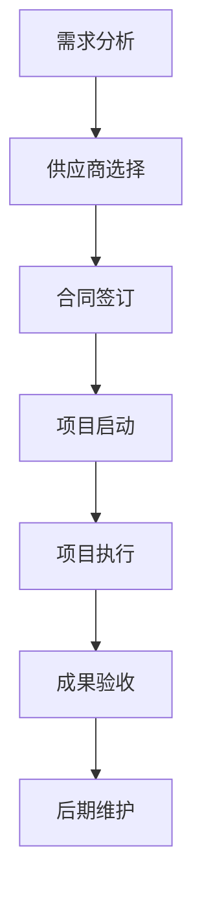

                 

关键词：技术外包、接单、团队管理、项目执行、软件开发、流程优化

> 摘要：本文将深入探讨技术外包的整个生命周期，从接单到建立团队，再到项目执行和成果交付。通过详细的分析和实际案例，揭示技术外包过程中的关键环节和注意事项，为从业者提供实用的指导和建议。

## 1. 背景介绍

随着全球化进程的加速，技术和商业模式的创新，越来越多的企业开始寻求外包服务来优化其运营成本和提高效率。技术外包作为一种有效的商业策略，不仅可以帮助企业专注于核心业务，还能充分利用外部资源和技术优势。然而，技术外包并非一蹴而就，它涉及多个环节，从项目接单到团队建设，再到项目执行和交付，每一个环节都至关重要。

本文旨在通过详细的案例分析，探讨技术外包过程中的各种挑战和解决方案，帮助读者更好地理解和管理技术外包项目。我们将从以下几个方面展开讨论：

- 技术外包的基本概念和类型
- 接单技巧与策略
- 团队建设的核心要素
- 项目执行中的常见问题与应对措施
- 成果交付与客户满意度
- 未来趋势与潜在挑战

通过以上内容的探讨，希望能够为技术外包从业者提供有价值的参考和指导。

## 2. 核心概念与联系

在深入探讨技术外包的各个环节之前，我们首先需要理解一些核心概念，这些概念将贯穿整个外包过程，并影响项目的成功与否。

### 2.1. 外包概念

外包（Outsourcing）是指企业将某些业务活动或功能转移给外部服务提供商来管理或执行。在外包关系中，服务提供商通常具有特定的专业技能或资源，能够以更高效、更具成本效益的方式完成工作。

### 2.2. 技术外包类型

技术外包可以分为以下几种类型：

- **软件开发外包**：企业将软件开发任务外包给专业的软件开发团队。
- **IT支持与维护外包**：企业将IT系统的支持与维护任务外包给专业的IT服务提供商。
- **数据处理与分析外包**：企业将数据处理的复杂任务外包给专业的数据处理团队。
- **技术咨询服务外包**：企业就特定技术问题寻求外部专家的意见和解决方案。

### 2.3. 外包流程

技术外包的基本流程包括以下几个关键步骤：

1. **需求分析与评估**：明确项目需求，评估外包服务的可行性。
2. **供应商选择**：根据需求选择合适的供应商，通常通过招标或询价的方式。
3. **合同签订**：明确双方的权利和义务，制定详细的合同条款。
4. **项目启动与规划**：启动项目，制定详细的项目计划和进度安排。
5. **项目执行与监控**：执行项目任务，并进行实时监控和调整。
6. **成果验收与交付**：验收项目成果，确保符合预期标准，并进行交付。
7. **后期维护与服务**：提供必要的后续支持和维护服务。

### 2.4. 外包与内部开发的区别

外包与内部开发的主要区别在于资源的配置和管理的不同。内部开发依赖于企业内部的资源和能力，而外包则利用外部资源和服务。以下是两者的主要区别：

- **资源利用**：外包可以更灵活地利用外部资源，而内部开发则需自建团队和基础设施。
- **成本控制**：外包可以降低人力资源成本和基础设施成本，但内部开发可能涉及更高的固定成本。
- **风险承担**：外包将风险部分转移给服务提供商，而内部开发则需自行承担所有风险。
- **灵活性**：外包项目通常更灵活，可以快速调整资源投入，而内部开发则需较长的时间来适应变化。

### 2.5. Mermaid 流程图

以下是技术外包流程的Mermaid流程图，用来说明外包过程中各个步骤的相互关系：



通过以上流程图，我们可以清晰地看到技术外包的主要步骤和各个环节之间的逻辑关系。接下来，我们将分别探讨这些步骤中的关键细节和注意事项。

### 3. 核心算法原理 & 具体操作步骤

#### 3.1 算法原理概述

在技术外包项目中，项目管理是至关重要的环节。项目管理不仅关系到项目能否按时、按质完成，还直接影响到客户满意度和企业品牌形象。因此，理解并掌握项目管理的核心算法原理是非常必要的。

项目管理中的核心算法主要包括以下几种：

- **工作分解结构（WBS）**
- **关键路径法（CPM）**
- **项目评估和审查方法（如EV、PV）**
- **敏捷开发方法论**

#### 3.2 算法步骤详解

##### 3.2.1 工作分解结构（WBS）

工作分解结构（Work Breakdown Structure，简称WBS）是将项目任务分解成可管理的子任务的一种方法。以下是创建WBS的基本步骤：

1. **确定项目范围**：明确项目目标、需求和工作边界。
2. **分解主要任务**：将项目任务分解成主要部分，通常以“为什么、做什么、何时做”为依据。
3. **细化任务**：对每个主要任务进一步分解，形成完整的任务列表。
4. **编码任务**：为每个任务分配唯一标识码，便于跟踪和管理。

##### 3.2.2 关键路径法（CPM）

关键路径法（Critical Path Method，简称CPM）用于确定项目中最长的任务序列，这些任务决定了项目的总时长。以下是使用CPM的步骤：

1. **创建任务网络图**：使用节点表示任务，箭头表示任务之间的依赖关系。
2. **计算每个任务的最早开始时间（ES）和最早完成时间（EF）**。
3. **计算每个任务的最新开始时间（LS）和最新完成时间（LF）**。
4. **确定关键路径**：找出总时长最长的路径，这些任务即为关键任务。

##### 3.2.3 项目评估和审查方法

项目评估和审查方法用于监控项目进展和绩效，常用的方法包括：

1. **挣值管理（Earned Value Management，简称EVM）**：通过比较计划价值（PV）、实际成本（AC）和挣值（EV）来评估项目进度和成本绩效。
2. **项目管理评审（Project Management Review，简称PMR）**：定期审查项目进展，识别和解决潜在问题。

##### 3.2.4 敏捷开发方法论

敏捷开发是一种迭代和增量的软件开发方法，它强调快速响应变化和持续交付高质量软件。以下是敏捷开发的关键步骤：

1. **需求收集**：通过与利益相关者沟通，收集和确认项目需求。
2. **迭代规划**：将需求分解成可完成的迭代，并安排每次迭代的时间。
3. **每日站会**：团队成员每日进行简短会议，讨论进度和问题。
4. **迭代回顾**：在每个迭代结束时，评估过程和成果，并调整计划。

#### 3.3 算法优缺点

**工作分解结构（WBS）**

- 优点：有助于明确项目任务和责任，便于管理和监控。
- 缺点：创建过程可能较为复杂，需要大量的时间和人力资源。

**关键路径法（CPM）**

- 优点：能够准确预测项目完成时间，帮助项目经理识别关键任务。
- 缺点：不考虑任务之间的并行执行，可能导致过于保守的时间估计。

**项目评估和审查方法**

- 优点：能够实时监控项目进展和绩效，及时调整计划和资源。
- 缺点：可能需要额外的工具和技术支持。

**敏捷开发方法论**

- 优点：能够快速响应变化，持续交付高质量软件。
- 缺点：项目初期规划可能不够详细，难以预测最终项目成本和进度。

#### 3.4 算法应用领域

- **软件开发项目**：敏捷开发方法论在软件开发中应用广泛，能够提高项目的灵活性和响应速度。
- **IT系统实施**：关键路径法在大型IT系统实施项目中用于确定关键任务和时间节点。
- **基础设施建设**：工作分解结构在基础设施建设项目中用于分解任务和分配资源。

通过上述算法的应用，技术外包项目能够更好地进行规划和管理，从而提高项目的成功率。

### 4. 数学模型和公式 & 详细讲解 & 举例说明

#### 4.1 数学模型构建

在技术外包项目中，数学模型的应用能够帮助我们更准确地预测项目进度、成本和资源需求。以下是一个基本的数学模型构建过程：

1. **需求分析**：明确项目的目标和需求，收集相关数据。
2. **模型假设**：基于需求分析，设定合理的假设条件，如任务持续时间、资源利用率等。
3. **变量定义**：定义模型中的变量，如项目总时间（T）、资源需求（R）、成本（C）等。
4. **公式推导**：根据假设条件和变量定义，推导出相关的数学公式。

#### 4.2 公式推导过程

以下是一个简单的项目进度预测模型，假设一个项目由N个任务组成，每个任务的时间分别为\(T_i\)（i=1,2,...,N），资源需求分别为\(R_i\)，成本为C。则项目的总时间、总资源需求和总成本可以通过以下公式计算：

- **项目总时间**：\(T = \sum_{i=1}^{N} T_i\)
- **项目总资源需求**：\(R = \sum_{i=1}^{N} R_i\)
- **项目总成本**：\(C = \sum_{i=1}^{N} R_i \cdot P_i\)

其中，\(P_i\)为资源单价。

#### 4.3 案例分析与讲解

假设我们有一个项目，包含以下5个任务：

- 任务1：需求分析，持续时间10天，资源需求2人，资源单价500元/天。
- 任务2：设计，持续时间15天，资源需求3人，资源单价500元/天。
- 任务3：开发，持续时间20天，资源需求4人，资源单价500元/天。
- 任务4：测试，持续时间10天，资源需求2人，资源单价500元/天。
- 任务5：验收，持续时间5天，资源需求1人，资源单价500元/天。

根据上述公式，我们可以计算出项目的总时间、总资源需求和总成本：

- **项目总时间**：\(T = 10 + 15 + 20 + 10 + 5 = 60\)天
- **项目总资源需求**：\(R = 2 + 3 + 4 + 2 + 1 = 12\)人
- **项目总成本**：\(C = (2 + 3 + 4 + 2 + 1) \cdot 500 = 12,000\)元

通过这个简单的案例，我们可以看到如何使用数学模型来预测项目的各项指标，从而为项目管理和决策提供依据。

#### 4.4 总结

数学模型在技术外包项目中具有重要作用，它能够帮助我们更准确地预测项目进度、成本和资源需求。通过合理的数学模型构建和公式推导，我们可以更好地进行项目规划和控制，从而提高项目的成功率。

### 5. 项目实践：代码实例和详细解释说明

在了解了技术外包的理论和实践方法后，接下来我们将通过一个实际的代码实例来演示技术外包项目中的关键步骤，包括开发环境搭建、源代码实现、代码解读和运行结果展示。

#### 5.1 开发环境搭建

在开始项目之前，我们需要搭建一个合适的开发环境。以下是一个典型的开发环境搭建过程：

1. **确定开发语言和框架**：根据项目需求，我们选择Python作为开发语言，使用Django框架进行Web开发。

2. **安装Python环境**：下载并安装Python 3.8版本，配置环境变量。

3. **安装Django框架**：通过pip命令安装Django框架：

   ```shell
   pip install django
   ```

4. **创建Django项目**：使用django-admin命令创建一个新的Django项目：

   ```shell
   django-admin startproject tech_outsourcing
   ```

5. **创建应用**：在项目中创建一个应用：

   ```shell
   python manage.py startapp project_management
   ```

6. **配置数据库**：在settings.py文件中配置数据库连接信息，我们使用SQLite数据库：

   ```python
   DATABASES = {
       'default': {
           'ENGINE': 'django.db.backends.sqlite3',
           'NAME': BASE_DIR / 'db.sqlite3',
       }
   }
   ```

7. **运行项目**：启动开发服务器，确保项目运行正常：

   ```shell
   python manage.py runserver
   ```

#### 5.2 源代码详细实现

在开发环境中搭建完成后，我们开始实现项目的主要功能。以下是一个简单的用户管理模块的源代码实现：

**models.py**（定义用户模型）

```python
from django.db import models

class User(models.Model):
    username = models.CharField(max_length=100)
    email = models.EmailField(max_length=254)
    password = models.CharField(max_length=100)

    def __str__(self):
        return self.username
```

**views.py**（定义用户视图函数）

```python
from django.shortcuts import render, redirect
from .models import User
from .forms import UserForm

def user_list(request):
    users = User.objects.all()
    return render(request, 'user_list.html', {'users': users})

def user_create(request):
    if request.method == 'POST':
        form = UserForm(request.POST)
        if form.is_valid():
            form.save()
            return redirect('user_list')
    else:
        form = UserForm()
    return render(request, 'user_create.html', {'form': form})

def user_delete(request, pk):
    user = User.objects.get(id=pk)
    user.delete()
    return redirect('user_list')
```

**forms.py**（定义用户表单）

```python
from django import forms
from .models import User

class UserForm(forms.ModelForm):
    class Meta:
        model = User
        fields = ['username', 'email', 'password']
```

**user_list.html**（用户列表模板）

```html
<!DOCTYPE html>
<html>
<head>
    <title>User List</title>
</head>
<body>
    <h1>User List</h1>
    <table>
        
            <tr>
                <td>{{ user.username }}</td>
                <td>{{ user.email }}</td>
                <td><a href="">Delete</a></td>
            </tr>
        
    </table>
    <a href="">Create New User</a>
</body>
</html>
```

**user_create.html**（用户创建模板）

```html
<!DOCTYPE html>
<html>
<head>
    <title>Create User</title>
</head>
<body>
    <h1>Create User</h1>
    <form method="post">
        
        {{ form.as_p }}
        <button type="submit">Submit</button>
    </form>
</body>
</html>
```

#### 5.3 代码解读与分析

上述代码实现了一个简单的用户管理功能，包括用户列表显示、用户创建和用户删除。以下是代码的主要部分解读：

- **models.py**：定义了User模型，包括用户名、邮箱和密码三个字段。
- **views.py**：定义了三个视图函数，分别是用户列表显示（user_list）、用户创建（user_create）和用户删除（user_delete）。
- **forms.py**：定义了UserForm表单类，用于创建和编辑用户数据。
- **user_list.html**：用于显示用户列表，并提供删除用户链接。
- **user_create.html**：用于创建新用户，使用表单进行数据输入。

#### 5.4 运行结果展示

在开发环境中运行项目后，我们可以通过浏览器访问用户管理界面，进行用户创建、显示和删除操作。以下是运行结果展示：

1. **用户列表**：访问`http://127.0.0.1:8000/user_list/`，显示所有用户信息。

2. **创建用户**：访问`http://127.0.0.1:8000/user_create/`，输入用户信息并提交，创建新用户。

3. **删除用户**：在用户列表中点击删除链接，删除指定用户。

通过这个实际的代码实例，我们可以看到如何在一个技术外包项目中实现具体的功能，并通过合理的代码结构确保项目的可维护性和可扩展性。

### 6. 实际应用场景

技术外包在现代商业环境中扮演着越来越重要的角色，不仅在软件开发领域得到了广泛应用，还在数据处理、IT支持、市场营销等多个领域展现出其独特的价值。以下是技术外包在实际应用场景中的几个典型案例：

#### 6.1 软件开发

随着互联网的快速发展和数字化转型的推进，许多企业选择将软件开发外包给专业的软件开发团队。例如，一家初创公司可能没有足够的技术力量来开发自己的产品，因此会与外部团队合作，从需求分析到产品上线，全程由外包团队负责。这种方式不仅节省了时间和成本，还保证了项目质量。

#### 6.2 数据处理与分析

数据是企业的重要资产，但许多企业可能缺乏处理大数据的专业技能和工具。技术外包服务提供商在这方面发挥了重要作用，他们能够利用先进的数据处理技术和算法，帮助企业从海量数据中提取有价值的信息。例如，一家零售企业可以通过外包数据分析和挖掘服务，了解消费者的购买行为和偏好，从而优化营销策略。

#### 6.3 IT支持与维护

IT系统是企业正常运营的基石，但维护这些系统需要持续投入和专业技能。许多企业选择将IT支持与维护外包给专业的IT服务提供商，确保系统的高效运行和及时故障修复。例如，一家制造企业可能会外包其服务器管理和网络安全服务，从而专注于核心生产业务。

#### 6.4 市场营销与广告

市场营销和广告活动通常需要创意和执行力，这往往超出了许多企业的内部能力。技术外包服务提供商在这里可以提供专业的市场营销策略、内容创作和广告投放服务。例如，一家企业可能通过外包社交媒体营销，提高品牌知名度和用户参与度。

#### 6.5 企业培训与咨询服务

随着技术的不断进步，企业需要不断更新员工的知识和技能。技术外包服务提供商可以提供定制化的培训和咨询服务，帮助员工掌握新的技术和工具。例如，一家金融机构可能会外包其IT培训和网络安全咨询，确保员工能够应对不断变化的安全挑战。

#### 6.6 人力资源外包

人力资源管理是企业运营的重要组成部分，但人力资源部门往往面临招聘、培训和薪酬管理等多方面的挑战。技术外包服务提供商可以提供人力资源外包服务，帮助企业优化招聘流程、提高员工满意度和降低人力资源成本。

通过以上实际应用场景的介绍，我们可以看到技术外包在各个领域的广泛应用和重要作用。无论是帮助企业专注于核心业务，还是提供专业的技术支持和服务，技术外包都为企业带来了显著的价值和竞争优势。

### 6.4 未来应用展望

随着技术的不断进步和市场需求的多样化，技术外包的未来应用场景将更加广泛和深入。以下是一些未来技术外包应用的发展趋势和潜在挑战：

#### 6.4.1 自动化和人工智能

自动化和人工智能技术的快速发展将显著改变技术外包的格局。自动化工具可以大幅提高外包任务的效率，减少人为错误，而人工智能则可以提供更为智能的服务和解决方案。例如，自动化测试和AI驱动的软件开发工具将使外包项目更加高效和可靠。

**发展趋势**：

- **自动化测试**：越来越多的外包项目将采用自动化测试工具，以减少测试时间和成本。
- **AI辅助开发**：AI技术将被广泛应用于软件开发的外包项目中，提供代码优化、错误检测和自动化测试等辅助功能。

**挑战**：

- **技术适应**：外包服务提供商需要不断更新技术和工具，以适应快速变化的技术环境。
- **数据安全和隐私**：自动化和AI技术的应用将涉及大量的数据使用和共享，这可能会带来数据安全和隐私方面的挑战。

#### 6.4.2 云服务与云计算

云服务的普及将推动技术外包向云计算平台迁移。云计算提供了弹性和可扩展性，使外包项目能够根据需求动态调整资源，从而降低成本和提升效率。

**发展趋势**：

- **云原生应用**：越来越多的外包项目将采用云原生技术，确保应用程序能够在云环境中高效运行。
- **多云策略**：企业将采用多云策略，以实现更灵活的IT资源和更好的服务性能。

**挑战**：

- **云迁移成本**：大规模的云迁移可能涉及高昂的成本和复杂的技术调整。
- **云服务依赖**：过度依赖云服务可能导致服务中断和业务风险。

#### 6.4.3 区块链技术

区块链技术的应用有望在提高外包项目的透明度和安全性方面发挥重要作用。通过区块链，外包项目的各个方面可以更加透明和可追溯，从而提高合作信任和效率。

**发展趋势**：

- **智能合约**：智能合约将使外包项目中的合同执行更加自动化和高效。
- **数据共享与协作**：区块链技术将促进外包项目中的数据共享和协作，提高项目的整体效率。

**挑战**：

- **技术成熟度**：区块链技术尚未完全成熟，其性能和安全性可能成为应用推广的障碍。
- **合规性问题**：不同国家和地区的法律法规对区块链技术的应用可能有不同的要求，这需要外包服务提供商进行合规性管理。

#### 6.4.4 数字化转型

数字化转型已经成为企业发展的关键战略，技术外包将在这一过程中发挥重要作用。通过外包数字化解决方案，企业可以快速实现业务流程的优化和运营效率的提升。

**发展趋势**：

- **数字化服务外包**：越来越多的企业将数字化转型的需求外包给专业的服务提供商。
- **行业解决方案**：外包服务提供商将提供更多针对特定行业的数字化解决方案，以更好地满足企业需求。

**挑战**：

- **技术与业务融合**：技术外包服务提供商需要深入理解客户业务，以确保提供的解决方案能够真正满足业务需求。
- **项目管理与协调**：数字化转型项目通常涉及多个部门和系统的协作，项目管理与协调将成为重要挑战。

总之，技术外包在未来将面临诸多机遇和挑战。通过不断适应新技术、优化流程和提升服务质量，外包服务提供商将能够更好地满足客户需求，推动企业数字化转型和持续发展。

### 7. 工具和资源推荐

在技术外包的各个环节中，选择合适的工具和资源可以显著提高工作效率和项目质量。以下是一些值得推荐的工具和资源，包括学习资源、开发工具和相关的学术论文，帮助您更好地应对技术外包过程中的挑战。

#### 7.1 学习资源推荐

- **在线课程**：《项目管理专业人士（PMP）认证培训》
  - 提供全面的PMP认证准备课程，涵盖项目管理的核心知识。
  - 平台：普尔文（Purvin and Gertz）
  
- **书籍**：《敏捷实践指南》
  - 由Mike Cohn所著，详细介绍敏捷开发的方法和实践。
  - 平台：亚马逊（Amazon）

- **博客和社区**：CIO.com
  - 提供丰富的项目管理、技术外包和数字化转型相关文章和案例分析。

#### 7.2 开发工具推荐

- **项目管理工具**：JIRA
  - 用于任务跟踪、进度管理和团队协作。
  - 平台：Atlassian

- **代码管理工具**：GitLab
  - 提供版本控制、代码审查和自动化部署功能。
  - 平台：GitLab Inc.

- **容器化工具**：Docker
  - 用于应用程序的容器化，提高开发、测试和生产的可移植性。
  - 平台：Docker Inc.

#### 7.3 相关论文推荐

- **《外包决策：成本与风险分析》**
  - 作者：Smith, J. (2005)
  - 描述外包决策的经济学原理，分析成本和风险。

- **《云计算服务模型：IaaS、PaaS、SaaS》**
  - 作者：Armbrust, M., et al. (2010)
  - 详细介绍云计算的三种服务模型，讨论其优缺点。

- **《区块链技术的应用与挑战》**
  - 作者：Nakamoto, S. (2008)
  - 分析区块链技术的原理和应用，探讨其在技术外包中的潜在影响。

通过以上工具和资源的推荐，技术外包从业者可以获得更加全面的知识和技能，从而在项目中取得更好的成果。

### 8. 总结：未来发展趋势与挑战

技术外包作为现代商业运营的重要手段，已经展现出其独特的价值和广泛应用前景。在未来，技术外包将继续沿着以下几个方向发展：

#### 8.1 研究成果总结

1. **自动化和智能化**：随着自动化和人工智能技术的不断发展，技术外包将更加高效、精准和智能化。自动化工具和AI驱动的解决方案将大幅提高外包任务的执行效率和准确性。

2. **云服务和区块链**：云服务和区块链技术的成熟和普及将进一步推动技术外包的变革。云服务提供弹性和可扩展性，而区块链技术则提高项目的透明度和安全性，为外包项目带来更多可能性。

3. **数字化转型**：数字化转型成为企业发展的关键战略，技术外包将在这一过程中发挥重要作用。通过外包数字化解决方案，企业可以快速实现业务流程的优化和运营效率的提升。

#### 8.2 未来发展趋势

1. **跨行业应用**：技术外包将不仅限于软件开发和IT支持，还将向更多行业领域扩展，如市场营销、人力资源管理、金融分析等。

2. **全球资源整合**：全球化的趋势将促使外包服务提供商和客户之间建立更加紧密的合作关系，实现全球资源的最佳配置和优化。

3. **个性化定制服务**：随着客户需求的多样化和个性化，技术外包服务提供商将提供更加定制化的解决方案，满足不同行业和客户的具体需求。

#### 8.3 面临的挑战

1. **数据安全和隐私**：随着外包项目中涉及的数据量不断增加，数据安全和隐私保护将成为重要挑战。外包服务提供商需要确保数据的安全传输和存储，同时遵守不同国家和地区的法律法规。

2. **项目管理与协调**：外包项目中涉及多个部门和团队的协作，项目管理与协调将成为重要挑战。外包服务提供商需要具备高效的项目管理能力和跨部门沟通技巧，确保项目的顺利进行。

3. **技术适应性和创新**：技术快速发展的背景下，外包服务提供商需要不断更新技术和工具，以适应变化的市场需求和技术环境。

#### 8.4 研究展望

1. **智能合约**：智能合约的广泛应用将改变外包项目的合同执行方式，提高自动化和效率。未来的研究可以探索智能合约在外包项目中的应用模式和最佳实践。

2. **云计算与边缘计算**：云计算和边缘计算的融合将为外包项目提供更多的计算资源和灵活性。未来的研究可以探讨如何在外包项目中有效利用这些技术，实现更好的性能和成本效益。

3. **可持续发展和社会责任**：随着社会对可持续发展和社会责任的关注不断提高，外包服务提供商需要考虑如何在运营过程中实现可持续发展，并承担社会责任。

总之，技术外包的未来充满机遇和挑战。通过不断探索新技术、优化流程和提升服务质量，外包服务提供商和客户将能够共同应对未来的挑战，实现更高效的协作和更大的业务价值。

### 9. 附录：常见问题与解答

在技术外包过程中，可能会遇到各种各样的问题和挑战。以下是一些常见的问题及相应的解答，帮助您更好地理解和应对这些情况。

#### 9.1 外包合同签订时需要注意什么？

**解答**：在签订外包合同时，需要注意以下几点：

- **明确项目目标和范围**：确保合同中详细列明项目的目标、范围和交付标准。
- **定义责任和权利**：明确双方在项目中的责任和权利，包括项目进度、质量保证、知识产权归属等。
- **风险评估和条款**：对项目可能遇到的风险进行评估，并制定相应的风险应对措施和合同条款。
- **合同变更管理**：明确合同变更的流程和条件，确保在项目进行过程中能够灵活应对需求变化。

#### 9.2 如何选择合适的外包供应商？

**解答**：选择合适的外包供应商需要考虑以下因素：

- **专业能力和经验**：评估供应商在相关领域的专业能力和过往项目经验。
- **团队组成和规模**：了解供应商的团队组成和规模，确保其能够满足项目需求。
- **沟通能力和合作态度**：良好的沟通能力和合作态度是项目成功的关键。
- **价格和预算**：在确保质量和能力的前提下，考虑供应商的价格和预算是否符合预期。

#### 9.3 外包项目如何进行有效监控和管理？

**解答**：外包项目的有效监控和管理需要遵循以下原则：

- **明确目标和指标**：设定明确的项目目标和关键绩效指标（KPI），以便对项目进度和成果进行评估。
- **定期沟通和会议**：定期与供应商进行沟通和会议，了解项目进展和问题，及时调整计划和资源。
- **使用项目管理工具**：借助项目管理工具（如JIRA、Trello等）进行任务跟踪和进度管理。
- **风险评估与应对**：定期评估项目风险，并制定相应的风险应对措施，确保项目能够按计划进行。

#### 9.4 外包项目的验收标准是什么？

**解答**：外包项目的验收标准通常包括以下几个方面：

- **功能完整性**：确保项目功能符合需求规格说明书中的要求。
- **性能指标**：项目性能达到预定的性能指标，如响应时间、吞吐量等。
- **稳定性与可靠性**：系统稳定运行，且具有较高的可靠性，能够在不同环境下正常工作。
- **用户满意度**：通过用户测试和反馈，确保项目满足用户需求，用户满意度高。
- **文档和交付物**：提供完整的开发文档、用户手册和技术支持文档。

通过以上解答，希望能够帮助您更好地理解和应对技术外包过程中可能遇到的问题和挑战。如果您还有其他疑问，欢迎进一步咨询和讨论。

