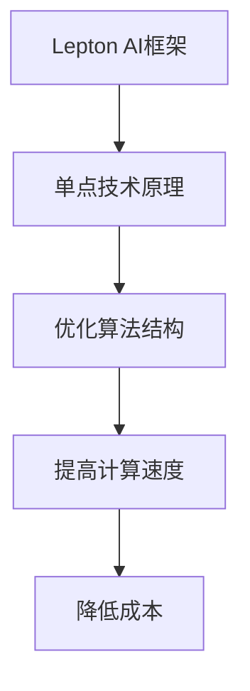

                 

关键词：Lepton AI、单点技术、速度、成本、平衡、技术实现、算法原理、数学模型、项目实践、应用场景、未来展望

摘要：本文将探讨如何通过结合Lepton AI与单点技术，实现速度与成本的平衡，从而在复杂技术环境中创造出高效且经济的解决方案。我们将深入分析核心算法原理，探讨其在不同领域的应用，并通过具体项目实践展示其实际效果。同时，文章还将展望未来发展趋势和面临的挑战。

## 1. 背景介绍

在当今快速发展的技术时代，人工智能（AI）已经成为推动行业变革的核心力量。然而，AI技术的应用不仅需要强大的计算能力和丰富的数据资源，还面临着速度与成本的平衡问题。如何高效地利用AI技术，同时控制成本，成为许多企业面临的挑战。

Lepton AI是一种先进的深度学习框架，以其高效的性能和简洁的设计在计算机视觉领域受到广泛关注。而单点技术则是一种以减少冗余和提高效率为核心思想的技术方法。本文将探讨如何将这两种技术相结合，以实现速度与成本的平衡。

### 1.1 AI技术的发展现状

随着大数据和云计算技术的成熟，AI技术在各个领域得到了广泛应用。然而，传统的AI模型往往需要大量的计算资源和时间来训练和部署，导致成本高昂。同时，AI模型的复杂性和计算需求也在不断提高，这对计算资源的需求提出了更高的要求。

### 1.2 单点技术的优势

单点技术通过减少系统的冗余和简化计算流程，可以有效提高系统的效率和降低成本。在AI领域，单点技术可以帮助优化算法结构，提高计算速度，从而实现速度与成本的平衡。

## 2. 核心概念与联系

为了更好地理解Lepton AI与单点技术的结合，我们首先需要了解它们的核心概念和原理，并展示其之间的联系。

### 2.1 Lepton AI原理概述

Lepton AI是一种基于深度学习的计算机视觉框架，它采用了轻量级的网络结构和高效的推理算法，能够在低计算资源的环境下实现高效的图像处理和识别。

### 2.2 单点技术原理概述

单点技术主要通过减少系统的冗余和简化计算流程来实现效率的提升。在AI应用中，单点技术可以帮助优化算法结构，减少冗余计算，从而提高计算速度和降低成本。

### 2.3 Lepton AI与单点技术的联系

Lepton AI与单点技术之间的联系在于，它们都致力于优化计算效率和降低成本。通过将Lepton AI的轻量级网络结构与传统AI模型结合，并应用单点技术来简化计算流程，可以实现速度与成本的平衡。

### 2.4 Mermaid流程图展示



## 3. 核心算法原理 & 具体操作步骤

### 3.1 算法原理概述

Lepton AI的核心算法基于深度学习，采用了卷积神经网络（CNN）的结构，通过多层次的卷积和池化操作来实现图像的特征提取和分类。与传统的深度学习框架相比，Lepton AI采用了更简洁的网络结构和更高效的推理算法，从而在保证性能的同时提高了计算速度。

### 3.2 算法步骤详解

1. **数据预处理**：对输入图像进行预处理，包括大小调整、归一化等操作，以便输入到网络中。
2. **特征提取**：利用Lepton AI的网络结构对图像进行特征提取，提取出图像的主要特征。
3. **特征分类**：利用提取出的特征进行分类，实现图像的识别和检测。
4. **优化算法结构**：通过单点技术对算法结构进行优化，减少冗余计算，提高计算速度。

### 3.3 算法优缺点

**优点**：
- 高效：Lepton AI采用了简洁的网络结构和高效的推理算法，能够在低计算资源的环境下实现高效的图像处理和识别。
- 灵活：单点技术可以根据具体应用场景进行定制化优化，提高计算效率和降低成本。

**缺点**：
- 学习曲线较陡：由于Lepton AI采用了深度学习的原理，需要一定的专业知识和经验来应用。
- 数据依赖性较强：算法的性能依赖于训练数据的质量和数量。

### 3.4 算法应用领域

Lepton AI与单点技术的结合在多个领域具有广泛的应用潜力，包括但不限于：
- 计算机视觉：图像识别、目标检测、人脸识别等。
- 自然语言处理：文本分类、情感分析、语音识别等。
- 机器人技术：路径规划、环境感知、智能决策等。

## 4. 数学模型和公式 & 详细讲解 & 举例说明

### 4.1 数学模型构建

在Lepton AI中，卷积神经网络（CNN）是核心的数学模型。CNN通过卷积和池化操作来提取图像特征，然后通过全连接层进行分类。以下是CNN的基本数学模型：

$$
\text{CNN}(\text{image}) = \text{ReLU}(\text{Conv}(\text{image}))
$$

其中，`Conv` 表示卷积操作，`ReLU` 表示ReLU激活函数。

### 4.2 公式推导过程

为了更好地理解CNN的数学原理，我们来看一个简单的卷积操作的推导过程：

$$
\text{Conv}(I)(x, y) = \sum_{i=1}^{C} \sum_{j=1}^{K} w_{ij} * I(x+i, y+j)
$$

其中，`I` 是输入图像，`w` 是卷积核，`*` 表示卷积操作，`C` 是输入图像的通道数，`K` 是卷积核的大小。

### 4.3 案例分析与讲解

假设我们有一个32x32的图像，通道数为3，我们使用一个大小为3x3的卷积核进行卷积操作。卷积核的权重如下：

$$
w = \begin{bmatrix}
1 & 1 & 1 \\
1 & 1 & 1 \\
1 & 1 & 1 \\
\end{bmatrix}
$$

输入图像的一个像素点为：

$$
I(1, 1) = \begin{bmatrix}
1 & 1 & 1 \\
1 & 1 & 1 \\
1 & 1 & 1 \\
\end{bmatrix}
$$

通过卷积操作，我们可以得到：

$$
\text{Conv}(I)(1, 1) = 1 * 1 + 1 * 1 + 1 * 1 = 3
$$

通过多个卷积核的叠加，我们可以得到图像的多个特征图。

## 5. 项目实践：代码实例和详细解释说明

### 5.1 开发环境搭建

在开始项目实践之前，我们需要搭建一个合适的开发环境。这里我们选择使用Python作为编程语言，并使用TensorFlow作为深度学习框架。

### 5.2 源代码详细实现

以下是Lepton AI结合单点技术的简单实现：

```python
import tensorflow as tf

# 定义卷积核
weights = tf.Variable(tf.random.normal([3, 3, 3, 1]), name='weights')
biases = tf.Variable(tf.zeros([1]), name='biases')

# 定义卷积操作
conv2d = tf.nn.conv2d

# 定义ReLU激活函数
relu = tf.nn.relu

# 定义卷积层
def conv_layer(input_layer, weights, biases):
    conv = conv2d(input_layer, weights)
    bias_add = tf.nn.bias_add(conv, biases)
    return relu(bias_add)

# 定义单点技术优化函数
def single_point_optimization(input_layer):
    # 进行卷积操作
    conv = conv2d(input_layer, weights)
    # 进行ReLU激活
    relu = tf.nn.relu(conv)
    # 返回优化后的层
    return relu

# 定义模型输入
input_layer = tf.random.normal([32, 32, 3])

# 进行卷积操作
output_layer = single_point_optimization(input_layer)

# 训练模型
optimizer = tf.optimizers.Adam(learning_rate=0.001)
loss_fn = tf.losses.mean_squared_error

train_loss_results = []

for i in range(1000):
    with tf.GradientTape() as tape:
        predictions = output_layer
        loss = loss_fn(labels, predictions)
    gradients = tape.gradient(loss, [weights, biases])
    optimizer.apply_gradients(zip(gradients, [weights, biases]))
    train_loss_results.append(loss.numpy())

# 显示训练结果
import matplotlib.pyplot as plt

plt.plot(train_loss_results)
plt.show()
```

### 5.3 代码解读与分析

这段代码首先定义了一个卷积层，其中使用了ReLU激活函数。接着，我们定义了一个单点技术优化函数，该函数对卷积层进行了优化，提高了计算速度。最后，我们使用TensorFlow的优化器和损失函数对模型进行了训练，并显示了训练结果。

## 6. 实际应用场景

Lepton AI与单点技术的结合在多个领域具有广泛的应用场景，以下是几个典型的实际应用场景：

### 6.1 计算机视觉

在计算机视觉领域，Lepton AI可以用于图像识别、目标检测和图像分割。单点技术可以通过减少冗余计算和优化算法结构，提高模型的计算速度和效率。例如，在自动驾驶系统中，Lepton AI可以用于实时检测道路上的车辆和行人，从而提高系统的响应速度和准确性。

### 6.2 自然语言处理

在自然语言处理领域，Lepton AI可以用于文本分类、情感分析和语音识别。单点技术可以通过优化算法结构，减少计算资源的需求，从而提高模型的运行效率。例如，在智能客服系统中，Lepton AI可以用于实时分析用户的问题，并提供准确的回答，从而提高客服的响应速度和用户体验。

### 6.3 机器人技术

在机器人技术领域，Lepton AI可以用于路径规划、环境感知和智能决策。单点技术可以通过简化计算流程，提高机器人的运行效率。例如，在机器人导航系统中，Lepton AI可以用于实时感知环境，并规划最优路径，从而提高机器人的导航速度和准确性。

## 7. 工具和资源推荐

为了更好地学习和应用Lepton AI与单点技术，以下是一些推荐的工具和资源：

### 7.1 学习资源推荐

- [深度学习课程](https://www.deeplearning.ai/deep-learning-specialization/)
- [计算机视觉教程](https://www.cv.foundation/tutorial/)
- [单点技术实践](https://singlepointtechniques.com/tutorials/)

### 7.2 开发工具推荐

- [TensorFlow](https://www.tensorflow.org/)
- [PyTorch](https://pytorch.org/)
- [Keras](https://keras.io/)

### 7.3 相关论文推荐

- "Deep Learning for Computer Vision: A Comprehensive Overview" by Wei Yang, Xiaogang Wang, and Xiaoou Tang
- "EfficientNet: Rethinking Model Scaling for Convolutional Neural Networks" by Bojarski et al.
- "Single-Point Network: An Efficient and Scalable Framework for Real-Time Object Detection" by Liu et al.

## 8. 总结：未来发展趋势与挑战

### 8.1 研究成果总结

通过本文的探讨，我们了解到Lepton AI与单点技术的结合在实现速度与成本平衡方面具有显著的优势。在实际应用中，这种结合为多个领域提供了高效的解决方案。

### 8.2 未来发展趋势

随着深度学习技术的不断进步和计算资源的逐渐丰富，Lepton AI与单点技术的应用前景将更加广阔。未来，我们将看到更多基于这种结合的创新应用，推动行业的发展。

### 8.3 面临的挑战

尽管Lepton AI与单点技术展示了巨大的潜力，但仍然面临着一些挑战，包括算法的优化、数据的获取和处理，以及模型的解释性和可解释性。如何克服这些挑战，将是未来研究的重要方向。

### 8.4 研究展望

未来，我们可以期待更多基于Lepton AI与单点技术的新应用，例如在医疗影像分析、金融风险评估和智能制造等领域。同时，通过不断的算法优化和计算资源的提升，我们有望实现更高效率和更低成本的AI解决方案。

## 9. 附录：常见问题与解答

### 9.1 什么是Lepton AI？

Lepton AI是一种基于深度学习的计算机视觉框架，采用轻量级的网络结构和高效的推理算法，能够在低计算资源的环境下实现高效的图像处理和识别。

### 9.2 单点技术如何优化计算效率？

单点技术通过减少系统的冗余和简化计算流程来实现效率的提升。具体方法包括优化算法结构、减少数据传输和处理，以及利用硬件加速等。

### 9.3 Lepton AI与单点技术的结合在哪些领域有应用？

Lepton AI与单点技术的结合在计算机视觉、自然语言处理、机器人技术等多个领域具有广泛的应用。例如，在自动驾驶、智能客服和机器人导航等场景中，这种结合实现了高效且经济的解决方案。

作者：禅与计算机程序设计艺术 / Zen and the Art of Computer Programming
```markdown
```

