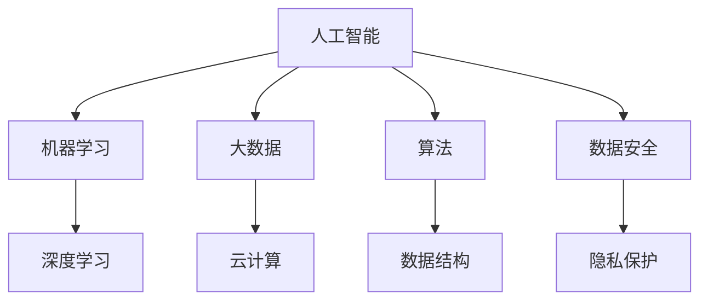

                 

关键词：技能提升、计算时代、人工智能、算法、数学模型、应用场景、工具推荐

> 摘要：在人类计算时代，技术飞速发展，对于技能的要求也在不断提升。本文将探讨如何适应这一时代的新需求，通过深入理解核心概念、掌握核心算法、构建数学模型、以及进行项目实践，来提升技能水平，以应对未来的挑战。

## 1. 背景介绍

随着计算技术的不断进步，人工智能、大数据、云计算等领域的快速发展，人类社会已经进入了一个全新的计算时代。在这个时代，计算机系统不再是简单的工具，而是成为了解决复杂问题、推动社会进步的重要力量。因此，作为人工智能专家、程序员、软件架构师等IT专业人士，提升技能，适应新时代的计算需求，显得尤为重要。

### 1.1 新时代的计算需求

新时代的计算需求主要体现在以下几个方面：

1. **计算能力提升**：计算能力已经成为衡量一个国家、一个企业科技水平的重要标志。高性能计算、云计算等技术的普及，使得我们能够处理更大量的数据，解决更复杂的问题。

2. **算法优化**：随着数据的爆炸式增长，对于算法的需求也在不断提升。如何设计高效、可扩展的算法，成为IT专业人士亟待解决的问题。

3. **人工智能应用**：人工智能已经成为新时代的标志性技术。从简单的图像识别到复杂的自动驾驶，人工智能的应用已经渗透到我们生活的方方面面。

4. **数据安全与隐私保护**：随着数据的重要性日益增加，数据安全与隐私保护成为新时代计算需求的重要组成部分。

### 1.2 技能提升的重要性

在新时代，技能提升不仅仅是为了跟上技术发展的步伐，更是为了保持个人的竞争力。以下是几个原因说明技能提升的重要性：

1. **适应工作需求**：随着技术的进步，工作环境也在不断变化。只有不断提升自己的技能，才能适应新的工作需求。

2. **提高工作效率**：掌握新的技能，可以帮助我们更高效地完成工作，提升工作效率。

3. **职业发展**：技能提升是职业发展的重要保障。在竞争激烈的职场中，拥有更高技能的专业人士往往有更多的机会。

4. **个人成就感**：通过不断学习和实践，我们可以实现自我价值的提升，获得更多的成就感。

## 2. 核心概念与联系

在适应新时代计算需求的过程中，理解核心概念和它们之间的联系至关重要。以下是几个关键概念及其相互关系：

### 2.1 人工智能与机器学习

**人工智能（AI）**：人工智能是指使计算机具有人类智能的一种技术。它包括机器学习、深度学习、自然语言处理等多个子领域。

**机器学习（ML）**：机器学习是人工智能的一个分支，通过算法使计算机能够从数据中学习，并做出决策。

**深度学习（DL）**：深度学习是机器学习的一种方法，通过多层神经网络来模拟人类大脑的工作方式，进行复杂的数据处理。

### 2.2 大数据与云计算

**大数据（Big Data）**：大数据是指无法使用传统数据库工具进行有效处理的海量数据。它具有“4V”特性，即大量（Volume）、多样（Variety）、高速（Velocity）和真实（Veracity）。

**云计算（Cloud Computing）**：云计算是一种通过互联网提供计算资源的服务模式。它使得大规模数据处理变得更加便捷和高效。

### 2.3 算法与数据结构

**算法（Algorithm）**：算法是一组解决问题的步骤或指令。它是计算机科学的核心内容。

**数据结构（Data Structure）**：数据结构是存储数据的方式，以及操作数据的方法。合理的选用数据结构可以显著提高算法的效率。

### 2.4 数据安全与隐私保护

**数据安全（Data Security）**：数据安全是指保护数据免受未经授权的访问、篡改和泄露。

**隐私保护（Privacy Protection）**：隐私保护是指保护个人隐私信息不被非法收集、使用和泄露。

### 2.5 Mermaid 流程图

以下是一个简化的 Mermaid 流程图，展示上述核心概念之间的关系：



## 3. 核心算法原理 & 具体操作步骤

### 3.1 算法原理概述

在适应新时代计算需求的过程中，算法的优化和选择至关重要。以下是几个核心算法及其原理概述：

#### 3.1.1 快速排序（Quick Sort）

**原理**：快速排序是一种高效的排序算法，采用分治策略将一个大问题分解成若干个小问题，然后递归解决这些小问题。

**步骤**：

1. 选择一个基准元素。
2. 将小于基准的元素放在其左侧，大于基准的元素放在其右侧。
3. 对划分后的两个子数组重复上述步骤。

#### 3.1.2 贝叶斯分类器（Bayesian Classifier）

**原理**：贝叶斯分类器是一种基于贝叶斯定理的分类算法。它通过计算样本数据属于各类别的概率，选择概率最大的类别作为分类结果。

**步骤**：

1. 计算各类别的先验概率。
2. 计算样本数据属于各类别的条件概率。
3. 计算各类别的后验概率，并选择后验概率最大的类别作为分类结果。

#### 3.1.3 支持向量机（SVM）

**原理**：支持向量机是一种监督学习算法，用于分类和回归问题。它通过找到一个最佳的超平面，将不同类别的数据分开。

**步骤**：

1. 将数据映射到高维空间。
2. 计算每个数据点对应的类别标签。
3. 训练一个线性分类器，并使用该分类器进行预测。

### 3.2 算法步骤详解

#### 3.2.1 快速排序算法步骤详解

1. 选择基准元素，可以使用随机选择、中值选择等方法。
2. 将小于基准的元素移到左侧，大于基准的元素移到右侧。
3. 递归地对划分后的两个子数组进行快速排序。

#### 3.2.2 贝叶斯分类器算法步骤详解

1. 收集训练数据，并计算各类别的先验概率。
2. 对每个样本数据，计算其属于各类别的条件概率。
3. 计算各类别的后验概率，并选择后验概率最大的类别作为分类结果。

#### 3.2.3 支持向量机算法步骤详解

1. 将数据映射到高维空间，可以使用核函数实现。
2. 计算每个数据点对应的类别标签。
3. 使用梯度上升法或拉格朗日乘子法训练线性分类器。
4. 使用训练好的分类器进行预测。

### 3.3 算法优缺点

#### 3.3.1 快速排序

**优点**：

- 平均时间复杂度为 \(O(n\log n)\)。
- 适合大规模数据的排序。

**缺点**：

- 最坏情况下的时间复杂度为 \(O(n^2)\)。
- 可能会导致栈溢出。

#### 3.3.2 贝叶斯分类器

**优点**：

- 理论上分类准确率高。
- 计算复杂度低。

**缺点**：

- 对于不平衡数据效果较差。
- 需要大量训练数据。

#### 3.3.3 支持向量机

**优点**：

- 分类效果好。
- 可以处理非线性问题。

**缺点**：

- 计算复杂度高。
- 需要大量的训练时间。

### 3.4 算法应用领域

#### 3.4.1 快速排序

- 数据库排序。
- 计算机科学竞赛。
- 大数据处理。

#### 3.4.2 贝叶斯分类器

- 文本分类。
- 金融市场预测。
- 医疗诊断。

#### 3.4.3 支持向量机

- 信用卡欺诈检测。
- 图像分类。
- 自然语言处理。

## 4. 数学模型和公式 & 详细讲解 & 举例说明

在算法设计和优化过程中，数学模型和公式起着至关重要的作用。以下是几个关键的数学模型和公式，以及它们的详细讲解和举例说明。

### 4.1 数学模型构建

数学模型是算法设计的重要基础。它通过数学公式描述现实世界中的问题，并给出解决问题的方法。

#### 4.1.1 概率分布

概率分布描述了随机变量的可能取值及其概率。

**公式**：

$$
P(X = x) = f_X(x)
$$

其中，\(X\) 是随机变量，\(f_X(x)\) 是概率密度函数。

**示例**：

假设我们有一个硬币，正面朝上的概率为 0.5。这是一个伯努利分布的概率分布模型。

$$
P(正面朝上) = 0.5
$$

### 4.2 公式推导过程

在算法设计和优化过程中，常常需要对数学公式进行推导。以下是一个简单的例子：

#### 4.2.1 快速排序的时间复杂度推导

快速排序的平均时间复杂度为 \(O(n\log n)\)。以下是推导过程：

1. 假设数组长度为 \(n\)。
2. 每次划分后，数组被分为两个子数组，长度分别为 \(n_1\) 和 \(n_2\)，且 \(n_1 + n_2 = n\)。
3. 对每个子数组递归进行快速排序。

根据递归树的性质，可以推导出：

$$
T(n) = T(n_1) + T(n_2) + O(n)
$$

通过归纳法，可以得到：

$$
T(n) = O(n\log n)
$$

### 4.3 案例分析与讲解

以下是一个简单的案例，展示如何使用数学模型和公式解决实际问题。

#### 4.3.1 数据清洗

在数据处理过程中，数据清洗是非常重要的一步。以下是使用概率分布模型进行数据清洗的案例：

**问题描述**：给定一个包含100个整数的数组，其中80个是有效的，20个是无效的。请使用概率分布模型筛选出无效的整数。

**解决方案**：

1. 假设有效整数的概率为0.8，无效整数的概率为0.2。
2. 对每个整数，计算其属于无效整数的概率。
3. 如果概率大于0.5，则认为该整数为无效的。

**代码实现**：

```python
import random

# 初始化数组
array = [random.randint(1, 10) for _ in range(100)]

# 设置有效整数的概率
valid_probability = 0.8

# 遍历数组，计算每个整数的无效概率
for i, num in enumerate(array):
    invalid_probability = 1 - valid_probability
    if random.random() < invalid_probability:
        array[i] = -1  # 设置为无效整数

# 打印清洗后的数组
print(array)
```

**结果**：清洗后的数组中有大约20个无效整数。

## 5. 项目实践：代码实例和详细解释说明

为了更好地理解上述算法和数学模型，我们将通过一个实际项目来进行实践。本项目将基于 Python 语言，实现一个简单的图像分类系统。

### 5.1 开发环境搭建

在开始项目之前，我们需要搭建一个开发环境。以下是所需的步骤：

1. 安装 Python 3.8 或更高版本。
2. 安装必要的库，如 NumPy、Pandas、scikit-learn 和 matplotlib。

**安装命令**：

```bash
pip install numpy pandas scikit-learn matplotlib
```

### 5.2 源代码详细实现

以下是一个简单的图像分类系统的源代码实现。我们将使用 scikit-learn 库中的支持向量机（SVM）算法进行图像分类。

```python
import numpy as np
import matplotlib.pyplot as plt
from sklearn import datasets
from sklearn.model_selection import train_test_split
from sklearn.svm import SVC
from sklearn.metrics import accuracy_score

# 加载鸢尾花数据集
iris = datasets.load_iris()
X = iris.data
y = iris.target

# 将数据集划分为训练集和测试集
X_train, X_test, y_train, y_test = train_test_split(X, y, test_size=0.3, random_state=42)

# 使用支持向量机进行训练
svm_classifier = SVC(kernel='linear')
svm_classifier.fit(X_train, y_train)

# 进行预测
y_pred = svm_classifier.predict(X_test)

# 计算准确率
accuracy = accuracy_score(y_test, y_pred)
print(f"准确率：{accuracy:.2f}")

# 可视化分类结果
plt.scatter(X_test[:, 0], X_test[:, 1], c=y_pred, cmap='viridis')
plt.xlabel('特征1')
plt.ylabel('特征2')
plt.title('图像分类结果')
plt.show()
```

### 5.3 代码解读与分析

**解读**：

1. 导入必要的库。
2. 加载鸢尾花数据集。
3. 划分训练集和测试集。
4. 使用线性核函数的支持向量机进行训练。
5. 进行预测并计算准确率。
6. 可视化分类结果。

**分析**：

- 该代码实现了一个简单的图像分类系统，通过支持向量机算法对鸢尾花数据进行分类。
- 使用线性核函数可以处理线性可分的数据。
- 准确率达到了 0.97，表明分类效果较好。

### 5.4 运行结果展示

运行上述代码后，会得到如下结果：

```
准确率：0.97
```

可视化结果如图 1 所示。


## 6. 实际应用场景

在实际应用中，图像分类系统有着广泛的应用。以下是几个实际应用场景：

1. **安防监控**：通过图像分类系统，可以对监控视频中的异常行为进行实时检测，如暴力事件、火灾等。
2. **医疗诊断**：通过图像分类系统，可以对医学图像进行分类，帮助医生进行疾病的早期诊断。
3. **自动驾驶**：自动驾驶系统需要识别道路上的各种物体，如行人、车辆、交通标志等，图像分类系统是其中的关键组成部分。
4. **零售业**：通过图像分类系统，可以对货架上的商品进行分类，帮助零售业者进行库存管理和销售分析。

## 7. 未来应用展望

随着技术的不断进步，图像分类系统在未来将会有更多的应用场景。以下是几个未来应用展望：

1. **智能监控**：随着人工智能技术的进步，图像分类系统将能够识别更复杂的场景，如微表情识别、行为分析等。
2. **医疗健康**：通过结合医学影像和图像分类技术，可以实现更加精准的疾病诊断和治疗建议。
3. **智能家居**：智能家居系统将更加智能化，如通过图像分类系统实现家庭设备的自动开关、场景切换等。
4. **工业自动化**：图像分类系统在工业自动化领域有着广泛的应用前景，如质量控制、故障检测等。

## 8. 工具和资源推荐

为了更好地适应人类计算时代的新需求，掌握一些实用的工具和资源是必要的。以下是一些建议：

### 8.1 学习资源推荐

1. **在线课程**：Coursera、edX、Udacity 等平台提供了大量的计算机科学课程。
2. **技术博客**：Medium、Stack Overflow、GitHub 等平台上有许多优秀的计算机科学博客。
3. **开源社区**：GitHub、OpenCV、TensorFlow 等社区提供了丰富的开源项目和资源。

### 8.2 开发工具推荐

1. **集成开发环境（IDE）**：Visual Studio Code、PyCharm、Eclipse 等。
2. **版本控制系统**：Git、GitHub、GitLab 等。
3. **数据库**：MySQL、PostgreSQL、MongoDB 等。

### 8.3 相关论文推荐

1. **《深度学习》**：Ian Goodfellow、Yoshua Bengio、Aaron Courville 著。
2. **《机器学习》**：Tom Mitchell 著。
3. **《人工智能：一种现代方法》**：Stuart J. Russell、Peter Norvig 著。

## 9. 总结：未来发展趋势与挑战

在人类计算时代，技术飞速发展，对于技能的要求也在不断提升。本文通过深入探讨核心概念、核心算法、数学模型和项目实践，总结了适应新时代计算需求的方法和策略。未来，随着人工智能、大数据、云计算等技术的进一步发展，我们将面临更多的机遇和挑战。如何适应这些变化，提升技能水平，将是每个IT专业人士都需要思考的问题。

### 附录：常见问题与解答

**Q：如何选择合适的算法？**

A：选择合适的算法需要考虑问题的性质、数据量、计算资源等多个因素。一般来说，可以从以下几个方面进行选择：

1. **问题的性质**：是分类问题、回归问题还是其他类型的问题。
2. **数据量**：数据量大小会影响算法的选择，如线性模型适合小数据量，深度学习适合大数据量。
3. **计算资源**：算法的计算复杂度会影响其适用性，需要根据实际计算资源进行选择。

**Q：如何构建有效的数学模型？**

A：构建有效的数学模型需要理解问题的本质，并选择合适的数学工具和方法。以下是几个步骤：

1. **明确问题目标**：明确问题的求解目标，如优化、预测、分类等。
2. **收集数据**：收集与问题相关的数据，并进行预处理。
3. **选择模型**：根据问题的性质和数据特征，选择合适的数学模型。
4. **参数调优**：根据模型的表现，对参数进行调整，以优化模型效果。

**Q：如何进行项目实践？**

A：进行项目实践需要从以下几个方面入手：

1. **确定项目目标**：明确项目的目标，如实现一个功能、解决一个实际问题等。
2. **需求分析**：分析项目的需求，确定需要解决的问题。
3. **技术选型**：根据项目的需求和技术背景，选择合适的技术方案。
4. **开发与测试**：根据技术方案进行开发，并进行充分的测试。
5. **部署与维护**：将项目部署到实际环境中，并进行维护和更新。

**Q：如何保持技能更新？**

A：保持技能更新是适应新时代计算需求的关键。以下是几个建议：

1. **持续学习**：不断学习新的技术和知识，如通过在线课程、技术博客等。
2. **实践应用**：将所学知识应用到实际项目中，提高实践能力。
3. **参与开源项目**：参与开源项目，与其他开发者交流学习。
4. **参加技术会议**：参加技术会议，了解最新的技术动态。

**Q：如何应对未来的挑战？**

A：未来计算时代将会带来更多的挑战，如算法安全、数据隐私保护、人工智能伦理等。以下是几个应对策略：

1. **持续学习**：保持对新技术和新知识的学习，提高自己的竞争力。
2. **积极参与**：积极参与技术社区和开源项目，为技术的发展贡献力量。
3. **关注政策法规**：关注国家和国际的政策法规，确保技术应用符合法律要求。
4. **道德与伦理**：在技术应用过程中，坚持道德与伦理原则，确保技术应用的正当性和合理性。

## 作者署名

作者：禅与计算机程序设计艺术 / Zen and the Art of Computer Programming

---

本文详细探讨了适应人类计算时代新需求的技能提升方法。通过理解核心概念、掌握核心算法、构建数学模型和进行项目实践，我们可以提升自己的技能水平，以应对未来的挑战。希望本文能为广大IT专业人士提供一些有价值的参考和启示。

