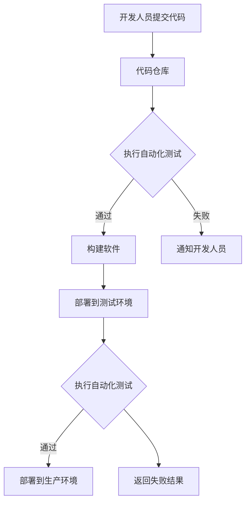

                 

持续集成（Continuous Integration，简称CI）与持续交付（Continuous Delivery，简称CD）是现代软件开发中不可或缺的两个核心实践。它们不仅提高了软件开发的效率和质量，还缩短了软件交付周期。本文将深入探讨持续集成与持续交付的最佳实践，帮助读者理解其核心概念、优势、实施步骤以及面临的挑战。

## 关键词

持续集成，持续交付，软件开发，效率，质量，自动化，容器化，DevOps

## 摘要

本文旨在为软件开发团队提供持续集成与持续交付的最佳实践指南。我们将首先介绍CI和CD的背景和核心概念，然后讨论它们的实现步骤、关键组件和工具。此外，本文还将探讨CI/CD在实际项目中的应用案例，以及未来发展趋势和面临的挑战。

## 1. 背景介绍

持续集成与持续交付的概念起源于敏捷开发方法，旨在通过不断集成和交付软件来提高开发效率和产品质量。持续集成强调开发人员频繁地将代码集成到共享的代码库中，并通过自动化测试确保新代码不会破坏现有功能。持续交付则进一步扩展了持续集成的理念，通过自动化测试、部署和发布流程，确保软件可以随时交付给用户。

### 1.1 持续集成

持续集成（CI）是一种软件开发实践，旨在通过频繁地将代码集成到共享代码库中，确保软件在开发过程中保持一致性。CI的核心目标是尽早发现并解决代码冲突和缺陷，从而提高软件质量和开发效率。

### 1.2 持续交付

持续交付（CD）是持续集成（CI）的延伸，它强调通过自动化测试、部署和发布流程，确保软件可以在任何时间、任何环境下交付给用户。CD的目标是缩短软件交付周期，提高交付质量和用户体验。

## 2. 核心概念与联系

### 2.1 DevOps

DevOps是一种软件开发和运维文化、方法和实践，旨在通过加强开发和运维团队的协作，提高软件交付效率和可靠性。DevOps的核心原则包括自动化、监控、协作和反馈。

### 2.2 持续集成与持续交付的关系

持续集成是持续交付的基础，通过CI，开发人员可以确保代码质量，减少集成冲突和缺陷。而持续交付则通过自动化流程，将CI的成果转化为可交付的软件产品。两者共同目标是提高软件质量和交付效率。

### 2.3 Mermaid 流程图

下面是一个简化的持续集成与持续交付流程的Mermaid流程图：



## 3. 核心算法原理 & 具体操作步骤

### 3.1 算法原理概述

持续集成与持续交付的核心算法原理在于自动化和持续反馈。开发人员提交代码后，自动化测试会立即执行，确保代码质量。如果测试通过，软件将构建并部署到测试或生产环境；如果测试失败，开发人员会立即收到通知，以便快速修复问题。

### 3.2 算法步骤详解

1. 开发人员将代码提交到代码仓库。
2. 持续集成服务器获取最新代码。
3. 执行自动化构建脚本，构建软件。
4. 运行单元测试和集成测试，确保代码质量。
5. 如果测试通过，部署软件到测试环境。
6. 在测试环境中执行自动化测试，确保功能正常。
7. 如果测试通过，部署软件到生产环境。
8. 在生产环境中执行自动化测试，确保软件稳定运行。
9. 如果测试失败，返回失败结果，通知开发人员。

### 3.3 算法优缺点

**优点：**
- 提高代码质量和开发效率。
- 缩短软件交付周期。
- 减少集成冲突和缺陷。
- 提高团队协作和沟通。

**缺点：**
- 需要一定的技术投入和维护成本。
- 可能增加测试环境的复杂度。

### 3.4 算法应用领域

持续集成与持续交付广泛应用于各种类型的软件开发项目，包括Web应用、移动应用、桌面应用和嵌入式系统等。

## 4. 数学模型和公式 & 详细讲解 & 举例说明

### 4.1 数学模型构建

持续集成与持续交付的关键数学模型是缺陷发现模型，它用于预测在给定时间周期内发现缺陷的概率。该模型基于泊松分布，公式如下：

$$
P(X = k) = \frac{e^{-\lambda} \lambda^k}{k!}
$$

其中，\(P(X = k)\) 表示在时间周期 \(T\) 内发现 \(k\) 个缺陷的概率，\(\lambda\) 表示缺陷发生率。

### 4.2 公式推导过程

缺陷发现模型的推导过程如下：

1. 假设每个缺陷的发生时间是独立的。
2. 设定每个缺陷的平均发生时间为 \(\mu\)，则缺陷发生率为 \(\lambda = \frac{1}{\mu}\)。
3. 在时间周期 \(T\) 内，缺陷发生的次数 \(X\) 服从泊松分布。
4. 根据泊松分布的定义，有：

$$
P(X = k) = \frac{e^{-\lambda T} (\lambda T)^k}{k!}
$$

5. 令 \(\lambda = \frac{1}{\mu}\)，则得到：

$$
P(X = k) = \frac{e^{-\frac{T}{\mu}} (\frac{T}{\mu})^k}{k!}
$$

### 4.3 案例分析与讲解

假设一个软件开发项目在每次迭代后进行自动化测试，平均每个迭代发现 3 个缺陷。若项目持续 6 个月，平均迭代周期为 2 周，问在项目结束时，发现 10 个缺陷的概率是多少？

根据题意，\(\mu = 3\)，\(T = 6\) 个月 = 24 周，则：

$$
\lambda = \frac{1}{\mu} = \frac{1}{3}
$$

代入公式：

$$
P(X = 10) = \frac{e^{-\frac{24}{3}} (\frac{24}{3})^{10}}{10!} \approx 0.028
$$

因此，在项目结束时，发现 10 个缺陷的概率约为 2.8%。

## 5. 项目实践：代码实例和详细解释说明

### 5.1 开发环境搭建

在本节中，我们将使用Jenkins作为持续集成服务器，Docker作为容器化技术，Git作为版本控制系统。以下是搭建开发环境的步骤：

1. 安装Jenkins：在服务器上安装Jenkins，并配置Jenkins插件。
2. 安装Docker：在服务器上安装Docker，并配置Docker守护进程。
3. 配置Git：在服务器上配置Git，以便从代码仓库获取代码。

### 5.2 源代码详细实现

在本节中，我们将使用一个简单的Web应用作为示例，展示如何实现持续集成与持续交付。

1. 初始化Git仓库：在本地计算机上创建一个Git仓库，将Web应用源代码推送到服务器上的Git仓库。
2. 配置Jenkins：在Jenkins中创建一个新项目，配置Git仓库地址和构建触发器（例如，每次提交代码时触发构建）。
3. 编写构建脚本：编写一个Shell脚本，用于执行以下操作：

```shell
# 获取最新代码
git pull origin master

# 安装依赖
npm install

# 运行单元测试
npm test

# 构建Docker镜像
docker build -t myapp .

# 运行集成测试
docker run --name testcontainer myapp

# 删除测试容器
docker rm testcontainer

# 部署到测试环境
docker push myapp

# 删除Docker镜像
docker rmi myapp
```

4. 配置测试环境：在测试环境中配置Docker镜像，以便执行集成测试和部署。

### 5.3 代码解读与分析

在本节中，我们将分析构建脚本中的关键代码，并解释它们的作用。

```shell
# 获取最新代码
git pull origin master
```

此行代码用于从Git仓库获取最新代码。

```shell
# 安装依赖
npm install
```

此行代码用于安装项目依赖的Node.js模块。

```shell
# 运行单元测试
npm test
```

此行代码用于运行项目中的单元测试。

```shell
# 构建Docker镜像
docker build -t myapp .
```

此行代码用于构建Docker镜像，将Web应用打包为容器镜像。

```shell
# 运行集成测试
docker run --name testcontainer myapp
```

此行代码用于在容器中运行集成测试。

```shell
# 删除测试容器
docker rm testcontainer
```

此行代码用于删除测试容器。

```shell
# 部署到测试环境
docker push myapp
```

此行代码用于将Docker镜像推送到Docker Hub，以便在测试环境中部署。

```shell
# 删除Docker镜像
docker rmi myapp
```

此行代码用于删除构建完成的Docker镜像。

### 5.4 运行结果展示

在Jenkins中，我们可以查看构建结果和测试报告。如果构建成功并通过测试，Jenkins将自动部署Docker镜像到测试环境。如果测试失败，Jenkins将通知开发人员，以便他们修复问题并重新构建。

## 6. 实际应用场景

持续集成与持续交付在实际项目中具有广泛的应用，以下是一些典型的应用场景：

1. **Web应用开发**：通过持续集成和持续交付，Web应用开发团队可以确保代码质量，缩短交付周期，提高用户体验。
2. **移动应用开发**：持续集成和持续交付有助于移动应用开发团队在多平台环境下确保软件质量和稳定性。
3. **云计算和容器化**：持续集成与持续交付在云计算和容器化环境中发挥着重要作用，有助于实现自动化部署和管理。

## 7. 工具和资源推荐

### 7.1 学习资源推荐

1. 《持续交付：发布可靠软件的系统化方法》（Jez Humble & David Farley 著）
2. 《Jenkins持续集成实战》（蒋德荣 著）
3. 《Docker实战》（Jason Pollastrini & Alex Williams 著）

### 7.2 开发工具推荐

1. Jenkins：一款功能强大的持续集成服务器，支持多种插件和自动化流程。
2. Docker：一款流行的容器化技术，用于构建、部署和管理容器化应用。
3. Git：一款分布式版本控制系统，用于管理代码仓库和版本历史。

### 7.3 相关论文推荐

1. "Continuous Integration in the Agile World"（敏捷开发中的持续集成）
2. "The Art of Continuous Delivery"（持续交付的艺术）
3. "Containerization and Continuous Delivery"（容器化和持续交付）

## 8. 总结：未来发展趋势与挑战

### 8.1 研究成果总结

持续集成与持续交付在软件开发领域取得了显著成果，包括提高代码质量、缩短交付周期、提高团队协作和沟通等。然而，随着技术发展和项目需求的多样化，持续集成与持续交付仍面临诸多挑战。

### 8.2 未来发展趋势

1. **智能化**：持续集成与持续交付将向智能化方向发展，利用机器学习和人工智能技术实现更智能的代码审查、测试和部署。
2. **云原生**：持续集成与持续交付将更好地适应云原生环境，支持多云和混合云部署。
3. **容器化**：容器化技术将继续发展，推动持续集成与持续交付的广泛应用。

### 8.3 面临的挑战

1. **技术复杂度**：持续集成与持续交付的实施和维护需要一定的技术投入，对团队的技术能力提出更高要求。
2. **安全性和合规性**：在持续集成与持续交付过程中，确保软件安全和合规性是一个重要挑战。
3. **团队协作**：持续集成与持续交付需要跨职能团队的紧密协作，提高团队协作效率是一个长期任务。

### 8.4 研究展望

持续集成与持续交付在未来将面临更多机遇和挑战。通过技术创新和团队协作，持续集成与持续交付将继续提高软件开发的效率和质量，为软件产业的可持续发展贡献力量。

## 9. 附录：常见问题与解答

### 9.1 持续集成与持续交付的区别是什么？

持续集成（CI）是指开发人员频繁地将代码集成到共享代码库中，并通过自动化测试确保代码质量。持续交付（CD）则强调通过自动化流程，确保软件可以在任何时间、任何环境下交付给用户。简而言之，CI关注代码质量和集成过程，而CD关注软件交付和用户体验。

### 9.2 持续集成与持续交付需要哪些工具？

持续集成与持续交付需要多种工具的支持，包括持续集成服务器（如Jenkins、Travis CI）、容器化技术（如Docker）、版本控制系统（如Git）和自动化测试工具（如JUnit、Selenium等）。此外，还需要适当的开发环境和基础设施。

### 9.3 如何在项目中实施持续集成与持续交付？

在项目中实施持续集成与持续交付需要以下步骤：

1. 确定项目需求和目标，明确持续集成与持续交付的目标和范围。
2. 选择合适的工具和平台，搭建开发环境和基础设施。
3. 编写和配置构建脚本、测试脚本和部署脚本，实现自动化流程。
4. 对团队成员进行培训，提高团队的技术能力和协作效率。
5. 逐步推广持续集成与持续交付实践，持续优化流程和工具。

### 9.4 持续集成与持续交付的优势是什么？

持续集成与持续交付的优势包括：

1. 提高代码质量：通过自动化测试，确保代码质量，减少缺陷和冲突。
2. 缩短交付周期：通过自动化流程，缩短软件开发和交付周期，提高开发效率。
3. 提高团队协作：加强开发和运维团队的协作，提高团队沟通和协作效率。
4. 提高用户体验：通过持续交付，确保软件可以随时交付给用户，提高用户体验。

### 9.5 持续集成与持续交付面临哪些挑战？

持续集成与持续交付面临以下挑战：

1. 技术复杂度：需要一定的技术投入和维护成本，对团队的技术能力提出更高要求。
2. 安全性和合规性：确保软件安全和合规性是一个重要挑战。
3. 团队协作：持续集成与持续交付需要跨职能团队的紧密协作，提高团队协作效率是一个长期任务。
4. 项目管理：需要合理安排资源和时间，确保持续集成与持续交付的顺利实施。

### 9.6 如何评估持续集成与持续交付的效果？

评估持续集成与持续交付的效果可以从以下几个方面进行：

1. 代码质量：通过缺陷率、测试覆盖率等指标评估代码质量。
2. 交付周期：通过交付周期、构建时间等指标评估开发效率。
3. 团队协作：通过团队沟通、协作效率等指标评估团队协作情况。
4. 用户反馈：通过用户满意度、故障率等指标评估软件质量和用户体验。

### 9.7 如何应对持续集成与持续交付的挑战？

应对持续集成与持续交付的挑战可以从以下几个方面进行：

1. 提高团队技术能力：通过培训、实践等方式提高团队的技术能力。
2. 加强团队协作：通过沟通、协作工具等方式加强团队协作。
3. 优化流程和工具：持续优化持续集成与持续交付的流程和工具，提高效率。
4. 引入最佳实践：借鉴业界最佳实践，提高持续集成与持续交付的实施效果。

---

本文详细介绍了持续集成与持续交付的最佳实践，包括其核心概念、原理、实现步骤、工具选择和实际应用。通过本文，读者可以深入了解持续集成与持续交付的原理和应用，为实际项目提供有益的指导。随着技术的发展和项目的需求，持续集成与持续交付将继续为软件开发带来更多价值。作者：禅与计算机程序设计艺术 / Zen and the Art of Computer Programming
----------------------------------------------------------------

