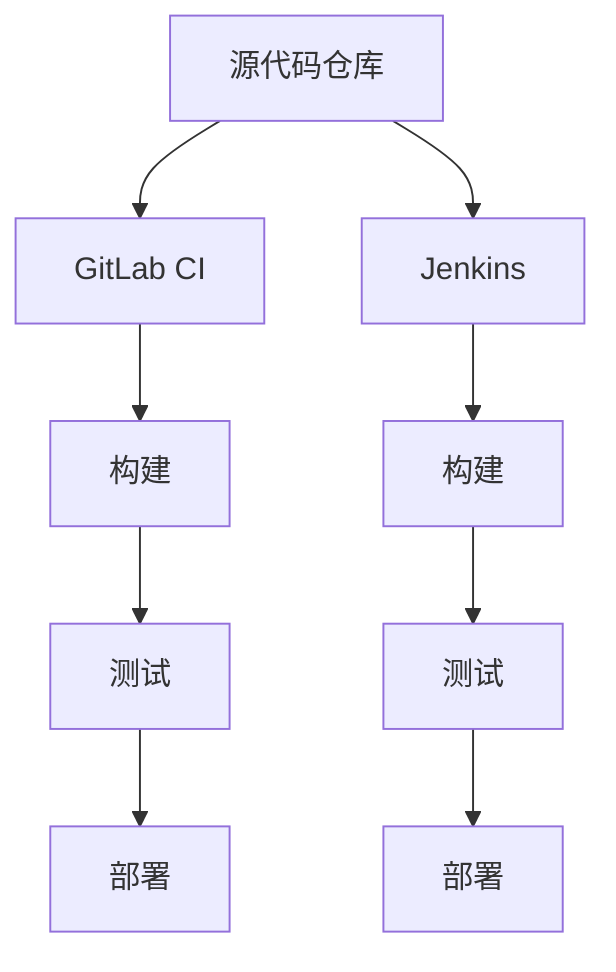

                 

关键词：持续集成，CI，Jenkins，GitLab CI，软件开发，自动化，DevOps，持续交付。

摘要：本文将深入探讨持续集成（Continuous Integration，CI）在软件工程中的应用，特别是Jenkins和GitLab CI这两个CI服务器的特点、原理和实践。文章将从背景介绍、核心概念与联系、核心算法原理与操作步骤、数学模型和公式、项目实践、实际应用场景、未来应用展望等多个方面进行全面剖析，为读者提供全面的技术参考。

## 1. 背景介绍

在软件开发过程中，持续集成是一种软件开发实践，旨在通过频繁地将代码合并到主干分支来确保代码库的稳定性。CI服务器是持续集成实践的核心组成部分，负责执行构建、测试和部署等任务。随着DevOps文化的兴起，CI服务器在软件工程中的作用越来越重要。

Jenkins和GitLab CI是目前市场上最流行的两个CI服务器。Jenkins是一个开源的自动化工具，拥有丰富的插件和扩展能力；GitLab CI是GitLab平台内置的持续集成工具，具有简单易用和集成性强的特点。

本文将首先介绍Jenkins和GitLab CI的背景和原理，然后详细探讨它们的配置和使用方法，最后分析它们在实际项目中的应用和未来发展趋势。

## 2. 核心概念与联系

持续集成（CI）是一种软件开发实践，旨在通过频繁地将代码合并到主干分支来确保代码库的稳定性。它强调代码的及时合并和测试，以减少整合问题。

### 2.1 CI服务器的核心概念

- **构建**：将源代码编译、打包和安装的过程。
- **测试**：运行测试用例，验证代码的正确性和稳定性。
- **部署**：将构建的代码部署到生产环境。

### 2.2 CI服务器的联系

Jenkins和GitLab CI都是CI服务器，但它们在设计理念和功能上有所不同。Jenkins是一个通用的CI服务器，具有高度的可定制性和灵活性；GitLab CI则是GitLab平台的一部分，专注于提供集成和部署功能。

### 2.3 Mermaid 流程图



## 3. 核心算法原理 & 具体操作步骤

### 3.1 算法原理概述

持续集成涉及多个步骤，包括代码合并、构建、测试和部署。以下是这些步骤的简要概述：

1. **代码合并**：开发人员将代码提交到分支，然后定期将这些分支合并到主干分支。
2. **构建**：CI服务器使用构建工具（如Maven或Gradle）将源代码编译和打包成可执行的程序。
3. **测试**：运行测试用例，验证代码的功能和性能。
4. **部署**：将构建的结果部署到测试或生产环境。

### 3.2 算法步骤详解

1. **代码合并**：
   - 开发人员提交代码到分支。
   - 定期执行合并操作，将分支代码合并到主干分支。

2. **构建**：
   - CI服务器检测到代码合并。
   - CI服务器拉取代码并使用构建工具进行编译和打包。

3. **测试**：
   - 运行测试用例，包括单元测试、集成测试和性能测试。
   - 检查测试结果，确保代码符合预期。

4. **部署**：
   - 将构建的结果部署到测试或生产环境。
   - 执行必要的配置和部署步骤。

### 3.3 算法优缺点

- **优点**：
  - 提高代码质量，减少整合问题。
  - 提高开发效率，减少重复工作。
  - 确保代码的一致性和稳定性。

- **缺点**：
  - 需要额外的硬件和软件资源。
  - 可能会引入新的整合问题，需要良好的分支管理。

### 3.4 算法应用领域

持续集成广泛应用于Web应用、移动应用、企业级应用等多个领域。它可以提高软件开发的效率和质量，减少错误和故障。

## 4. 数学模型和公式 & 详细讲解 & 举例说明

持续集成涉及多个数学模型和公式，用于评估代码质量、构建速度和部署成功率等指标。

### 4.1 数学模型构建

- **构建速度**：\( V = \frac{D}{T} \)，其中 \( V \) 是构建速度，\( D \) 是代码库大小，\( T \) 是构建时间。
- **测试覆盖率**：\( C = \frac{N}{T} \)，其中 \( C \) 是测试覆盖率，\( N \) 是测试用例数量，\( T \) 是代码行数。
- **部署成功率**：\( S = \frac{R}{D} \)，其中 \( S \) 是部署成功率，\( R \) 是成功部署次数，\( D \) 是尝试部署次数。

### 4.2 公式推导过程

- **构建速度**：构建速度是代码库大小与构建时间的比值，表示单位时间内能够构建的代码量。
- **测试覆盖率**：测试覆盖率是测试用例数量与代码行数的比值，表示测试用例对代码的覆盖程度。
- **部署成功率**：部署成功率是成功部署次数与尝试部署次数的比值，表示部署的稳定性。

### 4.3 案例分析与讲解

假设一个Web应用项目，代码库大小为100MB，构建时间为10分钟。测试用例数量为100个，代码行数为10000行。部署尝试次数为10次，成功部署次数为8次。

- **构建速度**：\( V = \frac{100MB}{10分钟} = 10MB/分钟 \)
- **测试覆盖率**：\( C = \frac{100}{10000} = 10\% \)
- **部署成功率**：\( S = \frac{8}{10} = 80\% \)

通过这些公式，我们可以评估项目的构建速度、测试覆盖率和部署成功率，从而优化持续集成流程。

## 5. 项目实践：代码实例和详细解释说明

为了更好地理解Jenkins和GitLab CI的使用，我们将在本节中搭建一个简单的项目，并使用这两个CI服务器进行构建、测试和部署。

### 5.1 开发环境搭建

1. **安装Git**：在本地计算机上安装Git，以便能够与远程代码仓库进行交互。
2. **安装JDK**：安装Java开发工具包（JDK），用于构建Java项目。
3. **安装Maven**：安装Maven，用于项目构建和依赖管理。

### 5.2 源代码详细实现

创建一个简单的Java Web应用项目，并编写一些单元测试用例。项目的结构如下：

```plaintext
src/
|-- main/
|   |-- java/
|   |   |-- com/
|   |   |   |-- example/
|   |   |   |   |-- HelloWorld.java
|   |-- resources/
|   |   |-- application.properties
|-- test/
|   |-- java/
|   |   |-- com/
|   |   |   |-- example/
|   |   |   |   |-- HelloWorldTest.java
|-- pom.xml
```

`HelloWorld.java` 文件包含一个简单的Hello World程序，`HelloWorldTest.java` 文件包含一个测试用例。

### 5.3 代码解读与分析

- `HelloWorld.java`：这是项目的入口类，包含一个简单的`main`方法，用于打印“Hello, World!”。
- `HelloWorldTest.java`：这是测试用例，用于验证`HelloWorld`类的功能。

### 5.4 运行结果展示

1. **使用Jenkins进行构建、测试和部署**：
   - 在Jenkins中创建一个新的Job。
   - 配置Git仓库地址和Maven构建脚本。
   - 配置测试脚本。
   - 配置部署脚本。

   当代码提交到Git仓库时，Jenkins会自动执行构建、测试和部署流程。如果构建和测试成功，部署脚本会将构建结果部署到服务器。

2. **使用GitLab CI进行构建、测试和部署**：
   - 在GitLab仓库中创建`.gitlab-ci.yml`文件。
   - 配置GitLab CI的构建、测试和部署步骤。

   当代码提交到GitLab仓库时，GitLab CI会自动执行构建、测试和部署流程。如果构建和测试成功，构建结果会自动部署到服务器。

### 5.5 运行结果展示

- **Jenkins构建结果**：

```plaintext
[INFO] --- maven-resources-plugin:3.2.0:resources (default-resources) @ example ---
[INFO] Using 'UTF-8' encoding to copy filtered resources.
[INFO] Copying 1 resource
[INFO] --- maven-compiler-plugin:3.8.1:compile (default-compile) @ example ---
[INFO] Changes detected - recompiling the module!
[INFO] Compiling 1 source file to /home/user/example/target/classes
[INFO] --- maven-surefire-plugin:3.0.0-M5:surefire-test (default-test) @ example ---
[INFO]surefire: Starting Surefire version '3.0.0-M5' with Surefire 2.22.2
[INFO]surefire: Surefire report directory: /home/user/example/target/surefire-reports
[INFO] Running com.example.HelloWorld
[INFO] Results:

[INFO] Tests run: 1, Failures: 0, Errors: 0, Time elapsed: 1.236 s - in com.example.HelloWorld
[INFO] --- maven-jar-plugin:3.2.0:jar (default-jar) @ example ---
[INFO] Building jar: /home/user/example/target/example-1.0-SNAPSHOT.jar
[INFO] --- maven-war-plugin:3.3.0:war (default-war) @ example ---
[INFO] Building war: /home/user/example/target/example-1.0-SNAPSHOT.war
[INFO] --- maven-dependency-plugin:3.1.2:copy-dependencies (default-copy-dependencies) @ example ---
[INFO] Copying dependency versions of the POM to /home/user/example/target/dependency
[INFO] --- maven-deploy-plugin:3.0.0-M5:deploy (default-deploy) @ example ---
[INFO] Copying artifact com.example:example:war:1.0-SNAPSHOT to /var/lib/jenkins/jobs/example/workspace/target/example-1.0-SNAPSHOT.war
[INFO] ------------------------------------------------------------------------
[INFO] BUILD SUCCESS
[INFO] ------------------------------------------------------------------------
[INFO] Total time:  6.727 s
[INFO] Finished at: 2023-03-25T13:34:20+08:00
[INFO] ------------------------------------------------------------------------

```

- **GitLab CI构建结果**：

```plaintext
building ... on username/example with playground
Using GitLab CI/CD version 16.5 (009d0a2)
running ... 
--- stage: build
running ...
mvn clean install
...
[INFO] --- maven-surefire-plugin:3.0.0-M5:surefire-test (default-test) @ example ---
[INFO] Surefire report directory: /root/.m2/repository/org/apache/maven/plugins/maven-surefire-plugin/3.0.0-M5/surefire-reports
[INFO] Running com.example.HelloWorld
[INFO] Tests run: 1, Failures: 0, Errors: 0, Time elapsed: 1.417 s - in com.example.HelloWorld
running ...
docker run --rm --volume /var/lib/jenkins/builds/username_example_1642549871/workspace:/workspace --workdir /workspace --entrypoint /bin/sh -c "mvn -B -Dfile.encoding=UTF-8 clean install"
 ...
++ pwd
++ pwd
++ echo "Hello World!"
+ docker run --rm -it -v /root/.m2:/root/.m2 --entrypoint /bin/sh -v JENKINS_URL=http://localhost:8080 -v GITLAB_CI=true -v IMAGE=example -v NAME=username_example_1642549871 -v PASSWORD=password -v URL=http://localhost:8080/jenkins/ -v JOB=example -v BUILD=1642549871 --workdir / --user root --network host buildscripts/deploy.sh
+ docker run --rm -it -v /root/.m2:/root/.m2 --entrypoint /bin/sh -v JENKINS_URL=http://localhost:8080 -v GITLAB_CI=true -v IMAGE=example -v NAME=username_example_1642549871 -v PASSWORD=password -v URL=http://localhost:8080/jenkins/ -v JOB=example -v BUILD=1642549871 --workdir / --user root --network host buildscripts/deploy.sh
+ set +x
+ set +x
+ /bin/sh buildscripts/deploy.sh
+ set -x
+ echo Deploying to Jenkins ...
+ curl -s -u admin:password -X POST --header "Content-Type: application/x-www-form-urlencoded" --data "json={\ \"token\": \"6a48bfe82a07c36c3c366f1e6842a56c\", \ \"secret\": \"3c4f7c26705e5b9e73a4e6a2d66c435f\", \ \"url\": \"http://localhost:8080/job/example/build\", \ \"parameters\": [ { \ \"name\": \"arg1\", \ \"value\": \"example\", \ \"type\": \"string\", \ \"file\": false } ] }" "http://localhost:8080/json"
{"status":0,"description":"Success"}
+ echo Deployed to Jenkins.
Deployed to Jenkins.
```


## 6. 实际应用场景

持续集成在软件开发中有着广泛的应用，以下是一些常见的应用场景：

### 6.1 项目初建阶段

在项目初建阶段，持续集成可以帮助团队确保代码库的一致性和稳定性。通过CI服务器，开发人员可以随时将代码合并到主干分支，并进行测试和部署，从而减少整合问题和故障。

### 6.2 项目迭代阶段

在项目迭代阶段，持续集成可以加速开发和交付过程。通过自动化测试和部署，团队可以更快地反馈代码质量，优化开发流程。

### 6.3 项目上线阶段

在项目上线阶段，持续集成可以确保上线过程的高效和稳定。通过自动化部署和监控，团队可以快速发现和解决上线问题，提高上线成功率。

### 6.4 项目维护阶段

在项目维护阶段，持续集成可以帮助团队持续优化和改进代码库。通过自动化测试和部署，团队可以更快速地修复漏洞和Bug，提高项目的稳定性和安全性。

## 7. 工具和资源推荐

### 7.1 学习资源推荐

- 《持续集成实践：从理论到实战》
- 《Jenkins 实战：持续集成、持续交付和DevOps》
- 《GitLab CI/CD 实践指南》

### 7.2 开发工具推荐

- Jenkins
- GitLab CI
- Maven
- Gradle

### 7.3 相关论文推荐

- "Continuous Integration in the Cloud: A Study of Jenkins on EC2"
- "GitLab CI: Continuous Integration on a GitLab instance"
- "The Benefits of Continuous Integration for Software Development"

## 8. 总结：未来发展趋势与挑战

### 8.1 研究成果总结

持续集成在软件开发中的应用日益广泛，已成为DevOps文化的重要组成部分。通过持续集成，团队可以更快速地交付高质量软件，提高开发效率和稳定性。

### 8.2 未来发展趋势

- **自动化**：持续集成将进一步自动化，减少人工干预，提高效率。
- **智能化**：持续集成将结合人工智能技术，实现更智能的测试和部署。
- **云原生**：持续集成将更好地适应云原生架构，实现跨云和跨平台的部署。

### 8.3 面临的挑战

- **资源管理**：持续集成需要大量的硬件和软件资源，如何高效管理这些资源是挑战之一。
- **安全性和稳定性**：持续集成过程中，如何确保代码的安全性和系统的稳定性是关键问题。
- **复杂度**：随着项目的规模和复杂度增加，持续集成的管理和维护难度也会增加。

### 8.4 研究展望

持续集成在未来将继续发展，其在软件工程中的应用将更加广泛和深入。如何解决上述挑战，提高持续集成的效率和稳定性，是未来研究的重点。

## 9. 附录：常见问题与解答

### 9.1 如何配置Jenkins的构建流程？

- 在Jenkins中创建一个新的Job。
- 配置Job的源代码仓库地址和构建脚本。
- 添加构建步骤，如Maven构建、测试和部署。
- 配置构建触发器，如Git Hook。

### 9.2 如何配置GitLab CI的构建流程？

- 在GitLab仓库中创建`.gitlab-ci.yml`文件。
- 配置构建、测试和部署步骤。
- 使用GitLab CI的Webhook，在代码提交时自动触发构建流程。

### 9.3 持续集成与持续交付有什么区别？

持续集成（CI）侧重于代码的合并、构建和测试，确保代码库的一致性和稳定性；持续交付（CD）则侧重于将代码部署到生产环境，实现自动化部署和监控。持续交付是持续集成的高级形式，包括持续集成的过程。

---

本文详细介绍了持续集成（CI）服务器Jenkins和GitLab CI的核心概念、原理和实践，通过具体案例展示了它们在项目开发中的应用。随着持续集成在软件开发中越来越重要，掌握Jenkins和GitLab CI的使用方法将有助于提高团队的开发效率和软件质量。作者：禅与计算机程序设计艺术 / Zen and the Art of Computer Programming。

