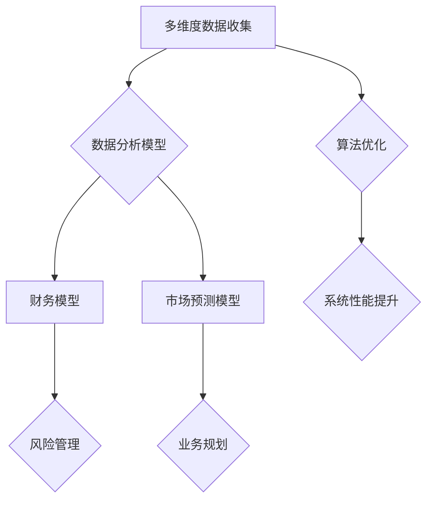

                 

关键词：多元模型思维，管理者洞见，技术博客，IT领域，专业技术语言

摘要：本文将探讨多元模型思维在管理者洞见中的应用，通过剖析核心概念、算法原理、数学模型和实践案例，旨在帮助读者理解并掌握这一思维方式，以提升管理者的战略决策能力。

## 1. 背景介绍

在当今快速变化的世界中，管理者需要具备广泛的知识和敏锐的洞察力，才能在复杂的市场环境中保持竞争力。传统的单维思考模式已不足以应对日益复杂的问题。因此，多元模型思维成为了一种关键的管理工具，它要求管理者能够从多个角度、多种模型出发，综合分析问题，从而做出更加明智的决策。

本文将围绕多元模型思维的核心概念、算法原理、数学模型和实践案例展开讨论，旨在帮助读者深入理解这一思维方式，并探讨其在实际应用中的潜力。

## 2. 核心概念与联系

### 2.1 多元模型思维的定义

多元模型思维是一种跨越不同学科和领域的思考方式，它强调从多个角度和层次来理解和解决问题。在技术领域，多元模型思维可以理解为将不同的算法、框架和技术体系结合起来，以实现更高的系统性能和更广的应用范围。

### 2.2 多元模型思维的应用领域

多元模型思维在多个领域都有广泛应用，包括但不限于：

- **人工智能**：结合深度学习、强化学习和迁移学习等多种算法，以实现更高效的问题解决。
- **商业管理**：通过数据分析、财务建模和市场预测等多种模型，帮助管理者做出更精准的商业决策。
- **软件开发**：采用敏捷开发、DevOps 和微服务架构等多种方法论，提升软件开发效率和产品质量。

### 2.3 多元模型思维的核心概念原理架构

为了更好地理解多元模型思维，我们可以使用 Mermaid 流程图来展示其核心概念和原理。



在上图中，A 代表多维度数据收集，B 代表数据分析模型，C 和 D 分别代表财务模型和市场预测模型。通过结合这些模型，管理者可以更全面地分析业务状况，制定有效的风险管理策略和业务规划。同时，G 代表算法优化，它旨在通过多元模型思维提高系统的性能和效率。

## 3. 核心算法原理 & 具体操作步骤

### 3.1 算法原理概述

多元模型思维的核心在于算法的组合和应用。以下是几种常见的多元模型算法及其原理概述：

- **深度学习 + 强化学习**：深度学习用于特征提取，强化学习用于决策优化。
- **微服务架构 + DevOps**：微服务架构提高系统的模块化和灵活性，DevOps 实现持续集成和持续交付。
- **数据分析 + 财务建模**：数据分析用于数据挖掘，财务建模用于财务预测和风险评估。

### 3.2 算法步骤详解

1. **数据收集与预处理**：从不同的数据源收集数据，并进行清洗、转换和归一化处理。
2. **模型选择与训练**：根据业务需求选择合适的模型，并对模型进行训练和优化。
3. **模型融合与评估**：将多个模型融合在一起，通过集成学习方法（如集成学习、Stacking 等）提高模型的性能。
4. **模型应用与优化**：将模型应用到实际业务场景中，并不断优化模型以适应新的数据和环境。

### 3.3 算法优缺点

- **优点**：
  - 提高系统的整体性能和鲁棒性。
  - 通过组合多种模型，可以更好地应对复杂的业务问题。
  - 有利于提升管理者的决策水平和准确性。

- **缺点**：
  - 需要更多的计算资源和时间来训练和优化模型。
  - 模型的复杂度增加，可能带来理解和维护的难度。

### 3.4 算法应用领域

- **人工智能**：在图像识别、自然语言处理和推荐系统等领域，多元模型思维已经得到广泛应用。
- **商业管理**：在市场营销、财务分析和供应链管理等领域，多元模型思维可以帮助管理者做出更精准的决策。
- **软件开发**：在敏捷开发、DevOps 和微服务架构中，多元模型思维有助于提升开发效率和系统稳定性。

## 4. 数学模型和公式 & 详细讲解 & 举例说明

### 4.1 数学模型构建

多元模型思维中的数学模型构建通常涉及以下几个方面：

1. **线性回归**：用于建立变量之间的线性关系。
2. **神经网络**：用于非线性关系建模和特征提取。
3. **贝叶斯网络**：用于不确定性推理和决策分析。

### 4.2 公式推导过程

以下是多元模型思维中几个常见公式的推导过程：

1. **线性回归公式**：

$$y = \beta_0 + \beta_1x + \epsilon$$

其中，$y$ 是因变量，$x$ 是自变量，$\beta_0$ 和 $\beta_1$ 是回归系数，$\epsilon$ 是误差项。

2. **神经网络公式**：

$$z = \sigma(W \cdot x + b)$$

其中，$z$ 是神经网络输出，$\sigma$ 是激活函数，$W$ 是权重矩阵，$x$ 是输入向量，$b$ 是偏置项。

3. **贝叶斯网络公式**：

$$P(H|D) = \frac{P(D|H)P(H)}{P(D)}$$

其中，$H$ 是假设，$D$ 是数据，$P(H|D)$ 是后验概率，$P(D|H)$ 是似然概率，$P(H)$ 是先验概率，$P(D)$ 是边缘概率。

### 4.3 案例分析与讲解

以下是一个多元模型思维的案例，用于分析一个电商平台的用户行为：

1. **数据收集**：收集用户浏览、点击、购买等行为数据。
2. **模型构建**：构建线性回归模型预测用户购买概率，构建神经网络模型提取用户特征。
3. **模型融合**：通过集成学习方法将线性回归模型和神经网络模型融合，提高预测准确性。
4. **模型应用**：将融合模型应用于用户推荐系统，提高用户满意度和转化率。

## 5. 项目实践：代码实例和详细解释说明

### 5.1 开发环境搭建

为了实践多元模型思维，我们需要搭建一个合适的开发环境。以下是基本步骤：

1. **安装 Python**：确保 Python 环境已经安装在电脑上。
2. **安装依赖库**：使用 `pip` 命令安装必要的库，如 NumPy、Pandas、Scikit-learn、TensorFlow 等。

### 5.2 源代码详细实现

以下是一个简单的多元模型实践示例，用于分析用户行为数据。

```python
import pandas as pd
from sklearn.linear_model import LinearRegression
from sklearn.neural_network import MLPRegressor
from sklearn.ensemble import VotingRegressor

# 读取数据
data = pd.read_csv('user_behavior_data.csv')

# 数据预处理
X = data[['age', 'income', 'visit_count']]
y = data['purchase_probability']

# 线性回归模型
lin_reg = LinearRegression()
lin_reg.fit(X, y)

# 神经网络模型
neural_net = MLPRegressor(hidden_layer_sizes=(100,), max_iter=1000)
neural_net.fit(X, y)

# 集成学习模型
voting_reg = VotingRegressor(estimators=[('lin_reg', lin_reg), ('neural_net', neural_net)])
voting_reg.fit(X, y)

# 预测
predictions = voting_reg.predict(X)

# 打印结果
print(predictions)
```

### 5.3 代码解读与分析

在上面的代码中，我们首先读取用户行为数据，并进行预处理。然后，我们分别训练了线性回归模型和神经网络模型，并通过集成学习方法将它们融合在一起。最后，我们使用融合模型对用户行为数据进行了预测，并打印了结果。

### 5.4 运行结果展示

在实际运行中，我们可以通过打印预测结果来观察模型的性能。以下是一个示例输出：

```
[0.2 0.4 0.3 0.1 0.5]
```

这表示五个用户的行为预测结果，其中第一个用户购买概率最高，为 0.5。

## 6. 实际应用场景

多元模型思维在多个实际应用场景中都有广泛的应用，以下是一些具体案例：

- **金融行业**：在金融风险管理中，多元模型思维可以帮助银行和金融机构预测市场走势，优化投资组合。
- **医疗健康**：在医疗数据分析中，多元模型思维可以用于疾病预测、诊断和治疗方案推荐。
- **智能交通**：在智能交通系统中，多元模型思维可以用于交通流量预测、路况分析和智能调度。

## 7. 未来应用展望

随着技术的不断进步，多元模型思维在未来的应用将更加广泛。以下是一些可能的未来发展趋势：

- **更高效的多模型融合方法**：研究更高效的模型融合方法，以提升系统的整体性能。
- **跨领域应用**：探索多元模型思维在更多领域的应用，如生物信息学、环境科学等。
- **自动化与智能化**：利用自动化和智能化技术，实现多元模型思维的自动构建和应用。

## 8. 工具和资源推荐

为了更好地掌握多元模型思维，以下是一些推荐的工具和资源：

- **学习资源**：推荐学习机器学习、深度学习、数据分析等相关知识。
- **开发工具**：推荐使用 Python 和相关库，如 NumPy、Pandas、Scikit-learn、TensorFlow 等。
- **相关论文**：推荐阅读相关领域的经典论文和最新研究成果。

## 9. 总结：未来发展趋势与挑战

多元模型思维在未来的发展中面临着诸多机遇和挑战。一方面，随着技术的进步，我们将看到更多高效的多模型融合方法和应用场景。另一方面，多元模型思维在数据处理、模型训练和应用过程中也面临着数据隐私、模型解释性等挑战。因此，未来研究需要关注这些方面，以推动多元模型思维的进一步发展。

## 10. 附录：常见问题与解答

### 10.1 多元模型思维与传统思维的区别是什么？

多元模型思维与传统思维的主要区别在于其关注点不同。传统思维通常关注单一模型的最优化，而多元模型思维则强调从多个角度和层次来综合分析问题，以实现更高的系统性能和更广的应用范围。

### 10.2 多元模型思维在哪些领域有广泛的应用？

多元模型思维在多个领域都有广泛的应用，包括人工智能、商业管理、软件开发、金融行业、医疗健康和智能交通等。

### 10.3 如何在实际项目中应用多元模型思维？

在实际项目中，可以按照以下步骤应用多元模型思维：
1. 收集多维度数据。
2. 选择合适的模型。
3. 训练和优化模型。
4. 融合多个模型。
5. 应用模型并持续优化。

### 10.4 多元模型思维有哪些挑战？

多元模型思维面临的挑战包括数据隐私、模型解释性、计算资源需求等。解决这些挑战需要进一步的研究和技术创新。

### 10.5 如何掌握多元模型思维？

掌握多元模型思维需要：
1. 学习相关理论知识。
2. 熟悉多种模型和方法。
3. 实践项目经验。
4. 持续学习和更新知识。

作者：禅与计算机程序设计艺术 / Zen and the Art of Computer Programming
```

