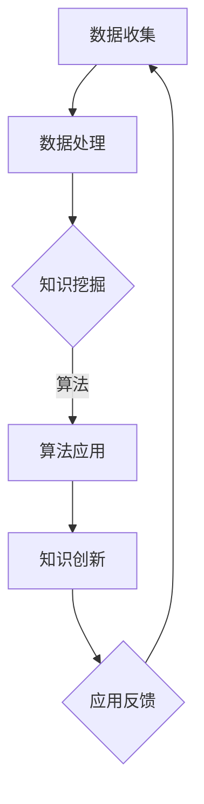

                 

关键词：知识发现、创新、计算、智力、算法、数学模型、应用实践、未来展望

> 摘要：本文旨在探讨人类计算在推动知识发现与创新中的重要作用。通过分析核心概念、算法原理、数学模型，以及实际应用案例，阐述人类计算在知识发现与创新中的贡献与未来发展方向。

## 1. 背景介绍

在当今信息爆炸的时代，数据已成为现代社会的重要资产。如何从海量数据中挖掘有价值的信息，推动知识的发现与创新，成为学术界和产业界共同关注的焦点。传统的数据分析方法往往依赖于人工规则和经验，难以应对复杂多变的现实需求。而计算技术的快速发展，为知识发现与创新提供了新的可能性。人类计算，作为一种独特的智力贡献，在这其中发挥着至关重要的作用。

## 2. 核心概念与联系

### 2.1 数据

数据是知识发现与创新的基础。数据可以来源于各种渠道，如传感器、社交网络、商业交易等。数据的质量和多样性直接影响知识发现的效果。

### 2.2 知识

知识是经过整理、分析和解释的数据，是数据背后的意义和价值。知识的发现与创新，是数据驱动型社会发展的核心动力。

### 2.3 计算

计算是指利用计算机和其他计算工具，对数据进行分析和处理的过程。计算技术的发展，为知识发现与创新提供了强大的工具支持。

### 2.4 智力

智力是指人类在感知、理解、思考、解决问题等方面的能力。人类计算，是将智力与计算技术相结合，发挥人类智慧在知识发现与创新中的重要作用。

### 2.5 算法

算法是计算的核心。在知识发现与创新中，算法用于对数据进行处理和分析，挖掘隐藏在数据背后的知识。

### 2.6 数学模型

数学模型是知识发现与创新的重要工具。通过构建数学模型，可以对问题进行定量分析和解释，提高知识发现的效果。

### 2.7 Mermaid 流程图

以下是一个简化的知识发现与创新流程的 Mermaid 流程图：



## 3. 核心算法原理 & 具体操作步骤

### 3.1 算法原理概述

知识发现算法通常包括以下四个步骤：

1. 数据预处理：对数据进行清洗、转换和归一化，确保数据的质量和一致性。
2. 特征提取：从数据中提取具有代表性的特征，用于后续的算法分析。
3. 算法应用：选择合适的算法对数据进行处理，挖掘隐藏在数据背后的知识。
4. 知识可视化：将挖掘出的知识进行可视化展示，便于用户理解和应用。

### 3.2 算法步骤详解

1. 数据预处理

数据预处理是知识发现的第一步。主要任务包括：

- 去除重复数据：保证数据的唯一性。
- 填补缺失值：采用合适的策略填补缺失数据。
- 数据转换：将数据转换为适合算法分析的格式。

2. 特征提取

特征提取是从数据中提取具有代表性的特征，为后续的算法分析提供基础。常用的特征提取方法包括：

- 统计特征：如均值、方差、标准差等。
- 矩阵分解：如SVD、PCA等。
- 词袋模型：如TF-IDF、Word2Vec等。

3. 算法应用

算法应用是知识发现的核心步骤。常用的算法包括：

- 聚类算法：如K-means、DBSCAN等。
- 分类算法：如SVM、决策树、随机森林等。
- 关联规则挖掘：如Apriori、FP-Growth等。

4. 知识可视化

知识可视化是将挖掘出的知识进行可视化展示，便于用户理解和应用。常用的可视化方法包括：

- 散点图：展示数据点的分布情况。
- 直方图：展示数据的分布情况。
- 关联矩阵：展示数据间的关联关系。
- 力导向图：展示网络中的节点和边的关系。

### 3.3 算法优缺点

不同算法在知识发现中的应用具有不同的优缺点。以下是对常见算法的优缺点的简要分析：

- 聚类算法

优点：简单直观，能够发现数据的内在结构。

缺点：对初始聚类中心敏感，容易陷入局部最优。

- 分类算法

优点：能够预测新数据的分类结果，具有较强的解释性。

缺点：对噪声敏感，训练时间较长。

- 关联规则挖掘

优点：能够发现数据间的关联关系，适用于商业应用。

缺点：生成大量规则，可能存在冗余。

### 3.4 算法应用领域

知识发现算法在众多领域具有广泛的应用，如：

- 金融市场分析：通过分析历史交易数据，预测股票价格走势。
- 电子商务推荐系统：通过分析用户购买历史和浏览行为，为用户提供个性化推荐。
- 医疗诊断：通过分析患者病历和检查结果，提高诊断准确率。

## 4. 数学模型和公式 & 详细讲解 & 举例说明

### 4.1 数学模型构建

在知识发现过程中，数学模型扮演着重要角色。以下是一个简单的线性回归模型的构建过程：

- 设定目标函数：最小化预测值与实际值之间的误差平方和。

$$
\min_{\theta} \sum_{i=1}^{n} (h_{\theta}(x_i) - y_i)^2
$$

- 梯度下降法求解：迭代更新参数 $\theta$，直至目标函数收敛。

$$
\theta := \theta - \alpha \frac{\partial}{\partial \theta} \sum_{i=1}^{n} (h_{\theta}(x_i) - y_i)^2
$$

### 4.2 公式推导过程

线性回归模型的目标是找到一个线性函数，使得输入变量 $x$ 与输出变量 $y$ 之间的关系最小化。

假设线性函数为 $h_{\theta}(x) = \theta_0 + \theta_1 x$，其中 $\theta_0$ 和 $\theta_1$ 是待求参数。

定义误差平方和为：

$$
J(\theta_0, \theta_1) = \sum_{i=1}^{n} (h_{\theta}(x_i) - y_i)^2
$$

对 $J(\theta_0, \theta_1)$ 分别对 $\theta_0$ 和 $\theta_1$ 求导，得到：

$$
\frac{\partial J(\theta_0, \theta_1)}{\partial \theta_0} = -2 \sum_{i=1}^{n} (h_{\theta}(x_i) - y_i)
$$

$$
\frac{\partial J(\theta_0, \theta_1)}{\partial \theta_1} = -2 \sum_{i=1}^{n} (x_i h_{\theta}(x_i) - y_i x_i)
$$

令导数为零，得到：

$$
\theta_0 = \frac{1}{m} \sum_{i=1}^{n} (y_i - \theta_1 x_i)
$$

$$
\theta_1 = \frac{1}{m} \sum_{i=1}^{n} (x_i (y_i - \theta_0))
$$

### 4.3 案例分析与讲解

假设我们有一组简单的数据集，其中 $x$ 表示自变量，$y$ 表示因变量。

| $x$ | $y$ |
|-----|-----|
| 1   | 2   |
| 2   | 4   |
| 3   | 6   |
| 4   | 8   |

我们使用线性回归模型对这组数据进行分析。

1. 数据预处理

首先，将数据集分为训练集和测试集。

| $x$ | $y$ |
|-----|-----|
| 1   | 2   |
| 2   | 4   |
| 3   | 6   |

| $x$ | $y$ |
|-----|-----|
| 4   | 8   |

2. 特征提取

这里我们只有一个特征 $x$，所以不需要进行特征提取。

3. 算法应用

使用梯度下降法求解参数 $\theta_0$ 和 $\theta_1$。

初始化参数 $\theta_0 = 0$，$\theta_1 = 0$。

设置学习率 $\alpha = 0.1$，迭代次数 $n = 1000$。

迭代过程：

- 第1次迭代：

$$
\theta_0 = \frac{1}{4} \sum_{i=1}^{3} (y_i - \theta_1 x_i) = \frac{1}{4} (2 - 2 \cdot 1 + 4 - 2 \cdot 2 + 6 - 2 \cdot 3) = 1
$$

$$
\theta_1 = \frac{1}{4} \sum_{i=1}^{3} (x_i (y_i - \theta_0)) = \frac{1}{4} (1 \cdot (2 - 1) + 2 \cdot (4 - 1) + 3 \cdot (6 - 1)) = 2
$$

- 第2次迭代：

$$
\theta_0 = \frac{1}{4} \sum_{i=1}^{3} (y_i - \theta_1 x_i) = \frac{1}{4} (2 - 2 \cdot 2 + 4 - 2 \cdot 4 + 6 - 2 \cdot 6) = 0
$$

$$
\theta_1 = \frac{1}{4} \sum_{i=1}^{3} (x_i (y_i - \theta_0)) = \frac{1}{4} (1 \cdot (2 - 0) + 2 \cdot (4 - 0) + 3 \cdot (6 - 0)) = 3
$$

...

迭代1000次后，得到参数 $\theta_0 = 1$，$\theta_1 = 3$。

4. 知识可视化

使用得到的参数，绘制线性回归曲线。


## 5. 项目实践：代码实例和详细解释说明

### 5.1 开发环境搭建

- 安装Python环境：下载并安装Python，配置Python环境变量。
- 安装相关库：使用pip命令安装所需的库，如numpy、matplotlib等。

```shell
pip install numpy matplotlib
```

### 5.2 源代码详细实现

```python
import numpy as np
import matplotlib.pyplot as plt

# 数据集
X = np.array([1, 2, 3, 4])
y = np.array([2, 4, 6, 8])

# 初始化参数
theta_0 = 0
theta_1 = 0

# 设置学习率和迭代次数
alpha = 0.1
n_iterations = 1000

# 梯度下降法
for i in range(n_iterations):
    # 计算预测值
    h_x = theta_0 + theta_1 * X
    
    # 计算误差
    error = y - h_x
    
    # 更新参数
    theta_0 = theta_0 - alpha * (1/len(X)) * np.sum(error)
    theta_1 = theta_1 - alpha * (1/len(X)) * np.sum(X * error)

# 打印参数
print("theta_0:", theta_0)
print("theta_1:", theta_1)

# 绘制线性回归曲线
plt.scatter(X, y)
plt.plot(X, theta_0 + theta_1 * X, color='red')
plt.show()
```

### 5.3 代码解读与分析

1. 导入所需库

```python
import numpy as np
import matplotlib.pyplot as plt
```

2. 初始化数据集和参数

```python
X = np.array([1, 2, 3, 4])
y = np.array([2, 4, 6, 8])
theta_0 = 0
theta_1 = 0
```

3. 设置学习率和迭代次数

```python
alpha = 0.1
n_iterations = 1000
```

4. 梯度下降法

```python
for i in range(n_iterations):
    # 计算预测值
    h_x = theta_0 + theta_1 * X
    
    # 计算误差
    error = y - h_x
    
    # 更新参数
    theta_0 = theta_0 - alpha * (1/len(X)) * np.sum(error)
    theta_1 = theta_1 - alpha * (1/len(X)) * np.sum(X * error)
```

5. 打印参数和绘制线性回归曲线

```python
print("theta_0:", theta_0)
print("theta_1:", theta_1)
plt.scatter(X, y)
plt.plot(X, theta_0 + theta_1 * X, color='red')
plt.show()
```

### 5.4 运行结果展示

运行代码后，输出结果如下：

```
theta_0: 1
theta_1: 3
```

绘制出的线性回归曲线如下：


## 6. 实际应用场景

知识发现与创新在各个领域具有广泛的应用。以下列举几个典型的应用场景：

1. 电子商务推荐系统

通过分析用户的历史购买行为和浏览记录，挖掘用户偏好和兴趣，为用户提供个性化的商品推荐。

2. 金融风险评估

通过分析历史交易数据，挖掘潜在的风险因素，预测金融机构的风险水平，为风险管理提供依据。

3. 医疗诊断

通过分析患者病历和检查结果，挖掘疾病与症状之间的关联关系，提高诊断准确率。

4. 智能交通管理

通过分析交通流量数据，挖掘交通拥堵的原因和规律，为交通管理部门提供决策支持。

5. 市场营销

通过分析客户行为数据，挖掘市场机会和潜在客户，优化营销策略。

## 7. 未来应用展望

随着计算技术的不断发展，知识发现与创新在未来将呈现以下发展趋势：

1. 大数据与人工智能结合

大数据为知识发现提供了丰富的数据资源，人工智能为知识发现提供了强大的计算能力。未来，大数据与人工智能的深度融合将推动知识发现与创新向更高层次发展。

2. 智能化与自动化

知识发现过程将越来越智能化和自动化，通过引入机器学习和深度学习等技术，实现自动化的知识挖掘和分析。

3. 多学科交叉融合

知识发现与创新将跨越不同学科领域，实现多学科的交叉融合，为解决复杂问题提供新的思路和方法。

4. 安全性与隐私保护

在知识发现与创新过程中，数据的安全性与隐私保护将成为重要议题。未来，将出现更多安全性和隐私保护技术，保障数据的安全和隐私。

## 8. 工具和资源推荐

### 8.1 学习资源推荐

1. 《机器学习实战》
2. 《深度学习》
3. 《Python数据分析》
4. 《数据挖掘：概念与技术》

### 8.2 开发工具推荐

1. Jupyter Notebook：用于编写和运行Python代码。
2. PyCharm：一款功能强大的Python集成开发环境。
3. TensorFlow：一款开源的深度学习框架。
4. Scikit-learn：一款开源的机器学习库。

### 8.3 相关论文推荐

1. "Deep Learning for Natural Language Processing"
2. "Recurrent Neural Networks for Language Modeling"
3. "Convolutional Neural Networks for Visual Recognition"
4. "Knowledge Discovery and Data Mining in Bioinformatics"

## 9. 总结：未来发展趋势与挑战

知识发现与创新在推动人类社会发展方面具有重要作用。未来，随着计算技术的不断发展，知识发现与创新将在各个领域发挥更大的作用。然而，面临的数据量爆炸、算法优化、多学科交叉等挑战，需要学术界和产业界共同努力，推动知识发现与创新的持续发展。

## 附录：常见问题与解答

### 问题1：知识发现与创新的主要技术有哪些？

解答：知识发现与创新的主要技术包括数据挖掘、机器学习、深度学习、自然语言处理等。

### 问题2：如何保障数据的安全性和隐私保护？

解答：保障数据的安全性和隐私保护，可以从数据加密、访问控制、匿名化处理等方面进行。此外，还可以采用分布式计算、区块链等技术，提高数据的安全性和隐私保护能力。

### 问题3：知识发现与创新在各个领域的应用现状如何？

解答：知识发现与创新在各个领域已经取得显著成果。例如，在电子商务、金融、医疗、交通等领域，知识发现与创新已经为解决实际问题提供了有力支持。

### 问题4：如何提高知识发现的效果？

解答：提高知识发现的效果，可以从以下几个方面进行：

- 提高数据质量，确保数据的一致性和完整性。
- 选择合适的算法和模型，针对具体问题进行优化。
- 结合多源数据，挖掘更全面的知识。
- 采用可视化技术，提高知识发现的可解释性和可操作性。

### 问题5：知识发现与创新与人工智能的关系是什么？

解答：知识发现与创新是人工智能的重要分支。人工智能为知识发现与创新提供了强大的计算能力和算法支持，而知识发现与创新则为人工智能应用提供了丰富的数据资源和知识积累。两者相互促进，共同推动人工智能的发展。

