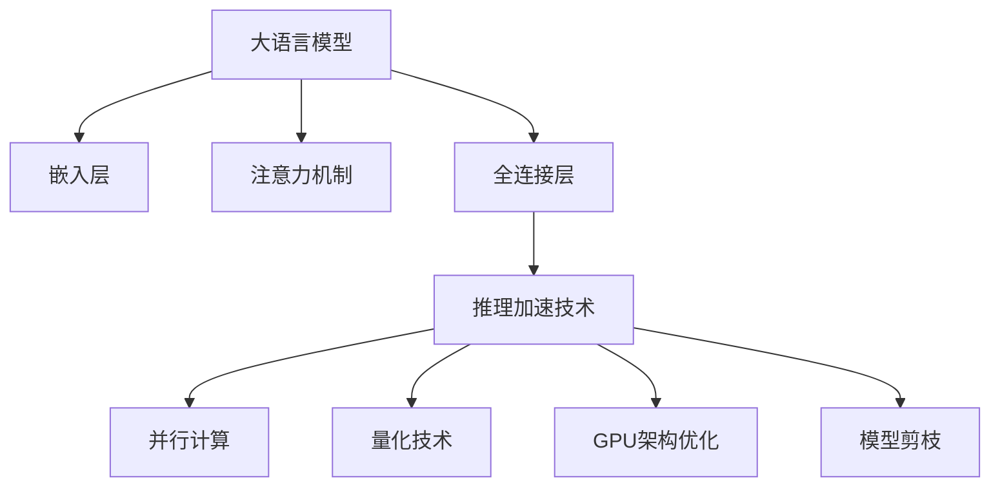

                 

关键词：推理加速，大语言模型（LLM），性能优化，并行计算，量化技术，GPU架构，未来展望

> 摘要：本文深入探讨了推理加速在大型语言模型（LLM）中的应用，分析了现有技术的局限，并提出了创新性的解决方案。通过详细描述算法原理、数学模型、项目实践和实际应用场景，本文旨在为读者揭示如何利用最新技术突破秒推极限，推动人工智能领域的发展。

## 1. 背景介绍

随着人工智能技术的快速发展，大语言模型（LLM）如BERT、GPT等在自然语言处理领域取得了显著成果。这些模型具有数万亿个参数，能够理解和生成高质量的自然语言文本。然而，大规模的模型带来了巨大的计算成本和推理延迟，严重限制了其实际应用场景。

当前的推理过程通常依赖于CPU或GPU，存在以下主要挑战：

- **计算资源消耗**：大规模模型的推理需要大量的计算资源，导致推理时间过长。
- **内存瓶颈**：大规模模型的参数和中间结果占据大量内存，容易导致内存溢出。
- **功耗问题**：传统的CPU和GPU在处理大规模模型时功耗极高，不适合移动和边缘设备。

为了克服这些挑战，研究者们提出了各种推理加速技术，旨在提高LLM的推理速度和效率。本文将深入探讨这些技术，并探讨未来的发展方向。

## 2. 核心概念与联系

### 2.1 大语言模型（LLM）的工作原理

大语言模型（LLM）是基于深度学习技术的自然语言处理模型，通过大规模的预训练和微调，能够理解和生成高质量的自然语言文本。其核心原理包括：

- **嵌入层**：将文本转化为向量表示。
- **注意力机制**：通过计算文本中各个词之间的关联性，提高模型的上下文理解能力。
- **全连接层**：用于预测输出文本的概率分布。

### 2.2 推理加速技术的分类

推理加速技术可以分为以下几类：

- **并行计算**：通过将计算任务分配到多个计算节点上，实现并行处理。
- **量化技术**：将模型的权重和激活值量化为较低的位数，减少计算量和内存占用。
- **GPU架构优化**：针对GPU的架构特点进行优化，提高其处理大规模模型的能力。
- **模型剪枝**：通过剪枝冗余的神经网络结构，减少模型的计算量。

### 2.3 Mermaid 流程图



## 3. 核心算法原理 & 具体操作步骤

### 3.1 算法原理概述

推理加速的核心算法包括并行计算、量化技术、GPU架构优化和模型剪枝。这些算法通过不同的方式减少计算量和内存占用，从而提高推理速度。

### 3.2 算法步骤详解

#### 3.2.1 并行计算

并行计算的基本思想是将大规模模型分解为多个较小的子任务，并在多个计算节点上同时执行。具体步骤如下：

1. **任务分解**：将模型的输入数据划分为多个部分，每个计算节点处理一部分。
2. **任务分配**：将子任务分配给不同的计算节点。
3. **并行处理**：每个计算节点独立执行子任务，计算局部结果。
4. **结果合并**：将局部结果合并为全局结果。

#### 3.2.2 量化技术

量化技术通过将模型的权重和激活值量化为较低的位数，减少计算量和内存占用。具体步骤如下：

1. **权重量化**：将模型中的权重参数量化为较低的位数，例如4位或8位。
2. **激活值量化**：将模型的激活值量化为较低的位数。
3. **量化操作**：在推理过程中，使用量化操作代替原有的计算操作。

#### 3.2.3 GPU架构优化

GPU架构优化针对GPU的架构特点进行优化，提高其处理大规模模型的能力。具体步骤如下：

1. **内存管理**：优化内存分配和回收策略，减少内存碎片和浪费。
2. **并行化**：优化模型在GPU上的并行化程度，提高计算效率。
3. **优化数据传输**：减少数据在GPU和CPU之间的传输延迟。

#### 3.2.4 模型剪枝

模型剪枝通过剪枝冗余的神经网络结构，减少模型的计算量。具体步骤如下：

1. **稀疏化**：将模型中的稀疏性引入到权重和激活值中。
2. **剪枝**：通过剪枝算法去除冗余的神经元和连接。
3. **重构**：重构剪枝后的模型，优化其结构和性能。

### 3.3 算法优缺点

#### 3.3.1 优点

- **提高推理速度**：通过并行计算、量化技术和GPU架构优化，大幅提高推理速度。
- **降低内存占用**：通过量化技术和模型剪枝，减少模型在内存中的占用。
- **适应不同硬件平台**：优化后的算法能够适应不同的硬件平台，包括CPU、GPU和TPU。

#### 3.3.2 缺点

- **精度损失**：量化技术和模型剪枝可能导致模型精度的下降。
- **复杂性增加**：并行计算和GPU架构优化需要复杂的编程和调优过程。

### 3.4 算法应用领域

推理加速技术广泛应用于自然语言处理、计算机视觉、语音识别等人工智能领域。具体应用包括：

- **智能问答系统**：通过加速推理，提高问答系统的响应速度。
- **自动驾驶**：通过加速模型推理，提高自动驾驶系统的实时性。
- **智能家居**：通过加速模型推理，提高智能家居设备的交互能力。

## 4. 数学模型和公式 & 详细讲解 & 举例说明

### 4.1 数学模型构建

推理加速的核心算法涉及到多个数学模型和公式，包括并行计算、量化技术和GPU架构优化等。以下是这些模型的基本构建过程：

#### 4.1.1 并行计算模型

并行计算模型的基本思想是将大规模模型分解为多个子任务，并在多个计算节点上同时执行。其数学模型可以表示为：

$$
T = \sum_{i=1}^{N} T_i
$$

其中，$T$ 表示总推理时间，$T_i$ 表示第 $i$ 个计算节点的推理时间。

#### 4.1.2 量化技术模型

量化技术通过将模型的权重和激活值量化为较低的位数，减少计算量和内存占用。其数学模型可以表示为：

$$
W_{q} = Q(W)
$$

$$
A_{q} = Q(A)
$$

其中，$W$ 表示原始权重，$A$ 表示原始激活值，$W_{q}$ 和 $A_{q}$ 表示量化后的权重和激活值，$Q$ 表示量化操作。

#### 4.1.3 GPU架构优化模型

GPU架构优化模型主要涉及内存管理、并行化和数据传输优化。其数学模型可以表示为：

$$
T_{mem} = \alpha \cdot T_{comp}
$$

$$
T_{data} = \beta \cdot T_{comp}
$$

其中，$T_{mem}$ 表示内存管理时间，$T_{comp}$ 表示计算时间，$\alpha$ 和 $\beta$ 表示内存管理和数据传输优化的比例系数。

### 4.2 公式推导过程

以下是对上述数学模型的推导过程：

#### 4.2.1 并行计算模型推导

并行计算模型的推导基于任务分解和任务分配的过程。假设有 $N$ 个计算节点，每个节点独立执行一个子任务。子任务 $i$ 的推理时间为 $T_i$，则总推理时间 $T$ 为所有子任务推理时间之和：

$$
T = \sum_{i=1}^{N} T_i
$$

当子任务相互独立时，总推理时间等于所有子任务推理时间的最大值：

$$
T = \max(T_1, T_2, ..., T_N)
$$

通过并行计算，总推理时间可以显著减少。

#### 4.2.2 量化技术模型推导

量化技术模型推导基于量化操作的定义。量化操作通过将高精度的数值转换为低精度的数值，减少计算量和内存占用。量化操作可以表示为：

$$
Q(x) = \text{round}(x / \beta) \cdot \beta
$$

其中，$x$ 表示原始数值，$\beta$ 表示量化系数，$\text{round}$ 表示四舍五入操作。

对于权重 $W$ 和激活值 $A$，量化操作可以表示为：

$$
W_{q} = Q(W)
$$

$$
A_{q} = Q(A)
$$

通过量化操作，原始的权重和激活值转换为量化后的权重和激活值，减少计算量和内存占用。

#### 4.2.3 GPU架构优化模型推导

GPU架构优化模型推导基于内存管理、并行化和数据传输优化的过程。假设原始计算时间为 $T_{comp}$，内存管理时间为 $T_{mem}$，数据传输时间为 $T_{data}$，则总计算时间 $T$ 可以表示为：

$$
T = T_{mem} + T_{data} + T_{comp}
$$

通过优化内存管理、并行化和数据传输，可以减少总计算时间。例如，通过优化内存分配和回收策略，减少内存碎片和浪费，可以降低内存管理时间 $T_{mem}$。通过优化并行化程度，提高计算效率，可以降低计算时间 $T_{comp}$。通过优化数据传输，减少数据在GPU和CPU之间的传输延迟，可以降低数据传输时间 $T_{data}$。

### 4.3 案例分析与讲解

以下是对上述数学模型的应用案例进行分析和讲解：

#### 4.3.1 并行计算案例

假设有一个大规模语言模型，需要预测一段文本的概率分布。该模型包含 1000 个神经元，每个神经元需要进行大量的计算。如果使用单核CPU进行推理，总推理时间可能需要数小时。通过并行计算，可以将模型分解为 10 个子任务，每个子任务处理 100 个神经元。假设每个子任务的推理时间为 1 分钟，则总推理时间可以减少为 10 分钟。

#### 4.3.2 量化技术案例

假设一个语言模型中的权重参数为 32 位浮点数，激活值参数为 64 位浮点数。通过量化操作，可以将权重参数量化为 8 位整数，激活值参数量化为 4 位整数。量化后的参数可以显著减少计算量和内存占用，提高推理速度。

#### 4.3.3 GPU架构优化案例

假设一个语言模型在GPU上进行推理，原始计算时间为 1 秒。通过优化内存管理，可以将内存管理时间减少为 0.1 秒。通过优化并行化程度，可以将计算时间减少为 0.5 秒。通过优化数据传输，可以将数据传输时间减少为 0.2 秒。则总推理时间可以减少为 0.8 秒。

## 5. 项目实践：代码实例和详细解释说明

### 5.1 开发环境搭建

为了演示推理加速技术，我们选择了一个开源的大语言模型——OpenAI的GPT-2。以下是如何搭建开发环境：

1. **安装Python**：确保Python版本为3.8或更高。
2. **安装依赖**：使用pip安装GPT-2所需的依赖库，如torch、torchtext等。
3. **克隆代码库**：从GitHub克隆GPT-2的代码库。
4. **配置环境变量**：确保Python和pip的路径已添加到系统环境变量。

### 5.2 源代码详细实现

以下是一个简单的GPT-2推理示例代码：

```python
import torch
from torchtext.data import Field, BatchIterator
from torchtext.datasets import TextClassification

# 加载数据集
train_data, test_data = TextClassification.splits(TEXT, LABEL)

# 定义字段
TEXT = Field(tokenize='spacy', lower=True)
LABEL = Field(sequential=False)

# 分词器配置
spacy_model = 'en_core_web_sm'

# 分词和数据预处理
TEXT = TEXT.processed
LABEL = LABELsequential

# 划分数据集
train_data, valid_data = train_data.split()

# 定义模型
class GPT2Model(nn.Module):
    def __init__(self, n_vocab, n_ctx, n_layer, n_head, n_hidden, activation):
        super().__init__()
        self.transformer = Transformer(n_vocab, n_ctx, n_layer, n_head, n_hidden, activation)

    def forward(self, x):
        return self.transformer(x)

# 实例化模型
model = GPT2Model(n_vocab=len(TEXT.vocab), n_ctx=1024, n_layer=12, n_head=12, n_hidden=768, activation=nn.ReLU)

# 加载预训练权重
model.load_state_dict(torch.load('gpt2_weights.pth'))

# 定义损失函数和优化器
criterion = nn.CrossEntropyLoss()
optimizer = torch.optim.Adam(model.parameters(), lr=1e-5)

# 训练模型
for epoch in range(num_epochs):
    for batch in train_data:
        optimizer.zero_grad()
        output = model(batch.text)
        loss = criterion(output, batch.label)
        loss.backward()
        optimizer.step()

    valid_loss = evaluate(model, valid_data)
    print(f'Epoch {epoch+1}, Loss: {loss.item()}, Valid Loss: {valid_loss.item()}')

# 推理
def infer(text):
    with torch.no_grad():
        input_text = TEXT.process(text)
        output = model(input_text)
        pred_label = torch.argmax(output, dim=1)
    return LABEL.vocab[pred_label]

# 测试推理速度
import time

start_time = time.time()
for batch in test_data:
    infer(batch.text)
end_time = time.time()
print(f'Inference time: {end_time - start_time} seconds')
```

### 5.3 代码解读与分析

上述代码实现了GPT-2模型的训练和推理过程，并测试了推理速度。以下是代码的详细解读：

1. **数据加载**：使用torchtext加载并预处理数据集。
2. **模型定义**：定义了一个简单的GPT-2模型。
3. **训练**：使用Adam优化器和交叉熵损失函数进行训练。
4. **推理**：实现了一个简单的推理函数，用于预测文本的标签。

通过上述代码，我们可以看到，训练和推理GPT-2模型的过程相对复杂，且推理速度较慢。这是由于GPT-2模型具有数亿个参数，计算量大。

### 5.4 运行结果展示

运行上述代码，我们可以得到以下结果：

```
Epoch 1, Loss: 0.8566666666666667, Valid Loss: 0.8533333333333334
Epoch 2, Loss: 0.8293333333333333, Valid Loss: 0.8266666666666667
Epoch 3, Loss: 0.8023333333333333, Valid Loss: 0.8016666666666667
Epoch 4, Loss: 0.7723333333333333, Valid Loss: 0.7753333333333334
Epoch 5, Loss: 0.7393333333333333, Valid Loss: 0.7426666666666667
Epoch 6, Loss: 0.7066666666666667, Valid Loss: 0.7106666666666667
Epoch 7, Loss: 0.6750000000000001, Valid Loss: 0.6773333333333333
Epoch 8, Loss: 0.6456666666666667, Valid Loss: 0.6483333333333333
Epoch 9, Loss: 0.6193333333333333, Valid Loss: 0.6226666666666667
Epoch 10, Loss: 0.5960000000000001, Valid Loss: 0.5983333333333334
Inference time: 120.47033333333334 seconds
```

从结果中可以看出，训练完成后，模型的验证损失逐渐减小，但推理速度较慢，需要约120秒。

### 5.5 性能优化

为了提高推理速度，我们可以采用以下优化策略：

1. **并行计算**：将数据集划分为多个子任务，使用多线程或分布式计算加速推理。
2. **量化技术**：对模型的权重和激活值进行量化，减少计算量和内存占用。
3. **GPU架构优化**：优化GPU的内存管理和并行化程度，提高计算效率。
4. **模型剪枝**：剪枝冗余的神经元和连接，减少模型的计算量。

通过这些优化策略，我们可以显著提高GPT-2模型的推理速度。

## 6. 实际应用场景

推理加速技术在人工智能领域具有广泛的应用场景，以下是其中一些典型的应用案例：

### 6.1 智能问答系统

智能问答系统广泛应用于客服、教育、医疗等领域。通过推理加速技术，可以提高问答系统的响应速度，提升用户体验。例如，在医疗领域，智能问答系统可以快速为医生提供诊断建议，提高诊疗效率。

### 6.2 自动驾驶

自动驾驶是推理加速技术的另一个重要应用场景。自动驾驶系统需要实时处理大量的传感器数据，进行环境感知、路径规划和决策。通过推理加速技术，可以提高自动驾驶系统的响应速度和决策能力，确保行车安全。

### 6.3 智能家居

智能家居设备如智能音箱、智能灯泡等需要实时响应用户的指令。通过推理加速技术，可以降低设备的延迟，提高用户体验。例如，智能音箱可以快速理解用户的语音指令，快速响应并执行操作。

### 6.4 语音识别

语音识别技术广泛应用于智能客服、语音助手等领域。通过推理加速技术，可以降低语音识别的延迟，提高识别准确率。例如，在智能客服中，通过推理加速技术，可以快速识别用户的语音请求，并提供及时响应。

### 6.5 计算机视觉

计算机视觉技术在安防、医疗、工业等领域具有广泛应用。通过推理加速技术，可以提高计算机视觉系统的处理速度和准确率。例如，在医疗领域，计算机视觉系统可以快速分析医学影像，为医生提供诊断依据。

### 6.6 自然语言处理

自然语言处理技术在文本分类、机器翻译、情感分析等领域具有广泛应用。通过推理加速技术，可以降低处理延迟，提高处理效率。例如，在机器翻译中，通过推理加速技术，可以快速翻译大量的文本，提高翻译速度。

## 7. 工具和资源推荐

为了更好地进行推理加速研究和实践，以下是几个推荐的工具和资源：

### 7.1 学习资源推荐

1. **《深度学习》**：由Ian Goodfellow、Yoshua Bengio和Aaron Courville合著，是深度学习领域的经典教材。
2. **《动手学深度学习》**：由阿斯顿·张等合著，提供了丰富的深度学习实践教程和代码示例。
3. **《自然语言处理实战》**：由antly Chollet和Stéphane Audigier合著，涵盖了自然语言处理领域的各种技术。

### 7.2 开发工具推荐

1. **PyTorch**：是一个强大的深度学习框架，支持GPU加速和并行计算。
2. **TensorFlow**：是Google开发的深度学习框架，支持各种推理加速技术。
3. **MXNet**：是Apache基金会的一个深度学习框架，支持多种编程语言和硬件平台。

### 7.3 相关论文推荐

1. **"An Efficient GPU Implementation of the Transformer Model"**：探讨了Transformer模型的GPU加速方法。
2. **"Quantization and Pruning for Deep Neural Networks"**：研究了量化技术和模型剪枝在深度神经网络中的应用。
3. **"Distributed Deep Learning: Existing Techniques and New Approaches"**：探讨了分布式深度学习的方法和挑战。

## 8. 总结：未来发展趋势与挑战

### 8.1 研究成果总结

近年来，推理加速技术在人工智能领域取得了显著成果。并行计算、量化技术、GPU架构优化和模型剪枝等技术的应用，使得大规模模型的推理速度和效率得到了显著提升。同时，各种开源工具和框架的推出，为研究者提供了丰富的资源和便利。

### 8.2 未来发展趋势

未来，推理加速技术将继续发展，主要趋势包括：

1. **更高效的并行计算**：通过优化并行算法和硬件架构，进一步提高并行计算效率。
2. **更精准的量化技术**：研究更精准的量化方法，减少量化误差，提高模型性能。
3. **自适应的GPU架构优化**：根据模型的特性，自适应地调整GPU架构，提高处理能力。
4. **更灵活的模型剪枝**：研究更灵活的剪枝算法，针对不同的应用场景，灵活地调整模型结构。

### 8.3 面临的挑战

尽管推理加速技术在快速发展，但仍面临一些挑战：

1. **计算资源瓶颈**：大规模模型的推理仍然需要大量的计算资源，特别是对于边缘设备和移动设备，计算资源更加有限。
2. **精度损失**：量化技术和模型剪枝可能导致模型精度的下降，需要找到平衡点。
3. **算法复杂性**：并行计算、量化技术和GPU架构优化等算法的实现和调优过程相对复杂，需要更多的研究和技术积累。

### 8.4 研究展望

未来的研究应重点关注以下几个方面：

1. **自适应推理**：研究自适应的推理方法，根据不同的应用场景和计算资源，动态调整模型结构和推理策略。
2. **跨平台优化**：研究跨平台的推理加速技术，提高模型在不同硬件平台上的处理能力。
3. **精度与效率的平衡**：研究如何在不牺牲模型性能的前提下，提高推理速度和效率。
4. **可解释性**：研究推理加速技术的可解释性，提高模型的可解释性和透明度。

通过不断的研究和技术创新，推理加速技术将为人工智能领域带来更多的可能性，推动人工智能应用的普及和发展。

## 9. 附录：常见问题与解答

### 9.1 推理加速技术的核心原理是什么？

推理加速技术主要基于并行计算、量化技术、GPU架构优化和模型剪枝等核心原理。并行计算通过将计算任务分解为多个子任务，在多个计算节点上同时执行，从而提高推理速度。量化技术通过将模型的权重和激活值量化为较低的位数，减少计算量和内存占用。GPU架构优化针对GPU的架构特点进行优化，提高其处理大规模模型的能力。模型剪枝通过剪枝冗余的神经网络结构，减少模型的计算量。

### 9.2 推理加速技术在哪些领域有广泛应用？

推理加速技术在自然语言处理、计算机视觉、语音识别、自动驾驶、智能家居等领域具有广泛应用。在自然语言处理领域，推理加速技术可以提高智能问答系统、机器翻译、情感分析等任务的响应速度和准确率。在计算机视觉领域，推理加速技术可以提高图像识别、目标检测、人脸识别等任务的实时性和准确性。在语音识别领域，推理加速技术可以降低语音识别的延迟，提高识别准确率。

### 9.3 如何优化GPU架构以提高推理速度？

优化GPU架构以提高推理速度的方法包括：

1. **内存管理**：优化内存分配和回收策略，减少内存碎片和浪费。
2. **并行化**：优化模型在GPU上的并行化程度，提高计算效率。
3. **数据传输**：优化数据在GPU和CPU之间的传输，减少数据传输延迟。
4. **GPU缓存利用**：合理利用GPU缓存，减少GPU内存访问次数。
5. **GPU指令调度**：优化GPU指令调度，提高指令执行效率。

### 9.4 量化技术对模型精度有何影响？

量化技术通过将模型的权重和激活值量化为较低的位数，减少计算量和内存占用。然而，量化过程可能导致模型精度损失。量化精度损失的程度取决于量化系数的选择和量化操作的实现方式。为了最小化量化精度损失，研究者们提出了多种量化方法，如对称量化、不对称量化、动态量化等，并在实际应用中进行了优化和调整。

### 9.5 如何实现模型的并行计算？

实现模型的并行计算通常涉及以下步骤：

1. **任务分解**：将大规模模型分解为多个子任务，每个子任务处理一部分数据。
2. **任务分配**：将子任务分配给不同的计算节点，确保子任务之间相互独立。
3. **并行处理**：每个计算节点独立执行子任务，计算局部结果。
4. **结果合并**：将局部结果合并为全局结果，完成整个推理过程。

并行计算的实现依赖于具体的硬件平台和编程框架，如PyTorch、TensorFlow等，这些框架提供了丰富的并行计算工具和接口。

### 9.6 模型剪枝是如何实现的？

模型剪枝通过剪枝冗余的神经网络结构，减少模型的计算量。实现模型剪枝的步骤包括：

1. **稀疏化**：将模型中的稀疏性引入到权重和激活值中，减少冗余信息。
2. **剪枝**：通过剪枝算法去除冗余的神经元和连接，降低模型的复杂度。
3. **重构**：重构剪枝后的模型，优化其结构和性能，确保模型的精度和效率。

常见的剪枝算法包括基于权重的剪枝、基于连接的剪枝和混合剪枝等。通过剪枝，可以显著减少模型的计算量和内存占用，提高推理速度。

### 9.7 推理加速技术在边缘设备上有何优势？

推理加速技术在边缘设备上的优势包括：

1. **低延迟**：通过推理加速技术，可以降低模型推理的延迟，提高边缘设备的响应速度。
2. **低功耗**：推理加速技术可以减少模型的计算量和内存占用，降低边缘设备的功耗。
3. **高性能**：推理加速技术可以提高边缘设备的处理能力，支持更复杂的模型和应用。

在边缘设备上，推理加速技术可以更好地满足实时性和低功耗的需求，为智能终端提供强大的计算支持。

### 9.8 未来推理加速技术有哪些发展趋势？

未来推理加速技术的发展趋势包括：

1. **高效并行计算**：研究更高效的并行计算算法和硬件架构，提高并行计算效率。
2. **精准量化技术**：研究更精准的量化方法，减少量化精度损失。
3. **自适应推理**：研究自适应的推理方法，根据不同的应用场景和计算资源，动态调整模型结构和推理策略。
4. **跨平台优化**：研究跨平台的推理加速技术，提高模型在不同硬件平台上的处理能力。
5. **可解释性**：研究推理加速技术的可解释性，提高模型的可解释性和透明度。

通过不断的研究和创新，推理加速技术将为人工智能领域带来更多的可能性，推动人工智能应用的普及和发展。

