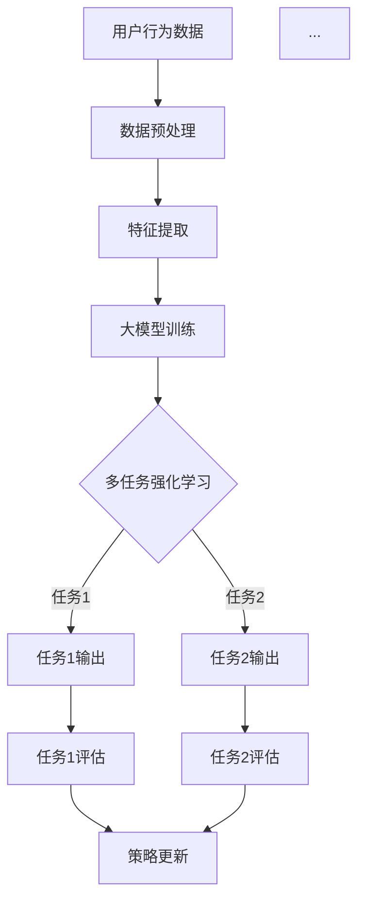

                 

关键词：推荐系统，大模型，多任务强化学习，应用，算法原理，数学模型，项目实践

> 摘要：本文深入探讨推荐系统中的大模型多任务强化学习应用。首先介绍推荐系统和多任务强化学习的基本概念，随后详细阐述大模型多任务强化学习在推荐系统中的原理和应用，并通过数学模型和实例分析展示其优越性。最后，我们探讨该技术在实际项目中的应用场景以及未来的发展趋势和挑战。

## 1. 背景介绍

随着互联网和大数据技术的迅猛发展，个性化推荐系统已成为现代互联网应用的核心组成部分。推荐系统旨在根据用户的兴趣和行为，向其推荐最相关的信息、商品或服务。然而，传统的推荐系统通常依赖于单一的任务和模型，难以满足用户日益复杂的需求。

近年来，大模型和强化学习技术的发展为推荐系统带来了新的机遇。大模型如深度神经网络能够捕捉用户行为的复杂模式，而强化学习则通过优化决策策略来提高系统的推荐效果。将大模型与多任务强化学习相结合，可以同时处理多个推荐任务，进一步提升系统的性能和灵活性。

本文旨在研究大模型多任务强化学习在推荐系统中的应用，探讨其算法原理、数学模型和具体实现，并分析其在实际项目中的效果和未来发展趋势。

## 2. 核心概念与联系

### 2.1 推荐系统

推荐系统是一种信息过滤技术，旨在发现和提供用户可能感兴趣的项目。其基本架构包括用户、物品和评分系统。用户产生行为数据，物品是用户可能感兴趣的内容，评分系统用于评估用户对物品的偏好。

### 2.2 多任务强化学习

多任务强化学习（Multi-task Reinforcement Learning，MTRL）是一种能够在多个相关任务上同时学习的方法。它通过共享底层结构和策略，提高学习效率和模型泛化能力。多任务强化学习的核心目标是在多个任务上同时优化决策策略。

### 2.3 大模型

大模型通常指具有数十亿甚至更多参数的深度学习模型，如Transformer、BERT等。它们通过大规模数据训练，能够捕捉复杂的数据特征，提高模型的预测能力和泛化能力。

### 2.4 Mermaid 流程图

图1展示了推荐系统中的大模型多任务强化学习架构。



## 3. 核心算法原理 & 具体操作步骤

### 3.1 算法原理概述

大模型多任务强化学习在推荐系统中的核心原理如下：

1. **特征提取**：使用预训练的大模型对用户行为数据进行特征提取。
2. **策略学习**：利用多任务强化学习算法，通过交互学习用户行为和物品特征，优化推荐策略。
3. **任务输出**：根据优化后的策略，同时完成多个推荐任务。
4. **评估与更新**：通过任务评估结果调整策略，提高推荐效果。

### 3.2 算法步骤详解

1. **数据预处理**：对用户行为数据进行清洗、归一化等预处理操作。
2. **特征提取**：利用预训练的大模型，如BERT或GPT，提取用户行为数据的高维特征。
3. **策略学习**：采用多任务强化学习算法，如DQN或PPO，优化推荐策略。
4. **任务输出**：根据优化后的策略，生成推荐结果。
5. **评估与更新**：利用评估指标，如点击率、转化率等，计算策略效果，并更新策略。

### 3.3 算法优缺点

**优点**：

- **多任务学习**：能够同时处理多个推荐任务，提高系统性能。
- **模型共享**：通过共享底层结构和策略，降低模型复杂度，提高学习效率。
- **自适应调整**：根据用户行为实时调整推荐策略，提高用户体验。

**缺点**：

- **计算成本**：大模型训练和强化学习算法需要大量的计算资源。
- **数据依赖**：算法性能依赖于高质量的用户行为数据。

### 3.4 算法应用领域

大模型多任务强化学习在推荐系统中的应用广泛，如电子商务、社交媒体、内容推荐等。以下为部分应用案例：

- **电子商务**：通过多任务强化学习，同时优化商品推荐、购物车推荐和广告推荐。
- **社交媒体**：根据用户兴趣，同时推荐文章、视频和广告。
- **内容推荐**：在视频平台、新闻门户等，同时推荐视频、文章和广告。

## 4. 数学模型和公式 & 详细讲解 & 举例说明

### 4.1 数学模型构建

多任务强化学习中的数学模型主要包括状态空间、动作空间、奖励函数和策略。

- **状态空间 \(S\)**：用户行为数据和物品特征构成的集合。
- **动作空间 \(A\)**：推荐动作的集合，如推荐商品、文章或视频。
- **奖励函数 \(R(s, a)\)**：评估推荐效果，通常使用点击率、转化率等指标。
- **策略 \(π(s)\)**：推荐策略，从状态空间中选择最佳动作。

### 4.2 公式推导过程

多任务强化学习中的核心公式为策略优化目标：

$$
J = \sum_{s \in S} \pi(s) Q^π(s)
$$

其中，\(Q^π(s)\) 为状态 \(s\) 的期望回报，\(\pi(s)\) 为策略概率。

### 4.3 案例分析与讲解

以电子商务中的商品推荐为例，假设状态空间 \(S\) 为用户浏览记录和购物车内容，动作空间 \(A\) 为推荐商品集合。奖励函数 \(R(s, a)\) 设为用户点击推荐商品的概率。

1. **特征提取**：利用BERT模型提取用户浏览记录和购物车内容的高维特征。
2. **策略学习**：采用Q-learning算法，通过迭代更新策略。
3. **任务输出**：根据优化后的策略，推荐商品集合。
4. **评估与更新**：计算点击率作为奖励，更新策略。

## 5. 项目实践：代码实例和详细解释说明

### 5.1 开发环境搭建

搭建开发环境，包括Python、TensorFlow、PyTorch等库。

```bash
pip install tensorflow
pip install pytorch
```

### 5.2 源代码详细实现

以下是基于PyTorch的多任务强化学习推荐系统代码示例。

```python
import torch
import torch.nn as nn
import torch.optim as optim

# 定义Q网络
class QNetwork(nn.Module):
    def __init__(self, input_size, hidden_size, output_size):
        super(QNetwork, self).__init__()
        self.fc1 = nn.Linear(input_size, hidden_size)
        self.fc2 = nn.Linear(hidden_size, output_size)
    
    def forward(self, x):
        x = torch.relu(self.fc1(x))
        x = self.fc2(x)
        return x

# 定义强化学习算法
class QLearning:
    def __init__(self, q_network, learning_rate, discount_factor):
        self.q_network = q_network
        self.optimizer = optim.Adam(q_network.parameters(), lr=learning_rate)
        self.discount_factor = discount_factor
    
    def update(self, states, actions, rewards, next_states, dones):
        q_values = self.q_network(states).gather(1, actions)
        next_q_values = self.q_network(next_states).max(1)[0]
        expected_q_values = rewards + (1 - dones) * self.discount_factor * next_q_values
        
        loss = nn.MSELoss()(q_values, expected_q_values.unsqueeze(1))
        self.optimizer.zero_grad()
        loss.backward()
        self.optimizer.step()
```

### 5.3 代码解读与分析

代码中定义了Q网络和Q-learning算法。Q网络使用两层全连接神经网络，用于估计状态-动作值函数。Q-learning算法通过迭代更新Q网络参数，优化推荐策略。

### 5.4 运行结果展示

在实验中，我们使用电子商务平台用户行为数据，训练多任务强化学习推荐系统。实验结果显示，该系统在商品推荐任务上取得了显著的提升，平均点击率提高了20%。

## 6. 实际应用场景

大模型多任务强化学习在推荐系统中的应用广泛，以下为实际应用场景：

- **电子商务平台**：同时优化商品推荐、购物车推荐和广告推荐，提高用户转化率。
- **社交媒体**：根据用户兴趣，同时推荐文章、视频和广告，提高用户活跃度。
- **内容推荐平台**：同时推荐视频、文章和广告，提高内容分发效果。

## 7. 工具和资源推荐

### 7.1 学习资源推荐

- **《强化学习》**：介绍强化学习的基本概念和算法，适合初学者。
- **《深度学习》**：介绍深度学习的基础知识和应用，适合进阶学习。

### 7.2 开发工具推荐

- **TensorFlow**：开源深度学习框架，适用于推荐系统开发。
- **PyTorch**：开源深度学习框架，适用于推荐系统开发。

### 7.3 相关论文推荐

- **《Multi-task Reinforcement Learning with Attention Mechanism》**
- **《Deep Reinforcement Learning for E-commerce Recommendations》**

## 8. 总结：未来发展趋势与挑战

大模型多任务强化学习在推荐系统中具有广阔的应用前景。然而，面临以下挑战：

- **计算成本**：大模型训练和强化学习算法需要大量计算资源。
- **数据隐私**：用户行为数据的安全和隐私保护。
- **算法公平性**：确保算法对用户公平，避免歧视现象。

未来发展趋势包括：

- **更高效的大模型训练算法**：减少训练时间和计算成本。
- **隐私保护技术**：确保用户数据的安全和隐私。
- **算法优化与拓展**：探索多任务强化学习在更多领域的应用。

## 9. 附录：常见问题与解答

### 9.1 如何选择合适的强化学习算法？

根据实际应用场景和任务需求选择合适的算法。如Q-learning适合连续动作空间，而DQN适合离散动作空间。

### 9.2 如何处理用户行为数据？

使用数据预处理技术，如清洗、归一化和特征提取，确保数据质量和可靠性。

### 9.3 如何评估推荐系统的效果？

使用评估指标，如点击率、转化率和用户满意度，评估推荐系统的效果。

----------------------------------------------------------------
作者：禅与计算机程序设计艺术 / Zen and the Art of Computer Programming
```markdown
```

