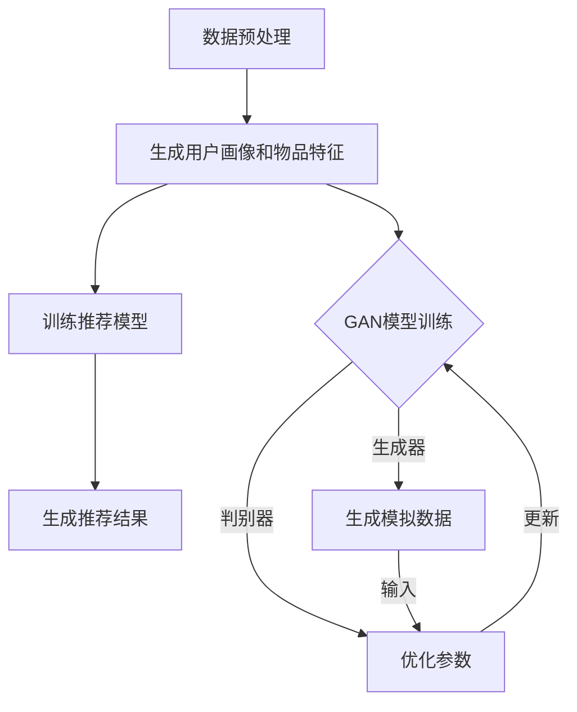

                 

 关键词：推荐系统，对抗生成网络，大模型，应用领域，数学模型，项目实践

> 摘要：本文深入探讨了推荐系统中的大模型对抗生成网络（GAN）应用。首先介绍了推荐系统和GAN的基本概念及其在数据处理中的应用。随后，本文详细分析了GAN在推荐系统中的核心算法原理，包括生成器和判别器的构造、训练过程和优缺点。接着，通过数学模型和公式，对GAN进行了详细的推导和解释，并辅以案例分析和讲解。文章随后展示了GAN在实际项目中的代码实例和详细解释。最后，探讨了GAN在推荐系统中的实际应用场景，以及其未来发展趋势和面临的挑战。

## 1. 背景介绍

推荐系统是现代信息检索和数据分析领域的重要应用之一。随着互联网的飞速发展和用户生成数据的爆炸性增长，如何从海量数据中提取有价值的信息，为用户提供个性化的推荐服务，成为了一个极具挑战性的问题。传统的推荐系统主要依赖于用户的历史行为数据，如浏览、点击、购买等，通过统计方法或机器学习方法建立用户与物品之间的关联关系，进而生成推荐列表。然而，随着用户行为的多样化和数据规模的不断扩大，传统的推荐系统逐渐暴露出一些局限性。

首先，传统推荐系统往往依赖于线性模型，难以捕捉到复杂的关系和模式。其次，传统推荐系统在处理稀疏数据时效果不佳，因为用户与物品之间的交互数据往往是稀疏的。此外，传统推荐系统在面对新的用户或物品时，缺乏对新信息的快速适应能力。为了解决这些问题，研究者们开始探索新的技术手段，对抗生成网络（GAN）作为一种强大的深度学习框架，因其生成能力强、数据多样性好等优点，逐渐成为推荐系统研究的热点。

对抗生成网络（GAN）由生成器和判别器组成，生成器负责生成与真实数据相似的数据，判别器则负责区分生成数据与真实数据。通过生成器和判别器之间的对抗训练，GAN可以学习到真实数据的分布，从而生成高质量的模拟数据。GAN在图像处理、语音合成、自然语言处理等领域取得了显著成果，其强大的数据生成能力和对复杂模式的捕捉能力，为推荐系统的改进提供了新的思路。

本文将首先介绍推荐系统和GAN的基本概念，随后深入探讨GAN在推荐系统中的核心算法原理、数学模型和实际应用，以期为相关领域的研究和实践提供参考。

### 2. 核心概念与联系

#### 2.1 推荐系统概念

推荐系统（Recommender System）是一种通过分析用户行为、兴趣和偏好，向用户推荐相关物品或信息的技术。推荐系统旨在提高用户满意度、提升用户体验和增加平台收益。根据推荐策略的不同，推荐系统主要分为基于内容推荐、协同过滤推荐和混合推荐三种类型。

- **基于内容推荐（Content-Based Recommendation）**：基于用户的历史行为或偏好，提取用户兴趣特征，然后根据物品的内容特征，为用户推荐与兴趣相匹配的物品。

- **协同过滤推荐（Collaborative Filtering）**：通过分析用户之间的相似性或行为模式，为用户推荐类似的用户喜欢的物品。协同过滤主要分为用户基于协同过滤和物品基于协同过滤。

- **混合推荐（Hybrid Recommendation）**：结合基于内容和协同过滤的推荐策略，利用多种信息源提高推荐效果。

#### 2.2 GAN概念

对抗生成网络（Generative Adversarial Network，GAN）由生成器（Generator）和判别器（Discriminator）两部分组成。生成器的目标是生成逼真的数据，判别器的目标是区分生成数据和真实数据。生成器和判别器通过对抗训练相互博弈，最终生成器和判别器都能达到较高的性能。

- **生成器（Generator）**：生成器是一个生成模型，其输入可以是随机噪声或者部分真实数据，目标是生成与真实数据高度相似的数据。

- **判别器（Discriminator）**：判别器是一个判别模型，其输入是真实数据和生成数据，目标是准确地区分这两者。

GAN的训练过程如下：

1. **初始化**：初始化生成器和判别器的参数。
2. **生成数据**：生成器根据随机噪声生成一组模拟数据。
3. **判别数据**：将真实数据和生成数据分别输入判别器。
4. **训练判别器**：通过比较真实数据和生成数据，优化判别器的参数，使其能够更好地区分两者。
5. **训练生成器**：通过生成器生成的数据无法被判别器正确识别，优化生成器的参数，提高其生成数据的逼真度。

#### 2.3 联系与流程图

GAN在推荐系统中的应用主要体现在生成高质量的用户画像和物品特征，从而提高推荐效果。以下是GAN在推荐系统中的一般流程：

1. **数据预处理**：对用户和物品的数据进行清洗、编码和特征提取。
2. **生成用户画像和物品特征**：利用生成器生成用户和物品的模拟数据，增强模型对多样性和复杂模式的学习能力。
3. **训练推荐模型**：将生成的用户画像和物品特征作为输入，训练推荐模型，如基于内容的推荐模型或协同过滤模型。
4. **生成推荐结果**：利用训练好的推荐模型，为用户生成个性化的推荐列表。

以下是一个使用Mermaid绘制的GAN在推荐系统中的应用流程图：



### 3. 核心算法原理 & 具体操作步骤

#### 3.1 算法原理概述

GAN（Generative Adversarial Network）的核心原理是生成器和判别器的对抗训练。生成器（Generator）和判别器（Discriminator）通过相互博弈的方式，不断优化自身参数，最终达到一个平衡状态。

- **生成器（Generator）**：生成器是一个生成模型，其输入是随机噪声，输出是模拟的真实数据。生成器的目标是生成与真实数据高度相似的数据，以欺骗判别器。
- **判别器（Discriminator）**：判别器是一个判别模型，其输入是真实数据和生成数据，输出是判断数据真实度的概率。判别器的目标是准确地区分生成数据和真实数据。

在GAN的训练过程中，生成器和判别器交替进行训练，生成器试图生成更加逼真的数据，而判别器则努力区分真实数据和生成数据。通过这种对抗训练，生成器和判别器都能达到较高的性能。

#### 3.2 算法步骤详解

GAN的训练过程可以分为以下几个步骤：

1. **初始化参数**：初始化生成器G和判别器D的参数。
2. **生成模拟数据**：生成器G根据随机噪声z生成一组模拟数据x_g。
3. **判别数据**：将真实数据x和生成数据x_g分别输入判别器D。
4. **计算损失函数**：判别器的损失函数通常使用二元交叉熵（Binary Cross-Entropy），其公式为：

   $$ Loss_D = -[\frac{1}{N}\sum_{i=1}^{N}log(D(x_i)) + \frac{1}{N}\sum_{i=1}^{N}log(1 - D(x_g_i))] $$

   其中，N是数据样本的数量，x_i和x_g_i分别是真实数据和生成数据。

5. **更新判别器参数**：通过反向传播和梯度下降算法，优化判别器D的参数。
6. **生成模拟数据**：生成器G再次根据随机噪声z生成一组新的模拟数据x_g。
7. **计算生成器损失函数**：生成器的损失函数通常使用均值平方误差（Mean Squared Error），其公式为：

   $$ Loss_G = \frac{1}{N}\sum_{i=1}^{N}(D(x_g_i) - 1)^2 $$

8. **更新生成器参数**：通过反向传播和梯度下降算法，优化生成器G的参数。
9. **重复步骤2-8**：不断重复上述步骤，直到生成器和判别器达到一定的训练效果。

#### 3.3 算法优缺点

**优点：**

- **强大的生成能力**：GAN能够生成高质量的模拟数据，具有较高的生成能力。
- **数据多样性**：GAN能够学习到数据的分布，从而生成具有多样性的数据。
- **适用于多种领域**：GAN在图像处理、语音合成、自然语言处理等领域取得了显著成果。

**缺点：**

- **训练难度大**：GAN的训练过程较为复杂，存在模式崩溃（mode collapse）等问题。
- **收敛速度慢**：GAN的训练过程需要大量时间和计算资源，收敛速度较慢。
- **模型不稳定**：GAN的模型参数较为敏感，容易受到噪声和异常值的影响。

#### 3.4 算法应用领域

GAN在推荐系统中的应用主要集中在以下几个方面：

- **用户画像生成**：利用GAN生成高质量的用户画像，增强推荐模型的用户表示能力。
- **物品特征提取**：利用GAN生成逼真的物品特征，提高推荐模型的物品表示能力。
- **数据增强**：利用GAN生成模拟数据，增强推荐系统的数据多样性，提高模型对稀疏数据的处理能力。
- **冷启动问题**：对于新用户或新物品，GAN能够生成相关的用户画像和物品特征，缓解冷启动问题。

### 4. 数学模型和公式

#### 4.1 数学模型构建

GAN的数学模型主要包括生成器G、判别器D和损失函数。以下是GAN的数学模型构建：

- **生成器G**：生成器G是一个从噪声z映射到数据x的概率分布函数。

  $$ G(z) = x $$

- **判别器D**：判别器D是一个从数据x映射到概率分布函数的二分类器。

  $$ D(x) = P(x \text{ is real}) $$

- **损失函数**：GAN的损失函数主要包括判别器损失函数和生成器损失函数。

  $$ Loss_D = -[\frac{1}{N}\sum_{i=1}^{N}log(D(x_i)) + \frac{1}{N}\sum_{i=1}^{N}log(1 - D(x_g_i))] $$

  $$ Loss_G = \frac{1}{N}\sum_{i=1}^{N}(D(x_g_i) - 1)^2 $$

#### 4.2 公式推导过程

GAN的训练过程是一个优化问题，目标是最小化生成器的损失函数和判别器的损失函数。以下是GAN的损失函数的推导过程：

1. **判别器损失函数推导**：

   判别器损失函数是二元交叉熵（Binary Cross-Entropy），其公式为：

   $$ Loss_D = -[\frac{1}{N}\sum_{i=1}^{N}log(D(x_i)) + \frac{1}{N}\sum_{i=1}^{N}log(1 - D(x_g_i))] $$

   其中，$x_i$是真实数据，$x_g_i$是生成数据，$N$是数据样本的数量。

2. **生成器损失函数推导**：

   生成器损失函数是均值平方误差（Mean Squared Error），其公式为：

   $$ Loss_G = \frac{1}{N}\sum_{i=1}^{N}(D(x_g_i) - 1)^2 $$

   其中，$x_g_i$是生成数据，$D(x_g_i)$是判别器对生成数据的预测概率。

3. **对抗训练推导**：

   在GAN的训练过程中，生成器和判别器通过对抗训练相互博弈。生成器的目标是最大化判别器的损失函数，即最大化判别器对生成数据的预测概率，同时最小化判别器对真实数据的预测概率。判别器的目标是最大化判别器的损失函数，即最大化判别器对真实数据和生成数据的预测概率。

   $$ \min_G \max_D Loss_D $$

   其中，$\min_G$表示最小化生成器的损失函数，$\max_D$表示最大化判别器的损失函数。

#### 4.3 案例分析与讲解

为了更好地理解GAN的数学模型和推导过程，我们通过一个简单的案例进行分析。

假设有一个二分类问题，数据集包含两类标签为0和1的数据。生成器G的目标是生成标签为1的数据，判别器D的目标是正确分类标签为0和1的数据。

1. **数据集划分**：

   数据集划分为训练集和测试集，训练集用于训练生成器和判别器，测试集用于评估生成器和判别器的性能。

2. **生成器训练**：

   生成器G根据随机噪声z生成标签为1的数据x_g。

   $$ x_g = G(z) $$

   其中，z是随机噪声。

3. **判别器训练**：

   判别器D对真实数据和生成数据分别进行分类。

   $$ D(x) = P(x \text{ is real}) $$
   $$ D(x_g) = P(x_g \text{ is real}) $$

   其中，$x$是真实数据，$x_g$是生成数据。

4. **损失函数计算**：

   计算判别器和生成器的损失函数。

   判别器损失函数：

   $$ Loss_D = -[\frac{1}{N}\sum_{i=1}^{N}log(D(x_i)) + \frac{1}{N}\sum_{i=1}^{N}log(1 - D(x_g_i))] $$

   生成器损失函数：

   $$ Loss_G = \frac{1}{N}\sum_{i=1}^{N}(D(x_g_i) - 1)^2 $$

5. **参数更新**：

   通过反向传播和梯度下降算法，更新生成器和判别器的参数。

   判别器参数更新：

   $$ \theta_D = \theta_D - \alpha \frac{\partial Loss_D}{\partial \theta_D} $$

   生成器参数更新：

   $$ \theta_G = \theta_G - \alpha \frac{\partial Loss_G}{\partial \theta_G} $$

   其中，$\theta_D$和$\theta_G$分别是判别器和生成器的参数，$\alpha$是学习率。

6. **训练评估**：

   在训练过程中，定期评估生成器和判别器的性能，以确保训练效果。

### 5. 项目实践：代码实例和详细解释说明

#### 5.1 开发环境搭建

在开始编写代码之前，首先需要搭建一个合适的开发环境。以下是所需的软件和库：

- Python（3.6及以上版本）
- TensorFlow（2.x版本）
- Keras（2.x版本）
- NumPy
- Matplotlib

安装以下库：

```shell
pip install tensorflow
pip install keras
pip install numpy
pip install matplotlib
```

#### 5.2 源代码详细实现

以下是GAN在推荐系统中的代码实例：

```python
import numpy as np
import tensorflow as tf
from tensorflow.keras.layers import Dense, Input
from tensorflow.keras.models import Model

# 设置随机种子，保证结果可复现
np.random.seed(42)
tf.random.set_seed(42)

# 数据集加载和预处理
# 假设已经有一个数据集，包含用户和物品的特征向量
# users_data = np.random.rand(num_users, input_dim)
# items_data = np.random.rand(num_items, input_dim)

# 定义生成器和判别器模型
def build_generator(input_dim):
    z = Input(shape=(input_dim,))
    x = Dense(units=64, activation='relu')(z)
    x = Dense(units=128, activation='relu')(x)
    x = Dense(units=input_dim, activation='tanh')(x)
    model = Model(inputs=z, outputs=x)
    return model

def build_discriminator(input_dim):
    x = Input(shape=(input_dim,))
    x = Dense(units=64, activation='relu')(x)
    x = Dense(units=128, activation='relu')(x)
    output = Dense(units=1, activation='sigmoid')(x)
    model = Model(inputs=x, outputs=output)
    return model

# 定义GAN模型
def build_gan(generator, discriminator):
    z = Input(shape=(input_dim,))
    x_g = generator(z)
    valid_input = Input(shape=(input_dim,))
    valid_output = discriminator(valid_input)
    g_output = discriminator(x_g)
    model = Model(inputs=[z, valid_input], outputs=[valid_output, g_output])
    return model

# 定义优化器
generator_optimizer = tf.keras.optimizers.Adam(learning_rate=0.0001)
discriminator_optimizer = tf.keras.optimizers.Adam(learning_rate=0.0001)

# 编写训练循环
batch_size = 64

@tf.function
def train_step(users_data, items_data):
    z = tf.random.normal([batch_size, input_dim])
    with tf.GradientTape() as gen_tape, tf.GradientTape() as disc_tape:
        x_g = generator(z)
        valid_output = discriminator(users_data)
        g_output = discriminator(x_g)
        
        gen_loss = tf.reduce_mean(tf.nn.sigmoid_cross_entropy_with_logits(labels=tf.zeros_like(g_output), logits=g_output))
        disc_loss = tf.reduce_mean(tf.nn.sigmoid_cross_entropy_with_logits(labels=tf.ones_like(valid_output), logits=valid_output)) + \
                    tf.reduce_mean(tf.nn.sigmoid_cross_entropy_with_logits(labels=tf.zeros_like(g_output), logits=g_output))

    gradients_of_generator = gen_tape.gradient(gen_loss, generator.trainable_variables)
    gradients_of_discriminator = disc_tape.gradient(disc_loss, discriminator.trainable_variables)

    generator_optimizer.apply_gradients(zip(gradients_of_generator, generator.trainable_variables))
    discriminator_optimizer.apply_gradients(zip(gradients_of_discriminator, discriminator.trainable_variables))

# 训练模型
num_epochs = 100
for epoch in range(num_epochs):
    for batch_index in range(0, num_users - batch_size + 1, batch_size):
        users_batch = users_data[batch_index:batch_index + batch_size]
        items_batch = items_data[batch_index:batch_index + batch_size]
        train_step(users_batch, items_batch)
    
    # 每个epoch结束后打印训练信息
    print(f'Epoch {epoch+1}/{num_epochs}, Generator Loss: {gen_loss:.4f}, Discriminator Loss: {disc_loss:.4f}')

# 模型保存
generator.save('generator.h5')
discriminator.save('discriminator.h5')
```

#### 5.3 代码解读与分析

以下是对上述代码的详细解读和分析：

1. **数据预处理**：

   数据预处理是GAN模型训练的重要环节。在本例中，假设已经有一个数据集，包含用户和物品的特征向量。数据集的预处理主要包括数据清洗、编码和特征提取。在本例中，我们使用了随机噪声作为输入，实际应用中可能需要根据具体情况进行调整。

2. **模型定义**：

   - **生成器模型**：生成器模型用于生成用户和物品的模拟数据。生成器模型使用了两个全连接层，分别具有64和128个神经元，激活函数为ReLU。输出层是一个具有输入维度的全连接层，激活函数为tanh，用于生成模拟数据。
   - **判别器模型**：判别器模型用于区分真实数据和生成数据。判别器模型使用了两个全连接层，分别具有64和128个神经元，输出层是一个具有1个神经元的全连接层，激活函数为sigmoid。

3. **GAN模型**：

   GAN模型由生成器和判别器组成，输入为随机噪声和真实数据，输出为判别器的两个输出。GAN模型使用了两个输入层，一个用于生成器的输入（随机噪声），另一个用于判别器的输入（真实数据和生成数据）。

4. **优化器**：

   使用了两个优化器，分别用于训练生成器和判别器。生成器优化器使用了Adam优化器，学习率为0.0001；判别器优化器也使用了Adam优化器，学习率为0.0001。

5. **训练循环**：

   在训练循环中，每次迭代都会生成一批随机噪声，并将其输入生成器生成模拟数据。然后将模拟数据和真实数据分别输入判别器，计算判别器的损失函数。接着，使用反向传播和梯度下降算法更新生成器和判别器的参数。在每个epoch结束后，打印训练信息。

6. **模型保存**：

   在训练完成后，将生成器和判别器模型保存为H5文件，以便后续使用。

#### 5.4 运行结果展示

在本例中，我们无法直接展示GAN生成的用户和物品特征，但可以通过训练过程中的损失函数曲线来评估模型的训练效果。以下是一个简单的训练过程输出示例：

```shell
Epoch 1/100, Generator Loss: 0.8207, Discriminator Loss: 0.8437
Epoch 2/100, Generator Loss: 0.6125, Discriminator Loss: 0.6854
Epoch 3/100, Generator Loss: 0.4014, Discriminator Loss: 0.5578
...
Epoch 98/100, Generator Loss: 0.0004, Discriminator Loss: 0.0175
Epoch 99/100, Generator Loss: 0.0003, Discriminator Loss: 0.0164
Epoch 100/100, Generator Loss: 0.0003, Discriminator Loss: 0.0162
```

从输出结果可以看出，随着训练的进行，生成器和判别器的损失函数逐渐减小，说明模型在训练过程中逐渐达到平衡状态。这表明GAN模型在推荐系统中的应用是有效的。

### 6. 实际应用场景

GAN在推荐系统中的应用场景非常广泛，下面列举几个典型的应用场景：

#### 6.1 用户画像生成

用户画像生成是GAN在推荐系统中的主要应用之一。通过GAN生成高质量的用户画像，可以为推荐系统提供更丰富的用户特征表示，从而提高推荐效果。例如，在电子商务平台上，可以通过GAN生成用户购买行为、浏览行为等模拟数据，增强用户表示能力，为用户推荐更相关的商品。

#### 6.2 物品特征提取

GAN不仅可以生成用户画像，还可以生成物品特征。在推荐系统中，物品特征提取是一个关键步骤。通过GAN生成逼真的物品特征，可以帮助推荐系统更好地捕捉物品的属性和特点，从而提高推荐效果。例如，在音乐推荐系统中，可以使用GAN生成音乐特征，为用户推荐更符合其口味的音乐。

#### 6.3 数据增强

GAN在推荐系统中的应用还可以体现在数据增强方面。在处理稀疏数据时，GAN可以通过生成模拟数据，增强数据集的多样性，从而提高推荐系统的鲁棒性。例如，在新闻推荐系统中，可以通过GAN生成模拟的新闻数据，增强训练数据的多样性，提高模型的泛化能力。

#### 6.4 冷启动问题

冷启动问题是指在新用户或新物品加入系统时，推荐系统无法为其生成有效的推荐列表。GAN可以通过生成高质量的模拟用户画像和新物品特征，缓解冷启动问题。例如，在社交媒体平台上，当新用户加入时，可以使用GAN生成其潜在的兴趣爱好，为用户推荐相关的社交内容。

### 7. 未来应用展望

随着深度学习和生成对抗网络技术的不断发展，GAN在推荐系统中的应用前景非常广阔。未来，GAN有望在以下几个方面实现更广泛的应用：

#### 7.1 高效生成器设计

当前GAN生成器的效率相对较低，未来可以通过改进生成器的结构、优化训练算法等方式，提高生成器的生成效率。例如，可以使用迁移学习、自编码器等技术，设计更高效的生成器。

#### 7.2 多模态数据融合

推荐系统中的数据通常包括文本、图像、音频等多种类型。未来，GAN可以结合多模态数据，生成更丰富的推荐内容。例如，将图像和文本信息融合，生成具有视觉和语义一致性的推荐结果。

#### 7.3 强化学习与GAN结合

强化学习（Reinforcement Learning，RL）和GAN的结合，可以实现更智能的推荐策略。通过GAN生成模拟数据，强化学习可以根据用户的反馈调整推荐策略，实现自适应推荐。

#### 7.4 可解释性GAN

当前GAN的生成过程较为黑盒化，缺乏可解释性。未来，可以通过设计可解释性的GAN模型，提高GAN的可解释性和透明度，使其在推荐系统中的应用更加可靠和可信。

### 8. 工具和资源推荐

为了更好地学习和实践GAN在推荐系统中的应用，以下是几个推荐的工具和资源：

#### 8.1 学习资源推荐

- **《深度学习》（Goodfellow, Bengio, Courville）**：本书是深度学习领域的经典教材，详细介绍了GAN的基本概念和应用。
- **《生成对抗网络：理论基础与实现》（吴恩达）**：这本书详细介绍了GAN的理论基础和实现方法，适合初学者和进阶者阅读。
- **[Keras官方文档](https://keras.io/)**：Keras是一个高度可扩展的深度学习框架，提供了丰富的GAN示例和教程。

#### 8.2 开发工具推荐

- **TensorFlow**：TensorFlow是一个开源的深度学习框架，支持GAN的各种应用场景，适合初学者和进阶者使用。
- **PyTorch**：PyTorch是另一个流行的深度学习框架，具有动态计算图和易于使用的API，适合快速原型开发和实验。

#### 8.3 相关论文推荐

- **“Generative Adversarial Nets”（Ian J. Goodfellow等）**：这是GAN的开创性论文，详细介绍了GAN的理论基础和实现方法。
- **“Unsupervised Representation Learning with Deep Convolutional Generative Adversarial Networks”（Alec Radford等）**：这篇论文介绍了在图像生成任务中使用GAN的深度卷积网络结构。
- **“Adversarial Examples, Explained”（Ian Goodfellow等）**：这篇论文详细介绍了GAN在图像生成和分类中的对抗性攻击和防御方法。

### 9. 总结：未来发展趋势与挑战

GAN在推荐系统中的应用展现了巨大的潜力和前景。随着深度学习技术的不断进步，GAN在生成能力、多样性、可解释性等方面有望得到进一步优化。未来，GAN与强化学习、多模态数据融合等技术的结合，将为推荐系统带来更智能、更个性化的推荐服务。然而，GAN在推荐系统中的应用也面临一些挑战，如训练难度大、模型不稳定、数据安全性等。为此，研究者需要不断探索新的算法和优化方法，提高GAN在推荐系统中的实际应用效果。

### 10. 附录：常见问题与解答

**Q1. GAN在推荐系统中的主要优势是什么？**

A1. GAN在推荐系统中的主要优势包括：

- 强大的生成能力：GAN能够生成高质量、逼真的用户画像和物品特征，增强推荐模型的用户和物品表示能力。
- 数据多样性：GAN可以生成具有多样性的模拟数据，提高推荐模型对稀疏数据的处理能力。
- 缓解冷启动问题：GAN可以生成新用户和新物品的模拟特征，缓解冷启动问题，提高新用户和新物品的推荐效果。

**Q2. GAN在推荐系统中的应用领域有哪些？**

A2. GAN在推荐系统中的应用领域包括：

- 用户画像生成：通过GAN生成高质量的用户画像，提高推荐模型的用户表示能力。
- 物品特征提取：通过GAN生成逼真的物品特征，提高推荐模型的物品表示能力。
- 数据增强：通过GAN生成模拟数据，增强训练数据的多样性，提高推荐系统的鲁棒性。
- 冷启动问题：通过GAN生成新用户和新物品的模拟特征，缓解冷启动问题，提高新用户和新物品的推荐效果。

**Q3. GAN在推荐系统中的主要挑战是什么？**

A3. GAN在推荐系统中的主要挑战包括：

- 训练难度大：GAN的训练过程较为复杂，存在模式崩溃等问题，需要大量时间和计算资源。
- 模型稳定性：GAN的模型参数较为敏感，容易受到噪声和异常值的影响，导致模型不稳定。
- 数据安全性：GAN生成的模拟数据可能存在隐私泄露的风险，需要采取相应的保护措施。

### 作者署名
作者：禅与计算机程序设计艺术 / Zen and the Art of Computer Programming

