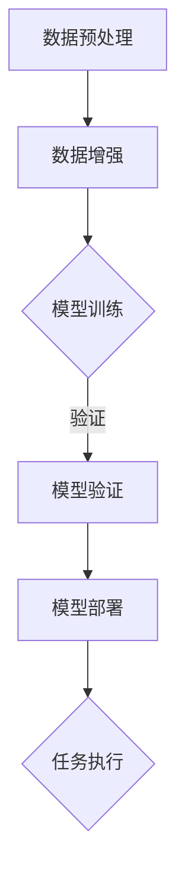

                 

关键词：大模型应用，AI效率，算法优化，数学模型，实践案例

> 摘要：本文深入探讨了人工智能领域中的大模型应用及其对提高工作效率的直接影响。通过分析核心概念、算法原理、数学模型和实际项目案例，本文旨在为读者提供一个全面而详细的视角，揭示大模型在AI研究和应用中的潜力和挑战。

## 1. 背景介绍

随着人工智能技术的飞速发展，大模型（Large Models）逐渐成为研究的热点。大模型是指参数规模庞大、结构复杂的人工神经网络模型，它们能够处理海量数据并提取丰富的特征，从而实现卓越的性能表现。近年来，以GPT-3、BERT、AlphaFold等为代表的大模型在自然语言处理、计算机视觉、生物信息学等领域取得了显著的成果，引发了广泛的关注。

大模型的应用不仅极大地推动了AI技术的进步，也为实际工作带来了显著的效率提升。然而，大模型的训练和部署面临着计算资源、存储空间和能耗等方面的挑战。因此，本文将深入探讨大模型在AI研究和应用中的具体效果，分析其优缺点，并展望未来的发展趋势。

## 2. 核心概念与联系

为了更好地理解大模型的应用，首先需要掌握以下几个核心概念：

### 2.1 人工智能

人工智能（Artificial Intelligence，AI）是指通过计算机程序实现人类智能的技术。它涵盖了机器学习、深度学习、自然语言处理等多个领域。人工智能的目标是使计算机具备类似人类的感知、推理、学习和决策能力。

### 2.2 机器学习

机器学习（Machine Learning，ML）是人工智能的一个分支，主要研究如何从数据中自动提取规律和模式。机器学习算法可以分为监督学习、无监督学习和强化学习等类型。

### 2.3 深度学习

深度学习（Deep Learning，DL）是机器学习的一种方法，通过构建多层神经网络来实现复杂的特征提取和决策。深度学习在图像识别、语音识别和自然语言处理等领域取得了突破性进展。

### 2.4 大模型

大模型是指参数规模巨大、结构复杂的人工神经网络模型。大模型的训练通常需要大量的数据和计算资源，但它们在处理复杂任务时表现出色，具有强大的泛化能力和学习能力。

### 2.5 人工智能架构

人工智能架构是指实现人工智能系统的硬件和软件基础设施。大模型的训练和部署需要高性能的计算设备、高效的存储系统和优化的软件框架。

### 2.6 Mermaid流程图

为了更直观地展示大模型的应用流程，我们可以使用Mermaid流程图来描述。以下是Mermaid流程图的示例：

在这个流程图中，数据预处理和数据增强是模型训练的前提，模型训练是核心步骤，模型验证和模型部署是确保模型性能的关键环节，最终实现任务执行。

## 3. 核心算法原理 & 具体操作步骤

### 3.1 算法原理概述

大模型的核心算法是深度学习。深度学习通过构建多层神经网络来实现复杂的特征提取和决策。大模型的训练过程主要包括以下步骤：

1. 数据预处理：对原始数据进行分析和清洗，将数据转换为适合训练的格式。
2. 数据增强：通过数据变换和扩充，提高训练数据的多样性，增强模型的泛化能力。
3. 模型初始化：随机初始化神经网络参数，为训练过程做准备。
4. 前向传播：将输入数据传递到神经网络的前层，逐层计算输出。
5. 反向传播：计算输出误差，反向传播误差，更新网络参数。
6. 模型优化：通过优化算法（如SGD、Adam等）调整网络参数，提高模型性能。
7. 模型验证：使用验证数据集评估模型性能，调整模型参数。

### 3.2 算法步骤详解

下面详细解释大模型训练的每个步骤：

### 3.2.1 数据预处理

数据预处理是深度学习的基础步骤。它包括以下任务：

1. 数据清洗：去除噪声数据、缺失数据和异常数据。
2. 数据转换：将原始数据转换为统一的格式，如归一化、标准化等。
3. 数据编码：将类别型数据转换为数值型数据，如使用独热编码或标签编码。

### 3.2.2 数据增强

数据增强是通过变换和扩充原始数据，提高模型的泛化能力。常见的数据增强方法包括：

1. 装换：对图像进行旋转、翻转、缩放等操作。
2. 切割：将图像或数据切割成多个小块，重新组合。
3. 生成：使用生成对抗网络（GAN）生成新的数据。

### 3.2.3 模型初始化

模型初始化是随机初始化神经网络参数的过程。常见的初始化方法包括：

1. 随机初始化：随机生成网络参数的值。
2. 确定性初始化：根据特定的规则生成网络参数的值。

### 3.2.4 前向传播

前向传播是指将输入数据传递到神经网络的前层，逐层计算输出。前向传播的过程包括：

1. 输入层：接收输入数据。
2. 隐藏层：对输入数据进行特征提取和变换。
3. 输出层：产生最终输出。

### 3.2.5 反向传播

反向传播是指计算输出误差，反向传播误差，更新网络参数。反向传播的过程包括：

1. 计算误差：计算输出层和隐藏层的误差。
2. 反向传播误差：将误差反向传播到前一层。
3. 更新参数：根据误差更新网络参数。

### 3.2.6 模型优化

模型优化是指通过优化算法调整网络参数，提高模型性能。常见的优化算法包括：

1. 随机梯度下降（SGD）：根据梯度方向调整参数。
2. Adam优化器：结合SGD和矩

