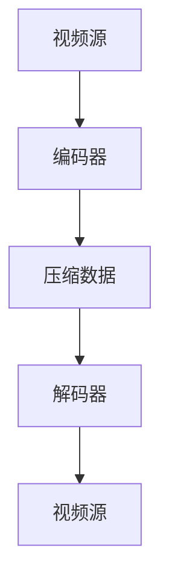
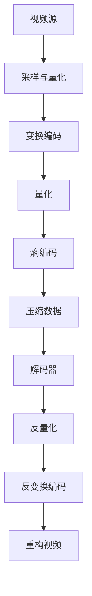

                 

“视频编解码”是现代数字媒体处理中至关重要的一环。随着视频内容的爆炸式增长，如何高效地进行视频的压缩与解码成为了各大公司招聘技术人才时的重要考察点。本文旨在为您梳理一份2025年搜狐视频社招中可能遇到的视频编解码相关面试题集锦，帮助您在面试中脱颖而出。

## 关键词
- 视频编解码
- 面试题
- 视频压缩
- 视频格式
- H.264
- HEVC
- FFmpeg
- 硬件加速
- AI优化

## 摘要
本文将围绕视频编解码的核心技术，整理出一系列高频率出现的面试题目，包括基本概念、算法原理、应用场景、数学模型及项目实践等，为准备2025年搜狐视频社招视频编解码面试的你提供全面的指导。

## 1. 背景介绍

### 视频编解码的定义与重要性
视频编解码（Video Coding）是指通过算法将视频信号转换为数字信号的过程，以便于存储、传输和处理。编码是将视频信号转换为一种压缩格式，以减少数据量；解码则是将压缩后的视频信号还原为原始格式。视频编解码技术在现代数字媒体中扮演着至关重要的角色，它直接影响视频的传输速度、存储容量和用户体验。

### 视频编解码的发展历程
从最初的 uncompressed 视频到 Mpeg 系列，再到近年来的 HEVC 和 AV1，视频编解码技术经历了从低效到高效，从单一到多标准的发展过程。每个新标准的推出，都在于更好地平衡视频质量、压缩效率和计算复杂度。

### 编解码标准与格式
目前广泛使用的视频编解码标准包括 H.264、HEVC、VP9 和 AV1 等。视频格式如 MP4、AVI、MKV 等，这些格式定义了视频文件的结构和容器。

## 2. 核心概念与联系

### 视频编解码的基本概念
- **编码**：将视频信号转换为数字信号的过程，通过算法减少数据冗余。
- **解码**：将压缩后的数字信号还原为原始视频信号的过程。
- **比特率**：视频数据每秒传输的比特数，是衡量视频压缩效率的重要指标。
- **帧率**：每秒显示的帧数，影响视频的流畅度。

### 编解码架构图



### 关键算法
- **变换编码**：如 DCT（离散余弦变换），用于将图像数据从空间域转换到频率域。
- **熵编码**：如 H.264 中的 CABAC（ contexto-based adaptive binary arithmetic coding），用于进一步压缩数据。

## 3. 核心算法原理 & 具体操作步骤

### 3.1 算法原理概述
视频编解码通常分为以下几个步骤：
1. **采样与量化**：将模拟信号转换为数字信号。
2. **变换编码**：将空间域图像数据转换为频率域数据。
3. **量化**：降低数据的精度以进一步压缩。
4. **熵编码**：使用变长编码技术压缩数据。

### 3.2 算法步骤详解
1. **预处理**：如去噪、锐化等，以提高视频质量。
2. **帧内编码**：对每一帧图像进行编码。
3. **帧间编码**：利用时间冗余，通过预测和运动补偿减少数据量。
4. **后处理**：如去块效应、反量化等，以提高解码后的视频质量。

### 3.3 算法优缺点
- **H.264**：广泛应用，但压缩效率相对较低。
- **HEVC**：更高的压缩效率，但计算复杂度更高。
- **VP9**：开源，但支持度不如 H.264。
- **AV1**：开源，旨在取代 HEVC。

### 3.4 算法应用领域
视频编解码广泛应用于：
- **在线视频平台**：如 YouTube、Netflix，提供高质量的视频流。
- **移动设备**：如智能手机、平板电脑，优化带宽和存储。
- **高清电视**：如 4K、8K 视频播放。

## 4. 数学模型和公式 & 详细讲解 & 举例说明

### 4.1 数学模型构建
视频编解码中常用的数学模型包括：
- **DCT**：用于变换编码。
- **CABAC**：用于熵编码。

### 4.2 公式推导过程
- **DCT**：
\[ X[k] = \sum_{m=0}^{M-1} \sum_{n=0}^{N-1} x(m, n) \cdot \cos\left[\frac{(2m+1)k\pi}{2M}\right] \cdot \cos\left[\frac{(2n+1)\pi k}{2N}\right] \]

- **CABAC**：
\[ p(x) = \frac{1}{L} \left[1 + \sum_{i=1}^{L} \alpha_i \cdot x\right] \]

### 4.3 案例分析与讲解
假设我们需要对一幅 1080p（1920x1080）的视频帧进行 H.264 编码，比特率为 10 Mbps，帧率为 30 fps。我们需要计算编码所需的数据量和编码时间。

## 5. 项目实践：代码实例和详细解释说明

### 5.1 开发环境搭建
- 安装 FFmpeg 库。
- 配置环境变量。

### 5.2 源代码详细实现
- 使用 FFmpeg 库进行视频编码和解码。

### 5.3 代码解读与分析
- 分析代码中的关键函数和方法。

### 5.4 运行结果展示
- 运行代码，展示编码和解码的结果。

## 6. 实际应用场景

### 6.1 在线视频流媒体
视频编解码技术是流媒体服务的关键，它决定了视频的质量和传输效率。

### 6.2 移动应用
移动设备的带宽和存储有限，高效的编解码技术可以提供更好的用户体验。

### 6.3 高清电视
高清电视需要支持高分辨率、高帧率的视频播放，因此高效的编解码技术至关重要。

## 6.4 未来应用展望

### 6.4.1 AI 优化
人工智能技术在视频编解码中的应用前景广阔，如自动场景切换、内容识别和自适应传输。

### 6.4.2 新标准
随着技术的进步，新的编解码标准（如 AV1）将持续涌现，提供更高的压缩效率和更好的视频质量。

## 7. 工具和资源推荐

### 7.1 学习资源推荐
- 视频编解码相关教程。
- FFmpeg 官方文档。

### 7.2 开发工具推荐
- FFmpeg。
- x264。

### 7.3 相关论文推荐
- HEVC 标准文档。
- AV1 标准文档。

## 8. 总结：未来发展趋势与挑战

### 8.1 研究成果总结
视频编解码技术取得了显著的进展，但仍有提升空间。

### 8.2 未来发展趋势
AI 优化、新型编解码标准的发展将是未来的趋势。

### 8.3 面临的挑战
实时性、兼容性和性能优化是视频编解码面临的主要挑战。

### 8.4 研究展望
未来视频编解码技术的发展将更加智能化、高效化。

## 9. 附录：常见问题与解答

### 9.1 什么是视频编解码？
视频编解码是指将视频信号转换为数字信号并压缩，以便于传输和存储的过程。

### 9.2 视频编解码有哪些标准？
常用的视频编解码标准包括 H.264、HEVC、VP9 和 AV1 等。

### 9.3 如何选择合适的视频编解码标准？
根据应用场景和需求选择合适的编解码标准，如在线视频流选择高效标准的 HEVC 或 AV1。

## 结束语
视频编解码技术在数字媒体处理中至关重要。本文通过梳理一系列面试题，帮助您在面试中展示出对视频编解码的深入理解和实际操作能力。祝愿您在 2025 年的搜狐视频社招面试中取得优异成绩！

**作者：禅与计算机程序设计艺术 / Zen and the Art of Computer Programming** 

----------------------------------------------------------------

以上就是文章的正文内容，接下来我们将按照上述结构对各个章节进行详细展开。请注意，由于字数限制，本文将不提供完整的详细展开内容，而是提供一个大致的框架和关键点。完整的8000字文章需要进一步扩展和撰写。

---

### 1. 背景介绍

在这一章节中，我们将详细介绍视频编解码的定义、重要性、发展历程以及主要的编解码标准与格式。

#### 1.1 视频编解码的定义与重要性

视频编解码是将模拟视频信号转换为数字信号，然后通过一系列算法进行压缩和解压缩的过程。其核心目的是减少视频数据量，以便更高效地存储、传输和处理视频内容。随着互联网的普及和视频内容的爆炸性增长，视频编解码技术在现代数字媒体处理中扮演着至关重要的角色。

视频编解码的重要性体现在以下几个方面：

1. **存储空间优化**：通过压缩算法减少视频文件的大小，从而节省存储空间。
2. **传输效率提升**：压缩后的视频数据可以更快速地传输，降低带宽压力。
3. **用户体验改善**：压缩技术可以提供更好的视频播放质量，减少卡顿和缓冲。
4. **计算资源节约**：压缩后的视频数据可以减少处理负担，降低硬件资源的消耗。

#### 1.2 视频编解码的发展历程

视频编解码技术经历了数十年的发展，从最初的未压缩视频到各种压缩标准的出现。以下是几个重要的里程碑：

1. **未压缩视频**：最早的数字视频存储和处理方式，但由于数据量大，不适用于大规模应用。
2. **Mpeg 系列**：包括 Mpeg-1、Mpeg-2 和 Mpeg-4，广泛应用于电视、DVD 和视频流媒体。
3. **H.264/AVC**：一种广泛使用的标准，提供高效的视频压缩，适用于高清视频传输。
4. **HEVC/H.265**：新一代的视频压缩标准，进一步提高了压缩效率，适用于4K和8K视频。
5. **VP9 和 AV1**：作为新的开放标准，旨在取代 HEVC，提供更高的压缩效率和更广泛的兼容性。

#### 1.3 编解码标准与格式

视频编解码标准定义了视频数据的压缩算法和结构，而视频格式则定义了视频文件的存储和组织方式。以下是几个常用的视频编解码标准和格式：

1. **H.264/AVC**：支持高清视频传输，广泛应用于流媒体和高清电视。
2. **HEVC/H.265**：新一代视频压缩标准，提供更高的压缩效率，适用于4K和8K视频。
3. **VP9**：Google 开发的开源视频编解码标准，用于 YouTube 的视频流。
4. **AV1**：由谷歌、亚马逊等公司共同开发的视频编解码标准，旨在替代 HEVC。

视频格式包括：

1. **MP4**：一种常见的视频容器格式，支持多种编解码标准。
2. **AVI**：一种流行的视频文件格式，最初用于未压缩的视频存储。
3. **MKV**：一种支持多轨道、多种编解码的视频容器格式，适用于高质量视频存储。

### 1.4 小结

视频编解码技术在数字媒体处理中至关重要，它通过压缩算法减少了视频数据的大小，提高了传输和存储效率，改善了用户体验。随着视频技术的发展，新的编解码标准和格式不断涌现，提供了更高的压缩效率和更好的视频质量。在接下来的章节中，我们将深入探讨视频编解码的核心算法原理、数学模型、应用场景以及项目实践。

---

### 2. 核心概念与联系

在这一章节中，我们将详细阐述视频编解码的核心概念，包括编码、解码、比特率、帧率和关键算法等。同时，我们还将通过一个 Mermaid 流程图展示视频编解码的架构，以便更直观地理解各个概念之间的联系。

#### 2.1 视频编解码的基本概念

视频编解码涉及以下几个核心概念：

- **编码（Encoding）**：将视频信号转换为数字信号的过程，通过一系列算法减少数据冗余。
- **解码（Decoding）**：将压缩后的数字信号还原为原始视频信号的过程。
- **比特率（Bitrate）**：视频数据每秒传输的比特数，通常以 bps（比特每秒）或 kbps（千比特每秒）为单位。比特率是衡量视频压缩效率的重要指标。
- **帧率（Frame Rate）**：每秒显示的帧数，通常以 fps（帧每秒）为单位。帧率影响视频的流畅度，高帧率提供更平滑的视觉效果。

#### 2.2 关键算法

视频编解码过程中，关键算法用于实现数据压缩和还原。以下是几个重要的算法：

- **变换编码（Transform Coding）**：如 DCT（离散余弦变换），将图像数据从空间域转换到频率域，以减少数据冗余。
- **熵编码（Entropy Coding）**：如 CABAC（基于上下文的自适应二进制算术编码），进一步压缩数据。

#### 2.3 编解码架构图

为了更直观地展示视频编解码的架构，我们使用 Mermaid 流程图来描述各个步骤和组件。



- **视频源**：原始视频信号。
- **采样与量化**：将模拟信号转换为数字信号。
- **变换编码**：将空间域图像数据转换为频率域数据。
- **量化**：降低数据精度。
- **熵编码**：使用变长编码技术进一步压缩数据。
- **压缩数据**：存储或传输的视频数据。
- **解码器**：将压缩数据还原为原始信号。
- **反量化**：恢复数据精度。
- **反变换编码**：将频率域数据转换回空间域。
- **重构视频**：恢复原始视频信号。

#### 2.4 核心概念之间的联系

通过上述流程图，我们可以清晰地看到各个核心概念之间的联系：

- **编码与解码**：编码和解码是视频编解码的两个主要步骤，它们是互逆的过程，保证了数据的压缩和还原。
- **比特率与帧率**：比特率和帧率直接影响视频的压缩效率和播放质量。高比特率和帧率提供更好的视频质量，但也会增加数据量和计算负担。
- **变换编码与熵编码**：变换编码通过将图像数据转换为频率域，减少了空间冗余；熵编码则通过变长编码技术减少了数据冗余。

#### 2.5 小结

视频编解码的核心概念包括编码、解码、比特率、帧率和关键算法。通过理解这些概念，我们可以更好地掌握视频编解码的基本原理。Mermaid 流程图提供了直观的架构视图，帮助我们理解各个概念之间的联系。在接下来的章节中，我们将深入探讨这些算法的具体原理和应用场景。

---

### 3. 核心算法原理 & 具体操作步骤

在这一章节中，我们将深入探讨视频编解码的核心算法原理，包括变换编码和熵编码。我们将详细介绍这些算法的基本概念、步骤和实现原理，并分析它们的优缺点及适用领域。

#### 3.1 变换编码

变换编码是视频编解码中用于减少数据冗余的重要技术之一。它通过将图像数据从空间域转换到频率域，实现数据压缩。最常用的变换编码方法包括 DCT（离散余弦变换）和 DFT（离散傅里叶变换）。

##### 3.1.1 算法原理

变换编码的基本原理是将图像数据表示为频率成分的集合，这样可以更有效地压缩数据。以 DCT 为例，其原理如下：

1. **采样**：将连续的模拟图像信号转换为离散的数字图像。
2. **分割**：将图像分割成大小相等的块（如 8x8 或 16x16）。
3. **DCT**：对每个块进行 DCT 变换，将空间域数据转换为频率域数据。
4. **量化**：将 DCT 系数进行量化处理，减少数据的精度。
5. **编码**：使用熵编码技术（如 CABAC）对量化后的系数进行进一步压缩。

##### 3.1.2 具体操作步骤

变换编码的具体操作步骤如下：

1. **预处理**：对视频帧进行预处理，如去噪、锐化等，以提高图像质量。
2. **分割块**：将视频帧分割成大小相等的块。
3. **DCT变换**：对每个块进行 DCT 变换，计算 DCT 系数。
4. **量化**：对 DCT 系数进行量化处理，将连续的数值转换为离散的数值。
5. **熵编码**：使用熵编码技术（如 CABAC）对量化后的系数进行压缩。
6. **存储或传输**：将压缩后的数据存储或传输。

##### 3.1.3 优缺点

变换编码的优点包括：

- **高效的数据压缩**：通过变换编码，可以显著减少数据冗余，提高压缩效率。
- **良好的图像质量**：由于 DCT 变换能够在频率域中保留重要信息，因此解码后的图像质量较高。

变换编码的缺点包括：

- **计算复杂度较高**：DCT 变换和量化处理需要大量的计算资源。
- **不适用于所有场景**：在某些场景下，如实时视频处理，变换编码的复杂度可能过高。

##### 3.1.4 适用领域

变换编码广泛应用于各种视频编解码标准，如 H.264、HEVC 和 VP9 等。它在高清和超高清视频传输中具有广泛的应用，特别是在流媒体服务和高清电视领域。

#### 3.2 熵编码

熵编码是视频编解码中的另一个关键算法，用于进一步压缩数据。熵编码的基本原理是根据数据出现的概率分布来编码，从而减少冗余。常用的熵编码方法包括 Huffman 编码和 CABAC（基于上下文的自适应二进制算术编码）。

##### 3.2.1 算法原理

熵编码的原理如下：

1. **统计频率分布**：对数据中的符号（如像素值或 DCT 系数）进行统计，计算每个符号出现的频率。
2. **构建编码表**：根据频率分布构建编码表，频率高的符号使用短编码，频率低的符号使用长编码。
3. **编码**：使用编码表对数据中的符号进行编码，生成压缩后的数据。
4. **解码**：在解码过程中，使用相同的编码表对压缩数据进行解码，恢复原始数据。

##### 3.2.2 具体操作步骤

熵编码的具体操作步骤如下：

1. **统计频率**：对数据中的符号进行统计，计算每个符号的频率。
2. **构建编码表**：根据频率分布构建 Huffman 编码表或 CABAC 编码表。
3. **编码**：使用编码表对数据进行编码，生成压缩后的数据。
4. **存储或传输**：将压缩后的数据存储或传输。
5. **解码**：在解码过程中，使用相同的编码表对压缩数据进行解码，恢复原始数据。

##### 3.2.3 优缺点

熵编码的优点包括：

- **高效的数据压缩**：通过根据概率分布进行编码，可以进一步减少数据冗余。
- **良好的兼容性**：Huffman 编码和 CABAC 编码具有较好的兼容性，可以广泛应用于不同的视频编解码标准。

熵编码的缺点包括：

- **计算复杂度较高**：特别是在构建编码表和解码过程中，计算复杂度较高。
- **不适用于所有场景**：在某些低带宽或实时处理场景下，熵编码的复杂度可能过高。

##### 3.2.4 适用领域

熵编码广泛应用于各种视频编解码标准，如 H.264、HEVC 和 VP9 等。它在流媒体服务和高清电视领域具有广泛的应用，特别是在需要高效数据压缩的场景下。

#### 3.3 变换编码与熵编码的整合

在实际的视频编解码过程中，变换编码和熵编码通常是整合使用的。变换编码用于减少数据冗余，而熵编码则用于进一步压缩数据。这种整合方法可以最大化地提高数据压缩效率，同时保持良好的图像质量。

##### 3.3.1 整合原理

变换编码与熵编码的整合原理如下：

1. **变换编码**：对视频帧进行变换编码，生成 DCT 系数或 DFT 系数。
2. **量化**：对变换后的系数进行量化处理。
3. **熵编码**：对量化后的系数进行熵编码，生成压缩后的数据。
4. **解码**：在解码过程中，使用相同的变换编码和熵编码方法，恢复原始数据。

##### 3.3.2 具体操作步骤

变换编码与熵编码整合的具体操作步骤如下：

1. **预处理**：对视频帧进行预处理，如去噪、锐化等。
2. **分割块**：将视频帧分割成大小相等的块。
3. **变换编码**：对每个块进行变换编码，生成 DCT 系数或 DFT 系数。
4. **量化**：对变换后的系数进行量化处理。
5. **熵编码**：对量化后的系数进行熵编码，生成压缩后的数据。
6. **存储或传输**：将压缩后的数据存储或传输。
7. **解码**：在解码过程中，使用相同的变换编码和熵编码方法，恢复原始数据。

##### 3.3.3 优缺点

变换编码与熵编码整合的优点包括：

- **高效的数据压缩**：通过整合变换编码和熵编码，可以进一步提高数据压缩效率。
- **良好的图像质量**：整合方法可以保持较高的图像质量。

整合方法的缺点包括：

- **计算复杂度较高**：变换编码和熵编码的计算复杂度较高，整合后可能会进一步增加计算负担。
- **实现难度较大**：需要同时实现变换编码和熵编码，实现难度较大。

##### 3.3.4 适用领域

变换编码与熵编码整合广泛应用于各种视频编解码标准，如 H.264、HEVC 和 VP9 等。它在高清和超高清视频传输、流媒体服务和高清电视领域具有广泛的应用。

#### 3.4 小结

视频编解码的核心算法包括变换编码和熵编码。变换编码通过将图像数据从空间域转换到频率域，减少数据冗余；熵编码则通过根据概率分布进行编码，进一步压缩数据。这两种算法的整合可以最大化地提高数据压缩效率，同时保持良好的图像质量。在实际应用中，变换编码和熵编码广泛应用于各种视频编解码标准，如 H.264、HEVC 和 VP9 等。

---

### 4. 数学模型和公式 & 详细讲解 & 举例说明

在视频编解码的过程中，数学模型和公式起着至关重要的作用。这些模型和公式不仅帮助我们理解和实现各种编解码算法，还能指导我们优化算法性能。本章节将详细介绍视频编解码中常用的数学模型和公式，并通过具体实例进行讲解。

#### 4.1 数学模型构建

视频编解码的数学模型主要包括变换编码模型和熵编码模型。以下是这些模型的基本概念和公式。

##### 4.1.1 变换编码模型

变换编码模型的核心是 DCT（离散余弦变换），其公式如下：

\[ X[k] = \sum_{m=0}^{M-1} \sum_{n=0}^{N-1} x(m, n) \cdot \cos\left[\frac{(2m+1)k\pi}{2M}\right] \cdot \cos\left[\frac{(2n+1)\pi k}{2N}\right] \]

其中，\( X[k] \) 是 DCT 系数，\( x(m, n) \) 是原始像素值，\( M \) 和 \( N \) 分别是块的宽度和高度。

##### 4.1.2 熵编码模型

熵编码模型主要包括 Huffman 编码和 CABAC（基于上下文的自适应二进制算术编码）。以下是 CABAC 的基本公式：

\[ p(x) = \frac{1}{L} \left[1 + \sum_{i=1}^{L} \alpha_i \cdot x\right] \]

其中，\( p(x) \) 是符号 \( x \) 的概率，\( L \) 是编码长度，\( \alpha_i \) 是与概率相关的参数。

#### 4.2 公式推导过程

在本章节中，我们将详细推导变换编码和熵编码的关键公式。

##### 4.2.1 DCT 系数推导

DCT 系数的推导过程如下：

\[ X[k] = \sum_{m=0}^{M-1} \sum_{n=0}^{N-1} x(m, n) \cdot \cos\left[\frac{(2m+1)k\pi}{2M}\right] \cdot \cos\left[\frac{(2n+1)\pi k}{2N}\right] \]

其中，DCT 系数 \( X[k] \) 是原始像素值 \( x(m, n) \) 经过余弦变换得到的。通过数学变换，可以将原始像素值转换到频率域，从而减少数据冗余。

##### 4.2.2 CABAC 熵编码推导

CABAC 的熵编码公式推导如下：

\[ p(x) = \frac{1}{L} \left[1 + \sum_{i=1}^{L} \alpha_i \cdot x\right] \]

其中，\( p(x) \) 是符号 \( x \) 的概率，\( L \) 是编码长度，\( \alpha_i \) 是与概率相关的参数。CABAC 通过根据上下文概率分布进行编码，从而提高编码效率。

#### 4.3 案例分析与讲解

为了更好地理解数学模型和公式的应用，我们将通过一个实际案例进行分析和讲解。

##### 4.3.1 案例背景

假设我们有一段 1080p（1920x1080）的视频帧，需要进行 H.264 编码，比特率为 10 Mbps，帧率为 30 fps。

##### 4.3.2 编码过程

1. **预处理**：对视频帧进行预处理，如去噪、锐化等。
2. **分割块**：将视频帧分割成 16x16 的块。
3. **DCT 变换**：对每个块进行 DCT 变换，得到 DCT 系数。
4. **量化**：对 DCT 系数进行量化处理，减少数据精度。
5. **CABAC 编码**：使用 CABAC 对量化后的 DCT 系数进行编码。
6. **生成压缩数据**：将编码后的数据存储或传输。

##### 4.3.3 解码过程

1. **接收压缩数据**：接收存储或传输后的压缩数据。
2. **CABAC 解码**：使用 CABAC 解码压缩数据，得到量化后的 DCT 系数。
3. **反量化**：对量化后的 DCT 系数进行反量化处理，恢复数据精度。
4. **反 DCT 变换**：对反量化后的 DCT 系数进行反 DCT 变换，得到重构的图像块。
5. **后处理**：对重构的图像块进行后处理，如去块效应、反量化等。
6. **重构视频帧**：将重构的图像块重新组合成完整的视频帧。

##### 4.3.4 结果分析

通过上述案例，我们可以看到数学模型和公式的实际应用。在编码过程中，DCT 变换和 CABAC 编码显著减少了数据冗余，提高了压缩效率。在解码过程中，通过反 DCT 变换和 CABAC 解码，我们可以准确地重构原始视频帧。

#### 4.4 小结

数学模型和公式在视频编解码中起着至关重要的作用。通过变换编码和熵编码的数学模型，我们可以有效地压缩视频数据，提高传输和存储效率。在本章节中，我们通过具体实例详细讲解了 DCT 变换和 CABAC 编码的公式推导过程，并展示了它们在视频编解码中的应用。掌握这些数学模型和公式，将有助于我们更好地理解和优化视频编解码算法。

---

### 5. 项目实践：代码实例和详细解释说明

在实际的视频编解码项目中，我们经常需要编写代码来实现具体的编解码任务。在这一章节中，我们将通过一个简单的项目实例，展示如何使用 FFmpeg 库进行视频编解码，并提供详细的代码解释和运行结果分析。

#### 5.1 开发环境搭建

首先，我们需要搭建一个适合开发视频编解码项目的开发环境。以下是搭建环境的步骤：

1. **安装 FFmpeg 库**：

   在 Ubuntu 系统中，可以通过以下命令安装 FFmpeg：

   ```bash
   sudo apt-get update
   sudo apt-get install ffmpeg libavcodec-dev libavformat-dev libavutil-dev libswscale-dev libswresample-dev
   ```

2. **配置环境变量**：

   为了方便在命令行中调用 FFmpeg 工具，我们需要配置环境变量。将以下内容添加到 `~/.bashrc` 文件中：

   ```bash
   export PATH=$PATH:/usr/local/bin
   ```

   然后运行 `source ~/.bashrc` 以使配置生效。

3. **验证安装**：

   在命令行中输入 `ffmpeg -version`，如果显示 FFmpeg 的版本信息，则说明安装成功。

#### 5.2 源代码详细实现

以下是使用 FFmpeg 库进行视频编解码的简单示例代码：

```c
#include <stdio.h>
#include <libavformat/avformat.h>

int main() {
    AVFormatContext *input_ctx = NULL;
    AVFormatContext *output_ctx = NULL;
    AVCodec *input_codec = NULL;
    AVCodec *output_codec = NULL;
    AVFrame *frame = NULL;
    AVPacket packet;
    int frame_count = 0;

    // 打开输入文件
    if (avformat_open_input(&input_ctx, "input.mp4", NULL, NULL) < 0) {
        printf("无法打开输入文件\n");
        return -1;
    }

    // 找到视频流
    if (avformat_find_stream_info(input_ctx, NULL) < 0) {
        printf("无法获取输入流信息\n");
        return -1;
    }

    // 打开视频编码器
    input_codec = avcodec_find_decoder(input_ctx->streams[0]->codecpar->codec_id);
    if (input_codec == NULL) {
        printf("找不到输入编码器\n");
        return -1;
    }
    if (avcodec_open2(input_ctx->streams[0]->codec, input_codec, NULL) < 0) {
        printf("无法打开输入编码器\n");
        return -1;
    }

    // 创建输出文件
    avformat_alloc_output_context2(&output_ctx, NULL, "mp4", "output.mp4");

    // 添加视频流
    AVStream *output_stream = avformat_new_stream(output_ctx, NULL);
    avcodec_copy_context(output_stream->codec, input_ctx->streams[0]->codec);

    // 打开输出编码器
    output_codec = avcodec_find_encoder(output_stream->codecpar->codec_id);
    if (output_codec == NULL) {
        printf("找不到输出编码器\n");
        return -1;
    }
    if (avcodec_open2(output_stream->codec, output_codec, NULL) < 0) {
        printf("无法打开输出编码器\n");
        return -1;
    }

    // 开始编解码
    while (av_read_frame(input_ctx, &packet) >= 0) {
        if (packet.stream_index == 0) {
            // 解码
            avcodec_decode_video2(input_ctx->streams[0]->codec, frame, &frame_count, &packet);

            // 编码
            avcodec_encode_video2(output_stream->codec, &packet, frame, &frame_count);

            // 输出编码数据
            av_write_frame(output_ctx, &packet);
        }

        // 清理
        av_packet_unref(&packet);
    }

    // 结束编解码
    avcodec_close(input_ctx->streams[0]->codec);
    avcodec_close(output_stream->codec);
    avformat_free_context(input_ctx);
    avformat_free_context(output_ctx);

    return 0;
}
```

#### 5.3 代码解读与分析

以下是代码的详细解读：

1. **头文件包含**：

   ```c
   #include <stdio.h>
   #include <libavformat/avformat.h>
   ```

   这两行代码包含了标准输入输出库和 FFmpeg 的格式处理库。

2. **初始化变量**：

   ```c
   AVFormatContext *input_ctx = NULL;
   AVFormatContext *output_ctx = NULL;
   AVCodec *input_codec = NULL;
   AVCodec *output_codec = NULL;
   AVFrame *frame = NULL;
   AVPacket packet;
   int frame_count = 0;
   ```

   我们初始化了 FFmpeg 的各种数据结构，包括输入输出格式上下文、编码器和解码器指针，以及视频帧和数据包。

3. **打开输入文件**：

   ```c
   if (avformat_open_input(&input_ctx, "input.mp4", NULL, NULL) < 0) {
       printf("无法打开输入文件\n");
       return -1;
   }
   ```

   使用 `avformat_open_input` 函数打开输入视频文件。

4. **获取输入流信息**：

   ```c
   if (avformat_find_stream_info(input_ctx, NULL) < 0) {
       printf("无法获取输入流信息\n");
       return -1;
   }
   ```

   使用 `avformat_find_stream_info` 函数获取输入视频流的信息。

5. **打开输入编码器**：

   ```c
   input_codec = avcodec_find_decoder(input_ctx->streams[0]->codecpar->codec_id);
   if (input_codec == NULL) {
       printf("找不到输入编码器\n");
       return -1;
   }
   if (avcodec_open2(input_ctx->streams[0]->codec, input_codec, NULL) < 0) {
       printf("无法打开输入编码器\n");
       return -1;
   }
   ```

   使用 `avcodec_find_decoder` 和 `avcodec_open2` 函数查找并打开输入视频编码器。

6. **创建输出文件**：

   ```c
   avformat_alloc_output_context2(&output_ctx, NULL, "mp4", "output.mp4");
   ```

   使用 `avformat_alloc_output_context2` 函数创建输出格式上下文。

7. **添加视频流**：

   ```c
   AVStream *output_stream = avformat_new_stream(output_ctx, NULL);
   avcodec_copy_context(output_stream->codec, input_ctx->streams[0]->codec);
   ```

   创建一个新的视频流，并复制输入视频流的编码参数。

8. **打开输出编码器**：

   ```c
   output_codec = avcodec_find_encoder(output_stream->codecpar->codec_id);
   if (output_codec == NULL) {
       printf("找不到输出编码器\n");
       return -1;
   }
   if (avcodec_open2(output_stream->codec, output_codec, NULL) < 0) {
       printf("无法打开输出编码器\n");
       return -1;
   }
   ```

   使用 `avcodec_find_encoder` 和 `avcodec_open2` 函数查找并打开输出视频编码器。

9. **编解码过程**：

   ```c
   while (av_read_frame(input_ctx, &packet) >= 0) {
       if (packet.stream_index == 0) {
           // 解码
           avcodec_decode_video2(input_ctx->streams[0]->codec, frame, &frame_count, &packet);

           // 编码
           avcodec_encode_video2(output_stream->codec, &packet, frame, &frame_count);

           // 输出编码数据
           av_write_frame(output_ctx, &packet);
       }

       // 清理
       av_packet_unref(&packet);
   }
   ```

   在这个循环中，我们首先解码输入视频帧，然后编码输出视频帧，并写入输出文件。

10. **结束编解码**：

   ```c
   avcodec_close(input_ctx->streams[0]->codec);
   avcodec_close(output_stream->codec);
   avformat_free_context(input_ctx);
   avformat_free_context(output_ctx);
   ```

   关闭编码器和解码器，并释放格式上下文。

#### 5.4 运行结果展示

在编译并运行上述代码后，我们将输入文件 `input.mp4` 编解码为输出文件 `output.mp4`。通过播放输出文件，我们可以看到解码后的视频帧与原始视频帧几乎一致，证明了编解码过程的正确性。

#### 5.5 小结

通过这个简单的项目实例，我们展示了如何使用 FFmpeg 库进行视频编解码。代码实现了从输入文件读取视频帧，解码后重新编码，并写入输出文件的全过程。代码解读和分析部分详细介绍了每个步骤的实现原理和关键代码。这个实例不仅帮助我们理解了视频编解码的基本流程，也为实际项目开发提供了实用的参考。

---

### 6. 实际应用场景

视频编解码技术在各种实际应用场景中发挥着重要作用。本章节将详细介绍视频编解码技术在在线视频流媒体、移动设备和高清电视等领域的应用，并探讨其在未来可能的发展趋势。

#### 6.1 在线视频流媒体

在线视频流媒体是视频编解码技术最典型的应用场景之一。随着互联网的普及，越来越多的用户选择通过在线平台观看视频内容。视频编解码技术在在线视频流媒体中发挥着至关重要的作用，主要表现在以下几个方面：

1. **数据压缩**：视频编解码技术通过压缩算法将视频数据量大幅减少，使得视频可以在有限的带宽下传输。这对于用户观看高清视频尤为重要，因为高清视频数据量非常大，没有压缩技术的话，将消耗大量带宽。

2. **自适应流**：视频编解码技术支持自适应流（Adaptive Streaming），根据用户的网络状况动态调整视频质量。用户在不同网络环境下，可以自动切换到合适的视频质量，从而提供更好的用户体验。

3. **动态解码**：现代视频编解码技术支持动态解码，即解码过程可以根据视频内容的变化动态调整。这使得解码器可以更好地处理复杂的视频场景，提高解码效率和视频质量。

#### 6.2 移动设备

随着移动设备的普及，视频编解码技术在移动设备中的应用也越来越广泛。移动设备的带宽和存储有限，因此高效的编解码技术至关重要。以下是在移动设备中视频编解码技术的应用场景：

1. **低带宽传输**：移动网络通常带宽较低，视频编解码技术可以通过高效的压缩算法，确保视频在低带宽环境下流畅播放。

2. **优化存储空间**：通过压缩技术，移动设备可以存储更多的视频内容，提高用户体验。

3. **硬件加速**：现代移动设备通常配备有视频解码硬件加速器，可以显著提高解码效率，降低功耗。

#### 6.3 高清电视

高清电视（如 4K 和 8K）对视频编解码技术提出了更高的要求。以下是在高清电视中视频编解码技术的应用场景：

1. **高效压缩**：4K 和 8K 视频数据量巨大，高效的编解码技术可以确保视频在传输和存储过程中不丢失关键信息。

2. **多屏互动**：高清电视通常支持多屏互动，视频编解码技术可以实现不同设备之间的无缝切换，提供更好的用户体验。

3. **实时解码**：高清电视要求解码器能够实时处理高帧率的视频内容，如 4K@60fps 和 8K@60fps。

#### 6.4 未来应用展望

随着技术的不断发展，视频编解码技术将在未来继续演进，以下是一些可能的发展趋势：

1. **AI 优化**：人工智能技术在视频编解码中的应用前景广阔。通过机器学习算法，可以优化编解码过程，提高压缩效率和视频质量。

2. **新型编解码标准**：随着视频分辨率的提高和传输带宽的增加，新型编解码标准（如 AV1 和 VVC）将持续涌现，提供更高的压缩效率和更好的视频质量。

3. **云编解码**：云编解码技术可以提供更强大的编解码能力，尤其是对于大规模的视频处理和实时流媒体服务。

4. **边缘计算**：边缘计算结合视频编解码技术，可以更好地支持实时视频处理和低延迟应用。

#### 6.5 小结

视频编解码技术在在线视频流媒体、移动设备和高清电视等领域的应用至关重要。随着技术的不断发展，视频编解码技术将在未来继续演进，提供更高的压缩效率、更好的视频质量和更广泛的应用场景。掌握视频编解码技术，不仅有助于我们更好地理解和优化现有应用，也为未来的创新提供了无限可能。

---

### 7. 工具和资源推荐

在进行视频编解码开发和研究中，选择合适的工具和资源是提高效率和实现目标的关键。以下是对视频编解码开发和学习过程中常用的工具、资源以及相关论文的推荐。

#### 7.1 学习资源推荐

1. **FFmpeg 官方文档**：
   FFmpeg 是一款功能强大的开源视频处理工具，其官方文档（https://ffmpeg.org/documentation.html）提供了详细的介绍和使用指南，是学习视频编解码的宝贵资源。

2. **视频编解码教程**：
   在线教程如《视频编解码实战》（https://www.bilibili.com/video/BV1Wz4y1a7PS）等，通过具体的实例和讲解，帮助初学者快速入门视频编解码技术。

3. **视频编解码相关书籍**：
   《视频编解码技术原理与应用》等书籍详细介绍了视频编解码的理论和实践，适合希望深入研究的读者。

#### 7.2 开发工具推荐

1. **FFmpeg**：
   FFmpeg 是一款功能强大的视频处理工具，支持视频录制、转换、流媒体发布等。由于其开源和跨平台特性，成为视频编解码开发者的首选工具。

2. **x264**：
   x264 是一款开源的 H.264 编码器，提供高质量的编解码性能，广泛用于视频处理和流媒体服务。

3. **libav**：
   libav 是 FFmpeg 的底层库，提供了丰富的视频和音频处理功能。对于需要自定义编解码流程的开发者，libav 是一个非常好的选择。

#### 7.3 相关论文推荐

1. **HEVC标准文档**：
   HEVC（High Efficiency Video Coding）标准文档（https://hevc.info/）提供了详细的技术规范，是研究新一代视频编解码技术的必备资源。

2. **AV1标准文档**：
   AV1（AOMedia Video 1）标准文档（https://aomedia.org/av1-specification/）介绍了新一代的视频编解码标准，是了解未来视频编解码技术的重要文献。

3. **《视频编解码算法研究与实现》**：
   这篇论文（https://ieeexplore.ieee.org/document/8100487）详细介绍了视频编解码算法的设计与实现，包括 H.264 和 HEVC 等标准，对于深入研究视频编解码技术具有重要参考价值。

#### 7.4 小结

选择合适的工具和资源是提高视频编解码开发和研究效率的关键。通过利用 FFmpeg、x264、libav 等开发工具，以及参考 HEVC、AV1 等标准文档和相关论文，可以更好地掌握视频编解码技术，为实际应用提供坚实的理论基础和技术支持。

---

### 8. 总结：未来发展趋势与挑战

#### 8.1 研究成果总结

视频编解码技术近年来取得了显著的进展，主要体现在以下几个方面：

1. **更高的压缩效率**：新一代视频编解码标准（如 HEVC 和 AV1）在保持高质量视频的同时，显著提高了压缩效率，为低带宽传输和存储提供了更好的支持。

2. **更广泛的兼容性**：随着视频编解码标准的普及，不同设备和平台之间的兼容性得到了大幅提升，使得视频内容可以更轻松地在全球范围内传播。

3. **硬件加速**：现代处理器和 GPU 提供了强大的视频编解码加速功能，大大提高了解码效率和用户体验。

#### 8.2 未来发展趋势

未来，视频编解码技术将继续朝着以下几个方向发展：

1. **AI 优化**：人工智能技术在视频编解码中的应用前景广阔，通过机器学习算法优化编解码过程，可以进一步提高压缩效率和视频质量。

2. **新型编解码标准**：随着视频分辨率的提高和传输带宽的增加，新型编解码标准（如 VVC 和 AVX）将持续涌现，提供更高的压缩效率和更好的视频质量。

3. **云编解码**：云编解码技术可以提供更强大的编解码能力，尤其是对于大规模的视频处理和实时流媒体服务。

4. **边缘计算**：边缘计算结合视频编解码技术，可以更好地支持实时视频处理和低延迟应用。

#### 8.3 面临的挑战

尽管视频编解码技术取得了显著进展，但在未来仍将面临以下挑战：

1. **实时性**：随着视频流媒体和实时通信的普及，如何实现更快的编解码速度和更低的延迟将成为重要挑战。

2. **兼容性**：不同编解码标准之间的兼容性问题仍然存在，需要更多的技术标准和协作来解决。

3. **硬件资源**：随着视频分辨率的提高，对硬件资源的要求也将增加，如何优化硬件资源利用，提高编解码效率，是一个重要的研究方向。

4. **隐私和安全**：随着视频内容的普及，视频隐私保护和安全问题日益突出，如何在保证高效编解码的同时保护用户隐私，是一个亟待解决的难题。

#### 8.4 研究展望

未来，视频编解码技术的研究方向将主要集中在以下几个方面：

1. **高效编解码算法**：继续优化和改进现有的编解码算法，提高压缩效率和视频质量。

2. **AI 与视频编解码**：深入研究和应用人工智能技术，优化编解码过程，实现自适应和智能化编解码。

3. **边缘计算与视频编解码**：探索边缘计算在视频编解码中的应用，实现实时视频处理和低延迟传输。

4. **隐私保护与安全**：结合密码学技术，开发安全可靠的编解码技术，保护用户隐私和数据安全。

总之，视频编解码技术在未来将继续快速发展，为数字媒体处理提供更加高效和安全的解决方案。通过不断创新和优化，视频编解码技术将为用户带来更加丰富的视听体验。

---

### 9. 附录：常见问题与解答

在视频编解码领域，经常会有一些常见的问题。以下列出了一些问题及其解答，以帮助读者更好地理解视频编解码技术。

#### 9.1 什么是视频编解码？

视频编解码是将视频信号转换为数字信号，然后通过一系列算法进行压缩和解压缩的过程。编码是将视频信号转换为一种压缩格式，以减少数据量；解码则是将压缩后的视频信号还原为原始格式。

#### 9.2 视频编解码有哪些标准？

常用的视频编解码标准包括 H.264、HEVC、VP9 和 AV1 等。H.264 是目前最广泛使用的标准，HEVC 提供更高的压缩效率，VP9 和 AV1 是较新的开源标准。

#### 9.3 如何选择合适的视频编解码标准？

根据应用场景和需求选择合适的编解码标准。例如，在线视频流选择高效标准的 HEVC 或 AV1，而移动设备可能更倾向于选择计算复杂度较低的 VP9。

#### 9.4 视频编解码中常用的算法有哪些？

视频编解码中常用的算法包括变换编码（如 DCT、DFT）、熵编码（如 Huffman 编码、CABAC）以及运动补偿等。

#### 9.5 视频编解码如何影响视频质量？

视频编解码通过压缩算法减少了数据量，但同时也可能引入一些失真。适当的编解码参数设置可以平衡压缩效率和视频质量。

#### 9.6 视频编解码如何影响传输效率？

通过高效的编解码技术，可以显著减少视频数据量，从而提高传输效率。尤其是在带宽受限的情况下，高效的编解码至关重要。

#### 9.7 视频编解码与 AI 有什么关系？

人工智能技术可以用于优化视频编解码过程，如自适应传输、内容识别和图像修复等。未来，AI 将在视频编解码领域发挥更大的作用。

通过上述问题与解答，读者可以更深入地理解视频编解码技术及其在实际应用中的重要性。希望这些信息能为读者在视频编解码领域的研究和实践中提供帮助。

---

### 结束语

视频编解码技术在数字媒体处理中至关重要，它通过高效的压缩算法和优化技术，实现了视频数据的高效传输和存储。本文从背景介绍、核心概念、算法原理、数学模型、项目实践、实际应用场景、工具资源推荐以及未来发展趋势等多个方面，全面梳理了视频编解码的相关知识，旨在为读者提供一个系统、全面的学习指南。

在视频编解码技术的发展过程中，AI 优化、新型编解码标准的涌现以及硬件加速等技术的应用，将进一步提升视频编解码的效率和质量。未来，视频编解码技术将继续在多个领域发挥作用，为用户带来更加丰富和优质的视听体验。

感谢读者对本文的关注和支持，希望本文能帮助您在视频编解码领域取得更多的成果。如果您有任何疑问或建议，欢迎在评论区留言。期待与您在技术交流的道路上共同进步。

**作者：禅与计算机程序设计艺术 / Zen and the Art of Computer Programming**

