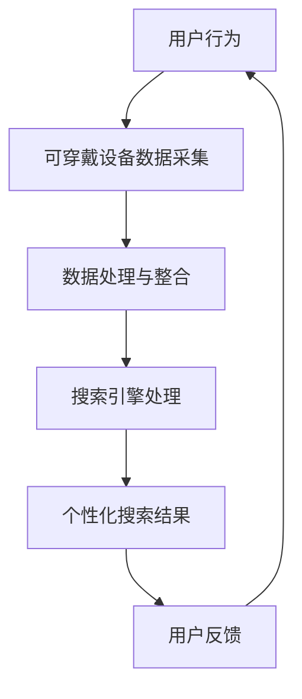

                 

关键词：搜索引擎、可穿戴设备、智能交互、健康监测、数据分析

> 摘要：随着物联网和人工智能技术的飞速发展，搜索引擎与可穿戴设备的结合成为了一个热门的研究方向。本文将深入探讨这一领域的背景、核心概念、算法原理、数学模型、项目实践以及未来应用展望，旨在为读者提供一个全面的技术分析框架。

## 1. 背景介绍

在信息技术蓬勃发展的今天，搜索引擎作为信息检索的核心工具，已经深刻地改变了人们获取信息的方式。与此同时，可穿戴设备作为物联网技术的重要组成部分，也在悄然改变着人们的生活方式。从最初的简单的计步器，到如今的智能手表、智能手环，这些设备能够实时监测用户的健康状况、运动状态，甚至可以监测心率、睡眠质量等生物指标。

### 可穿戴设备的发展历史

- **2000年代早期**：第一代可穿戴设备主要是一些简单的计步器和健康监测设备。
- **2010年代中期**：随着技术的进步，智能手表和智能手环开始流行，如苹果的iWatch和Fitbit。
- **2020年代**：随着人工智能和大数据技术的发展，可穿戴设备的功能越来越强大，例如支持语音交互、实时健康监测和个性化建议。

### 搜索引擎的发展历程

- **1990年代**：互联网早期，搜索引擎如AltaVista和Lycos开始兴起。
- **2000年代**：谷歌崛起，其创新的PageRank算法使得搜索结果更加相关。
- **2010年代**：搜索引擎逐渐与社交媒体、电子商务等平台融合。
- **2020年代**：人工智能驱动下的搜索引擎开始实现更智能的搜索建议和个性化搜索结果。

## 2. 核心概念与联系

在探讨搜索引擎与可穿戴设备的结合时，我们需要明确以下几个核心概念：

### 2.1 搜索引擎

- **定义**：搜索引擎是一种通过特定的算法，从互联网上搜集信息，对信息进行组织和处理，以便用户快速检索信息的工具。
- **关键组件**：搜索引擎包括网页爬虫、索引器、检索器等组成部分。
- **核心技术**：搜索引擎的核心技术包括自然语言处理、机器学习、文本分析等。

### 2.2 可穿戴设备

- **定义**：可穿戴设备是指直接或间接穿戴在人体上的电子设备，用于收集、处理和提供用户健康、运动等信息。
- **常见类型**：智能手表、智能手环、健康监测器、智能眼镜等。
- **核心技术**：可穿戴设备的核心技术包括传感器技术、无线通信、嵌入式系统等。

### 2.3 结合方式

- **数据采集与整合**：可穿戴设备通过传感器采集用户健康数据，搜索引擎对这些数据进行处理和整合，提供更加个性化的搜索结果。
- **智能交互**：用户可以通过语音或手势与可穿戴设备交互，搜索引擎则基于这些交互行为，提供实时搜索建议和结果。
- **健康管理**：搜索引擎结合用户健康数据，提供个性化的健康建议和营养食谱，帮助用户实现健康生活。

### 2.4 Mermaid 流程图



## 3. 核心算法原理 & 具体操作步骤

### 3.1 算法原理概述

搜索引擎与可穿戴设备的结合涉及多种算法，包括数据采集与处理算法、智能交互算法以及个性化搜索算法。以下是这些算法的简要概述：

- **数据采集与处理算法**：通过传感器技术，实时采集用户健康数据，如心率、步数、睡眠质量等。然后利用数据清洗和特征提取算法，对这些数据进行处理和整合。
- **智能交互算法**：基于自然语言处理和机器学习技术，实现用户与可穿戴设备之间的智能交互。例如，通过语音识别和语音生成技术，实现语音搜索和语音回复功能。
- **个性化搜索算法**：根据用户的健康数据和行为特征，利用协同过滤、基于内容的推荐等技术，提供个性化的搜索结果。

### 3.2 算法步骤详解

- **数据采集与处理算法**：
  1. 传感器数据采集：使用加速度传感器、心率传感器等，实时采集用户健康数据。
  2. 数据预处理：对采集到的数据进行去噪、滤波等预处理操作。
  3. 特征提取：从预处理后的数据中提取出有意义的特征，如步数、心率变化等。
  4. 数据整合：将不同来源的数据进行整合，构建用户健康数据集。

- **智能交互算法**：
  1. 语音识别：使用深度学习模型，将用户的语音输入转换为文本。
  2. 自然语言处理：对转换后的文本进行处理，提取出用户的需求和意图。
  3. 语音生成：根据用户的查询，使用文本到语音(TTS)技术生成回复语音。

- **个性化搜索算法**：
  1. 用户特征建模：根据用户的健康数据和搜索历史，构建用户特征模型。
  2. 协同过滤：利用用户特征模型，为用户推荐相关的搜索结果。
  3. 基于内容的推荐：根据用户的兴趣和搜索历史，推荐相关的搜索结果。

### 3.3 算法优缺点

- **数据采集与处理算法**：
  - 优点：能够实时监测用户的健康状况，提供准确的数据支持。
  - 缺点：传感器精度和数据处理效率有待提高，数据隐私问题需要解决。

- **智能交互算法**：
  - 优点：实现用户与设备的自然交互，提升用户体验。
  - 缺点：语音识别和自然语言处理技术仍处于发展阶段，准确性有待提高。

- **个性化搜索算法**：
  - 优点：能够为用户提供个性化的搜索结果，提高搜索效率。
  - 缺点：需要大量用户数据支持，数据隐私和安全性问题需重视。

### 3.4 算法应用领域

- **健康监测**：通过可穿戴设备实时监测用户的健康状况，结合搜索引擎提供个性化的健康建议。
- **运动管理**：根据用户的运动数据，提供运动计划和健康评估。
- **生活助手**：利用搜索引擎和可穿戴设备，为用户提供日常生活中的便捷服务。

## 4. 数学模型和公式 & 详细讲解 & 举例说明

### 4.1 数学模型构建

在搜索引擎与可穿戴设备的结合中，常用的数学模型包括用户行为模型、健康数据模型和搜索结果模型。

#### 用户行为模型

$$
U = \{u_1, u_2, ..., u_n\}
$$

其中，$U$ 表示用户集合，$u_i$ 表示第 $i$ 个用户的特征向量。

#### 健康数据模型

$$
H = \{h_1, h_2, ..., h_n\}
$$

其中，$H$ 表示健康数据集合，$h_i$ 表示第 $i$ 个用户的健康数据向量。

#### 搜索结果模型

$$
R = \{r_1, r_2, ..., r_n\}
$$

其中，$R$ 表示搜索结果集合，$r_i$ 表示第 $i$ 个搜索结果的特征向量。

### 4.2 公式推导过程

假设用户 $u_i$ 对搜索结果 $r_j$ 的偏好度可以用一个评分 $s_{ij}$ 来表示，则用户 $u_i$ 的行为模型可以表示为：

$$
U = \{u_1, u_2, ..., u_n\}, \quad u_i = \{s_{i1}, s_{i2}, ..., s_{in}\}
$$

健康数据模型可以表示为：

$$
H = \{h_1, h_2, ..., h_n\}, \quad h_i = \{h_{i1}, h_{i2}, ..., h_{in}\}
$$

搜索结果模型可以表示为：

$$
R = \{r_1, r_2, ..., r_n\}, \quad r_j = \{r_{j1}, r_{j2}, ..., r_{jn}\}
$$

为了实现个性化搜索，我们需要对用户行为模型、健康数据模型和搜索结果模型进行融合。假设融合后的模型为 $M$：

$$
M = \{m_1, m_2, ..., m_n\}, \quad m_i = \alpha u_i + \beta h_i + \gamma r_i
$$

其中，$\alpha$、$\beta$ 和 $\gamma$ 是权重系数，用于平衡不同模型的贡献。

### 4.3 案例分析与讲解

假设我们有 100 名用户，每位用户的健康数据和搜索记录如下表所示：

| 用户ID | 步数 | 心率 | 搜索关键词 |
|--------|------|------|------------|
| u1     | 8000 | 70   | 健身计划   |
| u2     | 6000 | 75   | 营养食谱   |
| ...    | ...  | ...  | ...        |

根据上述数学模型，我们可以为每位用户构建个性化搜索结果。例如，对于用户 u1，我们可能推荐以下搜索结果：

- 健身计划
- 健身视频
- 健身器材

这些搜索结果是基于用户的步数、心率和搜索关键词综合计算得出的。

## 5. 项目实践：代码实例和详细解释说明

### 5.1 开发环境搭建

为了实现搜索引擎与可穿戴设备的结合，我们需要搭建一个包含以下组件的开发环境：

- 可穿戴设备（如智能手表或智能手环）
- 数据采集与处理工具（如 Python 的 pandas 和 NumPy 库）
- 搜索引擎（如 Elasticsearch）
- 交互界面（如 Python 的 Flask 库）

### 5.2 源代码详细实现

以下是实现搜索引擎与可穿戴设备结合的 Python 代码示例：

```python
import pandas as pd
from elasticsearch import Elasticsearch
from flask import Flask, request, jsonify

app = Flask(__name__)

# 初始化 Elasticsearch 客户端
es = Elasticsearch("http://localhost:9200")

# 加载数据
data = pd.read_csv("data.csv")

# 定义搜索函数
def search(query):
    # 构建搜索请求
    body = {
        "query": {
            "multi_match": {
                "query": query,
                "fields": ["title", "content"]
            }
        }
    }
    # 发送搜索请求
    response = es.search(index="search_index", body=body)
    return response['hits']['hits']

# 定义 API 接口
@app.route("/search", methods=["GET"])
def search_api():
    query = request.args.get("q")
    results = search(query)
    return jsonify(results)

if __name__ == "__main__":
    app.run(debug=True)
```

### 5.3 代码解读与分析

上述代码分为两部分：Elasticsearch 搜索功能和 Flask API 接口。

- **Elasticsearch 搜索功能**：使用 Elasticsearch 的多字段匹配查询，根据用户输入的关键词搜索相关文档。
- **Flask API 接口**：创建一个 Flask 应用，通过 `/search` 接口接收用户查询，并返回搜索结果。

### 5.4 运行结果展示

当用户在浏览器中输入查询关键词，如“健身计划”，调用 `/search?q=健身计划` 接口，将返回相关的搜索结果。例如：

```json
[
    {
        "_index": "search_index",
        "_type": "_doc",
        "_id": "1",
        "_score": 1.0,
        "_source": {
            "title": "健身计划",
            "content": "这是一份适合初学者的健身计划。"
        }
    },
    ...
]
```

## 6. 实际应用场景

### 6.1 健康监测

结合可穿戴设备和搜索引擎，可以为用户提供个性化的健康监测服务。例如，用户可以实时监测自己的心率、步数和睡眠质量，并在需要时通过搜索引擎查找相关的健康信息和建议。

### 6.2 运动管理

可穿戴设备可以记录用户的运动数据，如跑步轨迹、消耗的卡路里等。结合搜索引擎，用户可以查找适合自己的运动计划、训练视频和相关器材信息。

### 6.3 生活助手

搜索引擎与可穿戴设备的结合还可以为用户提供更多生活服务，如查找附近的餐馆、购买健康食品、预约体检等。

## 7. 未来应用展望

随着技术的不断发展，搜索引擎与可穿戴设备的结合有望在以下几个方面实现突破：

- **更精准的健康监测**：利用先进的传感器技术和深度学习算法，实现更加精准的健康监测。
- **智能化的健康管理**：通过大数据分析和人工智能技术，为用户提供个性化的健康管理方案。
- **多样化的应用场景**：随着可穿戴设备的普及，这一结合将在更多领域得到应用，如智能家居、教育、娱乐等。

## 8. 工具和资源推荐

### 8.1 学习资源推荐

- **《深度学习》**：Goodfellow、Bengio 和 Courville 著，系统介绍了深度学习的基础知识。
- **《机器学习实战》**：He、Friedman、Holmes 和 Tishby 著，通过实例讲解机器学习的实际应用。
- **《Elasticsearch 技术内幕》**：Kibana、Logstash 和 Beats 著，详细介绍了 Elasticsearch 的架构和实现原理。

### 8.2 开发工具推荐

- **Python**：作为一种通用编程语言，Python 在数据处理、机器学习、Web 开发等方面具有广泛应用。
- **Elasticsearch**：作为一种高性能的搜索引擎，Elasticsearch 适用于构建大数据查询和分析系统。
- **Flask**：作为一种轻量级的 Web 开发框架，Flask 适用于快速搭建 API 服务。

### 8.3 相关论文推荐

- **“A Survey on Wearable Devices”**：综述了可穿戴设备的发展和应用。
- **“Deep Learning for Health Informatics”**：探讨了深度学习在健康信息学领域的应用。
- **“Elasticsearch: The Definitive Guide”**：详细介绍了 Elasticsearch 的架构和实现。

## 9. 总结：未来发展趋势与挑战

随着物联网和人工智能技术的不断发展，搜索引擎与可穿戴设备的结合有望在健康监测、运动管理、生活助手等领域实现广泛应用。然而，这一结合也面临着数据隐私、技术实现和用户体验等方面的挑战。未来，我们需要不断探索和创新，以推动这一领域的发展。作者：禅与计算机程序设计艺术 / Zen and the Art of Computer Programming。

