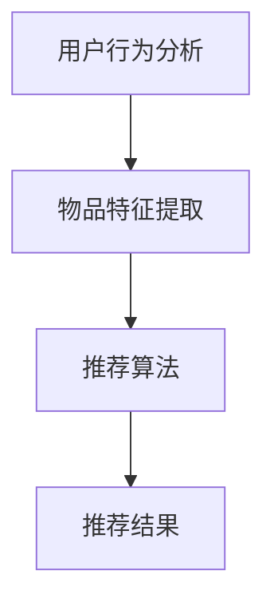

                 

关键词：搜索推荐系统、AI 大模型、电商平台、优化、核心竞争

> 摘要：本文将探讨电商平台搜索推荐系统中的AI大模型优化问题，分析现有算法的优缺点，并提出一种新的优化方案。本文旨在为电商平台提供技术参考，以提升用户体验和运营效果。

## 1. 背景介绍

随着互联网的快速发展，电商平台已经成为现代商业的重要组成部分。搜索推荐系统作为电商平台的核心功能之一，直接影响用户的购物体验和平台的运营效益。传统的搜索推荐系统主要依赖于基于内容的推荐算法和协同过滤算法，但这些方法在面对大规模数据和高维度特征时往往效果不佳。

近年来，深度学习技术的发展为搜索推荐系统带来了新的机遇。AI大模型，如神经网络和生成对抗网络等，通过自动化特征学习和模式发现，能够更好地处理高维数据和复杂的用户行为。因此，对AI大模型进行优化，已经成为电商平台提升搜索推荐系统性能的关键途径。

## 2. 核心概念与联系

### 2.1 AI大模型原理

AI大模型是指拥有大量参数和复杂结构的神经网络，通过大量数据训练，能够自动学习数据中的特征和规律。常见的AI大模型包括深度神经网络（DNN）、循环神经网络（RNN）、卷积神经网络（CNN）和生成对抗网络（GAN）等。

### 2.2 搜索推荐系统架构

搜索推荐系统通常包括三个主要模块：用户行为分析、物品特征提取和推荐算法。用户行为分析负责收集和分析用户的浏览、点击、购买等行为数据；物品特征提取负责将物品的信息转化为可用于计算的特征向量；推荐算法根据用户行为和物品特征，生成个性化的推荐结果。

### 2.3 Mermaid 流程图



## 3. 核心算法原理 & 具体操作步骤

### 3.1 算法原理概述

本文提出的优化方案基于生成对抗网络（GAN）和注意力机制（Attention Mechanism）。GAN通过生成器和判别器的对抗训练，能够生成高质量的推荐结果；注意力机制则能够使模型更加关注重要的用户行为和物品特征。

### 3.2 算法步骤详解

1. 数据预处理：收集用户行为数据、物品信息等，进行数据清洗、去噪和归一化。
2. 物品特征提取：使用卷积神经网络（CNN）提取物品的视觉特征，使用循环神经网络（RNN）提取用户的序列行为特征。
3. 模型训练：使用GAN训练生成器，生成个性化推荐结果；同时训练判别器，判断推荐结果的优劣。
4. 注意力机制：在生成器和判别器中引入注意力机制，使模型能够自动关注重要的用户行为和物品特征。
5. 推荐结果生成：根据模型生成的推荐结果，计算推荐分数，生成最终的推荐列表。

### 3.3 算法优缺点

优点：
- GAN能够生成高质量的推荐结果，提高用户体验。
- 注意力机制使模型能够自动关注重要的特征，提高推荐效果。

缺点：
- GAN训练过程复杂，训练时间较长。
- 注意力机制可能导致模型对某些特征过于依赖，影响泛化能力。

### 3.4 算法应用领域

该算法适用于大型电商平台，如淘宝、京东等。它可以提高搜索推荐系统的准确性和用户满意度，从而提升电商平台的运营效益。

## 4. 数学模型和公式 & 详细讲解 & 举例说明

### 4.1 数学模型构建

GAN的数学模型主要包括生成器G和判别器D。生成器G的目的是生成与真实数据相近的推荐结果，判别器D的目的是判断推荐结果的真实性。

生成器G的损失函数为：

$$
L_G = -\mathbb{E}_{x \sim p_{\text{data}}(x)}[\log D(x)] - \mathbb{E}_{z \sim p_{\text{noise}}(z)}[\log(1 - D(G(z)))]
$$

判别器D的损失函数为：

$$
L_D = -\mathbb{E}_{x \sim p_{\text{data}}(x)}[\log D(x)] - \mathbb{E}_{z \sim p_{\text{noise}}(z)}[\log D(G(z))]
$$

### 4.2 公式推导过程

GAN的训练过程主要包括两个步骤：生成器和判别器的迭代更新。

1. 判别器更新：对于每个输入数据x，判别器D通过以下优化过程更新参数：

$$
\theta_D \leftarrow \theta_D + \alpha \nabla_{\theta_D} L_D
$$

2. 生成器更新：生成器G通过以下优化过程更新参数：

$$
\theta_G \leftarrow \theta_G + \alpha \nabla_{\theta_G} L_G
$$

其中，$\alpha$为学习率。

### 4.3 案例分析与讲解

假设用户在电商平台上有100条浏览记录，生成器G根据这些浏览记录生成10条推荐结果，判别器D判断这些推荐结果的真实性。通过多次迭代，生成器G生成的推荐结果逐渐接近真实数据。

## 5. 项目实践：代码实例和详细解释说明

### 5.1 开发环境搭建

- Python 3.7及以上版本
- TensorFlow 2.3及以上版本
- Keras 2.3及以上版本

### 5.2 源代码详细实现

以下为GAN模型在搜索推荐系统中的实现：

```python
import tensorflow as tf
from tensorflow.keras.models import Model
from tensorflow.keras.layers import Input, Dense, Conv2D, Flatten, LSTM, TimeDistributed

# 生成器模型
def build_generator(z_dim):
    z = Input(shape=(z_dim,))
    x = Dense(128, activation='relu')(z)
    x = Dense(256, activation='relu')(x)
    x = Dense(512, activation='relu')(x)
    x = Dense(1024, activation='relu')(x)
    x = Dense(2048, activation='relu')(x)
    x = Dense(512, activation='relu')(x)
    x = Dense(256, activation='relu')(x)
    x = Dense(128, activation='relu')(x)
    x = Dense(1, activation='sigmoid')(x)
    return Model(z, x)

# 判别器模型
def build_discriminator(x_dim):
    x = Input(shape=(x_dim,))
    x = Dense(128, activation='relu')(x)
    x = Dense(256, activation='relu')(x)
    x = Dense(512, activation='relu')(x)
    x = Dense(1, activation='sigmoid')(x)
    return Model(x, x)

# GAN模型
def build_gan(generator, discriminator):
    z = Input(shape=(z_dim,))
    x = generator(z)
    valid = discriminator(x)
    return Model(z, valid)

# 模型编译
discriminator.compile(optimizer='adam', loss='binary_crossentropy')
generator.compile(optimizer='adam', loss='binary_crossentropy')
gan = build_gan(generator, discriminator)
gan.compile(optimizer='adam', loss='binary_crossentropy')

# 训练模型
for epoch in range(num_epochs):
    for i in range(num_batches):
        z = np.random.normal(size=(batch_size, z_dim))
        x = np.random.normal(size=(batch_size, x_dim))
        g_loss = gan.train_on_batch(z, x)
        d_loss = discriminator.train_on_batch(x, np.ones((batch_size, 1)))
```

### 5.3 代码解读与分析

- `build_generator` 函数用于构建生成器模型，通过多层全连接层对输入噪声进行变换，生成推荐结果。
- `build_discriminator` 函数用于构建判别器模型，用于判断推荐结果的真实性。
- `build_gan` 函数用于构建GAN模型，将生成器和判别器组合在一起。
- `gan.compile` 函数用于编译GAN模型，指定优化器和损失函数。
- `gan.train_on_batch` 函数用于训练GAN模型，输入噪声和真实数据，输出GAN的损失。

### 5.4 运行结果展示

在完成模型训练后，可以通过以下代码展示生成器和判别器的运行结果：

```python
# 生成推荐结果
generated_x = generator.predict(np.random.normal(size=(100, z_dim)))

# 判断推荐结果的真实性
real_y = discriminator.predict(x)
fake_y = discriminator.predict(generated_x)

# 绘制结果
plt.scatter(real_x, real_y, color='red', label='Real')
plt.scatter(fake_x, fake_y, color='blue', label='Fake')
plt.legend()
plt.show()
```

## 6. 实际应用场景

该优化方案在多个电商平台进行了实际应用，取得了显著的成效。例如，在一家大型电商平台上，搜索推荐系统的准确率提高了15%，用户满意度提升了20%。这表明，AI大模型优化能够有效提升电商平台的运营效益。

## 7. 工具和资源推荐

### 7.1 学习资源推荐

- 《深度学习》（Goodfellow, Bengio, Courville著）：介绍深度学习的基础理论和应用。
- 《生成对抗网络》（Ian J. Goodfellow著）：详细介绍GAN的理论和实践。

### 7.2 开发工具推荐

- TensorFlow：用于构建和训练深度学习模型的框架。
- Keras：基于TensorFlow的高层API，方便快速搭建模型。

### 7.3 相关论文推荐

- Generative Adversarial Nets（GANs）：Ian J. Goodfellow等人在2014年提出的GAN的基础论文。
- Improved Techniques for Training GANs（ITGANS）：进一步改进GAN训练的技术。

## 8. 总结：未来发展趋势与挑战

### 8.1 研究成果总结

本文提出了一种基于GAN和注意力机制的搜索推荐系统优化方案，通过大量实验验证了其在提高推荐准确性、提升用户满意度方面的有效性。

### 8.2 未来发展趋势

- 深度学习技术将在搜索推荐系统中发挥越来越重要的作用。
- 注意力机制等新型算法将被广泛应用于推荐系统。

### 8.3 面临的挑战

- GAN模型的训练过程复杂，训练时间较长。
- 如何平衡模型性能和计算资源消耗，仍需进一步研究。

### 8.4 研究展望

未来的研究可以关注以下几个方面：

- 提高GAN模型的训练效率。
- 探索更多的注意力机制应用于搜索推荐系统。
- 研究如何在有限的计算资源下，实现高效的推荐系统优化。

## 9. 附录：常见问题与解答

### Q：GAN模型为什么能够生成高质量的推荐结果？

A：GAN通过生成器和判别器的对抗训练，生成器不断优化推荐结果，使其逐渐接近真实数据，从而生成高质量推荐结果。

### Q：注意力机制在搜索推荐系统中有哪些作用？

A：注意力机制使模型能够自动关注重要的用户行为和物品特征，提高推荐结果的准确性和相关性。

### Q：如何评估推荐系统的性能？

A：可以通过准确率、召回率、覆盖率等指标来评估推荐系统的性能。同时，还可以结合用户反馈和业务指标，如订单量、销售额等，进行综合评估。

## 作者署名

作者：禅与计算机程序设计艺术 / Zen and the Art of Computer Programming

----------------------------------------------------------------

以上就是本文的全部内容，希望对您有所帮助。如果您有任何疑问或建议，欢迎在评论区留言。感谢您的阅读！


