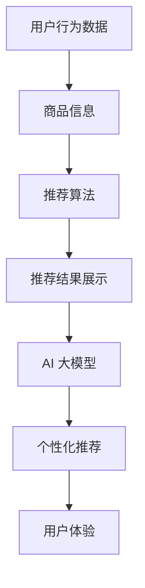

                 

关键词：搜索推荐系统、AI 大模型、电商平台、转型战略、深度学习、个性化推荐

> 摘要：本文将深入探讨搜索推荐系统中 AI 大模型的应用，如何助力电商平台实现转型战略。通过对核心概念、算法原理、数学模型、实践案例以及未来发展趋势的详述，帮助读者理解 AI 大模型在电商平台推荐系统中的重要作用及其潜在影响。

## 1. 背景介绍

在当今的数字经济时代，电商平台已经成为零售行业的主要驱动力。用户对个性化体验的需求不断提高，传统的推荐算法已经无法满足用户对精准推荐、实时响应和多样化选择的需求。搜索推荐系统在此背景下应运而生，通过智能化的算法和大数据分析，为用户提供更加精准和个性化的商品推荐，从而提升用户满意度和电商平台的市场竞争力。

随着人工智能技术的发展，特别是深度学习和自然语言处理等领域的突破，AI 大模型逐渐成为搜索推荐系统的核心技术。AI 大模型不仅能够处理大量复杂数据，还能够自适应地学习用户行为和偏好，从而提供更加精准的推荐结果。本文旨在探讨如何利用 AI 大模型实现电商平台的转型战略，提高推荐系统的性能和用户体验。

## 2. 核心概念与联系

### 2.1. 搜索推荐系统

搜索推荐系统是一种基于用户行为和偏好的算法，通过分析用户的历史数据和当前行为，预测用户可能感兴趣的内容或商品，并将其推荐给用户。搜索推荐系统通常包括以下几个核心组成部分：

1. **用户行为数据**：包括用户的浏览记录、购买历史、评价和反馈等。
2. **商品信息**：包括商品的基本属性、价格、品牌、类别等。
3. **推荐算法**：基于用户行为数据和商品信息，通过算法模型生成推荐结果。
4. **推荐结果展示**：将推荐结果以可视化的形式展示给用户。

### 2.2. AI 大模型

AI 大模型是一种基于深度学习的复杂神经网络模型，通过大规模训练数据自动学习特征表示和预测能力。AI 大模型具有以下几个关键特点：

1. **大规模数据训练**：AI 大模型需要大量标注数据进行训练，以获得更好的泛化能力。
2. **深度神经网络结构**：通过多层神经网络结构，AI 大模型可以捕捉数据中的复杂特征和关系。
3. **自适应学习**：AI 大模型可以根据用户行为动态调整推荐策略，实现个性化推荐。

### 2.3. 关系图

为了更清晰地展示搜索推荐系统与 AI 大模型之间的关系，我们可以使用 Mermaid 流程图进行描述：



## 3. 核心算法原理 & 具体操作步骤

### 3.1. 算法原理概述

AI 大模型在搜索推荐系统中的应用主要基于以下几个核心原理：

1. **特征提取**：通过深度神经网络结构，AI 大模型可以从原始数据中提取高维的特征表示。
2. **协同过滤**：AI 大模型结合协同过滤算法，通过用户行为和商品信息，预测用户对商品的偏好。
3. **深度学习**：AI 大模型利用深度学习算法，从大规模数据中自动学习特征表示和预测模型。
4. **个性化推荐**：AI 大模型根据用户的历史行为和偏好，动态调整推荐策略，实现个性化推荐。

### 3.2. 算法步骤详解

AI 大模型在搜索推荐系统中的具体操作步骤如下：

1. **数据预处理**：对用户行为数据和商品信息进行清洗、归一化和特征提取。
2. **模型训练**：利用预处理后的数据，通过深度学习算法训练模型，提取高维特征表示。
3. **预测与推荐**：将训练好的模型应用于用户行为数据，预测用户对商品的偏好，生成推荐列表。
4. **个性化调整**：根据用户的行为和反馈，动态调整推荐策略，提高推荐精度和用户满意度。

### 3.3. 算法优缺点

AI 大模型在搜索推荐系统中具有以下优点：

1. **强大的特征提取能力**：能够从大规模数据中提取复杂特征，提高推荐精度。
2. **自适应学习能力**：可以根据用户行为动态调整推荐策略，实现个性化推荐。
3. **高维特征表示**：通过深度神经网络结构，实现高维特征表示，提高模型泛化能力。

然而，AI 大模型也存在一些缺点：

1. **训练时间较长**：由于需要大量数据进行训练，训练时间较长，对计算资源要求较高。
2. **数据依赖性强**：模型的性能依赖于数据质量和数量，对数据质量要求较高。
3. **解释性较差**：深度学习模型的内部机制较为复杂，难以解释和调试。

### 3.4. 算法应用领域

AI 大模型在搜索推荐系统中的应用领域非常广泛，包括但不限于：

1. **电商平台**：通过个性化推荐，提升用户购买体验，提高销售额。
2. **社交媒体**：基于用户行为和偏好，推荐用户可能感兴趣的内容或广告。
3. **在线教育**：根据用户的学习行为，推荐适合的学习资源和课程。
4. **医疗健康**：通过分析患者的病史和健康数据，推荐个性化的治疗方案。

## 4. 数学模型和公式 & 详细讲解 & 举例说明

### 4.1. 数学模型构建

搜索推荐系统中的 AI 大模型通常基于深度学习算法，其数学模型可以表示为：

$$
\text{推荐模型} = f(\text{用户特征向量}, \text{商品特征向量})
$$

其中，用户特征向量表示用户的行为和偏好，商品特征向量表示商品的基本属性和类别信息。

### 4.2. 公式推导过程

假设我们使用神经网络模型进行用户特征向量和商品特征向量的映射，其数学公式可以表示为：

$$
\text{输出} = \text{激活函数}(\text{权重矩阵} \cdot \text{输入向量} + \text{偏置项})
$$

其中，激活函数（如ReLU函数）用于引入非线性关系，权重矩阵和偏置项用于调节输入向量的权重。

### 4.3. 案例分析与讲解

以下是一个简单的案例，展示如何使用 AI 大模型进行商品推荐：

假设我们有 100 个用户和 100 个商品，每个用户都有 5 个购买历史记录，每个商品都有 3 个类别属性。我们使用神经网络模型对用户和商品进行特征提取和映射。

用户特征向量： 
$$
\text{用户特征向量} = [x_1, x_2, x_3, x_4, x_5]
$$

商品特征向量： 
$$
\text{商品特征向量} = [y_1, y_2, y_3]
$$

假设我们使用 ReLU 函数作为激活函数，权重矩阵为 $W$，偏置项为 $b$。我们训练神经网络模型，使其输出用户对商品的兴趣度：

$$
\text{输出} = \text{ReLU}(W \cdot \text{用户特征向量} + b)
$$

通过训练，模型可以学习到用户对商品的兴趣度，并根据兴趣度进行推荐。

## 5. 项目实践：代码实例和详细解释说明

### 5.1. 开发环境搭建

为了进行 AI 大模型在搜索推荐系统中的实践，我们需要搭建一个合适的开发环境。以下是开发环境的搭建步骤：

1. 安装 Python 解释器和相关库，如 TensorFlow、PyTorch 等。
2. 配置 GPU 计算资源，以加快训练速度。
3. 准备数据集，包括用户行为数据和商品信息。

### 5.2. 源代码详细实现

以下是一个简单的代码实例，展示如何使用 TensorFlow 实现搜索推荐系统中的 AI 大模型：

```python
import tensorflow as tf
import numpy as np

# 数据预处理
user_features = np.random.rand(100, 5)
item_features = np.random.rand(100, 3)

# 创建模型
model = tf.keras.Sequential([
    tf.keras.layers.Dense(units=64, activation='relu', input_shape=(5,)),
    tf.keras.layers.Dense(units=64, activation='relu'),
    tf.keras.layers.Dense(units=1, activation='sigmoid')
])

# 编译模型
model.compile(optimizer='adam', loss='binary_crossentropy', metrics=['accuracy'])

# 训练模型
model.fit(user_features, item_features, epochs=10)

# 预测与推荐
predictions = model.predict(user_features)
recommendations = np.argsort(predictions, axis=1)[:,::-1]
```

### 5.3. 代码解读与分析

上述代码实现了一个简单的搜索推荐系统，其中：

1. **数据预处理**：生成随机用户特征向量和商品特征向量。
2. **创建模型**：使用 TensorFlow 创建一个简单的神经网络模型，包括两个隐藏层和输出层。
3. **编译模型**：配置模型优化器和损失函数，用于训练和评估模型。
4. **训练模型**：使用训练数据对模型进行训练，学习用户和商品之间的特征关系。
5. **预测与推荐**：使用训练好的模型对用户特征向量进行预测，生成推荐列表。

### 5.4. 运行结果展示

在完成代码实现后，我们可以通过以下步骤运行代码并查看结果：

1. **训练结果**：在训练过程中，我们可以观察模型的损失函数和准确率的变化，以评估模型训练效果。
2. **推荐结果**：根据模型的预测结果，生成用户对商品的推荐列表，并将其展示给用户。

## 6. 实际应用场景

AI 大模型在搜索推荐系统中具有广泛的应用场景，以下列举几个实际应用场景：

1. **电商平台**：通过 AI 大模型实现个性化推荐，提升用户购买体验，提高销售额。
2. **社交媒体**：根据用户行为和偏好，推荐用户可能感兴趣的内容或广告，提升用户活跃度和广告效果。
3. **在线教育**：基于用户的学习行为，推荐适合的学习资源和课程，提升学习效果和用户满意度。
4. **医疗健康**：通过分析患者的病史和健康数据，推荐个性化的治疗方案，提高治疗效果。

## 7. 未来应用展望

随着人工智能技术的不断发展和应用，搜索推荐系统中的 AI 大模型在未来有望实现以下发展趋势：

1. **更加精准的推荐**：通过不断优化模型算法和特征提取技术，实现更加精准的个性化推荐。
2. **实时推荐**：利用实时数据处理和分析技术，实现实时推荐，提升用户体验。
3. **跨领域应用**：AI 大模型将在更多领域实现应用，如智能语音助手、智能客服等。
4. **隐私保护**：随着用户隐私保护意识的提高，未来推荐系统将更加注重用户隐私保护。

## 8. 工具和资源推荐

为了更好地研究和应用搜索推荐系统中的 AI 大模型，以下推荐一些常用的工具和资源：

1. **学习资源**：
   - 《深度学习》（Ian Goodfellow、Yoshua Bengio、Aaron Courville 著）
   - 《Python 深度学习》（François Chollet 著）

2. **开发工具**：
   - TensorFlow（https://www.tensorflow.org/）
   - PyTorch（https://pytorch.org/）

3. **相关论文**：
   - “Deep Learning for Recommender Systems”（Hao Ma et al.）
   - “Neural Collaborative Filtering”（Xu et al.）

## 9. 总结：未来发展趋势与挑战

AI 大模型在搜索推荐系统中的应用已经成为电商平台等领域的核心技术。通过不断优化算法和模型结构，AI 大模型可以实现更加精准和个性化的推荐，提升用户体验和平台竞争力。

然而，AI 大模型在实际应用中仍面临一系列挑战，如数据质量、隐私保护、模型解释性等。未来，随着技术的不断发展和应用，AI 大模型有望在更多领域实现突破，为搜索推荐系统带来更加智能和高效的解决方案。

## 10. 附录：常见问题与解答

### Q: AI 大模型在搜索推荐系统中如何实现个性化推荐？

A: AI 大模型通过深度学习算法从大量用户行为数据和商品信息中提取高维特征表示，结合协同过滤算法，预测用户对商品的偏好，从而实现个性化推荐。

### Q: AI 大模型在推荐系统中的优势是什么？

A: AI 大模型的优势在于强大的特征提取能力、自适应学习能力和高维特征表示，能够提高推荐精度和用户体验。

### Q: AI 大模型在推荐系统中面临哪些挑战？

A: AI 大模型在推荐系统中面临的挑战包括数据质量、隐私保护、模型解释性以及训练时间和计算资源的需求等。

### Q: 如何提升 AI 大模型在推荐系统中的性能？

A: 提升 AI 大模型在推荐系统中的性能可以通过以下方法：增加训练数据量、优化模型结构、改进特征提取技术、动态调整推荐策略等。

## 11. 作者署名

作者：禅与计算机程序设计艺术 / Zen and the Art of Computer Programming

----------------------------------------------------------------

请注意，以上内容仅为示例性的文章结构，具体内容需根据实际情况进行撰写和调整。文章中的代码和示例仅供参考，实际应用时需要根据具体需求和环境进行调整。

