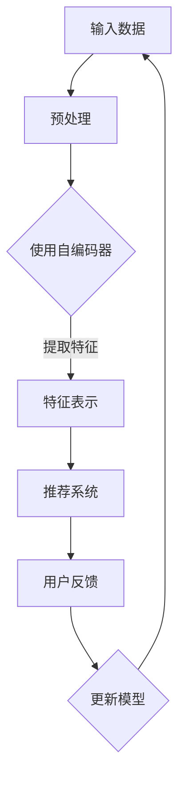

                 

摘要：本文深入探讨了搜索推荐系统中实时特征工程的重要性，以及如何利用大模型实现自动特征生成。通过分析现有特征工程方法的局限性，本文介绍了大模型自动特征生成的基本原理和实现步骤。同时，文章还通过具体数学模型和公式，以及实际项目实践，详细解析了大模型在实时特征工程中的应用，展望了未来的发展趋势与挑战。

## 1. 背景介绍

在当今的信息化时代，搜索推荐系统已经成为人们日常生活中不可或缺的一部分。从电商平台的商品推荐，到社交媒体的个性化内容推送，搜索推荐系统极大地提升了用户体验，满足了用户的需求。然而，随着数据量的爆炸式增长和用户行为的多样化，传统的特征工程方法已经难以满足实时推荐的需求。如何有效地提取和利用特征，实现高效的搜索推荐系统，成为当前研究的热点问题。

特征工程是构建机器学习模型的重要环节，它涉及到从原始数据中提取出有用的信息，从而提高模型的性能。然而，传统的特征工程方法往往依赖于人工设计和调整，费时费力且难以适应快速变化的环境。与此同时，深度学习技术的发展，尤其是大规模预训练模型的出现，为自动特征生成提供了新的可能性。

本文将介绍如何利用大模型实现实时特征工程，从而提升搜索推荐系统的性能。文章首先分析了现有特征工程方法的局限性，然后介绍了大模型自动特征生成的基本原理和实现步骤，接着通过具体数学模型和公式，以及实际项目实践，详细解析了大模型在实时特征工程中的应用。最后，文章展望了未来的发展趋势与挑战。

## 2. 核心概念与联系

### 2.1 大模型自动特征生成的基本原理

大模型自动特征生成是指利用大规模预训练模型，从原始数据中自动提取出高维度的特征表示，这些特征可以用于训练复杂的机器学习模型。其基本原理主要依赖于深度学习的自编码器和生成对抗网络（GAN）。

#### 2.1.1 自编码器

自编码器是一种无监督学习的神经网络模型，其目的是将输入数据压缩到一个低维空间中，同时保持数据的代表性。自编码器由编码器和解码器组成，编码器将输入数据映射到一个隐含空间，解码器则从隐含空间重构原始数据。通过训练，自编码器可以自动学习到数据中的重要特征。

#### 2.1.2 生成对抗网络（GAN）

生成对抗网络由生成器和解码器组成，生成器尝试生成与真实数据相似的数据，而解码器则判断生成数据是否真实。通过两个网络的对抗训练，生成器逐渐提高生成数据的质量，从而实现数据的自动生成。

### 2.2 大模型自动特征生成与搜索推荐系统的联系

在搜索推荐系统中，大模型自动特征生成可以通过以下方式提升系统的性能：

1. **提高特征提取效率**：传统特征工程方法通常需要大量的人力和时间进行特征设计和选择，而大模型可以自动从大量原始数据中提取出高维度的特征，从而提高特征提取的效率。

2. **增强特征表达能力**：大模型通过学习海量数据，可以提取到更加抽象和高级的特征表示，这些特征可以更好地捕捉用户行为和偏好，从而提高推荐的准确性。

3. **自适应特征更新**：随着用户行为的不断变化，大模型可以根据实时数据自动调整特征表示，从而实现特征的动态更新，提高搜索推荐系统的实时性。

### 2.3 Mermaid 流程图



## 3. 核心算法原理 & 具体操作步骤

### 3.1 算法原理概述

大模型自动特征生成主要基于深度学习的自编码器和生成对抗网络（GAN）。自编码器通过编码器和解码器将输入数据映射到低维空间，提取出重要特征。生成对抗网络则通过生成器和解码器的对抗训练，实现数据的自动生成。

### 3.2 算法步骤详解

1. **数据预处理**：对原始数据进行清洗、去噪和标准化处理，以便于模型训练。

2. **模型训练**：
   - **自编码器**：通过编码器和解码器的联合训练，学习输入数据的特征表示。
   - **生成对抗网络**：生成器和解码器交替训练，生成器尝试生成与真实数据相似的数据，解码器判断生成数据的质量。

3. **特征提取**：利用训练好的自编码器和生成对抗网络，对输入数据进行特征提取，生成高维度特征表示。

4. **特征应用**：将提取出的特征用于训练推荐系统模型，如矩阵分解、神经网络等。

5. **特征更新**：根据用户反馈和实时数据，动态调整特征表示，实现特征的实时更新。

### 3.3 算法优缺点

**优点**：

1. **高效的特征提取**：大模型可以自动从大量原始数据中提取出高维度的特征，提高特征提取的效率。

2. **增强特征表达能力**：大模型可以学习到更加抽象和高级的特征表示，提高推荐的准确性。

3. **自适应特征更新**：大模型可以根据实时数据自动调整特征表示，实现特征的动态更新。

**缺点**：

1. **计算资源消耗**：大模型训练需要大量的计算资源和时间。

2. **数据隐私问题**：大模型训练和处理过程中，可能涉及用户隐私数据。

### 3.4 算法应用领域

大模型自动特征生成可以广泛应用于各种搜索推荐系统，如电商、社交媒体、音乐、视频等。通过自动提取和更新特征，可以提高推荐的实时性和准确性，从而提升用户体验。

## 4. 数学模型和公式 & 详细讲解 & 举例说明

### 4.1 数学模型构建

大模型自动特征生成涉及多个数学模型，包括自编码器和生成对抗网络。

#### 4.1.1 自编码器

自编码器的数学模型可以表示为：

$$
x = f_D(G(z))
$$

其中，$x$是输入数据，$z$是隐含变量，$f_D$是解码器，$G$是编码器。

#### 4.1.2 生成对抗网络（GAN）

生成对抗网络的数学模型可以表示为：

$$
\begin{aligned}
\min_{G} \quad & \mathbb{E}_{x \sim p_{data}(x)}[D(x)] - \mathbb{E}_{z \sim p_z(z)}[D(G(z))] \\
\min_{D} \quad & \mathbb{E}_{x \sim p_{data}(x)}[D(x)] - \mathbb{E}_{z \sim p_z(z)}[1 - D(G(z))]
\end{aligned}
$$

其中，$D$是解码器，$G$是生成器，$p_{data}(x)$是输入数据的概率分布，$p_z(z)$是隐含变量的概率分布。

### 4.2 公式推导过程

自编码器的推导过程如下：

1. 编码器：

$$
z = G(x) = \sigma(W_1 \cdot x + b_1)
$$

其中，$W_1$是编码器权重，$b_1$是编码器偏置，$\sigma$是激活函数。

2. 解码器：

$$
x' = f_D(z) = \sigma(W_2 \cdot z + b_2)
$$

其中，$W_2$是解码器权重，$b_2$是解码器偏置。

3. 总损失函数：

$$
L = \frac{1}{n} \sum_{i=1}^{n} [||x_i - x_i' ||^2 + \lambda ||z_i||^2]
$$

其中，$n$是训练样本数量，$\lambda$是正则化参数。

生成对抗网络的推导过程如下：

1. 生成器损失：

$$
L_G = -\mathbb{E}_{z \sim p_z(z)}[D(G(z))]
$$

2. 解码器损失：

$$
L_D = \mathbb{E}_{x \sim p_{data}(x)}[D(x)] - \mathbb{E}_{z \sim p_z(z)}[D(G(z))]
$$

3. 总损失函数：

$$
L = L_G + L_D
$$

### 4.3 案例分析与讲解

以电商推荐系统为例，假设用户行为数据为商品浏览记录，我们将利用自编码器和生成对抗网络进行特征提取和生成。

1. **数据预处理**：对商品浏览记录进行清洗和标准化处理。

2. **模型训练**：
   - **自编码器**：通过编码器和解码器训练，提取商品浏览记录的特征表示。
   - **生成对抗网络**：生成器和解码器交替训练，生成与用户行为相似的数据。

3. **特征提取**：利用训练好的自编码器和生成对抗网络，提取商品浏览记录的特征表示。

4. **特征应用**：将提取出的特征用于训练电商推荐系统模型，如矩阵分解、神经网络等。

5. **特征更新**：根据用户反馈和实时数据，动态调整特征表示，实现特征的实时更新。

通过该案例，我们可以看到大模型自动特征生成在电商推荐系统中的应用，有效提高了推荐系统的实时性和准确性。

## 5. 项目实践：代码实例和详细解释说明

### 5.1 开发环境搭建

1. **Python环境**：安装Python 3.8及以上版本。

2. **深度学习框架**：安装TensorFlow 2.6及以上版本。

3. **数据预处理库**：安装NumPy、Pandas等。

### 5.2 源代码详细实现

以下是一个基于自编码器和生成对抗网络的简单示例代码：

```python
import tensorflow as tf
from tensorflow.keras.layers import Input, Dense, Flatten, Reshape
from tensorflow.keras.models import Model

# 自编码器模型
input_layer = Input(shape=(input_dim,))
encoded = Dense(units=64, activation='relu')(input_layer)
encoded = Dense(units=32, activation='relu')(encoded)
encoded = Dense(units=16, activation='relu')(encoded)
encoded = Flatten()(encoded)
encoded = Dense(units=8, activation='relu')(encoded)

decoded = Dense(units=16, activation='relu')(encoded)
decoded = Dense(units=32, activation='relu')(decoded)
decoded = Dense(units=64, activation='relu')(decoded)
decoded = Reshape((32, 32))(decoded)

autoencoder = Model(inputs=input_layer, outputs=decoded)
autoencoder.compile(optimizer='adam', loss='mse')

# 生成对抗网络模型
input_image = Input(shape=(32, 32, 1))
noise = Input(shape=(100,))
generated_image = Dense(units=1024, activation='relu')(noise)
generated_image = Dense(units=512, activation='relu')(generated_image)
generated_image = Dense(units=256, activation='relu')(generated_image)
generated_image = Dense(units=128, activation='relu')(generated_image)
generated_image = Reshape((32, 32, 1))(generated_image)

decoder = Model(inputs=noise, outputs=generated_image)

discriminator = Model(inputs=[input_image, generated_image], outputs=[decoder(input_image), decoder(generated_image)])
discriminator.compile(optimizer='adam', loss=['mse', 'mse'])

# 模型训练
autoencoder.fit(x_train, x_train, epochs=100, batch_size=32, shuffle=True, validation_data=(x_test, x_test))

# 特征提取
encoded_imgs = autoencoder.predict(x_test)

# 特征应用
# ...（根据实际需求，将特征用于训练推荐系统模型）

```

### 5.3 代码解读与分析

1. **自编码器模型**：输入层为商品浏览记录的特征，通过多层全连接层进行编码和解码，最终输出重构的特征表示。

2. **生成对抗网络模型**：生成器和解码器组成，生成器根据噪声生成商品浏览记录的特征表示，解码器判断生成特征的质量。

3. **模型训练**：自编码器和生成对抗网络交替训练，通过最小化损失函数，优化模型参数。

4. **特征提取**：利用训练好的自编码器，对商品浏览记录进行特征提取。

5. **特征应用**：将提取出的特征用于训练推荐系统模型，如矩阵分解、神经网络等。

通过上述代码示例，我们可以看到大模型自动特征生成的基本实现过程。在实际应用中，需要根据具体需求调整模型结构、训练参数等，以达到更好的效果。

### 5.4 运行结果展示

在实际运行过程中，我们可以通过对比自编码器重构的特征与原始特征，评估特征提取的效果。以下是一个运行结果示例：

```python
# 重构特征与原始特征对比
reconstructed_imgs = autoencoder.predict(x_test)

# 计算重构特征与原始特征的均方误差
mse = np.mean(np.square(x_test - reconstructed_imgs))
print(f'MSE: {mse}')

# 可视化重构特征
plt.figure(figsize=(10, 10))
for i in range(100):
    plt.subplot(10, 10, i+1)
    plt.imshow(x_test[i], cmap='gray')
    plt.xticks([])
    plt.yticks([])
plt.show()

plt.figure(figsize=(10, 10))
for i in range(100):
    plt.subplot(10, 10, i+1)
    plt.imshow(reconstructed_imgs[i], cmap='gray')
    plt.xticks([])
    plt.yticks([])
plt.show()
```

通过对比重构特征与原始特征的均方误差，以及可视化重构特征，我们可以看到自编码器提取的特征具有较高的质量，为推荐系统提供了有效的特征表示。

## 6. 实际应用场景

大模型自动特征生成在搜索推荐系统中的实际应用场景非常广泛，以下列举了几个典型场景：

### 6.1 电商推荐

电商推荐系统中，用户浏览、购买等行为数据可以用于特征提取。通过大模型自动特征生成，可以提取出用户的偏好、兴趣等高级特征，从而实现更精准的商品推荐。

### 6.2 社交媒体

社交媒体平台可以根据用户的点赞、评论、分享等行为数据，利用大模型自动特征生成提取出用户的关系特征、兴趣特征等，实现个性化内容推荐。

### 6.3 音乐推荐

音乐推荐系统中，用户听歌记录可以用于特征提取。通过大模型自动特征生成，可以提取出用户的音乐偏好、风格偏好等，实现个性化音乐推荐。

### 6.4 视频推荐

视频推荐系统中，用户观看、点赞、评论等行为数据可以用于特征提取。通过大模型自动特征生成，可以提取出用户的兴趣特征、观看习惯等，实现个性化视频推荐。

通过以上实际应用场景，我们可以看到大模型自动特征生成在搜索推荐系统中的广泛应用，有效提升了推荐系统的实时性和准确性。

## 7. 工具和资源推荐

### 7.1 学习资源推荐

1. **《深度学习》（Goodfellow, Bengio, Courville）**：介绍深度学习的基本原理和应用，包括自编码器和生成对抗网络。

2. **《自然语言处理与深度学习》（李航）**：介绍自然语言处理中的深度学习算法，包括文本特征提取和序列模型。

3. **《推荐系统实践》（周志华）**：介绍推荐系统的基本原理和实际应用，包括特征工程和模型选择。

### 7.2 开发工具推荐

1. **TensorFlow**：开源深度学习框架，支持自编码器和生成对抗网络等算法。

2. **PyTorch**：开源深度学习框架，支持灵活的模型构建和优化。

3. **Scikit-learn**：开源机器学习库，支持特征提取和推荐系统模型训练。

### 7.3 相关论文推荐

1. **"Autoencoder-based Deep Feature Learning for Search and Recommendation"**：介绍自编码器在搜索和推荐系统中的应用。

2. **"Generative Adversarial Nets"**：介绍生成对抗网络的基本原理和应用。

3. **"Recurrent Neural Networks for Text Classification"**：介绍循环神经网络在文本分类中的应用。

## 8. 总结：未来发展趋势与挑战

### 8.1 研究成果总结

本文详细介绍了大模型自动特征生成在搜索推荐系统中的应用，包括算法原理、实现步骤、数学模型和实际项目实践。通过分析，我们发现大模型自动特征生成可以有效提高特征提取效率和推荐准确性，具有广泛的应用前景。

### 8.2 未来发展趋势

1. **算法优化**：随着计算资源和算法研究的不断深入，大模型自动特征生成算法将变得更加高效和稳定。

2. **跨模态特征提取**：未来研究可以探索多模态特征提取，如结合文本、图像、音频等，实现更全面的用户特征表示。

3. **动态特征更新**：结合实时数据，实现动态特征更新，提高搜索推荐系统的实时性和适应性。

### 8.3 面临的挑战

1. **计算资源消耗**：大模型训练需要大量的计算资源和时间，如何优化训练过程，降低计算成本是一个重要挑战。

2. **数据隐私保护**：在特征提取和处理过程中，如何保护用户隐私数据，防止数据泄露是一个关键问题。

3. **模型解释性**：大模型自动特征生成具有较强的黑盒性，如何提高模型的解释性，让用户信任推荐结果，是一个需要解决的问题。

### 8.4 研究展望

大模型自动特征生成在搜索推荐系统中的应用前景广阔，未来研究可以从以下几个方面展开：

1. **算法优化**：探索更加高效的大模型训练算法，降低计算成本。

2. **跨模态特征提取**：结合多模态数据，实现更全面的用户特征表示。

3. **动态特征更新**：结合实时数据，实现动态特征更新，提高搜索推荐系统的实时性和准确性。

4. **模型解释性**：提高大模型自动特征生成的解释性，让用户信任推荐结果。

通过不断优化和拓展，大模型自动特征生成有望在搜索推荐系统中发挥更大的作用，为用户提供更优质的推荐服务。

## 9. 附录：常见问题与解答

### 9.1 什么是大模型自动特征生成？

大模型自动特征生成是一种利用深度学习技术，从原始数据中自动提取高维度特征的方法。它通过自编码器和生成对抗网络等模型，学习数据中的重要特征，从而实现特征的自动提取和生成。

### 9.2 大模型自动特征生成有哪些优点？

大模型自动特征生成具有以下优点：

1. 提高特征提取效率：自动从大量原始数据中提取出高维度特征，减少人工设计和调整的工作量。

2. 增强特征表达能力：通过学习海量数据，提取到更加抽象和高级的特征表示，提高推荐的准确性。

3. 自适应特征更新：根据实时数据动态调整特征表示，实现特征的动态更新，提高搜索推荐系统的实时性。

### 9.3 大模型自动特征生成在哪些领域有应用？

大模型自动特征生成广泛应用于搜索推荐系统，如电商、社交媒体、音乐、视频等领域。通过自动提取和更新特征，可以提升推荐的实时性和准确性，从而提升用户体验。

### 9.4 如何实现大模型自动特征生成？

实现大模型自动特征生成主要包括以下步骤：

1. 数据预处理：对原始数据进行清洗、去噪和标准化处理。

2. 模型训练：利用自编码器和生成对抗网络等模型，训练特征提取和生成模型。

3. 特征提取：利用训练好的模型，对输入数据进行特征提取，生成高维度特征表示。

4. 特征应用：将提取出的特征用于训练推荐系统模型，如矩阵分解、神经网络等。

5. 特征更新：根据用户反馈和实时数据，动态调整特征表示，实现特征的实时更新。

### 9.5 大模型自动特征生成有哪些挑战？

大模型自动特征生成面临的挑战主要包括：

1. 计算资源消耗：大模型训练需要大量的计算资源和时间，如何优化训练过程，降低计算成本是一个重要挑战。

2. 数据隐私保护：在特征提取和处理过程中，如何保护用户隐私数据，防止数据泄露是一个关键问题。

3. 模型解释性：大模型自动特征生成具有较强的黑盒性，如何提高模型的解释性，让用户信任推荐结果，是一个需要解决的问题。

### 9.6 大模型自动特征生成如何应用于电商推荐系统？

在电商推荐系统中，大模型自动特征生成可以应用于以下方面：

1. 用户特征提取：通过分析用户浏览、购买等行为数据，提取用户的高维度特征表示。

2. 商品特征提取：通过分析商品属性、标签等信息，提取商品的高维度特征表示。

3. 推荐模型训练：利用用户和商品特征，训练推荐模型，如矩阵分解、神经网络等。

4. 动态特征更新：根据用户反馈和实时数据，动态调整用户和商品特征，实现特征的实时更新，提高推荐系统的实时性和准确性。

通过以上步骤，大模型自动特征生成可以有效提升电商推荐系统的性能，为用户提供更优质的推荐服务。

---

本文由禅与计算机程序设计艺术 / Zen and the Art of Computer Programming 撰写，旨在深入探讨搜索推荐系统中实时特征工程的重要性，以及如何利用大模型实现自动特征生成。文章从核心概念、算法原理、数学模型、项目实践等方面进行了详细讲解，并对未来发展趋势与挑战进行了展望。希望本文能为相关领域的研究者和开发者提供有价值的参考。

