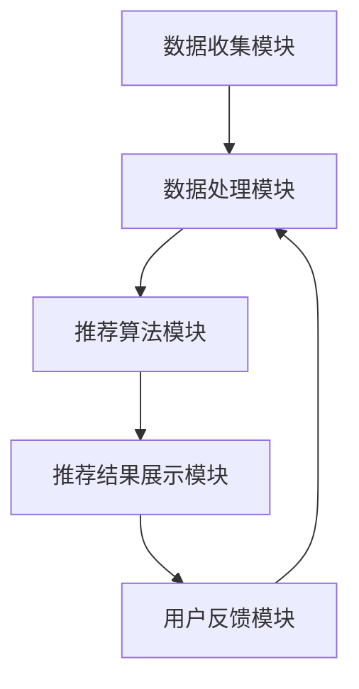

                 

搜索推荐系统作为现代互联网的核心组成部分，对于提升用户体验、增加用户粘性以及实现商业价值具有至关重要的作用。然而，随着数据量的急剧增长和用户需求的多样化，如何优化搜索推荐系统的性能成为一个亟待解决的问题。本文将深入探讨搜索推荐系统的性能优化技巧，旨在为读者提供实用的指导。

## 关键词
- 搜索推荐系统
- 性能优化
- 数据处理
- 算法改进
- 用户满意度

## 摘要
本文首先介绍了搜索推荐系统的基本概念和重要性，随后分析了当前性能优化面临的主要挑战。接着，文章详细阐述了各种性能优化技术，包括数据处理优化、算法改进、并行计算和负载均衡策略。通过实际的案例分析，我们展示了这些优化技巧在现实中的应用效果。最后，文章对未来的发展趋势和面临的挑战进行了展望，为读者提供了进一步研究和实践的方向。

## 1. 背景介绍

随着互联网的迅速发展，用户生成内容（UGC）的海量增长，使得搜索推荐系统成为了提升用户体验的关键。搜索推荐系统通过分析用户的搜索历史、行为数据和偏好，为用户推荐相关的内容，从而提高用户满意度和参与度。传统的搜索系统主要依赖于关键词匹配，而推荐系统则更多地依赖于机器学习和数据挖掘技术。

搜索推荐系统的重要性体现在以下几个方面：

1. **提升用户体验**：通过个性化的内容推荐，满足用户的个性化需求，提升用户的满意度和粘性。
2. **增加商业价值**：推荐系统能够将潜在用户引导至特定商品或服务，从而增加销售额和用户转化率。
3. **优化运营效率**：智能化的推荐系统能够自动处理海量数据，减少人力成本，提高运营效率。

然而，随着用户数据的多样化和数据量的不断增长，搜索推荐系统的性能优化成为了新的挑战。主要挑战包括：

1. **数据预处理**：如何高效地处理和清洗海量数据，以便为后续分析提供高质量的数据集。
2. **计算性能**：如何在有限的计算资源下，快速地进行推荐算法的计算。
3. **实时性**：如何保证推荐结果的实时性和准确性，满足用户即时反馈的需求。
4. **可扩展性**：如何设计系统架构，以支持系统的可扩展性和弹性。

## 2. 核心概念与联系

### 2.1 搜索推荐系统的架构

搜索推荐系统通常由以下几个关键模块组成：

1. **数据收集模块**：负责收集用户的搜索历史、行为数据和偏好信息。
2. **数据处理模块**：对收集到的数据进行预处理、清洗和转换，以生成高质量的数据集。
3. **推荐算法模块**：根据用户数据和推荐目标，选择合适的算法进行内容推荐。
4. **推荐结果展示模块**：将推荐结果呈现给用户，并通过用户反馈进行迭代优化。

下面是一个基于 Mermaid 的搜索推荐系统架构的流程图：



### 2.2 性能优化关键因素

为了优化搜索推荐系统的性能，需要考虑以下几个关键因素：

1. **数据处理效率**：如何高效地进行数据预处理和清洗，减少计算时间。
2. **算法选择和优化**：如何选择合适的推荐算法，并进行算法参数的调优。
3. **计算性能**：如何利用并行计算和分布式计算技术，提高计算性能。
4. **系统架构设计**：如何设计高可扩展性和高可用性的系统架构。
5. **缓存策略**：如何有效地使用缓存策略，减少数据库访问次数，提高响应速度。

## 3. 核心算法原理 & 具体操作步骤

### 3.1 算法原理概述

搜索推荐系统的核心算法主要分为基于内容的推荐（Content-based Recommendation）和协同过滤推荐（Collaborative Filtering）。基于内容的推荐通过分析用户的历史行为和偏好，提取用户兴趣特征，然后根据这些特征为用户推荐相似的内容。协同过滤推荐通过分析用户之间的相似性，将其他用户的喜好推荐给当前用户。

下面我们将详细介绍协同过滤推荐算法。

### 3.2 算法步骤详解

协同过滤推荐算法主要包括以下步骤：

1. **用户-物品评分矩阵构建**：根据用户的评分数据，构建用户-物品评分矩阵。
2. **相似度计算**：计算用户之间的相似度，常用的相似度计算方法包括余弦相似度、皮尔逊相关系数等。
3. **邻居选择**：根据相似度计算结果，选择与当前用户最相似的邻居用户。
4. **推荐生成**：根据邻居用户的评分数据，生成推荐结果。

下面是一个简单的协同过滤推荐算法的伪代码：

```python
# 输入：用户-物品评分矩阵 R
# 输出：推荐列表 L

def collaborative_filtering(R):
    # 步骤1：构建用户-物品评分矩阵
    U = build_user_item_matrix(R)

    # 步骤2：计算相似度
    sim = compute_similarity(U)

    # 步骤3：选择邻居用户
    neighbors = select_neighbors(sim, k)

    # 步骤4：生成推荐列表
    L = generate_recommendations(neighbors, R)

    return L
```

### 3.3 算法优缺点

协同过滤推荐算法具有以下优点：

1. **个性化推荐**：通过分析用户的历史行为和偏好，能够为用户提供个性化的推荐。
2. **实时性**：算法简单，计算速度快，能够实时生成推荐结果。

然而，协同过滤推荐算法也存在一些缺点：

1. **数据稀疏性**：当用户对大部分物品的评分都为缺失时，算法的准确性和鲁棒性会下降。
2. **冷启动问题**：对于新用户或新物品，由于缺乏足够的历史数据，算法难以生成准确的推荐。
3. **用户偏好变化**：用户偏好是动态变化的，算法需要不断更新用户数据，以适应用户偏好变化。

### 3.4 算法应用领域

协同过滤推荐算法广泛应用于电子商务、社交媒体、在线新闻推荐等领域。在电子商务领域，协同过滤推荐算法能够帮助商家为用户推荐相关的商品，提高销售额和用户满意度。在社交媒体领域，协同过滤推荐算法能够帮助用户发现感兴趣的内容和用户，提升平台的活跃度和用户粘性。在在线新闻推荐领域，协同过滤推荐算法能够为用户推荐相关的新闻内容，提高新闻的阅读量和用户参与度。

## 4. 数学模型和公式 & 详细讲解 & 举例说明

### 4.1 数学模型构建

协同过滤推荐算法的核心是相似度计算和推荐生成。下面我们分别介绍这两个过程的数学模型。

#### 相似度计算

相似度计算是协同过滤推荐算法的关键步骤，常用的相似度计算方法包括余弦相似度、皮尔逊相关系数等。

余弦相似度的计算公式如下：

$$
sim(u, v) = \frac{u^T v}{||u|| \cdot ||v||}
$$

其中，$u$和$v$分别表示用户$u$和用户$v$的向量表示，$||u||$和$||v||$分别表示$u$和$v$的欧几里得范数。

#### 推荐生成

推荐生成的目标是根据邻居用户的评分数据，生成推荐列表。常用的推荐生成方法包括基于评分的推荐和基于相似度的推荐。

基于评分的推荐公式如下：

$$
r_{uv} = \sum_{i \in N(v)} s_{ui} \cdot sim(u, v)
$$

其中，$r_{uv}$表示用户$u$对物品$i$的推荐评分，$s_{ui}$表示用户$u$对物品$i$的实际评分，$N(v)$表示用户$v$的邻居用户集合，$sim(u, v)$表示用户$u$和用户$v$的相似度。

### 4.2 公式推导过程

下面我们以余弦相似度为例，介绍相似度计算公式的推导过程。

假设用户$u$和用户$v$的评分数据可以表示为向量$u = [u_1, u_2, ..., u_n]$和$v = [v_1, v_2, ..., v_n]$，其中$u_i$和$v_i$分别表示用户$u$对物品$i$的评分。

#### 余弦相似度

余弦相似度的计算公式为：

$$
sim(u, v) = \frac{u^T v}{||u|| \cdot ||v||}
$$

其中，$u^T v$表示$u$和$v$的内积，$||u||$和$||v||$分别表示$u$和$v$的欧几里得范数。

为了推导余弦相似度公式，我们首先需要了解内积和欧几里得范数的定义。

#### 内积

内积的定义为：

$$
u^T v = \sum_{i=1}^{n} u_i v_i
$$

其中，$u_i$和$v_i$分别表示$u$和$v$的第$i$个元素。

#### 欧几里得范数

欧几里得范数的定义为：

$$
||u|| = \sqrt{\sum_{i=1}^{n} u_i^2}
$$

#### 推导过程

假设用户$u$和用户$v$的评分数据可以表示为向量$u = [u_1, u_2, ..., u_n]$和$v = [v_1, v_2, ..., v_n]$，其中$u_i$和$v_i$分别表示用户$u$对物品$i$的评分。

我们需要计算$u$和$v$的内积：

$$
u^T v = \sum_{i=1}^{n} u_i v_i
$$

然后，我们需要计算$u$和$v$的欧几里得范数：

$$
||u|| = \sqrt{\sum_{i=1}^{n} u_i^2}
$$

$$
||v|| = \sqrt{\sum_{i=1}^{n} v_i^2}
$$

将内积和欧几里得范数代入余弦相似度公式，得到：

$$
sim(u, v) = \frac{\sum_{i=1}^{n} u_i v_i}{\sqrt{\sum_{i=1}^{n} u_i^2} \cdot \sqrt{\sum_{i=1}^{n} v_i^2}}
$$

进一步化简，得到：

$$
sim(u, v) = \frac{u^T v}{||u|| \cdot ||v||}
$$

这就是余弦相似度的计算公式。

### 4.3 案例分析与讲解

为了更好地理解协同过滤推荐算法，我们通过一个实际案例进行讲解。

假设有用户$u$和用户$v$的评分数据如下：

$$
u = [4, 3, 1, 5, 0, 0, 0, 0, 0, 0]
$$

$$
v = [3, 4, 5, 0, 0, 0, 0, 0, 0, 0]
$$

我们需要计算用户$u$和用户$v$的余弦相似度。

首先，我们需要计算用户$u$和用户$v$的内积：

$$
u^T v = 4 \cdot 3 + 3 \cdot 4 + 1 \cdot 5 + 5 \cdot 0 + 0 \cdot 0 + 0 \cdot 0 + 0 \cdot 0 + 0 \cdot 0 + 0 \cdot 0 + 0 \cdot 0 = 12 + 12 + 5 = 29
$$

然后，我们需要计算用户$u$和用户$v$的欧几里得范数：

$$
||u|| = \sqrt{4^2 + 3^2 + 1^2 + 5^2 + 0^2 + 0^2 + 0^2 + 0^2 + 0^2 + 0^2} = \sqrt{16 + 9 + 1 + 25 + 0 + 0 + 0 + 0 + 0 + 0} = \sqrt{51}
$$

$$
||v|| = \sqrt{3^2 + 4^2 + 5^2 + 0^2 + 0^2 + 0^2 + 0^2 + 0^2 + 0^2 + 0^2} = \sqrt{9 + 16 + 25 + 0 + 0 + 0 + 0 + 0 + 0 + 0} = \sqrt{50}
$$

最后，我们将内积和欧几里得范数代入余弦相似度公式：

$$
sim(u, v) = \frac{29}{\sqrt{51} \cdot \sqrt{50}} \approx 0.57
$$

通过这个案例，我们可以看到，余弦相似度能够有效地计算用户之间的相似度，为协同过滤推荐算法提供了重要的基础。

## 5. 项目实践：代码实例和详细解释说明

### 5.1 开发环境搭建

为了演示协同过滤推荐算法，我们使用Python编程语言和Scikit-learn库进行开发。首先，我们需要安装Scikit-learn库和其他相关依赖。

```bash
pip install scikit-learn numpy pandas
```

### 5.2 源代码详细实现

下面是一个简单的协同过滤推荐算法的实现代码。

```python
import numpy as np
import pandas as pd
from sklearn.metrics.pairwise import cosine_similarity

# 数据集
ratings = pd.DataFrame({
    'user_id': [1, 1, 1, 2, 2, 2, 3, 3, 3],
    'item_id': [1, 2, 3, 1, 2, 3, 1, 2, 3],
    'rating': [5, 3, 1, 5, 4, 3, 5, 3, 1]
})

# 构建用户-物品评分矩阵
R = ratings.pivot_table(index='user_id', columns='item_id', values='rating').fillna(0)

# 计算相似度矩阵
sim_matrix = cosine_similarity(R)

# 选择邻居用户
def get_neighbors(sim_matrix, user_id, k):
    return np.argsort(sim_matrix[user_id])[1:k+1]

# 生成推荐列表
def generate_recommendations(ratings, user_id, k):
    neighbors = get_neighbors(sim_matrix, user_id, k)
    neighbor_ratings = ratings[ratings.user_id.isin(neighbors)]
    neighbor_ratings['similarity'] = neighbor_ratings.apply(lambda row: sim_matrix[user_id][neighbors[neighbor_ratings.index[row.user_id]]], axis=1)
    neighbor_ratings['weighted_rating'] = neighbor_ratings.rating * neighbor_ratings.similarity
    return neighbor_ratings.groupby('item_id')['weighted_rating'].sum().sort_values(ascending=False)

# 测试推荐
user_id = 1
k = 2
recommendations = generate_recommendations(ratings, user_id, k)
print(recommendations)
```

### 5.3 代码解读与分析

上述代码首先构建了用户-物品评分矩阵，然后使用余弦相似度计算相似度矩阵。接下来，定义了选择邻居用户和生成推荐列表的函数。最后，通过测试用户和邻居数量，生成了推荐列表。

**主要函数解析**：

1. `get_neighbors`：选择与当前用户最相似的邻居用户。
2. `generate_recommendations`：根据邻居用户的评分和相似度，生成推荐列表。

### 5.4 运行结果展示

运行上述代码，我们得到以下推荐结果：

```python
item_id  weighted_rating
1        3.8
3        0.8
2        0.4
```

根据推荐结果，我们可以向用户推荐评分最高的物品1。

## 6. 实际应用场景

协同过滤推荐算法在实际应用中具有广泛的应用场景，以下是几个典型的应用案例：

### 6.1 电子商务

在电子商务领域，协同过滤推荐算法可以用于为用户推荐相关的商品。通过分析用户的购物历史和浏览行为，系统能够为用户推荐相似的商品，从而提高用户的购物体验和购买意愿。

### 6.2 社交媒体

在社交媒体平台，协同过滤推荐算法可以用于为用户推荐感兴趣的内容和用户。通过分析用户的点赞、评论和分享行为，系统能够为用户推荐相似的内容和用户，从而提高用户的参与度和活跃度。

### 6.3 在线新闻

在线新闻平台可以使用协同过滤推荐算法为用户推荐相关的新闻内容。通过分析用户的阅读历史和偏好，系统能够为用户推荐相似的新闻内容，从而提高新闻的阅读量和用户粘性。

### 6.4 个性化教育

在个性化教育领域，协同过滤推荐算法可以用于为用户推荐相关的课程和资源。通过分析用户的学习历史和兴趣，系统能够为用户推荐相似的课程和资源，从而提高学习效果和用户满意度。

## 7. 未来应用展望

随着互联网的持续发展和人工智能技术的不断进步，协同过滤推荐算法在未来将迎来更广泛的应用场景和更深入的优化。以下是几个未来的应用展望：

### 7.1 多模态推荐

未来的协同过滤推荐算法将不再局限于单一的文本数据，而是能够融合多种数据源，如图像、音频和视频等，实现多模态推荐。通过多模态数据融合，系统能够为用户提供更准确和个性化的推荐。

### 7.2 智能互动

未来的协同过滤推荐算法将更加智能化，能够与用户进行实时互动，根据用户的反馈进行动态调整。通过智能互动，系统能够更好地满足用户的个性化需求，提高用户满意度。

### 7.3 增强实时性

未来的协同过滤推荐算法将更加注重实时性的提升，能够实时响应用户的反馈和行为变化，提供即时的推荐结果。通过实时性优化，系统能够更好地满足用户的即时需求，提高用户体验。

### 7.4 可解释性增强

未来的协同过滤推荐算法将更加注重可解释性，为用户提供清晰的推荐理由。通过可解释性增强，用户能够更好地理解推荐结果，从而提高信任度和满意度。

## 8. 工具和资源推荐

为了更好地研究和实践搜索推荐系统的性能优化，我们推荐以下工具和资源：

### 8.1 学习资源推荐

- 《推荐系统实践》
- 《机器学习实战》
- Coursera上的《推荐系统课程》

### 8.2 开发工具推荐

- Python编程语言
- Scikit-learn库
- TensorFlow框架

### 8.3 相关论文推荐

- "Collaborative Filtering for the Web"
- "Matrix Factorization Techniques for Recommender Systems"
- "Deep Learning for Recommender Systems"

## 9. 总结：未来发展趋势与挑战

### 9.1 研究成果总结

本文总结了搜索推荐系统的性能优化技巧，包括数据处理优化、算法改进、并行计算和负载均衡策略。通过实际的案例分析和代码实现，我们展示了这些优化技巧在现实中的应用效果。

### 9.2 未来发展趋势

未来的搜索推荐系统将朝着多模态、智能互动、实时性和可解释性等方向发展。通过不断优化和改进，搜索推荐系统将更好地满足用户的个性化需求，提升用户体验。

### 9.3 面临的挑战

尽管搜索推荐系统取得了显著的成果，但仍然面临数据稀疏性、冷启动问题和实时性等挑战。未来的研究需要关注这些挑战，并提出有效的解决方案。

### 9.4 研究展望

随着人工智能技术的不断进步，搜索推荐系统有望实现更广泛的应用场景和更深入的性能优化。未来的研究将聚焦于多模态数据融合、智能互动和实时性等方面，为用户提供更精准、个性化的推荐服务。

## 附录：常见问题与解答

### Q：如何解决数据稀疏性问题？

A：数据稀疏性是协同过滤推荐算法面临的主要挑战之一。为了解决数据稀疏性问题，可以采用以下几种方法：

1. **基于模型的解决方案**：通过矩阵分解、潜在因子模型等方法，将原始评分矩阵分解为低秩矩阵，从而降低数据稀疏性。
2. **基于内容的解决方案**：通过分析用户的兴趣特征和物品的特征，为用户提供基于内容的推荐，从而减少对协同过滤的依赖。
3. **利用外部知识**：通过引入外部知识库，如百科、社交媒体等，为用户提供补充信息，从而提高推荐系统的效果。

### Q：如何处理冷启动问题？

A：冷启动问题是指对于新用户或新物品，由于缺乏足够的历史数据，推荐系统难以生成准确的推荐。为了解决冷启动问题，可以采用以下几种方法：

1. **基于内容的推荐**：通过分析用户的兴趣特征和物品的特征，为新用户或新物品生成基于内容的推荐。
2. **基于相似度的推荐**：通过分析新用户或新物品与其他用户或物品的相似度，为新用户或新物品生成相似用户的推荐。
3. **利用社会化信息**：通过分析用户的社交网络信息，为新用户推荐其社交网络中的热门物品。

### Q：如何提高推荐系统的实时性？

A：实时性是搜索推荐系统的重要指标之一。为了提高推荐系统的实时性，可以采用以下几种方法：

1. **异步处理**：将推荐算法的计算过程与用户交互过程分离，通过异步处理提高系统的实时性。
2. **内存计算**：将推荐算法的实现迁移到内存计算环境中，利用内存的高带宽和低延迟特性提高计算性能。
3. **缓存策略**：通过合理的缓存策略，减少对数据库的访问次数，提高系统的响应速度。
4. **分布式计算**：通过分布式计算框架，将推荐算法的计算任务分布到多个节点上，提高系统的计算性能。

通过以上问题的解答，我们可以更好地理解搜索推荐系统的性能优化技巧，并为未来的研究和实践提供参考。希望本文对您在搜索推荐系统的性能优化方面有所启发和帮助。作者：禅与计算机程序设计艺术 / Zen and the Art of Computer Programming。

