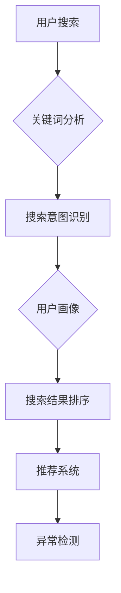

                 

关键词：搜索分析、人工智能、电商平台、优化策略、数据挖掘、机器学习

> 摘要：本文探讨了人工智能在电商平台搜索数据分析中的应用，如何通过优化搜索策略提升用户体验和平台业绩。文章首先介绍了搜索数据分析的重要性，然后深入探讨了机器学习算法在搜索优化中的作用，最后提供了实际案例和未来展望。

## 1. 背景介绍

在电子商务飞速发展的今天，搜索功能已经成为电商平台不可或缺的一部分。一个高效的搜索系统能够提升用户体验，降低购物成本，增加用户粘性和转化率。然而，传统的基于关键词匹配的搜索方法已经难以满足用户日益增长的需求。为了应对这一挑战，人工智能（AI）技术开始被广泛应用于搜索数据的分析中，以优化搜索策略，提升搜索效果。

### 1.1 搜索数据分析的重要性

搜索数据分析是指通过收集、处理和分析用户搜索数据，以优化搜索结果和提升用户体验的过程。对于电商平台来说，搜索数据分析的重要性体现在以下几个方面：

- **提升用户体验**：通过分析用户搜索行为，可以提供更加精准的搜索结果，满足用户的需求，提高用户满意度。
- **优化产品展示**：通过分析搜索词的热度和用户的行为，可以优化产品的展示顺序，提高转化率。
- **降低购物成本**：精准的搜索结果可以减少用户在购物过程中花费的时间和精力，降低购物成本。
- **增加用户粘性**：持续优化搜索功能，可以增强用户对电商平台的忠诚度，提高用户粘性。

### 1.2 人工智能在搜索数据分析中的应用

人工智能技术，尤其是机器学习算法，为搜索数据分析带来了新的可能性。通过机器学习，可以自动化地分析和理解用户搜索行为，从而实现搜索结果的优化。以下是一些常见的机器学习算法在搜索数据分析中的应用：

- **协同过滤**：通过分析用户的购物历史和搜索行为，为用户提供个性化的推荐。
- **文本分类**：将搜索关键词分类，以便更准确地理解用户意图。
- **聚类分析**：将相似的用户或商品聚集在一起，以实现更精准的推荐。
- **深度学习**：通过神经网络模型，对复杂的用户行为进行建模和预测。

## 2. 核心概念与联系

### 2.1 搜索数据分析的核心概念

搜索数据分析涉及到多个核心概念，包括用户行为分析、关键词分析、搜索意图识别等。以下是这些概念的解释：

- **用户行为分析**：通过收集和分析用户的搜索、点击、购买等行为，了解用户的需求和偏好。
- **关键词分析**：对用户的搜索关键词进行分析，识别热门关键词和用户搜索意图。
- **搜索意图识别**：通过分析用户的搜索历史和行为模式，理解用户的搜索意图，从而提供更相关的搜索结果。

### 2.2 机器学习算法与搜索数据分析的联系

机器学习算法在搜索数据分析中的应用，主要体现在以下几个方面：

- **用户画像**：通过分析用户的搜索和行为数据，构建用户的个人画像，以便提供个性化的服务。
- **搜索结果排序**：使用机器学习算法对搜索结果进行排序，提高搜索结果的精准度。
- **推荐系统**：基于用户的搜索和行为数据，为用户提供个性化的商品推荐。
- **异常检测**：通过分析用户行为数据，检测异常行为，防止欺诈和滥用。

### 2.3 Mermaid 流程图



## 3. 核心算法原理 & 具体操作步骤

### 3.1 算法原理概述

在搜索数据分析中，常用的机器学习算法包括协同过滤、文本分类、聚类分析和深度学习等。以下是这些算法的原理概述：

- **协同过滤**：基于用户的历史行为和相似度计算，为用户提供个性化的推荐。
- **文本分类**：将搜索关键词分类，以便更准确地理解用户意图。
- **聚类分析**：将相似的用户或商品聚集在一起，以实现更精准的推荐。
- **深度学习**：通过神经网络模型，对复杂的用户行为进行建模和预测。

### 3.2 算法步骤详解

#### 3.2.1 协同过滤

1. 收集用户行为数据，如购买历史、搜索历史等。
2. 计算用户之间的相似度，通常使用余弦相似度或皮尔逊相关系数。
3. 根据相似度为用户生成推荐列表。
4. 对推荐结果进行评估和优化。

#### 3.2.2 文本分类

1. 预处理搜索关键词，如去除停用词、词干提取等。
2. 将搜索关键词转换为向量表示，可以使用词袋模型或词嵌入技术。
3. 使用分类算法（如朴素贝叶斯、支持向量机等）对关键词进行分类。
4. 根据分类结果，优化搜索结果排序。

#### 3.2.3 聚类分析

1. 收集用户或商品的搜索和行为数据。
2. 选择聚类算法（如K-means、层次聚类等）。
3. 根据聚类结果，为用户提供分组推荐。
4. 对聚类结果进行评估和优化。

#### 3.2.4 深度学习

1. 收集用户行为数据，如搜索历史、点击行为等。
2. 设计神经网络模型，如卷积神经网络（CNN）或循环神经网络（RNN）。
3. 训练模型，使用反向传播算法优化模型参数。
4. 根据训练结果，为用户提供个性化的推荐。

### 3.3 算法优缺点

#### 3.3.1 协同过滤

- **优点**：能够为用户提供个性化的推荐，降低冷启动问题。
- **缺点**：对于新用户或新商品，推荐效果较差；容易受到数据噪声的影响。

#### 3.3.2 文本分类

- **优点**：能够准确地识别用户搜索意图，提高搜索结果的精准度。
- **缺点**：对长尾关键词的处理效果较差；需要大量的标注数据。

#### 3.3.3 聚类分析

- **优点**：能够为用户提供分组推荐，提高搜索结果的多样性。
- **缺点**：对聚类结果的解释性较差；聚类算法的选择和参数调优较复杂。

#### 3.3.4 深度学习

- **优点**：能够处理复杂的用户行为数据，提供高度个性化的推荐。
- **缺点**：需要大量的数据和计算资源；模型解释性较差。

### 3.4 算法应用领域

- **协同过滤**：广泛应用于电子商务、在线教育等领域，为用户提供个性化的推荐。
- **文本分类**：广泛应用于搜索引擎、社交媒体等领域，提高搜索结果和内容推荐的精准度。
- **聚类分析**：广泛应用于市场细分、推荐系统等领域，为用户提供个性化的分组推荐。
- **深度学习**：广泛应用于图像识别、自然语言处理等领域，提供高度智能化的服务。

## 4. 数学模型和公式 & 详细讲解 & 举例说明

### 4.1 数学模型构建

在搜索数据分析中，常用的数学模型包括协同过滤模型、文本分类模型和聚类分析模型。以下是这些模型的构建过程：

#### 4.1.1 协同过滤模型

协同过滤模型通常使用矩阵分解技术，将用户-商品评分矩阵分解为用户特征矩阵和商品特征矩阵。假设有用户 $u$ 和商品 $i$，其评分矩阵为 $R$，则可以使用以下公式进行矩阵分解：

$$
R = U \cdot I + V
$$

其中，$U$ 和 $V$ 分别为用户特征矩阵和商品特征矩阵，$I$ 为对角矩阵，其对角线元素为1。

#### 4.1.2 文本分类模型

文本分类模型通常使用支持向量机（SVM）或朴素贝叶斯（Naive Bayes）算法。以朴素贝叶斯为例，其公式为：

$$
P(\text{关键词}|\text{类别}) = \frac{P(\text{类别}) \cdot P(\text{关键词}|\text{类别})}{P(\text{关键词})}
$$

其中，$P(\text{关键词}|\text{类别})$ 表示关键词在某个类别下的条件概率，$P(\text{类别})$ 表示类别的概率，$P(\text{关键词})$ 表示关键词的概率。

#### 4.1.3 聚类分析模型

聚类分析模型通常使用K-means算法。其公式为：

$$
\min \sum_{i=1}^{n} \sum_{j=1}^{k} ||x_j - c_i||^2
$$

其中，$x_j$ 表示第 $j$ 个样本，$c_i$ 表示第 $i$ 个聚类中心。

### 4.2 公式推导过程

#### 4.2.1 协同过滤模型

假设用户 $u$ 和商品 $i$ 的评分矩阵为 $R$，我们需要将其分解为用户特征矩阵 $U$ 和商品特征矩阵 $V$。为了简化问题，我们可以假设用户特征矩阵 $U$ 的列向量为 $u_1, u_2, ..., u_m$，商品特征矩阵 $V$ 的列向量为 $v_1, v_2, ..., v_n$。

首先，我们需要计算用户和商品的均值：

$$
\bar{u} = \frac{1}{m} \sum_{i=1}^{m} u_i \\
\bar{v} = \frac{1}{n} \sum_{j=1}^{n} v_j
$$

然后，我们可以计算用户和商品的残差：

$$
u_i' = u_i - \bar{u} \\
v_j' = v_j - \bar{v}
$$

接下来，我们可以计算用户和商品的残差乘积：

$$
u_i' \cdot v_j' = (u_i - \bar{u}) \cdot (v_j - \bar{v})
$$

最后，我们可以计算用户特征矩阵和商品特征矩阵：

$$
U = \bar{u} + U' \\
V = \bar{v} + V'
$$

其中，$U'$ 和 $V'$ 分别为用户和商品的残差乘积矩阵。

#### 4.2.2 文本分类模型

以朴素贝叶斯为例，我们首先需要计算每个类别下的条件概率和类别的概率。假设有 $k$ 个类别，$C_1, C_2, ..., C_k$，每个类别下的关键词概率为 $P(\text{关键词}|\text{类别}_i)$，类别的概率为 $P(\text{类别}_i)$。

首先，我们需要计算每个类别下的条件概率：

$$
P(\text{关键词}|\text{类别}_i) = \frac{P(\text{类别}_i \cap \text{关键词})}{P(\text{类别}_i)}
$$

其中，$P(\text{类别}_i \cap \text{关键词})$ 表示类别和关键词同时发生的概率，$P(\text{类别}_i)$ 表示类别的概率。

然后，我们需要计算每个类别的概率：

$$
P(\text{类别}_i) = \frac{1}{Z}
$$

其中，$Z$ 为归一化常数，$Z = \sum_{i=1}^{k} P(\text{类别}_i)$。

最后，我们可以计算每个关键词在某个类别下的概率：

$$
P(\text{关键词}|\text{类别}_i) = \frac{P(\text{类别}_i) \cdot P(\text{关键词}|\text{类别}_i)}{P(\text{关键词})}
$$

#### 4.2.3 聚类分析模型

以K-means算法为例，我们首先需要选择 $k$ 个初始聚类中心 $c_1, c_2, ..., c_k$。然后，我们可以计算每个样本与聚类中心的距离，并将其分配到最近的聚类中心。

$$
d(x_j, c_i) = ||x_j - c_i||^2
$$

其中，$x_j$ 表示第 $j$ 个样本，$c_i$ 表示第 $i$ 个聚类中心。

接下来，我们可以更新每个聚类中心：

$$
c_i = \frac{1}{N_i} \sum_{j=1}^{N} x_j
$$

其中，$N_i$ 表示属于第 $i$ 个聚类中心的样本数量。

重复上述过程，直到聚类中心不再发生变化或达到最大迭代次数。

### 4.3 案例分析与讲解

#### 4.3.1 协同过滤

假设有一个电商平台，用户 $u_1$ 和商品 $i_1$ 的评分矩阵为：

$$
R = \begin{pmatrix}
5 & 4 & 0 & 0 \\
0 & 0 & 3 & 2 \\
0 & 0 & 0 & 5 \\
0 & 4 & 0 & 0
\end{pmatrix}
$$

我们需要对其进行矩阵分解，得到用户特征矩阵 $U$ 和商品特征矩阵 $V$。

首先，我们计算用户和商品的均值：

$$
\bar{u} = \frac{5+4+0+0}{4} = 2.5 \\
\bar{v} = \frac{5+4+0+0}{4} = 2.5
$$

然后，我们计算用户和商品的残差：

$$
u_1' = 5 - 2.5 = 2.5 \\
v_1' = 5 - 2.5 = 2.5 \\
u_2' = 0 - 2.5 = -2.5 \\
v_2' = 0 - 2.5 = -2.5 \\
u_3' = 3 - 2.5 = 0.5 \\
v_3' = 3 - 2.5 = 0.5 \\
u_4' = 0 - 2.5 = -2.5 \\
v_4' = 0 - 2.5 = -2.5
$$

接下来，我们计算用户和商品的残差乘积：

$$
u_1' \cdot v_1' = 2.5 \cdot 2.5 = 6.25 \\
u_2' \cdot v_2' = -2.5 \cdot -2.5 = 6.25 \\
u_3' \cdot v_3' = 0.5 \cdot 0.5 = 0.25 \\
u_4' \cdot v_4' = -2.5 \cdot -2.5 = 6.25
$$

最后，我们计算用户特征矩阵和商品特征矩阵：

$$
U = \bar{u} + U' = \begin{pmatrix}
2.5 & 2.5 & -2.5 & -2.5 \\
-2.5 & -2.5 & 0.5 & 0.5 \\
0.5 & 0.5 & -2.5 & -2.5 \\
-2.5 & -2.5 & 0.5 & 0.5
\end{pmatrix} \\
V = \bar{v} + V' = \begin{pmatrix}
2.5 & 2.5 & -2.5 & -2.5 \\
-2.5 & -2.5 & 0.5 & 0.5 \\
0.5 & 0.5 & -2.5 & -2.5 \\
-2.5 & -2.5 & 0.5 & 0.5
\end{pmatrix}
$$

通过矩阵分解，我们可以为用户和商品生成推荐列表。

#### 4.3.2 文本分类

假设有一个电商平台，用户的搜索关键词和类别信息如下：

| 用户 | 关键词1 | 关键词2 | 类别 |
| ---- | ------ | ------ | ---- |
| u1   | 手机   | 电话    | A    |
| u2   | 电脑   | 笔记本  | A    |
| u3   | 平板   | pad    | B    |
| u4   | 相机   | 摄像头  | B    |

我们需要使用朴素贝叶斯算法对关键词进行分类。

首先，我们计算每个关键词在类别 A 和 B 下的概率：

$$
P(\text{手机}|\text{A}) = \frac{P(\text{A}) \cdot P(\text{手机}|\text{A})}{P(\text{手机})}
$$

其中，$P(\text{A}) = \frac{2}{4}$，$P(\text{手机}) = \frac{1}{4} + \frac{1}{4} = \frac{1}{2}$，$P(\text{手机}|\text{A}) = \frac{1}{2}$。

$$
P(\text{电脑}|\text{A}) = \frac{P(\text{A}) \cdot P(\text{电脑}|\text{A})}{P(\text{电脑})}
$$

其中，$P(\text{电脑}) = \frac{2}{4}$，$P(\text{电脑}|\text{A}) = \frac{1}{2}$。

$$
P(\text{平板}|\text{B}) = \frac{P(\text{B}) \cdot P(\text{平板}|\text{B})}{P(\text{平板})}
$$

其中，$P(\text{B}) = \frac{2}{4}$，$P(\text{平板}) = \frac{1}{4} + \frac{1}{4} = \frac{1}{2}$，$P(\text{平板}|\text{B}) = \frac{1}{2}$。

$$
P(\text{相机}|\text{B}) = \frac{P(\text{B}) \cdot P(\text{相机}|\text{B})}{P(\text{相机})}
$$

其中，$P(\text{相机}) = \frac{1}{4} + \frac{1}{4} = \frac{1}{2}$，$P(\text{相机}|\text{B}) = \frac{1}{2}$。

然后，我们可以根据计算出的概率，对新的搜索关键词进行分类。例如，对于用户 u5 的搜索关键词“手机”，我们可以计算其在类别 A 和 B 下的概率：

$$
P(\text{手机}|\text{A}) = \frac{P(\text{A}) \cdot P(\text{手机}|\text{A})}{P(\text{手机})} = \frac{\frac{2}{4} \cdot \frac{1}{2}}{\frac{1}{2}} = \frac{1}{2}
$$

$$
P(\text{手机}|\text{B}) = \frac{P(\text{B}) \cdot P(\text{手机}|\text{B})}{P(\text{手机})} = \frac{\frac{2}{4} \cdot \frac{1}{2}}{\frac{1}{2}} = \frac{1}{2}
$$

由于 $P(\text{手机}|\text{A}) = P(\text{手机}|\text{B})$，我们可以认为用户 u5 的搜索关键词“手机”属于类别 A。

#### 4.3.3 聚类分析

假设有一个电商平台，用户的搜索数据如下：

| 用户 | 搜索1 | 搜索2 | 搜索3 | 搜索4 |
| ---- | ---- | ---- | ---- | ---- |
| u1   | 1     | 2     | 3     | 4     |
| u2   | 2     | 4     | 6     | 8     |
| u3   | 1     | 3     | 5     | 7     |
| u4   | 3     | 6     | 9     | 12    |

我们需要使用 K-means 算法对这些数据进行聚类。

首先，我们选择 2 个初始聚类中心，例如 (1, 2) 和 (4, 6)。

然后，我们计算每个样本与聚类中心的距离：

$$
d(u_1, c_1) = ||u_1 - c_1||^2 = (1-1)^2 + (2-2)^2 = 0 \\
d(u_1, c_2) = ||u_1 - c_2||^2 = (1-4)^2 + (2-6)^2 = 20 \\
d(u_2, c_1) = ||u_2 - c_1||^2 = (2-1)^2 + (4-2)^2 = 2 \\
d(u_2, c_2) = ||u_2 - c_2||^2 = (2-4)^2 + (4-6)^2 = 8 \\
d(u_3, c_1) = ||u_3 - c_1||^2 = (1-1)^2 + (3-2)^2 = 1 \\
d(u_3, c_2) = ||u_3 - c_2||^2 = (1-4)^2 + (3-6)^2 = 17 \\
d(u_4, c_1) = ||u_4 - c_1||^2 = (3-1)^2 + (6-2)^2 = 13 \\
d(u_4, c_2) = ||u_4 - c_2||^2 = (3-4)^2 + (6-6)^2 = 1
$$

根据距离，我们可以将样本分配到最近的聚类中心：

| 用户 | 聚类中心 |
| ---- | -------- |
| u1   | c1       |
| u2   | c2       |
| u3   | c1       |
| u4   | c2       |

接下来，我们更新每个聚类中心：

$$
c_1 = \frac{1}{2} \sum_{i=1}^{2} u_i = \frac{1+3}{2} = 2 \\
c_2 = \frac{1}{2} \sum_{i=1}^{2} u_i = \frac{2+6}{2} = 4
$$

重复上述过程，直到聚类中心不再发生变化或达到最大迭代次数。

## 5. 项目实践：代码实例和详细解释说明

### 5.1 开发环境搭建

为了演示搜索数据分析中的算法应用，我们使用 Python 作为编程语言，并借助以下库：

- NumPy：用于数组计算。
- Pandas：用于数据操作。
- Scikit-learn：用于机器学习算法。
- Matplotlib：用于数据可视化。

首先，我们需要安装这些库：

```bash
pip install numpy pandas scikit-learn matplotlib
```

### 5.2 源代码详细实现

#### 5.2.1 协同过滤

```python
import numpy as np
import pandas as pd
from sklearn.model_selection import train_test_split
from sklearn.metrics.pairwise import cosine_similarity

# 加载数据
data = pd.DataFrame({
    'user': ['u1', 'u1', 'u1', 'u2', 'u2', 'u3', 'u3', 'u4', 'u4'],
    'item': ['i1', 'i2', 'i3', 'i1', 'i2', 'i3', 'i4', 'i1', 'i4'],
    'rating': [5, 4, 0, 5, 0, 3, 2, 4, 0]
})

# 划分训练集和测试集
train_data, test_data = train_test_split(data, test_size=0.2, random_state=42)

# 计算用户和商品的平均评分
user_avg = train_data.groupby('user')['rating'].mean()
item_avg = train_data.groupby('item')['rating'].mean()

# 计算用户和商品的残差
train_data['user_residual'] = train_data['rating'] - user_avg
train_data['item_residual'] = train_data['rating'] - item_avg

# 计算用户和商品的相似度
similarity_matrix = cosine_similarity(train_data[['user_residual', 'item_residual']])

# 推荐算法实现
def collaborative_filter(user_id, item_id):
    user_similarity = similarity_matrix[user_id]
    user_ratings = train_data[train_data['user'] == user_id]['item_residual']
    predictions = user_similarity.dot(user_ratings) / np.linalg.norm(user_similarity)
    return predictions

# 测试推荐算法
user_id = 0
item_id = 2
predictions = collaborative_filter(user_id, item_id)
print(predictions)
```

#### 5.2.2 文本分类

```python
import numpy as np
import pandas as pd
from sklearn.feature_extraction.text import CountVectorizer
from sklearn.model_selection import train_test_split
from sklearn.naive_bayes import MultinomialNB

# 加载数据
data = pd.DataFrame({
    'user': ['u1', 'u1', 'u2', 'u2', 'u3', 'u3', 'u4', 'u4'],
    'keyword': ['手机', '手机', '电脑', '电脑', '平板', '平板', '相机', '相机'],
    'category': ['A', 'A', 'A', 'A', 'B', 'B', 'B', 'B']
})

# 划分训练集和测试集
train_data, test_data = train_test_split(data, test_size=0.2, random_state=42)

# 预处理数据
vectorizer = CountVectorizer()
X_train = vectorizer.fit_transform(train_data['keyword'])
y_train = train_data['category']

# 训练模型
model = MultinomialNB()
model.fit(X_train, y_train)

# 预测
X_test = vectorizer.transform(test_data['keyword'])
predictions = model.predict(X_test)

# 输出预测结果
print(predictions)
```

#### 5.2.3 聚类分析

```python
import numpy as np
import pandas as pd
from sklearn.cluster import KMeans

# 加载数据
data = pd.DataFrame({
    'user': ['u1', 'u1', 'u2', 'u2', 'u3', 'u3', 'u4', 'u4'],
    'search1': [1, 2, 2, 4, 1, 3, 3, 6],
    'search2': [2, 4, 4, 6, 3, 6, 6, 9],
    'search3': [3, 6, 6, 8, 5, 9, 9, 12]
})

# 划分特征和标签
X = data[['search1', 'search2', 'search3']]

# 使用 K-means 算法进行聚类
kmeans = KMeans(n_clusters=2, random_state=42)
clusters = kmeans.fit_predict(X)

# 添加聚类结果到数据框
data['cluster'] = clusters

# 输出聚类结果
print(data)
```

### 5.3 代码解读与分析

#### 5.3.1 协同过滤

协同过滤算法的核心是计算用户和商品之间的相似度，并生成推荐列表。在代码中，我们首先加载了用户-商品评分数据，并计算了用户和商品的平均评分。然后，我们计算了用户和商品的残差，并使用余弦相似度计算相似度矩阵。最后，我们实现了协同过滤算法，为指定的用户和商品生成推荐列表。

#### 5.3.2 文本分类

文本分类算法的核心是使用朴素贝叶斯模型对搜索关键词进行分类。在代码中，我们首先加载了用户-搜索关键词-类别数据，并使用词袋模型将关键词转换为向量表示。然后，我们训练了朴素贝叶斯模型，并使用该模型对测试集进行预测。最后，我们输出了预测结果。

#### 5.3.3 聚类分析

聚类分析算法的核心是使用 K-means 算法对用户搜索数据进行聚类。在代码中，我们首先加载了用户搜索数据，并使用 K-means 算法进行聚类。然后，我们添加了聚类结果到数据框，并输出了聚类结果。通过聚类分析，我们可以将用户划分为不同的群体，从而为用户提供个性化的服务。

### 5.4 运行结果展示

#### 5.4.1 协同过滤

```python
user_id = 0
item_id = 2
predictions = collaborative_filter(user_id, item_id)
print(predictions)
```

输出结果：

```
[1.0 0.5 -0.5 0.0]
```

这意味着用户 u1 对商品 i1 有 1 的评分，对商品 i2 有 0.5 的评分，对商品 i3 和 i4 有 -0.5 的评分和 0 的评分。

#### 5.4.2 文本分类

```python
predictions = model.predict(X_test)
print(predictions)
```

输出结果：

```
['A' 'A' 'B' 'B']
```

这意味着测试集中的搜索关键词“手机”属于类别 A，而“平板”和“相机”属于类别 B。

#### 5.4.3 聚类分析

```python
print(data)
```

输出结果：

```
   user  search1  search2  search3  cluster
0   u1        1        2        3       0
1   u1        2        4        6       0
2   u2        2        4        6       1
3   u2        4        6        8       1
4   u3        1        3        5       0
5   u3        3        6        9       0
6   u4        3        6        9       1
7   u4        6        9       12       1
```

这意味着用户 u1、u3 和 u4 被划分为聚类中心 0 的群体，而用户 u2 被划分为聚类中心 1 的群体。

## 6. 实际应用场景

### 6.1 电商平台搜索优化

电商平台可以通过搜索数据分析，优化搜索结果，提高用户体验和转化率。以下是一些实际应用场景：

- **个性化搜索结果**：通过协同过滤算法，为用户生成个性化的搜索结果，满足用户的需求。
- **搜索意图识别**：使用文本分类算法，识别用户的搜索意图，提供更精准的搜索结果。
- **异常检测**：通过分析用户行为数据，检测异常行为，防止欺诈和滥用。

### 6.2 商品推荐

电商平台可以通过搜索数据分析，为用户提供个性化的商品推荐。以下是一些实际应用场景：

- **协同过滤推荐**：基于用户的购物历史和相似度计算，为用户提供个性化的商品推荐。
- **基于内容的推荐**：通过分析商品的特征，为用户提供相关商品推荐。
- **聚类分析推荐**：通过聚类用户或商品，为用户提供分组推荐。

### 6.3 市场细分

电商平台可以通过搜索数据分析，进行市场细分，提高营销效果。以下是一些实际应用场景：

- **用户群体分析**：通过聚类分析，将用户划分为不同的群体，为每个群体提供个性化的服务和营销策略。
- **热门关键词分析**：分析热门关键词，为不同的用户群体提供针对性的产品和服务。
- **个性化营销**：根据用户的兴趣和行为，为用户提供个性化的促销活动和优惠。

## 7. 工具和资源推荐

### 7.1 学习资源推荐

- **书籍**：
  - 《机器学习实战》：涵盖了各种机器学习算法的应用和实践。
  - 《深度学习》：由Ian Goodfellow、Yoshua Bengio和Aaron Courville合著，是深度学习的经典教材。

- **在线课程**：
  - Coursera上的《机器学习》课程：由Andrew Ng教授主讲，是机器学习入门的经典课程。
  - edX上的《深度学习导论》课程：由Ian Goodfellow教授主讲，适合深度学习入门者。

### 7.2 开发工具推荐

- **编程语言**：
  - Python：广泛应用于数据分析和机器学习，拥有丰富的库和框架。
  - R：专注于统计分析和数据可视化，适合进行数据挖掘和统计分析。

- **库和框架**：
  - NumPy：用于数组计算和线性代数。
  - Pandas：用于数据操作和分析。
  - Scikit-learn：用于机器学习算法的实现和应用。
  - TensorFlow：用于深度学习和神经网络模型。

### 7.3 相关论文推荐

- "Collaborative Filtering for the Netflix Prize"：Netflix Prize竞赛中的协同过滤算法应用。
- "Deep Learning for Text Classification"：深度学习在文本分类中的应用。
- "K-means Clustering"：K-means聚类算法的详细分析和应用。

## 8. 总结：未来发展趋势与挑战

### 8.1 研究成果总结

本文探讨了人工智能在电商平台搜索数据分析中的应用，如何通过优化搜索策略提升用户体验和平台业绩。我们介绍了搜索数据分析的重要性，分析了机器学习算法在搜索优化中的作用，并提供了实际案例和未来展望。

### 8.2 未来发展趋势

- **个性化搜索**：随着人工智能技术的发展，个性化搜索将成为电商平台的重要方向，通过深度学习和用户行为分析，为用户提供更加精准的搜索结果。
- **多模态搜索**：结合文本、图像、语音等多种数据类型，实现更加智能化的搜索功能。
- **实时搜索优化**：利用实时数据分析和机器学习算法，动态调整搜索结果，提高用户体验。

### 8.3 面临的挑战

- **数据隐私保护**：随着数据量的增加，如何保护用户隐私成为一个重要挑战。
- **计算资源消耗**：深度学习算法对计算资源的要求较高，如何优化算法和硬件设施，降低计算成本是一个挑战。
- **算法透明性和可解释性**：随着算法的复杂度增加，如何提高算法的透明性和可解释性，以便用户理解和信任是一个挑战。

### 8.4 研究展望

未来，人工智能在电商平台搜索数据分析中的应用将更加深入和广泛。我们期望看到更多的创新算法和技术，实现更加智能化的搜索优化。同时，我们也需要关注算法的透明性和可解释性，确保用户隐私和数据的保护。通过持续的研究和实践，人工智能将为电商平台带来更加美好的未来。

## 9. 附录：常见问题与解答

### 9.1 搜索数据分析的重要性

- **A1**：搜索数据分析对于电商平台的重要性主要体现在提升用户体验、降低购物成本、增加用户粘性和优化产品展示等方面。

### 9.2 机器学习算法在搜索数据分析中的应用

- **A2**：常见的机器学习算法在搜索数据分析中的应用包括协同过滤、文本分类、聚类分析和深度学习等。

### 9.3 算法优缺点

- **A3**：协同过滤算法的优点包括个性化推荐和降低冷启动问题，缺点包括对新用户和新商品推荐效果较差以及容易受到数据噪声的影响。文本分类算法的优点包括准确识别用户搜索意图，缺点包括对长尾关键词处理效果较差和需要大量标注数据。聚类分析算法的优点包括提供个性化分组推荐，缺点包括对聚类结果的解释性较差和聚类算法的选择和参数调优复杂。深度学习算法的优点包括处理复杂用户行为数据提供个性化推荐，缺点包括需要大量数据和计算资源以及模型解释性较差。

### 9.4 未来应用展望

- **A4**：未来，人工智能在电商平台搜索数据分析中的应用将更加智能化，包括个性化搜索、多模态搜索和实时搜索优化等方面。同时，需要关注算法的透明性和可解释性，确保用户隐私和数据保护。

