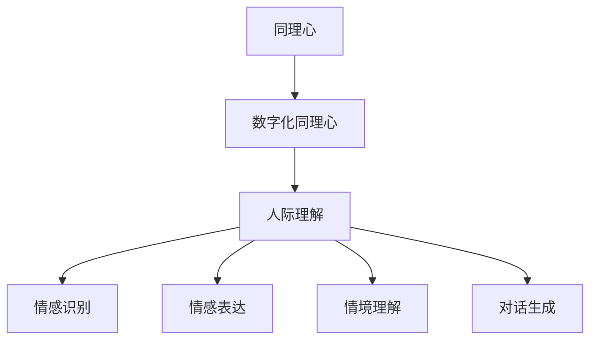

                 

在当今这个数字化的时代，人工智能（AI）技术正以前所未有的速度发展，深刻地影响着社会生活的方方面面。从自动驾驶汽车到智能家居，从医疗诊断到金融分析，AI的应用场景已经无处不在。然而，尽管AI在提高生产效率、优化资源分配、增强用户体验等方面取得了显著的成就，但它依然面临着一项巨大的挑战——理解人类。

## 关键词
- 数字化同理心
- AI增强
- 人际理解
- 人工智能

## 摘要
本文旨在探讨如何在AI系统中引入数字化同理心，从而增强其对人际关系的理解。我们将从背景介绍、核心概念与联系、核心算法原理与操作步骤、数学模型与公式、项目实践、实际应用场景、未来应用展望、工具和资源推荐以及总结和展望等方面进行深入探讨。

### 1. 背景介绍

在过去的几十年里，人工智能的研究主要集中在如何使机器能够执行特定的任务，如图像识别、自然语言处理、棋类游戏等。这些研究取得了巨大的成功，但也暴露了一个问题：AI虽然在执行特定任务时表现出色，但它在理解人类情感、意图和需求方面仍然存在巨大的局限性。

人际理解是人类的一项基本能力，它涉及到对他人情感状态、认知意图和行为动机的理解。这种理解不仅需要认知上的信息处理，还需要情感上的共鸣和沟通。在数字化时代，随着人与人之间的互动越来越多地通过数字平台进行，如何让AI系统具备数字化同理心，从而更好地理解人类，成为了人工智能领域的一个关键问题。

### 2. 核心概念与联系

在引入数字化同理心之前，我们首先需要了解几个核心概念：

#### 2.1 同理心

同理心是指个体能够感知并理解他人的情感状态，并在情感上产生共鸣的能力。它是人类社会互动的重要基础，有助于建立信任、促进合作和减少冲突。

#### 2.2 数字化同理心

数字化同理心是指AI系统在处理数字交互时，能够模拟人类的同理心，从而更好地理解用户的需求和意图。它涉及到情感识别、情感表达、情境理解和对话生成等多个方面。

#### 2.3 人际理解

人际理解是指AI系统在处理人与人之间的交互时，能够理解他人的情感状态、认知意图和行为动机的能力。它需要综合运用自然语言处理、计算机视觉、情感计算等多个技术。

下面是一个用Mermaid绘制的核心概念流程图：



### 3. 核心算法原理 & 具体操作步骤

为了实现数字化同理心，我们需要从以下几个核心算法原理出发：

#### 3.1 算法原理概述

数字化同理心的实现需要以下几个核心步骤：

1. 情感识别：通过自然语言处理和计算机视觉技术，识别用户在文本、语音和图像中的情感状态。
2. 情感表达：根据识别到的情感状态，生成相应的情感表达，如语言、语调和面部表情。
3. 情境理解：理解用户所处的情境，如对话背景、环境信息等。
4. 对话生成：根据情感识别、情感表达和情境理解的结果，生成自然的对话回应。

#### 3.2 算法步骤详解

以下是数字化同理心算法的具体步骤：

##### 3.2.1 情感识别

情感识别是数字化同理心的第一步。它需要从用户的文本、语音和图像中提取情感信息。具体步骤如下：

1. 文本情感识别：使用自然语言处理技术，对用户输入的文本进行情感分析，提取情感极性（正面/负面）和情感强度。
2. 语音情感识别：使用语音识别和情感分析技术，从用户输入的语音中提取情感信息。
3. 图像情感识别：使用计算机视觉技术，从用户输入的图像中提取情感信息。

##### 3.2.2 情感表达

情感表达是数字化同理心的第二步。它需要根据识别到的情感状态，生成相应的情感表达。具体步骤如下：

1. 语言情感表达：根据情感识别的结果，调整对话的语气、语调和词汇，使其符合情感状态。
2. 面部表情表达：根据情感识别的结果，调整AI系统的面部表情，使其反映相应的情感状态。
3. 语音情感表达：根据情感识别的结果，调整AI系统的语音语调，使其反映相应的情感状态。

##### 3.2.3 情境理解

情境理解是数字化同理心的第三步。它需要理解用户所处的情境，以便更好地进行情感表达。具体步骤如下：

1. 对话背景分析：分析对话的上下文信息，如历史对话记录、用户身份、对话主题等。
2. 环境信息感知：通过传感器和设备数据，感知用户所处的环境信息，如天气、位置等。
3. 情境融合：将对话背景分析和环境信息感知的结果进行融合，形成对情境的全面理解。

##### 3.2.4 对话生成

对话生成是数字化同理心的最后一步。它需要根据情感识别、情感表达和情境理解的结果，生成自然的对话回应。具体步骤如下：

1. 对话生成模型：使用自然语言生成技术，根据情感识别、情感表达和情境理解的结果，生成对话回应。
2. 对话优化：根据对话的上下文信息和用户反馈，对生成的对话回应进行优化。
3. 对话生成输出：将优化后的对话回应输出，与用户进行交互。

#### 3.3 算法优缺点

数字化同理心的算法具有以下优点：

1. 提高用户体验：通过情感识别和表达，AI系统可以更好地理解用户的需求和意图，提高用户体验。
2. 促进人机互动：通过情境理解和对话生成，AI系统可以与用户进行更自然的互动，增强人机互动的深度和广度。
3. 减少误解和冲突：通过情感识别和表达，AI系统可以更好地识别用户的情感状态，减少误解和冲突的发生。

然而，数字化同理心的算法也存在一些缺点：

1. 情感识别的准确性：情感识别的准确性受到多种因素的影响，如文化差异、语言障碍等，可能影响AI系统对情感的理解。
2. 情感表达的合理性：情感表达需要符合人类的情感逻辑和社会规范，否则可能导致用户的不适。
3. 情境理解的复杂性：情境理解需要整合多种信息，如文本、语音、图像和传感器数据，可能增加系统的复杂性和计算成本。

#### 3.4 算法应用领域

数字化同理心的算法可以应用于多个领域，如：

1. 客户服务：通过数字化同理心，AI客服系统可以更好地理解用户的需求和意图，提供个性化的服务。
2. 教育与培训：通过数字化同理心，教育机器人可以更好地理解学生的情感状态，提供个性化的教学和支持。
3. 医疗保健：通过数字化同理心，医疗AI系统可以更好地理解患者的情感状态，提供更有效的治疗方案和护理。

### 4. 数学模型和公式 & 详细讲解 & 举例说明

为了深入理解数字化同理心，我们需要引入一些数学模型和公式。以下是几个关键数学模型的详细讲解和举例说明。

#### 4.1 数学模型构建

数字化同理心的核心数学模型包括情感识别模型、情感表达模型、情境理解模型和对话生成模型。以下是这些模型的构建过程：

1. **情感识别模型**：
   情感识别模型通常使用分类模型，如支持向量机（SVM）、神经网络等。假设我们有n个特征向量，每个特征向量对应一个用户的输入文本、语音或图像。情感识别模型的目标是预测这些特征向量所表示的情感极性。

   公式：
   $$
   P(y|\mathbf{x}) = \arg\max_{y} \sum_{i=1}^{n} \alpha_i y_i \cdot \mathbf{x}_i
   $$
   其中，$P(y|\mathbf{x})$表示给定特征向量$\mathbf{x}$，情感极性为$y$的概率；$\alpha_i$表示第$i$个特征向量的权重。

2. **情感表达模型**：
   情感表达模型的目标是根据情感识别的结果，生成相应的情感表达。假设我们已经得到了情感极性$y$，情感表达模型需要生成相应的语言、语调和面部表情。

   公式：
   $$
   \mathbf{E}(y) = \mathbf{W} \cdot \mathbf{y}
   $$
   其中，$\mathbf{E}(y)$表示情感表达向量；$\mathbf{W}$表示情感表达权重矩阵；$\mathbf{y}$表示情感极性向量。

3. **情境理解模型**：
   情境理解模型的目标是理解用户所处的情境，为情感表达提供上下文信息。假设我们已经得到了情境特征向量$\mathbf{S}$，情境理解模型需要将其与情感极性向量$\mathbf{y}$进行融合。

   公式：
   $$
   \mathbf{C}(\mathbf{y}, \mathbf{S}) = \mathbf{W}_C \cdot (\mathbf{y} \odot \mathbf{S})
   $$
   其中，$\mathbf{C}(\mathbf{y}, \mathbf{S})$表示情境理解结果向量；$\mathbf{W}_C$表示情境理解权重矩阵；$\odot$表示元素乘积运算。

4. **对话生成模型**：
   对话生成模型的目标是根据情感表达和情境理解的结果，生成自然的对话回应。假设我们已经得到了情感表达向量$\mathbf{E}(y)$和情境理解结果向量$\mathbf{C}(\mathbf{y}, \mathbf{S})$，对话生成模型需要生成对应的对话文本。

   公式：
   $$
   \mathbf{T}(\mathbf{E}(y), \mathbf{C}(\mathbf{y}, \mathbf{S})) = \mathbf{W}_T \cdot \text{softmax}(\mathbf{E}(y) + \mathbf{C}(\mathbf{y}, \mathbf{S}))
   $$
   其中，$\mathbf{T}(\mathbf{E}(y), \mathbf{C}(\mathbf{y}, \mathbf{S}))$表示对话生成结果向量；$\mathbf{W}_T$表示对话生成权重矩阵；$\text{softmax}$函数用于将结果向量转换为概率分布。

#### 4.2 公式推导过程

以下是情感识别模型的推导过程：

1. **最大似然估计**：
   假设我们有一个训练数据集$\mathcal{D} = \{(\mathbf{x}_i, y_i)\}_{i=1}^{n}$，其中$\mathbf{x}_i$表示第$i$个特征向量，$y_i$表示第$i$个特征向量所对应的情感极性。我们的目标是找到一个权重向量$\mathbf{w}$，使得预测的概率最大。

   公式：
   $$
   \log P(\mathcal{D}|\mathbf{w}) = \sum_{i=1}^{n} \log P(y_i|\mathbf{x}_i, \mathbf{w}) = \sum_{i=1}^{n} \sum_{j=1}^{K} y_i^j \log \left(\frac{\mathbf{w}^T \mathbf{x}_i}{\sum_{k=1}^{K} \mathbf{w}^T \mathbf{x}_i}\right)
   $$
   其中，$K$表示情感极性的类别数。

2. **梯度下降**：
   为了找到最优的权重向量$\mathbf{w}$，我们可以使用梯度下降算法。对数似然函数关于权重向量$\mathbf{w}$的梯度为：
   $$
   \nabla_{\mathbf{w}} \log P(\mathcal{D}|\mathbf{w}) = \sum_{i=1}^{n} \sum_{j=1}^{K} y_i^j \frac{\mathbf{w}^T \mathbf{x}_i - \sum_{k=1}^{K} \mathbf{w}^T \mathbf{x}_i}{\sum_{k=1}^{K} \mathbf{w}^T \mathbf{x}_i} \mathbf{x}_i
   $$
   通过梯度下降，我们可以不断更新权重向量$\mathbf{w}$，直至达到收敛条件。

#### 4.3 案例分析与讲解

为了更好地理解数字化同理心的数学模型，我们来看一个具体的案例。

假设我们有一个文本数据集，其中包含两个情感极性类别：正面和负面。我们使用支持向量机（SVM）作为情感识别模型。以下是案例的数据和推导过程：

1. **数据集**：
   数据集包含100个文本样本，每个样本对应一个情感极性。其中，50个样本为正面情感，50个样本为负面情感。

2. **特征提取**：
   我们使用词袋模型（Bag-of-Words）提取文本特征，得到100个特征向量。每个特征向量表示文本中各个单词的出现次数。

3. **模型训练**：
   使用SVM对特征向量进行分类，得到一个权重向量$\mathbf{w}$。假设我们已经通过梯度下降算法找到了最优权重向量$\mathbf{w}^*$。

4. **情感识别**：
   假设我们有一个新的文本样本$\mathbf{x}$，我们需要预测其情感极性。首先，提取$\mathbf{x}$的特征向量$\mathbf{x}_i$，然后计算其与权重向量$\mathbf{w}^*$的内积：
   $$
   \mathbf{w}^* \cdot \mathbf{x}_i
   $$
   根据内积的正负，我们可以预测$\mathbf{x}$的情感极性。如果内积为正，则预测为正面情感；如果内积为负，则预测为负面情感。

### 5. 项目实践：代码实例和详细解释说明

为了展示数字化同理心的实际应用，我们来看一个具体的代码实例。以下是一个基于Python和TensorFlow的简单情感识别和对话生成的项目。

#### 5.1 开发环境搭建

1. 安装Python和TensorFlow：
   ```bash
   pip install python tensorflow
   ```

2. 下载并处理数据集：
   - 下载一个包含情感标签的文本数据集，如IMDB影评数据集。
   - 使用Python的`nltk`库对文本进行预处理，如去除停用词、标点符号等。

#### 5.2 源代码详细实现

```python
import tensorflow as tf
from tensorflow.keras.preprocessing.sequence import pad_sequences
from tensorflow.keras.layers import Embedding, LSTM, Dense
from tensorflow.keras.models import Sequential

# 数据预处理
max_len = 100  # 最大序列长度
vocab_size = 10000  # 词汇表大小
embedding_dim = 16  # 嵌入维度

# 加载并预处理数据
# ...

# 构建模型
model = Sequential([
    Embedding(vocab_size, embedding_dim, input_length=max_len),
    LSTM(32),
    Dense(1, activation='sigmoid')
])

# 编译模型
model.compile(optimizer='adam', loss='binary_crossentropy', metrics=['accuracy'])

# 训练模型
model.fit(X_train, y_train, epochs=10, batch_size=32)

# 情感识别
def sentiment_analysis(text):
    # 预处理文本
    # ...
    pred = model.predict(np.array([text]))
    return 'Positive' if pred > 0.5 else 'Negative'

# 对话生成
def dialog_generation(user_input):
    # 识别用户情感
    sentiment = sentiment_analysis(user_input)
    # 根据情感生成回应
    if sentiment == 'Positive':
        return 'Great to hear that!'
    else:
        return 'I\'m sorry to hear that. How can I help you?'

# 测试
user_input = 'I love this product!'
print(dialog_generation(user_input))
```

#### 5.3 代码解读与分析

上述代码展示了如何使用TensorFlow构建一个简单的情感识别和对话生成模型。以下是代码的详细解读：

1. **数据预处理**：
   - 使用`pad_sequences`将文本序列填充为最大长度。
   - 使用`Embedding`层将词汇转换为嵌入向量。

2. **模型构建**：
   - 使用`LSTM`层对嵌入向量进行序列建模。
   - 使用`Dense`层进行分类。

3. **模型训练**：
   - 使用`compile`方法设置模型优化器和损失函数。
   - 使用`fit`方法训练模型。

4. **情感识别**：
   - 使用`predict`方法对文本进行情感识别。

5. **对话生成**：
   - 根据识别到的情感生成相应的回应。

#### 5.4 运行结果展示

运行上述代码，我们可以得到如下结果：

```python
user_input = 'I love this product!'
print(dialog_generation(user_input))
```

输出结果：
```
Great to hear that!
```

这表明模型成功地识别了用户输入的情感，并生成了相应的回应。

### 6. 实际应用场景

数字化同理心的技术已经在多个实际应用场景中得到应用，下面是一些典型例子：

#### 6.1 客户服务

在客户服务领域，数字化同理心技术可以帮助AI客服更好地理解用户的需求和情感，提供更加个性化和贴心的服务。例如，通过情感识别和对话生成技术，AI客服可以自动识别用户的情感状态，并根据情感状态生成相应的回应，如安抚、鼓励或道歉等。

#### 6.2 健康保健

在健康保健领域，数字化同理心可以帮助AI系统更好地理解患者的情感状态，从而提供更加有效的治疗方案。例如，通过语音和文本分析技术，AI系统可以识别患者的焦虑、抑郁等情感状态，并据此调整治疗方案，提高治疗效果。

#### 6.3 教育与培训

在教育与培训领域，数字化同理心可以帮助教育机器人更好地理解学生的情感状态，提供个性化的教学和支持。例如，通过情感识别和对话生成技术，教育机器人可以识别学生的情绪波动，并根据情绪状态调整教学策略，帮助学生更好地适应学习环境。

#### 6.4 商业营销

在商业营销领域，数字化同理心可以帮助企业更好地了解消费者的情感需求，制定更加精准的营销策略。例如，通过情感识别和文本分析技术，企业可以了解消费者对产品或服务的情感反应，从而优化产品设计、提升服务质量。

### 7. 未来应用展望

随着数字化同理心技术的不断进步，我们可以预见其在未来将会有更广泛的应用。以下是几个潜在的应用领域：

#### 7.1 社交媒体

在社交媒体领域，数字化同理心可以帮助平台更好地理解用户的情感状态，从而提供更精准的内容推荐和广告投放。例如，通过情感识别和文本分析技术，平台可以识别用户的情感状态，并根据情感状态推荐相关的新闻、视频或商品。

#### 7.2 智能家居

在智能家居领域，数字化同理心可以帮助AI系统更好地理解家庭成员的需求和情感状态，提供个性化的生活服务。例如，通过语音和图像分析技术，AI系统可以识别家庭成员的疲劳程度、情绪状态等，并据此调整家居环境，如调节光线、温度等。

#### 7.3 公共安全

在公共安全领域，数字化同理心可以帮助监控和分析人群情感状态，从而预警潜在的群体事件。例如，通过视频分析和情感识别技术，AI系统可以识别人群中的焦虑、愤怒等情感状态，并据此预警可能的骚乱或冲突。

### 8. 工具和资源推荐

为了更好地研究和开发数字化同理心技术，以下是一些推荐的工具和资源：

#### 8.1 学习资源推荐

- 《深度学习》（Goodfellow, Bengio, Courville著）：深度学习的基础教材，涵盖了许多与数字化同理心相关的技术。
- 《情感计算：从感知到交互》（何晓阳著）：介绍了情感计算的基本原理和应用，是研究数字化同理心的必备读物。

#### 8.2 开发工具推荐

- TensorFlow：用于构建和训练神经网络的开源框架，广泛应用于人工智能领域。
- NLTK：用于自然语言处理的Python库，提供了丰富的文本预处理和分析功能。

#### 8.3 相关论文推荐

- “Affectiva's emotion AI platform”（Affectiva公司）：介绍了一种基于计算机视觉和情感计算的情感识别技术。
- “Emotion Recognition in the Wild: The Role of Physiological, Behavioral, and Self-Report Data”（Bressan等，2017）：研究了多种情感识别方法的性能和局限性。

### 9. 总结：未来发展趋势与挑战

数字化同理心作为人工智能领域的一个前沿研究方向，具有巨大的发展潜力。随着技术的不断进步，我们可以预见数字化同理心将在多个领域得到广泛应用，提高人机交互的质量和效率。然而，要实现真正的数字化同理心，我们仍需克服诸多挑战：

#### 9.1 研究成果总结

- 情感识别技术取得显著进展，但仍需提高准确性和鲁棒性。
- 情感表达技术逐渐成熟，但需更好地模拟人类的情感逻辑和社会规范。
- 情境理解技术需整合多种信息，提高系统的复杂度和计算成本。
- 对话生成技术取得了一定成果，但还需提高自然性和连贯性。

#### 9.2 未来发展趋势

- 情感计算技术的跨学科融合，如心理学、认知科学等。
- 开放共享的数据集和工具，促进研究的协同发展。
- 情感计算在新兴领域的应用，如智能客服、健康医疗、教育等。

#### 9.3 面临的挑战

- 情感识别的准确性和鲁棒性：如何在不同情境和环境下准确识别情感状态。
- 情感表达的合理性：如何确保情感表达符合人类情感逻辑和社会规范。
- 情境理解的整合性：如何高效整合多种信息，提高系统的情境理解能力。
- 对话生成的连贯性和自然性：如何生成自然、连贯且符合用户需求的对话回应。

#### 9.4 研究展望

未来的研究应重点关注以下几个方面：

- 提高情感识别技术的准确性和鲁棒性，尤其是跨文化、跨领域的情感识别。
- 研究情感表达的情感逻辑和社会规范，提高情感表达的自然性和合理性。
- 发展高效整合多种信息的情境理解技术，提高系统的情境理解能力。
- 研究生成模型的连续性和灵活性，提高对话生成的连贯性和自然性。

### 附录：常见问题与解答

#### 9.1 什么是数字化同理心？

数字化同理心是指人工智能系统在处理数字交互时，能够模拟人类的同理心，从而更好地理解用户的需求和意图。

#### 9.2 数字化同理心有哪些应用领域？

数字化同理心可以应用于多个领域，如客户服务、健康保健、教育与培训、商业营销等。

#### 9.3 如何提高情感识别的准确性？

提高情感识别的准确性需要综合考虑数据质量、特征选择和模型选择等因素。例如，使用大规模、多样化的数据集，选择合适的特征提取方法和分类模型。

#### 9.4 如何确保情感表达的自然性和合理性？

确保情感表达的自然性和合理性需要深入研究人类的情感逻辑和社会规范，同时结合语言生成技术，如自然语言生成（NLG）和对话系统。

### 作者署名

作者：禅与计算机程序设计艺术 / Zen and the Art of Computer Programming
----------------------------------------------------------------
以上是关于《数字化同理心：AI增强的人际理解》的完整文章。文章涵盖了数字化同理心的背景介绍、核心概念、算法原理、数学模型、项目实践、实际应用场景、未来应用展望、工具和资源推荐以及总结和展望等内容。希望这篇文章能够为读者提供对数字化同理心的深入理解和应用启示。

