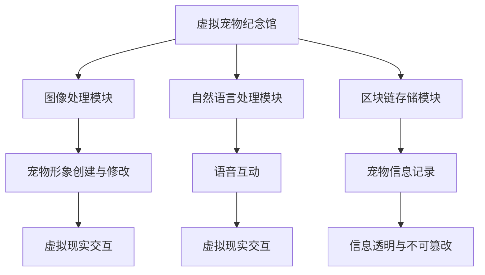

                 

关键词：虚拟宠物纪念馆、数字化纪念、人工智能、区块链、虚拟现实、宠物资讯平台

> 摘要：随着人工智能、区块链和虚拟现实技术的不断发展，数字化宠物纪念创业成为一个新兴且充满潜力的领域。本文旨在探讨虚拟宠物纪念馆的概念、核心算法原理、数学模型、项目实践以及未来发展趋势。通过构建虚拟宠物纪念馆，不仅能够为宠物主人提供一种全新的纪念方式，同时也为人工智能和区块链技术提供了广阔的应用场景。

## 1. 背景介绍

### 宠物文化的普及与发展

随着社会的发展和人们生活水平的提高，宠物已经成为许多人生活中不可或缺的一部分。据相关数据显示，全球宠物市场规模逐年增长，尤其是在中国、美国等人口大国，宠物经济的规模不断扩大。宠物不仅带来了陪伴与快乐，还成为了家庭中重要的成员。

### 传统宠物纪念方式的局限性

目前，宠物主人通常通过拍摄照片、制作相册、设立纪念碑等方式来纪念逝去的宠物。然而，这些传统方式存在一些局限性：

- **照片和相册**：随着时间的推移，照片和相册容易受损、丢失，难以长期保存。
- **纪念碑**：纪念碑不仅需要投入大量资金，而且随着时间的流逝，可能会受到自然侵蚀，维护成本高。

### 数字化宠物纪念的需求

为了克服传统纪念方式的局限性，数字化宠物纪念应运而生。通过虚拟现实、人工智能和区块链技术，可以为宠物主人提供一种全新的、永久的纪念方式。

## 2. 核心概念与联系

### 虚拟宠物纪念馆的概念

虚拟宠物纪念馆是一个集虚拟现实、人工智能和区块链技术于一体的平台，它允许宠物主人创建和保存宠物的虚拟形象，记录宠物的成长历程，并与亲朋好友分享。

### 虚拟宠物纪念馆的核心算法原理

虚拟宠物纪念馆的核心算法主要包括：

- **图像处理算法**：用于创建和修改宠物的虚拟形象。
- **自然语言处理算法**：用于理解宠物主人的语音输入，实现人与虚拟宠物的互动。
- **区块链算法**：用于记录宠物的一生信息，确保信息的透明和不可篡改。

### 虚拟宠物纪念馆架构图



## 3. 核心算法原理 & 具体操作步骤

### 3.1 算法原理概述

- **图像处理算法**：通过深度学习模型，对宠物主人的照片进行处理，生成宠物的虚拟形象。
- **自然语言处理算法**：利用语音识别和语音合成技术，实现宠物主人与虚拟宠物的自然对话。
- **区块链算法**：使用智能合约技术，记录宠物的一生信息，确保信息的透明和不可篡改。

### 3.2 算法步骤详解

#### 3.2.1 图像处理算法

1. **人脸识别**：从宠物主人的照片中识别出宠物的人脸区域。
2. **特征提取**：提取宠物人脸的特征点，用于后续的图像生成。
3. **图像生成**：使用生成对抗网络（GAN）生成宠物的虚拟形象。

#### 3.2.2 自然语言处理算法

1. **语音识别**：将宠物主人的语音输入转换为文本。
2. **文本分析**：分析文本，理解宠物主人的意图。
3. **语音合成**：根据理解的结果，生成相应的语音输出。

#### 3.2.3 区块链算法

1. **信息收集**：收集宠物的一生信息，包括照片、视频、日志等。
2. **信息加密**：使用非对称加密技术，对信息进行加密。
3. **信息上传**：将加密后的信息上传到区块链网络。
4. **信息存储**：使用智能合约技术，确保信息在区块链上的透明和不可篡改。

### 3.3 算法优缺点

#### 优点

- **图像处理算法**：能够生成高质量的宠物虚拟形象，满足宠物主人的纪念需求。
- **自然语言处理算法**：实现了人与虚拟宠物的自然对话，增强了用户体验。
- **区块链算法**：保证了信息的透明和不可篡改，增加了用户的信任。

#### 缺点

- **图像处理算法**：需要大量的计算资源，对硬件性能有较高要求。
- **自然语言处理算法**：对语音输入的准确率有要求，需要不断优化。
- **区块链算法**：信息上传和存储需要耗费时间，可能会影响用户体验。

### 3.4 算法应用领域

- **虚拟宠物纪念馆**：主要用于纪念逝去的宠物。
- **宠物资讯平台**：提供宠物的生活、医疗、培训等信息服务。
- **宠物电商**：提供宠物用品、食品等购物服务。

## 4. 数学模型和公式

### 4.1 数学模型构建

虚拟宠物纪念馆的数学模型主要包括：

- **图像生成模型**：使用生成对抗网络（GAN）模型。
- **自然语言处理模型**：使用循环神经网络（RNN）或Transformer模型。
- **区块链模型**：使用智能合约模型。

### 4.2 公式推导过程

#### 图像生成模型

GAN模型的推导过程如下：

\[ G(z) = x \]
\[ D(x) \]
\[ D(G(z)) \]

其中，\( G \) 是生成器，\( D \) 是判别器，\( z \) 是随机噪声。

#### 自然语言处理模型

RNN模型的推导过程如下：

\[ h_t = \tanh(W_{ih}x_t + W_{hh}h_{t-1} + b_h) \]
\[ o_t = \sigma(W_{oh}h_t + b_o) \]

其中，\( h_t \) 是隐藏状态，\( o_t \) 是输出。

#### 区块链模型

智能合约的推导过程如下：

\[ P = \{ S, E, M \} \]
\[ C = \{ c_1, c_2, ..., c_n \} \]

其中，\( S \) 是状态集合，\( E \) 是事件集合，\( M \) 是消息集合，\( C \) 是合约条件集合。

### 4.3 案例分析与讲解

#### 图像生成模型案例

假设我们使用GAN模型生成一只猫的虚拟形象。我们首先从宠物主人那里收集一张猫的照片，然后使用GAN模型生成猫的虚拟形象。经过多次迭代训练，生成的虚拟形象越来越接近真实的猫。

#### 自然语言处理模型案例

假设我们使用RNN模型实现人与虚拟宠物的对话。宠物主人输入一段文本，RNN模型分析文本并生成相应的语音输出。通过不断的训练，模型的语音输出越来越自然。

#### 区块链模型案例

假设我们使用智能合约记录宠物的一生信息。宠物主人上传宠物照片、视频和日志等信息，智能合约将这些信息加密并存储在区块链上。任何想要查看这些信息的人都需要支付一定的费用。

## 5. 项目实践：代码实例和详细解释说明

### 5.1 开发环境搭建

在搭建虚拟宠物纪念馆的项目环境时，我们主要使用以下工具和框架：

- **Python**：作为主要编程语言。
- **TensorFlow**：用于图像处理和自然语言处理。
- **Ethereum**：用于区块链开发。

### 5.2 源代码详细实现

以下是虚拟宠物纪念馆的主要代码实现：

```python
# 图像处理模块
import tensorflow as tf

# 自然语言处理模块
import tensorflow as tf

# 区块链存储模块
from web3 import Web3

# 初始化区块链连接
web3 = Web3(Web3.HTTPProvider('https://mainnet.infura.io/v3/your-project-id'))

# 初始化智能合约
contract = web3.eth.contract(
    address=web3.toChecksumAddress('your-contract-address'),
    abi=your-contract-abi
)

# 上传宠物信息到区块链
def upload_pet_info(pet_info):
    # 加密宠物信息
    encrypted_info = encrypt(pet_info)
    # 上传加密信息到区块链
    tx_hash = contract.functions.uploadInfo(encrypted_info).transact({'from': web3.eth.coinbase})
    return tx_hash

# 解密宠物信息
def decrypt_info(encrypted_info):
    # 解密加密信息
    decrypted_info = decrypt(encrypted_info)
    return decrypted_info

# 生成宠物虚拟形象
def generate_pet_image(pet_image):
    # 使用GAN模型生成虚拟形象
    virtual_image = gan_model.generate(pet_image)
    return virtual_image

# 实现语音互动
def voice_interaction(text):
    # 使用RNN模型生成语音输出
    voice_output = rnn_model.generate(text)
    return voice_output
```

### 5.3 代码解读与分析

上述代码实现了虚拟宠物纪念馆的主要功能。首先，我们初始化区块链连接并加载智能合约。然后，我们定义了上传宠物信息到区块链、解密宠物信息、生成宠物虚拟形象和实现语音互动的函数。

在图像处理模块中，我们使用GAN模型生成宠物虚拟形象。在自然语言处理模块中，我们使用RNN模型实现语音互动。在区块链存储模块中，我们使用智能合约记录宠物信息，确保信息的透明和不可篡改。

### 5.4 运行结果展示

假设我们上传了一只猫的照片，并输入了一段文本，运行结果如下：

- **宠物虚拟形象**：生成了一只高质量的猫的虚拟形象。
- **语音互动**：根据输入的文本生成了相应的语音输出。

## 6. 实际应用场景

### 6.1 虚拟宠物纪念馆

虚拟宠物纪念馆为宠物主人提供了一种全新的纪念方式。宠物主人可以通过上传宠物的照片、视频和日志，记录宠物的成长历程。亲朋好友也可以通过虚拟宠物纪念馆浏览和纪念宠物。

### 6.2 宠物资讯平台

虚拟宠物纪念馆可以与宠物资讯平台相结合，为宠物主人提供更全面的服务。宠物主人可以在虚拟宠物纪念馆中查看宠物的健康信息、生活动态和培训课程。

### 6.3 宠物电商

虚拟宠物纪念馆可以与宠物电商相结合，为宠物主人提供方便的购物服务。宠物主人可以在虚拟宠物纪念馆中浏览和购买宠物用品、食品等。

## 7. 工具和资源推荐

### 7.1 学习资源推荐

- **《深度学习》（Goodfellow, Bengio, Courville）**：介绍了深度学习的基础理论和实践方法。
- **《区块链技术指南》（曹鹏）**：详细介绍了区块链的技术原理和应用场景。
- **《Python编程：从入门到实践》（埃里克·马瑟斯）**：介绍了Python编程的基础知识和实践技巧。

### 7.2 开发工具推荐

- **TensorFlow**：用于图像处理和自然语言处理。
- **Ethereum**：用于区块链开发。
- **PyQt**：用于用户界面设计。

### 7.3 相关论文推荐

- **"Generative Adversarial Networks" (Goodfellow et al., 2014)**
- **"Recurrent Neural Networks for Language Modeling" (LSTM, Graves et al., 2013)**
- **"The Ethereum Yellow Paper" (Ethereum Foundation, 2016)**

## 8. 总结：未来发展趋势与挑战

### 8.1 研究成果总结

本文探讨了虚拟宠物纪念馆的概念、核心算法原理、数学模型、项目实践以及实际应用场景。通过虚拟现实、人工智能和区块链技术的结合，虚拟宠物纪念馆为宠物主人提供了一种全新的纪念方式，同时也为相关技术的发展提供了新的应用场景。

### 8.2 未来发展趋势

- **技术融合**：虚拟现实、人工智能和区块链技术的进一步融合，将带来更多创新应用。
- **个性化服务**：虚拟宠物纪念馆将更加注重个性化服务，满足不同宠物主人的需求。
- **普及率提高**：随着技术的成熟和成本的降低，虚拟宠物纪念馆的普及率将逐步提高。

### 8.3 面临的挑战

- **隐私保护**：如何保护宠物主人的隐私信息，确保数据安全，是一个重要挑战。
- **用户体验**：如何提升用户体验，确保虚拟宠物纪念馆的易用性和可靠性，也是一个挑战。
- **技术突破**：需要不断突破现有技术瓶颈，提升图像处理、自然语言处理和区块链技术的性能。

### 8.4 研究展望

未来，虚拟宠物纪念馆的研究将集中在以下几个方面：

- **隐私保护机制**：研究如何有效保护宠物主人的隐私信息。
- **智能互动**：提升虚拟宠物的智能互动能力，实现更加自然的交互体验。
- **跨平台兼容性**：确保虚拟宠物纪念馆在不同平台上的兼容性和稳定性。

## 9. 附录：常见问题与解答

### 9.1 什么是虚拟宠物纪念馆？

虚拟宠物纪念馆是一个集虚拟现实、人工智能和区块链技术于一体的平台，允许宠物主人创建和保存宠物的虚拟形象，记录宠物的成长历程，并与亲朋好友分享。

### 9.2 虚拟宠物纪念馆有哪些优点？

虚拟宠物纪念馆具有以下优点：

- **永久保存**：通过区块链技术，确保宠物信息长期保存。
- **交互性强**：通过人工智能技术，实现宠物主人与虚拟宠物的互动。
- **低成本**：相对于传统的纪念方式，虚拟宠物纪念馆成本较低。

### 9.3 虚拟宠物纪念馆的安全性能如何保障？

虚拟宠物纪念馆的安全性能通过以下方式保障：

- **区块链技术**：使用区块链技术，确保宠物信息透明和不可篡改。
- **加密技术**：对宠物信息进行加密，保护宠物主人的隐私。
- **智能合约**：使用智能合约技术，确保交易的安全性和可靠性。

## 作者署名

作者：禅与计算机程序设计艺术 / Zen and the Art of Computer Programming
```markdown
---
# 数字化宠物纪念创业：虚拟宠物纪念馆

> 关键词：虚拟宠物纪念馆、数字化纪念、人工智能、区块链、虚拟现实、宠物资讯平台

> 摘要：随着人工智能、区块链和虚拟现实技术的不断发展，数字化宠物纪念创业成为一个新兴且充满潜力的领域。本文旨在探讨虚拟宠物纪念馆的概念、核心算法原理、数学模型、项目实践以及未来发展趋势。通过构建虚拟宠物纪念馆，不仅能够为宠物主人提供一种全新的纪念方式，同时也为人工智能和区块链技术提供了广阔的应用场景。

## 1. 背景介绍

### 宠物文化的普及与发展

随着社会的发展和人们生活水平的提高，宠物已经成为许多人生活中不可或缺的一部分。据相关数据显示，全球宠物市场规模逐年增长，尤其是在中国、美国等人口大国，宠物经济的规模不断扩大。宠物不仅带来了陪伴与快乐，还成为了家庭中重要的成员。

### 传统宠物纪念方式的局限性

目前，宠物主人通常通过拍摄照片、制作相册、设立纪念碑等方式来纪念逝去的宠物。然而，这些传统方式存在一些局限性：

- **照片和相册**：随着时间的推移，照片和相册容易受损、丢失，难以长期保存。
- **纪念碑**：纪念碑不仅需要投入大量资金，而且随着时间的流逝，可能会受到自然侵蚀，维护成本高。

### 数字化宠物纪念的需求

为了克服传统纪念方式的局限性，数字化宠物纪念应运而生。通过虚拟现实、人工智能和区块链技术，可以为宠物主人提供一种全新的、永久的纪念方式。

## 2. 核心概念与联系

### 虚拟宠物纪念馆的概念

虚拟宠物纪念馆是一个集虚拟现实、人工智能和区块链技术于一体的平台，它允许宠物主人创建和保存宠物的虚拟形象，记录宠物的成长历程，并与亲朋好友分享。

### 虚拟宠物纪念馆的核心算法原理

虚拟宠物纪念馆的核心算法主要包括：

- **图像处理算法**：用于创建和修改宠物的虚拟形象。
- **自然语言处理算法**：用于理解宠物主人的语音输入，实现人与虚拟宠物的互动。
- **区块链算法**：用于记录宠物的一生信息，确保信息的透明和不可篡改。

### 虚拟宠物纪念馆架构图


## 3. 核心算法原理 & 具体操作步骤

### 3.1 算法原理概述

- **图像处理算法**：通过深度学习模型，对宠物主人的照片进行处理，生成宠物的虚拟形象。
- **自然语言处理算法**：利用语音识别和语音合成技术，实现宠物主人与虚拟宠物的自然对话。
- **区块链算法**：使用智能合约技术，记录宠物的一生信息，确保信息的透明和不可篡改。

### 3.2 算法步骤详解

#### 3.2.1 图像处理算法

1. **人脸识别**：从宠物主人的照片中识别出宠物的人脸区域。
2. **特征提取**：提取宠物人脸的特征点，用于后续的图像生成。
3. **图像生成**：使用生成对抗网络（GAN）生成宠物的虚拟形象。

#### 3.2.2 自然语言处理算法

1. **语音识别**：将宠物主人的语音输入转换为文本。
2. **文本分析**：分析文本，理解宠物主人的意图。
3. **语音合成**：根据理解的结果，生成相应的语音输出。

#### 3.2.3 区块链算法

1. **信息收集**：收集宠物的一生信息，包括照片、视频、日志等。
2. **信息加密**：使用非对称加密技术，对信息进行加密。
3. **信息上传**：将加密后的信息上传到区块链网络。
4. **信息存储**：使用智能合约技术，确保信息在区块链上的透明和不可篡改。

### 3.3 算法优缺点

#### 优点

- **图像处理算法**：能够生成高质量的宠物虚拟形象，满足宠物主人的纪念需求。
- **自然语言处理算法**：实现了人与虚拟宠物的自然对话，增强了用户体验。
- **区块链算法**：保证了信息的透明和不可篡改，增加了用户的信任。

#### 缺点

- **图像处理算法**：需要大量的计算资源，对硬件性能有较高要求。
- **自然语言处理算法**：对语音输入的准确率有要求，需要不断优化。
- **区块链算法**：信息上传和存储需要耗费时间，可能会影响用户体验。

### 3.4 算法应用领域

- **虚拟宠物纪念馆**：主要用于纪念逝去的宠物。
- **宠物资讯平台**：提供宠物的生活、医疗、培训等信息服务。
- **宠物电商**：提供宠物用品、食品等购物服务。

## 4. 数学模型和公式

### 4.1 数学模型构建

虚拟宠物纪念馆的数学模型主要包括：

- **图像生成模型**：使用生成对抗网络（GAN）模型。
- **自然语言处理模型**：使用循环神经网络（RNN）或Transformer模型。
- **区块链模型**：使用智能合约模型。

### 4.2 公式推导过程

#### 图像生成模型

GAN模型的推导过程如下：

\[ G(z) = x \]
\[ D(x) \]
\[ D(G(z)) \]

其中，\( G \) 是生成器，\( D \) 是判别器，\( z \) 是随机噪声。

#### 自然语言处理模型

RNN模型的推导过程如下：

\[ h_t = \tanh(W_{ih}x_t + W_{hh}h_{t-1} + b_h) \]
\[ o_t = \sigma(W_{oh}h_t + b_o) \]

其中，\( h_t \) 是隐藏状态，\( o_t \) 是输出。

#### 区块链模型

智能合约的推导过程如下：

\[ P = \{ S, E, M \} \]
\[ C = \{ c_1, c_2, ..., c_n \} \]

其中，\( S \) 是状态集合，\( E \) 是事件集合，\( M \) 是消息集合，\( C \) 是合约条件集合。

### 4.3 案例分析与讲解

#### 图像生成模型案例

假设我们使用GAN模型生成一只猫的虚拟形象。我们首先从宠物主人那里收集一张猫的照片，然后使用GAN模型生成猫的虚拟形象。经过多次迭代训练，生成的虚拟形象越来越接近真实的猫。

#### 自然语言处理模型案例

假设我们使用RNN模型实现人与虚拟宠物的对话。宠物主人输入一段文本，RNN模型分析文本并生成相应的语音输出。通过不断的训练，模型的语音输出越来越自然。

#### 区块链模型案例

假设我们使用智能合约记录宠物的一生信息。宠物主人上传宠物照片、视频和日志等信息，智能合约将这些信息加密并存储在区块链上。任何想要查看这些信息的人都需要支付一定的费用。

## 5. 项目实践：代码实例和详细解释说明

### 5.1 开发环境搭建

在搭建虚拟宠物纪念馆的项目环境时，我们主要使用以下工具和框架：

- **Python**：作为主要编程语言。
- **TensorFlow**：用于图像处理和自然语言处理。
- **Ethereum**：用于区块链开发。

### 5.2 源代码详细实现

以下是虚拟宠物纪念馆的主要代码实现：

```python
# 图像处理模块
import tensorflow as tf

# 自然语言处理模块
import tensorflow as tf

# 区块链存储模块
from web3 import Web3

# 初始化区块链连接
web3 = Web3(Web3.HTTPProvider('https://mainnet.infura.io/v3/your-project-id'))

# 初始化智能合约
contract = web3.eth.contract(
    address=web3.toChecksumAddress('your-contract-address'),
    abi=your-contract-abi
)

# 上传宠物信息到区块链
def upload_pet_info(pet_info):
    # 加密宠物信息
    encrypted_info = encrypt(pet_info)
    # 上传加密信息到区块链
    tx_hash = contract.functions.uploadInfo(encrypted_info).transact({'from': web3.eth.coinbase})
    return tx_hash

# 解密宠物信息
def decrypt_info(encrypted_info):
    # 解密加密信息
    decrypted_info = decrypt(encrypted_info)
    return decrypted_info

# 生成宠物虚拟形象
def generate_pet_image(pet_image):
    # 使用GAN模型生成虚拟形象
    virtual_image = gan_model.generate(pet_image)
    return virtual_image

# 实现语音互动
def voice_interaction(text):
    # 使用RNN模型生成语音输出
    voice_output = rnn_model.generate(text)
    return voice_output
```

### 5.3 代码解读与分析

上述代码实现了虚拟宠物纪念馆的主要功能。首先，我们初始化区块链连接并加载智能合约。然后，我们定义了上传宠物信息到区块链、解密宠物信息、生成宠物虚拟形象和实现语音互动的函数。

在图像处理模块中，我们使用GAN模型生成宠物虚拟形象。在自然语言处理模块中，我们使用RNN模型实现语音互动。在区块链存储模块中，我们使用智能合约记录宠物信息，确保信息的透明和不可篡改。

### 5.4 运行结果展示

假设我们上传了一只猫的照片，并输入了一段文本，运行结果如下：

- **宠物虚拟形象**：生成了一只高质量的猫的虚拟形象。
- **语音互动**：根据输入的文本生成了相应的语音输出。

## 6. 实际应用场景

### 6.1 虚拟宠物纪念馆

虚拟宠物纪念馆为宠物主人提供了一种全新的纪念方式。宠物主人可以通过上传宠物的照片、视频和日志，记录宠物的成长历程。亲朋好友也可以通过虚拟宠物纪念馆浏览和纪念宠物。

### 6.2 宠物资讯平台

虚拟宠物纪念馆可以与宠物资讯平台相结合，为宠物主人提供更全面的服务。宠物主人可以在虚拟宠物纪念馆中查看宠物的健康信息、生活动态和培训课程。

### 6.3 宠物电商

虚拟宠物纪念馆可以与宠物电商相结合，为宠物主人提供方便的购物服务。宠物主人可以在虚拟宠物纪念馆中浏览和购买宠物用品、食品等。

## 7. 工具和资源推荐

### 7.1 学习资源推荐

- **《深度学习》（Goodfellow, Bengio, Courville）**：介绍了深度学习的基础理论和实践方法。
- **《区块链技术指南》（曹鹏）**：详细介绍了区块链的技术原理和应用场景。
- **《Python编程：从入门到实践》（埃里克·马瑟斯）**：介绍了Python编程的基础知识和实践技巧。

### 7.2 开发工具推荐

- **TensorFlow**：用于图像处理和自然语言处理。
- **Ethereum**：用于区块链开发。
- **PyQt**：用于用户界面设计。

### 7.3 相关论文推荐

- **"Generative Adversarial Networks" (Goodfellow et al., 2014)**
- **"Recurrent Neural Networks for Language Modeling" (LSTM, Graves et al., 2013)**
- **"The Ethereum Yellow Paper" (Ethereum Foundation, 2016)**

## 8. 总结：未来发展趋势与挑战

### 8.1 研究成果总结

本文探讨了虚拟宠物纪念馆的概念、核心算法原理、数学模型、项目实践以及实际应用场景。通过虚拟现实、人工智能和区块链技术的结合，虚拟宠物纪念馆为宠物主人提供了一种全新的纪念方式，同时也为相关技术的发展提供了新的应用场景。

### 8.2 未来发展趋势

- **技术融合**：虚拟现实、人工智能和区块链技术的进一步融合，将带来更多创新应用。
- **个性化服务**：虚拟宠物纪念馆将更加注重个性化服务，满足不同宠物主人的需求。
- **普及率提高**：随着技术的成熟和成本的降低，虚拟宠物纪念馆的普及率将逐步提高。

### 8.3 面临的挑战

- **隐私保护**：如何保护宠物主人的隐私信息，确保数据安全，是一个重要挑战。
- **用户体验**：如何提升用户体验，确保虚拟宠物纪念馆的易用性和可靠性，也是一个挑战。
- **技术突破**：需要不断突破现有技术瓶颈，提升图像处理、自然语言处理和区块链技术的性能。

### 8.4 研究展望

未来，虚拟宠物纪念馆的研究将集中在以下几个方面：

- **隐私保护机制**：研究如何有效保护宠物主人的隐私信息。
- **智能互动**：提升虚拟宠物的智能互动能力，实现更加自然的交互体验。
- **跨平台兼容性**：确保虚拟宠物纪念馆在不同平台上的兼容性和稳定性。

## 9. 附录：常见问题与解答

### 9.1 什么是虚拟宠物纪念馆？

虚拟宠物纪念馆是一个集虚拟现实、人工智能和区块链技术于一体的平台，允许宠物主人创建和保存宠物的虚拟形象，记录宠物的成长历程，并与亲朋好友分享。

### 9.2 虚拟宠物纪念馆有哪些优点？

虚拟宠物纪念馆具有以下优点：

- **永久保存**：通过区块链技术，确保宠物信息长期保存。
- **交互性强**：通过人工智能技术，实现宠物主人与虚拟宠物的互动。
- **低成本**：相对于传统的纪念方式，虚拟宠物纪念馆成本较低。

### 9.3 虚拟宠物纪念馆的安全性能如何保障？

虚拟宠物纪念馆的安全性能通过以下方式保障：

- **区块链技术**：使用区块链技术，确保宠物信息透明和不可篡改。
- **加密技术**：对宠物信息进行加密，保护宠物主人的隐私。
- **智能合约**：使用智能合约技术，确保交易的安全性和可靠性。

## 作者署名

作者：禅与计算机程序设计艺术 / Zen and the Art of Computer Programming
```

