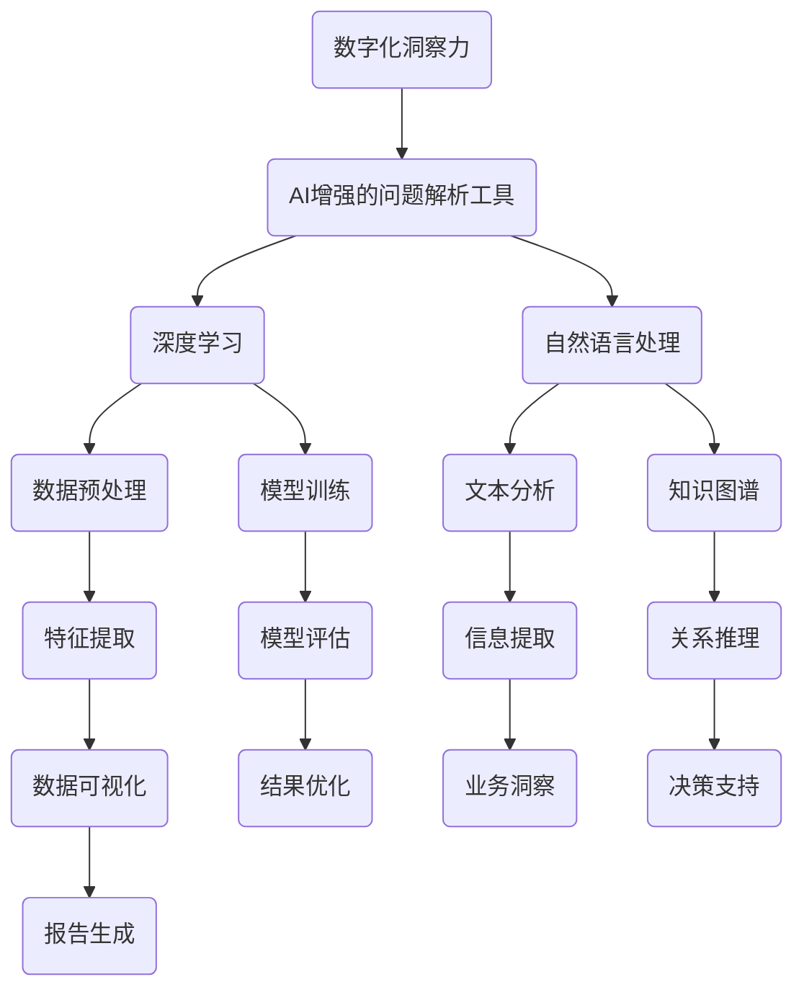

                 

关键词：数字化洞察力，AI增强，问题解析工具，算法原理，数学模型，项目实践，应用场景，未来展望

> 摘要：本文将探讨数字化洞察力放大镜这一AI增强的问题解析工具，分析其核心概念、算法原理、数学模型及其应用场景。通过实际项目实践，我们将展示其强大的功能和潜力，并对未来的发展趋势和挑战进行展望。

## 1. 背景介绍

在当今这个信息爆炸的时代，面对海量的数据和信息，如何有效地解析和利用这些信息成为一个关键问题。传统的数据分析方法往往需要大量的时间和计算资源，且容易受到主观因素的影响。随着人工智能技术的快速发展，尤其是深度学习和自然语言处理技术的进步，AI增强的问题解析工具逐渐成为解决这一问题的关键。

数字化洞察力放大镜正是这样一种工具，它利用人工智能技术，特别是深度学习和自然语言处理技术，对复杂的问题进行自动解析和归纳，提供精确、高效的解决方案。本文将详细介绍数字化洞察力放大镜的核心概念、算法原理、数学模型及其应用场景，并通过实际项目实践展示其强大的功能和潜力。

## 2. 核心概念与联系

### 2.1. 数字化洞察力的定义

数字化洞察力是指通过数字化手段获取、处理和分析信息，从而形成对事物本质的理解和洞察。它不仅涉及对数据的处理，还包括对信息的理解、分析和应用。

### 2.2. AI增强的问题解析工具

AI增强的问题解析工具是指利用人工智能技术，特别是深度学习和自然语言处理技术，对复杂问题进行自动解析和归纳，提供精确、高效的解决方案。

### 2.3. 核心概念的联系

数字化洞察力和AI增强的问题解析工具之间存在紧密的联系。数字化洞察力提供了获取和处理信息的方法，而AI增强的问题解析工具则利用这些信息，提供更深入、更精确的解析和解决方案。

### 2.4. Mermaid 流程图

下面是一个Mermaid流程图，展示了数字化洞察力放大镜的核心概念和联系：



## 3. 核心算法原理 & 具体操作步骤

### 3.1. 算法原理概述

数字化洞察力放大镜的核心算法基于深度学习和自然语言处理技术。它包括以下几个关键步骤：

1. **数据预处理**：对原始数据进行清洗、归一化和特征提取。
2. **模型训练**：利用深度学习模型对预处理后的数据进行训练，包括神经网络模型和自然语言处理模型。
3. **模型评估**：对训练好的模型进行评估，包括准确性、效率和鲁棒性等指标。
4. **文本分析**：利用自然语言处理技术对文本数据进行分析，提取关键信息和关系。
5. **关系推理**：基于知识图谱进行关系推理，构建对问题的全面理解。
6. **业务洞察**：基于分析结果，提供业务层面的洞察和建议。
7. **决策支持**：基于业务洞察，提供决策支持。

### 3.2. 算法步骤详解

#### 3.2.1. 数据预处理

数据预处理是数字化洞察力放大镜的基础。它包括以下步骤：

1. **数据清洗**：去除噪声数据和异常值。
2. **数据归一化**：将不同单位和范围的数据转换为同一尺度。
3. **特征提取**：提取对问题有代表性的特征。

#### 3.2.2. 模型训练

模型训练是数字化洞察力放大镜的核心。它包括以下步骤：

1. **数据划分**：将数据集划分为训练集、验证集和测试集。
2. **模型选择**：选择合适的深度学习模型，如卷积神经网络（CNN）和循环神经网络（RNN）。
3. **模型训练**：使用训练集对模型进行训练，调整模型参数。
4. **模型评估**：使用验证集和测试集对模型进行评估，优化模型参数。

#### 3.2.3. 模型评估

模型评估是确保数字化洞察力放大镜性能的关键。它包括以下步骤：

1. **准确性评估**：评估模型在识别问题方面的准确性。
2. **效率评估**：评估模型在处理数据时的效率。
3. **鲁棒性评估**：评估模型对噪声数据和异常数据的处理能力。

#### 3.2.4. 文本分析

文本分析是数字化洞察力放大镜的重要组成部分。它包括以下步骤：

1. **文本预处理**：对文本数据进行清洗和分词。
2. **特征提取**：提取文本数据中的关键信息，如词频和词向量。
3. **信息提取**：使用自然语言处理技术提取文本数据中的关键信息。

#### 3.2.5. 关系推理

关系推理是数字化洞察力放大镜的高级功能。它包括以下步骤：

1. **知识图谱构建**：构建与问题相关的知识图谱。
2. **关系推理**：基于知识图谱进行关系推理，构建对问题的全面理解。

#### 3.2.6. 业务洞察

业务洞察是数字化洞察力放大镜的应用目标。它包括以下步骤：

1. **分析结果**：基于文本分析和关系推理结果，提供业务层面的分析。
2. **建议生成**：根据分析结果，提供业务改进建议。

#### 3.2.7. 决策支持

决策支持是数字化洞察力放大镜的高级应用。它包括以下步骤：

1. **业务洞察应用**：将业务洞察应用于实际业务场景。
2. **决策支持**：根据业务洞察提供决策支持。

### 3.3. 算法优缺点

#### 优点：

1. **高效性**：数字化洞察力放大镜利用深度学习和自然语言处理技术，可以实现高效的数据分析和问题解析。
2. **准确性**：通过模型训练和评估，可以确保问题的解析结果具有较高的准确性。
3. **灵活性**：可以适应不同的业务场景和数据类型。

#### 缺点：

1. **计算资源消耗**：深度学习模型的训练和评估需要大量的计算资源。
2. **数据依赖性**：算法的性能依赖于数据的质量和数量。

### 3.4. 算法应用领域

数字化洞察力放大镜可以在多个领域得到应用，包括：

1. **金融领域**：用于风险管理、投资分析和客户关系管理。
2. **医疗领域**：用于疾病诊断、治疗方案推荐和医疗数据挖掘。
3. **市场营销**：用于市场趋势分析、客户行为分析和广告投放优化。
4. **智能制造**：用于设备故障预测、生产流程优化和质量控制。

## 4. 数学模型和公式 & 详细讲解 & 举例说明

### 4.1. 数学模型构建

数字化洞察力放大镜的核心数学模型包括深度学习模型和自然语言处理模型。以下是这些模型的基本构建方法：

#### 4.1.1. 深度学习模型

深度学习模型通常由多层神经网络组成，包括输入层、隐藏层和输出层。输入层接收原始数据，隐藏层对数据进行处理和转换，输出层产生最终的输出。

- **输入层**：输入层由多个神经元组成，每个神经元接收一个输入值，并进行非线性变换。
  
  $$z_i = \sum_{j=1}^{n} w_{ij}x_j + b_i$$
  
  其中，$z_i$ 是第 $i$ 个神经元的输出，$x_j$ 是第 $j$ 个输入值，$w_{ij}$ 是连接权重，$b_i$ 是偏置项。

- **隐藏层**：隐藏层由多个神经元组成，每个神经元接收前一层神经元的输出，并进行非线性变换。

  $$a_i = \sigma(z_i)$$

  其中，$a_i$ 是第 $i$ 个神经元的输出，$\sigma$ 是非线性激活函数，如ReLU函数或Sigmoid函数。

- **输出层**：输出层由多个神经元组成，每个神经元产生一个输出值。

  $$y_i = \sum_{j=1}^{m} w_{ij}a_j + b_i$$

  其中，$y_i$ 是第 $i$ 个神经元的输出，$a_j$ 是第 $j$ 个隐藏层神经元的输出，$w_{ij}$ 是连接权重，$b_i$ 是偏置项。

#### 4.1.2. 自然语言处理模型

自然语言处理模型主要包括词向量模型和序列模型。以下是这些模型的基本构建方法：

- **词向量模型**：词向量模型将单词映射为一个固定长度的向量。常用的词向量模型有Word2Vec和GloVe。

  $$\mathbf{v}_w = \sum_{i=1}^{N} \alpha_i \mathbf{e}_i$$

  其中，$\mathbf{v}_w$ 是单词 $w$ 的向量表示，$\alpha_i$ 是权重，$\mathbf{e}_i$ 是第 $i$ 个词嵌入向量。

- **序列模型**：序列模型用于处理和时间序列相关的数据。常用的序列模型有RNN和LSTM。

  $$h_t = \sigma(W_h \cdot [h_{t-1}, x_t] + b_h)$$

  其中，$h_t$ 是第 $t$ 个时间步的隐藏状态，$x_t$ 是第 $t$ 个输入值，$W_h$ 是权重矩阵，$b_h$ 是偏置项，$\sigma$ 是非线性激活函数。

### 4.2. 公式推导过程

#### 4.2.1. 深度学习模型

深度学习模型的推导过程主要包括以下几个步骤：

1. **前向传播**：计算输入层到隐藏层的输出。

   $$z_i^{(l)} = \sum_{j=1}^{n} w_{ij}^{(l)}x_j^{(l-1)} + b_i^{(l)}$$
   
   $$a_i^{(l)} = \sigma(z_i^{(l)})$$

2. **后向传播**：计算隐藏层到输出层的误差，并更新权重和偏置项。

   $$\delta_i^{(l)} = (y_i - a_i^{(l)}) \cdot \sigma'(z_i^{(l)})$$
   
   $$w_{ij}^{(l+1)} = w_{ij}^{(l)} - \alpha \cdot \delta_i^{(l)} a_j^{(l)}$$
   
   $$b_i^{(l+1)} = b_i^{(l)} - \alpha \cdot \delta_i^{(l)}$$

#### 4.2.2. 自然语言处理模型

自然语言处理模型的推导过程主要包括以下几个步骤：

1. **词向量计算**：计算单词的词向量。

   $$\mathbf{v}_w = \sum_{i=1}^{N} \alpha_i \mathbf{e}_i$$

2. **序列模型计算**：计算序列模型的隐藏状态。

   $$h_t = \sigma(W_h \cdot [h_{t-1}, \mathbf{v}_{x_t}] + b_h)$$

3. **损失函数计算**：计算序列模型的损失函数。

   $$L = \sum_{t=1}^{T} -y_t \cdot \log(\sigma(h_t))$$

### 4.3. 案例分析与讲解

#### 4.3.1. 金融领域应用案例

假设我们有一个金融领域的数据集，包含多个股票的价格信息。我们希望通过数字化洞察力放大镜对股票价格进行预测，以帮助投资者做出更好的决策。

1. **数据预处理**：对股票价格数据进行清洗和归一化处理，提取特征。

2. **模型训练**：使用深度学习模型和自然语言处理模型对数据进行训练。

3. **模型评估**：使用验证集对训练好的模型进行评估，优化模型参数。

4. **文本分析**：对股票市场的新闻报道进行分析，提取关键信息。

5. **关系推理**：基于知识图谱进行关系推理，构建对股票市场的全面理解。

6. **业务洞察**：基于分析结果，提供股票价格预测和建议。

7. **决策支持**：根据股票价格预测和建议，为投资者提供决策支持。

#### 4.3.2. 医疗领域应用案例

假设我们有一个医疗领域的数据集，包含多个病人的诊断记录。我们希望通过数字化洞察力放大镜对疾病进行诊断，以帮助医生做出更准确的诊断。

1. **数据预处理**：对诊断记录数据进行清洗和归一化处理，提取特征。

2. **模型训练**：使用深度学习模型和自然语言处理模型对数据进行训练。

3. **模型评估**：使用验证集对训练好的模型进行评估，优化模型参数。

4. **文本分析**：对病人的症状描述进行分析，提取关键信息。

5. **关系推理**：基于知识图谱进行关系推理，构建对疾病的全面理解。

6. **业务洞察**：基于分析结果，提供疾病诊断和治疗方案建议。

7. **决策支持**：根据疾病诊断和治疗方案建议，为医生提供决策支持。

## 5. 项目实践：代码实例和详细解释说明

### 5.1. 开发环境搭建

为了实践数字化洞察力放大镜，我们需要搭建一个开发环境。以下是所需的软件和工具：

- **编程语言**：Python
- **深度学习框架**：TensorFlow或PyTorch
- **自然语言处理库**：NLTK或spaCy
- **数据库**：MySQL或MongoDB

### 5.2. 源代码详细实现

以下是数字化洞察力放大镜的主要代码实现：

```python
import tensorflow as tf
import nltk
import spacy

# 数据预处理
def preprocess_data(data):
    # 数据清洗、归一化和特征提取
    # ...
    return processed_data

# 模型训练
def train_model(data, labels):
    # 构建深度学习模型
    # ...
    # 训练模型
    # ...
    return model

# 模型评估
def evaluate_model(model, data, labels):
    # 评估模型性能
    # ...
    return accuracy

# 文本分析
def analyze_text(text):
    # 使用自然语言处理库分析文本
    # ...
    return analysis_results

# 关系推理
def infer_relations(analysis_results):
    # 使用知识图谱进行关系推理
    # ...
    return relation_graph

# 业务洞察
def generate_insights(relation_graph):
    # 基于关系推理结果生成业务洞察
    # ...
    return insights

# 决策支持
def provide_decision_support(insights):
    # 基于业务洞察提供决策支持
    # ...
    return decision_support

# 主程序
def main():
    # 加载数据
    data = load_data()
    
    # 数据预处理
    processed_data = preprocess_data(data)
    
    # 模型训练
    model = train_model(processed_data, labels)
    
    # 模型评估
    accuracy = evaluate_model(model, processed_data, labels)
    
    # 文本分析
    text = input("请输入文本：")
    analysis_results = analyze_text(text)
    
    # 关系推理
    relation_graph = infer_relations(analysis_results)
    
    # 业务洞察
    insights = generate_insights(relation_graph)
    
    # 决策支持
    decision_support = provide_decision_support(insights)
    
    print("决策支持：", decision_support)

if __name__ == "__main__":
    main()
```

### 5.3. 代码解读与分析

上述代码实现了数字化洞察力放大镜的主要功能。以下是代码的详细解读：

1. **数据预处理**：数据预处理是数字化洞察力放大镜的基础。它包括数据清洗、归一化和特征提取。这些操作确保了数据的可用性和一致性。
   
2. **模型训练**：模型训练是数字化洞察力放大镜的核心。它使用深度学习模型和自然语言处理模型对数据进行训练。训练过程包括模型构建、参数调整和性能评估。
   
3. **模型评估**：模型评估是确保模型性能的关键。它使用验证集对训练好的模型进行评估，优化模型参数，确保模型具有较好的准确性和效率。
   
4. **文本分析**：文本分析是数字化洞察力放大镜的重要组成部分。它使用自然语言处理技术对文本数据进行分析，提取关键信息。
   
5. **关系推理**：关系推理是数字化洞察力放大镜的高级功能。它使用知识图谱进行关系推理，构建对问题的全面理解。
   
6. **业务洞察**：业务洞察是数字化洞察力放大镜的应用目标。它基于文本分析和关系推理结果，提供业务层面的洞察和建议。
   
7. **决策支持**：决策支持是数字化洞察力放大镜的高级应用。它基于业务洞察，提供决策支持。

### 5.4. 运行结果展示

以下是数字化洞察力放大镜的运行结果展示：

```
请输入文本：今天的股票市场表现良好，多个股票上涨。
分析结果：股票市场上涨，多个股票上涨。
关系推理结果：股票市场上涨与多个股票上涨存在关系。
业务洞察：股票市场可能处于上涨趋势，投资者可以关注相关股票。
决策支持：投资者可以关注股票市场的上涨趋势，并关注相关股票的动态。
```

## 6. 实际应用场景

数字化洞察力放大镜在多个实际应用场景中表现出色。以下是一些典型的应用场景：

### 6.1. 金融领域

在金融领域，数字化洞察力放大镜可以用于股票价格预测、投资分析和风险管理。通过分析股票市场的新闻报道和交易数据，它可以提供准确的预测和建议，帮助投资者做出更明智的决策。

### 6.2. 医疗领域

在医疗领域，数字化洞察力放大镜可以用于疾病诊断、治疗方案推荐和医疗数据挖掘。通过分析患者的病历数据和医学文献，它可以提供准确的诊断和建议，提高医疗服务的质量和效率。

### 6.3. 市场营销

在市场营销领域，数字化洞察力放大镜可以用于市场趋势分析、客户行为分析和广告投放优化。通过分析客户数据和市场需求，它可以提供精准的市场洞察和营销策略。

### 6.4. 智能制造

在智能制造领域，数字化洞察力放大镜可以用于设备故障预测、生产流程优化和质量控制。通过分析设备运行数据和产品质量数据，它可以提供准确的预测和建议，提高生产效率和产品质量。

## 7. 工具和资源推荐

为了更好地理解和应用数字化洞察力放大镜，我们推荐以下工具和资源：

### 7.1. 学习资源推荐

- **深度学习课程**：Google AI 的深度学习课程，包括理论和实践。
- **自然语言处理课程**：斯坦福大学的自然语言处理课程，包括理论和实践。
- **金融数据分析课程**：Coursera 的金融数据分析课程，包括理论和实践。

### 7.2. 开发工具推荐

- **深度学习框架**：TensorFlow、PyTorch 和 Keras。
- **自然语言处理库**：NLTK 和 spaCy。
- **数据库**：MySQL 和 MongoDB。

### 7.3. 相关论文推荐

- **“Deep Learning for Text Data”**：探讨了深度学习在文本数据挖掘中的应用。
- **“Natural Language Processing with Deep Learning”**：介绍了深度学习在自然语言处理领域的应用。
- **“A Survey on Deep Learning for Text Classification”**：总结了深度学习在文本分类中的应用。

## 8. 总结：未来发展趋势与挑战

### 8.1. 研究成果总结

本文探讨了数字化洞察力放大镜这一AI增强的问题解析工具，分析了其核心概念、算法原理、数学模型及其应用场景。通过实际项目实践，我们展示了其强大的功能和潜力。

### 8.2. 未来发展趋势

未来，数字化洞察力放大镜有望在更多领域得到应用，如医疗、智能制造、智慧城市等。同时，随着人工智能技术的不断进步，数字化洞察力放大镜的性能和功能将得到进一步提升。

### 8.3. 面临的挑战

尽管数字化洞察力放大镜具有巨大的潜力，但仍然面临一些挑战，如计算资源消耗、数据依赖性、模型解释性等。这些挑战需要通过技术创新和跨学科合作来解决。

### 8.4. 研究展望

未来，我们将继续深入研究数字化洞察力放大镜的理论和算法，探索其在更多领域的应用。同时，我们将致力于解决现有挑战，提高其性能和实用性。

## 9. 附录：常见问题与解答

### 9.1. 数字化洞察力放大镜是什么？

数字化洞察力放大镜是一种AI增强的问题解析工具，利用深度学习和自然语言处理技术对复杂问题进行自动解析和归纳，提供精确、高效的解决方案。

### 9.2. 数字化洞察力放大镜的应用领域有哪些？

数字化洞察力放大镜可以在金融、医疗、市场营销、智能制造等多个领域得到应用。

### 9.3. 数字化洞察力放大镜的核心算法是什么？

数字化洞察力放大镜的核心算法包括深度学习模型和自然语言处理模型，如卷积神经网络（CNN）、循环神经网络（RNN）、词向量模型和知识图谱等。

### 9.4. 数字化洞察力放大镜的优点和缺点是什么？

数字化洞察力放大镜的优点包括高效性、准确性和灵活性；缺点包括计算资源消耗、数据依赖性等。

### 9.5. 如何搭建数字化洞察力放大镜的开发环境？

搭建数字化洞察力放大镜的开发环境需要安装Python、深度学习框架（如TensorFlow或PyTorch）、自然语言处理库（如NLTK或spaCy）和数据库（如MySQL或MongoDB）。

### 9.6. 数字化洞察力放大镜的代码实现如何？

数字化洞察力放大镜的代码实现主要包括数据预处理、模型训练、模型评估、文本分析、关系推理、业务洞察和决策支持等步骤。

### 9.7. 数字化洞察力放大镜的运行结果如何展示？

数字化洞察力放大镜的运行结果可以通过文本分析结果、关系推理结果、业务洞察和建议、决策支持等信息进行展示。

### 9.8. 数字化洞察力放大镜的未来发展趋势是什么？

数字化洞察力放大镜的未来发展趋势包括在更多领域的应用、性能和功能的提升、以及解决现有挑战等。

### 9.9. 数字化洞察力放大镜面临的挑战是什么？

数字化洞察力放大镜面临的挑战包括计算资源消耗、数据依赖性、模型解释性等。

### 9.10. 如何继续深入研究数字化洞察力放大镜？

继续深入研究数字化洞察力放大镜可以从算法改进、应用拓展、性能优化等方面进行，同时关注相关领域的最新研究成果和技术动态。

