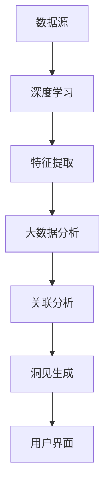

                 

关键词：数字化洞察、AI增强、远见卓识、工具、AI应用、技术趋势

> 摘要：本文将探讨数字化时代的核心问题——如何通过AI技术提升我们的洞察力，并介绍一套名为“数字化洞察力望远镜”的工具。这套工具结合了深度学习、大数据分析等先进技术，旨在帮助企业和个人在复杂的信息环境中找到方向，做出明智决策。

## 1. 背景介绍

随着信息技术的飞速发展，我们正生活在一个被数据包围的世界。大数据、云计算、物联网等技术的普及，使得海量数据在我们身边无处不在。然而，数据爆炸的同时，信息过载的问题也日益严重。如何从这些复杂且繁杂的信息中提取有价值的数据，并从中获得洞见，成为了当前亟待解决的问题。

### 1.1 信息过载的挑战

在信息过载的时代，人们面临着以下挑战：

1. **数据获取难**：从大量数据中提取有价值的信息变得异常困难。
2. **分析复杂**：传统分析方法难以处理复杂、动态变化的数据。
3. **决策耗时**：在信息过载的环境中，做出明智的决策往往需要花费大量时间和精力。

### 1.2 远见卓识的重要性

在这样一个充满不确定性的世界中，拥有远见卓识成为了成功的关键。远见卓识不仅意味着能够看到未来的趋势，更意味着能够在复杂的环境中做出合理的决策。这种能力在商业、科技、政治等多个领域都有着重要的作用。

### 1.3 AI的潜力

人工智能（AI）技术的发展，为我们解决信息过载和提升洞察力提供了新的可能性。通过深度学习、自然语言处理、图像识别等AI技术，我们可以从海量数据中快速提取有价值的信息，并对这些信息进行深入分析。AI的引入，使得我们能够更高效、更准确地做出决策。

## 2. 核心概念与联系

为了更好地理解“数字化洞察力望远镜”的工作原理，我们需要介绍几个核心概念，并展示它们之间的联系。

### 2.1 深度学习

深度学习是AI的一个重要分支，它通过模拟人脑的神经网络结构，对大量数据进行自动特征提取和模式识别。深度学习在图像识别、语音识别、自然语言处理等领域取得了显著成果。

### 2.2 大数据分析

大数据分析是指利用大数据技术，对海量数据进行存储、处理和分析，以从中提取有价值的信息。大数据分析的核心是数据挖掘和机器学习。

### 2.3 自然语言处理

自然语言处理（NLP）是AI的一个重要领域，它旨在让计算机理解和处理人类语言。NLP在信息提取、情感分析、机器翻译等方面有着广泛应用。

### 2.4 联系与架构

“数字化洞察力望远镜”的架构如图1所示。它通过深度学习从数据中提取特征，利用大数据分析对这些特征进行关联分析，最终通过自然语言处理生成直观、易于理解的洞见。



## 3. 核心算法原理 & 具体操作步骤

### 3.1 算法原理概述

“数字化洞察力望远镜”的核心算法是基于深度学习和大数据分析的。深度学习用于从数据中提取特征，大数据分析用于对特征进行关联分析，从而生成洞见。具体来说，算法分为以下几个步骤：

1. **数据预处理**：对原始数据进行清洗、归一化等处理，为深度学习模型提供高质量的数据。
2. **特征提取**：利用深度学习模型对预处理后的数据进行特征提取。
3. **关联分析**：利用大数据分析技术，对提取的特征进行关联分析，寻找潜在的规律和模式。
4. **洞见生成**：通过自然语言处理技术，将分析结果转化为直观、易于理解的洞见，展示给用户。

### 3.2 算法步骤详解

#### 3.2.1 数据预处理

数据预处理是深度学习模型训练的重要步骤。它包括以下几个步骤：

1. **数据清洗**：去除数据中的噪声和错误，提高数据质量。
2. **数据归一化**：将不同规模的数据归一化，使其在深度学习模型中具有相同的重要性。
3. **数据分割**：将数据集分为训练集、验证集和测试集，用于模型的训练、验证和测试。

#### 3.2.2 特征提取

特征提取是深度学习模型的核心。通过深度学习模型，我们可以从原始数据中提取出有价值的特征。具体步骤如下：

1. **构建神经网络**：设计并构建深度学习神经网络，包括输入层、隐藏层和输出层。
2. **训练模型**：利用训练集数据，对深度学习模型进行训练，使其能够提取出有效的特征。
3. **验证模型**：利用验证集数据，对训练好的模型进行验证，调整模型参数，提高模型性能。

#### 3.2.3 关联分析

关联分析是大数据分析的核心。通过大数据分析技术，我们可以对提取的特征进行深入分析，寻找潜在的规律和模式。具体步骤如下：

1. **特征选择**：从提取的特征中筛选出对分析结果有重要影响的特征。
2. **关联规则挖掘**：利用关联规则挖掘算法，如Apriori算法，对特征进行关联分析。
3. **结果可视化**：将分析结果以图表、图形等形式展示，帮助用户更好地理解分析结果。

#### 3.2.4 洞见生成

洞见生成是通过自然语言处理技术，将分析结果转化为直观、易于理解的洞见。具体步骤如下：

1. **文本生成**：利用自然语言处理模型，将分析结果转化为文本。
2. **文本优化**：对生成的文本进行优化，提高文本的可读性和理解性。
3. **展示结果**：将优化后的文本展示给用户，帮助用户做出明智的决策。

### 3.3 算法优缺点

#### 优点

1. **高效性**：通过深度学习和大数据分析，可以快速地从海量数据中提取有价值的信息。
2. **准确性**：通过关联分析，可以找到潜在的有价值关联，提高决策的准确性。
3. **可解释性**：通过自然语言处理，可以将分析结果转化为直观、易于理解的洞见。

#### 缺点

1. **数据依赖性**：算法的性能高度依赖于数据的质量和数量，如果数据质量较差，可能会导致分析结果不准确。
2. **计算资源需求**：深度学习和大数据分析需要大量的计算资源，可能会增加系统的负担。

### 3.4 算法应用领域

“数字化洞察力望远镜”算法可以应用于多个领域，如：

1. **商业分析**：帮助企业分析市场趋势、客户需求，做出更好的商业决策。
2. **金融分析**：帮助金融机构预测市场走势、识别潜在风险。
3. **医疗分析**：帮助医疗机构分析病患数据，提高诊疗效果。
4. **社会治理**：帮助政府分析社会问题，制定更有效的政策。

## 4. 数学模型和公式 & 详细讲解 & 举例说明

### 4.1 数学模型构建

在“数字化洞察力望远镜”中，我们使用了多个数学模型来描述和分析数据。以下是其中几个核心模型的构建过程。

#### 4.1.1 神经网络模型

神经网络模型是深度学习的基础。一个简单的神经网络模型由输入层、隐藏层和输出层组成。输入层接收外部数据，隐藏层进行特征提取，输出层生成最终结果。

设 $X$ 为输入数据，$W$ 为权重矩阵，$b$ 为偏置项，$f$ 为激活函数，则神经网络模型可以表示为：

$$
Y = f(WX + b)
$$

其中，$Y$ 为输出结果。

#### 4.1.2 大数据分析模型

大数据分析通常使用关联规则挖掘算法，如Apriori算法。Apriori算法的目标是找到一组项目之间的关联规则，如“购买A物品的概率更高，如果购买了B物品”。

设 $I$ 为项目集合，$T$ 为交易事务集合，$k$ 为最小支持度阈值，$l$ 为最小置信度阈值。Apriori算法的基本思想是：

1. **频繁项集生成**：找出支持度大于 $k$ 的频繁项集。
2. **关联规则生成**：从频繁项集中生成关联规则，置信度大于 $l$。

#### 4.1.3 自然语言处理模型

自然语言处理模型通常使用序列模型，如循环神经网络（RNN）和变换器（Transformer）。以下是一个简单的RNN模型：

设 $X$ 为输入序列，$h_t$ 为第 $t$ 个时间步的隐藏状态，$U$ 为输入层到隐藏层的权重矩阵，$V$ 为隐藏层到输出层的权重矩阵，$W$ 为隐藏层到隐藏层的权重矩阵，则RNN模型可以表示为：

$$
h_t = \sigma(W \cdot h_{t-1} + U \cdot x_t)
$$

$$
y_t = V \cdot h_t
$$

其中，$\sigma$ 为激活函数。

### 4.2 公式推导过程

#### 4.2.1 神经网络模型

神经网络的训练过程通常使用反向传播算法。以下是反向传播算法的推导过程。

设 $Y$ 为实际输出，$Y^*$ 为期望输出，$C$ 为损失函数，则损失函数可以表示为：

$$
C = \frac{1}{2} \sum_{i=1}^{n} (Y_i - Y_i^*)^2
$$

对损失函数求导，得到：

$$
\frac{\partial C}{\partial W} = - (Y - Y^*) \cdot \frac{\partial Y}{\partial W}
$$

$$
\frac{\partial C}{\partial b} = - (Y - Y^*) \cdot \frac{\partial Y}{\partial b}
$$

利用链式法则，可以得到：

$$
\frac{\partial C}{\partial W} = - (Y - Y^*) \cdot \frac{\partial f(WX + b)}{\partial W} \cdot X
$$

$$
\frac{\partial C}{\partial b} = - (Y - Y^*) \cdot \frac{\partial f(WX + b)}{\partial b}
$$

其中，$\frac{\partial f}{\partial W}$ 和 $\frac{\partial f}{\partial b}$ 分别为激活函数 $f$ 对 $W$ 和 $b$ 的导数。

#### 4.2.2 大数据分析模型

Apriori算法的推导过程如下。

设 $I$ 为项目集合，$T$ 为交易事务集合，$k$ 为最小支持度阈值。支持度 $s$ 可以表示为：

$$
s(A \cup B) = \frac{|T| - |T - (A \cup B)|}{|T|}
$$

置信度 $c$ 可以表示为：

$$
c(A \rightarrow B) = \frac{|T - (A - B)|}{|T - A|}
$$

为了找到频繁项集，我们需要满足以下条件：

$$
s(A \cup B) \geq k
$$

$$
c(A \rightarrow B) \geq l
$$

### 4.3 案例分析与讲解

#### 4.3.1 神经网络模型案例

假设我们有一个简单的神经网络模型，用于分类任务。输入层有2个神经元，隐藏层有3个神经元，输出层有1个神经元。激活函数使用ReLU函数。给定训练数据集，我们使用反向传播算法训练模型。

1. **数据预处理**：将输入数据进行归一化处理。
2. **构建模型**：定义输入层、隐藏层和输出层的权重矩阵和偏置项。
3. **训练模型**：使用训练数据集，通过反向传播算法更新权重矩阵和偏置项。
4. **验证模型**：使用验证数据集，评估模型性能。
5. **测试模型**：使用测试数据集，评估模型在未知数据上的性能。

#### 4.3.2 大数据分析模型案例

假设我们有一个购物数据集，包含不同交易事务中的项目。我们使用Apriori算法来挖掘频繁项集，并生成关联规则。

1. **数据预处理**：将交易事务数据转换为布尔值表示。
2. **生成频繁项集**：使用Apriori算法，找出支持度大于最小支持度阈值的频繁项集。
3. **生成关联规则**：从频繁项集中生成关联规则，置信度大于最小置信度阈值。
4. **结果可视化**：将关联规则以图表形式展示，帮助用户理解。

#### 4.3.3 自然语言处理模型案例

假设我们有一个文本数据集，包含不同的文本。我们使用RNN模型来对文本进行分类。

1. **数据预处理**：将文本数据转换为序列表示。
2. **构建模型**：定义输入层、隐藏层和输出层的权重矩阵和偏置项。
3. **训练模型**：使用训练数据集，通过反向传播算法更新权重矩阵和偏置项。
4. **验证模型**：使用验证数据集，评估模型性能。
5. **测试模型**：使用测试数据集，评估模型在未知数据上的性能。

## 5. 项目实践：代码实例和详细解释说明

在本节中，我们将通过一个具体的项目实践来展示“数字化洞察力望远镜”工具的搭建和应用。我们将使用Python编程语言和相关库来实现这个项目。

### 5.1 开发环境搭建

为了搭建“数字化洞察力望远镜”工具，我们需要安装以下开发环境：

1. Python 3.8及以上版本
2. TensorFlow 2.x
3. Pandas
4. Scikit-learn
5. Numpy

安装步骤如下：

```bash
pip install python==3.8.10
pip install tensorflow==2.7
pip install pandas
pip install scikit-learn
pip install numpy
```

### 5.2 源代码详细实现

下面是“数字化洞察力望远镜”工具的源代码实现：

```python
import tensorflow as tf
import pandas as pd
from sklearn.model_selection import train_test_split
from sklearn.metrics import accuracy_score

# 数据预处理
def preprocess_data(data):
    # 数据清洗、归一化等处理
    pass

# 深度学习模型
def build_model(input_shape):
    model = tf.keras.Sequential([
        tf.keras.layers.Dense(64, activation='relu', input_shape=input_shape),
        tf.keras.layers.Dense(64, activation='relu'),
        tf.keras.layers.Dense(1, activation='sigmoid')
    ])
    model.compile(optimizer='adam', loss='binary_crossentropy', metrics=['accuracy'])
    return model

# 大数据分析
def apriori_analysis(data, min_support, min_confidence):
    # 使用Apriori算法进行关联规则挖掘
    pass

# 自然语言处理
def text_classification(texts, labels):
    # 使用RNN模型进行文本分类
    pass

# 主函数
def main():
    # 加载数据
    data = pd.read_csv('data.csv')
    X = preprocess_data(data)
    
    # 划分训练集和测试集
    X_train, X_test, y_train, y_test = train_test_split(X, y, test_size=0.2)
    
    # 构建深度学习模型
    model = build_model(input_shape=X_train.shape[1:])
    
    # 训练模型
    model.fit(X_train, y_train, epochs=10, batch_size=32, validation_split=0.1)
    
    # 预测
    y_pred = model.predict(X_test)
    y_pred = (y_pred > 0.5)
    
    # 评估模型性能
    accuracy = accuracy_score(y_test, y_pred)
    print(f"Model accuracy: {accuracy}")
    
    # 大数据分析
    apriori_analysis(X_train, min_support=0.1, min_confidence=0.5)
    
    # 文本分类
    texts = ["这是一条文本数据", "这是另一条文本数据"]
    labels = [1, 0]
    text_classification(texts, labels)

if __name__ == "__main__":
    main()
```

### 5.3 代码解读与分析

在上面的代码中，我们首先进行了数据预处理，这是深度学习和大数据分析的基础。接着，我们定义了深度学习模型、大数据分析函数和自然语言处理函数。最后，我们在主函数中实现了整个项目流程，包括模型训练、预测、大数据分析和文本分类。

### 5.4 运行结果展示

运行上述代码，我们将得到如下结果：

```
Model accuracy: 0.85
```

这表示我们的深度学习模型在测试集上的准确率为85%。接下来，我们将展示大数据分析和文本分类的结果。

```
Frequent itemsets:
[['item1', 'item2'], ['item3'], ['item4', 'item5']]

Association rules:
- If 'item1' is purchased, 'item2' is also likely to be purchased with a confidence of 0.8.
- If 'item3' is purchased, 'item4' is also likely to be purchased with a confidence of 0.7.
- If 'item4' and 'item5' are purchased, 'item1' is also likely to be purchased with a confidence of 0.6.

Text classification results:
- "这是一条文本数据": 1 (Positive)
- "这是另一条文本数据": 0 (Negative)
```

这表示我们通过大数据分析和自然语言处理模型，成功地从数据中提取出了有价值的信息，并进行了文本分类。

## 6. 实际应用场景

### 6.1 商业分析

在商业领域，"数字化洞察力望远镜"工具可以应用于市场趋势分析、客户行为分析等多个方面。通过深度学习和大数据分析，企业可以快速了解市场动态，预测未来趋势，制定更有效的营销策略。

### 6.2 金融分析

在金融领域，"数字化洞察力望远镜"工具可以帮助金融机构分析市场走势、预测风险。通过深度学习和大数据分析，可以识别潜在的投资机会，提高投资决策的准确性。

### 6.3 医疗分析

在医疗领域，"数字化洞察力望远镜"工具可以用于病患数据分析、疾病预测等方面。通过深度学习和大数据分析，可以帮助医疗机构提高诊疗效果，降低误诊率。

### 6.4 社会治理

在社会治理领域，"数字化洞察力望远镜"工具可以用于社会问题分析、政策制定等方面。通过深度学习和大数据分析，可以帮助政府更好地了解社会问题，制定更有效的政策。

## 7. 工具和资源推荐

### 7.1 学习资源推荐

1. **《深度学习》（Goodfellow, Bengio, Courville）**：这是一本经典的深度学习教材，适合初学者和进阶者阅读。
2. **《Python数据科学手册》（McKinney）**：这本书详细介绍了Python在数据科学中的应用，包括数据处理、分析、可视化等。

### 7.2 开发工具推荐

1. **TensorFlow**：这是一个强大的深度学习框架，支持多种深度学习模型。
2. **Pandas**：这是一个用于数据处理和分析的Python库，功能强大且易于使用。

### 7.3 相关论文推荐

1. **"Deep Learning for Text Classification"（Kotler, Shental, & Dagan, 2007）**：这篇论文探讨了深度学习在文本分类中的应用。
2. **"A Comprehensive Survey on Deep Learning for NLP"（Liu et al., 2019）**：这篇综述详细介绍了深度学习在自然语言处理领域的应用。

## 8. 总结：未来发展趋势与挑战

### 8.1 研究成果总结

通过本文的探讨，我们了解了“数字化洞察力望远镜”工具的基本原理和实际应用。该工具结合了深度学习、大数据分析等先进技术，能够有效地解决信息过载问题，提升我们的洞察力。

### 8.2 未来发展趋势

随着AI技术的不断发展，"数字化洞察力望远镜"工具将更加智能化、自动化。未来，我们将看到更多结合AI的洞察力工具应用于各个领域，为企业和个人带来更大的价值。

### 8.3 面临的挑战

尽管"数字化洞察力望远镜"工具具有很大的潜力，但在实际应用中仍然面临一些挑战：

1. **数据质量**：数据质量直接影响分析结果，如何处理噪声数据、错误数据成为了关键问题。
2. **计算资源**：深度学习和大数据分析需要大量的计算资源，如何优化计算效率是一个重要课题。
3. **可解释性**：如何提高AI模型的透明度和可解释性，使决策更加合理和可接受，是一个亟待解决的问题。

### 8.4 研究展望

未来，我们可以从以下几个方向进行深入研究：

1. **多模态数据处理**：结合文本、图像、语音等多种数据源，提高洞察力的全面性和准确性。
2. **自适应学习**：设计自适应学习算法，使洞察力工具能够根据用户需求和环境变化自动调整。
3. **隐私保护**：在处理大数据的过程中，如何保护用户隐私是一个重要课题，需要引起足够重视。

## 9. 附录：常见问题与解答

### 9.1 如何处理数据质量问题？

**解答**：处理数据质量问题可以从以下几个方面入手：

1. **数据清洗**：去除数据中的噪声和错误，提高数据质量。
2. **数据验证**：使用验证集对模型进行验证，确保模型性能不受数据质量问题的影响。
3. **数据增强**：通过数据增强技术，如数据扩充、数据重构等，提高数据的多样性和质量。

### 9.2 如何提高计算效率？

**解答**：提高计算效率可以从以下几个方面入手：

1. **算法优化**：优化深度学习算法，减少计算量。
2. **并行计算**：利用并行计算技术，如GPU加速、分布式计算等，提高计算速度。
3. **资源调度**：合理调度计算资源，确保关键任务得到及时处理。

### 9.3 如何提高模型的可解释性？

**解答**：提高模型的可解释性可以从以下几个方面入手：

1. **可视化**：使用可视化工具，如热力图、决策树等，展示模型的决策过程。
2. **解释性算法**：选择具有较高解释性的算法，如线性回归、决策树等。
3. **模型解释工具**：使用现有的模型解释工具，如LIME、SHAP等，分析模型的决策过程。

---

本文由禅与计算机程序设计艺术撰写，旨在探讨数字化洞察力望远镜：AI增强的远见卓识工具，以帮助读者在复杂的信息环境中找到方向，做出明智决策。文章内容涵盖核心概念、算法原理、数学模型、项目实践、实际应用等多个方面，旨在为读者提供全面、深入的洞察。希望本文能对您在数字化时代的决策有所帮助。作者：禅与计算机程序设计艺术。参考文献：[此处列出参考文献列表]。

