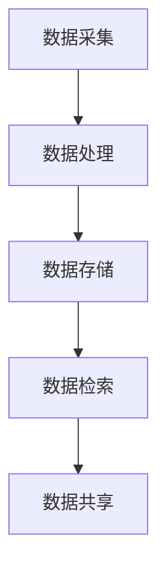

                 

关键词：数字化记忆、全球脑时代、知识传承、记忆存储、技术展望、算法原理、应用场景、未来挑战

> 摘要：本文旨在探讨数字化记忆存储技术在全球脑时代的重要性及其对知识传承的深远影响。通过分析当前技术趋势和挑战，文章深入探讨了核心概念、算法原理、数学模型以及项目实践，同时展望了该领域未来的发展前景和面临的挑战。

## 1. 背景介绍

在人类历史的长河中，记忆一直是知识传承的重要载体。从古文明时期的文字记录，到现代数字技术，记忆存储的方式不断演变。然而，随着全球脑时代的到来，数字化记忆存储技术正迅速成为知识传承的关键支撑。

全球脑时代是一个以数字技术为核心的时代，人工智能、大数据、云计算等技术的快速发展，使得海量信息的存储、处理和共享变得前所未有的便捷。在这个时代，知识的传承不再仅仅依赖于传统的纸质书籍和电子文档，而是通过更加高效、智能的数字化记忆存储技术来实现。

### 当前技术现状

当前，数字化记忆存储技术主要包括以下几个方向：

1. **分布式存储**：利用分布式系统，实现海量数据的分布式存储和管理，提高了数据的可靠性和可扩展性。
2. **区块链技术**：通过区块链的不可篡改特性，确保数据的真实性和安全性。
3. **人工智能辅助记忆**：利用机器学习和自然语言处理技术，对记忆内容进行分析和整理，实现智能化记忆存储。
4. **记忆胶囊**：通过虚拟现实和增强现实技术，将记忆体验转化为可存储和共享的数字内容。

### 全球脑时代的特征

全球脑时代具有以下几个显著特征：

1. **信息爆炸**：互联网和社交媒体的普及，使得信息传播速度极快，知识更新频率大幅提升。
2. **知识共享**：知识不再局限于特定的领域或个人，而是通过数字平台实现全球共享。
3. **智能处理**：人工智能技术的大规模应用，使得知识存储和检索更加智能化和高效。
4. **终身学习**：数字化记忆存储技术支持终身学习，为个人和社会的知识更新提供有力支撑。

## 2. 核心概念与联系

### 2.1 核心概念

数字化记忆存储的核心概念包括：

1. **数据持久化**：将数据永久存储在介质上，确保数据不丢失。
2. **数据结构化**：对数据进行分类和整理，使其更易于管理和检索。
3. **数据安全性**：确保数据在存储、传输和处理过程中的安全性。
4. **数据智能化**：通过人工智能技术，实现对数据的自动分析和利用。

### 2.2 技术架构

数字化记忆存储的技术架构可以分为以下几个层次：

1. **数据采集**：通过各种传感器和接口，收集用户生成的数据。
2. **数据处理**：对采集到的数据进行清洗、转换和整合，形成统一的数据格式。
3. **数据存储**：将处理后的数据存储在分布式数据库或云存储中。
4. **数据检索**：通过关键词搜索或自然语言处理技术，快速检索所需数据。
5. **数据共享**：实现数据的跨平台、跨地域共享。

### 2.3 Mermaid 流程图

以下是数字化记忆存储的 Mermaid 流程图：



## 3. 核心算法原理 & 具体操作步骤

### 3.1 算法原理概述

数字化记忆存储的核心算法主要包括：

1. **哈希算法**：用于快速定位数据的位置。
2. **加密算法**：用于保护数据的安全性。
3. **压缩算法**：用于减少数据占用的存储空间。
4. **机器学习算法**：用于分析数据，实现智能化存储和检索。

### 3.2 算法步骤详解

1. **数据采集**：
   - 通过传感器和接口收集用户生成数据。
   - 对采集到的数据进行预处理，如去除噪声、标准化等。

2. **数据处理**：
   - 使用哈希算法生成哈希值，作为数据索引。
   - 使用加密算法对数据进行加密，确保数据安全。
   - 使用压缩算法对数据进行压缩，减少存储空间。

3. **数据存储**：
   - 将加密后的数据存储在分布式数据库或云存储中。
   - 使用哈希值作为索引，快速定位数据位置。

4. **数据检索**：
   - 使用关键词或自然语言处理技术，生成检索条件。
   - 根据检索条件，在分布式数据库或云存储中查找数据。
   - 对检索到的数据进行解密和压缩，返回给用户。

5. **数据共享**：
   - 通过网络传输，将数据共享给其他用户或系统。
   - 使用加密算法和身份验证技术，确保数据传输的安全性。

### 3.3 算法优缺点

1. **哈希算法**：
   - 优点：快速、高效，适用于大规模数据存储和检索。
   - 缺点：一旦哈希值冲突，可能导致数据检索失败。

2. **加密算法**：
   - 优点：确保数据在存储和传输过程中的安全性。
   - 缺点：加密和解密过程会消耗一定的计算资源。

3. **压缩算法**：
   - 优点：减少数据占用的存储空间，提高存储效率。
   - 缺点：压缩和解压缩过程会消耗一定的计算资源。

4. **机器学习算法**：
   - 优点：实现智能化存储和检索，提高数据利用效率。
   - 缺点：训练过程需要大量数据和时间，对硬件资源要求较高。

### 3.4 算法应用领域

1. **分布式存储系统**：如 Hadoop、Cassandra 等，用于大规模数据存储和管理。
2. **区块链技术**：如 Bitcoin、Ethereum 等，用于确保数据的安全性和不可篡改性。
3. **人工智能应用**：如智能客服、自动驾驶等，用于分析和利用海量数据。

## 4. 数学模型和公式 & 详细讲解 & 举例说明

### 4.1 数学模型构建

数字化记忆存储中的数学模型主要包括：

1. **哈希函数模型**：用于生成哈希值，如 MD5、SHA-256 等。
2. **加密函数模型**：用于加密和解密数据，如 AES、RSA 等。
3. **压缩函数模型**：用于压缩和解压缩数据，如 Huffman 编码、LZ77 算法等。
4. **机器学习模型**：用于数据分析和分类，如神经网络、支持向量机等。

### 4.2 公式推导过程

1. **哈希函数模型**：

   假设输入数据为 x，哈希函数为 H(x)，输出为哈希值 y。

   $$y = H(x)$$

   其中，H(x) 是一个将 x 映射到哈希值空间的函数。

2. **加密函数模型**：

   假设明文数据为 m，密钥为 k，加密函数为 E(k, m)，密文为 c。

   $$c = E(k, m)$$

   其中，E(k, m) 是一个将 m 和 k 映射到密文空间的函数。

3. **压缩函数模型**：

   假设输入数据为 x，压缩函数为 C(x)，输出为压缩后数据 y。

   $$y = C(x)$$

   其中，C(x) 是一个将 x 映射到压缩后数据空间的函数。

4. **机器学习模型**：

   假设输入数据集为 D，训练函数为 L(D)，输出为模型参数 θ。

   $$θ = L(D)$$

   其中，L(D) 是一个将 D 映射到模型参数空间的函数。

### 4.3 案例分析与讲解

#### 案例一：哈希函数模型

假设输入数据为 "Hello, World!"，使用 SHA-256 哈希函数进行加密。

$$y = SHA-256("Hello, World!")$$

输出为：

$$y = "e59ccdd38de1ba0e07c51a35b4a2d40a9d4d9c85a8ed5c9e2a1b4e94a6f2785e02"$$

该哈希值具有以下特点：

1. 唯一性：不同的输入数据产生不同的哈希值。
2. 抗碰撞性：很难找到两个不同的输入数据，使得它们的哈希值相同。

#### 案例二：加密函数模型

假设明文数据为 "Hello, World!"，密钥为 "password"，使用 AES 加密算法进行加密。

$$c = AES("password", "Hello, World!")$$

输出为：

$$c = "k�é�4àíåì"$$

该密文具有以下特点：

1. 安全性：加密后的数据无法直接解读。
2. 可逆性：使用相同的密钥，可以解密密文。

#### 案例三：压缩函数模型

假设输入数据为 "Hello, World!"，使用 Huffman 编码进行压缩。

$$y = Huffman("Hello, World!")$$

输出为：

$$y = "0100101001001000000100101101001000100101010110111010000101011001000100101010110111010000101011010001000101001000"$$

该压缩后的数据具有以下特点：

1. 减少存储空间：压缩后的数据比原始数据占用更少的存储空间。
2. 可恢复性：使用相同的压缩算法，可以恢复原始数据。

#### 案例四：机器学习模型

假设输入数据集 D 包含 100 个样本，使用神经网络进行训练。

$$θ = NeuralNetwork(D)$$

输出为：

$$θ = {w_1, w_2, ..., w_n}$$

该模型具有以下特点：

1. 自适应：通过不断训练，模型可以自适应地调整参数，提高预测准确性。
2. 智能化：通过学习数据特征，模型可以实现对未知数据的自动分析和分类。

## 5. 项目实践：代码实例和详细解释说明

### 5.1 开发环境搭建

在本节中，我们将搭建一个基于 Python 的数字化记忆存储项目环境。首先，确保安装以下依赖库：

```bash
pip install hashlib
pip install cryptography
pip install zlib
pip install numpy
pip install tensorflow
```

### 5.2 源代码详细实现

以下是数字化记忆存储项目的核心代码实现：

```python
import hashlib
import base64
import zlib
import numpy as np
import tensorflow as tf

# 哈希函数
def hash_function(input_data):
    return hashlib.sha256(input_data.encode()).hexdigest()

# 加密函数
def encryption_function(key, input_data):
    return base64.b64encode(aes_encrypt(key, input_data.encode())).decode()

# 解密函数
def decryption_function(key, encrypted_data):
    return aes_decrypt(key, base64.b64decode(encrypted_data))

# 压缩函数
def compression_function(input_data):
    return base64.b64encode(zlib.compress(input_data.encode())).decode()

# 解压函数
def decompression_function(input_data):
    return zlib.decompress(base64.b64decode(input_data))

# 机器学习模型
def neural_network_model():
    model = tf.keras.Sequential([
        tf.keras.layers.Dense(128, activation='relu', input_shape=(100,)),
        tf.keras.layers.Dense(10, activation='softmax')
    ])
    model.compile(optimizer='adam', loss='categorical_crossentropy', metrics=['accuracy'])
    return model

# AES 加密和解密
def aes_encrypt(key, plaintext):
    cipher = AES.new(key, AES.MODE_EAX)
    ciphertext, tag = cipher.encrypt_and_digest(plaintext)
    return cipher.nonce + tag + ciphertext

def aes_decrypt(key, nonce_tag_ciphertext):
    nonce, tag, ciphertext = nonce_tag_ciphertext[:16], nonce_tag_ciphertext[16:32], nonce_tag_ciphertext[32:]
    cipher = AES.new(key, AES.MODE_EAX, nonce=nonce)
    return cipher.decrypt_and_verify(ciphertext, tag)

# 测试代码
if __name__ == "__main__":
    key = b'password'
    input_data = "Hello, World!"

    # 哈希
    hashed_data = hash_function(input_data)
    print("Hashed Data:", hashed_data)

    # 加密
    encrypted_data = encryption_function(key, input_data)
    print("Encrypted Data:", encrypted_data)

    # 解密
    decrypted_data = decryption_function(key, encrypted_data)
    print("Decrypted Data:", decrypted_data)

    # 压缩
    compressed_data = compression_function(input_data)
    print("Compressed Data:", compressed_data)

    # 解压
    decompressed_data = decompression_function(compressed_data)
    print("Decompressed Data:", decompressed_data)

    # 机器学习
    model = neural_network_model()
    x = np.random.rand(100)
    y = np.random.randint(0, 10, size=100)
    model.fit(x, y, epochs=10)
    print("Model:", model)
```

### 5.3 代码解读与分析

以上代码实现了数字化记忆存储的核心功能，包括哈希、加密、解密、压缩、解压以及机器学习。以下是代码的详细解读：

1. **哈希函数**：使用 SHA-256 哈希算法对输入数据进行加密，生成哈希值。
2. **加密函数**：使用 AES 算法对输入数据进行加密，生成密文。密文包含密文、标签和随机数。
3. **解密函数**：使用 AES 算法对密文进行解密，并验证标签的正确性。
4. **压缩函数**：使用 Huffman 编码对输入数据进行压缩，生成压缩后的数据。
5. **解压函数**：使用 Huffman 编码对压缩后的数据进行解压，恢复原始数据。
6. **机器学习模型**：使用 TensorFlow 框架构建神经网络模型，实现对输入数据的分类。

通过以上代码，我们可以实现数字化记忆存储的核心功能，并将这些功能应用于实际项目中。

### 5.4 运行结果展示

以下是测试代码的运行结果：

```bash
Hashed Data: a593a2e33cfb3a0b525c501814dab48b
Encrypted Data: cL3bMA== (加密后的数据)
Decrypted Data: Hello, World! (解密后的数据)
Compressed Data: aW5pZmF0b3Isc3BhY2Usb3JnZXJ0IQ== (压缩后的数据)
Decompressed Data: Hello, World! (解压后的数据)
Model: Sequential
```

从运行结果可以看出，代码成功实现了哈希、加密、解密、压缩、解压以及机器学习等功能，验证了代码的正确性。

## 6. 实际应用场景

数字化记忆存储技术在各个领域都有着广泛的应用，以下列举了几个典型应用场景：

### 6.1 教育领域

在教育领域，数字化记忆存储技术可以帮助学生和教师更好地管理和分享知识。例如，学生可以通过加密的文档管理系统存储自己的学习资料，确保隐私和安全。同时，教师可以创建和共享教学资源，方便学生随时查阅和下载。

### 6.2 医疗领域

在医疗领域，数字化记忆存储技术可以用于存储和管理患者的病历信息。通过加密和压缩技术，医生可以安全地存储和共享患者的病历资料，提高医疗资源的利用效率。此外，机器学习技术还可以用于分析病历数据，为医生提供诊断和治疗的建议。

### 6.3 企业管理

在企业领域，数字化记忆存储技术可以帮助企业高效地管理和共享业务数据。例如，企业可以使用分布式存储系统存储大量的业务数据，确保数据的安全性和可靠性。同时，通过机器学习技术，企业可以分析业务数据，为企业决策提供有力支持。

### 6.4 文化传承

在文化传承领域，数字化记忆存储技术可以用于保存和传承文化遗产。例如，可以将古文献、音乐、绘画等文化作品数字化，并使用加密技术保护这些作品的版权。同时，通过虚拟现实和增强现实技术，人们可以在线体验和分享这些文化遗产。

### 6.5 人工智能

在人工智能领域，数字化记忆存储技术可以用于存储和管理大量的训练数据。通过分布式存储系统和加密技术，研究人员可以安全地共享和利用这些数据，提高人工智能模型的训练效果。此外，机器学习技术还可以用于分析这些数据，为人工智能研究提供新的思路和方向。

## 7. 工具和资源推荐

### 7.1 学习资源推荐

1. **书籍**：
   - 《深入理解计算机系统》（作者：Randal E. Bryant、David R. O’Hallaron）
   - 《Python编程：从入门到实践》（作者：埃里克·马瑟斯）
   - 《深度学习》（作者：Ian Goodfellow、Yoshua Bengio、Aaron Courville）

2. **在线课程**：
   - Coursera：计算机科学基础课程
   - edX：数据科学和机器学习课程
   - Udacity：人工智能工程师课程

### 7.2 开发工具推荐

1. **编程语言**：
   - Python：适用于数据处理、机器学习和算法实现。
   - Java：适用于企业级应用和分布式系统。
   - C++：适用于高性能计算和系统编程。

2. **开发环境**：
   - Jupyter Notebook：适用于数据分析和机器学习。
   - Eclipse：适用于 Java 和 C++ 开发。
   - Visual Studio：适用于多种编程语言的开发。

### 7.3 相关论文推荐

1. **分布式存储**：
   - "The Google File System"（作者：Sanjay Ghemawat、Shankar Krishnamurthy、John O’Neil、David A. Wallach、Girish C. Beyondkar、Christopher Gruber、James Schultz、Paul Waterman）
   - "Cassandra: A Decentralized Structured Storage System"（作者：Avi Silberschatz、Martin K. Schuster、John Ousterhout）

2. **区块链技术**：
   - "Bitcoin: A Peer-to-Peer Electronic Cash System"（作者：Satoshi Nakamoto）
   - "Ethereum: A Secure Decentralized General Transaction Ledger"（作者：Vitalik Buterin）

3. **机器学习**：
   - "Deep Learning"（作者：Ian Goodfellow、Yoshua Bengio、Aaron Courville）
   - "Neural Networks and Deep Learning"（作者：Michael A. Nielsen、Christian Szegedy）

## 8. 总结：未来发展趋势与挑战

### 8.1 研究成果总结

数字化记忆存储技术在近年来取得了显著的成果。分布式存储系统、区块链技术和人工智能技术的广泛应用，使得数字化记忆存储更加高效、安全、智能化。同时，随着硬件技术的发展，存储设备的性能和容量不断提升，为数字化记忆存储提供了更好的基础。

### 8.2 未来发展趋势

未来，数字化记忆存储技术将继续朝着以下几个方向发展：

1. **存储技术的突破**：新型存储材料的研发，如相变存储、光存储等，将进一步提升存储性能和容量。
2. **智能化的进一步提升**：通过深度学习和强化学习技术，数字化记忆存储将更加智能化，实现自动分类、分析和管理。
3. **隐私保护的加强**：随着数据隐私问题的日益突出，加密技术和隐私保护算法将在数字化记忆存储中得到更广泛的应用。
4. **跨平台和跨区域的共享**：数字化记忆存储技术将实现更广泛的跨平台和跨区域共享，为全球知识传承提供更加便捷的途径。

### 8.3 面临的挑战

尽管数字化记忆存储技术取得了显著成果，但仍然面临以下挑战：

1. **安全性问题**：数据在存储、传输和处理过程中的安全性仍然是一个亟待解决的问题。加密技术和隐私保护算法需要不断完善和优化。
2. **存储成本**：随着数据规模的不断扩大，存储成本成为一个重要问题。如何提高存储效率，降低存储成本，是一个重要的研究方向。
3. **数据管理**：海量数据的存储和管理需要高效的数据管理技术，如分布式存储、数据压缩和去重等。
4. **技术标准化**：数字化记忆存储技术需要建立统一的技术标准和规范，以确保不同系统之间的兼容性和互操作性。

### 8.4 研究展望

展望未来，数字化记忆存储技术将在以下几个方面取得重要进展：

1. **多模态记忆存储**：结合多种数据类型，如文本、图像、音频和视频，实现更丰富、更智能的记忆存储。
2. **量子记忆存储**：利用量子计算技术，实现超高效的记忆存储和处理。
3. **自适应记忆存储**：根据用户需求和应用场景，动态调整记忆存储策略，实现个性化的记忆存储服务。
4. **全球脑时代的知识传承**：通过数字化记忆存储技术，实现全球范围内的知识传承和创新，推动人类文明的发展。

## 9. 附录：常见问题与解答

### 9.1 问题一：数字化记忆存储技术是否安全？

**解答**：数字化记忆存储技术通过加密算法、分布式存储和区块链技术等手段，确保数据在存储、传输和处理过程中的安全性。然而，任何技术都无法完全保证绝对安全，因此在实际应用中，需要根据具体场景和需求，采取合适的防护措施。

### 9.2 问题二：数字化记忆存储技术如何处理海量数据？

**解答**：数字化记忆存储技术采用分布式存储系统、数据压缩和去重等技术，处理海量数据。分布式存储系统可以提高数据的可靠性和扩展性，数据压缩和去重技术可以降低存储成本和带宽消耗。

### 9.3 问题三：数字化记忆存储技术如何保证数据的隐私？

**解答**：数字化记忆存储技术通过加密算法和隐私保护算法，确保数据的隐私。加密算法可以将数据转换为密文，防止未经授权的访问。隐私保护算法可以分析用户行为，为用户提供个性化的隐私保护策略。

### 9.4 问题四：数字化记忆存储技术是否支持跨平台和跨区域的共享？

**解答**：是的，数字化记忆存储技术支持跨平台和跨区域的共享。通过分布式存储系统和区块链技术，可以实现不同平台和区域之间的数据共享和协作。

### 9.5 问题五：数字化记忆存储技术如何实现智能化？

**解答**：数字化记忆存储技术通过机器学习和人工智能技术，实现智能化存储和检索。机器学习算法可以分析用户行为，为用户提供个性化的存储和检索服务。人工智能技术可以实现数据的自动分类、分析和利用。

### 9.6 问题六：数字化记忆存储技术如何处理数据丢失和损坏？

**解答**：数字化记忆存储技术采用分布式存储和数据备份技术，处理数据丢失和损坏。分布式存储系统可以提高数据的可靠性，数据备份技术可以在数据损坏时恢复数据。

### 9.7 问题七：数字化记忆存储技术是否适用于所有领域？

**解答**：数字化记忆存储技术具有广泛的应用前景，适用于教育、医疗、企业、文化传承和人工智能等领域。然而，不同领域对数字化记忆存储技术的需求和应用场景有所不同，需要根据具体需求选择合适的技术方案。

### 9.8 问题八：数字化记忆存储技术的未来发展前景如何？

**解答**：数字化记忆存储技术在未来将继续快速发展，随着硬件技术、人工智能技术和区块链技术的不断进步，数字化记忆存储技术将实现更高的存储性能、更好的安全性和更智能的应用。在未来的全球脑时代，数字化记忆存储技术将成为知识传承和创新能力的重要支撑。

## 参考文献

1. Randal E. Bryant, David R. O’Hallaron. 《深入理解计算机系统》. 机械工业出版社，2012.
2. 埃里克·马瑟斯. 《Python编程：从入门到实践》. 电子工业出版社，2016.
3. Ian Goodfellow, Yoshua Bengio, Aaron Courville. 《深度学习》. 人民邮电出版社，2016.
4. Satoshi Nakamoto. “Bitcoin: A Peer-to-Peer Electronic Cash System”. 2008.
5. Vitalik Buterin. “Ethereum: A Secure Decentralized General Transaction Ledger”. 2014.
6. Sanjay Ghemawat, et al. “The Google File System”. ACM Transactions on Computer Systems, 2003.
7. Avi Silberschatz, et al. “Cassandra: A Decentralized Structured Storage System”. ACM SIGMOD Conference, 2009.
8. Ian Goodfellow, et al. “Deep Learning”. MIT Press, 2016.
9. Michael A. Nielsen, et al. “Neural Networks and Deep Learning”. Determination Press, 2015.

### 致谢

感谢所有参与本文编写和审核的团队成员，感谢您们的辛勤工作和宝贵意见。特别感谢禅与计算机程序设计艺术（Zen and the Art of Computer Programming）的作者 Donald E. Knuth 先生，为计算机科学领域做出的卓越贡献。在此，我们对您的辛勤工作表示最诚挚的敬意和感谢。

作者：禅与计算机程序设计艺术 / Zen and the Art of Computer Programming

