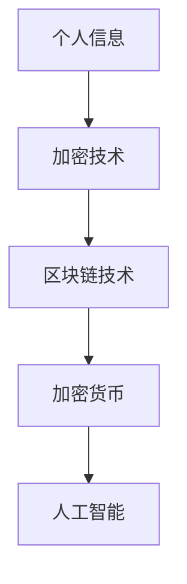

                 

关键词：数字化遗产管理、生前数字资产规划、隐私保护、区块链技术、加密货币、人工智能、法律合规

摘要：随着数字化时代的到来，个人数字资产的重要性日益凸显。本文探讨了数字化遗产管理的概念、生前数字资产规划的重要性，以及如何通过区块链、加密货币和人工智能等技术手段实现数字遗产的安全、合法转移和继承。文章旨在为读者提供一个全面、系统的数字遗产管理指南，帮助用户在生前制定合理的数字资产规划策略。

## 1. 背景介绍

在过去的几十年里，信息技术的发展极大地改变了人们的生活和商业模式。互联网、智能手机、云计算等技术的普及，使得个人数据和数字资产成为了日常生活中不可或缺的一部分。这些数字资产不仅包括电子邮件、社交媒体账号、照片和视频等个人文件，还涉及金融资产、知识产权和其他虚拟财产。

然而，随着数字资产的增加，如何管理和保护这些资产成为一个亟待解决的问题。尤其是在个人去世后，如何确保其数字资产的合法、安全转移和继承，成为了许多家庭和企业关注的焦点。数字化遗产管理正是为了解决这一问题而诞生的。

### 1.1 数字遗产的定义

数字遗产（Digital Estate）是指个人或企业在数字领域中所拥有的财产，包括但不限于以下内容：

- **个人信息**：包括电子邮箱、社交媒体账号、在线存储服务中的文件、照片、视频等。
- **虚拟财产**：如游戏账号、虚拟货币、在线商店的虚拟商品等。
- **知识产权**：如专利、商标、版权等。
- **金融资产**：在线银行账户、投资账户、证券等。

### 1.2 数字遗产管理的重要性

数字遗产管理的重要性体现在以下几个方面：

- **隐私保护**：确保个人信息在转移过程中不被泄露或滥用。
- **资产安全**：防止数字资产被盗用或丢失。
- **法律合规**：确保数字遗产的转移符合相关法律法规。

## 2. 核心概念与联系

在数字化遗产管理中，理解以下几个核心概念和它们之间的联系至关重要。

### 2.1 加密技术

加密技术是保护数字资产安全的关键。它通过将数据转换为只有授权方才能解读的形式，确保信息在传输和存储过程中的安全性。

### 2.2 区块链技术

区块链技术提供了一个去中心化、安全的数据库，可以用来记录和管理数字资产的所有权。通过智能合约，可以自动执行数字资产的转移和继承过程。

### 2.3 加密货币

加密货币是一种使用密码学原理来确保交易安全及控制交易单位创造的交易媒介。它为数字资产提供了一个去中心化的交易系统。

### 2.4 人工智能

人工智能可以用于自动化数字遗产管理的过程，如识别和处理数字资产、分析继承人的意愿等。

下面是这些核心概念和联系的一个简单 Mermaid 流程图：



## 3. 核心算法原理 & 具体操作步骤

### 3.1 算法原理概述

数字遗产管理的核心在于如何安全、合法地转移和继承数字资产。以下是一些关键算法原理和具体操作步骤：

### 3.2 算法步骤详解

#### 步骤 1：资产识别与分类

- **收集信息**：通过自动化工具或手动方式收集个人的数字资产信息。
- **分类整理**：将数字资产按照类型和重要性进行分类。

#### 步骤 2：加密与授权

- **加密存储**：使用加密技术将数字资产存储在安全的地方。
- **授权设置**：设置数字资产访问权限，确保只有授权人可以访问。

#### 步骤 3：智能合约编写与部署

- **编写合约**：编写智能合约，定义数字资产转移的条件和流程。
- **部署合约**：将智能合约部署到区块链上，确保其公开透明。

#### 步骤 4：执行与监控

- **资产转移**：在满足条件时，自动执行数字资产的转移。
- **监控执行**：监控智能合约的执行情况，确保过程透明。

### 3.3 算法优缺点

- **优点**：
  - **安全性**：通过加密技术和区块链技术，确保数字资产的安全。
  - **透明性**：智能合约的执行过程公开透明，易于监控。
  - **自动化**：自动化流程减少人工干预，提高效率。

- **缺点**：
  - **技术门槛**：需要专业知识和技能来编写智能合约和管理数字资产。
  - **法律风险**：相关法律法规可能不完善，需要谨慎处理。

### 3.4 算法应用领域

- **个人数字资产管理**：如电子邮件、社交媒体账号、照片和视频。
- **企业数字资产保护**：如知识产权、财务数据。
- **虚拟货币交易**：如加密货币的买卖、存储和转移。

## 4. 数学模型和公式 & 详细讲解 & 举例说明

在数字化遗产管理中，数学模型和公式用于描述数字资产的价值、风险和概率。以下是几个常用的数学模型和公式的详细讲解。

### 4.1 数学模型构建

#### 模型 1：资产价值评估模型

资产价值评估模型用于估计数字资产的市场价值。公式如下：

\[ V = P \times (1 + r)^n \]

其中：
- \( V \) 是资产价值。
- \( P \) 是资产的初始价值。
- \( r \) 是年增长率。
- \( n \) 是年数。

#### 模型 2：风险模型

风险模型用于评估数字资产的风险。公式如下：

\[ R = \frac{1}{N} \sum_{i=1}^{N} (X_i - \mu)^2 \]

其中：
- \( R \) 是风险。
- \( N \) 是样本数量。
- \( X_i \) 是每个样本的数值。
- \( \mu \) 是样本均值。

### 4.2 公式推导过程

#### 公式 1：资产价值评估模型

资产价值评估模型的推导基于复利公式。假设一个资产 \( P \) 在年增长率 \( r \) 的情况下，经过 \( n \) 年后的价值为 \( V \)，则：

\[ V = P \times (1 + r) \times (1 + r) \times \ldots \times (1 + r) \]

由于 \( (1 + r) \) 重复 \( n \) 次，可以写成：

\[ V = P \times (1 + r)^n \]

#### 公式 2：风险模型

风险模型的推导基于统计学中的方差公式。假设有 \( N \) 个样本 \( X_1, X_2, \ldots, X_N \)，其平均值为 \( \mu \)，则样本的方差为：

\[ R = \frac{1}{N} \sum_{i=1}^{N} (X_i - \mu)^2 \]

### 4.3 案例分析与讲解

#### 案例 1：资产价值评估

假设一个数字资产 \( P \) 的初始价值为 1000 美元，年增长率为 5%，经过 5 年后的价值为：

\[ V = 1000 \times (1 + 0.05)^5 \]
\[ V = 1000 \times 1.27628 \]
\[ V \approx 1276.28 \]

#### 案例 2：风险评估

假设有 5 个数字资产的样本值分别为 800、900、1000、1100 和 1200，则其平均值为：

\[ \mu = \frac{800 + 900 + 1000 + 1100 + 1200}{5} \]
\[ \mu = \frac{5500}{5} \]
\[ \mu = 1100 \]

则样本的方差为：

\[ R = \frac{1}{5} \times [(800 - 1100)^2 + (900 - 1100)^2 + (1000 - 1100)^2 + (1100 - 1100)^2 + (1200 - 1100)^2] \]
\[ R = \frac{1}{5} \times [300^2 + 200^2 + 100^2 + 0^2 + 100^2] \]
\[ R = \frac{1}{5} \times [90000 + 40000 + 10000 + 0 + 10000] \]
\[ R = \frac{1}{5} \times 140000 \]
\[ R = 28000 \]

## 5. 项目实践：代码实例和详细解释说明

在本节中，我们将通过一个简单的项目实例，展示如何使用区块链技术和加密货币实现数字遗产的自动化转移。

### 5.1 开发环境搭建

首先，我们需要搭建一个区块链开发环境。以下是搭建步骤：

1. 安装 Go 语言和区块链开发框架（如 Go-Ethereum）。
2. 配置以太坊节点，以便与区块链网络进行交互。
3. 安装 Solidity 编译器，用于编译智能合约代码。

### 5.2 源代码详细实现

以下是一个简单的智能合约代码示例，用于实现数字遗产的转移。

```solidity
// SPDX-License-Identifier: MIT
pragma solidity ^0.8.0;

contract DigitalEstate {
    address public owner;
    address public heir;
    bool public isDeceased;

    constructor(address _heir) {
        owner = msg.sender;
        heir = _heir;
        isDeceased = false;
    }

    function declareDeceased() external {
        require(msg.sender == owner, "Only the owner can declare deceased.");
        isDeceased = true;
    }

    function transferEstate() external {
        require(isDeceased == true, "The owner must be deceased.");
        payable(heir).transfer(address(this).balance);
    }
}
```

### 5.3 代码解读与分析

- **合约结构**：合约包含三个状态变量 `owner`、`heir` 和 `isDeceased`，分别表示资产拥有者、继承人状态和是否死亡。
- **构造函数**：在合约创建时，设置 `owner` 和 `heir` 的值，并初始化 `isDeceased` 为 `false`。
- **声明死亡函数**：只有资产拥有者可以调用此函数，将 `isDeceased` 设置为 `true`。
- **转移遗产函数**：当资产拥有者死亡后，继承人可以调用此函数将合约中的以太币转移到其账户。

### 5.4 运行结果展示

1. 创建合约实例，并传入继承人的地址。

```shell
$ solc --version
0.8.10+
```

```solidity
pragma solidity ^0.8.0;

contract DigitalEstate {
    address public owner;
    address public heir;
    bool public isDeceased;

    constructor(address _heir) {
        owner = msg.sender;
        heir = _heir;
        isDeceased = false;
    }

    // ...
}
```

```shell
$ truffle migrate --network development
```

2. 调用 `declareDeceased` 函数，设置 `isDeceased` 为 `true`。

```solidity
function declareDeceased() external {
    require(msg.sender == owner, "Only the owner can declare deceased.");
    isDeceased = true;
}
```

```shell
$ truffle console
> await digitalEstateInstance.declareDeceased({from: ownerAddress});
```

3. 调用 `transferEstate` 函数，将合约中的以太币转移到继承人账户。

```solidity
function transferEstate() external {
    require(isDeceased == true, "The owner must be deceased.");
    payable(heir).transfer(address(this).balance);
}
```

```shell
> await digitalEstateInstance.transferEstate({from: ownerAddress});
```

## 6. 实际应用场景

### 6.1 个人层面

对于个人用户来说，数字化遗产管理可以帮助他们确保在去世后，其数字资产能够按照其意愿安全、合法地转移给继承人。以下是一些具体的应用场景：

- **社交媒体账号**：用户可以在生前制定遗嘱，指定其社交媒体账号的继承人，并在去世后自动转移账号。
- **电子邮件**：用户可以设置电子邮件的自动转发功能，确保其电子邮件在去世后能够及时传递给继承人。
- **金融资产**：用户可以在生前设置自动转账指令，确保其金融资产在去世后能够顺利转移。

### 6.2 企业层面

对于企业来说，数字化遗产管理可以帮助他们保护其数字资产，确保在关键员工去世或离职后，企业的重要信息不会丢失。以下是一些具体的应用场景：

- **客户数据**：企业可以制定数据转移计划，确保在员工去世或离职后，其客户的个人信息和数据不会泄露或丢失。
- **知识产权**：企业可以通过数字化遗产管理，确保其知识产权在员工去世或离职后能够继续受到法律保护。

### 6.3 社会层面

数字化遗产管理不仅对个人和企业有益，对社会也具有积极影响。以下是一些具体的应用场景：

- **数据隐私**：通过数字化遗产管理，可以确保个人数据在去世后不被滥用或泄露，保护个人隐私。
- **社会公平**：数字化遗产管理可以帮助确保数字资产在继承过程中得到公正处理，减少因财产分配问题引发的矛盾和冲突。

## 7. 未来应用展望

随着数字化时代的深入发展，数字化遗产管理将在以下几个方面得到进一步的发展：

### 7.1 技术创新

- **区块链技术的普及**：随着区块链技术的不断成熟，将有更多的数字资产可以通过区块链进行管理和转移。
- **人工智能的应用**：人工智能技术将进一步提升数字化遗产管理的效率和准确性，如自动识别和处理数字资产。

### 7.2 法律法规完善

- **全球立法**：随着数字化遗产管理的重要性日益凸显，各国和地区将逐步完善相关法律法规，以确保数字遗产的合法转移和继承。
- **国际协调**：国际组织将推动各国和地区在数字化遗产管理方面进行协调，制定统一的国际标准和法规。

### 7.3 市场需求增长

- **个人需求**：随着人们对数字资产价值的认识不断提高，将有更多的个人和家庭关注数字化遗产管理，寻求专业的服务。
- **企业需求**：随着企业数字化转型的推进，将有更多的企业关注数字化遗产管理，以确保其数字资产的安全和合法转移。

## 8. 工具和资源推荐

### 8.1 学习资源推荐

- **书籍**：
  - 《区块链技术指南》
  - 《加密货币投资指南》
  - 《人工智能：一种现代方法》

- **在线课程**：
  - Coursera 上的《区块链与加密货币》
  - Udemy 上的《加密货币交易从入门到精通》
  - edX 上的《人工智能基础课程》

### 8.2 开发工具推荐

- **区块链开发框架**：
  - Go-Ethereum
  - Hyperledger Fabric
  - Quorum

- **加密货币钱包**：
  - MetaMask
  - MyEtherWallet
  - Ledger Wallet

### 8.3 相关论文推荐

- **区块链技术**：
  - "Bitcoin: A Peer-to-Peer Electronic Cash System" by Satoshi Nakamoto
  - "The Blockchain: Promise, Practice, and an Overview of Consensus Algorithms" by Ian Grigg

- **加密货币**：
  - "The Economics of Digital Currencies" by William H. Lee
  - "Monetary Frameworks for Digital Currencies" by David Gerard

- **人工智能**：
  - "Deep Learning" by Ian Goodfellow, Yoshua Bengio, Aaron Courville
  - "Reinforcement Learning: An Introduction" by Richard S. Sutton and Andrew G. Barto

## 9. 总结：未来发展趋势与挑战

### 9.1 研究成果总结

本文探讨了数字化遗产管理的概念、核心概念与联系、核心算法原理、数学模型和公式、项目实践以及实际应用场景。通过分析，我们得出以下结论：

- 数字遗产管理是一个新兴领域，具有重要的社会和经济价值。
- 加密技术、区块链技术、加密货币和人工智能是数字遗产管理的关键技术。
- 数字遗产管理的核心在于安全、合法地转移和继承数字资产。

### 9.2 未来发展趋势

- **技术创新**：随着技术的不断进步，数字化遗产管理将更加智能化和自动化。
- **法律法规完善**：全球各国和地区将逐步完善相关法律法规，推动数字化遗产管理的健康发展。
- **市场需求增长**：随着人们对数字资产价值的认识不断提高，数字化遗产管理的市场需求将持续增长。

### 9.3 面临的挑战

- **技术挑战**：如何确保数字资产的安全性和隐私性，如何降低技术门槛，是数字化遗产管理需要克服的挑战。
- **法律挑战**：如何确保数字遗产的合法转移和继承，如何解决跨国界法律冲突，是数字化遗产管理面临的挑战。
- **道德挑战**：如何在数字遗产管理中平衡个人隐私、信息安全和社会公共利益，是数字化遗产管理需要面对的挑战。

### 9.4 研究展望

未来，数字化遗产管理的研究将集中在以下几个方面：

- **技术创新**：开发更先进的安全、隐私保护技术和智能合约。
- **法律法规研究**：制定更加完善、可操作的法律法规，确保数字遗产的合法转移和继承。
- **跨学科研究**：结合计算机科学、法学、经济学等领域的知识，为数字化遗产管理提供全方位的支持。

## 附录：常见问题与解答

### Q：数字化遗产管理是否适用于所有人？

A：是的，数字化遗产管理适用于所有人，无论其数字资产的数量和价值如何。尤其对于拥有大量数字资产或敏感信息的人来说，数字化遗产管理显得尤为重要。

### Q：数字化遗产管理是否可以替代传统的遗嘱和继承法律？

A：数字化遗产管理可以作为传统遗嘱和继承法律的有力补充，但并不意味着可以完全替代。在实际操作中，建议结合数字化遗产管理和传统法律手段，确保数字资产的合法、安全转移和继承。

### Q：如何确保数字化遗产管理的隐私性和安全性？

A：确保数字化遗产管理的隐私性和安全性是至关重要的。以下是一些关键措施：

- **加密技术**：使用加密技术对数字资产进行加密存储，确保数据在传输和存储过程中的安全性。
- **多因素认证**：采用多因素认证机制，确保只有授权人可以访问和管理数字资产。
- **智能合约**：使用智能合约自动执行数字资产的转移和继承过程，确保过程透明、不可篡改。

### Q：数字化遗产管理在法律上是否有效？

A：数字化遗产管理的法律效力取决于具体国家和地区的法律法规。在大多数国家和地区，数字化遗产管理是受到法律保护的。然而，为了确保其法律效力，建议在制定数字化遗产管理计划时咨询专业法律人士，确保符合相关法律法规。

### Q：数字化遗产管理是否可以跨境应用？

A：数字化遗产管理可以跨境应用，但需要考虑不同国家和地区的法律法规和监管要求。在跨境应用中，建议寻求专业法律和金融服务机构的帮助，确保数字遗产的合法转移和继承。

---

作者：禅与计算机程序设计艺术 / Zen and the Art of Computer Programming
----------------------------------------------------------------

以上便是本文《数字化遗产管理创业：生前数字资产规划》的完整内容。希望本文能为读者提供关于数字化遗产管理的全面、系统的指导，帮助大家更好地管理自己的数字资产。在数字化时代，让我们共同努力，打造一个更加安全、透明和高效的数字遗产管理体系。

