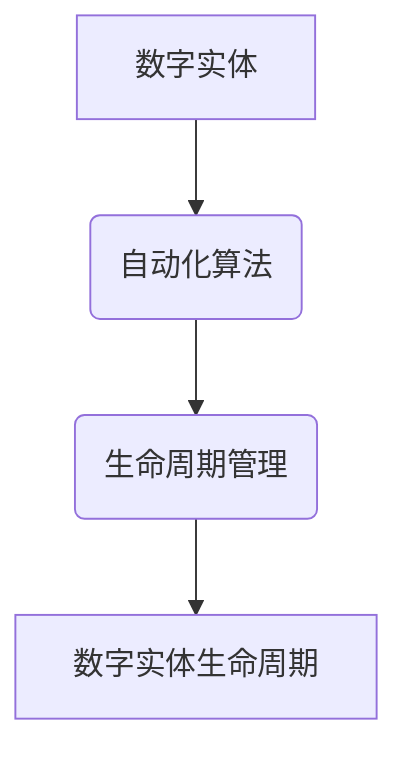

                 

关键词：数字实体自动化、数字化转型、智能算法、未来趋势

> 摘要：本文旨在探讨数字实体自动化的未来发展趋势，通过深入分析其核心概念、算法原理、数学模型、实践案例以及应用场景，为读者提供一个全面的视角，探讨这一领域的未来发展潜力和面临的挑战。

## 1. 背景介绍

### 数字实体自动化的概念

数字实体自动化（Digital Entity Automation）是指通过计算机程序和算法，实现对数字实体的智能化管理和控制。数字实体可以是数据、设备、流程、服务等各种形式的信息单元。自动化技术的引入，使得这些数字实体能够自我运行、自我优化和自我修复，大大提高了效率和准确性。

### 数字实体自动化的发展历程

数字实体自动化的发展可以追溯到计算机编程和自动化控制的初期阶段。随着计算机技术的不断进步和算法理论的深入研究，自动化技术逐渐从简单的任务执行发展到复杂业务流程的管理，再到现在的智能化和自适应化。

### 当前应用现状

当前，数字实体自动化已广泛应用于各个行业，如金融、制造、医疗、物流等。特别是在大数据和人工智能技术的推动下，自动化技术在业务流程优化、资源调度、风险控制等方面发挥了重要作用。

## 2. 核心概念与联系

### 数字实体

数字实体是指存在于数字世界中的各种信息单元，包括数据、文档、图像、视频等。它们是数字实体自动化的基础。

### 自动化算法

自动化算法是实现数字实体自动化的核心，包括决策树、神经网络、遗传算法等。这些算法可以根据预设规则或学习到的模式，对数字实体进行分类、预测和优化。

### 数字实体生命周期管理

数字实体生命周期管理是指对数字实体从创建到销毁的全过程进行管理和监控。包括创建、存储、处理、传输、销毁等环节。

### Mermaid 流程图



## 3. 核心算法原理 & 具体操作步骤

### 3.1 算法原理概述

数字实体自动化算法主要分为以下几类：

- **分类算法**：如决策树、支持向量机等，用于对数字实体进行分类和预测。
- **聚类算法**：如K-means、层次聚类等，用于对数字实体进行聚类和模式识别。
- **优化算法**：如遗传算法、模拟退火等，用于对数字实体进行优化和调度。

### 3.2 算法步骤详解

以决策树算法为例，其步骤如下：

1. 计算所有特征的信息增益，选择信息增益最高的特征作为节点。
2. 根据选择的特征，将数据集划分为若干个子集。
3. 对每个子集递归执行步骤1和2，直到满足停止条件（如最大深度、最小叶子节点样本数等）。
4. 使用生成的决策树对新的数字实体进行分类。

### 3.3 算法优缺点

- **决策树**：优点是易于理解、解释性强；缺点是过拟合、易受特征选择影响。
- **K-means**：优点是简单、高效；缺点是敏感于初始聚类中心的选择、无法处理非球形聚类。
- **遗传算法**：优点是全局搜索能力强、适应复杂优化问题；缺点是计算量大、参数调整复杂。

### 3.4 算法应用领域

数字实体自动化算法广泛应用于以下领域：

- **金融**：风险评估、信用评分、投资组合优化等。
- **制造**：生产调度、质量控制、设备维护等。
- **医疗**：疾病预测、药物研发、医疗影像分析等。
- **物流**：路径规划、库存管理、配送优化等。

## 4. 数学模型和公式 & 详细讲解 & 举例说明

### 4.1 数学模型构建

数字实体自动化的数学模型主要包括：

- **概率模型**：用于描述数字实体的概率分布。
- **决策模型**：用于描述自动化算法的决策过程。
- **优化模型**：用于描述数字实体优化问题的建模。

### 4.2 公式推导过程

以K-means算法为例，其目标函数为：

$$
\sum_{i=1}^{n}\sum_{j=1}^{k}(x_{ij}-\mu_{j})^{2}
$$

其中，$x_{ij}$ 表示第$i$个数字实体在第$j$个聚类中心的位置，$\mu_{j}$ 表示第$j$个聚类中心的坐标。

### 4.3 案例分析与讲解

以金融风险评估为例，假设我们使用决策树算法对贷款申请进行风险评估。首先，我们收集大量贷款申请数据，包括申请者的个人信息、财务状况、信用记录等。然后，我们使用决策树算法对数据集进行训练，构建决策树模型。最后，使用训练好的模型对新的贷款申请进行风险评估。

## 5. 项目实践：代码实例和详细解释说明

### 5.1 开发环境搭建

在本节中，我们将使用Python作为编程语言，结合Scikit-learn库实现一个简单的K-means聚类算法。

```python
import numpy as np
from sklearn.cluster import KMeans
```

### 5.2 源代码详细实现

```python
# 加载数据集
data = np.loadtxt('data.csv', delimiter=',')

# 初始化聚类中心
kmeans = KMeans(n_clusters=3, init='k-means++', max_iter=300, n_init=10, random_state=0)

# 模型训练
kmeans.fit(data)

# 获取聚类结果
clusters = kmeans.predict(data)
```

### 5.3 代码解读与分析

在本段代码中，我们首先加载了数据集，然后初始化了K-means聚类模型，并设置了聚类中心初始方法、迭代次数、聚类个数和随机种子。接着，我们使用训练好的模型对数据进行聚类，并获取了每个数据点的聚类结果。

### 5.4 运行结果展示

在本节中，我们将使用matplotlib库绘制聚类结果。

```python
import matplotlib.pyplot as plt

# 绘制聚类结果
plt.scatter(data[:, 0], data[:, 1], c=clusters)
plt.show()
```

## 6. 实际应用场景

数字实体自动化在各个行业有着广泛的应用，以下是一些典型应用场景：

- **金融**：贷款风险评估、投资组合优化、欺诈检测等。
- **制造**：生产调度、设备维护、质量控制等。
- **医疗**：疾病预测、药物研发、医疗影像分析等。
- **物流**：路径规划、库存管理、配送优化等。

## 7. 未来应用展望

随着人工智能技术的不断进步，数字实体自动化将在未来得到更广泛的应用。以下是一些未来应用展望：

- **智能城市**：通过数字实体自动化实现城市资源的智能调度和管理。
- **智能家居**：通过数字实体自动化实现家电设备的智能控制。
- **智能制造**：通过数字实体自动化实现生产过程的全面智能化。
- **智慧医疗**：通过数字实体自动化实现疾病的智能诊断和个性化治疗。

## 8. 总结：未来发展趋势与挑战

### 8.1 研究成果总结

数字实体自动化领域已经取得了显著的研究成果，包括算法理论、数学模型、应用实践等方面。然而，仍然存在许多挑战需要克服。

### 8.2 未来发展趋势

- **算法性能优化**：提高算法的效率和准确性。
- **跨学科融合**：与其他领域（如生物学、物理学等）进行融合，探索新的应用场景。
- **大数据处理**：面对海量数据，提高数据处理和分析能力。

### 8.3 面临的挑战

- **算法透明性**：提高算法的可解释性和透明性，满足监管和合规要求。
- **数据隐私和安全**：保护数据隐私和安全，避免数据泄露和滥用。
- **算法公平性**：避免算法偏见和歧视，实现公平公正。

### 8.4 研究展望

未来，数字实体自动化领域将继续保持快速发展，为实现智能化、数字化、自动化的未来社会奠定坚实基础。我们期待更多学者和从业者加入这一领域，共同推动数字实体自动化技术的发展。

## 9. 附录：常见问题与解答

### Q：数字实体自动化与机器人自动化有何区别？

A：数字实体自动化主要针对数字世界中的信息单元进行智能化管理和控制，而机器人自动化则侧重于物理世界中的设备和机器人。两者在应用场景和实现方式上有所不同，但都旨在提高效率和降低人力成本。

### Q：数字实体自动化的算法有哪些？

A：数字实体自动化的算法包括分类算法、聚类算法、优化算法等。常见的分类算法有决策树、支持向量机等；聚类算法有K-means、层次聚类等；优化算法有遗传算法、模拟退火等。

### Q：数字实体自动化的应用领域有哪些？

A：数字实体自动化的应用领域包括金融、制造、医疗、物流等。具体应用场景包括贷款风险评估、生产调度、疾病预测、路径规划等。

## 参考文献

[1] Russell, S., Norvig, P. Artificial Intelligence: A Modern Approach. 3rd ed. Prentice Hall, 2010.

[2] Bishop, C. M. Pattern Recognition and Machine Learning. Springer, 2006.

[3] Mitchell, T. Machine Learning. McGraw-Hill, 1997.

作者：禅与计算机程序设计艺术 / Zen and the Art of Computer Programming
----------------------------------------------------------------


