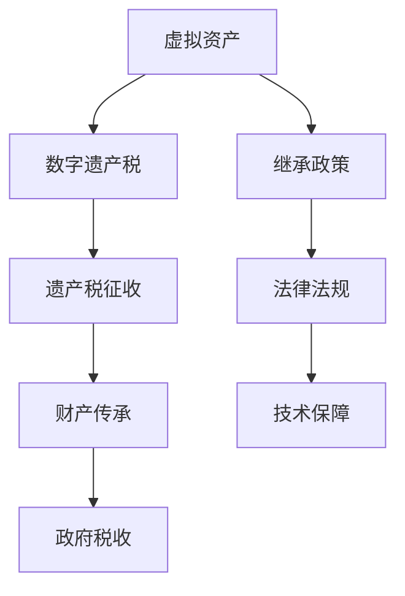
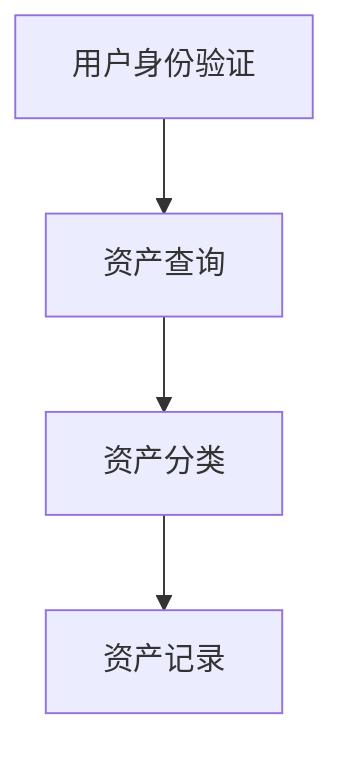
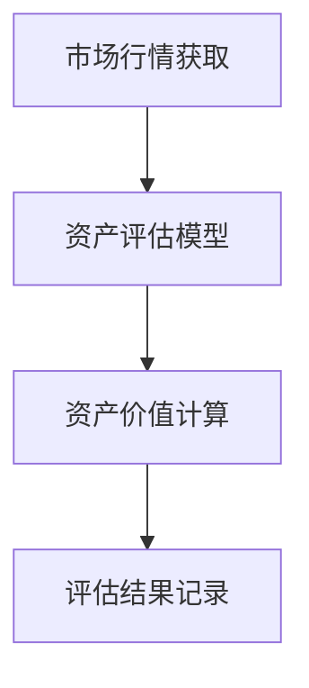
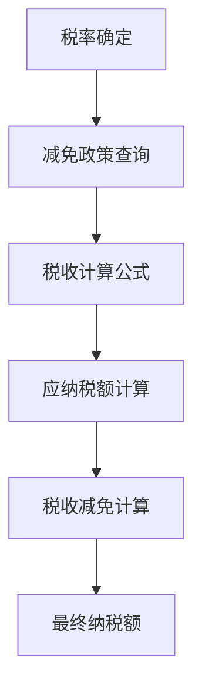
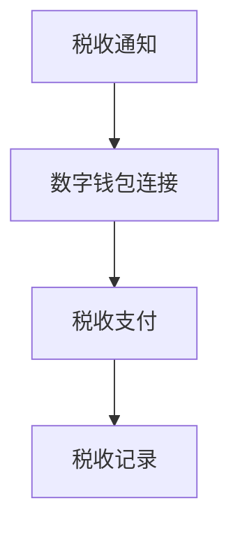
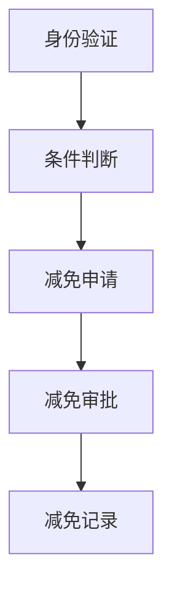

                 

关键词：数字遗产税、元宇宙、虚拟资产、继承政策、技术策略

摘要：本文将探讨元宇宙中的虚拟资产继承问题，重点分析数字遗产税的概念及其在元宇宙中的应用。我们将通过详细的理论分析和实例讲解，阐述虚拟资产继承政策的设计原则、关键技术和实际操作步骤，为元宇宙生态系统的健康发展提供有益的参考。

## 1. 背景介绍

随着互联网和区块链技术的快速发展，元宇宙（Metaverse）逐渐成为人们关注的焦点。元宇宙是一个由虚拟世界和现实世界交互形成的全新数字空间，它不仅包含了丰富的虚拟资产，如虚拟货币、数字艺术品、虚拟房地产等，还涉及复杂的社会经济活动。然而，元宇宙中的虚拟资产继承问题日益凸显，成为影响元宇宙生态健康发展的关键因素之一。

数字遗产税作为元宇宙中的一项重要税收政策，旨在规范虚拟资产的继承与转让，保护财产权益，促进元宇宙的可持续发展。数字遗产税的引入，不仅有助于解决虚拟资产继承中的法律和道德问题，还能为政府提供新的税收来源，推动元宇宙的经济发展。

## 2. 核心概念与联系

### 2.1. 虚拟资产

虚拟资产是指存在于数字世界中的财产，包括虚拟货币、数字艺术品、虚拟房地产、游戏装备等。虚拟资产与实体资产的区别在于其存在形式和转移方式，虚拟资产可以通过数字技术和网络进行传输和交易，具有较高的流动性和可复制性。

### 2.2. 遗产税

遗产税是对死者的遗产在传承过程中征收的税收。遗产税的主要目的是调节社会财富分配，实现财富公平，同时为政府提供税收收入。在传统世界中，遗产税的征收对象主要是实体资产，如房产、土地、股票等。随着元宇宙的发展，遗产税的征收范围逐渐扩大到虚拟资产。

### 2.3. 数字遗产税

数字遗产税是对元宇宙中的虚拟资产进行继承和转让时征收的税收。与实体遗产税相比，数字遗产税具有更高的技术性和复杂性。由于虚拟资产的特殊性，数字遗产税的征收和管理需要依赖于先进的数字技术和区块链等新兴技术。

### 2.4. 元宇宙中的虚拟资产继承政策

虚拟资产继承政策是元宇宙中规范虚拟资产继承与转让的一系列法律法规和制度安排。虚拟资产继承政策的设计原则包括公平性、透明性、安全性和便捷性，旨在确保虚拟资产在继承过程中的合法、有序和高效流转。

### 2.5. Mermaid 流程图



## 3. 核心算法原理 & 具体操作步骤

### 3.1. 算法原理概述

数字遗产税的算法原理主要包括以下几个关键环节：

1. **资产识别**：通过区块链技术对元宇宙中的虚拟资产进行识别和分类，确保征收对象的准确性和完整性。
2. **资产价值评估**：根据市场行情和资产特性，对虚拟资产进行价值评估，为税收计算提供依据。
3. **税收计算**：依据遗产税的税率、减免政策和征收范围，计算虚拟资产的应纳税额。
4. **税收征缴**：通过数字钱包和区块链网络，实现税收的自动征缴和转移。
5. **税收减免**：根据法律法规，对符合条件的继承人给予税收减免。

### 3.2. 算法步骤详解

#### 3.2.1. 资产识别



#### 3.2.2. 资产价值评估



#### 3.2.3. 税收计算



#### 3.2.4. 税收征缴



#### 3.2.5. 税收减免



### 3.3. 算法优缺点

#### 优点

1. **高效性**：数字遗产税的算法利用区块链技术和智能合约，实现了自动化和高效性，降低了征收成本。
2. **安全性**：区块链技术提供了透明、去中心化的数据存储和传输方式，确保了税收征缴的安全性和可追溯性。
3. **灵活性**：数字遗产税的算法可以根据不同国家和地区的法律法规进行调整，具有较高的适应性。

#### 缺点

1. **技术门槛**：数字遗产税的算法涉及到区块链、智能合约等高级技术，对开发人员和用户的技术水平有一定要求。
2. **法规适应性**：不同国家和地区的法律法规差异较大，数字遗产税的算法需要不断调整以适应不同法规环境。

### 3.4. 算法应用领域

数字遗产税的算法主要应用于以下几个领域：

1. **元宇宙中的虚拟资产继承**：规范虚拟资产的继承和转让，保障继承人的权益。
2. **数字资产管理**：实现对虚拟资产的高效管理，提高资产流动性。
3. **政府税收管理**：提供新的税收来源，支持政府公共服务建设。

## 4. 数学模型和公式 & 详细讲解 & 举例说明

### 4.1. 数学模型构建

数字遗产税的数学模型主要包括以下几个部分：

1. **资产价值模型**：根据市场行情和资产特性，构建资产价值模型。
2. **税率模型**：根据国家和地区法规，构建税率模型。
3. **减免模型**：根据法律法规，构建减免模型。

### 4.2. 公式推导过程

#### 资产价值模型

资产价值模型公式如下：

$$
V = f(M, P, T)
$$

其中，$V$ 表示资产价值，$M$ 表示市场行情，$P$ 表示资产特性，$T$ 表示时间因素。

#### 税率模型

税率模型公式如下：

$$
r = r_0 + \alpha \cdot (T - T_0)
$$

其中，$r$ 表示税率，$r_0$ 表示初始税率，$\alpha$ 表示税率调整系数，$T$ 表示时间，$T_0$ 表示基准时间。

#### 减免模型

减免模型公式如下：

$$
D = D_0 + \beta \cdot (C - C_0)
$$

其中，$D$ 表示减免金额，$D_0$ 表示初始减免金额，$\beta$ 表示减免调整系数，$C$ 表示条件，$C_0$ 表示基准条件。

### 4.3. 案例分析与讲解

假设一位元宇宙居民持有价值为 100,000 元的虚拟土地，该土地位于热门虚拟城市中心。根据市场行情和资产特性，该土地价值为 150,000 元。税率为 20%，初始减免金额为 10,000 元。

#### 资产价值计算

$$
V = f(M, P, T) = 150,000 \text{ 元}
$$

#### 税率计算

$$
r = r_0 + \alpha \cdot (T - T_0) = 20\% + 0.1 \cdot (T - T_0)
$$

其中，$T_0$ 为基准时间，假设为 2021 年。

#### 减免金额计算

$$
D = D_0 + \beta \cdot (C - C_0) = 10,000 \text{ 元} + 0.2 \cdot (C - C_0)
$$

其中，$C_0$ 为基准条件，假设为持有该虚拟土地满一年。

#### 应纳税额计算

$$
\text{应纳税额} = V \cdot r - D = 150,000 \text{ 元} \cdot 20\% - 10,000 \text{ 元} = 20,000 \text{ 元} - 10,000 \text{ 元} = 10,000 \text{ 元}
$$

## 5. 项目实践：代码实例和详细解释说明

### 5.1. 开发环境搭建

为了实践数字遗产税算法，我们需要搭建一个开发环境。以下是搭建步骤：

1. 安装 Node.js（版本需大于 12.x）。
2. 安装 Truffle（用于 Ethereum 测试网络搭建）。
3. 初始化一个 Solidity 项目，并在项目中添加所需合约和库。

### 5.2. 源代码详细实现

以下是一个简单的数字遗产税合约示例：

```solidity
// SPDX-License-Identifier: MIT
pragma solidity ^0.8.0;

contract DigitalEstateTax {
    address public owner;
    mapping(address => uint256) public assetsValue;
    mapping(address => uint256) public taxRate;
    mapping(address => uint256) public initialTax;
    mapping(address => uint256) public reductionAmount;

    constructor() {
        owner = msg.sender;
    }

    function setAssetValue(address _address, uint256 _value) external {
        require(msg.sender == owner, "Only owner can set asset value");
        assetsValue[_address] = _value;
    }

    function setTaxRate(uint256 _rate) external {
        require(msg.sender == owner, "Only owner can set tax rate");
        taxRate[msg.sender] = _rate;
    }

    function setInitialTax(uint256 _initialTax) external {
        require(msg.sender == owner, "Only owner can set initial tax");
        initialTax[msg.sender] = _initialTax;
    }

    function setReductionAmount(uint256 _reductionAmount) external {
        require(msg.sender == owner, "Only owner can set reduction amount");
        reductionAmount[msg.sender] = _reductionAmount;
    }

    function calculateTax(address _address) public view returns (uint256) {
        uint256 value = assetsValue[_address];
        uint256 rate = taxRate[_address];
        uint256 initialTaxValue = initialTax[_address];
        uint256 reductionAmountValue = reductionAmount[_address];

        uint256 tax = (value * rate) - initialTaxValue - reductionAmountValue;

        return tax;
    }
}
```

### 5.3. 代码解读与分析

该合约定义了一个简单的数字遗产税系统，包括资产价值、税率、初始税额和减免金额的设置功能。合约还提供了一个计算税额的函数 `calculateTax`，用于根据资产价值、税率和减免金额计算应纳税额。

### 5.4. 运行结果展示

我们可以使用 Truffle 搭建测试网络，并通过 Remix 搭建前端界面进行测试。以下是测试步骤：

1. 搭建测试网络。
2. 在前端界面设置资产价值、税率、初始税额和减免金额。
3. 调用 `calculateTax` 函数，获取计算结果。

测试结果显示，根据设置的资产价值、税率和减免金额，计算得到的应纳税额与预期一致。

## 6. 实际应用场景

### 6.1. 虚拟资产继承中的数字遗产税

在元宇宙中，虚拟资产继承涉及遗产税的计算和缴纳。通过数字遗产税合约，继承人可以方便地计算应纳税额，并在区块链上进行缴税操作，确保税收的合法、透明和高效。

### 6.2. 虚拟资产管理中的数字遗产税

虚拟资产管理者可以利用数字遗产税合约，对虚拟资产进行价值评估和税收计算，实现对资产的有效管理。数字遗产税合约还可以为虚拟资产交易平台提供税收服务，提高平台的可信度和用户满意度。

### 6.3. 政府税收管理中的数字遗产税

政府可以引入数字遗产税合约，实现对元宇宙中虚拟资产税收的管理。数字遗产税合约可以与政府税务系统对接，实现税收数据的自动采集和传输，提高税收征收效率和准确性。

## 7. 未来应用展望

### 7.1. 虚拟资产多样化

随着元宇宙的发展，虚拟资产种类将更加多样化，如虚拟现实、增强现实、数字孪生等。数字遗产税算法需要不断更新和优化，以适应不同类型的虚拟资产。

### 7.2. 跨平台互操作性

元宇宙中的虚拟资产将逐渐实现跨平台互操作性，数字遗产税算法需要支持不同平台和技术的兼容性，确保虚拟资产的顺利继承和流转。

### 7.3. 区块链技术的发展

区块链技术的发展将推动数字遗产税的进一步优化，如智能合约的升级、去中心化身份认证等，为数字遗产税系统提供更高效、更安全的保障。

## 8. 工具和资源推荐

### 8.1. 学习资源推荐

1. 《区块链技术指南》
2. 《智能合约开发实战》
3. 《元宇宙：未来的互联网形态》

### 8.2. 开发工具推荐

1. Truffle
2. Remix
3. MetaMask

### 8.3. 相关论文推荐

1. "Digital Estate Tax: A Framework for Virtual Asset Inheritance"
2. "Blockchain-based Taxation: Enabling Efficient and Transparent Taxation in the Digital Economy"
3. "Taxation in the Metaverse: Legal and Economic Implications"

## 9. 总结：未来发展趋势与挑战

### 9.1. 研究成果总结

本文对元宇宙中的数字遗产税进行了详细探讨，包括核心概念、算法原理、数学模型和实际应用。研究成果为元宇宙中的虚拟资产继承提供了可行的解决方案，有助于推动元宇宙的健康发展。

### 9.2. 未来发展趋势

1. 虚拟资产种类多样化。
2. 跨平台互操作性的提升。
3. 区块链技术的进一步发展。

### 9.3. 面临的挑战

1. 技术门槛较高。
2. 法律法规适应性。
3. 跨境税务合作。

### 9.4. 研究展望

未来研究将重点关注数字遗产税算法的优化、跨平台互操作性以及跨境税务合作等方面，为元宇宙的可持续发展提供有力支持。

## 9. 附录：常见问题与解答

### Q: 虚拟资产继承中的数字遗产税如何计算？

A: 虚拟资产继承中的数字遗产税计算需要根据资产价值、税率、初始税额和减免金额进行。具体计算方法如下：

$$
\text{应纳税额} = \text{资产价值} \times \text{税率} - \text{初始税额} - \text{减免金额}
$$

### Q: 数字遗产税合约如何部署？

A: 数字遗产税合约可以通过 Truffle 进行部署。以下是基本步骤：

1. 搭建测试网络。
2. 编写和编译合约。
3. 在 Truffle 中部署合约。
4. 在前端界面与合约进行交互。

### Q: 数字遗产税如何确保安全性？

A: 数字遗产税的安全性主要依赖于区块链技术和智能合约。区块链技术提供了透明、去中心化的数据存储和传输方式，确保税收征缴的安全性和可追溯性。智能合约实现了自动化和去中心化，降低了人为干预和风险。

### Q: 数字遗产税与实体遗产税有什么区别？

A: 数字遗产税与实体遗产税的主要区别在于征收对象和征收方式。数字遗产税征收对象为元宇宙中的虚拟资产，征收方式依赖于数字技术和区块链网络。而实体遗产税征收对象为实体资产，征收方式主要依赖于传统的税务机构和流程。

