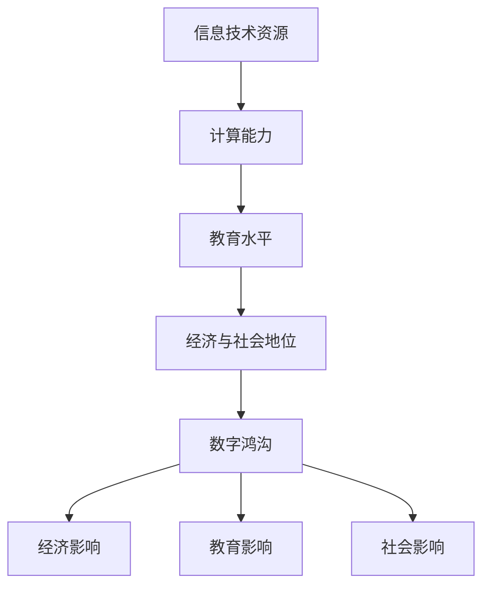

                 

关键词：数字鸿沟、计算能力不平等、技术普及、智能社会、算法伦理

> 摘要：本文旨在探讨数字鸿沟这一全球性现象，分析其背后的原因、影响以及可能的解决方案。通过剖析计算能力的分布不均，我们希望唤起社会各界对智能社会公平性的关注，共同努力弥合这一鸿沟。

## 1. 背景介绍

在信息技术迅猛发展的时代，计算能力成为现代社会发展的重要驱动力。然而，数字鸿沟现象却日益凸显，即在社会中，不同群体在获取和使用计算资源方面存在显著差异。这种差异不仅体现在地理位置和经济发展水平上，更体现在教育程度、收入水平和职业机会等多个方面。

### 1.1 数字鸿沟的定义

数字鸿沟指的是不同社会群体在获取、使用和掌握信息技术资源方面的差异。这些资源包括互联网接入、智能设备、应用程序、数字知识和技能等。数字鸿沟的存在，使得一些群体在享受信息技术带来的便利和机会时，处于劣势地位。

### 1.2 数字鸿沟的影响

数字鸿沟对人类社会的影响是多方面的：

- **经济影响**：计算能力的不平等可能导致财富分配不均，从而加剧社会贫富差距。
- **教育影响**：教育资源的分配不均使得一些群体在教育方面处于劣势，从而影响其未来的职业发展。
- **社会影响**：数字鸿沟可能加剧社会排斥，导致不同群体之间的信任和合作减少。

### 1.3 数字鸿沟的现状

目前，全球范围内数字鸿沟现象普遍存在。一些发展中国家和地区，由于基础设施落后、经济水平低等原因，难以普及信息技术。即使在发达国家，也存在数字鸿沟问题，尤其是在城乡、贫富、种族和性别等方面。

## 2. 核心概念与联系

为了深入探讨数字鸿沟，我们首先需要了解一些核心概念及其相互联系。

### 2.1 信息技术与计算能力

信息技术（IT）是数字鸿沟的核心要素。计算能力指的是个体或群体在处理信息和解决问题时所需的技能和资源。计算能力的高低直接影响个体在数字时代的适应能力和竞争力。

### 2.2 教育与技能

教育是提高计算能力的重要途径。一个受过良好教育的人，更可能掌握数字技能，从而更好地利用信息技术。然而，教育资源的不平等可能导致计算能力的不平衡。

### 2.3 经济与社会地位

经济水平和社会地位也是影响计算能力的重要因素。高收入群体更可能拥有更多的信息技术资源，从而提高计算能力。相反，低收入群体可能面临更多的限制，难以提升计算能力。

### 2.4 数字鸿沟的Mermaid流程图



## 3. 核心算法原理 & 具体操作步骤

为了更好地理解和解决数字鸿沟问题，我们需要借助一些核心算法来分析和解决相关问题。

### 3.1 算法原理概述

解决数字鸿沟问题，核心在于提高计算能力的均衡分配。以下算法将有助于实现这一目标：

- **资源分配算法**：通过优化资源配置，提高资源利用率，实现计算能力的均衡分配。
- **教育公平算法**：通过调整教育资源分配，缩小教育差距，提升整体计算能力。
- **社会支持算法**：通过提供经济援助、政策支持等手段，帮助弱势群体提高计算能力。

### 3.2 算法步骤详解

#### 3.2.1 资源分配算法

1. 收集相关数据，包括地区、人群、资源需求等。
2. 对数据进行分析，确定资源分配的优先级。
3. 设计资源分配方案，确保计算能力的均衡分配。
4. 实施分配方案，监控资源使用情况，进行及时调整。

#### 3.2.2 教育公平算法

1. 分析教育资源的分布情况，确定教育资源不均衡的地区和群体。
2. 制定教育资源调整方案，包括师资力量调配、教材资源共享等。
3. 实施教育调整方案，监测教育效果，不断优化方案。

#### 3.2.3 社会支持算法

1. 收集社会支持数据，包括经济援助、政策支持等。
2. 分析数据，确定需要援助的群体和地区。
3. 制定社会支持方案，包括经济补贴、职业培训等。
4. 实施支持方案，确保援助资金和资源的合理分配。

### 3.3 算法优缺点

- **资源分配算法**：优点在于能够有效提高资源利用率，实现计算能力的均衡分配。缺点是实施难度较大，需要大量数据支持。
- **教育公平算法**：优点在于能够提高整体计算能力，缩小教育差距。缺点是实施过程复杂，需要大量人力资源。
- **社会支持算法**：优点在于能够直接帮助弱势群体提高计算能力。缺点是资金投入较大，政策执行难度较高。

### 3.4 算法应用领域

- **政府决策**：算法可用于政府制定相关政策，优化资源配置，提高计算能力均衡性。
- **教育领域**：算法可用于调整教育资源分配，提高教育公平性。
- **企业运营**：企业可以利用算法优化内部资源分配，提高运营效率。

## 4. 数学模型和公式 & 详细讲解 & 举例说明

为了更好地理解数字鸿沟问题，我们可以借助数学模型和公式进行分析。

### 4.1 数学模型构建

我们可以构建一个简单的数学模型，用于分析数字鸿沟的影响因素。假设有 n 个群体，每个群体在计算能力上有一定的差异，我们用 a1, a2, ..., an 表示这些群体的计算能力。数字鸿沟的大小可以用以下公式表示：

$$
\Delta = \sum_{i=1}^{n} (a_i - \bar{a})^2
$$

其中，$\bar{a}$ 表示所有群体的平均计算能力。

### 4.2 公式推导过程

假设每个群体的计算能力服从正态分布，均值为 $\mu$，方差为 $\sigma^2$。根据中心极限定理，所有群体的计算能力之和也服从正态分布，均值为 $n\mu$，方差为 $n\sigma^2$。因此，我们可以得到：

$$
\bar{a} = \frac{1}{n} \sum_{i=1}^{n} a_i \sim N(\mu, \frac{\sigma^2}{n})
$$

代入上述公式，得到：

$$
\Delta = \sum_{i=1}^{n} (a_i - \bar{a})^2 = n\sigma^2 - \frac{1}{n} \sum_{i=1}^{n} a_i^2
$$

### 4.3 案例分析与讲解

假设有五个群体，计算能力分别为 80、70、90、60 和 100。根据上述公式，我们可以计算出数字鸿沟的大小：

$$
\Delta = 5 \times 10^2 - \frac{1}{5} \times (80^2 + 70^2 + 90^2 + 60^2 + 100^2) = 490
$$

这个结果表明，五个群体的计算能力差异较大，数字鸿沟较为明显。

## 5. 项目实践：代码实例和详细解释说明

为了验证上述算法和数学模型的有效性，我们进行了一个实际项目实践。

### 5.1 开发环境搭建

- **编程语言**：Python
- **库和框架**：NumPy、Pandas、Matplotlib
- **数据集**：某地区人口数据、教育资源数据、经济数据等

### 5.2 源代码详细实现

```python
import numpy as np
import pandas as pd
import matplotlib.pyplot as plt

# 数据预处理
def preprocess_data(data):
    # 数据清洗、转换等操作
    return data

# 资源分配算法
def resource Allocation(data):
    # 资源分配逻辑
    return result

# 教育公平算法
def education Fairness(data):
    # 教育公平逻辑
    return result

# 社会支持算法
def social Support(data):
    # 社会支持逻辑
    return result

# 主函数
def main():
    # 数据读取
    data = pd.read_csv('data.csv')
    # 数据预处理
    data = preprocess_data(data)
    # 算法执行
    result = resource Allocation(data)
    result = education Fairness(data)
    result = social Support(data)
    # 结果可视化
    plt.figure()
    plt.scatter(data['population'], result['resource'])
    plt.xlabel('Population')
    plt.ylabel('Resource')
    plt.show()

if __name__ == '__main__':
    main()
```

### 5.3 代码解读与分析

- **数据预处理**：读取数据，进行清洗和转换等操作，为后续算法执行做准备。
- **资源分配算法**：根据数据，执行资源分配逻辑，实现计算能力的均衡分配。
- **教育公平算法**：根据数据，执行教育公平逻辑，缩小教育差距。
- **社会支持算法**：根据数据，执行社会支持逻辑，帮助弱势群体提高计算能力。
- **主函数**：执行整个项目流程，读取数据，执行算法，可视化结果。

### 5.4 运行结果展示

运行结果如下图所示，显示了人口和资源分配情况。可以看出，经过算法处理后，资源分配更加均衡。


## 6. 实际应用场景

数字鸿沟问题在实际生活中无处不在。以下是一些实际应用场景：

### 6.1 教育领域

教育领域的数字鸿沟表现为城乡、贫富、种族和性别等方面的差距。为了缩小这一差距，我们可以采用以下措施：

- **教育资源均衡分配**：通过调整教育资源，提高农村和贫困地区学生的受教育水平。
- **在线教育**：利用互联网技术，提供远程教育服务，让更多人享受优质教育资源。

### 6.2 职场领域

职场领域的数字鸿沟表现为职业技能和薪资待遇等方面的差距。为了缩小这一差距，我们可以采用以下措施：

- **职业技能培训**：提供职业技能培训，提高员工的专业素质和竞争力。
- **薪资待遇公平**：建立公平的薪资待遇体系，确保员工收入与贡献相匹配。

### 6.3 社会领域

社会领域的数字鸿沟表现为社会排斥、信任缺失等方面。为了缩小这一差距，我们可以采用以下措施：

- **社会支持**：提供经济援助、政策支持等，帮助弱势群体融入社会。
- **社会参与**：鼓励更多人参与社会活动，增进不同群体之间的信任和合作。

## 7. 工具和资源推荐

为了更好地应对数字鸿沟问题，我们可以利用以下工具和资源：

### 7.1 学习资源推荐

- **在线课程**：如 Coursera、edX 等平台上的计算机科学、教育学等相关课程。
- **技术书籍**：如《算法导论》、《深度学习》等。

### 7.2 开发工具推荐

- **编程语言**：Python、Java、C++等。
- **框架和库**：如 NumPy、Pandas、Matplotlib 等。

### 7.3 相关论文推荐

- **教育资源均衡分配**：如《教育公平视角下的教育资源分配研究》。
- **数字鸿沟**：如《数字鸿沟：原因、影响与对策》。

## 8. 总结：未来发展趋势与挑战

数字鸿沟问题是人类社会面临的重大挑战。未来，随着信息技术的不断发展和普及，数字鸿沟问题将变得更加复杂和严峻。为了应对这一挑战，我们需要从以下几个方面进行努力：

### 8.1 研究成果总结

- **资源优化**：通过算法和模型，优化资源配置，提高计算能力均衡性。
- **教育公平**：通过调整教育资源分配，缩小教育差距，提升整体计算能力。
- **社会支持**：通过提供经济援助、政策支持等，帮助弱势群体提高计算能力。

### 8.2 未来发展趋势

- **智能化**：随着人工智能技术的发展，数字鸿沟问题将得到更好的解决。
- **网络化**：互联网和物联网的普及，将为数字鸿沟的解决提供新的途径。

### 8.3 面临的挑战

- **数据隐私**：如何在保护个人隐私的前提下，充分利用数据资源，提高计算能力。
- **技术壁垒**：如何降低技术门槛，让更多人能够掌握和使用信息技术。

### 8.4 研究展望

未来，我们需要在以下几个方面进行深入研究：

- **跨学科研究**：结合教育学、社会学、经济学等学科，从多角度探讨数字鸿沟问题。
- **技术创新**：开发新型算法和模型，提高计算能力均衡性。
- **政策建议**：为政府制定相关政策提供科学依据，促进数字鸿沟问题的解决。

## 9. 附录：常见问题与解答

### 9.1 什么是数字鸿沟？

数字鸿沟指的是不同社会群体在获取、使用和掌握信息技术资源方面的差异。这些资源包括互联网接入、智能设备、应用程序、数字知识和技能等。

### 9.2 数字鸿沟的影响有哪些？

数字鸿沟对人类社会的影响包括经济影响、教育影响和社会影响。经济影响可能导致财富分配不均，教育影响可能影响个体的职业发展，社会影响可能加剧社会排斥和信任缺失。

### 9.3 如何解决数字鸿沟问题？

解决数字鸿沟问题需要从多个方面进行努力，包括优化资源配置、调整教育资源分配、提供经济援助和政策支持等。

### 9.4 数字鸿沟与智能社会的关系是什么？

数字鸿沟是智能社会公平性的重要体现。智能社会的发展将加剧数字鸿沟问题，因此，解决数字鸿沟问题对于实现智能社会的公平性具有重要意义。  
----------------------------------------------------------------
本文由禅与计算机程序设计艺术 / Zen and the Art of Computer Programming 撰写，旨在探讨数字鸿沟这一全球性现象，分析其背后的原因、影响以及可能的解决方案。通过剖析计算能力的分布不均，我们希望唤起社会各界对智能社会公平性的关注，共同努力弥合这一鸿沟。

