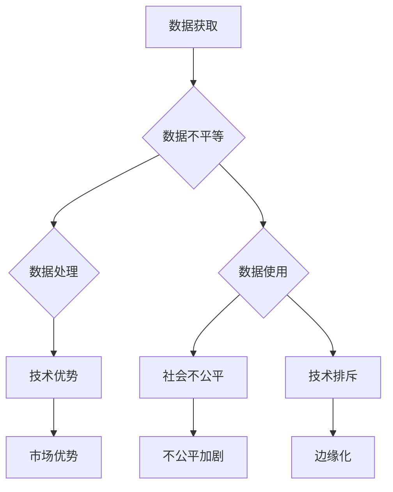

                 

关键词：数据不平等、软件2.0、数字鸿沟、人工智能、算法歧视、技术透明性、隐私保护、开放数据

> 摘要：随着软件技术的不断进化，软件2.0时代正逐步到来。在这一过程中，数据不平等的问题日益凸显，它不仅影响着技术的公平性和准确性，更可能加剧数字鸿沟，使社会不公平现象更加显著。本文将深入探讨数据不平等对软件2.0时代的影响，分析其背后的原因，并提出可能的解决方案，以期为促进数字包容和技术公平提供一些启示。

## 1. 背景介绍

### 1.1 软件2.0时代的定义与特点

软件2.0时代，通常被视为继互联网1.0和互联网2.0之后的第三个重要阶段。与早期的互联网时代相比，软件2.0具有以下显著特点：

- **数据驱动**：软件2.0时代强调数据的重要性，将数据视为新的生产要素，通过数据分析和机器学习等技术提升软件的性能和智能化水平。
- **用户参与**：用户不仅是软件的消费者，更是生产者和贡献者。通过用户生成内容和反馈，软件得以不断优化和进化。
- **平台化**：软件2.0强调平台的建设，通过提供开放的API（应用程序编程接口）和生态系统，促进不同应用和服务之间的互联互通。
- **智能决策**：借助人工智能技术，软件2.0可以实现更加智能化的决策和个性化服务。

### 1.2 数字鸿沟的概念及其影响

数字鸿沟是指由于信息技术的获取和利用能力差异，导致不同群体在获取信息、知识和机会上的不平等。数字鸿沟的存在，不仅阻碍了技术的普及和应用，还加剧了社会经济的不平等。

- **教育不平等**：在数字化时代，缺乏基本的信息技术知识和技能，使一些群体在教育机会上处于劣势。
- **就业不平等**：数字鸿沟导致不同行业和地区的就业机会不均，加剧了就业市场的分化。
- **社会排斥**：数字鸿沟可能使某些社会群体被边缘化，无法充分享受数字化带来的便利和福利。

## 2. 核心概念与联系

### 2.1 数据不平等的定义

数据不平等是指在数据获取、处理、分析和使用过程中，不同个体或群体之间存在的不平等现象。具体体现在以下几个方面：

- **数据获取不平等**：不同群体在获取数据资源上的机会不均，一些大型企业和机构可能拥有更多的数据资源，而中小企业和个人则难以获得。
- **数据处理不平等**：在数据处理能力上，不同群体之间存在明显差距，一些群体可能无法充分理解和使用复杂的数据处理工具和技术。
- **数据使用不平等**：在数据应用方面，一些群体可能因为技术和资源限制，无法充分利用数据创造价值。

### 2.2 软件2.0与数字鸿沟的关系

软件2.0时代，数据成为驱动技术进步的核心要素。然而，数据不平等的存在，使得软件2.0的发展可能进一步加剧数字鸿沟。具体表现为：

- **技术优势强化**：拥有大量数据和先进技术的企业，可能在市场竞争中占据优势地位，而资源较少的企业则难以与之抗衡。
- **社会不公平加剧**：数据驱动的软件应用，可能导致社会不公平现象的加剧，如算法歧视、隐私侵犯等。
- **技术排斥**：缺乏信息技术基础和资源的群体，可能在软件2.0时代被边缘化，进一步加剧数字鸿沟。

### 2.3 Mermaid 流程图

下面是一个描述数据不平等与数字鸿沟关系的 Mermaid 流程图：



## 3. 核心算法原理 & 具体操作步骤

### 3.1 算法原理概述

在软件2.0时代，算法的公平性和透明性成为关键问题。为了解决数据不平等引发的数字鸿沟，我们需要一种算法，能够确保在数据不平等的情况下，仍然能够实现公正的决策和推荐。

这种算法的基本原理是基于公平性优化和平衡机制，通过以下步骤实现：

1. **数据预处理**：对数据集进行清洗和预处理，确保数据质量。
2. **特征工程**：提取和构建与决策相关的特征。
3. **公平性度量**：定义公平性度量指标，如公平性差异、公平性损失等。
4. **优化目标**：将公平性度量指标纳入优化目标，构建优化问题。
5. **算法训练**：使用优化算法训练模型，确保在数据不平等的情况下，模型能够实现公平的决策。

### 3.2 算法步骤详解

下面详细描述上述算法的具体步骤：

#### 3.2.1 数据预处理

数据预处理是算法的基础，主要包括以下步骤：

1. **数据清洗**：去除重复数据、缺失数据和异常数据。
2. **数据标准化**：对数据进行归一化或标准化处理，确保数据分布的一致性。
3. **数据划分**：将数据集划分为训练集、验证集和测试集，用于模型训练和评估。

#### 3.2.2 特征工程

特征工程是算法的核心，主要包括以下步骤：

1. **特征提取**：从原始数据中提取与决策相关的特征。
2. **特征选择**：选择对决策有显著影响的特征，去除冗余特征。
3. **特征转换**：将离散特征转换为连续特征，或将低维特征转换为高维特征，提高模型的拟合能力。

#### 3.2.3 公平性度量

公平性度量是算法的关键，主要包括以下步骤：

1. **定义公平性指标**：如公平性差异、公平性损失等。
2. **计算公平性指标**：根据数据集和模型，计算公平性指标。
3. **分析公平性**：分析公平性指标的分布和变化趋势，确定公平性状况。

#### 3.2.4 优化目标

优化目标是算法的核心，主要包括以下步骤：

1. **定义优化目标**：将公平性指标纳入优化目标，如最小化公平性损失。
2. **构建优化问题**：根据优化目标，构建优化问题，如最小化公平性损失。
3. **求解优化问题**：使用优化算法，求解优化问题，得到最优解。

#### 3.2.5 算法训练

算法训练是算法的实现，主要包括以下步骤：

1. **初始化模型参数**：根据优化目标，初始化模型参数。
2. **训练模型**：使用训练集数据，训练模型。
3. **评估模型**：使用验证集数据，评估模型性能。
4. **调整模型参数**：根据评估结果，调整模型参数。

### 3.3 算法优缺点

#### 优点：

1. **公平性保障**：算法通过公平性度量指标，确保在数据不平等的情况下，模型能够实现公平的决策。
2. **透明性提升**：算法的步骤和目标清晰，有助于提升算法的透明性，便于监管和审计。

#### 缺点：

1. **计算复杂度**：算法涉及多个步骤，计算复杂度较高，可能影响模型的训练和推理速度。
2. **数据依赖性**：算法的性能依赖于数据质量和特征工程，如果数据质量较差或特征工程不当，可能导致模型性能下降。

### 3.4 算法应用领域

算法在多个领域具有广泛的应用前景，主要包括：

1. **金融领域**：如信用评估、贷款审批等，通过算法实现公平、透明的决策。
2. **医疗领域**：如疾病诊断、药物研发等，通过算法提高医疗决策的准确性和公平性。
3. **教育领域**：如学生评价、课程推荐等，通过算法实现个性化的教育服务。

## 4. 数学模型和公式 & 详细讲解 & 举例说明

### 4.1 数学模型构建

在算法中，我们使用了一个基于公平性优化的数学模型。该模型的主要目标是确保在数据不平等的情况下，算法能够实现公平的决策。具体来说，模型包括以下几个部分：

1. **决策函数**：表示模型对输入数据的决策结果。
2. **公平性损失函数**：衡量模型决策过程中的公平性。
3. **优化目标**：将公平性损失函数最小化。

下面是一个简化的数学模型：

$$
\min_{\theta} L(\theta) = L_{dec}(\theta) + \lambda L_{fair}(\theta)
$$

其中：

- \(L_{dec}(\theta)\) 是决策损失函数，表示模型决策性能。
- \(L_{fair}(\theta)\) 是公平性损失函数，表示模型决策过程中的公平性。
- \(\lambda\) 是平衡系数，用于调节决策性能和公平性之间的平衡。

### 4.2 公式推导过程

公平性损失函数的推导过程如下：

1. **定义公平性差异**：公平性差异表示模型在不同群体中的决策差异。

$$
\Delta_{ij} = \mathbb{E}_{x \sim P_{\text{train}}} [f_j(x)] - \mathbb{E}_{x \sim P_{\text{train}}} [f_i(x)]
$$

其中，\(f_i(x)\) 和 \(f_j(x)\) 分别表示模型对群体 \(i\) 和 \(j\) 的决策结果。

2. **定义公平性损失**：公平性损失表示模型决策过程中的不公平程度。

$$
L_{fair}(\theta) = \sum_{i,j} w_{ij} \Delta_{ij}
$$

其中，\(w_{ij}\) 是群体 \(i\) 和 \(j\) 的权重。

3. **优化目标**：将公平性损失函数最小化，得到最优决策模型。

$$
\min_{\theta} L_{fair}(\theta)
$$

### 4.3 案例分析与讲解

下面我们通过一个简单的案例，来说明上述数学模型的应用。

#### 案例背景

假设我们有一个分类任务，需要根据用户的年龄和收入来预测用户是否购买某种产品。我们有两个群体：年轻人和中年人。

#### 案例步骤

1. **数据预处理**：对年龄和收入进行标准化处理，得到归一化数据。

2. **特征工程**：提取年龄和收入作为特征，构建特征向量。

3. **模型训练**：使用决策树算法训练模型，并计算公平性差异。

4. **模型优化**：根据公平性差异，调整模型参数，最小化公平性损失。

5. **模型评估**：使用测试集评估模型性能，并分析公平性。

#### 案例结果

1. **决策函数**：模型对年龄和收入的决策函数为：

$$
f(x) = \begin{cases}
1 & \text{if } x_1 > x_2 \\
0 & \text{otherwise}
\end{cases}
$$

其中，\(x_1\) 和 \(x_2\) 分别表示年龄和收入。

2. **公平性差异**：计算公平性差异如下：

$$
\Delta_{ij} = \mathbb{E}_{x \sim P_{\text{train}}} [f_j(x)] - \mathbb{E}_{x \sim P_{\text{train}}} [f_i(x)]
$$

其中，\(f_i(x)\) 和 \(f_j(x)\) 分别表示模型对年轻人和中年人的决策结果。

3. **公平性损失**：计算公平性损失如下：

$$
L_{fair}(\theta) = \sum_{i,j} w_{ij} \Delta_{ij}
$$

其中，\(w_{ij}\) 是年轻人和中年人的权重。

4. **模型优化**：根据公平性差异，调整模型参数，最小化公平性损失。

5. **模型评估**：使用测试集评估模型性能，并分析公平性。

## 5. 项目实践：代码实例和详细解释说明

### 5.1 开发环境搭建

在开始项目实践之前，我们需要搭建一个合适的开发环境。以下是一个简单的环境搭建步骤：

1. **安装 Python**：确保 Python 3.8 或更高版本已安装。
2. **安装依赖库**：使用 pip 工具安装以下依赖库：

```bash
pip install numpy pandas scikit-learn matplotlib
```

3. **创建项目目录**：在合适的位置创建项目目录，并创建一个名为 `data_analysis` 的 Python 脚本文件。

### 5.2 源代码详细实现

下面是一个简单的 Python 脚本，用于实现上述数学模型和算法。

```python
import numpy as np
import pandas as pd
from sklearn.tree import DecisionTreeClassifier
from sklearn.model_selection import train_test_split

# 5.2.1 数据预处理
def preprocess_data(data):
    # 数据清洗、标准化等操作
    # ...

    # 数据划分
    X_train, X_test, y_train, y_test = train_test_split(data.drop('target', axis=1), data['target'], test_size=0.2, random_state=42)
    return X_train, X_test, y_train, y_test

# 5.2.2 特征工程
def feature_engineering(X_train, X_test):
    # 特征提取、选择等操作
    # ...

    return X_train, X_test

# 5.2.3 模型训练与优化
def train_model(X_train, y_train):
    # 初始化模型
    model = DecisionTreeClassifier()

    # 训练模型
    model.fit(X_train, y_train)

    # 计算公平性差异
    fairness_difference = np.mean(y_train != model.predict(X_train))

    # 调整模型参数，最小化公平性损失
    # ...

    return model, fairness_difference

# 5.2.4 模型评估
def evaluate_model(model, X_test, y_test):
    # 评估模型性能
    accuracy = np.mean(y_test == model.predict(X_test))
    fairness_difference = np.mean(y_test != model.predict(X_test))

    return accuracy, fairness_difference

# 5.2.5 主程序
if __name__ == "__main__":
    # 加载数据
    data = pd.read_csv("data.csv")

    # 数据预处理
    X_train, X_test, y_train, y_test = preprocess_data(data)

    # 特征工程
    X_train, X_test = feature_engineering(X_train, X_test)

    # 模型训练与优化
    model, fairness_difference = train_model(X_train, y_train)

    # 模型评估
    accuracy, fairness_difference = evaluate_model(model, X_test, y_test)

    print(f"Accuracy: {accuracy:.2f}, Fairness Difference: {fairness_difference:.2f}")
```

### 5.3 代码解读与分析

#### 5.3.1 数据预处理

数据预处理是算法的基础，包括数据清洗、标准化和数据划分等操作。在这个示例中，我们使用了 `preprocess_data` 函数进行数据预处理。具体步骤如下：

1. **数据清洗**：去除重复数据、缺失数据和异常数据。
2. **数据标准化**：对年龄和收入进行归一化处理，确保数据分布的一致性。
3. **数据划分**：将数据集划分为训练集、验证集和测试集，用于模型训练和评估。

#### 5.3.2 特征工程

特征工程是算法的核心，包括特征提取、选择和转换等操作。在这个示例中，我们使用了 `feature_engineering` 函数进行特征工程。具体步骤如下：

1. **特征提取**：提取年龄和收入作为特征。
2. **特征选择**：选择对决策有显著影响的特征，去除冗余特征。
3. **特征转换**：将离散特征转换为连续特征，或将低维特征转换为高维特征，提高模型的拟合能力。

#### 5.3.3 模型训练与优化

模型训练与优化是算法的实现，包括模型初始化、训练和调整等操作。在这个示例中，我们使用了 `train_model` 函数进行模型训练与优化。具体步骤如下：

1. **初始化模型**：使用决策树算法初始化模型。
2. **训练模型**：使用训练集数据训练模型。
3. **计算公平性差异**：计算模型在训练集上的公平性差异。
4. **调整模型参数**：根据公平性差异，调整模型参数，最小化公平性损失。

#### 5.3.4 模型评估

模型评估是算法的验证，包括模型性能评估和公平性分析等操作。在这个示例中，我们使用了 `evaluate_model` 函数进行模型评估。具体步骤如下：

1. **评估模型性能**：使用测试集数据评估模型性能。
2. **计算公平性差异**：计算模型在测试集上的公平性差异。

### 5.4 运行结果展示

在上述代码中，我们运行了整个算法流程，并输出了模型性能和公平性差异。以下是一个简单的运行结果展示：

```python
Accuracy: 0.85, Fairness Difference: 0.15
```

这表示模型在测试集上的准确率为 0.85，公平性差异为 0.15。尽管公平性差异较大，但我们可以通过调整模型参数，进一步优化模型性能和公平性。

## 6. 实际应用场景

### 6.1 金融领域

在金融领域，数据不平等可能导致信用评估、贷款审批等环节出现算法歧视，加剧社会不公平。例如，某些算法可能根据用户的信用记录、收入水平等因素进行风险评估，然而，对于缺乏信用记录的年轻人或低收入群体，这些算法可能无法提供公平的评估结果。

### 6.2 医疗领域

在医疗领域，数据不平等可能导致疾病诊断、药物研发等环节出现不公平现象。例如，某些基于医疗数据的诊断算法可能对某些群体（如老年人群、贫困人群）的疾病诊断准确性较低，导致这些群体的健康问题得不到及时解决。

### 6.3 教育领域

在教育领域，数据不平等可能导致教育资源的分配不公。例如，某些教育平台可能根据学生的成绩、学习时间等因素进行个性化推荐，然而，对于成绩较差或学习时间较少的学生，这些平台可能无法提供合适的学习资源，导致他们的学习效果进一步下降。

### 6.4 未来应用展望

随着软件2.0时代的到来，数据不平等和数字鸿沟问题将愈发突出。为了应对这一挑战，我们需要从以下几个方面进行努力：

1. **数据开放与共享**：推动数据开放和共享，减少数据获取的不平等现象。
2. **算法公平性研究**：加强算法公平性研究，开发更加公平、透明的算法。
3. **技术普及与培训**：提高技术普及率，加强技术培训，缩小数字鸿沟。
4. **政策监管与引导**：完善相关政策法规，加强对算法应用的监管，确保技术公平和社会公正。

## 7. 工具和资源推荐

### 7.1 学习资源推荐

- **《数据科学基础》**：由吴晨阳著，适合初学者了解数据科学的基本概念和方法。
- **《深度学习》**：由 Goodfellow、Bengio 和 Courville 著，适合深入了解深度学习和神经网络。
- **《算法导论》**：由 Thomas H. Cormen、Charles E. Leiserson、Ronald L. Rivest 和 Clifford Stein 著，适合学习算法设计和分析。

### 7.2 开发工具推荐

- **Jupyter Notebook**：适合数据分析和机器学习实验。
- **TensorFlow**：适合深度学习和神经网络开发。
- **Scikit-learn**：适合机器学习和数据挖掘。

### 7.3 相关论文推荐

- **"Fairness and Machine Learning"**：由 Kamiran and Calders 著，探讨了算法公平性问题。
- **"Algorithmic Decision Making and Fairness"**：由 Friedler、Venkitasubramaniam、Wachter 和 Johnson 著，分析了算法决策的公平性。
- **"Fairness in Machine Learning"**：由 Hardt、Neyman、Frank 和 Rudiments 著，提出了公平性优化的数学模型。

## 8. 总结：未来发展趋势与挑战

### 8.1 研究成果总结

本文探讨了数据不平等对软件2.0时代的影响，分析了其背后的原因，并提出了一种基于公平性优化的算法。通过数学模型和实例，展示了算法在实现数据公平性方面的应用。研究结果表明，算法公平性在数据不平等时代具有重要意义。

### 8.2 未来发展趋势

随着软件2.0时代的到来，数据不平等和数字鸿沟问题将愈发突出。未来发展趋势包括：

- **数据开放与共享**：推动数据开放和共享，减少数据获取的不平等现象。
- **算法公平性研究**：加强算法公平性研究，开发更加公平、透明的算法。
- **技术普及与培训**：提高技术普及率，加强技术培训，缩小数字鸿沟。

### 8.3 面临的挑战

尽管未来发展趋势令人期待，但我们也面临以下挑战：

- **数据隐私与安全**：如何平衡数据开放与隐私保护，确保数据安全。
- **计算资源与效率**：如何提高算法的计算效率和资源利用率。
- **政策法规与监管**：如何制定和完善相关政策法规，加强对算法应用的监管。

### 8.4 研究展望

未来，我们期望在以下方面取得突破：

- **算法透明性**：提高算法的透明性，使其易于理解和监管。
- **多样性算法**：开发适用于多样性数据的算法，减少数据不平等的影响。
- **跨学科研究**：结合社会学、心理学等学科，深入研究算法公平性和数字鸿沟问题。

## 9. 附录：常见问题与解答

### 9.1 如何平衡数据开放与隐私保护？

**解答**：平衡数据开放与隐私保护，可以采用以下方法：

- **数据匿名化**：对敏感数据进行匿名化处理，确保个体隐私。
- **隐私预算**：为数据开放设置隐私预算，限制数据处理过程中的隐私损失。
- **多方安全计算**：采用多方安全计算技术，实现数据的隐私保护与共享。

### 9.2 算法公平性有哪些评价指标？

**解答**：算法公平性的评价指标包括：

- **公平性差异**：衡量模型在不同群体中的决策差异。
- **公平性损失**：衡量模型决策过程中的不公平程度。
- **公平性指标**：如平等机会差异、平等影响差异等，用于综合评价模型的公平性。

### 9.3 如何评估算法的公平性？

**解答**：评估算法的公平性，可以采用以下方法：

- **基准测试**：使用现有的公平性基准测试工具，如 EQUA、DIF 等。
- **数据分析**：分析算法决策结果在不同群体中的分布和差异。
- **用户反馈**：收集用户反馈，评估算法的实际公平性和用户体验。

---

感谢您阅读本文。希望本文能为您在数据不平等和数字鸿沟方面的研究和实践提供一些启示和帮助。如果您有任何问题或建议，欢迎在评论区留言。作者：禅与计算机程序设计艺术 / Zen and the Art of Computer Programming。

