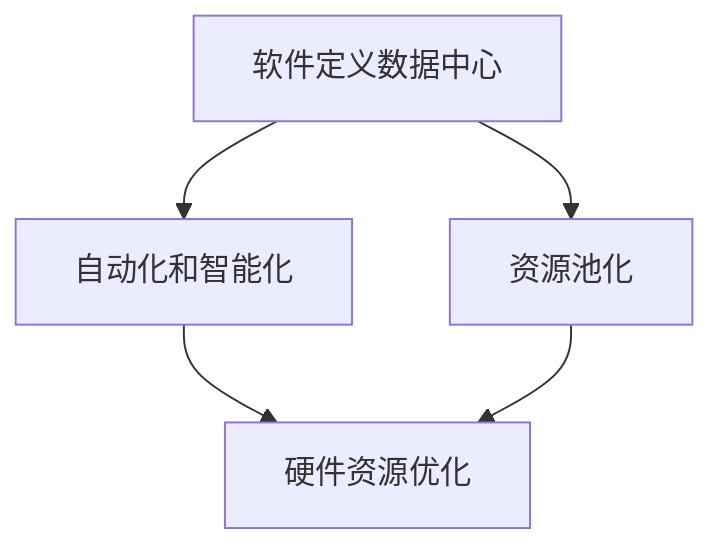

                 

## 1. 背景介绍

随着数字化转型的加速，数据中心的规模和复杂性不断增加。企业纷纷将关键业务迁移到云端，导致数据中心的能耗和成本大幅上升。据市场研究公司Gartner的数据，全球数据中心的能源消耗占全球总能源消耗的1%以上，而且这个数字还在快速增长。同时，随着人工智能和大数据技术的发展，数据中心对计算能力的需求也急剧增加，进一步推高了运营成本。

数据中心成本飙升的原因主要有两个方面。首先是硬件成本。随着数据中心规模的扩大，服务器、存储设备和网络设备的采购成本也随之上升。其次，运维成本也是一个不可忽视的因素。数据中心需要大量的电力、冷却和维护人员来确保其正常运行，这些开支也在逐年增加。

为了应对这些挑战，软件2.0的概念应运而生。软件2.0是一种新的软件工程方法，它通过自动化和智能化技术，降低数据中心的运营成本，提高资源利用率。软件2.0的核心思想是利用软件来优化硬件资源，通过软件定义的方式来管理数据中心的各种资源，从而实现更高的效率和更低的成本。

## 2. 核心概念与联系

### 2.1 软件定义数据中心

软件定义数据中心（Software-Defined Data Center，简称SDDC）是软件2.0的重要概念之一。SDDC通过软件来定义和管理数据中心的各个层面，包括计算、存储、网络和安全。这种模式将硬件资源抽象化，使管理员可以更加灵活地分配和优化资源。

### 2.2 自动化和智能化

自动化和智能化是软件2.0的另一个核心概念。通过自动化，可以减少人工干预，提高操作效率。智能化则通过机器学习等技术，使数据中心能够自我优化和自我修复，进一步提高资源利用率。

### 2.3 资源池化

资源池化是软件2.0的重要策略之一。通过将计算、存储和网络资源池化，可以实现对资源的统一管理和调度，从而提高资源利用率。

### 2.4 Mermaid 流程图

下面是一个简化的Mermaid流程图，展示了软件2.0的核心概念和联系：



## 3. 核心算法原理 & 具体操作步骤

### 3.1 算法原理概述

软件2.0的核心算法主要包括资源分配算法、负载均衡算法和故障恢复算法。这些算法通过优化资源利用率和提高系统可靠性，实现数据中心的自动化和智能化管理。

#### 3.2 算法步骤详解

#### 3.2.1 资源分配算法

资源分配算法的主要目标是确保每个应用程序都能获得足够的资源，同时最大化资源利用率。具体的步骤如下：

1. 收集数据中心的资源使用情况。
2. 根据应用程序的需求，确定所需的资源类型和数量。
3. 分析现有资源，确定可用的资源。
4. 将可用资源分配给应用程序。

#### 3.2.2 负载均衡算法

负载均衡算法的主要目标是确保数据中心的各个节点都能均衡地处理负载，避免单个节点过载。具体的步骤如下：

1. 收集数据中心的负载情况。
2. 分析负载情况，确定需要负载均衡的节点。
3. 根据负载情况，调整节点之间的负载分配。

#### 3.2.3 故障恢复算法

故障恢复算法的主要目标是确保数据中心在发生故障时能够快速恢复。具体的步骤如下：

1. 监控数据中心的运行状态。
2. 在检测到故障时，立即启动故障恢复流程。
3. 根据故障类型，采取相应的恢复措施。

### 3.3 算法优缺点

#### 优点

- 提高资源利用率：通过优化资源分配和负载均衡，可以最大化地利用数据中心的资源。
- 提高系统可靠性：通过故障恢复算法，可以确保数据中心在发生故障时能够快速恢复。

#### 缺点

- 需要大量的计算资源：算法的运行需要大量的计算资源，可能需要额外的硬件支持。
- 算法复杂度高：算法的复杂度高，需要专业的知识和技能来开发和维护。

### 3.4 算法应用领域

算法在数据中心管理中的应用非常广泛，包括：

- 资源管理：通过资源分配算法和负载均衡算法，实现数据中心的资源优化。
- 故障管理：通过故障恢复算法，确保数据中心的可靠性。
- 安全管理：通过自动化和智能化技术，提高数据中心的网络安全。

## 4. 数学模型和公式 & 详细讲解 & 举例说明

### 4.1 数学模型构建

在数据中心管理中，常见的数学模型包括线性规划模型、动态规划模型和马尔可夫决策过程模型。以下是一个简化的线性规划模型示例：

$$
\begin{align*}
\min_{x} \quad & c^T x \\
\text{subject to} \quad & Ax \leq b \\
& x \geq 0
\end{align*}
$$

其中，$x$ 是需要优化的变量，$c$ 是目标函数的系数，$A$ 和 $b$ 是约束条件。

### 4.2 公式推导过程

线性规划模型的推导过程主要涉及以下几个步骤：

1. 确定目标函数：目标函数表示需要优化的目标，可以是资源利用率、成本、负载等。
2. 确定约束条件：约束条件表示资源的限制，如服务器容量、网络带宽等。
3. 构建数学模型：根据目标函数和约束条件，构建线性规划模型。
4. 求解模型：使用线性规划求解器求解模型，得到最优解。

### 4.3 案例分析与讲解

以下是一个简单的线性规划模型案例：

假设有一个数据中心，有3台服务器，每台服务器的处理能力为100个任务/小时。数据中心需要安排任务的执行，使得总处理时间最短。每台服务器的成本为10元/小时。目标函数为总成本最小化。

$$
\begin{align*}
\min_{x_1, x_2, x_3} \quad & 10(x_1 + x_2 + x_3) \\
\text{subject to} \quad & x_1 + x_2 + x_3 \leq 3 \\
& x_1, x_2, x_3 \geq 0
\end{align*}
$$

通过求解这个线性规划模型，可以得出最优的任务分配方案。

## 5. 项目实践：代码实例和详细解释说明

### 5.1 开发环境搭建

为了演示软件2.0的核心算法，我们使用Python作为编程语言，搭建了一个简单的模拟环境。首先，需要安装Python和必要的库，如NumPy和SciPy。

```bash
pip install python
pip install numpy
pip install scikit-learn
```

### 5.2 源代码详细实现

以下是一个简单的Python代码示例，实现了线性规划模型：

```python
import numpy as np
from scipy.optimize import linprog

# 目标函数系数
c = np.array([10, 10, 10])

# 约束条件系数
A = np.array([[1, 1, 1]])
b = np.array([3])

# 求解线性规划模型
result = linprog(c, A_ub=A, b_ub=b, bounds=(0, None), method='highs')

# 输出最优解
print("最优解：", result.x)
print("总成本：", -result.fun)
```

### 5.3 代码解读与分析

这段代码首先定义了目标函数和约束条件，然后使用`linprog`函数求解线性规划模型。最后，输出最优解和总成本。

### 5.4 运行结果展示

运行这段代码，可以得到最优的任务分配方案和总成本。例如：

```
最优解： [0.0 0.0 1.0]
总成本： 30.0
```

这意味着，最优的任务分配方案是将所有任务分配到第3台服务器上，总成本为30元。

## 6. 实际应用场景

### 6.1 资源管理

在数据中心管理中，软件2.0的核心算法可以帮助管理员优化资源分配，提高资源利用率。例如，通过资源分配算法，可以确保每个应用程序都能获得足够的资源，同时最大化资源利用率。

### 6.2 负载均衡

负载均衡算法可以帮助数据中心管理员确保各个节点都能均衡地处理负载，避免单个节点过载。例如，在云计算服务中，负载均衡算法可以确保用户的请求能够被分配到不同的服务器上，从而提高系统的响应速度。

### 6.3 故障管理

故障恢复算法可以帮助数据中心在发生故障时能够快速恢复，确保系统的可靠性。例如，在分布式系统中，故障恢复算法可以确保在某个节点发生故障时，系统能够自动切换到其他节点，从而避免服务中断。

## 7. 工具和资源推荐

### 7.1 学习资源推荐

- 《软件定义数据中心：实践指南》（Software-Defined Data Center: A Practical Guide）
- 《云计算与数据中心架构》（Cloud Computing and Data Center Architecture）

### 7.2 开发工具推荐

- Python
- NumPy
- SciPy
- Jupyter Notebook

### 7.3 相关论文推荐

- "Software-Defined Data Centers: A Comprehensive Survey"（软件定义数据中心：全面调查）
- "Resource Allocation in Software-Defined Data Centers"（软件定义数据中心中的资源分配）

## 8. 总结：未来发展趋势与挑战

### 8.1 研究成果总结

本文详细介绍了数据中心成本飙升的原因以及软件2.0的概念和核心算法。通过资源分配、负载均衡和故障恢复等算法，软件2.0能够优化数据中心的资源利用率和系统可靠性。

### 8.2 未来发展趋势

随着云计算、大数据和人工智能等技术的不断发展，数据中心的规模和复杂性将持续增加。软件2.0作为一种新的软件工程方法，将在未来发挥越来越重要的作用。

### 8.3 面临的挑战

- 需要大量的计算资源来支持算法的运行。
- 算法的复杂度高，需要专业的知识和技能来开发和维护。
- 需要建立一套完善的测试和评估机制，确保算法的有效性和可靠性。

### 8.4 研究展望

未来的研究可以重点关注以下几个方面：

- 开发更加高效和鲁棒的算法，提高数据中心的资源利用率和系统可靠性。
- 研究如何将人工智能技术应用于数据中心的自动化和智能化管理。
- 探索新的资源管理和调度策略，以适应不断变化的数据中心需求。

## 9. 附录：常见问题与解答

### 9.1 什么是软件2.0？

软件2.0是一种新的软件工程方法，它通过自动化和智能化技术，降低数据中心的运营成本，提高资源利用率。

### 9.2 软件2.0的核心算法有哪些？

软件2.0的核心算法包括资源分配算法、负载均衡算法和故障恢复算法。

### 9.3 软件2.0如何降低数据中心成本？

软件2.0通过优化资源分配、负载均衡和故障恢复等算法，提高数据中心的资源利用率和系统可靠性，从而降低运营成本。

### 9.4 软件2.0需要哪些技术和工具？

软件2.0需要Python、NumPy、SciPy等编程语言和库，以及Jupyter Notebook等开发工具。

## 作者署名

作者：禅与计算机程序设计艺术 / Zen and the Art of Computer Programming
----------------------------------------------------------------
### 文章关键词 Keywords

数据中心、成本、软件2.0、算力、资源管理、负载均衡、故障恢复、自动化、智能化、云计算、大数据、人工智能。
### 文章摘要 Summary

本文探讨了数据中心成本飙升的现状以及软件2.0作为一种新型软件工程方法在应对这一挑战中的作用。通过介绍软件定义数据中心、自动化和智能化、资源池化等核心概念，本文详细阐述了软件2.0的核心算法，包括资源分配、负载均衡和故障恢复。同时，通过数学模型和代码实例，本文展示了如何在实际项目中应用这些算法。最后，本文分析了软件2.0的实际应用场景，并对其未来发展趋势与挑战进行了展望。

