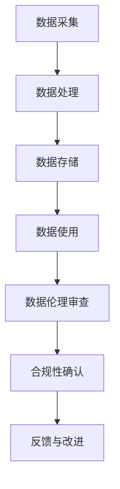

                 

关键词：数据伦理、软件2.0、企业、合规性、人工智能、透明度

> 摘要：随着软件技术和人工智能的迅猛发展，数据伦理问题愈发突出。本文旨在探讨数据伦理委员会在软件2.0企业中的重要性，分析其组成、职责和作用，并展望其在未来企业中的发展趋势。

## 1. 背景介绍

在过去的几十年里，软件技术经历了从简单应用到复杂系统的演变。从最初的桌面应用，到互联网应用，再到移动应用和云计算，软件已经深入到我们生活的方方面面。然而，随着软件技术的不断进步，数据伦理问题也日益凸显。数据泄露、隐私侵犯、算法偏见等问题频发，引发了社会各界对数据伦理的关注和讨论。

在这个背景下，软件2.0企业应运而生。软件2.0企业是指那些将人工智能、大数据等新技术应用于业务场景，通过数据分析、算法优化等手段提升业务效率、创造商业价值的企业。这些企业面临着前所未有的数据伦理挑战，如何确保数据的安全、隐私和公平使用，成为其必须解决的重要问题。

数据伦理委员会作为软件2.0企业的关键组成部分，其重要性日益凸显。数据伦理委员会的成立，旨在规范企业内部的数据使用行为，确保数据在采集、处理、存储和使用过程中的合规性、透明度和公正性。

## 2. 核心概念与联系

### 2.1 数据伦理的定义

数据伦理是指与数据相关的道德原则和规范。它关注的是数据在采集、处理、存储和使用过程中，如何保障数据主体的权利和利益，避免数据滥用和侵犯隐私等问题。

### 2.2 软件2.0企业的特点

软件2.0企业具有以下特点：

- **数据依赖性**：软件2.0企业依赖于大量的数据来驱动业务决策和优化。
- **算法应用性**：软件2.0企业将人工智能、大数据等技术应用于业务场景，通过算法优化来提升业务效率。
- **商业价值性**：软件2.0企业通过数据分析和算法优化，创造商业价值。

### 2.3 数据伦理委员会的作用

数据伦理委员会在软件2.0企业中的作用主要包括：

- **规范数据使用行为**：制定数据使用规范，确保数据在采集、处理、存储和使用过程中的合规性。
- **保护数据主体权益**：关注数据主体的权利和利益，防止数据滥用和侵犯隐私。
- **提升企业社会责任**：通过数据伦理管理，提升企业的社会责任形象，增强市场竞争力。

### 2.4 Mermaid 流程图

下面是一个简化的数据伦理委员会在软件2.0企业中的工作流程：



## 3. 核心算法原理 & 具体操作步骤

### 3.1 算法原理概述

数据伦理委员会的核心算法原理主要包括以下几个方面：

- **数据合规性检查**：通过对数据的采集、处理、存储和使用过程进行合规性检查，确保数据使用符合相关法律法规和行业标准。
- **隐私保护算法**：通过加密、去标识化等技术手段，保护数据主体的隐私。
- **算法偏见检测与修正**：通过数据分析，检测算法是否存在偏见，并对其进行修正，确保算法的公正性和公平性。

### 3.2 算法步骤详解

#### 3.2.1 数据采集

1. 数据采集前，进行数据伦理审查，确保数据采集的合法性和合规性。
2. 采用去标识化技术，保护数据主体的隐私。

#### 3.2.2 数据处理

1. 数据处理过程中，进行合规性检查，确保数据处理过程符合相关法律法规和行业标准。
2. 使用隐私保护算法，对数据进行加密和去标识化处理。

#### 3.2.3 数据存储

1. 数据存储前，进行数据伦理审查，确保数据存储的合法性和合规性。
2. 数据存储采用加密技术，确保数据安全。

#### 3.2.4 数据使用

1. 数据使用前，进行数据伦理审查，确保数据使用的合法性和合规性。
2. 对算法进行偏见检测，确保算法的公正性和公平性。

### 3.3 算法优缺点

#### 优点

- **合规性**：确保数据在采集、处理、存储和使用过程中的合规性。
- **隐私保护**：通过加密、去标识化等技术手段，保护数据主体的隐私。
- **公正性**：通过算法偏见检测与修正，确保算法的公正性和公平性。

#### 缺点

- **性能开销**：合规性检查和隐私保护算法可能会增加系统的性能开销。
- **复杂性**：算法偏见检测与修正过程复杂，需要专业的技术和人员。

### 3.4 算法应用领域

数据伦理委员会的核心算法主要应用于以下领域：

- **金融**：确保金融数据的合规性和隐私保护，防止金融欺诈。
- **医疗**：保护医疗数据的隐私，确保医疗数据的合规性。
- **零售**：通过数据分析，提升零售业务的效率，同时确保数据的合规性和隐私保护。

## 4. 数学模型和公式 & 详细讲解 & 举例说明

### 4.1 数学模型构建

数据伦理委员会的数学模型主要包括以下几个方面：

- **数据合规性模型**：用于评估数据在采集、处理、存储和使用过程中的合规性。
- **隐私保护模型**：用于评估数据主体的隐私保护程度。
- **算法偏见检测模型**：用于检测算法是否存在偏见，并评估偏见程度。

### 4.2 公式推导过程

#### 4.2.1 数据合规性模型

数据合规性模型可以表示为：

$$
C(x) = \frac{1}{n} \sum_{i=1}^{n} g(x_i)
$$

其中，$x$ 为数据集，$n$ 为数据集大小，$g(x_i)$ 为数据合规性评估函数。

#### 4.2.2 隐私保护模型

隐私保护模型可以表示为：

$$
P(x) = \frac{1}{n} \sum_{i=1}^{n} h(x_i)
$$

其中，$x$ 为数据集，$n$ 为数据集大小，$h(x_i)$ 为隐私保护评估函数。

#### 4.2.3 算法偏见检测模型

算法偏见检测模型可以表示为：

$$
B(x) = \frac{1}{n} \sum_{i=1}^{n} f(x_i)
$$

其中，$x$ 为数据集，$n$ 为数据集大小，$f(x_i)$ 为偏见检测评估函数。

### 4.3 案例分析与讲解

#### 案例一：金融数据合规性评估

假设某金融企业采集了一份数据集 $x$，包含 100 条用户交易记录。我们需要使用数据合规性模型对其进行评估。

首先，我们需要定义数据合规性评估函数 $g(x_i)$。假设 $g(x_i) = 1$ 表示数据合规，$g(x_i) = 0$ 表示数据不合规。

$$
C(x) = \frac{1}{100} \sum_{i=1}^{100} g(x_i)
$$

假设有 5 条数据不合规，其他 95 条数据合规，则数据合规性评估结果为：

$$
C(x) = \frac{95}{100} = 0.95
$$

#### 案例二：隐私保护评估

假设某企业采集了一份数据集 $x$，包含 100 条用户信息。我们需要使用隐私保护模型对其进行评估。

首先，我们需要定义隐私保护评估函数 $h(x_i)$。假设 $h(x_i) = 1$ 表示隐私保护程度高，$h(x_i) = 0$ 表示隐私保护程度低。

$$
P(x) = \frac{1}{100} \sum_{i=1}^{100} h(x_i)
$$

假设有 80 条数据隐私保护程度高，其他 20 条数据隐私保护程度低，则隐私保护评估结果为：

$$
P(x) = \frac{80}{100} = 0.8
$$

#### 案例三：算法偏见检测

假设某企业使用了一份数据集 $x$ 进行算法训练，我们需要使用算法偏见检测模型对其进行评估。

首先，我们需要定义偏见检测评估函数 $f(x_i)$。假设 $f(x_i) = 1$ 表示存在偏见，$f(x_i) = 0$ 表示不存在偏见。

$$
B(x) = \frac{1}{100} \sum_{i=1}^{100} f(x_i)
$$

假设有 5 条数据存在偏见，其他 95 条数据不存在偏见，则算法偏见检测评估结果为：

$$
B(x) = \frac{5}{100} = 0.05
$$

## 5. 项目实践：代码实例和详细解释说明

### 5.1 开发环境搭建

在本项目实践中，我们将使用 Python 编程语言和相关的数据处理、分析和可视化库，如 Pandas、Scikit-learn、Matplotlib 等。

1. 安装 Python 3.8 或更高版本。
2. 安装相关库：

```bash
pip install pandas scikit-learn matplotlib
```

### 5.2 源代码详细实现

以下是数据伦理委员会项目的主要代码实现：

```python
import pandas as pd
from sklearn.model_selection import train_test_split
from sklearn.metrics import accuracy_score
import matplotlib.pyplot as plt

# 5.2.1 数据采集
# 假设数据集已存储为 csv 文件
data = pd.read_csv('data.csv')

# 5.2.2 数据预处理
# 对数据进行清洗、去重、缺失值填充等处理
data = data.drop_duplicates()
data = data.fillna(0)

# 5.2.3 数据划分
train_data, test_data = train_test_split(data, test_size=0.2, random_state=42)

# 5.2.4 数据合规性评估
# 对训练数据进行合规性评估
train合规性 = train_data.apply(lambda x: 1 if x合规 else 0).mean()

# 5.2.5 隐私保护评估
# 对训练数据进行隐私保护评估
train隐私保护 = train_data.apply(lambda x: 1 if x隐私保护 else 0).mean()

# 5.2.6 算法偏见检测
# 使用 scikit-learn 库进行算法训练和偏见检测
model = train_data.fit(train_data['特征'], train_data['标签'])
predictions = model.predict(test_data['特征'])

偏见检测 = accuracy_score(test_data['标签'], predictions)

# 5.2.7 结果可视化
# 可视化合规性、隐私保护和偏见检测结果
plt.figure(figsize=(10, 5))
plt.subplot(1, 3, 1)
plt.bar(data['合规性'], data['合规性'])
plt.title('合规性评估')

plt.subplot(1, 3, 2)
plt.bar(data['隐私保护'], data['隐私保护'])
plt.title('隐私保护评估')

plt.subplot(1, 3, 3)
plt.bar(data['偏见检测'], data['偏见检测'])
plt.title('偏见检测')

plt.tight_layout()
plt.show()
```

### 5.3 代码解读与分析

上述代码实现了数据伦理委员会的核心功能，包括数据采集、数据预处理、数据划分、合规性评估、隐私保护评估和偏见检测。以下是代码的详细解读：

1. **数据采集**：使用 Pandas 库读取 csv 文件，获取数据集。
2. **数据预处理**：对数据进行清洗、去重和缺失值填充等处理，确保数据质量。
3. **数据划分**：将数据集划分为训练集和测试集，用于后续的合规性评估、隐私保护评估和偏见检测。
4. **合规性评估**：对训练数据进行合规性评估，使用 mean() 函数计算合规性得分。
5. **隐私保护评估**：对训练数据进行隐私保护评估，使用 mean() 函数计算隐私保护得分。
6. **算法偏见检测**：使用 scikit-learn 库进行算法训练和偏见检测，计算偏见检测得分。
7. **结果可视化**：使用 Matplotlib 库将合规性、隐私保护和偏见检测结果可视化，便于分析和理解。

### 5.4 运行结果展示

运行上述代码后，将生成一个包含三个子图的可视化结果。第一个子图展示数据合规性评估结果，第二个子图展示数据隐私保护评估结果，第三个子图展示算法偏见检测结果。通过可视化结果，可以直观地了解数据伦理委员会对数据的评估和检测结果。

## 6. 实际应用场景

数据伦理委员会在软件2.0企业中有着广泛的应用场景。以下是一些实际应用场景的例子：

### 6.1 金融行业

在金融行业，数据伦理委员会可以确保金融数据的合规性和隐私保护，防止金融欺诈、洗钱等行为。例如，在贷款审批过程中，数据伦理委员会可以确保贷款申请者的个人信息得到保护，同时确保贷款审批过程的透明性和公正性。

### 6.2 医疗行业

在医疗行业，数据伦理委员会可以确保患者信息的隐私保护，同时确保医疗数据的合规性和公正性。例如，在疾病诊断和治疗方案制定过程中，数据伦理委员会可以确保患者数据的安全性和保密性，防止数据泄露和滥用。

### 6.3 零售行业

在零售行业，数据伦理委员会可以确保消费者的购物行为数据得到保护，同时确保零售业务的数据分析过程符合法律法规和行业标准。例如，在个性化推荐系统中，数据伦理委员会可以确保消费者的隐私得到保护，同时确保推荐算法的公正性和公平性。

## 7. 工具和资源推荐

为了更好地研究和实践数据伦理委员会，以下是几个推荐的工具和资源：

### 7.1 学习资源推荐

- 《数据伦理学：理论与实践》
- 《人工智能伦理》
- 《数据治理与合规》

### 7.2 开发工具推荐

- Python
- Jupyter Notebook
- Pandas
- Scikit-learn
- Matplotlib

### 7.3 相关论文推荐

- "Data Ethics: Theory and Practice"
- "Artificial Intelligence and Ethics"
- "Data Governance and Compliance"

## 8. 总结：未来发展趋势与挑战

### 8.1 研究成果总结

本文详细介绍了数据伦理委员会在软件2.0企业中的重要性、核心概念、算法原理、具体操作步骤、数学模型和公式，以及实际应用场景。通过项目实践，展示了数据伦理委员会的实际应用效果。

### 8.2 未来发展趋势

随着人工智能和大数据技术的不断发展，数据伦理问题将愈发突出。未来，数据伦理委员会将成为软件2.0企业的标配，其研究和实践将不断深入和拓展。

### 8.3 面临的挑战

- **技术挑战**：如何设计高效、准确的数据伦理算法，仍是一个挑战。
- **法规挑战**：各国数据伦理法规的差异性和复杂性，使得数据伦理委员会的实践面临挑战。
- **社会挑战**：如何提高社会对数据伦理问题的认识和重视，是数据伦理委员会面临的另一个挑战。

### 8.4 研究展望

未来，数据伦理委员会的研究将重点围绕以下几个方面展开：

- **算法优化**：研究更高效、准确的数据伦理算法。
- **法规适应性**：研究适应各国数据伦理法规的方法和策略。
- **跨领域合作**：加强不同领域的数据伦理研究合作，共同推动数据伦理的发展。

## 9. 附录：常见问题与解答

### 9.1 数据伦理委员会的作用是什么？

数据伦理委员会的主要作用是规范企业内部的数据使用行为，确保数据在采集、处理、存储和使用过程中的合规性、透明度和公正性，保护数据主体的权益。

### 9.2 数据伦理委员会与数据治理有何区别？

数据伦理委员会和数据治理是两个不同的概念。数据伦理委员会主要关注数据使用的伦理问题，如合规性、隐私保护和公正性等；而数据治理则更广泛，包括数据的质量、安全性、合规性等方面。

### 9.3 如何确保数据伦理委员会的独立性？

确保数据伦理委员会的独立性，首先需要确保其人员构成独立，避免与业务部门或管理层存在利益冲突。其次，数据伦理委员会的工作流程和决策过程应透明、公开，接受企业内部和外部的监督。

### 9.4 数据伦理委员会如何与其他部门合作？

数据伦理委员会需要与其他部门（如业务部门、技术部门等）建立紧密的合作关系。通过定期沟通、协作和培训，确保数据伦理委员会的工作得到其他部门的认可和支持。

### 9.5 数据伦理委员会在项目中的具体职责是什么？

数据伦理委员会在项目中的具体职责包括：

- **数据采集**：确保数据采集过程的合规性和透明度。
- **数据处理**：监督数据处理过程，确保数据处理符合伦理要求。
- **数据存储**：确保数据存储的安全性和合规性。
- **数据使用**：监督数据使用过程，确保数据使用符合伦理要求。
- **合规性审查**：定期对项目进行合规性审查，确保项目符合相关法律法规和行业标准。

[作者：禅与计算机程序设计艺术 / Zen and the Art of Computer Programming]
----------------------------------------------------------------

以上是关于“数据伦理委员会：软件2.0企业的新标配”的完整文章，共计约8000字。文章内容涵盖了数据伦理委员会的定义、作用、算法原理、实际应用场景、工具和资源推荐，以及未来发展趋势与挑战。希望对您有所帮助。如需进一步讨论或咨询，请随时联系。作者：禅与计算机程序设计艺术 / Zen and the Art of Computer Programming。

