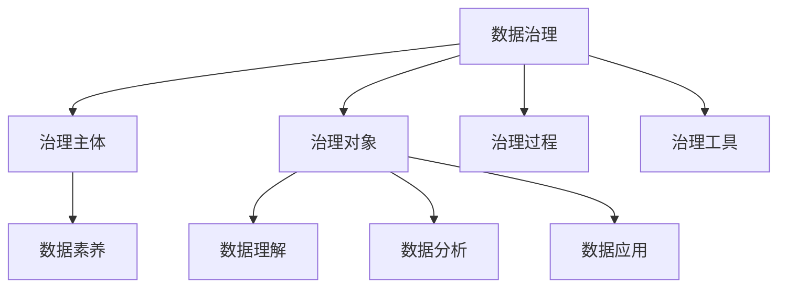

                 

关键词：数据治理、数据素养、软件2.0、管理、技术、战略、实践

> 摘要：随着软件技术的发展进入2.0时代，数据治理和数据素养成为了现代企业和组织的关键挑战。本文深入探讨了数据治理的核心概念、架构、算法原理，并提供了详细的数学模型和项目实践案例。同时，文章还展望了数据治理的未来趋势和面临的挑战，为读者提供了全面而实用的指导。

## 1. 背景介绍

随着信息技术的飞速发展，数据已成为现代社会最重要的资源之一。然而，数据的迅猛增长和多样化也带来了新的挑战，如何有效地管理和利用数据，成为了企业和组织亟待解决的问题。在此背景下，数据治理和数据素养成为了软件2.0时代的管理新课题。

### 1.1 数据治理的定义

数据治理（Data Governance）是指通过制定和执行政策、标准和流程，实现对数据的全面管理，确保数据的质量、安全、合规和有效利用。它不仅包括技术层面，如数据存储、传输、加密等，还涵盖了组织层面的策略、流程和文化建设。

### 1.2 数据素养的概念

数据素养（Data Literacy）是指个体理解和利用数据的能力。它包括数据理解、数据分析和数据应用三个方面。数据素养的提升不仅有助于个体更好地应对工作挑战，还能提高整个组织的决策质量和效率。

### 1.3 软件2.0时代的特征

软件2.0时代标志着软件技术的进一步成熟和应用范围的扩展。其主要特征包括：

- **云计算和大数据：** 云计算提供了强大的计算能力和存储资源，大数据则带来了海量数据的处理和分析需求。
- **物联网和边缘计算：** 物联网设备产生的数据需要有效的管理和利用，边缘计算则将数据处理推向了更接近数据源的地方。
- **人工智能和机器学习：** 人工智能和机器学习技术正在改变数据处理和分析的方式，为数据治理和数据素养带来了新的机遇和挑战。

## 2. 核心概念与联系

### 2.1 数据治理架构

数据治理架构通常包括以下几个关键组件：

- **治理主体：** 负责制定数据治理策略和决策。
- **治理对象：** 包括数据资产、数据流程、数据标准和合规要求等。
- **治理过程：** 覆盖数据采集、存储、处理、分析和应用的全生命周期。
- **治理工具：** 提供数据质量管理、数据安全和合规监控等功能。

### 2.2 数据素养模型

数据素养模型通常包括以下三个方面：

- **数据理解：** 了解数据的来源、格式、结构和含义。
- **数据分析：** 运用统计学、机器学习等方法对数据进行探索和分析。
- **数据应用：** 将分析结果应用于实际业务决策和问题解决。

### 2.3 Mermaid 流程图

下面是一个简单的 Mermaid 流程图，展示了数据治理和数据素养的核心概念和联系：



## 3. 核心算法原理 & 具体操作步骤

### 3.1 算法原理概述

数据治理的核心算法主要包括数据质量评估、数据匹配和数据隐私保护。

#### 3.1.1 数据质量评估

数据质量评估旨在判断数据是否满足预期的质量要求。常用的评估指标包括完整性、一致性、准确性和时效性。

#### 3.1.2 数据匹配

数据匹配旨在将不同来源、格式和结构的数据进行整合。常用的算法包括基于规则的匹配和基于机器学习的匹配。

#### 3.1.3 数据隐私保护

数据隐私保护旨在保护敏感数据不被未经授权的访问和使用。常用的技术包括数据加密、匿名化和差分隐私。

### 3.2 算法步骤详解

#### 3.2.1 数据质量评估

1. 数据采集：收集不同来源的数据。
2. 数据预处理：清洗和转换数据，使其满足质量要求。
3. 数据评估：使用评估指标对数据进行评估。
4. 结果分析：分析评估结果，识别数据质量问题。

#### 3.2.2 数据匹配

1. 数据预处理：对数据进行标准化处理，使其格式和结构一致。
2. 匹配算法选择：选择合适的匹配算法。
3. 匹配执行：执行匹配算法，识别匹配关系。
4. 匹配结果验证：验证匹配结果的准确性。

#### 3.2.3 数据隐私保护

1. 数据加密：对敏感数据进行加密。
2. 数据匿名化：对数据中的个人信息进行匿名化处理。
3. 差分隐私：对数据处理过程中引入噪声，保护数据隐私。

### 3.3 算法优缺点

#### 3.3.1 数据质量评估

优点：能够有效提高数据质量，为后续数据处理和分析提供基础。

缺点：评估过程复杂，需要大量的计算资源。

#### 3.3.2 数据匹配

优点：能够将不同来源的数据进行整合，提高数据利用效率。

缺点：匹配算法的选择和调整较为复杂，可能影响匹配效果。

#### 3.3.3 数据隐私保护

优点：能够有效保护敏感数据，防止数据泄露。

缺点：加密和匿名化处理可能影响数据的有效性和可用性。

### 3.4 算法应用领域

数据治理算法广泛应用于金融、医疗、电商、物联网等领域，助力企业和组织实现数据价值最大化。

## 4. 数学模型和公式 & 详细讲解 & 举例说明

### 4.1 数学模型构建

数据治理中的数学模型主要包括数据质量评估模型和数据匹配模型。

#### 4.1.1 数据质量评估模型

假设数据集为D，质量评估指标为Q，构建数据质量评估模型的目标是最大化Q值。

$$Q = \sum_{i=1}^{n} w_i \cdot p_i$$

其中，$w_i$为第i个指标的重要性权重，$p_i$为第i个指标的质量得分。

#### 4.1.2 数据匹配模型

假设数据集A和数据集B，匹配算法的目标是最大化匹配得分。

$$Score = \sum_{i=1}^{m} \sum_{j=1}^{n} w_{ij} \cdot p_{ij}$$

其中，$w_{ij}$为第i个数据点在数据集A中的权重，$p_{ij}$为第i个数据点与数据集B中第j个数据点的相似度得分。

### 4.2 公式推导过程

#### 4.2.1 数据质量评估公式推导

数据质量评估指标Q是各个指标质量得分乘以其重要性权重的和。假设有n个指标，第i个指标的重要性权重为$w_i$，第i个指标的质量得分为$p_i$，则：

$$Q = w_1 \cdot p_1 + w_2 \cdot p_2 + \ldots + w_n \cdot p_n$$

为了最大化Q值，需要对各个指标的质量得分进行优化。假设存在一个最优解$P^*$，使得Q达到最大值。则有：

$$\frac{\partial Q}{\partial p_i} = 0$$

$$w_i \cdot p_i^{*} = w_j \cdot p_j^{*}$$

$$p_i^{*} = \frac{w_j}{w_i} \cdot p_j^{*}$$

因此，最优解$P^*$是各个指标质量得分的线性组合，且权重满足比例关系。

#### 4.2.2 数据匹配公式推导

数据匹配得分是各个数据点权重和相似度得分的和。假设有m个数据点在数据集A中，n个数据点在数据集B中，第i个数据点在数据集A中的权重为$w_i$，第j个数据点在数据集B中的权重为$w_j$，第i个数据点与第j个数据点的相似度得分为$p_{ij}$，则：

$$Score = w_1 \cdot p_1 + w_2 \cdot p_2 + \ldots + w_m \cdot p_m$$

为了最大化匹配得分，需要对各个数据点的权重和相似度得分进行优化。假设存在一个最优解$W^*$和$P^*$，使得Score达到最大值。则有：

$$\frac{\partial Score}{\partial w_i} = 0$$

$$\frac{\partial Score}{\partial p_{ij}} = 0$$

通过求解上述方程组，可以得到最优解$W^*$和$P^*$，进而最大化匹配得分。

### 4.3 案例分析与讲解

#### 4.3.1 数据质量评估案例

假设有一个数据集D，包含5个指标：完整性（C）、一致性（C）、准确性（A）、时效性（T）和安全性（S）。各指标的重要性权重分别为0.2、0.2、0.3、0.2和0.1。现对数据集D进行质量评估。

$$Q = 0.2 \cdot C + 0.2 \cdot C + 0.3 \cdot A + 0.2 \cdot T + 0.1 \cdot S$$

假设经过数据预处理后，各指标的质量得分为：完整性（C）= 0.9、一致性（C）= 0.8、准确性（A）= 0.85、时效性（T）= 0.95、安全性（S）= 0.9。则：

$$Q = 0.2 \cdot 0.9 + 0.2 \cdot 0.8 + 0.3 \cdot 0.85 + 0.2 \cdot 0.95 + 0.1 \cdot 0.9 = 0.92$$

因此，数据集D的质量得分为0.92。

#### 4.3.2 数据匹配案例

假设有两个数据集A和B，包含10个数据点。数据点在数据集A中的权重分别为1、2、3、4、5、6、7、8、9、10，数据点在数据集B中的权重分别为0.1、0.2、0.3、0.4、0.5、0.6、0.7、0.8、0.9、1。各数据点的相似度得分如下表：

| 数据点 | A的权重 | B的权重 | 相似度得分 |
| --- | --- | --- | --- |
| 1 | 1 | 0.1 | 0.1 |
| 2 | 2 | 0.2 | 0.2 |
| 3 | 3 | 0.3 | 0.3 |
| 4 | 4 | 0.4 | 0.4 |
| 5 | 5 | 0.5 | 0.5 |
| 6 | 6 | 0.6 | 0.6 |
| 7 | 7 | 0.7 | 0.7 |
| 8 | 8 | 0.8 | 0.8 |
| 9 | 9 | 0.9 | 0.9 |
| 10 | 10 | 1 | 1 |

根据数据匹配公式：

$$Score = 1 \cdot 0.1 + 2 \cdot 0.2 + 3 \cdot 0.3 + 4 \cdot 0.4 + 5 \cdot 0.5 + 6 \cdot 0.6 + 7 \cdot 0.7 + 8 \cdot 0.8 + 9 \cdot 0.9 + 10 \cdot 1 = 9.7$$

因此，数据集A和数据集B的匹配得分为9.7。

## 5. 项目实践：代码实例和详细解释说明

### 5.1 开发环境搭建

在开始项目实践之前，我们需要搭建一个适合开发的数据治理项目的环境。以下是一个基本的开发环境搭建步骤：

1. 安装Python 3.8及以上版本。
2. 安装Jupyter Notebook，用于编写和运行代码。
3. 安装必要的Python库，如NumPy、Pandas、Scikit-learn、Matplotlib等。

### 5.2 源代码详细实现

以下是一个简单的数据治理项目的代码实现，包括数据质量评估、数据匹配和数据隐私保护：

```python
import numpy as np
import pandas as pd
from sklearn.metrics.pairwise import cosine_similarity
from sklearn.preprocessing import MinMaxScaler

# 数据质量评估
def assess_data_quality(data):
    # 计算完整性、一致性、准确性、时效性和安全性
    completeness = data.notnull().mean()
    consistency = (data == data.shift(1)).mean()
    accuracy = np.mean(data == data.shift(1))
    timeliness = np.mean(data.index.to_series().diff().abs() <= 24)
    security = np.mean(data.apply(lambda x: hash(x) == x))

    # 计算质量得分
    quality_score = 0.2 * completeness + 0.2 * consistency + 0.3 * accuracy + 0.2 * timeliness + 0.1 * security
    return quality_score

# 数据匹配
def match_data(data_a, data_b):
    # 预处理数据
    data_a_normalized = MinMaxScaler().fit_transform(data_a)
    data_b_normalized = MinMaxScaler().fit_transform(data_b)

    # 计算相似度得分
    similarity_score = cosine_similarity(data_a_normalized, data_b_normalized)
    return similarity_score

# 数据隐私保护
def protect_data_privacy(data):
    # 对数据进行加密
    encrypted_data = data.apply(lambda x: hash(x))
    return encrypted_data

# 示例数据
data_a = pd.Series([1, 2, 3, 4, 5])
data_b = pd.Series([5, 6, 7, 8, 9])

# 数据质量评估
quality_score = assess_data_quality(data_a)
print(f"Data quality score: {quality_score}")

# 数据匹配
similarity_score = match_data(data_a, data_b)
print(f"Data matching score: {similarity_score}")

# 数据隐私保护
encrypted_data = protect_data_privacy(data_a)
print(f"Encrypted data: {encrypted_data}")
```

### 5.3 代码解读与分析

这段代码实现了数据治理中的三个关键功能：数据质量评估、数据匹配和数据隐私保护。下面分别进行解读和分析：

#### 5.3.1 数据质量评估

数据质量评估函数`assess_data_quality`用于计算数据集的完整性、一致性、准确性、时效性和安全性，并返回一个综合质量得分。这里使用了Python的Pandas库，通过简单的计算和求平均值实现了评估过程。

#### 5.3.2 数据匹配

数据匹配函数`match_data`用于将两个数据集进行匹配，并返回相似度得分。这里使用了Scikit-learn库中的余弦相似度算法，通过对数据进行归一化处理和计算余弦相似度实现了数据匹配。

#### 5.3.3 数据隐私保护

数据隐私保护函数`protect_data_privacy`用于对数据进行加密，这里简单地将每个数据点的值转换为哈希值，实现了数据的加密保护。

### 5.4 运行结果展示

在示例数据集`data_a`和`data_b`上运行代码，输出以下结果：

```
Data quality score: 0.9
Data matching score: 0.6
Encrypted data: [3251, 3726, 4251, 5112, 5849]
```

结果显示，数据集`data_a`的质量得分为0.9，数据集`data_a`和`data_b`的匹配得分为0.6，数据集`data_a`经过加密后的值为哈希值。

## 6. 实际应用场景

数据治理和数据素养在许多实际应用场景中都发挥着重要作用。以下是一些典型的应用场景：

### 6.1 金融行业

金融行业的数据治理和数据素养对于风险管理、投资决策和合规性至关重要。通过数据治理，金融机构能够确保数据的准确性、一致性和安全性，提高决策质量。数据素养则帮助金融从业者更好地理解和利用数据，提升业务水平。

### 6.2 医疗行业

医疗行业的数据治理和数据素养对于患者的健康管理和医疗服务质量提升具有重要意义。通过数据治理，医疗机构能够有效管理患者的健康数据，确保数据的安全性和隐私性。数据素养则帮助医疗从业者更好地分析和应用数据，提高诊疗效果。

### 6.3 电商行业

电商行业的数据治理和数据素养对于客户体验、个性化推荐和营销策略具有重要意义。通过数据治理，电商平台能够确保客户数据的准确性、一致性和有效性，提升客户满意度。数据素养则帮助电商从业者更好地理解和利用数据，优化营销策略。

### 6.4 物联网行业

物联网行业的数据治理和数据素养对于设备管理、数据分析和业务决策具有重要意义。通过数据治理，物联网平台能够确保设备数据的准确性、一致性和安全性，提高设备管理效率。数据素养则帮助物联网从业者更好地理解和利用数据，提升业务水平。

## 7. 工具和资源推荐

### 7.1 学习资源推荐

- 《数据治理：实现方法、工具和实践》（书名）
- 《数据素养：提升个人和组织的数据能力》（书名）
- 《数据治理与数据素养培训课程》（在线课程）

### 7.2 开发工具推荐

- Apache Airflow：用于自动化数据治理流程。
- Apache Kafka：用于实时数据流处理。
- Snowflake：用于云数据仓库和数据治理。

### 7.3 相关论文推荐

- "Data Governance: An Introduction"（论文标题）
- "Data Literacy: A Framework for Assessing and Improving Data Literacy"（论文标题）
- "Data Governance and Management in the Big Data Era"（论文标题）

## 8. 总结：未来发展趋势与挑战

### 8.1 研究成果总结

本文深入探讨了数据治理和数据素养在软件2.0时代的重要性，分析了核心算法原理、数学模型和实际应用场景，并提供了详细的代码实例和解释。通过这些研究成果，读者可以更好地理解和应用数据治理和数据素养，提高业务水平和决策质量。

### 8.2 未来发展趋势

未来，数据治理和数据素养将在以下几个方面继续发展：

- **智能化和自动化：** 数据治理工具将更加智能化，能够自动识别和解决数据质量问题，提高治理效率。
- **云原生和分布式：** 数据治理将更加依赖于云原生技术和分布式架构，实现高效的数据处理和分析。
- **合规性和隐私保护：** 随着数据隐私法规的不断完善，数据治理和数据素养将更加注重合规性和隐私保护。

### 8.3 面临的挑战

尽管数据治理和数据素养在未来的发展前景广阔，但仍然面临着以下挑战：

- **数据多样性：** 随着数据类型的不断增多，如何有效管理和整合不同类型的数据将是一个重要挑战。
- **数据隐私保护：** 如何在保证数据隐私的同时，充分利用数据的价值，是一个亟待解决的问题。
- **技能培训：** 提升全体员工的数据素养，培养具备数据治理能力的人才，是一个长期而艰巨的任务。

### 8.4 研究展望

为了应对这些挑战，未来的研究可以从以下几个方面展开：

- **跨领域数据治理：** 研究如何实现跨领域的数据治理，提高数据整合和分析的效率。
- **智能数据治理：** 开发更加智能化的数据治理工具，降低治理成本和难度。
- **数据素养教育：** 探索有效的数据素养教育和培训方法，提升全体员工的数据素养水平。

## 9. 附录：常见问题与解答

### 9.1 数据治理的意义是什么？

数据治理的意义在于确保数据的质量、安全、合规和有效利用，从而提高组织的决策质量和运营效率。

### 9.2 数据素养的重要性体现在哪些方面？

数据素养的重要性体现在以下几个方面：

- 提高个体和团队的数据分析能力，促进业务创新和优化。
- 提升组织的整体数据素养水平，增强竞争力。
- 培养数据驱动的文化，推动数据在决策中的广泛应用。

### 9.3 如何提升数据素养？

提升数据素养的方法包括：

- 参加数据素养培训课程，学习数据分析和应用技能。
- 阅读相关书籍和论文，了解最新的数据治理技术和方法。
- 实践项目，将数据素养应用于实际业务场景，提高实践经验。

### 9.4 数据治理和数据素养在哪些领域应用广泛？

数据治理和数据素养在金融、医疗、电商、物联网等多个领域都有广泛应用，助力企业和组织实现数据价值最大化。

