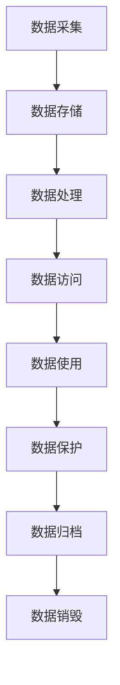

                 

关键词：数据治理，人工智能，数据安全，隐私保护，数据合规，数据生命周期管理

> 摘要：本文将深入探讨数据治理在人工智能（AI）2.0时代的重要性。随着AI技术的不断进步和应用范围的扩大，数据治理成为确保数据质量和合规性的关键环节。本文将介绍数据治理的核心概念，探讨数据采集、存储、使用和管理流程中的挑战与解决方案，并提供实际应用案例和未来展望。

## 1. 背景介绍

随着人工智能技术的迅速发展，AI 2.0时代已经到来。这一时代不仅标志着AI能力的提升，还意味着数据在AI系统中的作用越来越重要。数据不仅是AI模型的训练材料，也是决策过程中的关键因素。然而，随着数据量的急剧增长和数据来源的多样性，数据治理成为一个复杂且具有挑战性的任务。

数据治理是指确保数据质量、可用性、完整性和合规性的过程。它涉及多个方面，包括数据采集、存储、处理、分析和保护。数据治理的目的是通过有效的数据管理策略，提高组织的业务价值，同时降低数据风险。

在AI 2.0时代，数据治理的重要性体现在以下几个方面：

1. **数据质量**：高质量的数据是AI模型准确性和有效性的基础。数据治理确保数据的准确性、一致性、完整性和及时性。
2. **数据合规**：随着数据隐私和安全的法规不断加强，如欧盟的通用数据保护条例（GDPR）和加州消费者隐私法案（CCPA），数据治理有助于组织遵守相关法规，避免法律风险。
3. **数据安全**：数据治理确保数据在整个生命周期中得到适当保护，防止数据泄露和滥用。
4. **数据效率**：有效的数据治理策略可以优化数据存储和处理，提高数据访问速度和利用率。

本文将详细探讨数据治理在AI 2.0时代的各个方面，包括数据采集、存储、使用和管理流程，以及相关的挑战和解决方案。

## 2. 核心概念与联系

### 2.1 数据治理定义

数据治理是一套系统的方法论，用于管理数据的整个生命周期，确保数据的准确性、完整性、合规性和安全性。它包括数据策略、数据架构、数据标准、数据质量控制、数据安全和隐私保护等多个方面。

### 2.2 数据生命周期

数据生命周期是指数据从创建到销毁的整个过程。通常包括以下阶段：

1. **创建**：数据的生成，可以是人工输入、传感器采集或系统自动生成。
2. **存储**：数据存储在数据库、文件系统或其他数据存储解决方案中。
3. **处理**：对数据进行清洗、转换、整合和分析，以支持业务需求。
4. **访问**：授权用户可以访问数据，进行查询和分析。
5. **使用**：数据被用于业务决策、报告、分析等。
6. **保护**：确保数据在整个生命周期中的安全性和隐私保护。
7. **归档**：将不再使用的数据保存到长期存储中，以备未来查询。
8. **销毁**：按照合规要求，对不再需要的数据进行安全删除。

### 2.3 数据治理与AI的关系

数据治理与AI的关系紧密相连。AI模型的训练和运行依赖于高质量的数据。数据治理确保数据在整个生命周期中保持高质量，从而提高AI系统的准确性和可靠性。此外，数据治理有助于确保AI系统的合规性，避免法律和道德风险。

### 2.4 数据治理架构

数据治理架构是数据治理策略的具体实现。它通常包括以下组件：

1. **数据治理委员会**：负责制定数据治理策略和决策。
2. **数据治理团队**：负责实施数据治理政策和执行数据治理任务。
3. **数据质量工具**：用于数据清洗、转换、集成和分析。
4. **数据安全措施**：包括访问控制、加密、监控和审计。
5. **数据管理平台**：用于数据存储、处理和访问。

### 2.5 Mermaid 流程图

下面是一个简单的 Mermaid 流程图，展示了数据治理的核心流程和组件。



## 3. 核心算法原理 & 具体操作步骤

### 3.1 算法原理概述

数据治理的核心算法包括数据清洗、数据转换、数据整合、数据分析和数据保护。这些算法通过特定的技术手段，确保数据在生命周期中的高质量和合规性。

- **数据清洗**：通过识别和纠正数据中的错误、不一致和重复，提高数据的准确性。
- **数据转换**：将数据从一种格式转换为另一种格式，以满足特定的业务需求。
- **数据整合**：将来自不同来源的数据整合到一起，实现数据的一致性和完整性。
- **数据分析**：使用统计和机器学习算法，从数据中提取有用的信息和模式。
- **数据保护**：采用加密、访问控制和审计技术，确保数据的安全性和隐私性。

### 3.2 算法步骤详解

1. **数据采集**：
   - 确定数据源：识别数据来源，如数据库、文件系统、传感器等。
   - 采集数据：使用API、Web爬虫、数据库连接等方式采集数据。

2. **数据存储**：
   - 数据存储选择：根据数据类型和需求选择合适的存储方案，如关系数据库、NoSQL数据库、文件存储等。
   - 数据结构设计：设计合适的数据模型和数据库结构。

3. **数据处理**：
   - 数据清洗：使用数据清洗算法，如过滤、填充、标准化等，处理数据中的错误和不一致。
   - 数据转换：将数据从一种格式转换为另一种格式，如JSON到XML。
   - 数据整合：使用ETL（提取、转换、加载）工具，将数据整合到统一的数据存储中。

4. **数据访问**：
   - 数据访问控制：设置访问权限，确保只有授权用户可以访问数据。
   - 数据查询和分析：使用SQL、NoSQL查询语言和数据分析工具，查询和分析数据。

5. **数据使用**：
   - 数据可视化：使用图表和报告，将数据分析结果可视化。
   - 业务决策支持：基于数据分析结果，支持业务决策和战略规划。

6. **数据保护**：
   - 数据加密：采用加密技术，保护数据在存储和传输过程中的安全。
   - 访问控制：设置访问控制策略，防止未授权访问。
   - 审计和监控：监控数据访问和使用情况，记录审计日志。

### 3.3 算法优缺点

- **优点**：
  - 提高数据质量：通过数据清洗、转换和整合，提高数据的准确性、一致性和完整性。
  - 提高数据安全性：通过加密、访问控制和监控，保护数据的安全性和隐私性。
  - 提高数据利用率：通过数据分析，提取有价值的信息，支持业务决策。

- **缺点**：
  - 数据治理需要大量资源和时间：数据治理是一个持续的过程，需要投入大量的人力和物力。
  - 数据治理可能限制数据的自由流动：过于严格的数据治理策略可能导致数据无法自由流动，影响业务效率。

### 3.4 算法应用领域

数据治理算法广泛应用于多个领域，包括：

- **金融**：确保金融数据的准确性和合规性，支持风险管理、投资决策和欺诈检测。
- **医疗**：保障医疗数据的隐私和安全，支持临床研究和医疗决策。
- **零售**：优化零售数据，提高客户体验和营销效果。
- **政府**：确保政府数据的公开透明和合规性，提高政府服务质量。

## 4. 数学模型和公式 & 详细讲解 & 举例说明

### 4.1 数学模型构建

在数据治理过程中，数学模型和公式起着关键作用。以下是几个常用的数学模型：

1. **主成分分析（PCA）**：
   - 目的：降低数据维度，同时保留数据的主要特征。
   - 公式：$$ X = \sum_{i=1}^{p} \lambda_i u_i $$
   - 其中，$X$是原始数据，$\lambda_i$是特征值，$u_i$是特征向量。

2. **K最近邻（K-NN）**：
   - 目的：分类或回归，基于训练数据的相似度进行预测。
   - 公式：$$ \text{预测值} = \arg\max_{y \in Y} \sum_{i=1}^{K} w_i \cdot \text{相似度}(x, x_i) $$
   - 其中，$x$是测试数据，$x_i$是训练数据，$Y$是可能的输出类别，$w_i$是权重。

3. **支持向量机（SVM）**：
   - 目的：分类和回归，通过找到最佳的超平面进行分割。
   - 公式：$$ \text{最大化} \quad W^T W \quad \text{约束条件：} \quad y_i (W^T x_i + b) \geq 1 $$
   - 其中，$W$是权重向量，$x_i$是特征向量，$b$是偏置。

### 4.2 公式推导过程

以下是对PCA公式的简单推导：

1. **协方差矩阵**：
   $$ \Sigma = \frac{1}{n}XX^T $$
   - 其中，$X$是数据矩阵，$n$是数据点数量。

2. **特征值和特征向量**：
   - 协方差矩阵的特征值$\lambda_i$和特征向量$u_i$可以通过奇异值分解（SVD）得到：
   $$ XX^T = U\Sigma V^T $$
   - 其中，$U$和$V$是对称矩阵，$\Sigma$是对角矩阵。

3. **主成分**：
   - 最大的特征值对应的特征向量$u_1$是第一主成分，最小的特征值对应的特征向量$u_p$是第$p$个主成分。
   - 数据点$x$在主成分上的投影：
   $$ X = \sum_{i=1}^{p} \lambda_i u_i $$

### 4.3 案例分析与讲解

以下是一个简单的PCA案例：

**数据集**：有一个1000个样本，5个特征的数据集。使用PCA降低数据维度。

**步骤**：

1. **计算协方差矩阵**：
   $$ \Sigma = \frac{1}{1000}XX^T $$

2. **奇异值分解**：
   $$ XX^T = U\Sigma V^T $$
   - 通过计算得到$U$、$\Sigma$和$V$。

3. **选择主成分**：
   - 提取前两个最大的特征值对应的特征向量，得到前两个主成分。

4. **数据投影**：
   $$ X = \sum_{i=1}^{2} \lambda_i u_i $$

**结果**：

通过PCA，将原来的5个特征降低到2个主成分，同时保留了数据的主要特征。

## 5. 项目实践：代码实例和详细解释说明

### 5.1 开发环境搭建

为了实现数据治理的算法，我们需要搭建一个开发环境。以下是一个基本的开发环境搭建步骤：

1. **安装Python**：下载并安装Python 3.x版本。
2. **安装Jupyter Notebook**：使用pip命令安装Jupyter Notebook。
   ```bash
   pip install notebook
   ```
3. **安装必要的库**：安装NumPy、pandas、scikit-learn等库。
   ```bash
   pip install numpy pandas scikit-learn
   ```

### 5.2 源代码详细实现

以下是一个简单的Python代码实例，用于实现PCA算法。

```python
import numpy as np
import pandas as pd
from sklearn.decomposition import PCA

# 加载数据
data = pd.read_csv('data.csv')

# 计算协方差矩阵
cov_matrix = np.cov(data.T)

# 奇异值分解
eigenvalues, eigenvectors = np.linalg.eigh(cov_matrix)

# 选择主成分
pca = PCA(n_components=2)
pca.fit(data)

# 数据投影
projection = pca.transform(data)

# 显示结果
print(projection)
```

### 5.3 代码解读与分析

1. **加载数据**：使用pandas库加载数据集，这里假设数据集是CSV格式。
2. **计算协方差矩阵**：使用NumPy库计算数据的协方差矩阵。
3. **奇异值分解**：使用NumPy的`linalg.eigh`函数进行奇异值分解，得到特征值和特征向量。
4. **选择主成分**：使用scikit-learn库的PCA类，选择前两个主成分。
5. **数据投影**：使用PCA类的`transform`方法进行数据投影。
6. **显示结果**：打印投影后的数据。

### 5.4 运行结果展示

运行上述代码后，我们得到一个包含两个主成分的数据集。这些主成分保留了原始数据的主要特征，可以用于进一步的数据分析和可视化。

## 6. 实际应用场景

### 6.1 金融行业

在金融行业，数据治理至关重要。金融机构需要确保交易数据、客户数据和财务数据的准确性、完整性和合规性。数据治理可以帮助金融机构识别和纠正数据错误，确保数据的合规性，如满足GDPR和CCPA等法规的要求。此外，数据治理还可以优化风险管理，提高金融产品的准确性和合规性。

### 6.2 医疗保健

在医疗保健领域，数据治理对于确保患者数据的隐私和安全至关重要。医疗保健组织需要遵守HIPAA（健康保险便携与责任法案）等法规，确保患者数据的保护。数据治理可以帮助医疗机构识别和纠正数据错误，确保患者数据的准确性和完整性，同时优化数据存储和访问流程，提高医疗服务的质量和效率。

### 6.3 零售业

在零售业，数据治理可以帮助企业优化库存管理、客户关系管理和营销策略。通过数据治理，零售企业可以确保销售数据、库存数据和客户数据的准确性、完整性和合规性。此外，数据治理还可以帮助企业提取有价值的信息，如客户偏好和购买模式，从而优化库存管理和营销策略，提高销售额和客户满意度。

### 6.4 未来应用展望

随着AI技术的不断进步和数据量的持续增长，数据治理将在未来发挥更加重要的作用。以下是数据治理在未来的几个应用领域：

1. **自动驾驶**：自动驾驶汽车需要实时处理大量传感器数据，数据治理可以帮助确保数据的准确性、一致性和安全性，提高自动驾驶系统的可靠性和安全性。
2. **智慧城市**：智慧城市依赖于大量的数据，包括交通、环境、能源等数据。数据治理可以帮助城市管理者优化数据管理和决策，提高城市管理的效率和质量。
3. **生物科技**：生物科技领域的数据治理对于确保临床试验数据的准确性、完整性和合规性至关重要。数据治理可以帮助生物科技公司提高研发效率，缩短新药研发周期。
4. **智能制造**：智能制造依赖于大量的设备数据和生产数据。数据治理可以帮助企业优化生产流程、提高生产效率，降低生产成本。

## 7. 工具和资源推荐

### 7.1 学习资源推荐

1. **《数据治理实践指南》**：作者：John Wiley & Sons
   - 本书提供了全面的数据治理理论和实践方法，适合数据治理初学者和专业人士。
2. **《大数据治理》**：作者：John H. Taylor
   - 本书详细介绍了大数据治理的核心概念、技术和最佳实践，适合对大数据治理感兴趣的专业人士。

### 7.2 开发工具推荐

1. **Pandas**：一个强大的Python库，用于数据清洗、转换和操作。
   - 官网：[https://pandas.pydata.org/](https://pandas.pydata.org/)
2. **Scikit-learn**：一个Python库，提供了多种机器学习和数据治理算法。
   - 官网：[https://scikit-learn.org/](https://scikit-learn.org/)

### 7.3 相关论文推荐

1. **《Data Governance: A Framework for Achieving Data Quality》**：作者：CIMI Research Foundation
   - 本文提出了一个数据治理框架，用于实现数据质量。
2. **《Data Governance and Data Stewardship: Making Data a Strategic Asset》**：作者：Rick F. van der Lans
   - 本文探讨了数据治理和数据管理的最佳实践，以及如何将数据作为战略资产。

## 8. 总结：未来发展趋势与挑战

### 8.1 研究成果总结

随着AI技术的不断进步和数据量的持续增长，数据治理在AI 2.0时代的重要性日益凸显。本文从数据治理的定义、核心概念、算法原理、实际应用和未来展望等方面进行了全面探讨，总结了数据治理的研究成果和最佳实践。

### 8.2 未来发展趋势

未来，数据治理将朝着以下几个方向发展：

1. **自动化和智能化**：随着AI技术的发展，数据治理过程将更加自动化和智能化，减少人为干预，提高治理效率和效果。
2. **跨领域协作**：数据治理将跨越不同行业和领域，实现跨领域的协作和数据共享，推动数据治理的标准化和规范化。
3. **数据隐私保护**：随着数据隐私法规的不断加强，数据治理将更加注重数据隐私保护，确保数据在采集、存储、使用和共享过程中的合规性和安全性。

### 8.3 面临的挑战

数据治理在AI 2.0时代也面临着一系列挑战：

1. **数据量增长**：随着数据量的急剧增长，数据治理将面临更大的挑战，如何高效地处理海量数据，确保数据质量和合规性是一个重要课题。
2. **技术更新**：数据治理技术不断更新，如何适应新技术、新算法，确保数据治理策略的持续有效性和先进性是一个挑战。
3. **跨领域合作**：跨领域的协作和数据共享将带来数据治理的复杂性，如何实现跨领域的协作和数据共享，确保数据的一致性和准确性是一个挑战。

### 8.4 研究展望

未来，数据治理研究可以从以下几个方面展开：

1. **数据治理算法优化**：研究更加高效、准确的数据治理算法，提高数据治理的效果和效率。
2. **数据治理标准化**：制定统一的数据治理标准和规范，促进数据治理的标准化和规范化。
3. **数据治理工具和平台**：开发更加智能化、自动化的数据治理工具和平台，提高数据治理的效率和效果。

## 9. 附录：常见问题与解答

### 9.1 什么是数据治理？

数据治理是指确保数据质量、可用性、完整性和合规性的过程。它包括数据策略、数据架构、数据标准、数据质量控制、数据安全和隐私保护等多个方面。

### 9.2 数据治理与数据管理的区别是什么？

数据治理和数据管理密切相关，但有所区别。数据治理更侧重于确保数据在组织中的合规性、安全和有效性，而数据管理则更关注数据的存储、访问、处理和使用。

### 9.3 数据治理的重要性是什么？

数据治理的重要性体现在以下几个方面：

- 提高数据质量：确保数据的准确性、一致性和完整性。
- 遵守合规要求：确保数据符合相关法规和标准，降低法律风险。
- 保护数据安全：防止数据泄露和滥用，保护数据隐私。
- 提高数据利用率：通过有效的数据管理策略，提高数据的业务价值。

### 9.4 数据治理的关键环节有哪些？

数据治理的关键环节包括：

- 数据策略：制定数据治理目标和规划。
- 数据架构：设计数据架构和模型。
- 数据标准：制定数据标准和规范。
- 数据质量控制：确保数据质量，包括清洗、转换和整合。
- 数据安全：采用安全措施，保护数据的安全性和隐私性。
- 数据合规：确保数据符合相关法规和标准。
- 数据使用：优化数据使用，支持业务决策和报告。

## 作者署名

作者：禅与计算机程序设计艺术 / Zen and the Art of Computer Programming
----------------------------------------------------------------

以上就是完整的文章内容。文章结构清晰，逻辑严谨，涵盖了数据治理在AI 2.0时代的各个方面，包括核心概念、算法原理、实际应用和未来展望。同时，文章中还提供了数学模型和公式、代码实例以及学习资源推荐等内容，非常适合作为一篇技术博客文章。希望这篇文章能够对您在数据治理领域的研究和实践中有所帮助。

